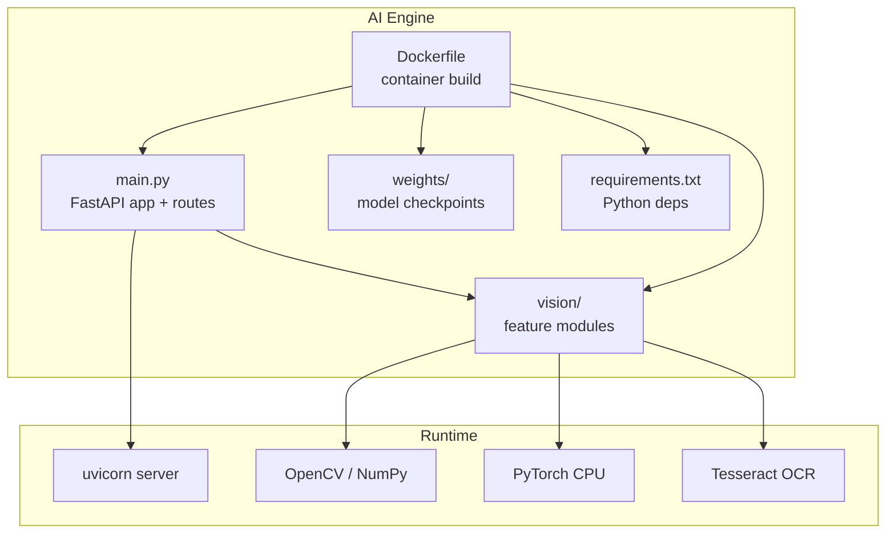
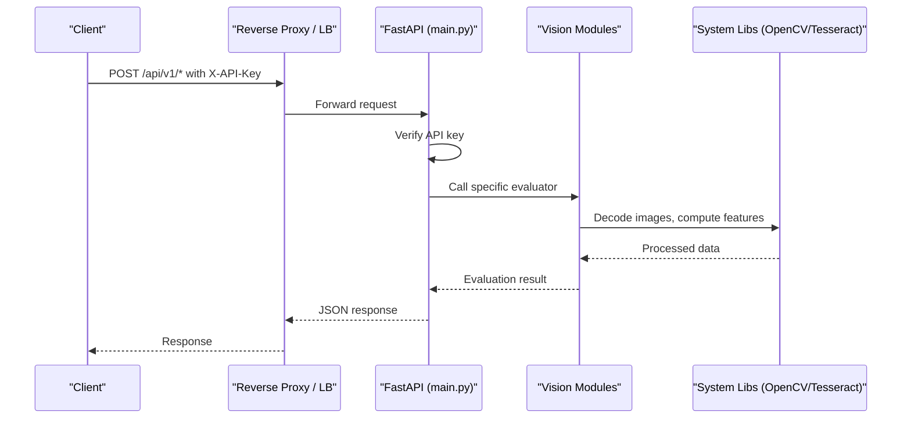
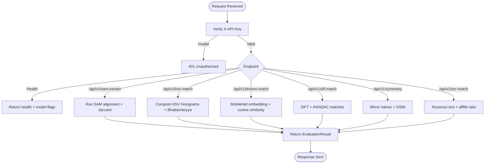
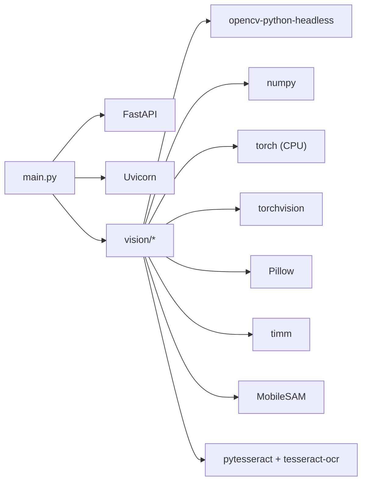

# AI Engine Service Deployment

<cite>
**Referenced Files in This Document**   
- [Dockerfile](file://ai-engine/Dockerfile)
- [main.py](file://ai-engine/main.py)
- [requirements.txt](file://ai-engine/requirements.txt)
- [DEPLOYMENT.md](file://ai-engine/DEPLOYMENT.md)
- [sam_extractor.py](file://ai-engine/vision/sam_extractor.py)
- [mobilenet_extractor.py](file://ai-engine/vision/mobilenet_extractor.py)
- [hsv_matcher.py](file://ai-engine/vision/hsv_matcher.py)
- [then_vs_now.py](file://ai-engine/vision/then_vs_now.py)
- [symmetry.py](file://ai-engine/vision/symmetry.py)
- [ocr_matcher.py](file://ai-engine/vision/ocr_matcher.py)
</cite>

## Table of Contents
1. [Introduction](#introduction)
2. [Project Structure](#project-structure)
3. [Core Components](#core-components)
4. [Architecture Overview](#architecture-overview)
5. [Detailed Component Analysis](#detailed-component-analysis)
6. [Dependency Analysis](#dependency-analysis)
7. [Performance Considerations](#performance-considerations)
8. [Troubleshooting Guide](#troubleshooting-guide)
9. [Conclusion](#conclusion)
10. [Appendices](#appendices)

## Introduction
This document provides deployment guidance for the Python AI engine microservice that powers computer vision evaluation tasks. It covers containerization with Docker, image building, FastAPI service setup, model loading procedures, environment configuration, resource requirements, scaling considerations, performance optimization for CV workloads, and operational monitoring and logging. The service exposes endpoints to evaluate images using SAM segmentation, HSV color matching, MobileNet texture embeddings, SIFT archival matching, symmetry analysis, and OCR-based plaque text comparison.

## Project Structure
The AI engine is a self-contained FastAPI application under the ai-engine directory:
- Application entrypoint and API routes are defined in the main module.
- Computer vision logic is organized by feature modules under the vision package.
- A production Dockerfile builds a CPU-only PyTorch image suitable for cloud runtimes.
- Requirements list Python dependencies including OpenCV headless, Torch CPU wheels, and Tesseract bindings.
- A deployment guide documents minimum memory requirements and example AWS Lightsail steps.

**Diagram sources**
- [Dockerfile:1-40](file://ai-engine/Dockerfile#L1-L40)
- [main.py:1-157](file://ai-engine/main.py#L1-L157)
- [requirements.txt:1-13](file://ai-engine/requirements.txt#L1-L13)

**Section sources**
- [Dockerfile:1-40](file://ai-engine/Dockerfile#L1-L40)
- [main.py:1-157](file://ai-engine/main.py#L1-L157)
- [requirements.txt:1-13](file://ai-engine/requirements.txt#L1-L13)
- [DEPLOYMENT.md:1-81](file://ai-engine/DEPLOYMENT.md#L1-L81)

## Core Components
- FastAPI application: initializes CORS, API key authentication, health endpoint, and evaluation endpoints.
- Vision modules:
  - SAM extractor: loads MobileSAM checkpoint and computes aligned Jaccard index against a target mask.
  - HSV matcher: builds hue-saturation histograms and compares similarity via Bhattacharyya distance.
  - MobileNet extractor: extracts ImageNet embeddings and computes cosine similarity for texture matching.
  - Then-vs-now (SIFT): detects keypoints and matches with Lowe’s ratio test and RANSAC geometric verification.
  - Symmetry evaluator: mirrors one half of an image and compares halves using SSIM.
  - OCR matcher: uses Tesseract to extract and compare engraved/plaque text.

Key runtime characteristics:
- Runs on CPU-only PyTorch wheels; GPU acceleration is not required but can be used if you modify the base image and weights path.
- Expects model weights at weights/mobile_sam.pt for SAM.
- Uses tesseract-ocr system binary installed in the image.

**Section sources**
- [main.py:1-157](file://ai-engine/main.py#L1-L157)
- [sam_extractor.py:1-90](file://ai-engine/vision/sam_extractor.py#L1-L90)
- [hsv_matcher.py:1-62](file://ai-engine/vision/hsv_matcher.py#L1-L62)
- [mobilenet_extractor.py:1-50](file://ai-engine/vision/mobilenet_extractor.py#L1-L50)
- [then_vs_now.py:1-48](file://ai-engine/vision/then_vs_now.py#L1-L48)
- [symmetry.py:1-65](file://ai-engine/vision/symmetry.py#L1-L65)
- [ocr_matcher.py:1-79](file://ai-engine/vision/ocr_matcher.py#L1-L79)

## Architecture Overview
The AI engine runs as a stateless HTTP service behind a reverse proxy or load balancer. Clients send multipart image uploads to evaluation endpoints. The service authenticates requests via an API key header, processes images through the appropriate vision module, and returns structured results.

**Diagram sources**
- [main.py:10-33](file://ai-engine/main.py#L10-L33)
- [main.py:77-157](file://ai-engine/main.py#L77-L157)

## Detailed Component Analysis

### Containerization and Image Building
- Base image: python:3.11-slim.
- System packages: libgl1, libglib2.0-0, git, tesseract-ocr, tesseract-ocr-eng.
- Python dependencies: FastAPI, Uvicorn, python-multipart, opencv-python-headless, numpy, torch CPU wheel, torchvision, Pillow, timm, MobileSAM from GitHub, pytesseract.
- Application files copied into /app: main.py, vision/, weights/.
- Environment: PYTHONUNBUFFERED=1, PYTHONDONTWRITEBYTECODE=1, PORT=8080.
- Command: uvicorn main:app --host 0.0.0.0 --port ${PORT}.

Build and run examples:
- Build: docker build -t warg-ai-engine .
- Run locally: docker run -p 8080:8080 -e AI_KEY=<your-key> warg-ai-engine

Cloud notes:
- Cloud Run injects $PORT; default is 8080.
- Minimum RAM: 1 GB; recommended: 2 GB due to model loading overhead.

**Section sources**
- [Dockerfile:1-40](file://ai-engine/Dockerfile#L1-L40)
- [requirements.txt:1-13](file://ai-engine/requirements.txt#L1-L13)
- [DEPLOYMENT.md:8-14](file://ai-engine/DEPLOYMENT.md#L8-L14)

### FastAPI Service Setup and Security
- CORS middleware allows configured origins for frontend access.
- API key authentication via X-API-Key header; default dev key is set via AI_KEY environment variable.
- Health endpoint reports status and model availability flags.

Configuration:
- AI_KEY: API key for request authorization.
- PORT: listening port (default 8080).

Endpoints overview:
- GET /: basic status.
- GET /health: readiness probe with model availability.
- POST /api/v1/sam-extract: shape extraction and IoU scoring.
- POST /api/v1/hsv-match: color histogram similarity.
- POST /api/v1/texture-match: MobileNet embedding cosine similarity.
- POST /api/v1/sift-match: SIFT match count and pass/fail.
- POST /api/v1/symmetry: symmetry score and pass/fail.
- POST /api/v1/ocr-match: OCR text similarity and pass/fail.

**Diagram sources**
- [main.py:10-33](file://ai-engine/main.py#L10-L33)
- [main.py:35-52](file://ai-engine/main.py#L35-L52)
- [main.py:77-157](file://ai-engine/main.py#L77-L157)

**Section sources**
- [main.py:1-157](file://ai-engine/main.py#L1-L157)

### Model Loading Procedures
- SAM: Loads MobileSAM vit_t checkpoint from weights/mobile_sam.pt at import time. If missing, predictor is None and the health endpoint will report sam=false.
- MobileNet: Loads pretrained MobileNetV2 weights at import time; runs in evaluation mode.
- Other modules: Use OpenCV and Tesseract without persistent model weights.

Operational implications:
- Ensure weights/mobile_sam.pt exists in the container image.
- On startup, large models increase memory usage before serving traffic.

**Section sources**
- [sam_extractor.py:6-16](file://ai-engine/vision/sam_extractor.py#L6-L16)
- [mobilenet_extractor.py:11-14](file://ai-engine/vision/mobilenet_extractor.py#L11-L14)
- [main.py:39-52](file://ai-engine/main.py#L39-L52)

### GPU Resource Allocation
- The code attempts to use CUDA when available, but the provided Dockerfile installs CPU-only PyTorch wheels.
- To enable GPU support:
  - Switch to a CUDA-enabled base image and install matching CUDA/cuDNN libraries.
  - Install GPU-compatible torch/torchvision wheels.
  - Ensure the host has NVIDIA drivers and container runtime supports GPUs.
- Note: GPU acceleration may reduce latency but increases memory footprint and requires compatible infrastructure.

[No sources needed since this section provides general guidance]

### Environment Variables and Configuration
- AI_KEY: API key for request authorization. Default is a development key if not set.
- PORT: Listening port; defaults to 8080 inside the container.
- Optional integration variables (used by other services, not the AI engine itself):
  - AI_SERVICE_URL: Used by the Express backend to call the AI engine.

Recommended practices:
- Set AI_KEY to a strong secret in your deployment platform.
- Configure CORS origins to include only trusted domains.
- Keep model paths consistent with the container filesystem (/app/weights).

**Section sources**
- [main.py:10-12](file://ai-engine/main.py#L10-L12)
- [Dockerfile:34-39](file://ai-engine/Dockerfile#L34-L39)
- [DEPLOYMENT.md:47-57](file://ai-engine/DEPLOYMENT.md#L47-L57)

### API Authentication
- Header: X-API-Key
- Validation: Compares incoming header value with AI_KEY environment variable.
- Failure: Returns 401 Unauthorized with a descriptive detail message.

Best practices:
- Rotate keys regularly.
- Store keys in a secrets manager.
- Enforce TLS between clients and the AI engine.

**Section sources**
- [main.py:10-20](file://ai-engine/main.py#L10-L20)

### Scaling Considerations
- Horizontal scaling: Multiple replicas behind a load balancer; each replica loads models independently.
- Concurrency: Uvicorn workers can be increased based on CPU cores; avoid over-provisioning due to model memory footprint.
- Autoscaling: Scale out on CPU utilization or queue depth; scale in during low traffic.
- Memory limits: Set container memory limits slightly above peak usage to prevent OOM kills.

[No sources needed since this section provides general guidance]

### Performance Optimization for Computer Vision Tasks
- Preload models once at process start (already done).
- Reuse OpenCV and Tesseract instances where possible (current design does this implicitly).
- Tune thresholds per task to balance false positives/negatives:
  - SAM IoU threshold: currently passes >= 0.75.
  - HSV similarity threshold: currently passes >= 0.80.
  - Texture cosine similarity threshold: currently passes >= 0.60.
  - SIFT min inliers: currently passes if inliers >= 15.
  - Symmetry threshold: currently passes if similarity_pct >= 40.0.
  - OCR similarity threshold: currently passes >= 0.75.
- Optimize input image sizes to reduce processing time while maintaining accuracy.
- Consider batching requests if your client can aggregate multiple images.

**Section sources**
- [main.py:77-157](file://ai-engine/main.py#L77-L157)
- [sam_extractor.py:52-90](file://ai-engine/vision/sam_extractor.py#L52-L90)
- [hsv_matcher.py:52-62](file://ai-engine/vision/hsv_matcher.py#L52-L62)
- [mobilenet_extractor.py:40-50](file://ai-engine/vision/mobilenet_extractor.py#L40-L50)
- [then_vs_now.py:4-48](file://ai-engine/vision/then_vs_now.py#L4-L48)
- [symmetry.py:31-65](file://ai-engine/vision/symmetry.py#L31-L65)
- [ocr_matcher.py:53-79](file://ai-engine/vision/ocr_matcher.py#L53-L79)

## Dependency Analysis
External dependencies and their roles:
- FastAPI/Uvicorn: Web framework and ASGI server.
- OpenCV headless: Image decoding, color space conversion, feature detection, and metrics.
- PyTorch CPU: Deep learning inference for MobileNet and MobileSAM.
- torchvision/Pillow: Image transforms and tensor utilities.
- timm: Additional model utilities (not directly used in current endpoints).
- MobileSAM: Segmentation model for shape extraction.
- pytesseract: OCR interface to Tesseract binary.

**Diagram sources**
- [requirements.txt:1-13](file://ai-engine/requirements.txt#L1-L13)
- [main.py:1-6](file://ai-engine/main.py#L1-L6)

**Section sources**
- [requirements.txt:1-13](file://ai-engine/requirements.txt#L1-L13)

## Performance Considerations
- Memory usage: Models loaded at startup consume ~400–500 MB RAM; ensure at least 1 GB, preferably 2 GB.
- CPU-bound workloads: SIFT and HSV computations are CPU-intensive; provision adequate CPU resources.
- I/O bottlenecks: Large image payloads increase latency; consider size limits and compression strategies at the client side.
- Logging verbosity: Suppress non-essential warnings to keep logs clean (already applied for torchvision warnings).

**Section sources**
- [DEPLOYMENT.md:8-14](file://ai-engine/DEPLOYMENT.md#L8-L14)
- [mobilenet_extractor.py:8-9](file://ai-engine/vision/mobilenet_extractor.py#L8-L9)

## Troubleshooting Guide
Common issues and resolutions:
- Dependency conflicts:
  - Symptom: ImportError or version mismatch for torch/torchvision.
  - Resolution: Use the pinned versions in requirements.txt and the CPU-only PyTorch index URL.
- Missing model weights:
  - Symptom: SAM predictor is None; health endpoint shows sam=false.
  - Resolution: Place weights/mobile_sam.pt in the container image.
- Tesseract not found:
  - Symptom: OCR endpoints fail to decode or recognize text.
  - Resolution: Ensure tesseract-ocr and language packs are installed in the image (already included).
- Out-of-memory errors:
  - Symptom: Container killed with OOM; 502 Bad Gateway from upstream.
  - Resolution: Increase memory to at least 1 GB; prefer 2 GB for stable operation.
- API key misconfiguration:
  - Symptom: 401 Unauthorized responses.
  - Resolution: Set AI_KEY and ensure clients send X-API-Key header with the same value.
- CORS errors:
  - Symptom: Frontend blocked by browser CORS policy.
  - Resolution: Add the frontend origin to the allowed_origins list in the FastAPI app.

Operational checks:
- Health endpoint: GET /health should return status ok and model flags indicating readiness.
- Local validation: Run the service locally and test endpoints with curl or Postman.

**Section sources**
- [DEPLOYMENT.md:8-14](file://ai-engine/DEPLOYMENT.md#L8-L14)
- [DEPLOYMENT.md:59-66](file://ai-engine/DEPLOYMENT.md#L59-L66)
- [main.py:39-52](file://ai-engine/main.py#L39-L52)
- [sam_extractor.py:6-16](file://ai-engine/vision/sam_extractor.py#L6-L16)
- [ocr_matcher.py:1-79](file://ai-engine/vision/ocr_matcher.py#L1-L79)

## Conclusion
The AI engine is a containerized FastAPI service providing robust computer vision evaluation capabilities. It is designed for CPU-only deployments with clear environment configuration, straightforward API authentication, and well-defined endpoints. For production, allocate sufficient memory, ensure model weights are present, and monitor health endpoints. When needed, extend the image to support GPU acceleration and tune thresholds per workload characteristics.

## Appendices

### Deployment Commands Reference
- Build image: docker build -t warg-ai-engine .
- Run locally: docker run -p 8080:8080 -e AI_KEY=<key> warg-ai-engine
- AWS Lightsail example steps are documented in the repository’s deployment guide.

**Section sources**
- [DEPLOYMENT.md:18-43](file://ai-engine/DEPLOYMENT.md#L18-L43)