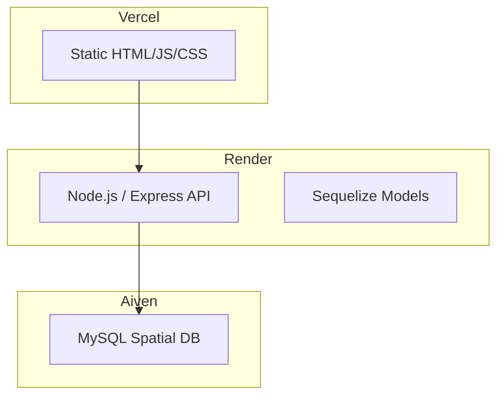
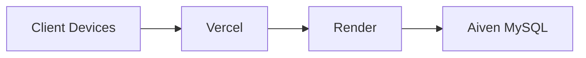
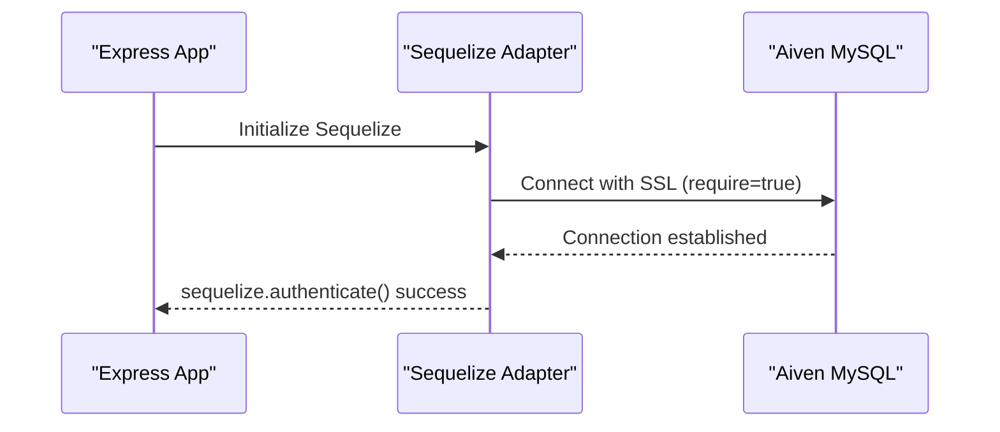
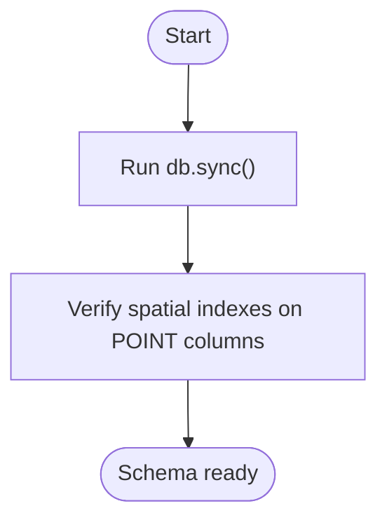
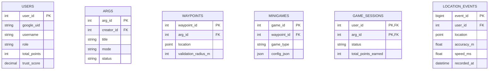
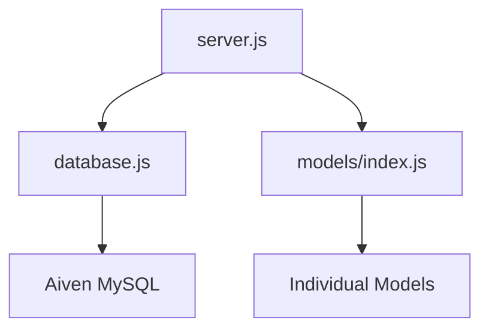

# Aiven Database Setup

<cite>
**Referenced Files in This Document**
- [schema.sql](file://database/schema.sql)
- [database.js](file://server/src/config/database.js)
- [deployment-guide.md](file://warg-docs/docs/4-deployment/deployment-guide.md)
- [schema.md](file://warg-docs/docs/3-database/schema.md)
- [server.js](file://server/server.js)
- [models/index.js](file://server/src/models/index.js)
</cite>

## Table of Contents
1. [Introduction](#introduction)
2. [Project Structure](#project-structure)
3. [Core Components](#core-components)
4. [Architecture Overview](#architecture-overview)
5. [Detailed Component Analysis](#detailed-component-analysis)
6. [Dependency Analysis](#dependency-analysis)
7. [Performance Considerations](#performance-considerations)
8. [Troubleshooting Guide](#troubleshooting-guide)
9. [Conclusion](#conclusion)
10. [Appendices](#appendices)

## Introduction
This document provides comprehensive database deployment guidance for the WARG Platform using Aiven MySQL. It covers provisioning, connection configuration, security settings, schema initialization, spatial extension setup, performance tuning, backup and restore procedures, monitoring, scaling considerations, SSL/TLS configuration, firewall rules, access control lists, common issues, maintenance procedures, and production best practices. The content is grounded in the repository’s schema, server configuration, and deployment documentation.

## Project Structure
The database layer consists of:
- A declarative MySQL schema with spatial extensions (SRID 4326 / WGS 84).
- A Node.js backend that connects to Aiven MySQL via Sequelize with SSL enabled.
- Deployment documentation describing Aiven service creation, environment variables, and operational guidance.

**Diagram sources**
- [deployment-guide.md:18-52](file://warg-docs/docs/4-deployment/deployment-guide.md#L18-L52)

**Section sources**
- [deployment-guide.md:1-52](file://warg-docs/docs/4-deployment/deployment-guide.md#L1-L52)

## Core Components
- Aiven MySQL service with spatial extensions enabled.
- Sequelize-based database adapter configured for SSL and connection pooling.
- Declarative schema defining users, ARGs, waypoints, minigames, sessions, progress, events, ratings, comments, flags, badges, leaderboards, analytics, push subscriptions, and audit logs.
- Server startup routine that authenticates the database connection and syncs models.

Key responsibilities:
- Provisioning and securing the Aiven MySQL instance.
- Initializing the schema and spatial indexes.
- Managing connections securely with SSL and robust retry logic.
- Monitoring and maintaining performance and availability.

**Section sources**
- [database.js:1-37](file://server/src/config/database.js#L1-L37)
- [schema.sql:1-691](file://database/schema.sql#L1-L691)
- [server.js:47-71](file://server/server.js#L47-L71)

## Architecture Overview
The platform uses a three-layer architecture:
- Frontend hosted on Vercel.
- Backend API hosted on Render.
- Managed MySQL database on Aiven with spatial extensions.

**Diagram sources**
- [deployment-guide.md:18-52](file://warg-docs/docs/4-deployment/deployment-guide.md#L18-L52)

## Detailed Component Analysis

### Aiven MySQL Service Provisioning
- Create an Aiven MySQL service in a region close to your Render backend to minimize latency.
- Use the free-tier Hobbyist plan for development; upgrade for production needs.
- Obtain the full Service URI from the Aiven console and set it as `DATABASE_URL`.
- Default schema name is `defaultdb`; you can create a dedicated schema if needed.

Operational notes:
- Automated daily backups are available on paid plans with point-in-time recovery.
- Monitor query performance via the Aiven console Metrics tab.
- Connection pool exhaustion is common on Hobbyist; keep Sequelize pool.max <= 5.

**Section sources**
- [deployment-guide.md:64-119](file://warg-docs/docs/4-deployment/deployment-guide.md#L64-L119)

### Connection Configuration and Security
- The backend uses Sequelize with MySQL dialect.
- SSL is required by Aiven; the adapter sets `ssl.require = true` and `rejectUnauthorized = false` in non-test environments.
- The `DATABASE_URL` may include `?ssl-mode=REQUIRED`; the adapter strips this suffix before passing to Sequelize.
- For production, download the CA certificate from Aiven and enable strict verification (`rejectUnauthorized: true`) with the CA file provided via the `ca` field.

Connection pool and retry behavior:
- Pool size: max 5, min 0, acquire timeout 60s, idle timeout 10s.
- Retry strategy matches multiple connection-related errors including timeouts and protocol loss.

**Diagram sources**
- [database.js:1-37](file://server/src/config/database.js#L1-L37)
- [server.js:50-60](file://server/server.js#L50-L60)

**Section sources**
- [database.js:1-37](file://server/src/config/database.js#L1-L37)
- [deployment-guide.md:88-102](file://warg-docs/docs/4-deployment/deployment-guide.md#L88-L102)

### Schema Initialization and Spatial Extension Setup
- The schema defines InnoDB tables with utf8mb4 charset and collation.
- Spatial data uses SRID 4326 (WGS 84) for POINT columns in waypoints and location_events.
- Spatial indexes are declared on geospatial columns to optimize proximity queries.
- Views provide computed metrics such as average rating per ARG and aggregated player stats.

Initialization steps:
- Run Sequelize sync to initialize the schema against Aiven MySQL.
- Ensure spatial indexes exist on POINT columns.

**Diagram sources**
- [schema.sql:1-691](file://database/schema.sql#L1-L691)
- [deployment-guide.md:104-113](file://warg-docs/docs/4-deployment/deployment-guide.md#L104-L113)

**Section sources**
- [schema.sql:1-691](file://database/schema.sql#L1-L691)
- [schema.md:1-205](file://warg-docs/docs/3-database/schema.md#L1-L205)
- [deployment-guide.md:104-113](file://warg-docs/docs/4-deployment/deployment-guide.md#L104-L113)

### Data Model Overview
The logical model includes:
- Users, social follows, friend requests, notifications, and push subscriptions.
- ARGs, waypoints, waypoint edges, minigames, assets.
- Game sessions, waypoint progress, minigame attempts.
- Location tracking and anti-spoofing events.
- Ratings, votes, comments, flags, badges, user badges, leaderboards, analytics, and admin audit logs.

**Diagram sources**
- [schema.md:15-55](file://warg-docs/docs/3-database/schema.md#L15-L55)
- [schema.md:61-129](file://warg-docs/docs/3-database/schema.md#L61-L129)
- [schema.sql:15-44](file://database/schema.sql#L15-L44)
- [schema.sql:160-179](file://database/schema.sql#L160-L179)
- [schema.sql:212-246](file://database/schema.sql#L212-L246)
- [schema.sql:287-304](file://database/schema.sql#L287-L304)
- [schema.sql:354-372](file://database/schema.sql#L354-L372)

**Section sources**
- [schema.md:1-205](file://warg-docs/docs/3-database/schema.md#L1-L205)
- [schema.sql:1-691](file://database/schema.sql#L1-L691)

### Backup and Restore Procedures
- Aiven performs automated daily backups on paid plans with point-in-time recovery.
- Use the Aiven console to manage backups and perform restores.
- Validate restored databases by running schema checks and verifying spatial indexes.

Best practices:
- Schedule regular test restores to ensure recoverability.
- Back up critical data before migrations or major changes.
- Monitor backup job statuses and retention policies.

**Section sources**
- [deployment-guide.md:115-119](file://warg-docs/docs/4-deployment/deployment-guide.md#L115-L119)

### Monitoring Setup
- Use the Aiven console Metrics tab to monitor query performance, CPU, memory, storage, and I/O.
- Track slow queries and adjust indexes accordingly.
- Set alerts for high connection usage and storage thresholds.

Integration tips:
- Correlate backend health checks with database connectivity logs.
- Use structured logging to capture connection errors and retries.

**Section sources**
- [deployment-guide.md:115-119](file://warg-docs/docs/4-deployment/deployment-guide.md#L115-L119)

### Scaling Considerations
- Connection pool exhaustion is common on Hobbyist; keep pool.max <= 5.
- Upgrade Aiven plans for higher concurrency and storage capacity.
- Partition high-volume tables like location_events by time ranges to improve query performance and manage growth.
- Consider read replicas for heavy read workloads if supported by your Aiven plan.

**Section sources**
- [deployment-guide.md:115-119](file://warg-docs/docs/4-deployment/deployment-guide.md#L115-L119)
- [schema.sql:352-372](file://database/schema.sql#L352-L372)

### SSL/TLS Connection Configuration
- Aiven enforces SSL; the adapter requires SSL and accepts self-signed CA certs in non-test environments.
- For production, use the CA certificate from Aiven and enable strict verification.

Steps:
- Download CA certificate from Aiven dashboard.
- Configure Sequelize dialectOptions to pass the CA file and set rejectUnauthorized to true.
- Ensure DATABASE_URL does not conflict with explicit SSL options.

**Section sources**
- [database.js:4-8](file://server/src/config/database.js#L4-L8)
- [deployment-guide.md:88-102](file://warg-docs/docs/4-deployment/deployment-guide.md#L88-L102)

### Firewall Rules and Access Control Lists
- Restrict backend access to Aiven MySQL by allowing only Render IP ranges or specific CIDR blocks.
- Use Aiven ACLs to limit database access to trusted networks.
- Avoid exposing the database publicly; rely on private networking where possible.

Operational checklist:
- Verify firewall rules allow outbound connections from Render to Aiven.
- Confirm ACLs permit inbound connections from backend IPs.
- Regularly review and rotate credentials.

[No sources needed since this section provides general guidance]

### Common Database Issues and Resolutions
- Connection timeouts: Increase acquire timeout and tune pool settings; verify network paths and firewall rules.
- Query performance problems: Add appropriate indexes, especially on frequently filtered columns; analyze slow queries in Aiven Metrics.
- Storage limitations: Monitor disk usage; archive or partition historical data; upgrade storage capacity.
- Spatial index issues: Ensure SRID 4326 is used consistently; validate geometry validity.

**Section sources**
- [database.js:15-34](file://server/src/config/database.js#L15-L34)
- [deployment-guide.md:115-119](file://warg-docs/docs/4-deployment/deployment-guide.md#L115-L119)

### Maintenance Procedures and Best Practices
- Keep Sequelize pool settings conservative for managed services.
- Enable structured logging and capture connection errors for observability.
- Perform periodic schema audits to ensure indexes align with query patterns.
- Rotate credentials and update CA certificates as needed.
- Test failover and restore procedures regularly.

**Section sources**
- [server.js:50-60](file://server/server.js#L50-L60)
- [database.js:15-34](file://server/src/config/database.js#L15-L34)

## Dependency Analysis
The backend depends on:
- Sequelize adapter for database connectivity and ORM operations.
- Models that define associations across entities.
- Server startup routine that authenticates the database and syncs models.

**Diagram sources**
- [server.js:1-10](file://server/server.js#L1-L10)
- [database.js:1-37](file://server/src/config/database.js#L1-L37)
- [models/index.js:1-23](file://server/src/models/index.js#L1-L23)

**Section sources**
- [server.js:1-71](file://server/server.js#L1-L71)
- [database.js:1-37](file://server/src/config/database.js#L1-L37)
- [models/index.js:1-135](file://server/src/models/index.js#L1-L135)

## Performance Considerations
- Connection pooling: Keep pool.max small for managed databases; tune acquire and idle timeouts based on workload.
- Indexing: Ensure primary keys, foreign keys, and frequent filter columns are indexed; add spatial indexes for geospatial queries.
- Query optimization: Use EXPLAIN to analyze query plans; avoid SELECT *; leverage views for complex aggregations.
- Partitioning: Consider range partitioning for high-volume tables like location_events.
- Monitoring: Track slow queries, connection counts, and storage growth; adjust resources accordingly.

[No sources needed since this section provides general guidance]

## Troubleshooting Guide
- Verify DATABASE_URL correctness and SSL configuration.
- Check Aiven console for service status, metrics, and error logs.
- Inspect backend logs for connection errors and retry attempts.
- Validate schema synchronization and spatial indexes presence.
- Review firewall rules and ACLs for connectivity issues.

**Section sources**
- [database.js:4-8](file://server/src/config/database.js#L4-L8)
- [deployment-guide.md:115-119](file://warg-docs/docs/4-deployment/deployment-guide.md#L115-L119)

## Conclusion
Deploying the WARG Platform on Aiven MySQL involves careful provisioning, secure SSL configuration, schema initialization with spatial extensions, and ongoing monitoring and maintenance. By following the guidance in this document—covering connection settings, performance tuning, backup and restore procedures, scaling considerations, and troubleshooting—you can ensure a reliable and efficient production database environment.

[No sources needed since this section summarizes without analyzing specific files]

## Appendices

### Environment Variables Reference
- DATABASE_URL: Full Aiven MySQL connection URI including credentials and SSL flag.
- PORT: Defaults to 3000; Render injects its own value automatically.
- NODE_ENV: Set to production on Render to suppress dev-only logging.

**Section sources**
- [deployment-guide.md:298-320](file://warg-docs/docs/4-deployment/deployment-guide.md#L298-L320)