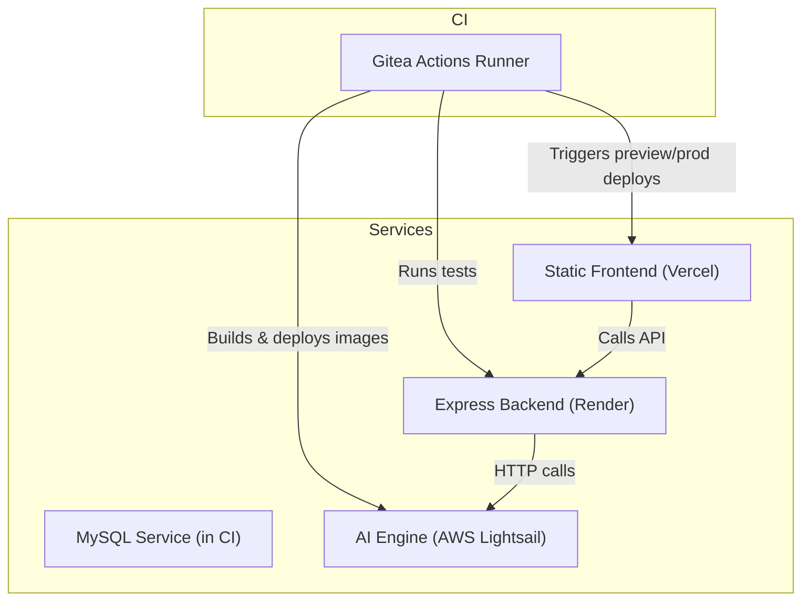
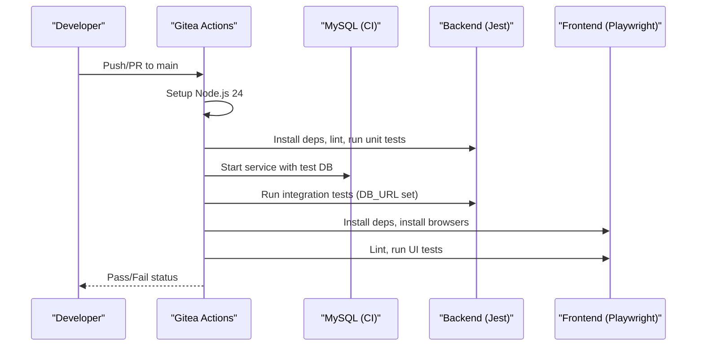
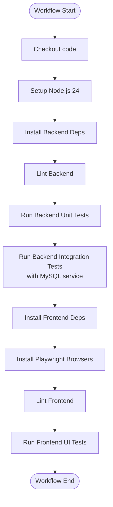
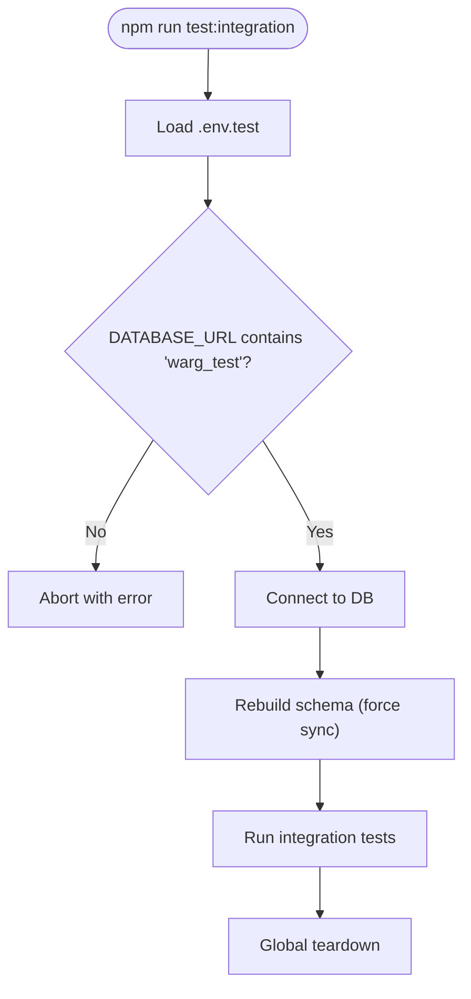
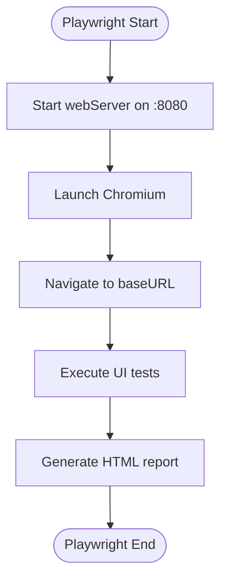
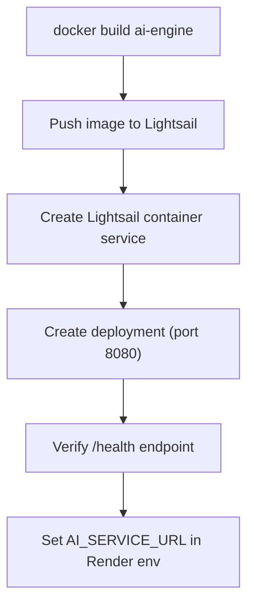
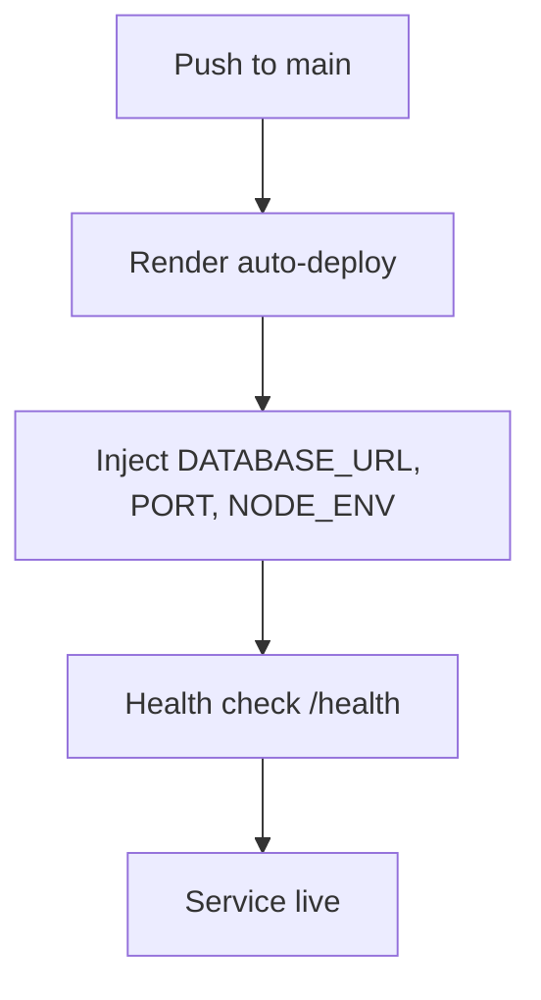
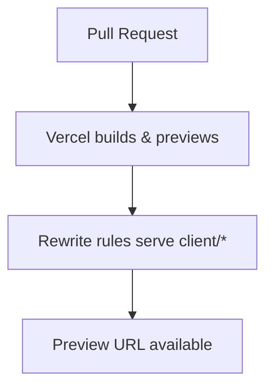
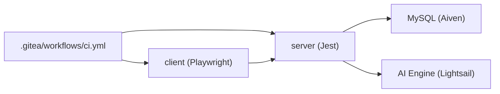

# CI/CD Pipeline Configuration

<cite>
**Referenced Files in This Document**
- [ci.yml](file://.gitea/workflows/ci.yml)
- [server/package.json](file://server/package.json)
- [client/package.json](file://client/package.json)
- [server/jest.config.js](file://server/jest.config.js)
- [client/playwright.config.js](file://client/playwright.config.js)
- [ai-engine/Dockerfile](file://ai-engine/Dockerfile)
- [ai-engine/DEPLOYMENT.md](file://ai-engine/DEPLOYMENT.md)
- [deployment-guide.md](file://warg-docs/docs/4-deployment/deployment-guide.md)
- [vercel.json](file://vercel.json)
</cite>

## Table of Contents
1. [Introduction](#introduction)
2. [Project Structure](#project-structure)
3. [Core Components](#core-components)
4. [Architecture Overview](#architecture-overview)
5. [Detailed Component Analysis](#detailed-component-analysis)
6. [Dependency Analysis](#dependency-analysis)
7. [Performance Considerations](#performance-considerations)
8. [Troubleshooting Guide](#troubleshooting-guide)
9. [Conclusion](#conclusion)

## Introduction
This document explains the end-to-end CI/CD pipeline for the WARG Platform, covering automated testing, code quality checks, building, and deployment workflows. It focuses on the Gitea Actions workflow that runs tests against a real MySQL service, performs linting, and executes UI tests with Playwright. It also documents how the AI Engine is containerized and deployed to AWS Lightsail, how the backend is hosted on Render, and how the frontend is served via Vercel. Environment-specific deployments, secret management, rollback procedures, integration points, notifications, approvals, debugging, performance optimization, and cost management are addressed.

## Project Structure
The repository contains:
- A Gitea Actions workflow under .gitea/workflows that orchestrates CI jobs.
- Backend (Node.js/Express) with Jest-based unit, mocked, and integration tests.
- Frontend (static HTML/JS/CSS) with Playwright UI tests.
- AI Engine (Python/FastAPI) packaged as a Docker image for cloud deployment.
- Deployment documentation for database hosting (Aiven), backend hosting (Render), frontend hosting (Vercel), and AI Engine hosting (AWS Lightsail).

**Diagram sources**
- [ci.yml:1-74](file://.gitea/workflows/ci.yml#L1-L74)
- [deployment-guide.md:101-169](file://warg-docs/docs/4-deployment/deployment-guide.md#L101-L169)
- [ai-engine/Dockerfile:1-40](file://ai-engine/Dockerfile#L1-L40)
- [vercel.json:1-18](file://vercel.json#L1-L18)

**Section sources**
- [ci.yml:1-74](file://.gitea/workflows/ci.yml#L1-L74)
- [deployment-guide.md:101-169](file://warg-docs/docs/4-deployment/deployment-guide.md#L101-L169)

## Core Components
- Gitea Actions CI Workflow: Triggers on push/PR to main; sets up Node.js 24; installs dependencies; lints backend and frontend; runs backend unit and integration tests against an in-runner MySQL service; installs Playwright browsers; runs frontend UI tests.
- Backend Test Suite: Jest projects for mocked/unit/integration tests; environment loading from test env file; global setup enforces test DB safety and schema rebuild.
- Frontend UI Tests: Playwright configuration with parallel execution locally and controlled behavior on CI; serves static files via http-server during tests.
- AI Engine Containerization: Python slim base, system deps for OpenCV/Tesseract, FastAPI app exposed on configurable port.
- Deployment Targets:
  - Backend on Render with environment variables and health checks.
  - Frontend on Vercel with rewrites serving client assets.
  - AI Engine on AWS Lightsail with explicit RAM requirements and environment variable wiring.

**Section sources**
- [ci.yml:1-74](file://.gitea/workflows/ci.yml#L1-L74)
- [server/package.json:6-14](file://server/package.json#L6-L14)
- [server/jest.config.js:1-39](file://server/jest.config.js#L1-L39)
- [client/playwright.config.js:1-39](file://client/playwright.config.js#L1-L39)
- [ai-engine/Dockerfile:1-40](file://ai-engine/Dockerfile#L1-L40)
- [deployment-guide.md:123-169](file://warg-docs/docs/4-deployment/deployment-guide.md#L123-L169)
- [vercel.json:1-18](file://vercel.json#L1-L18)

## Architecture Overview
The CI pipeline validates code quality and correctness before any deployment. The backend depends on MySQL in CI and production, while the frontend runs UI tests against a local static server. In production, the backend integrates with the AI Engine over HTTP.

**Diagram sources**
- [ci.yml:1-74](file://.gitea/workflows/ci.yml#L1-L74)
- [server/jest.config.js:1-39](file://server/jest.config.js#L1-L39)
- [client/playwright.config.js:1-39](file://client/playwright.config.js#L1-L39)

## Detailed Component Analysis

### Gitea Actions Workflow
- Triggers: push and pull_request on main branch.
- Runner: ubuntu-latest.
- Services: MySQL 8.0 with health checks and test credentials.
- Steps:
  - Checkout code.
  - Setup Node.js 24 with npm cache.
  - Backend: install deps, lint, run unit tests, run integration tests with test DB URL and session secret.
  - Frontend: install deps, install Playwright browsers, lint, run UI tests.

**Diagram sources**
- [ci.yml:1-74](file://.gitea/workflows/ci.yml#L1-L74)

**Section sources**
- [ci.yml:1-74](file://.gitea/workflows/ci.yml#L1-L74)

### Backend Testing Strategy (Jest)
- Projects:
  - mocked: controller/model/route/config tests without DB.
  - unit: unit tests under tests/unit.
  - integration: integration tests under tests/integration with global setup/teardown.
- Environment:
  - loadEnv loads .env.test for all projects.
  - globalSetup validates DATABASE_URL includes warg_test and rebuilds schema.
- Scripts:
  - test:unit, test:integration, test:mocked, and aggregate test script.

**Diagram sources**
- [server/jest.config.js:1-39](file://server/jest.config.js#L1-L39)
- [server/tests/setup/loadEnv.js:1-3](file://server/tests/setup/loadEnv.js#L1-L3)
- [server/tests/setup/globalSetup.js:1-21](file://server/tests/setup/globalSetup.js#L1-L21)

**Section sources**
- [server/jest.config.js:1-39](file://server/jest.config.js#L1-L39)
- [server/tests/setup/loadEnv.js:1-3](file://server/tests/setup/loadEnv.js#L1-L3)
- [server/tests/setup/globalSetup.js:1-21](file://server/tests/setup/globalSetup.js#L1-L21)
- [server/package.json:6-14](file://server/package.json#L6-L14)

### Frontend UI Testing Strategy (Playwright)
- Parallelism: fullyParallel enabled; workers=1 on CI; retries=2 on CI.
- Reporter: HTML reporter.
- Base URL: http://localhost:8080.
- WebServer: starts serve on port 8080; reuseExistingServer disabled on CI.
- Browser project: Chromium desktop.

**Diagram sources**
- [client/playwright.config.js:1-39](file://client/playwright.config.js#L1-L39)

**Section sources**
- [client/playwright.config.js:1-39](file://client/playwright.config.js#L1-L39)
- [client/package.json:6-9](file://client/package.json#L6-L9)

### AI Engine Containerization and Deployment
- Dockerfile:
  - Base: python:3.11-slim.
  - System deps: libgl1, libglib2.0-0, git, tesseract-ocr + eng.
  - App: copies requirements, main.py, vision/, weights/.
  - Exposes PORT (default 8080) and runs uvicorn.
- Deployment:
  - Minimum 1 GB RAM; recommended 2 GB due to PyTorch models.
  - Deploy to AWS Lightsail Container Service with public endpoint on 8080.
  - Connect Express backend by setting AI_SERVICE_URL environment variable.

**Diagram sources**
- [ai-engine/Dockerfile:1-40](file://ai-engine/Dockerfile#L1-L40)
- [ai-engine/DEPLOYMENT.md:18-57](file://ai-engine/DEPLOYMENT.md#L18-L57)

**Section sources**
- [ai-engine/Dockerfile:1-40](file://ai-engine/Dockerfile#L1-L40)
- [ai-engine/DEPLOYMENT.md:1-81](file://ai-engine/DEPLOYMENT.md#L1-L81)

### Backend Hosting (Render)
- Service config: root directory server, runtime Node, build/start commands.
- Environment variables: DATABASE_URL, PORT, NODE_ENV.
- Auto-deploy on push to configured branch.
- Health check path recommended (/health).

**Diagram sources**
- [deployment-guide.md:123-169](file://warg-docs/docs/4-deployment/deployment-guide.md#L123-L169)

**Section sources**
- [deployment-guide.md:123-169](file://warg-docs/docs/4-deployment/deployment-guide.md#L123-L169)

### Frontend Hosting (Vercel)
- Rewrites route root to client/home.html and map static assets under /client.
- Preview deployments per PR/merge request.

**Diagram sources**
- [vercel.json:1-18](file://vercel.json#L1-L18)
- [deployment-guide.md:292-294](file://warg-docs/docs/4-deployment/deployment-guide.md#L292-L294)

**Section sources**
- [vercel.json:1-18](file://vercel.json#L1-L18)
- [deployment-guide.md:292-294](file://warg-docs/docs/4-deployment/deployment-guide.md#L292-L294)

## Dependency Analysis
- CI triggers depend on branch rules for main.
- Backend tests depend on MySQL service availability and correct DATABASE_URL.
- Frontend UI tests depend on Playwright browsers installation and a running web server.
- Production backend depends on:
  - Database (Aiven MySQL).
  - AI Engine (external HTTP service).
- Frontend depends on backend API endpoints.

**Diagram sources**
- [ci.yml:1-74](file://.gitea/workflows/ci.yml#L1-L74)
- [deployment-guide.md:101-169](file://warg-docs/docs/4-deployment/deployment-guide.md#L101-L169)
- [ai-engine/DEPLOYMENT.md:47-57](file://ai-engine/DEPLOYMENT.md#L47-L57)

**Section sources**
- [ci.yml:1-74](file://.gitea/workflows/ci.yml#L1-L74)
- [deployment-guide.md:101-169](file://warg-docs/docs/4-deployment/deployment-guide.md#L101-L169)

## Performance Considerations
- CI runner selection: ubuntu-latest provides stable toolchains; consider self-hosted runners for faster I/O if needed.
- Caching: Node.js dependency caching via actions/setup-node reduces install time.
- Test isolation: Integration tests rebuild schema to ensure deterministic runs; avoid heavy data seeding where possible.
- Playwright: Use single worker on CI to reduce flakiness; enable trace collection on first retry for diagnostics.
- AI Engine: Ensure sufficient memory (>=1 GB, ideally 2 GB) to prevent OOM kills during model loading.
- Render: Keep Sequelize pool.max low on Hobbyist plans to avoid connection exhaustion.

[No sources needed since this section provides general guidance]

## Troubleshooting Guide

### Common CI Failures and Resolutions
- MySQL service not ready:
  - Symptom: Integration tests fail to connect or timeout.
  - Resolution: Ensure health checks are configured and wait for readiness; verify DATABASE_URL matches the service credentials.
- Missing DATABASE_URL or wrong DB name:
  - Symptom: Global setup aborts with guard error.
  - Resolution: Set DATABASE_URL to include warg_test and point to the in-runner MySQL service.
- Playwright browsers not installed:
  - Symptom: UI tests cannot launch browsers.
  - Resolution: Run npx playwright install --with-deps in CI before tests.
- Frontend web server not reachable:
  - Symptom: UI tests fail to navigate to baseURL.
  - Resolution: Confirm webServer command serves on port 8080 and baseURL matches.

**Section sources**
- [ci.yml:13-28](file://.gitea/workflows/ci.yml#L13-L28)
- [ci.yml:52-59](file://.gitea/workflows/ci.yml#L52-L59)
- [ci.yml:64-74](file://.gitea/workflows/ci.yml#L64-L74)
- [server/tests/setup/globalSetup.js:4-11](file://server/tests/setup/globalSetup.js#L4-L11)
- [client/playwright.config.js:32-37](file://client/playwright.config.js#L32-L37)

### Environment Variables and Secrets
- CI secrets:
  - Use Gitea Actions secrets for sensitive values (e.g., SESSION_SECRET, DATABASE_URL if external).
  - Avoid hardcoding secrets in workflow; reference secrets via environment variables.
- Render secrets:
  - Manage DATABASE_URL, PORT, NODE_ENV via Render dashboard environment variables.
  - Use Secret Files for multiple variables when appropriate.
- AI Engine URL:
  - Set AI_SERVICE_URL in Render environment after deploying AI Engine to Lightsail.

**Section sources**
- [deployment-guide.md:147-157](file://warg-docs/docs/4-deployment/deployment-guide.md#L147-L157)
- [ai-engine/DEPLOYMENT.md:47-57](file://ai-engine/DEPLOYMENT.md#L47-L57)

### Rollback Procedures
- Backend (Render):
  - Revert commit on main and push; Render auto-deploys previous known-good version.
  - Alternatively, disable auto-deploy and trigger manual deploys from a stable branch.
- Frontend (Vercel):
  - Revert PR/commit; Vercel will rebuild and deploy the previous successful preview/production build.
- AI Engine (Lightsail):
  - Redeploy a previous image tag using the same service and deployment commands.

[No sources needed since this section summarizes operational steps]

### Debugging CI Jobs
- Enable verbose logging in Jest via jest.config.js (already enabled).
- Collect Playwright traces on first retry for failing UI tests.
- Inspect MySQL logs and health endpoint to confirm service readiness.
- Validate environment variables in each job step.

**Section sources**
- [server/jest.config.js:1-3](file://server/jest.config.js#L1-L3)
- [client/playwright.config.js:17-22](file://client/playwright.config.js#L17-L22)
- [ci.yml:13-28](file://.gitea/workflows/ci.yml#L13-L28)

### Cost Management Strategies
- Limit CI concurrency and use smaller runners for non-compute-heavy tasks.
- Cache dependencies aggressively to reduce runner time.
- Right-size AI Engine instances (minimum 1 GB RAM; 2 GB recommended) to avoid OOM-related retries.
- Use preview deployments sparingly; clean up unused branches and artifacts.

[No sources needed since this section provides general guidance]

## Conclusion
The CI/CD pipeline combines robust backend testing with UI validation and containerized AI Engine deployment. By leveraging Gitea Actions for CI, Render for backend hosting, Vercel for frontend previews, and AWS Lightsail for the AI Engine, the platform achieves reliable, repeatable builds and deployments. Proper secret management, environment configuration, and troubleshooting practices ensure stability and maintainability across environments.