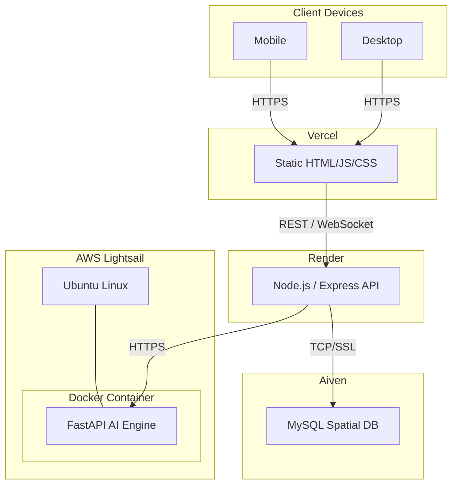
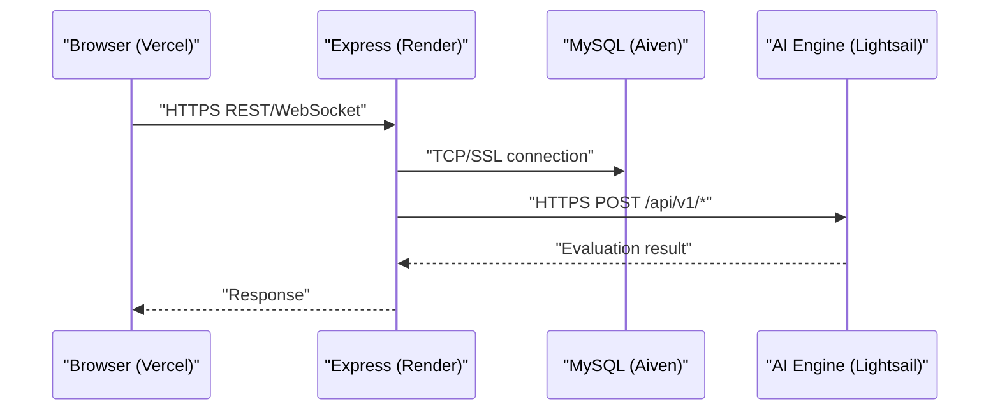
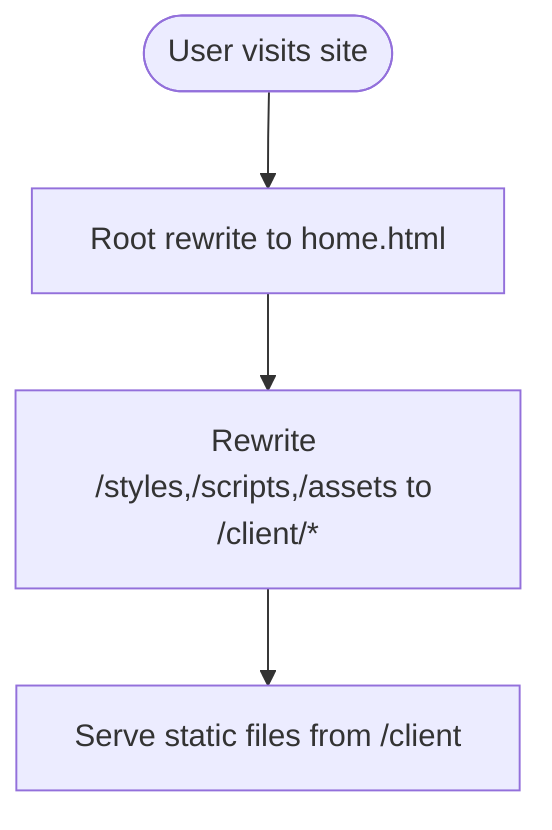
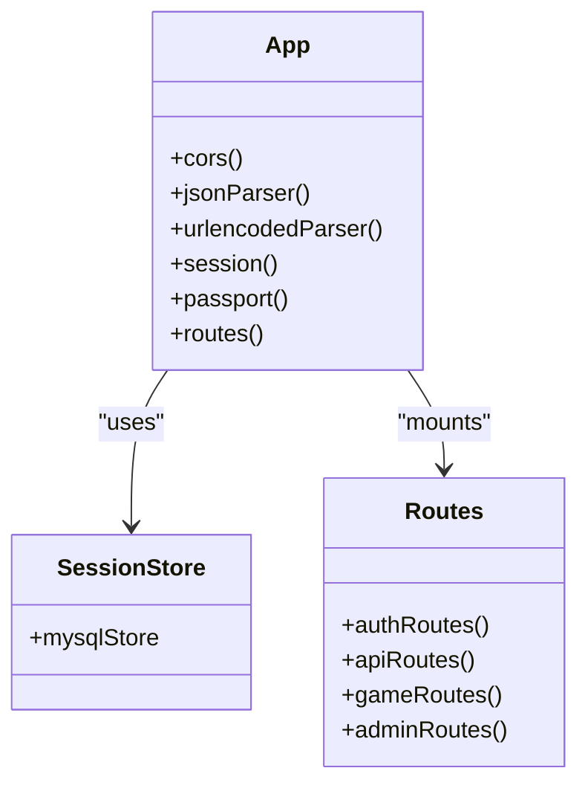
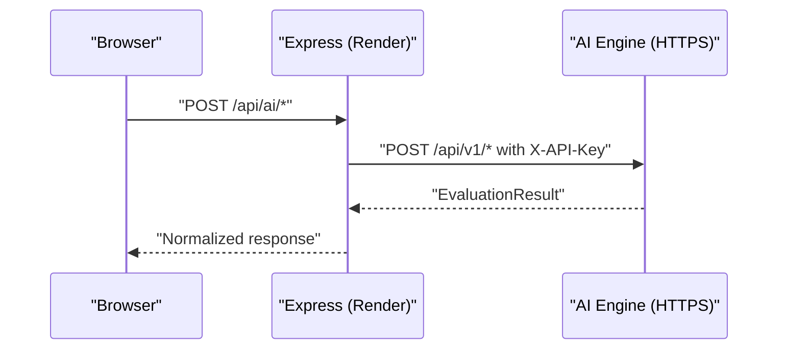
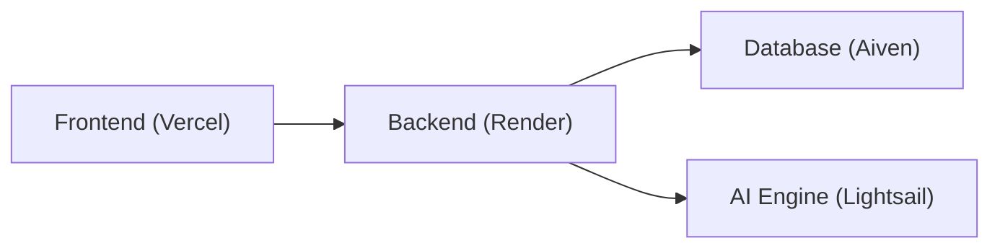

# Multi-Service Deployment

<cite>
**Referenced Files in This Document**   
- [README.md](file://README.md)
- [deployment-guide.md](file://warg-docs/docs/4-deployment/deployment-guide.md)
- [DEPLOYMENT.md](file://ai-engine/DEPLOYMENT.md)
- [app.js](file://server/src/app.js)
- [server.js](file://server/server.js)
- [database.js](file://server/src/config/database.js)
- [main.py](file://ai-engine/main.py)
- [Dockerfile](file://ai-engine/Dockerfile)
- [vercel.json](file://client/vercel.json)
- [vercel.json](file://vercel.json)
</cite>

## Table of Contents
1. [Introduction](#introduction)
2. [Project Structure](#project-structure)
3. [Core Components](#core-components)
4. [Architecture Overview](#architecture-overview)
5. [Detailed Component Analysis](#detailed-component-analysis)
6. [Dependency Analysis](#dependency-analysis)
7. [Performance Considerations](#performance-considerations)
8. [Troubleshooting Guide](#troubleshooting-guide)
9. [Conclusion](#conclusion)

## Introduction
This document provides a comprehensive multi-service deployment guide for the WARG Platform, covering:
- Render (Node.js backend)
- Vercel (static frontend)
- Aiven (MySQL database)
- Custom AI engine service (Python/FastAPI container)

It explains environment variable management across services, inter-service communication, domain routing, SSL/TLS and CORS configuration, cross-origin security policies, service dependencies, health checks, and graceful shutdown procedures.

## Project Structure
The platform is composed of:
- Frontend: static HTML/CSS/JS under client/, served by Vercel
- Backend: Node.js/Express API under server/, hosted on Render
- Database: MySQL with spatial extensions on Aiven
- AI Engine: Python/FastAPI microservice running in Docker, deployed to a container host (e.g., AWS Lightsail)

**Diagram sources**
- [deployment-guide.md:18-52](file://warg-docs/docs/4-deployment/deployment-guide.md#L18-L52)

**Section sources**
- [README.md:62-108](file://README.md#L62-L108)
- [deployment-guide.md:1-16](file://warg-docs/docs/4-deployment/deployment-guide.md#L1-L16)

## Core Components
- Frontend (Vercel): Serves static pages; uses clean URLs and rewrites via vercel.json.
- Backend (Render): Express app with session store backed by MySQL, Socket.io for real-time features, and proxy calls to AI Engine.
- Database (Aiven): Managed MySQL with spatial types and enforced SSL.
- AI Engine (Custom): FastAPI service exposing image analysis endpoints behind an API key.

Key responsibilities:
- Domain routing and HTTPS termination at edge providers (Vercel, Render).
- Secure inter-service communication (HTTPS from Express to AI Engine).
- Cross-origin policy enforcement for browser-to-backend and backend-to-AI requests.
- Health checks for orchestration and monitoring.

**Section sources**
- [deployment-guide.md:216-295](file://warg-docs/docs/4-deployment/deployment-guide.md#L216-L295)
- [deployment-guide.md:123-183](file://warg-docs/docs/4-deployment/deployment-guide.md#L123-L183)
- [deployment-guide.md:64-120](file://warg-docs/docs/4-deployment/deployment-guide.md#L64-L120)
- [DEPLOYMENT.md:1-15](file://ai-engine/DEPLOYMENT.md#L1-L15)

## Architecture Overview
End-to-end request flow:
- Browser loads static assets from Vercel over HTTPS.
- Browser calls Express API on Render over HTTPS.
- Express authenticates users, persists sessions in MySQL (Aiven), and proxies heavy image processing to the AI Engine over HTTPS.
- Real-time features use Socket.io over the same port as HTTP.

**Diagram sources**
- [deployment-guide.md:18-52](file://warg-docs/docs/4-deployment/deployment-guide.md#L18-L52)
- [server.js:14-36](file://server/server.js#L14-L36)
- [main.py:39-52](file://ai-engine/main.py#L39-L52)

## Detailed Component Analysis

### Vercel Frontend
- Root-level vercel.json routes traffic to client/home.html and maps static asset paths.
- client/vercel.json rewrites root path to login.html for cleaner entry points.
- Clean URLs are enabled; trailing slashes are removed.

**Diagram sources**
- [vercel.json:1-18](file://vercel.json#L1-L18)
- [vercel.json:1-9](file://client/vercel.json#L1-L9)

Operational notes:
- No build step required; deploy as a static site.
- Use environment constants in client scripts to point to the production Render API base URL.

**Section sources**
- [deployment-guide.md:216-295](file://warg-docs/docs/4-deployment/deployment-guide.md#L216-L295)
- [vercel.json:1-18](file://vercel.json#L1-L18)
- [vercel.json:1-9](file://client/vercel.json#L1-L9)

### Render Backend (Node.js/Express)
- Creates Express app with CORS, JSON parsing limits, trust proxy, and session middleware.
- Uses MySQL-backed session store with SSL disabled verification in code (see Security note below).
- Mounts API routes under /auth, /api/*, /api/game, /api/admin.
- Serves static client files optionally from within the backend for local development.

**Diagram sources**
- [app.js:26-128](file://server/src/app.js#L26-L128)

Security and CORS:
- CORS origin validation reads CLIENT_URL (comma-separated) and allows localhost in non-production.
- Credentials enabled for cookies and cross-site requests.
- Trust proxy set to handle headers from Render’s reverse proxy.

Database connectivity:
- Sequelize configured with SSL require=true and rejectUnauthorized=false for Aiven self-signed CA in dev/test.
- Connection pool tuned; retry logic defined for transient network errors.

Real-time:
- Socket.io mounted on the HTTP server with CORS matching the Express CORS policy.

Health check:
- Add a lightweight /health endpoint if not present; configure Render’s health check path accordingly.

Graceful shutdown:
- The current startup sequence does not implement explicit signal handling or socket draining. For production, add handlers for SIGTERM/SIGINT to close sockets and database connections before exit.

**Section sources**
- [app.js:26-128](file://server/src/app.js#L26-L128)
- [server.js:1-72](file://server/server.js#L1-L72)
- [database.js:1-38](file://server/src/config/database.js#L1-L38)
- [deployment-guide.md:123-183](file://warg-docs/docs/4-deployment/deployment-guide.md#L123-L183)

### Aiven MySQL Database
- Managed MySQL with spatial extensions (SRID 4326/WGS 84).
- SSL required; connection string includes ssl-mode=REQUIRE.
- Sequelize strips ssl-mode query param before constructing the connection object and applies dialectOptions for SSL.

Production hardening:
- Replace rejectUnauthorized=false with a strict CA certificate validation using the CA cert downloaded from Aiven console.

Backups and monitoring:
- Automated daily backups on paid plans; monitor metrics and keep pool.max <= 5 on Hobbyist plan.

**Section sources**
- [deployment-guide.md:64-120](file://warg-docs/docs/4-deployment/deployment-guide.md#L64-L120)
- [database.js:1-38](file://server/src/config/database.js#L1-L38)

### Custom AI Engine Service
- FastAPI application exposing image evaluation endpoints under /api/v1/*.
- Protected by X-API-Key header; default key is configurable via AI_KEY env var.
- Health endpoint returns model readiness status.
- CORS configured to allow specific origins including Render backend and local dev.

Deployment:
- Dockerized with uvicorn serving on PORT (default 8080).
- Minimum 1 GB RAM recommended; 2 GB preferred due to PyTorch models.

Inter-service communication:
- Express sets AI_SERVICE_URL to the AI Engine’s public HTTPS URL.
- Controllers forward multipart image payloads to AI Engine endpoints and return results to clients.

**Diagram sources**
- [main.py:10-33](file://ai-engine/main.py#L10-L33)
- [main.py:39-52](file://ai-engine/main.py#L39-L52)
- [main.py:77-157](file://ai-engine/main.py#L77-L157)

**Section sources**
- [DEPLOYMENT.md:1-15](file://ai-engine/DEPLOYMENT.md#L1-L15)
- [DEPLOYMENT.md:47-81](file://ai-engine/DEPLOYMENT.md#L47-L81)
- [main.py:1-52](file://ai-engine/main.py#L1-L52)
- [main.py:77-157](file://ai-engine/main.py#L77-L157)
- [Dockerfile:1-40](file://ai-engine/Dockerfile#L1-L40)

## Dependency Analysis
Service dependencies:
- Frontend depends on Backend API (HTTPS).
- Backend depends on Database (TCP/SSL) and AI Engine (HTTPS).
- AI Engine has no outbound dependencies beyond system libraries (OpenCV, Tesseract).

**Diagram sources**
- [deployment-guide.md:18-52](file://warg-docs/docs/4-deployment/deployment-guide.md#L18-L52)

Environment variables and secrets:
- DATABASE_URL: Full Aiven MySQL URI with SSL mode flag.
- CLIENT_URL: Comma-separated list of allowed frontend origins for CORS.
- SESSION_SECRET: Secret used by express-session.
- NODE_ENV: Environment mode (development/production/test).
- PORT: Server listening port (injected by Render).
- AI_SERVICE_URL: Public HTTPS URL of the AI Engine.
- AI_KEY: API key header value for AI Engine authentication.

**Section sources**
- [deployment-guide.md:298-321](file://warg-docs/docs/4-deployment/deployment-guide.md#L298-L321)
- [app.js:29-44](file://server/src/app.js#L29-L44)
- [server.js:14-36](file://server/server.js#L14-L36)
- [main.py:10-20](file://ai-engine/main.py#L10-L20)

## Performance Considerations
- Backend:
  - Keep Sequelize pool.max conservative (<=5) on small plans.
  - Enable compression and caching where possible at the CDN/proxy layer.
  - Avoid large JSON payloads; stream images when feasible.
- Database:
  - Use spatial indexes appropriately; avoid full table scans.
  - Monitor slow queries and adjust indexes.
- AI Engine:
  - Allocate sufficient memory (>=1 GB, ideally 2 GB) to prevent OOM kills during model loading.
  - Cache repeated computations if applicable; consider preloading models once at startup.
- Frontend:
  - Leverage Vercel’s global CDN; minimize payload sizes and enable gzip/brotli.

[No sources needed since this section provides general guidance]

## Troubleshooting Guide
Common issues and resolutions:
- CORS failures:
  - Ensure CLIENT_URL includes the exact Vercel domain(s) and that credentials are enabled.
  - Verify Socket.io CORS matches Express CORS settings.
- Database connection errors:
  - Confirm DATABASE_URL is correct and includes ssl-mode=REQUIRE.
  - In production, replace rejectUnauthorized=false with proper CA validation.
- AI Engine unreachable:
  - Validate AI_SERVICE_URL is set to the HTTPS endpoint.
  - Check X-API-Key header is present and matches AI_KEY.
  - Test /health endpoint to confirm model readiness.
- Render free-tier spin-down:
  - Free-tier services may spin down after inactivity; upgrade to Starter for persistent WebSocket connections.
- Health checks:
  - Ensure /health returns 200 OK and is configured in Render dashboard.

**Section sources**
- [app.js:29-44](file://server/src/app.js#L29-L44)
- [server.js:14-36](file://server/server.js#L14-L36)
- [database.js:1-38](file://server/src/config/database.js#L1-L38)
- [DEPLOYMENT.md:47-81](file://ai-engine/DEPLOYMENT.md#L47-L81)
- [deployment-guide.md:163-183](file://warg-docs/docs/4-deployment/deployment-guide.md#L163-L183)

## Conclusion
This deployment model separates concerns across specialized platforms:
- Vercel for fast static delivery
- Render for stateful API and real-time features
- Aiven for managed relational data with spatial support
- A custom AI engine for compute-heavy image analysis

By configuring environment variables carefully, enforcing CORS and SSL/TLS, and implementing robust health checks, the platform achieves secure, scalable, and maintainable operations across all services.

[No sources needed since this section summarizes without analyzing specific files]