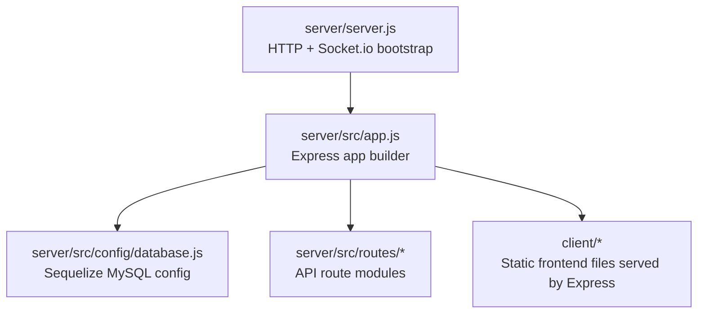
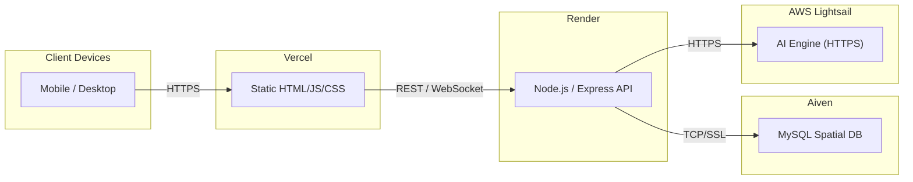
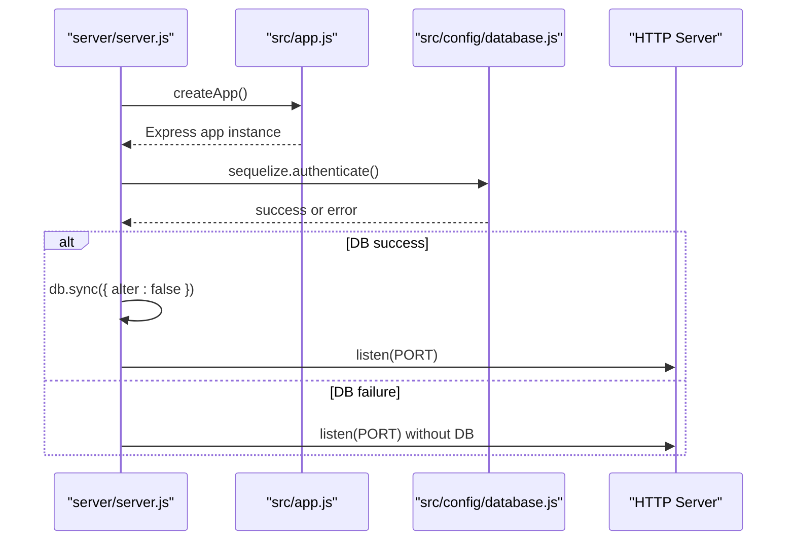
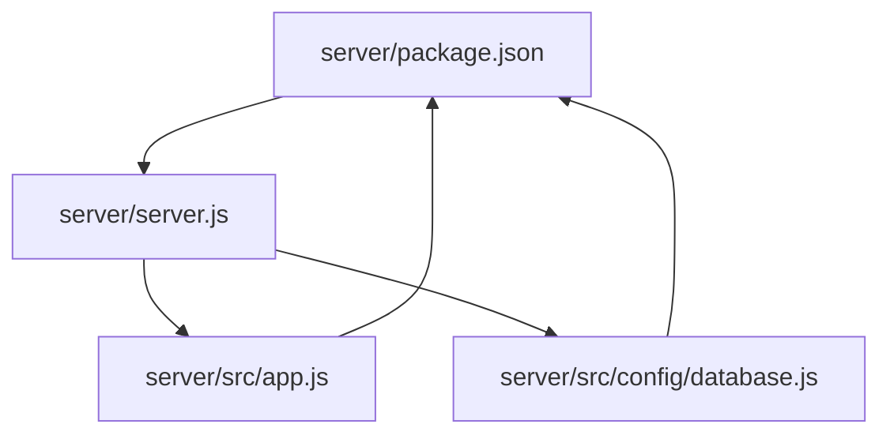

# Render Backend Deployment

<cite>
**Referenced Files in This Document**
- [server.js](file://server/server.js)
- [app.js](file://server/src/app.js)
- [database.js](file://server/src/config/database.js)
- [package.json](file://server/package.json)
- [deployment-guide.md](file://warg-docs/docs/4-deployment/deployment-guide.md)
</cite>

## Table of Contents
1. [Introduction](#introduction)
2. [Project Structure](#project-structure)
3. [Core Components](#core-components)
4. [Architecture Overview](#architecture-overview)
5. [Detailed Component Analysis](#detailed-component-analysis)
6. [Dependency Analysis](#dependency-analysis)
7. [Performance Considerations](#performance-considerations)
8. [Troubleshooting Guide](#troubleshooting-guide)
9. [Conclusion](#conclusion)

## Introduction
This document provides comprehensive deployment guidance for the Node.js backend service on Render. It covers environment configuration, database connection strings, SSL certificate handling, server initialization, health checks, graceful shutdown considerations, Express application setup, middleware, security headers, and troubleshooting steps for common issues such as database connectivity, memory limits, and port binding errors. It also includes performance optimization tips tailored to Render’s infrastructure.

## Project Structure
The backend is located under the `server` directory. The entry point starts an HTTP server, configures Socket.io, initializes the Express app, connects to MySQL via Sequelize, and serves both API routes and static client assets.

**Diagram sources**
- [server.js:1-72](file://server/server.js#L1-L72)
- [app.js:1-132](file://server/src/app.js#L1-L132)
- [database.js:1-38](file://server/src/config/database.js#L1-L38)

**Section sources**
- [server.js:1-72](file://server/server.js#L1-L72)
- [app.js:1-132](file://server/src/app.js#L1-L132)
- [package.json:1-39](file://server/package.json#L1-L39)

## Core Components
- Server bootstrap: Creates the HTTP server, configures keep-alive and header timeouts, sets up Socket.io with CORS, and starts listening after database authentication and model sync.
- Express application builder: Configures CORS, JSON/body parsing, proxy trust, sessions (with MySQL persistence), Passport, routes, and static file serving.
- Database configuration: Connects to MySQL using a cleaned `DATABASE_URL`, enables SSL, defines connection pool settings, and retry behavior.

Key responsibilities:
- Environment-driven configuration via `dotenv`.
- Secure session storage backed by MySQL in production.
- WebSocket support for live gameplay features.
- Static asset delivery from the `client` directory.

**Section sources**
- [server.js:1-72](file://server/server.js#L1-L72)
- [app.js:1-132](file://server/src/app.js#L1-L132)
- [database.js:1-38](file://server/src/config/database.js#L1-L38)

## Architecture Overview
The backend runs on Render, connects to a managed MySQL database on Aiven over SSL, and optionally communicates with an AI engine over HTTPS. The frontend is hosted separately on Vercel and calls the backend via REST and WebSockets.

**Diagram sources**
- [deployment-guide.md:16-52](file://warg-docs/docs/4-deployment/deployment-guide.md#L16-L52)

## Detailed Component Analysis

### Server Initialization and Startup Flow
The server bootstraps the HTTP server, configures Socket.io, authenticates the database, syncs models, and then listens on the configured port. If database authentication fails, it still starts the server without DB connectivity.

Operational notes:
- Port selection uses `process.env.PORT` with a fallback to `3000`.
- Keep-alive and header timeouts are set explicitly.
- Socket.io is attached to the same HTTP server with permissive CORS logic that supports multiple origins via `CLIENT_URL`.

**Diagram sources**
- [server.js:1-72](file://server/server.js#L1-L72)
- [app.js:1-132](file://server/src/app.js#L1-L132)
- [database.js:1-38](file://server/src/config/database.js#L1-L38)

**Section sources**
- [server.js:47-72](file://server/server.js#L47-L72)

### Express Application Configuration and Middleware
The Express app builder configures:
- CORS with dynamic origin validation based on `CLIENT_URL`.
- JSON and URL-encoded body parsers with generous size limits.
- Proxy trust for Render’s reverse proxy.
- Session management with secure cookies and MySQL-backed store in non-test environments.
- Passport initialization and session integration.
- Route mounting for auth, args, users, sessions, comments, feedback, AI, minigames, game, and admin endpoints.
- Static file serving for the client directory at both root and `/client`.

Security posture:
- Cookies are httpOnly; secure and sameSite flags adapt to `NODE_ENV`.
- Trust proxy is enabled so IP resolution works behind Render’s proxy.

**Section sources**
- [app.js:26-128](file://server/src/app.js#L26-L128)

### Database Connection and SSL Handling
Database configuration:
- Uses `DATABASE_URL` with the SSL query parameter stripped before passing to Sequelize.
- Enables SSL with `require: true` and `rejectUnauthorized: false` outside tests.
- Defines a conservative connection pool and retry behavior for transient network errors.

Production recommendation:
- Replace `rejectUnauthorized: false` with explicit CA certificate validation by providing the CA cert via the `ca` field.

**Section sources**
- [database.js:1-38](file://server/src/config/database.js#L1-L38)
- [deployment-guide.md:88-102](file://warg-docs/docs/4-deployment/deployment-guide.md#L88-L102)

### Health Check Endpoints
Render expects a lightweight health endpoint. Add a simple route to return a 200 status when the service is healthy. Configure the health check path in Render’s service settings to match your implementation.

Recommended approach:
- Expose a minimal GET route returning `{ status: "ok" }`.
- Set Render’s Health Check Path to that route.

**Section sources**
- [deployment-guide.md:163-171](file://warg-docs/docs/4-deployment/deployment-guide.md#L163-L171)

### Graceful Shutdown Procedures
Current startup flow does not implement explicit graceful shutdown handlers. To improve reliability during deployments and process termination:
- Register handlers for `SIGTERM` and `SIGINT`.
- Stop accepting new connections.
- Close active Socket.io connections.
- Close the HTTP server.
- Close the database connection pool.
- Exit the process after cleanup completes.

Implementation guidance:
- Wrap server lifecycle in a function that manages cleanup.
- Ensure cleanup order prevents resource leaks and avoids abrupt disconnections.

[No sources needed since this section provides general guidance]

### Security Headers and CORS
CORS:
- Both Express and Socket.io use a shared origin-checking strategy based on `CLIENT_URL`.
- Credentials are allowed where appropriate.

Proxy trust:
- `trust proxy` is enabled to correctly resolve client IPs behind Render’s proxy.

Cookie security:
- `secure` and `sameSite` flags are set according to `NODE_ENV`.
- `httpOnly` is enforced for session cookies.

Note:
- No additional security headers (e.g., HSTS, CSP) are added in the current codebase. Consider adding them via a dedicated middleware if required by your security policy.

**Section sources**
- [app.js:29-59](file://server/src/app.js#L29-L59)
- [server.js:15-36](file://server/server.js#L15-L36)

## Dependency Analysis
The backend depends on:
- Express for routing and middleware.
- Socket.io for real-time communication.
- Sequelize and mysql2 for database access.
- express-session and express-mysql-session for persistent sessions.
- dotenv for environment variable loading.
- cors for cross-origin requests.

**Diagram sources**
- [package.json:1-39](file://server/package.json#L1-L39)
- [server.js:1-72](file://server/server.js#L1-L72)
- [app.js:1-132](file://server/src/app.js#L1-L132)
- [database.js:1-38](file://server/src/config/database.js#L1-L38)

**Section sources**
- [package.json:1-39](file://server/package.json#L1-L39)

## Performance Considerations
- Connection pooling: Keep Sequelize’s `pool.max` conservative (e.g., ≤ 5) to avoid exhausting Aiven’s connection limits.
- Body parser limits: JSON and URL-encoded bodies are limited to 50MB; adjust only if necessary to reduce memory pressure.
- Keep-alive and header timeouts: Explicitly set to prevent resource exhaustion under sustained load.
- Static assets: Serving client files directly from Express simplifies deployment but may increase memory usage; consider offloading to a CDN or separate static host if needed.
- Render plan: For WebSocket-dependent features, use a paid plan to avoid spin-down behavior on free tiers.

[No sources needed since this section provides general guidance]

## Troubleshooting Guide

Common deployment issues and resolutions:

- Database connectivity problems
  - Verify `DATABASE_URL` contains the correct credentials, host, port, and schema.
  - Confirm SSL is enabled and matches Aiven’s requirements.
  - Check connection pool exhaustion; reduce `pool.max` if hitting limits.
  - Validate that the schema has been synced.

- Memory limits
  - Reduce body parser limits if large payloads are not required.
  - Avoid unnecessary in-memory caches; prefer database-backed sessions.
  - Monitor Render’s memory usage and upgrade instance type if needed.

- Port binding errors
  - Ensure the start command uses `npm start`, which reads `PORT` from environment variables.
  - Do not hardcode ports; rely on `process.env.PORT`.

- CORS failures
  - Ensure `CLIENT_URL` includes the exact frontend origin(s).
  - Confirm credentials are allowed where cookies are used.

- Health check failures
  - Add a lightweight `/health` route and configure Render’s health check path accordingly.

- WebSocket instability
  - Upgrade to a paid Render plan to avoid spin-down behavior.
  - Verify Socket.io CORS configuration allows the frontend origin.

- Logs and diagnostics
  - Use Render’s logs tab for real-time debugging.
  - Enable structured logging and forward logs to a log aggregation service.

**Section sources**
- [deployment-guide.md:147-181](file://warg-docs/docs/4-deployment/deployment-guide.md#L147-L181)
- [database.js:1-38](file://server/src/config/database.js#L1-L38)
- [app.js:29-59](file://server/src/app.js#L29-L59)
- [server.js:47-72](file://server/server.js#L47-L72)

## Conclusion
Deploying the WARG Platform backend on Render involves configuring environment variables, ensuring secure database connectivity with SSL, and validating health checks. The Express application is well-configured for production with secure sessions, CORS, and static asset serving. For robust operations, add graceful shutdown handling, consider stronger SSL validation with explicit CA certificates, and monitor performance metrics. Following the provided guidelines will help you achieve a reliable, secure, and performant deployment on Render.