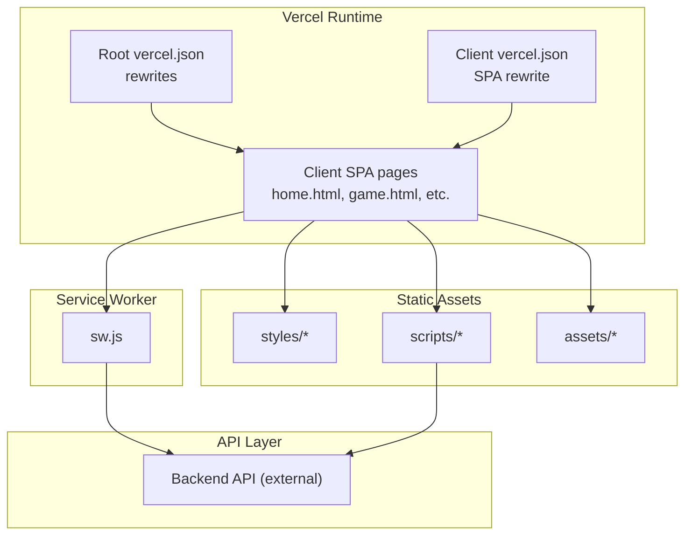
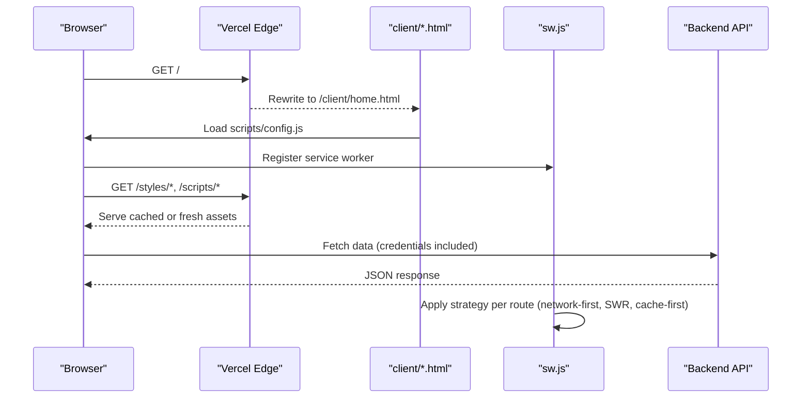
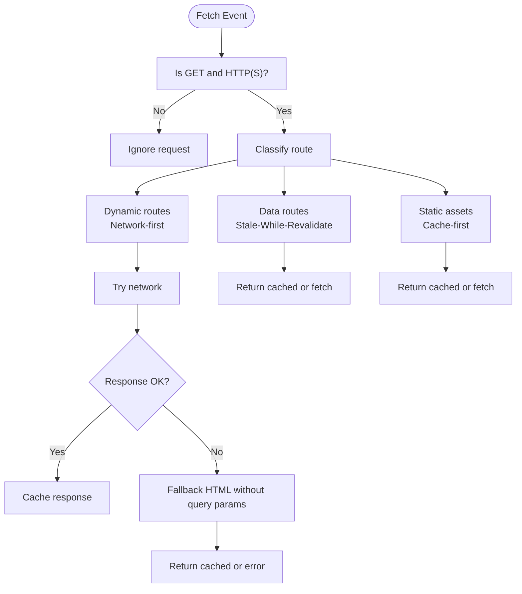
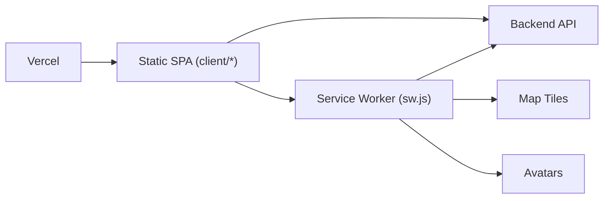

# Vercel Frontend Deployment

<cite>
**Referenced Files in This Document**
- [vercel.json](file://vercel.json)
- [client/vercel.json](file://client/vercel.json)
- [client/package.json](file://client/package.json)
- [client/sw.js](file://client/sw.js)
- [client/scripts/config.js](file://client/scripts/config.js)
- [client/scripts/api.js](file://client/scripts/api.js)
- [client/index.html](file://client/index.html)
- [.gitea/workflows/ci.yml](file://.gitea/workflows/ci.yml)
</cite>

## Table of Contents
1. [Introduction](#introduction)
2. [Project Structure](#project-structure)
3. [Core Components](#core-components)
4. [Architecture Overview](#architecture-overview)
5. [Detailed Component Analysis](#detailed-component-analysis)
6. [Dependency Analysis](#dependency-analysis)
7. [Performance Considerations](#performance-considerations)
8. [Troubleshooting Guide](#troubleshooting-guide)
9. [Conclusion](#conclusion)

## Introduction
This document provides deployment guidance for the static frontend application on Vercel. It covers configuration files, build and deployment triggers, environment variable usage for API endpoints, service worker setup for offline functionality and caching strategies, and operational considerations such as custom domains, SSL, CDN behavior, and troubleshooting.

## Project Structure
The frontend is a plain HTML/CSS/JS application under the client directory. There is no build step; Vercel serves the static assets directly. Routing is handled via rewrites to support single-page navigation patterns.

**Diagram sources**
- [vercel.json:1-18](file://vercel.json#L1-L18)
- [client/vercel.json:1-9](file://client/vercel.json#L1-L9)
- [client/sw.js:1-235](file://client/sw.js#L1-L235)
- [client/scripts/api.js:1-401](file://client/scripts/api.js#L1-L401)

**Section sources**
- [vercel.json:1-18](file://vercel.json#L1-L18)
- [client/vercel.json:1-9](file://client/vercel.json#L1-L9)
- [client/package.json:1-25](file://client/package.json#L1-L25)

## Core Components
- Root Vercel configuration with clean URLs and rewrites that route traffic into the client directory.
- Client-level Vercel configuration for SPA routing fallback.
- Service worker for offline caching and background sync.
- Configuration script for runtime environment detection and service worker registration.
- API client that resolves backend endpoints based on hostname.

Key responsibilities:
- Routing and asset mapping: root and client vercel.json
- Offline capabilities and caching: sw.js
- Environment resolution and SW registration: scripts/config.js
- API calls and cache busting helpers: scripts/api.js

**Section sources**
- [vercel.json:1-18](file://vercel.json#L1-L18)
- [client/vercel.json:1-9](file://client/vercel.json#L1-L9)
- [client/sw.js:1-235](file://client/sw.js#L1-L235)
- [client/scripts/config.js:1-30](file://client/scripts/config.js#L1-L30)
- [client/scripts/api.js:1-401](file://client/scripts/api.js#L1-L401)

## Architecture Overview
The frontend runs as a static site on Vercel. Requests are rewritten to serve SPA pages from the client directory. The browser registers a service worker that caches critical assets and applies per-route caching strategies. API requests go to an external backend whose base URL is resolved at runtime.

**Diagram sources**
- [vercel.json:1-18](file://vercel.json#L1-L18)
- [client/scripts/config.js:18-29](file://client/scripts/config.js#L18-L29)
- [client/sw.js:113-148](file://client/sw.js#L113-L148)
- [client/scripts/api.js:12-20](file://client/scripts/api.js#L12-L20)

## Detailed Component Analysis

### Vercel Configuration and Routing
- Root vercel.json enables clean URLs and defines rewrites:
  - Root path routes to the client home page.
  - Static directories are mapped into the client folder.
  - All other paths fall back to the client directory for SPA routing.
- Client vercel.json provides a simple SPA rewrite to login.html for the client subdirectory.

Operational notes:
- No build command is required; Vercel serves static files.
- Ensure the project root points to the repository root so the root vercel.json is used.

**Section sources**
- [vercel.json:1-18](file://vercel.json#L1-L18)
- [client/vercel.json:1-9](file://client/vercel.json#L1-L9)

### Build Processes and Deployment Triggers
- The frontend has no build step; dependencies listed in client/package.json are dev-only (linting, tests).
- CI pipeline runs linting and UI tests but does not build the frontend.
- Vercel deploys on push/PR to main by default when connected to your Git provider.

Recommendations:
- If you add a build step later, define it in package.json scripts and configure Vercel accordingly.
- Keep client/package.json free of production dependencies unless needed at runtime.

**Section sources**
- [client/package.json:1-25](file://client/package.json#L1-L25)
- [.gitea/workflows/ci.yml:1-74](file://.gitea/workflows/ci.yml#L1-L74)

### Environment Variables and API Endpoints
- API base URL is determined at runtime:
  - Localhost uses a local backend endpoint.
  - Production uses a remote backend endpoint.
- The same logic exists in both config.js and api.js to ensure consistent behavior.

Guidance:
- For Vercel, set environment variables if you need to override the API base URL per environment (Preview, Production).
- Use Vercel’s Environment Variables settings to inject values like API_BASE_URL per branch/environment.

**Section sources**
- [client/scripts/config.js:1-16](file://client/scripts/config.js#L1-L16)
- [client/scripts/api.js:12-20](file://client/scripts/api.js#L12-L20)

### Service Worker Setup and Caching Strategies
- Registration occurs on load via scripts/config.js.
- sw.js implements:
  - Install and activate lifecycle with cache versioning and cleanup.
  - Three strategies:
    - Network-first for sensitive/dynamic routes.
    - Stale-while-revalidate for catalogue/game data.
    - Cache-first for static assets and third-party tile/avatar hosts.
  - Background sync for offline attempts with IndexedDB-backed persistence.

**Diagram sources**
- [client/sw.js:28-48](file://client/sw.js#L28-L48)
- [client/sw.js:50-111](file://client/sw.js#L50-L111)
- [client/sw.js:113-148](file://client/sw.js#L113-L148)

**Section sources**
- [client/scripts/config.js:18-29](file://client/scripts/config.js#L18-L29)
- [client/sw.js:1-235](file://client/sw.js#L1-L235)

### Custom Domains, SSL, and CDN
- Vercel automatically provisions SSL certificates for custom domains.
- Configure custom domains in Vercel dashboard; DNS records must be updated accordingly.
- Vercel serves assets via its global CDN; caching headers and edge caching are managed by the platform.

Best practices:
- Prefer HTTPS-only resources.
- Avoid hardcoding hostnames in assets; use relative paths where possible.
- Use cache-busting filenames or query parameters for dynamic content.

[No sources needed since this section provides general guidance]

### Analytics Tracking and Feature Flags
- The codebase includes analytics-related scripts and tests, but there is no centralized feature flag system visible in the analyzed files.
- To integrate analytics:
  - Add tracking scripts in HTML pages or via a central loader.
  - Gate features using environment variables injected by Vercel and consumed in scripts/config.js.

Recommendations:
- Centralize feature flags in a small config module loaded early.
- Use Vercel environment variables to toggle flags per environment.

[No sources needed since this section provides general guidance]

## Dependency Analysis
The frontend depends on:
- Vercel runtime for serving static assets and handling rewrites.
- External backend API for data and authentication.
- Third-party services for map tiles and avatars (handled by SW cache-first strategy).

**Diagram sources**
- [client/sw.js:136-144](file://client/sw.js#L136-L144)
- [client/scripts/api.js:12-20](file://client/scripts/api.js#L12-L20)

**Section sources**
- [client/sw.js:113-148](file://client/sw.js#L113-L148)
- [client/scripts/api.js:12-20](file://client/scripts/api.js#L12-L20)

## Performance Considerations
- Leverage Vercel’s CDN for fast global delivery of static assets.
- Keep service worker cache keys versioned to force updates when assets change.
- Use stale-while-revalidate for frequently changing data to improve perceived performance.
- Minimize payload sizes and avoid unnecessary third-party scripts.

[No sources needed since this section provides general guidance]

## Troubleshooting Guide

Common issues and resolutions:
- Asset loading problems after deploy:
  - Verify rewrites in vercel.json point to the correct client paths.
  - Confirm index.html redirects to the intended entry page.
- CORS errors from the backend:
  - Ensure the backend allows the Vercel domain(s) in allowed origins.
  - Include credentials only when necessary and configured correctly on the server.
- Build failures:
  - The frontend has no build step; if adding one, ensure scripts exist in package.json and Vercel is configured to run them.
- Service worker not updating:
  - Increment the cache version in sw.js and ensure old caches are cleaned on activation.
- API base URL mismatch:
  - Confirm runtime detection logic in scripts/config.js and scripts/api.js matches your deployed domain.

**Section sources**
- [vercel.json:1-18](file://vercel.json#L1-L18)
- [client/index.html:1-17](file://client/index.html#L1-L17)
- [client/sw.js:28-48](file://client/sw.js#L28-L48)
- [client/scripts/config.js:1-16](file://client/scripts/config.js#L1-L16)
- [client/scripts/api.js:12-20](file://client/scripts/api.js#L12-L20)

## Conclusion
The frontend is a static SPA served by Vercel with routing handled by rewrites and a robust service worker providing offline capabilities and tiered caching. Environment-driven API configuration ensures correct backend connectivity across environments. With proper custom domain setup and attention to CORS and caching behaviors, the application can deliver a fast, resilient user experience on Vercel.