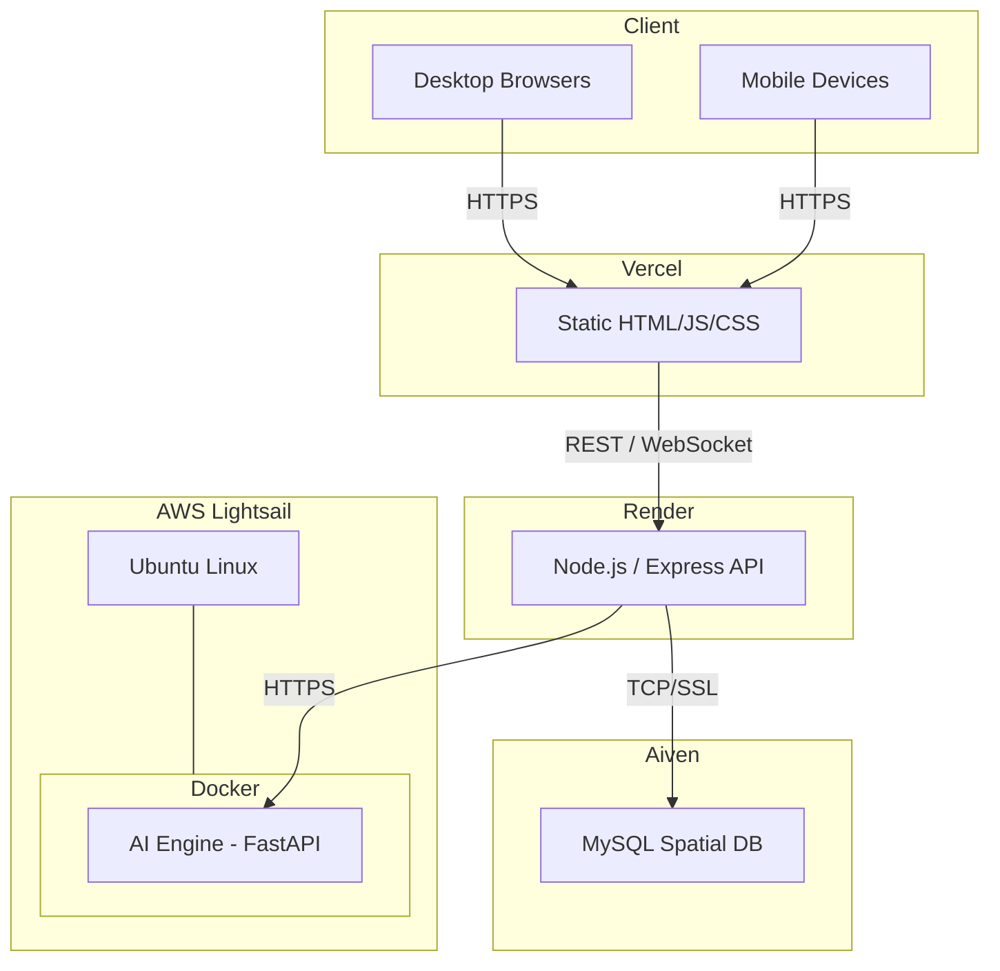
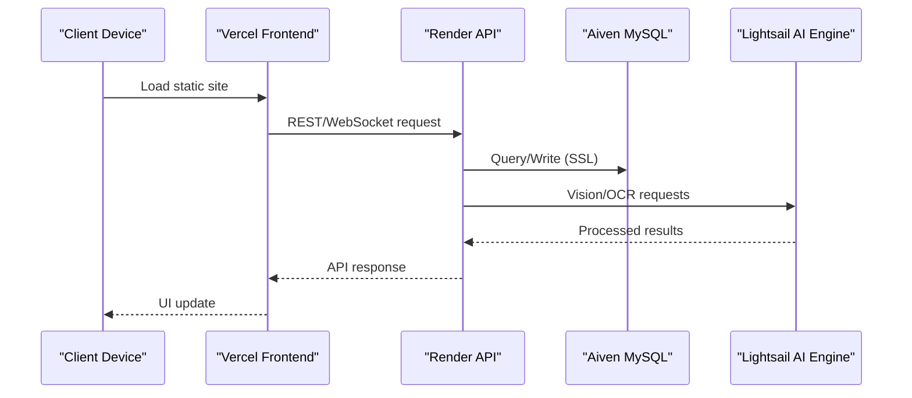
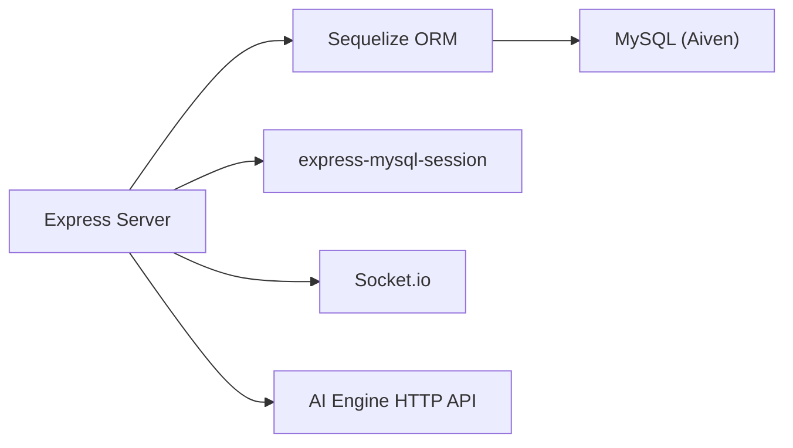

# Production Maintenance

<cite>
**Referenced Files in This Document**
- [README.md](file://README.md)
- [deployment-guide.md](file://warg-docs/docs/4-deployment/deployment-guide.md)
- [ai-engine-deployment.md](file://ai-engine/DEPLOYMENT.md)
- [schema.sql](file://database/schema.sql)
- [database.js](file://server/src/config/database.js)
- [package.json](file://server/package.json)
- [ci.yml](file://.gitea/workflows/ci.yml)
- [seed.js](file://server/seed.js)
- [dump_wp_mysql.js](file://server/dump_wp_mysql.js)
- [Dockerfile](file://ai-engine/Dockerfile)
</cite>

## Table of Contents
1. [Introduction](#introduction)
2. [Project Structure](#project-structure)
3. [Core Components](#core-components)
4. [Architecture Overview](#architecture-overview)
5. [Detailed Component Analysis](#detailed-component-analysis)
6. [Dependency Analysis](#dependency-analysis)
7. [Performance Considerations](#performance-considerations)
8. [Troubleshooting Guide](#troubleshooting-guide)
9. [Conclusion](#conclusion)
10. [Appendices](#appendices)

## Introduction
This document provides production maintenance procedures for the WARG Platform. It covers database backup and recovery, schema migration strategies, data integrity checks, performance tuning, cache and resource optimization, security patching, dependency updates, vulnerability scanning, disaster recovery, rollback procedures, incident response, capacity planning, scaling strategies, and cost optimization. The guidance is grounded in the repository’s deployment documentation, database schema, backend configuration, CI pipeline, seed scripts, and AI engine containerization.

## Project Structure
The platform is a multi-service system:
- Backend API: Node.js + Express on Render
- Database: Managed MySQL with spatial extensions on Aiven
- Frontend: Static HTML/CSS/JS on Vercel
- AI Engine: Python/FastAPI service running in Docker on AWS Lightsail

**Diagram sources**
- [deployment-guide.md:18-52](file://warg-docs/docs/4-deployment/deployment-guide.md#L18-L52)

**Section sources**
- [README.md:62-108](file://README.md#L62-L108)
- [deployment-guide.md:1-52](file://warg-docs/docs/4-deployment/deployment-guide.md#L1-L52)

## Core Components
- Database layer: MySQL with spatial extensions (SRID 4326), InnoDB, utf8mb4. Schema includes users, args, waypoints, minigames, sessions, progress, analytics, leaderboards, flags, badges, audit logs, and more.
- Backend layer: Express server using Sequelize ORM, session storage via express-mysql-session, optional Socket.io for live gameplay.
- AI engine: CPU-only PyTorch-based vision service packaged as a Docker image; minimum 1 GB RAM recommended.
- CI pipeline: Automated tests against MySQL 8.0, linting, and Playwright UI tests.

Key operational implications:
- Use managed backups from Aiven for point-in-time recovery.
- Apply migrations cautiously; prefer idempotent scripts and versioned changes.
- Monitor connection pool usage to avoid exhaustion on small plans.
- Keep AI engine isolated due to memory requirements.

**Section sources**
- [schema.sql:1-12](file://database/schema.sql#L1-L12)
- [database.js:1-38](file://server/src/config/database.js#L1-L38)
- [package.json:16-30](file://server/package.json#L16-L30)
- [Dockerfile:1-40](file://ai-engine/Dockerfile#L1-L40)

## Architecture Overview
The production architecture spans four layers:
- Client devices access the static frontend hosted on Vercel.
- The frontend calls the Express API on Render over HTTPS and WebSockets.
- The API connects to MySQL on Aiven using SSL and calls the AI Engine over HTTPS.
- The AI Engine runs in a Docker container on AWS Lightsail.

**Diagram sources**
- [deployment-guide.md:18-52](file://warg-docs/docs/4-deployment/deployment-guide.md#L18-L52)
- [ai-engine-deployment.md:47-66](file://ai-engine/DEPLOYMENT.md#L47-L66)

## Detailed Component Analysis

### Database Backup and Recovery Procedures
- Primary strategy: Use Aiven’s automated daily backups with point-in-time recovery on paid plans.
- Operational steps:
  - Verify Aiven service status and backups are enabled.
  - Before major schema changes, create an on-demand snapshot or logical dump.
  - For logical dumps, use a script that connects via the configured DATABASE_URL and exports critical tables.
  - Validate restored databases by running integrity checks and sample queries.
  - Restore to a staging environment first, then promote to production after validation.

Operational notes:
- The repository includes a MySQL query utility that demonstrates connecting via the shared database configuration and querying spatial data.
- Seed scripts show how to clear and repopulate data safely; do not run destructive seeds in production without explicit approval.

Recommended procedures:
- Schedule regular backups and retention policies aligned with compliance needs.
- Test restore procedures quarterly.
- Maintain runbooks for partial restores (e.g., single table recovery).

**Section sources**
- [deployment-guide.md:115-119](file://warg-docs/docs/4-deployment/deployment-guide.md#L115-L119)
- [dump_wp_mysql.js:1-15](file://server/dump_wp_mysql.js#L1-L15)
- [seed.js:35-58](file://server/seed.js#L35-L58)

### Schema Migration Strategies
- Current approach: The deployment guide shows using Sequelize sync to initialize the schema.
- Recommended production strategy:
  - Version all schema changes as migration files.
  - Make migrations idempotent and reversible where possible.
  - Run migrations during zero-downtime deployments with feature flags if needed.
  - Back up the database before applying migrations.
  - Validate schema post-migration with automated checks.

Migration checklist:
- Review foreign key constraints and indexes before altering tables.
- Avoid long-running DDL operations during peak hours.
- Roll back by applying reverse migrations or restoring from snapshot if necessary.

**Section sources**
- [deployment-guide.md:104-113](file://warg-docs/docs/4-deployment/deployment-guide.md#L104-L113)
- [schema.sql:1-12](file://database/schema.sql#L1-L12)

### Data Integrity Checks
- Enforce referential integrity through foreign keys defined in the schema.
- Validate spatial data consistency using SRID 4326 POINT columns and spatial indexes.
- Periodically run checks:
  - Orphaned records across related tables (e.g., waypoints without edges).
  - Consistency between denormalized aggregates (e.g., arg ratings vs computed averages).
  - Trust score and location event anomalies.

Integrity verification ideas:
- Count rows per table and compare with application counters.
- Check unique constraints and duplicate entries.
- Validate JSON fields for required keys and types.

**Section sources**
- [schema.sql:14-44](file://database/schema.sql#L14-L44)
- [schema.sql:160-179](file://database/schema.sql#L160-L179)
- [schema.sql:415-431](file://database/schema.sql#L415-L431)

### Performance Tuning
- Connection pooling:
  - Sequelize pool.max should remain low (<= 5) on small managed plans to avoid exhaustion.
  - Tune acquire and idle timeouts based on workload patterns.
- Query optimization:
  - Leverage spatial indexes on POINT columns for proximity queries.
  - Use appropriate indexes on frequently filtered columns (e.g., status, user_id, recorded_at).
- Caching:
  - Consider Redis or in-process caches for read-heavy endpoints (leaderboards, ARG metadata).
  - Cache computed views and aggregated stats with TTLs.
- AI engine:
  - Isolate heavy vision workloads to avoid OOM kills on constrained hosts.
  - Scale AI engine horizontally behind a load balancer if throughput increases.

**Section sources**
- [database.js:15-20](file://server/src/config/database.js#L15-L20)
- [deployment-guide.md:115-119](file://warg-docs/docs/4-deployment/deployment-guide.md#L115-L119)
- [schema.sql:160-179](file://database/schema.sql#L160-L179)
- [ai-engine-deployment.md:8-14](file://ai-engine/DEPLOYMENT.md#L8-L14)

### Cache Management
- Application-level caching:
  - Cache ARG listings, waypoint metadata, and leaderboard snapshots.
  - Invalidate caches on write operations (e.g., new ARG publication, rating submission).
- Session caching:
  - Use express-mysql-session for persistent sessions; ensure MySQL has sufficient connections.
- Frontend caching:
  - Use browser caching for static assets served by Vercel.
  - Implement offline resilience for active puzzles as described in features.

**Section sources**
- [package.json:21-22](file://server/package.json#L21-L22)
- [README.md:36-46](file://README.md#L36-L46)

### Resource Optimization Techniques
- Backend:
  - Disable SQL logging in production to reduce overhead.
  - Use compression middleware for large payloads.
  - Stream large responses when possible.
- AI engine:
  - Run CPU-only models to minimize resource consumption.
  - Set appropriate container limits and requests.
- Database:
  - Partition high-volume tables like location_events by time ranges.
  - Archive old analytics and audit logs.

**Section sources**
- [database.js:13-14](file://server/src/config/database.js#L13-L14)
- [schema.sql:352-372](file://database/schema.sql#L352-L372)
- [Dockerfile:1-5](file://ai-engine/Dockerfile#L1-L5)

### Security Patching Procedures
- OS and runtime:
  - Regularly update base images for AI engine containers.
  - Apply Node.js and system patches on Lightsail instances.
- Dependencies:
  - Use automated dependency updates and review changelogs.
  - Pin versions in package-lock.json and requirements.txt.
- TLS and certificates:
  - Ensure HTTPS everywhere; renew Let’s Encrypt certs automatically.
  - Prefer strict SSL validation with CA certificates in production.

**Section sources**
- [deployment-guide.md:88-102](file://warg-docs/docs/4-deployment/deployment-guide.md#L88-L102)
- [Dockerfile:13-20](file://ai-engine/Dockerfile#L13-L20)

### Dependency Updates and Vulnerability Scanning
- Backend dependencies:
  - Run npm audit regularly; remediate vulnerabilities promptly.
  - Integrate Dependabot or Renovate for automated PRs.
- Frontend dependencies:
  - Run npm audit and Playwright tests after updates.
- AI engine dependencies:
  - Update Python packages and rebuild images; test vision modules.
- CI integration:
  - Add vulnerability scanning jobs to CI pipelines.

**Section sources**
- [package.json:16-38](file://server/package.json#L16-L38)
- [ci.yml:40-54](file://.gitea/workflows/ci.yml#L40-L54)

### Disaster Recovery Planning
- RTO/RPO targets:
  - Define acceptable recovery time and data loss windows.
  - Align with Aiven backup capabilities.
- Recovery scenarios:
  - Full database restore from snapshot.
  - Partial restore for corrupted tables.
  - Service outage recovery for Render and Lightsail.
- Testing:
  - Conduct tabletop exercises and automated restore drills.

**Section sources**
- [deployment-guide.md:115-119](file://warg-docs/docs/4-deployment/deployment-guide.md#L115-L119)

### Rollback Procedures
- Database rollbacks:
  - Apply reverse migrations or restore from pre-change snapshot.
  - Validate schema and data integrity after rollback.
- Application rollbacks:
  - Re-deploy previous stable version on Render.
  - Ensure environment variables and secrets are consistent.
- AI engine rollbacks:
  - Revert container image tag and redeploy on Lightsail.

**Section sources**
- [deployment-guide.md:159-161](file://warg-docs/docs/4-deployment/deployment-guide.md#L159-L161)
- [ai-engine-deployment.md:27-43](file://ai-engine/DEPLOYMENT.md#L27-L43)

### Incident Response Protocols
- Detection:
  - Monitor health endpoints and logs on Render.
  - Alert on AI engine errors and database connection issues.
- Triage:
  - Classify severity and impact.
  - Engage relevant teams (backend, DBA, ML ops).
- Containment:
  - Isolate affected services; disable problematic features.
- Resolution:
  - Apply fixes and validate with tests.
- Postmortem:
  - Document root cause, timeline, and preventive measures.

**Section sources**
- [deployment-guide.md:163-181](file://warg-docs/docs/4-deployment/deployment-guide.md#L163-L181)

### Capacity Planning
- Backend:
  - Scale Render instances based on CPU/memory utilization and WebSocket concurrency.
- Database:
  - Monitor Aiven metrics; upgrade plan if connection pool exhaustion occurs.
- AI engine:
  - Scale Lightsail instances or add replicas behind a load balancer.
- Storage:
  - Plan for growth in assets and location events; consider partitioning and archival.

**Section sources**
- [deployment-guide.md:115-119](file://warg-docs/docs/4-deployment/deployment-guide.md#L115-L119)
- [ai-engine-deployment.md:8-14](file://ai-engine/DEPLOYMENT.md#L8-L14)

### Scaling Strategies
- Horizontal scaling:
  - Add multiple AI engine containers behind a load balancer.
  - Use Render’s auto-scaling for backend instances.
- Vertical scaling:
  - Increase instance sizes for memory-intensive AI workloads.
- Database scaling:
  - Upgrade Aiven plan; consider read replicas for analytics queries.

**Section sources**
- [ai-engine-deployment.md:18-43](file://ai-engine/DEPLOYMENT.md#L18-L43)
- [deployment-guide.md:173-177](file://warg-docs/docs/4-deployment/deployment-guide.md#L173-L177)

### Cost Optimization
- Right-size instances:
  - Use free tiers only for development; production requires paid plans for reliability.
- Optimize queries and caching:
  - Reduce database load with efficient indexing and caching.
- Archive cold data:
  - Move old analytics and audit logs to cheaper storage.
- Monitor usage:
  - Track cloud spend and set alerts for unexpected spikes.

**Section sources**
- [deployment-guide.md:123-125](file://warg-docs/docs/4-deployment/deployment-guide.md#L123-L125)
- [schema.sql:577-594](file://database/schema.sql#L577-L594)

## Dependency Analysis
The backend depends on:
- MySQL via Sequelize ORM
- Session storage via express-mysql-session
- Optional Socket.io for live gameplay
- External AI Engine over HTTPS

**Diagram sources**
- [package.json:16-30](file://server/package.json#L16-L30)
- [database.js:1-38](file://server/src/config/database.js#L1-L38)

**Section sources**
- [package.json:16-30](file://server/package.json#L16-L30)
- [database.js:1-38](file://server/src/config/database.js#L1-L38)

## Performance Considerations
- Connection pool sizing:
  - Keep pool.max <= 5 on small plans; monitor for contention.
- Logging:
  - Disable SQL logging in production to reduce overhead.
- Spatial queries:
  - Use spatial indexes and optimize radius checks.
- AI engine isolation:
  - Prevent OOM kills by running in dedicated containers with adequate RAM.

**Section sources**
- [database.js:13-20](file://server/src/config/database.js#L13-L20)
- [schema.sql:160-179](file://database/schema.sql#L160-L179)
- [ai-engine-deployment.md:8-14](file://ai-engine/DEPLOYMENT.md#L8-L14)

## Troubleshooting Guide
Common issues and resolutions:
- Database connectivity failures:
  - Verify DATABASE_URL and SSL settings.
  - Check Aiven service status and firewall rules.
- Connection pool exhaustion:
  - Reduce pool.max or upgrade plan.
  - Investigate long-running transactions.
- AI engine OOM kills:
  - Increase container memory; isolate workloads.
- WebSocket drops:
  - Ensure Render plan supports persistent connections.
  - Validate health endpoint and logs.

Diagnostic tools:
- Use dump utilities to inspect spatial data.
- Review CI pipeline outputs for test failures.
- Monitor Aiven metrics and Render logs.

**Section sources**
- [deployment-guide.md:115-119](file://warg-docs/docs/4-deployment/deployment-guide.md#L115-L119)
- [dump_wp_mysql.js:1-15](file://server/dump_wp_mysql.js#L1-L15)
- [ci.yml:40-54](file://.gitea/workflows/ci.yml#L40-L54)

## Conclusion
Production maintenance for the WARG Platform hinges on disciplined database management, cautious schema evolution, robust security practices, and careful resource allocation. By leveraging managed services, isolating heavy workloads, and automating testing and updates, the team can maintain reliability, performance, and security at scale.

## Appendices

### Environment Variables Reference
- DATABASE_URL: Full Aiven MySQL URI including credentials and SSL flag.
- PORT: Defaults to 3000; Render injects its own value.
- NODE_ENV: Set to production on Render.

**Section sources**
- [deployment-guide.md:298-320](file://warg-docs/docs/4-deployment/deployment-guide.md#L298-L320)

### Deployment Checklist Highlights
- Database:
  - Service running, schema synced, spatial indexes present.
- Backend:
  - Environment variables set, health endpoint responding, WebSockets verified.
- Frontend:
  - API_BASE points to production backend, CORS configured.

**Section sources**
- [deployment-guide.md:324-348](file://warg-docs/docs/4-deployment/deployment-guide.md#L324-L348)