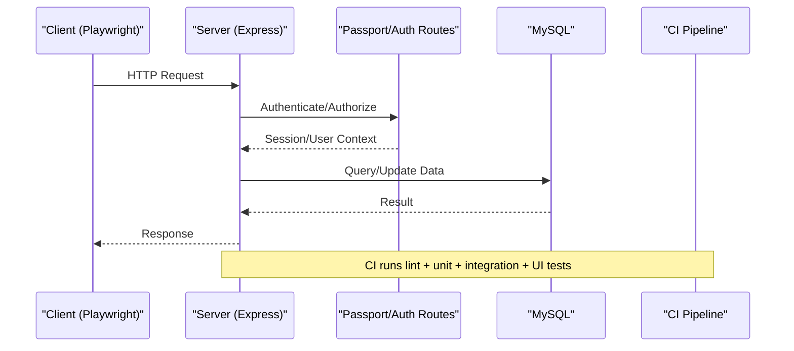
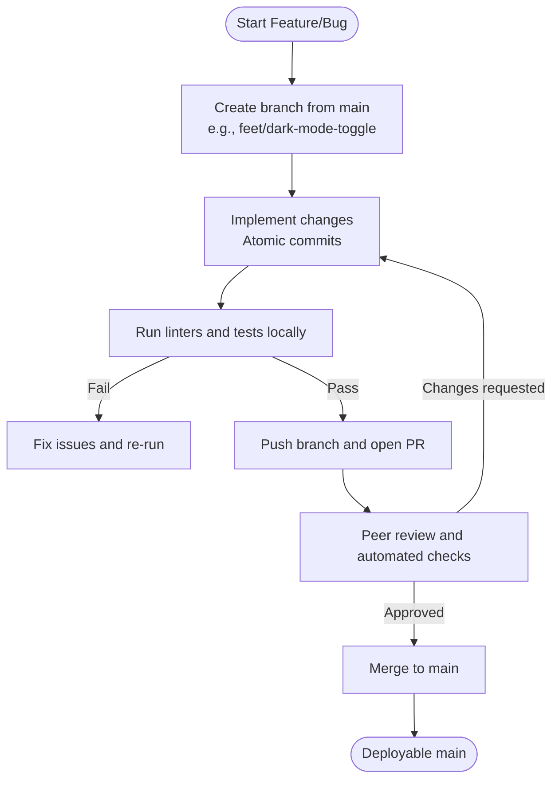
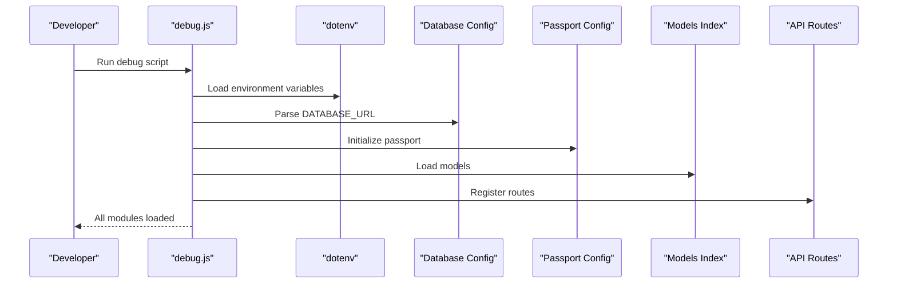
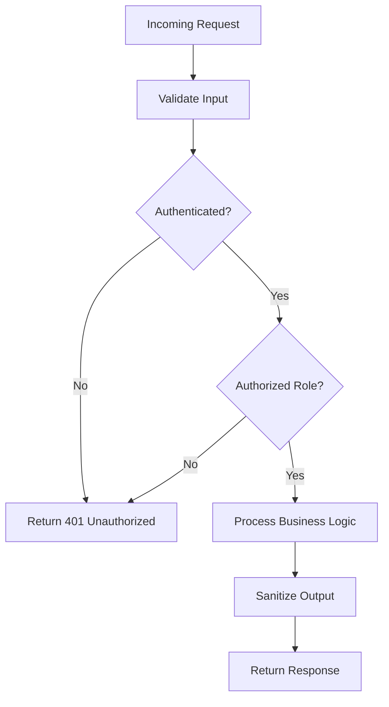
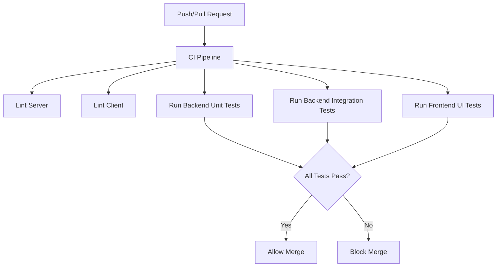
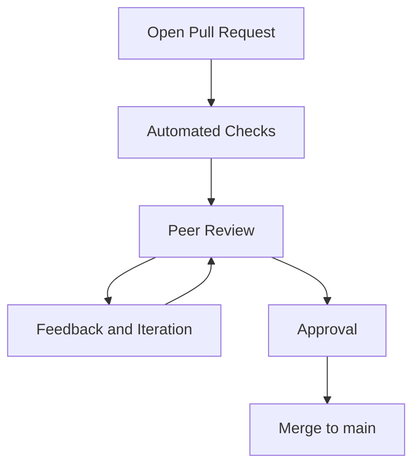
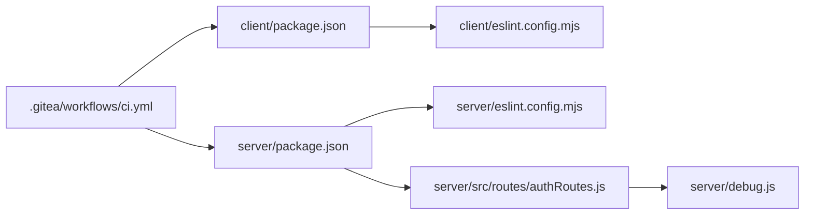

# Developer Guidelines

<cite>
**Referenced Files in This Document**
- [README.md](file://README.md)
- [git-policy.md](file://warg-docs/docs/5-policies/git-policy.md)
- [testing.md](file://warg-docs/docs/8-testing/testing.md)
- [ci.yml](file://.gitea/workflows/ci.yml)
- [client eslint.config.mjs](file://client/eslint.config.mjs)
- [server eslint.config.mjs](file://server/eslint.config.mjs)
- [server package.json](file://server/package.json)
- [client package.json](file://client/package.json)
- [authRoutes.js](file://server/src/routes/authRoutes.js)
- [debug.js](file://server/debug.js)
</cite>

## Table of Contents
1. [Introduction](#introduction)
2. [Project Structure](#project-structure)
3. [Core Components](#core-components)
4. [Architecture Overview](#architecture-overview)
5. [Detailed Component Analysis](#detailed-component-analysis)
6. [Dependency Analysis](#dependency-analysis)
7. [Performance Considerations](#performance-considerations)
8. [Troubleshooting Guide](#troubleshooting-guide)
9. [Conclusion](#conclusion)
10. [Appendices](#appendices)

## Introduction
This document provides comprehensive developer guidelines for contributing to the WARG Platform. It covers code style conventions, ESLint configurations, formatting standards for JavaScript and Python, development workflow, branching strategies, Git conventions, debugging techniques, logging practices, performance profiling methods, maintainable coding practices, documentation requirements, code review processes, security best practices, testing requirements, quality assurance processes, and templates for pull requests, issues, and feature proposals.

The platform is a location-based Alternate Reality Game (ARG) system with a Node.js/Express backend, MySQL database, Leaflet-based frontend, Google OAuth authentication, and Playwright end-to-end tests. The repository includes an AI engine service written in Python, CI pipelines, and extensive documentation.

## Project Structure
At a high level:
- client: Static HTML/CSS/JS frontend with Playwright UI tests and ESLint configuration.
- server: Node.js/Express API with Jest unit/integration tests, ESLint configuration, models, routes, controllers, middleware, and utilities.
- ai-engine: Python service for vision tasks (HSV matching, OCR, etc.).
- warg-docs: Docusaurus documentation site including policies, architecture, and testing guides.
- .gitea/workflows: CI pipeline configuration.
- database: SQL schema definitions.

```mermaid
graph TB
subgraph "Frontend"
C_PKG["client/package.json"]
C_ESLINT["client/eslint.config.mjs"]
C_PLAYWRIGHT["Playwright Tests"]
end
subgraph "Backend"
S_PKG["server/package.json"]
S_ESLINT["server/eslint.config.mjs"]
S_ROUTES["Auth Routes"]
S_MODELS["Sequelize Models"]
S_DB["MySQL"]
end
subgraph "AI Engine"
PY_MAIN["ai-engine/main.py"]
PY_VISION["ai-engine/vision/*"]
end
subgraph "Docs"
DOC_GIT["Git Policy"]
DOC_TEST["Testing & QA"]
end
subgraph "CI"
CI[".gitea/workflows/ci.yml"]
end
C_PLAYWRIGHT --> CI
S_PKG --> CI
C_PKG --> CI
CI --> S_ROUTES
S_ROUTES --> S_MODELS
S_MODELS --> S_DB
C_ESLINT --> CI
S_ESLINT --> CI
PY_MAIN --> CI
DOC_GIT --> CI
DOC_TEST --> CI
```

**Diagram sources**
- [client package.json:1-25](file://client/package.json#L1-L25)
- [server package.json:1-39](file://server/package.json#L1-L39)
- [client eslint.config.mjs:1-40](file://client/eslint.config.mjs#L1-L40)
- [server eslint.config.mjs:1-10](file://server/eslint.config.mjs#L1-L10)
- [authRoutes.js:30-72](file://server/src/routes/authRoutes.js#L30-L72)
- [ci.yml:1-74](file://.gitea/workflows/ci.yml#L1-L74)

**Section sources**
- [README.md:62-76](file://README.md#L62-L76)

## Core Components
- Frontend (client):
  - Static HTML/CSS/JS application served via Vercel.
  - ESLint rules configured for browser globals and test globals.
  - Playwright UI tests with coverage reporting.
- Backend (server):
  - Express API with Passport authentication (Google OAuth and local).
  - Sequelize ORM with MySQL spatial extensions.
  - Jest unit and integration tests; integration tests run sequentially to avoid DB collisions.
- AI Engine (Python):
  - Vision modules for HSV matching, OCR, SAM extraction, etc.
- Documentation (warg-docs):
  - Policies for Git methodology and versioning.
  - Testing and QA procedures.

Key responsibilities:
- Client: UI rendering, map interactions, game flows, Playwright E2E tests.
- Server: HTTP endpoints, session management, data persistence, auth middleware.
- AI Engine: Computer vision tasks invoked by the platform.
- Docs: Authoritative guidance on process, policy, and architecture.

**Section sources**
- [client package.json:6-23](file://client/package.json#L6-L23)
- [server package.json:6-38](file://server/package.json#L6-L38)
- [testing.md:17-31](file://warg-docs/docs/8-testing/testing.md#L17-L31)
- [git-policy.md:1-82](file://warg-docs/docs/5-policies/git-policy.md#L1-L82)

## Architecture Overview
The WARG Platform follows a client-server architecture with microservice-style separation:
- Frontend communicates with the backend via REST APIs.
- Backend manages sessions, user authentication, and data operations using Sequelize and MySQL.
- AI Engine provides specialized computer vision capabilities.
- CI enforces linting, unit tests, integration tests, and UI tests.



**Diagram sources**
- [authRoutes.js:30-72](file://server/src/routes/authRoutes.js#L30-L72)
- [ci.yml:44-74](file://.gitea/workflows/ci.yml#L44-L74)

## Detailed Component Analysis

### Code Style and Formatting Standards

#### JavaScript (Client and Server)
- Linting:
  - Client uses ESLint with recommended rules and browser globals. Test files include Node globals and disable unused vars where appropriate.
  - Server uses ESLint with Node and Jest globals, CommonJS source type, and disables unused vars in tests and debug scripts.
- Configuration highlights:
  - Client defines browser globals like api, GameCard, L, FlagModal, WARG_GAMES, GAMES, playModal, mapModal.
  - Server extends js/recommended, enables jest globals, sets sourceType to commonjs, and relaxes no-unused-vars for tests and debug files.

Recommendations:
- Keep imports organized and consistent across client and server.
- Avoid global variables unless explicitly declared in ESLint config.
- Use descriptive variable names and modularize logic into small functions.

**Section sources**
- [client eslint.config.mjs:1-40](file://client/eslint.config.mjs#L1-L40)
- [server eslint.config.mjs:1-10](file://server/eslint.config.mjs#L1-L10)

#### Python (AI Engine)
- No explicit linter or formatter configuration found in the repository for Python files.
- Recommended practices:
  - Adopt PEP 8 style guidelines.
  - Use a linter such as flake8 or ruff and a formatter like black.
  - Maintain clear module structure under ai-engine/vision with focused responsibilities per file.

Note: Since no Python tooling configuration exists in the repo, teams should propose and adopt a consistent setup before adding new Python features.

[No sources needed since this section provides general guidance]

### Development Workflow and Branching Strategy

#### Git Conventions
- Commit messages follow Conventional Commits with specific types: feet, fix, chore, test, docs, ci, revert, hotfix, perf, refactor.
- Branch naming mirrors commit types: feet/, fix/, chore/, test/, docs/, ci/, revert/, hotfix/, perf/, refactor/.
- GitHub Flow: main must always be deployable; work happens on branches off main; PRs merge directly into main after review and passing checks.
- Review rotation ensures two-person oversight.



**Diagram sources**
- [git-policy.md:9-40](file://warg-docs/docs/5-policies/git-policy.md#L9-L40)
- [git-policy.md:41-75](file://warg-docs/docs/5-policies/git-policy.md#L41-L75)

**Section sources**
- [git-policy.md:9-40](file://warg-docs/docs/5-policies/git-policy.md#L9-L40)
- [git-policy.md:41-75](file://warg-docs/docs/5-policies/git-policy.md#L41-L75)

### Debugging Techniques and Logging Practices

#### Backend Debugging
- A debug script demonstrates step-by-step module loading and environment parsing, useful for diagnosing startup issues.
- Authentication routes log errors for Google Auth and session creation failures, redirecting users with error parameters.

Guidelines:
- Use structured logs with levels (info, warn, error).
- Avoid logging sensitive data (passwords, tokens).
- Centralize logging configuration and ensure it’s disabled or minimized in production.



**Diagram sources**
- [debug.js:1-41](file://server/debug.js#L1-L41)

**Section sources**
- [debug.js:1-41](file://server/debug.js#L1-L41)
- [authRoutes.js:30-72](file://server/src/routes/authRoutes.js#L30-L72)

### Performance Profiling Methods

- Backend:
  - Use Node.js built-in profiler and Chrome DevTools for CPU/memory profiling during development.
  - Leverage Jest coverage reports to identify untested paths that may hide performance regressions.
- Frontend:
  - Playwright captures native V8 JavaScript coverage; use monocart-reporter for detailed HTML reports.
  - Monitor network requests and DOM performance via browser dev tools.

Best practices:
- Profile critical user journeys (login, map interactions, puzzle validation).
- Optimize heavy computations in AI Engine and cache results when safe.
- Avoid blocking operations on the event loop; offload long-running tasks to background jobs or services.

[No sources needed since this section provides general guidance]

### Security Best Practices

- Authentication:
  - Use Passport for both local and Google OAuth flows.
  - Validate and sanitize all inputs; never trust client-side state.
  - Secure sessions with proper expiration and storage (MySQL store configured in debug script).
- Authorization:
  - Enforce role-based access control at route/controller level.
  - Protect admin endpoints and sensitive operations.
- Data Protection:
  - Use parameterized queries via Sequelize to prevent SQL injection.
  - Encrypt sensitive data at rest and in transit (TLS for DB connections).
- Secrets Management:
  - Store credentials in environment variables; never hardcode secrets.
  - Rotate secrets regularly and restrict access.



**Diagram sources**
- [authRoutes.js:30-72](file://server/src/routes/authRoutes.js#L30-L72)
- [debug.js:10-22](file://server/debug.js#L10-L22)

**Section sources**
- [authRoutes.js:30-72](file://server/src/routes/authRoutes.js#L30-L72)
- [debug.js:10-22](file://server/debug.js#L10-L22)

### Testing Requirements and Quality Assurance

- Backend:
  - Jest unit and integration tests; integration tests run sequentially (--runInBand) to avoid DB collisions.
  - Coverage generated via npx jest --coverage --runInBand.
- Frontend:
  - Playwright UI tests with V8 coverage; HTML report at client/coverage-reports/index.html.
- CI:
  - Lint backend and frontend.
  - Run unit and integration tests for backend.
  - Install Playwright browsers and run UI tests.



**Diagram sources**
- [ci.yml:44-74](file://.gitea/workflows/ci.yml#L44-L74)
- [testing.md:17-31](file://warg-docs/docs/8-testing/testing.md#L17-L31)

**Section sources**
- [testing.md:17-31](file://warg-docs/docs/8-testing/testing.md#L17-L31)
- [ci.yml:44-74](file://.gitea/workflows/ci.yml#L44-L74)

### Writing Maintainable Code and Documentation

- Maintainability:
  - Keep functions small and single-purpose.
  - Use meaningful names and consistent patterns across client/server.
  - Prefer composition over inheritance; leverage middleware and reusable utilities.
- Documentation:
  - Update README and relevant docs when introducing new features.
  - Add inline comments for complex logic; externalize detailed explanations to warg-docs.
  - Include usage examples and migration steps for breaking changes.

[No sources needed since this section provides general guidance]

### Code Review Process

- Peer review required before merging.
- Automated tests must pass in CI.
- Deployment verification is mandatory.
- Rotating reviewers ensure balanced workload and oversight.



**Diagram sources**
- [git-policy.md:59-75](file://warg-docs/docs/5-policies/git-policy.md#L59-L75)

**Section sources**
- [git-policy.md:59-75](file://warg-docs/docs/5-policies/git-policy.md#L59-L75)

## Dependency Analysis



**Diagram sources**
- [client package.json:1-25](file://client/package.json#L1-L25)
- [server package.json:1-39](file://server/package.json#L1-L39)
- [client eslint.config.mjs:1-40](file://client/eslint.config.mjs#L1-L40)
- [server eslint.config.mjs:1-10](file://server/eslint.config.mjs#L1-L10)
- [authRoutes.js:30-72](file://server/src/routes/authRoutes.js#L30-L72)
- [debug.js:1-41](file://server/debug.js#L1-L41)
- [ci.yml:44-74](file://.gitea/workflows/ci.yml#L44-L74)

**Section sources**
- [client package.json:1-25](file://client/package.json#L1-L25)
- [server package.json:1-39](file://server/package.json#L1-L39)
- [client eslint.config.mjs:1-40](file://client/eslint.config.mjs#L1-L40)
- [server eslint.config.mjs:1-10](file://server/eslint.config.mjs#L1-L10)
- [authRoutes.js:30-72](file://server/src/routes/authRoutes.js#L30-L72)
- [debug.js:1-41](file://server/debug.js#L1-L41)
- [ci.yml:44-74](file://.gitea/workflows/ci.yml#L44-L74)

## Performance Considerations
- Database:
  - Use Sequelize associations efficiently; avoid N+1 queries.
  - Leverage MySQL spatial indexes for geospatial queries.
- Backend:
  - Minimize synchronous operations; use async/await consistently.
  - Cache frequently accessed data where appropriate.
- Frontend:
  - Lazy-load heavy components and assets.
  - Debounce user input and map interactions to reduce unnecessary calls.
- AI Engine:
  - Batch image processing and reuse model instances.
  - Profile GPU/CPU usage and optimize algorithms.

[No sources needed since this section provides general guidance]

## Troubleshooting Guide

Common issues and resolutions:
- Linting failures:
  - Ensure ESLint configs are applied correctly; check globals and sourceType settings.
- Test failures:
  - For integration tests, run sequentially (--runInBand) to avoid DB collisions.
  - Verify environment variables and database connectivity in CI.
- Authentication errors:
  - Check Passport configuration and session store settings.
  - Inspect error logs in auth routes for Google Auth and session creation failures.
- Startup issues:
  - Use debug script to trace module loading and environment parsing.

**Section sources**
- [client eslint.config.mjs:1-40](file://client/eslint.config.mjs#L1-L40)
- [server eslint.config.mjs:1-10](file://server/eslint.config.mjs#L1-L10)
- [testing.md:17-31](file://warg-docs/docs/8-testing/testing.md#L17-L31)
- [authRoutes.js:30-72](file://server/src/routes/authRoutes.js#L30-L72)
- [debug.js:1-41](file://server/debug.js#L1-L41)

## Conclusion
These guidelines establish a consistent, secure, and maintainable development process for the WARG Platform. By adhering to the defined code styles, Git conventions, testing requirements, and security practices, contributors can collaborate effectively and deliver high-quality software. Continuous improvement through documentation, reviews, and CI enforcement ensures long-term project health.

[No sources needed since this section summarizes without analyzing specific files]

## Appendices

### Templates

#### Pull Request Template
- Title: <type>(scope): <description>
- Description:
  - What does this PR do?
  - Why is this change necessary?
  - Any breaking changes?
- Checklist:
  - Linting passes
  - Unit and integration tests pass
  - UI tests pass (if applicable)
  - Documentation updated
  - Security considerations addressed

#### Issue Reporting Template
- Title: Clear and concise issue title
- Environment:
  - OS, Browser, Node.js version
- Steps to Reproduce:
  1. ...
  2. ...
  3. ...
- Expected Behavior:
- Actual Behavior:
- Screenshots/Logs:
- Additional Context:

#### Feature Proposal Template
- Title: Proposed feature name
- Problem Statement:
- Proposed Solution:
- User Stories:
- Technical Approach:
- Dependencies:
- Risks and Mitigations:
- Acceptance Criteria:

[No sources needed since these are conceptual templates]