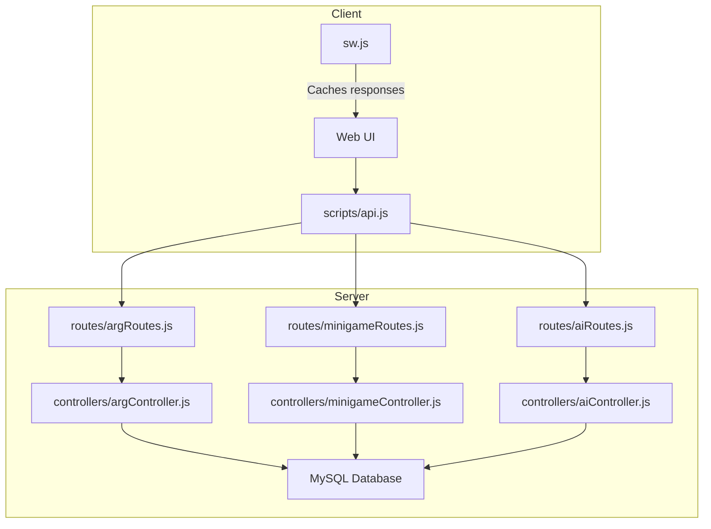
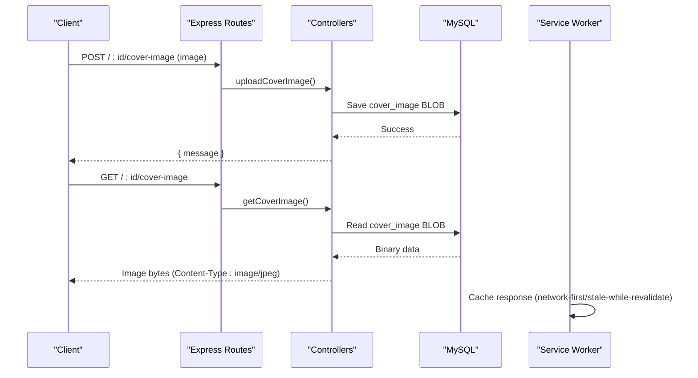
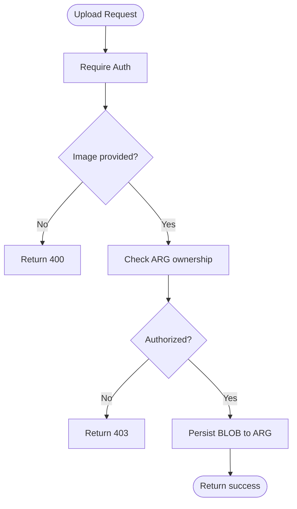
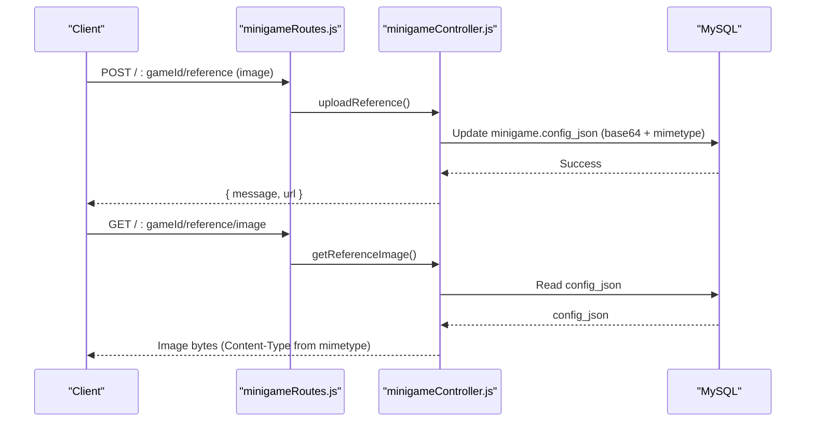
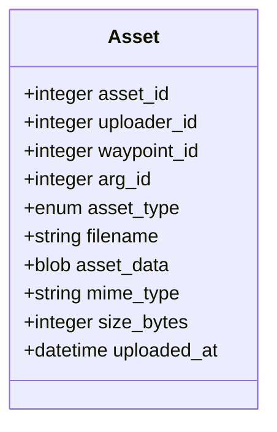
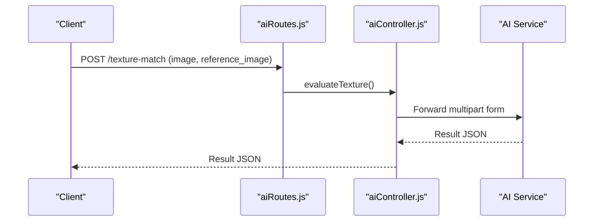
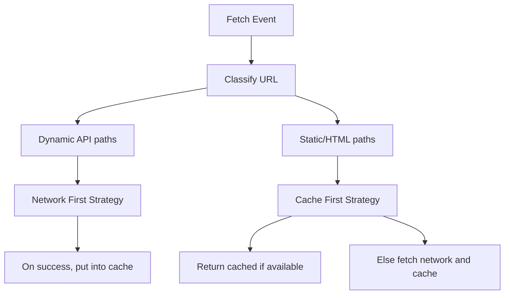
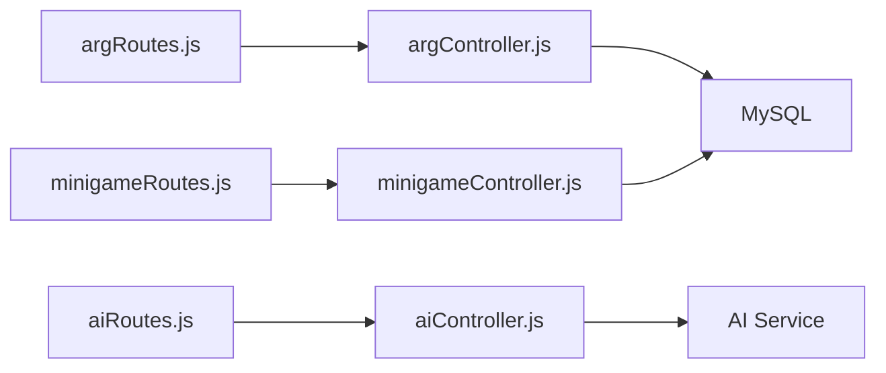

# Asset Management System

<cite>
**Referenced Files in This Document**
- [schema.sql](file://database/schema.sql)
- [Asset.js](file://server/src/models/Asset.js)
- [Arg.js](file://server/src/models/Arg.js)
- [Minigame.js](file://server/src/models/Minigame.js)
- [argRoutes.js](file://server/src/routes/argRoutes.js)
- [minigameRoutes.js](file://server/src/routes/minigameRoutes.js)
- [aiRoutes.js](file://server/src/routes/aiRoutes.js)
- [argController.js](file://server/src/controllers/argController.js)
- [minigameController.js](file://server/src/controllers/minigameController.js)
- [aiController.js](file://server/src/controllers/aiController.js)
- [api.js](file://client/scripts/api.js)
- [sw.js](file://client/sw.js)
</cite>

## Table of Contents
1. [Introduction](#introduction)
2. [Project Structure](#project-structure)
3. [Core Components](#core-components)
4. [Architecture Overview](#architecture-overview)
5. [Detailed Component Analysis](#detailed-component-analysis)
6. [Dependency Analysis](#dependency-analysis)
7. [Performance Considerations](#performance-considerations)
8. [Troubleshooting Guide](#troubleshooting-guide)
9. [Conclusion](#conclusion)

## Introduction
This document explains the asset management system used by the WARG Platform to handle images, files, and media resources for ARG creation and minigames. It covers:
- File upload interfaces and supported formats
- Size limitations and storage organization
- Asset lifecycle from upload to deployment
- Relationship between assets and minigames
- Caching strategies and performance considerations
- Guidelines for optimal asset preparation and batch processing workflows
- Troubleshooting common file handling issues

The system stores binary assets directly in the database (BLOBs) and serves them via Express endpoints. Minigames may also store small reference images inline within their configuration JSON. Client-side caching is implemented using a service worker and browser cache APIs.

## Project Structure
The asset-related functionality spans server routes, controllers, models, and client scripts:
- Server routes define upload endpoints with Multer middleware for parsing multipart/form-data requests.
- Controllers implement business logic for storing or serving assets.
- Models define database schemas for assets and related entities.
- Client scripts initiate uploads and manage caching.

**Diagram sources**
- [argRoutes.js:1-32](file://server/src/routes/argRoutes.js#L1-L32)
- [minigameRoutes.js:1-18](file://server/src/routes/minigameRoutes.js#L1-L18)
- [aiRoutes.js:1-39](file://server/src/routes/aiRoutes.js#L1-L39)
- [argController.js:410-452](file://server/src/controllers/argController.js#L410-L452)
- [minigameController.js:7-51](file://server/src/controllers/minigameController.js#L7-L51)
- [aiController.js:62-98](file://server/src/controllers/aiController.js#L62-L98)
- [sw.js:50-124](file://client/sw.js#L50-L124)

**Section sources**
- [argRoutes.js:1-32](file://server/src/routes/argRoutes.js#L1-L32)
- [minigameRoutes.js:1-18](file://server/src/routes/minigameRoutes.js#L1-L18)
- [aiRoutes.js:1-39](file://server/src/routes/aiRoutes.js#L1-L39)
- [sw.js:50-124](file://client/sw.js#L50-L124)

## Core Components
- Asset model and schema: Defines a dedicated table for generic assets with fields for type, filename, MIME type, size, and BLOB data.
- ARG cover image: Stored as a BLOB on the ARG entity and served via a dedicated endpoint.
- Minigame reference images: Stored as base64 strings inside the minigame’s config JSON and served via a dedicated endpoint.
- AI evaluation endpoints: Accept multiple files and forward them to an external AI service.

Key responsibilities:
- Upload validation and size limits are enforced at the route level using Multer.
- Storage is primarily in-memory buffers during request processing; final persistence is into MySQL BLOB columns or JSON fields.
- Serving endpoints set appropriate Content-Type headers and return binary data.

**Section sources**
- [schema.sql:257-279](file://database/schema.sql#L257-L279)
- [Asset.js:1-21](file://server/src/models/Asset.js#L1-L21)
- [Arg.js:1-31](file://server/src/models/Arg.js#L1-L31)
- [Minigame.js:1-18](file://server/src/models/Minigame.js#L1-L18)
- [argController.js:410-452](file://server/src/controllers/argController.js#L410-L452)
- [minigameController.js:7-51](file://server/src/controllers/minigameController.js#L7-L51)

## Architecture Overview
The asset pipeline consists of:
- Client initiates file upload via FormData to server routes.
- Multer parses the request and enforces size limits.
- Controller validates ownership/context and persists the asset (BLOB or JSON).
- Dedicated GET endpoints serve the stored binary data with correct MIME types.
- Service worker caches responses to improve performance and offline resilience.

**Diagram sources**
- [argRoutes.js:21-29](file://server/src/routes/argRoutes.js#L21-L29)
- [argController.js:410-452](file://server/src/controllers/argController.js#L410-L452)
- [sw.js:50-124](file://client/sw.js#L50-L124)

## Detailed Component Analysis

### ARG Cover Image Upload and Retrieval
- Upload endpoint: Requires authentication, accepts a single image field, validates ownership, and stores the buffer as a BLOB on the ARG record.
- Retrieve endpoint: Returns the stored BLOB with Content-Type set to image/jpeg.

Supported formats:
- Any MIME type starting with image/ is accepted by the route filter.

Size limitation:
- 5 MB per upload (Multer limit).

Storage organization:
- The cover image is stored directly in the ARG row’s cover_image column (MEDIUMBLOB).

**Diagram sources**
- [argRoutes.js:7-19](file://server/src/routes/argRoutes.js#L7-L19)
- [argController.js:410-452](file://server/src/controllers/argController.js#L410-L452)

**Section sources**
- [argRoutes.js:7-19](file://server/src/routes/argRoutes.js#L7-L19)
- [argController.js:410-452](file://server/src/controllers/argController.js#L410-L452)
- [schema.sql:114-151](file://database/schema.sql#L114-L151)

### Minigame Reference Image Handling
- Upload reference: Stores a base64-encoded image and its MIME type inside the minigame’s config_json.
- Serve reference: Decodes base64 and returns the image bytes with the correct MIME type.

Supported formats:
- Images (commonly JPEG/PNG), determined by the uploaded file’s MIME type.

Size limitation:
- 5 MB per upload (Multer limit).

Relationship to minigames:
- The reference image is part of the minigame configuration and is required for certain game types that rely on visual matching.

**Diagram sources**
- [minigameRoutes.js:14-16](file://server/src/routes/minigameRoutes.js#L14-L16)
- [minigameController.js:7-51](file://server/src/controllers/minigameController.js#L7-L51)
- [Minigame.js:4-10](file://server/src/models/Minigame.js#L4-L10)

**Section sources**
- [minigameRoutes.js:1-18](file://server/src/routes/minigameRoutes.js#L1-L18)
- [minigameController.js:7-51](file://server/src/controllers/minigameController.js#L7-L51)
- [Minigame.js:1-18](file://server/src/models/Minigame.js#L1-L18)

### Generic Assets Model and Schema
- The Asset model defines a table for generic multimedia assets with fields for uploader, optional associations to waypoints or ARGs, asset type, filename, BLOB data, MIME type, size, and timestamp.
- The schema includes indexes for efficient lookup by waypoint_id and arg_id.

Supported asset types:
- image, audio, video, model_3d, ar_marker.

Storage organization:
- Binary content is stored in a LONGBLOB column.

**Diagram sources**
- [Asset.js:4-18](file://server/src/models/Asset.js#L4-L18)
- [schema.sql:257-279](file://database/schema.sql#L257-L279)

**Section sources**
- [Asset.js:1-21](file://server/src/models/Asset.js#L1-L21)
- [schema.sql:257-279](file://database/schema.sql#L257-L279)

### AI Evaluation Endpoints and Multi-file Uploads
- Endpoints accept multiple files (e.g., attempt image plus reference image) and forward them to an external AI service.
- Each endpoint validates required files and constructs a multipart form to send to the AI service.

Supported formats:
- Images as defined by the respective AI endpoints (e.g., texture-match requires two images).

Size limitation:
- 5 MB per file (Multer limit).

**Diagram sources**
- [aiRoutes.js:25-28](file://server/src/routes/aiRoutes.js#L25-L28)
- [aiController.js:62-98](file://server/src/controllers/aiController.js#L62-L98)

**Section sources**
- [aiRoutes.js:1-39](file://server/src/routes/aiRoutes.js#L1-L39)
- [aiController.js:62-98](file://server/src/controllers/aiController.js#L62-L98)

### Client-Side Caching Strategies
- The service worker implements network-first, stale-while-revalidate, and cache-first strategies depending on the request path.
- Dynamic API responses are cached to support offline fallback and reduce latency.
- The client exposes a function to clear specific game-related cache entries when needed.

**Diagram sources**
- [sw.js:50-124](file://client/sw.js#L50-L124)
- [api.js:233-241](file://client/scripts/api.js#L233-L241)
- [api.js:317-340](file://client/scripts/api.js#L317-L340)

**Section sources**
- [sw.js:50-124](file://client/sw.js#L50-L124)
- [api.js:233-241](file://client/scripts/api.js#L233-L241)
- [api.js:317-340](file://client/scripts/api.js#L317-L340)

## Dependency Analysis
- Routes depend on Multer for parsing and limiting uploads.
- Controllers depend on Sequelize models for persistence.
- Minigame endpoints depend on config_json to store and retrieve reference images.
- AI endpoints depend on an external AI service for processing.

**Diagram sources**
- [argRoutes.js:1-32](file://server/src/routes/argRoutes.js#L1-L32)
- [minigameRoutes.js:1-18](file://server/src/routes/minigameRoutes.js#L1-L18)
- [aiRoutes.js:1-39](file://server/src/routes/aiRoutes.js#L1-L39)
- [argController.js:410-452](file://server/src/controllers/argController.js#L410-L452)
- [minigameController.js:7-51](file://server/src/controllers/minigameController.js#L7-L51)
- [aiController.js:62-98](file://server/src/controllers/aiController.js#L62-L98)

**Section sources**
- [argRoutes.js:1-32](file://server/src/routes/argRoutes.js#L1-L32)
- [minigameRoutes.js:1-18](file://server/src/routes/minigameRoutes.js#L1-L18)
- [aiRoutes.js:1-39](file://server/src/routes/aiRoutes.js#L1-L39)

## Performance Considerations
- In-memory buffering: All uploads use memory storage, which avoids disk I/O but increases memory usage under load. For high-throughput scenarios, consider streaming to object storage and storing only metadata in the database.
- Database payload size: Storing large BLOBs in MySQL can increase query times and backup sizes. Prefer compressing images before upload and splitting large media into smaller chunks where possible.
- Caching: Use the service worker strategies to minimize repeated downloads. Leverage cache busting for updated assets.
- CDN integration: To offload static delivery, place a CDN in front of the server and configure it to cache image endpoints with appropriate TTLs. Ensure authentication is handled securely at the edge or via signed URLs.
- Concurrency: Limit concurrent uploads per user and enforce rate limiting to protect the server from resource exhaustion.

[No sources needed since this section provides general guidance]

## Troubleshooting Guide
Common issues and resolutions:
- No image uploaded: Ensure the client sends a file field named image and that the request is multipart/form-data.
- Only image files allowed: Verify the MIME type starts with image/. Non-image files will be rejected by the route filter.
- File too large: The maximum file size is 5 MB. Compress or resize images before uploading.
- Not authorized: Confirm the authenticated user owns the ARG or has permission to modify the minigame configuration.
- Missing required files for AI endpoints: Ensure all expected files (e.g., image and reference_image) are attached to the request.
- Cache not updating: Clear the relevant cache entries using the client’s cache-clearing function or force a hard refresh.

Operational checks:
- Inspect Multer errors for size or format violations.
- Validate that Content-Type headers are correctly set when serving images.
- Monitor memory usage due to in-memory uploads and consider scaling horizontally if necessary.

**Section sources**
- [argRoutes.js:7-19](file://server/src/routes/argRoutes.js#L7-L19)
- [minigameRoutes.js:9-16](file://server/src/routes/minigameRoutes.js#L9-L16)
- [aiRoutes.js:7-10](file://server/src/routes/aiRoutes.js#L7-L10)
- [argController.js:410-452](file://server/src/controllers/argController.js#L410-L452)
- [minigameController.js:7-51](file://server/src/controllers/minigameController.js#L7-L51)
- [aiController.js:62-98](file://server/src/controllers/aiController.js#L62-L98)
- [api.js:317-340](file://client/scripts/api.js#L317-L340)

## Conclusion
The WARG Platform’s asset management system provides straightforward upload and retrieval mechanisms for ARG cover images and minigame reference images, with robust validation and size limits. Assets are persisted in the database (BLOBs or JSON), and the client leverages service worker caching for improved performance. For production-scale deployments, consider migrating to object storage, implementing compression and optimization pipelines, and integrating a CDN to reduce server load and improve delivery speed. Proper asset preparation—resizing, compressing, and choosing appropriate formats—will significantly enhance performance and reliability.

[No sources needed since this section summarizes without analyzing specific files]