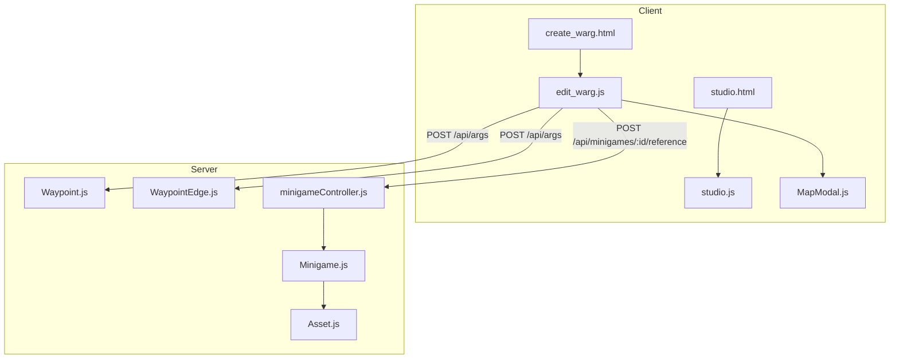
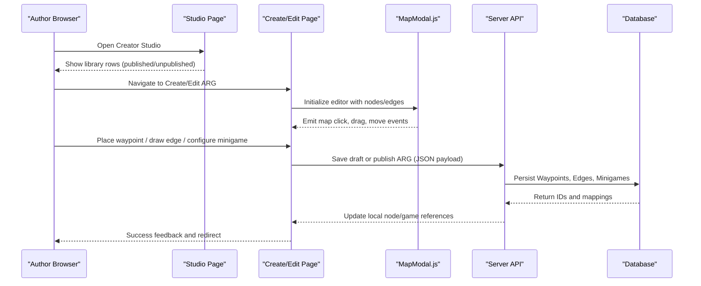
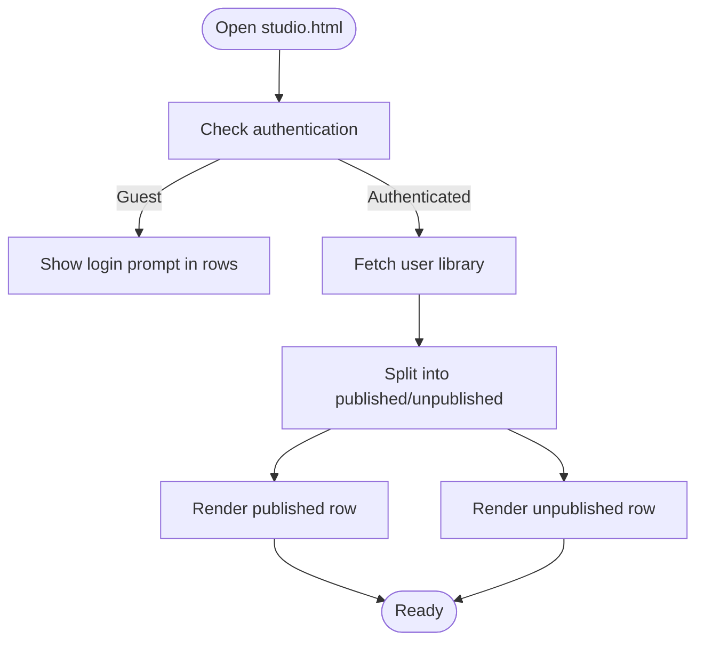
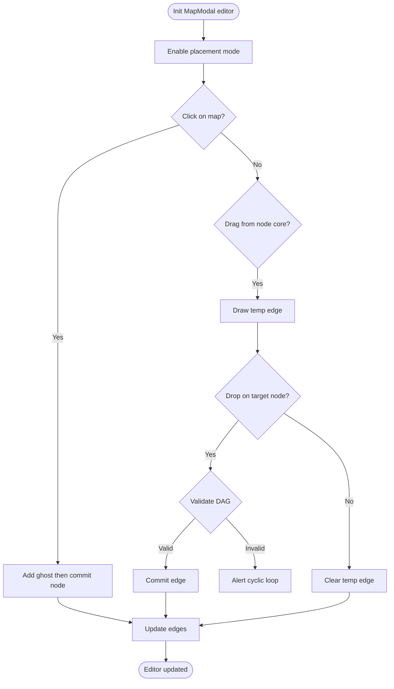
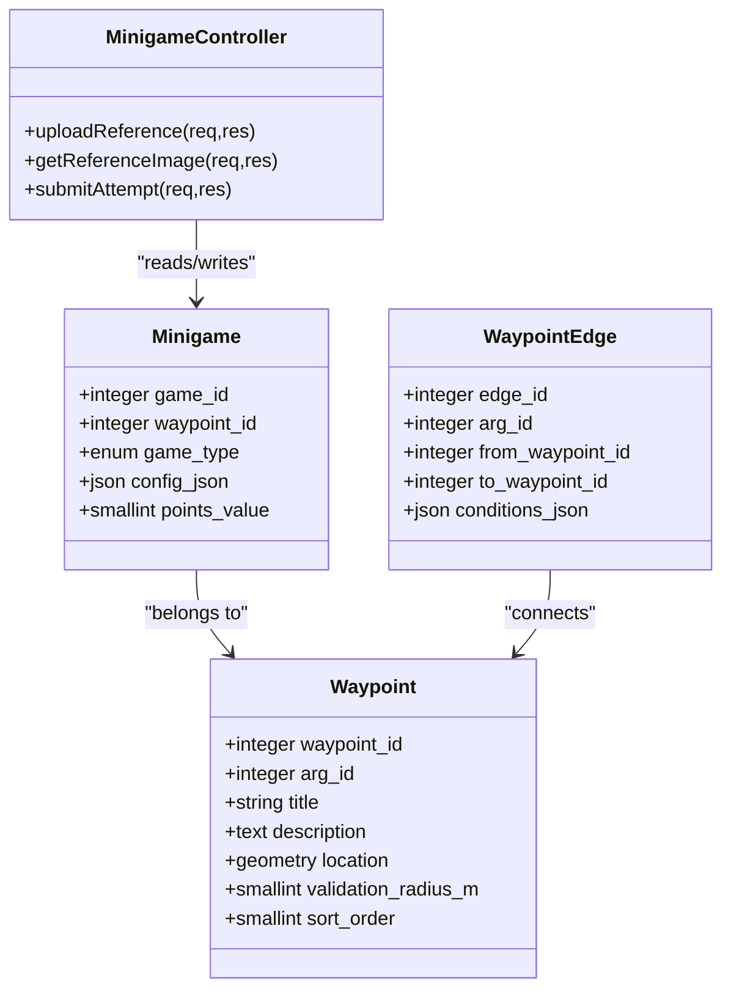
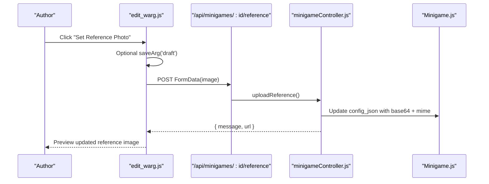
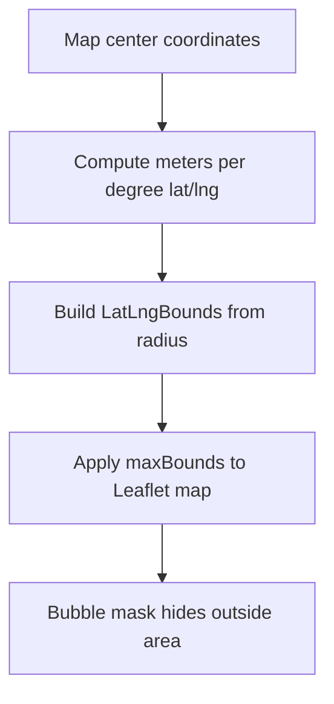
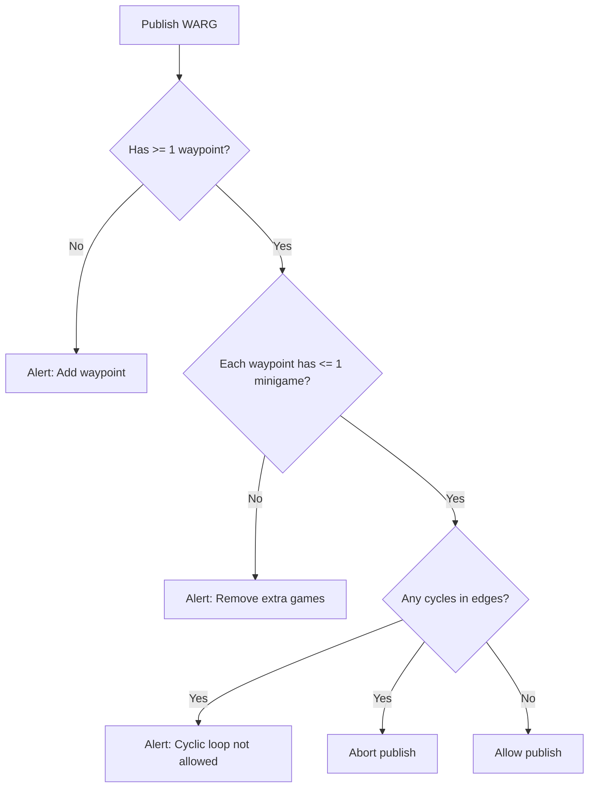
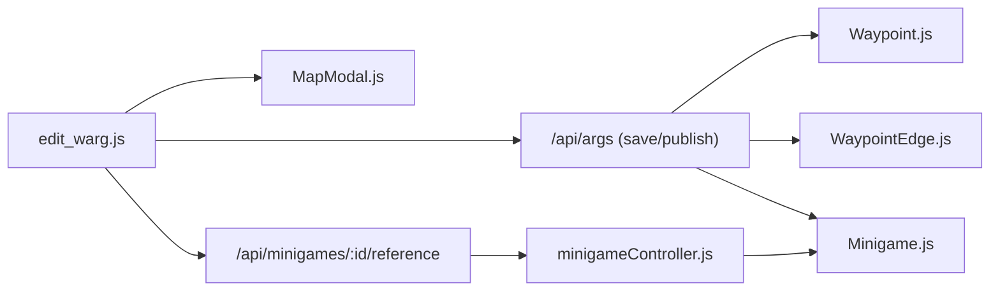

# Content Creation Tools

<cite>
**Referenced Files in This Document**
- [README.md](file://README.md)
- [studio.html](file://client/studio.html)
- [studio.js](file://client/scripts/studio.js)
- [create_warg.html](file://client/create_warg.html)
- [edit_warg.js](file://client/scripts/edit_warg.js)
- [MapModal.js](file://client/scripts/components/MapModal.js)
- [Minigame.js](file://server/src/models/Minigame.js)
- [Waypoint.js](file://server/src/models/Waypoint.js)
- [WaypointEdge.js](file://server/src/models/WaypointEdge.js)
- [minigameController.js](file://server/src/controllers/minigameController.js)
- [Asset.js](file://server/src/models/Asset.js)
</cite>

## Table of Contents
1. [Introduction](#introduction)
2. [Project Structure](#project-structure)
3. [Core Components](#core-components)
4. [Architecture Overview](#architecture-overview)
5. [Detailed Component Analysis](#detailed-component-analysis)
6. [Dependency Analysis](#dependency-analysis)
7. [Performance Considerations](#performance-considerations)
8. [Troubleshooting Guide](#troubleshooting-guide)
9. [Conclusion](#conclusion)
10. [Appendices](#appendices)

## Introduction
This document explains the content creation tools that allow ARG authors to design and publish interactive games on the WARG Platform. It covers:
- The studio interface for discovering, creating, and managing ARGs
- The interactive map editor for plotting waypoints and configuring locations
- The minigame configuration system with type selection, validation rules, and asset management
- Real-time preview behaviors such as ghost placement, edge drawing, and distance visualization
- Examples of complex game configurations, bulk editing operations, and export/import workflows

The platform is a location-based Alternate Reality Game system designed for campus play, combining geospatial gameplay, branching narrative edges, and AI-assisted visual puzzles.

**Section sources**
- [README.md:16-58](file://README.md#L16-L58)

## Project Structure
The content creation tooling spans the client and server:
- Client-side authoring UI: Studio landing page, create/edit pages, map modal component, and editor logic
- Server-side models and controllers: Waypoints, edges, minigames, assets, and reference image handling

**Diagram sources**
- [studio.html:149-186](file://client/studio.html#L149-L186)
- [studio.js:9-84](file://client/scripts/studio.js#L9-L84)
- [create_warg.html:114-244](file://client/create_warg.html#L114-L244)
- [edit_warg.js:10-271](file://client/scripts/edit_warg.js#L10-L271)
- [MapModal.js:74-133](file://client/scripts/components/MapModal.js#L74-L133)
- [Waypoint.js:4-17](file://server/src/models/Waypoint.js#L4-L17)
- [WaypointEdge.js:4-13](file://server/src/models/WaypointEdge.js#L4-L13)
- [Minigame.js:4-15](file://server/src/models/Minigame.js#L4-L15)
- [Asset.js:4-18](file://server/src/models/Asset.js#L4-L18)
- [minigameController.js:7-31](file://server/src/controllers/minigameController.js#L7-L31)

**Section sources**
- [studio.html:149-186](file://client/studio.html#L149-L186)
- [create_warg.html:114-244](file://client/create_warg.html#L114-L244)

## Core Components
- Creator Studio landing page: Displays published and unpublished ARGs and provides navigation to the builder.
- Create/Edit ARG page: Interactive map editor with waypoint placement, edge drawing, and per-waypoint minigame configuration.
- Map Modal component: Reusable Leaflet-based map with editor mode, ghost markers, SVG edges, and bubble mask.
- Minigame model and controller: Defines supported game types, stores configuration JSON, and handles reference image uploads and AI evaluation routing.
- Waypoint and Edge models: Store geographic points and directed transitions between them.

Key responsibilities:
- Studio: Library listing, publish/unpublish orchestration, navigation to builder.
- Editor: Drag-and-drop waypoint placement, real-time edge drawing, validation (DAG), save/publish flows, minigame configuration modals.
- Map Modal: Rendering, interaction events, edge projection, start-node detection, ghost placement.
- Minigame Controller: Reference image upload, base64 storage, serving images, forwarding attempts to AI service.
- Models: Schema definitions for spatial data, game types, and relationships.

**Section sources**
- [studio.js:9-84](file://client/scripts/studio.js#L9-L84)
- [edit_warg.js:10-271](file://client/scripts/edit_warg.js#L10-L271)
- [MapModal.js:74-133](file://client/scripts/components/MapModal.js#L74-L133)
- [Minigame.js:4-15](file://server/src/models/Minigame.js#L4-L15)
- [minigameController.js:7-31](file://server/src/controllers/minigameController.js#L7-L31)
- [Waypoint.js:4-17](file://server/src/models/Waypoint.js#L4-L17)
- [WaypointEdge.js:4-13](file://server/src/models/WaypointEdge.js#L4-L13)

## Architecture Overview
The content creation flow connects the author’s browser interactions to the server’s persistence layer through REST endpoints.

**Diagram sources**
- [studio.html:149-186](file://client/studio.html#L149-L186)
- [studio.js:9-84](file://client/scripts/studio.js#L9-L84)
- [create_warg.html:114-244](file://client/create_warg.html#L114-L244)
- [edit_warg.js:627-681](file://client/scripts/edit_warg.js#L627-L681)
- [Waypoint.js:4-17](file://server/src/models/Waypoint.js#L4-L17)
- [WaypointEdge.js:4-13](file://server/src/models/WaypointEdge.js#L4-L13)
- [Minigame.js:4-15](file://server/src/models/Minigame.js#L4-L15)

## Detailed Component Analysis

### Creator Studio Interface
The studio page presents:
- A hero section linking to the builder
- Published and unpublished ARG rows populated by script logic
- Navigation and profile controls

Behavior:
- Fetches current user and their library
- Splits results into published vs unpublished
- Renders skeleton placeholders while loading
- Handles guest users by prompting login
- Listens for publish/unpublish events from cards

**Diagram sources**
- [studio.html:149-186](file://client/studio.html#L149-L186)
- [studio.js:9-84](file://client/scripts/studio.js#L9-L84)

**Section sources**
- [studio.html:149-186](file://client/studio.html#L149-L186)
- [studio.js:9-84](file://client/scripts/studio.js#L9-L84)

### Interactive Map Editor
The editor integrates a Leaflet map with custom editor features:
- Ghost marker preview during placement
- Dragging markers via handle
- Drawing edges by dragging from core to another node
- Real-time edge projection using SVG overlay
- Start-node detection based on incoming edges
- Bubble mask limiting visible area around campus center

Editor workflow:
- Initialize editor with initial nodes/edges
- On map click in placement mode, add new node
- On node core down + mouse up on another node, create edge if no cycle
- On node move, update edges and positions
- On title input, update marker tooltip live

**Diagram sources**
- [edit_warg.js:200-271](file://client/scripts/edit_warg.js#L200-L271)
- [edit_warg.js:273-296](file://client/scripts/edit_warg.js#L273-L296)
- [MapModal.js:455-526](file://client/scripts/components/MapModal.js#L455-L526)
- [MapModal.js:560-594](file://client/scripts/components/MapModal.js#L560-L594)
- [MapModal.js:601-646](file://client/scripts/components/MapModal.js#L601-L646)

**Section sources**
- [create_warg.html:139-177](file://client/create_warg.html#L139-L177)
- [edit_warg.js:200-271](file://client/scripts/edit_warg.js#L200-L271)
- [MapModal.js:74-133](file://client/scripts/components/MapModal.js#L74-L133)
- [MapModal.js:455-526](file://client/scripts/components/MapModal.js#L455-L526)
- [MapModal.js:560-594](file://client/scripts/components/MapModal.js#L560-L594)
- [MapModal.js:601-646](file://client/scripts/components/MapModal.js#L601-L646)

### Minigame Configuration System
Authors can attach one minigame per waypoint and configure it via modals:
- Supported types include GPS proximity, AR object scan, barcode scanning, shape/color/texture matching, SIFT then & now, symmetry finder, plaque scanner, QnA/MCQ, and photo submit
- Frontend maps backend game types to user-friendly labels
- QnA/MCQ and Barcode have dedicated editors; other types use generic config objects
- Validation ensures at least one minigame exists before publishing and enforces single-game-per-waypoint rule

Configuration flow:
- Select game type from selector modal
- For QnA/MCQ: open modal, set question, options, correct answer
- For Barcode: open modal, enter or scan code
- For CV-type games: optionally set reference photo which uploads to server and updates config JSON

**Diagram sources**
- [Minigame.js:4-15](file://server/src/models/Minigame.js#L4-L15)
- [Waypoint.js:4-17](file://server/src/models/Waypoint.js#L4-L17)
- [WaypointEdge.js:4-13](file://server/src/models/WaypointEdge.js#L4-L13)
- [minigameController.js:7-31](file://server/src/controllers/minigameController.js#L7-L31)

**Section sources**
- [create_warg.html:292-317](file://client/create_warg.html#L292-L317)
- [edit_warg.js:27-42](file://client/scripts/edit_warg.js#L27-L42)
- [edit_warg.js:956-1002](file://client/scripts/edit_warg.js#L956-L1002)
- [edit_warg.js:1020-1080](file://client/scripts/edit_warg.js#L1020-L1080)
- [edit_warg.js:1088-1160](file://client/scripts/edit_warg.js#L1088-L1160)
- [Minigame.js:4-15](file://server/src/models/Minigame.js#L4-L15)

### Asset Management System
Reference images for CV-type minigames are uploaded via the editor:
- Frontend triggers file input when setting reference photo
- If necessary, saves ARG draft first to ensure minigame ID exists
- Uploads image to server endpoint which stores base64 and MIME type in minigame config JSON
- Serves reference image back via a dedicated route

**Diagram sources**
- [edit_warg.js:385-439](file://client/scripts/edit_warg.js#L385-L439)
- [minigameController.js:7-31](file://server/src/controllers/minigameController.js#L7-L31)
- [Minigame.js:4-15](file://server/src/models/Minigame.js#L4-L15)

**Section sources**
- [edit_warg.js:385-439](file://client/scripts/edit_warg.js#L385-L439)
- [minigameController.js:7-31](file://server/src/controllers/minigameController.js#L7-L31)

### Distance Calculation Visualization
The map modal computes a geodesic bounds box around the map center to constrain the view within a campus bubble radius. This supports realistic placement boundaries and helps authors visualize valid areas.

**Diagram sources**
- [MapModal.js:347-364](file://client/scripts/components/MapModal.js#L347-L364)
- [MapModal.js:366-386](file://client/scripts/components/MapModal.js#L366-L386)
- [MapModal.js:753-800](file://client/scripts/components/MapModal.js#L753-L800)

**Section sources**
- [MapModal.js:347-364](file://client/scripts/components/MapModal.js#L347-L364)
- [MapModal.js:366-386](file://client/scripts/components/MapModal.js#L366-L386)
- [MapModal.js:753-800](file://client/scripts/components/MapModal.js#L753-L800)

### Validation Rules for Game Logic
- At least one waypoint required before publishing
- One minigame per waypoint enforced by frontend selector
- Directed acyclic graph (DAG) constraint prevents cycles in waypoint edges
- Unlimited attempts flag affects transition behavior: fail branch never triggers if enabled

**Diagram sources**
- [edit_warg.js:713-735](file://client/scripts/edit_warg.js#L713-L735)
- [edit_warg.js:956-967](file://client/scripts/edit_warg.js#L956-L967)
- [edit_warg.js:252-261](file://client/scripts/edit_warg.js#L252-L261)
- [edit_warg.js:549-554](file://client/scripts/edit_warg.js#L549-L554)

**Section sources**
- [edit_warg.js:713-735](file://client/scripts/edit_warg.js#L713-L735)
- [edit_warg.js:956-967](file://client/scripts/edit_warg.js#L956-L967)
- [edit_warg.js:252-261](file://client/scripts/edit_warg.js#L252-L261)
- [edit_warg.js:549-554](file://client/scripts/edit_warg.js#L549-L554)

### Examples of Complex Game Configurations
- Multi-step ARG with branching paths:
  - Waypoint A: GPS Location
  - Waypoint B: AR Object Scan with reference image
  - Waypoint C: Barcode Game with scanned value
  - Waypoint D: Shape Match requiring reference photo
  - Edges configured with pass/fail triggers per predecessor game
- QnA/MCQ with multiple options and correct index stored in config JSON
- CV-type games (color/shape/texture/SIFT/symmetry/plaque) with reference images embedded in minigame config

These configurations are represented in the editor’s node list and edge triggers, persisted via save/publish flows.

**Section sources**
- [create_warg.html:292-317](file://client/create_warg.html#L292-L317)
- [edit_warg.js:27-42](file://client/scripts/edit_warg.js#L27-L42)
- [edit_warg.js:334-583](file://client/scripts/edit_warg.js#L334-L583)
- [edit_warg.js:1020-1080](file://client/scripts/edit_warg.js#L1020-L1080)
- [edit_warg.js:1088-1160](file://client/scripts/edit_warg.js#L1088-L1160)

### Bulk Editing Operations
- Title/description edits auto-update state and map tooltips in real time
- Multiple waypoints can be added iteratively via placement mode
- Edge connections can be drawn between any two nodes (subject to DAG validation)
- Delete operations for nodes and edges are confirmed via modal dialogs

While there is no explicit “bulk edit” button, authors can efficiently manage large graphs by:
- Using placement mode to add many waypoints quickly
- Drawing edges in batches and reviewing transitions
- Updating titles/descriptions inline for immediate feedback

**Section sources**
- [edit_warg.js:605-625](file://client/scripts/edit_warg.js#L605-L625)
- [edit_warg.js:586-603](file://client/scripts/edit_warg.js#L586-L603)
- [edit_warg.js:791-811](file://client/scripts/edit_warg.js#L791-L811)

### Export/Import Functionality for Game Templates
There is no explicit export/import feature implemented in the analyzed files. Authors can:
- Use the save/publish flow to persist templates to the database
- Replicate configurations by manually recreating nodes, edges, and minigame settings
- Share ARGs publicly once published so others can discover and play them

If template portability is needed, consider adding:
- Export to JSON schema including waypoints, edges, and minigame configs
- Import wizard to parse and validate imported templates
- Versioning and diffing capabilities for template evolution

[No sources needed since this section proposes future functionality without analyzing specific files]

## Dependency Analysis
The editor depends on:
- MapModal for rendering and interaction
- API endpoints for saving ARGs and uploading reference images
- Server models for persistence of waypoints, edges, and minigames

**Diagram sources**
- [edit_warg.js:627-681](file://client/scripts/edit_warg.js#L627-L681)
- [edit_warg.js:385-439](file://client/scripts/edit_warg.js#L385-L439)
- [MapModal.js:74-133](file://client/scripts/components/MapModal.js#L74-L133)
- [Waypoint.js:4-17](file://server/src/models/Waypoint.js#L4-L17)
- [WaypointEdge.js:4-13](file://server/src/models/WaypointEdge.js#L4-L13)
- [Minigame.js:4-15](file://server/src/models/Minigame.js#L4-L15)
- [minigameController.js:7-31](file://server/src/controllers/minigameController.js#L7-L31)

**Section sources**
- [edit_warg.js:627-681](file://client/scripts/edit_warg.js#L627-L681)
- [edit_warg.js:385-439](file://client/scripts/edit_warg.js#L385-L439)
- [MapModal.js:74-133](file://client/scripts/components/MapModal.js#L74-L133)
- [Waypoint.js:4-17](file://server/src/models/Waypoint.js#L4-L17)
- [WaypointEdge.js:4-13](file://server/src/models/WaypointEdge.js#L4-L13)
- [Minigame.js:4-15](file://server/src/models/Minigame.js#L4-L15)
- [minigameController.js:7-31](file://server/src/controllers/minigameController.js#L7-L31)

## Performance Considerations
- Leaflet initialization and CSS injection are deferred until needed to reduce startup cost
- Edge SVG lines are redrawn only on map movement/zoom to avoid unnecessary reflows
- Ghost markers and temporary edges are created lazily and removed promptly
- Reference image upload uses base64 storage in config JSON; consider external storage for large assets to reduce payload size
- AI evaluation routes forward images to an external service; network latency may affect attempt submission times

[No sources needed since this section provides general guidance]

## Troubleshooting Guide
Common issues and resolutions:
- Cannot place waypoints: Ensure placement mode is active and map is initialized
- Edge creation blocked: Check for cycles; the editor enforces DAG constraints
- Reference image not showing: Confirm minigame was saved before upload and that the server returned success
- Publish fails: Verify at least one waypoint exists and each waypoint has exactly one minigame
- Unlimited attempts warning: Fail branch will not trigger if unlimited attempts is enabled; adjust transition triggers accordingly

Operational checks:
- Confirm authentication before accessing library and builder
- Validate network connectivity for API calls and AI service integration
- Inspect console errors for failed fetch requests or AI service responses

**Section sources**
- [edit_warg.js:252-261](file://client/scripts/edit_warg.js#L252-L261)
- [edit_warg.js:713-735](file://client/scripts/edit_warg.js#L713-L735)
- [edit_warg.js:385-439](file://client/scripts/edit_warg.js#L385-L439)
- [edit_warg.js:549-554](file://client/scripts/edit_warg.js#L549-L554)

## Conclusion
The WARG Platform’s content creation tools provide a robust authoring environment for designing location-based ARGs. The studio interface streamlines library management, while the interactive map editor offers intuitive waypoint placement, edge drawing, and real-time previews. The minigame configuration system supports diverse puzzle types with validation rules ensuring logical game structures. Although export/import is not yet implemented, the existing save/publish pipeline enables persistent templates and public sharing. Future enhancements could introduce template portability and advanced bulk editing to further empower creators.

[No sources needed since this section summarizes without analyzing specific files]

## Appendices
- Supported minigame types (frontend mapping):
  - gps_proximity → GPS Location
  - ar_object_scan → AR Object Scan
  - qr_barcode → Barcode Game
  - shape_match → Shape Match
  - colour_match → Colour Match
  - texture_match → Texture Match
  - sift_match → Then & Now (SIFT)
  - symmetry_finder → Symmetry Finder
  - photo_submit → Photo Submit
  - text_answer → QnA / MCQ
  - plaque_scan → Plaque Scanner

**Section sources**
- [edit_warg.js:27-42](file://client/scripts/edit_warg.js#L27-L42)