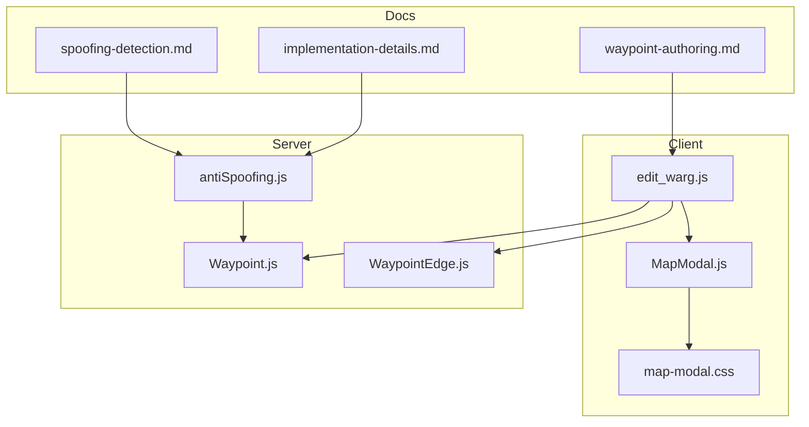
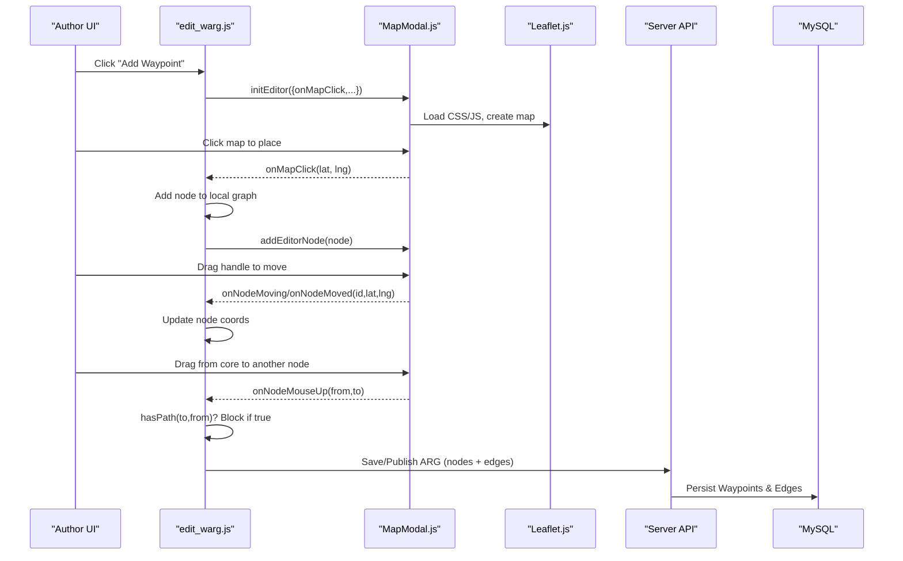
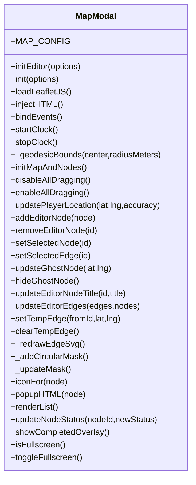
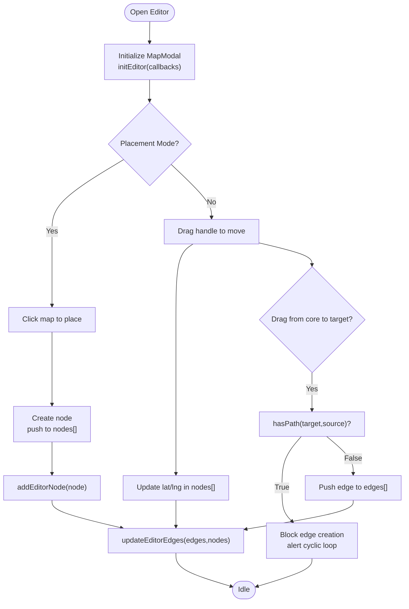
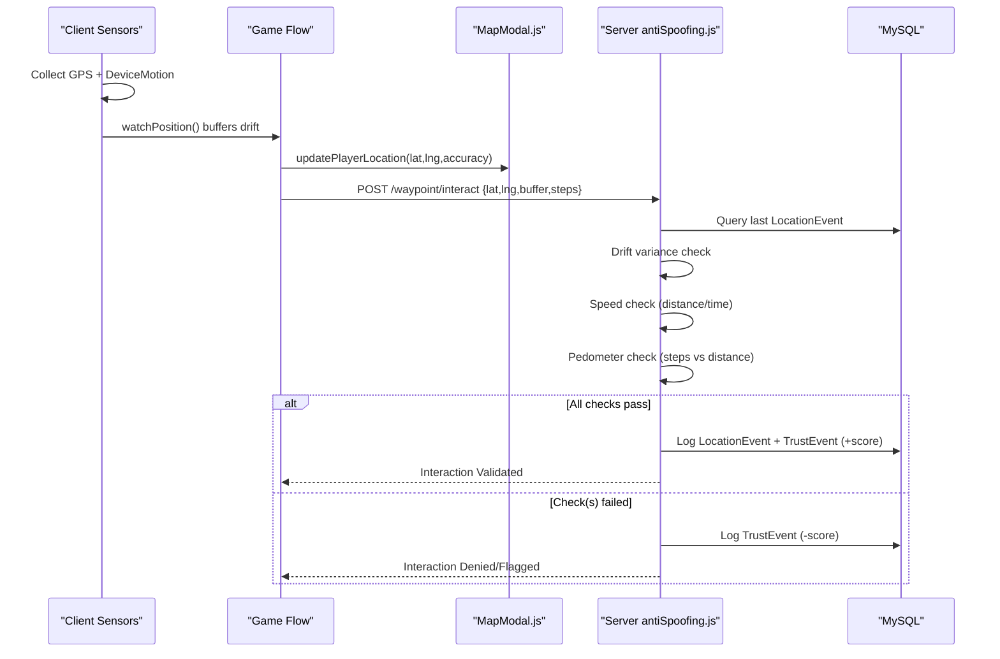
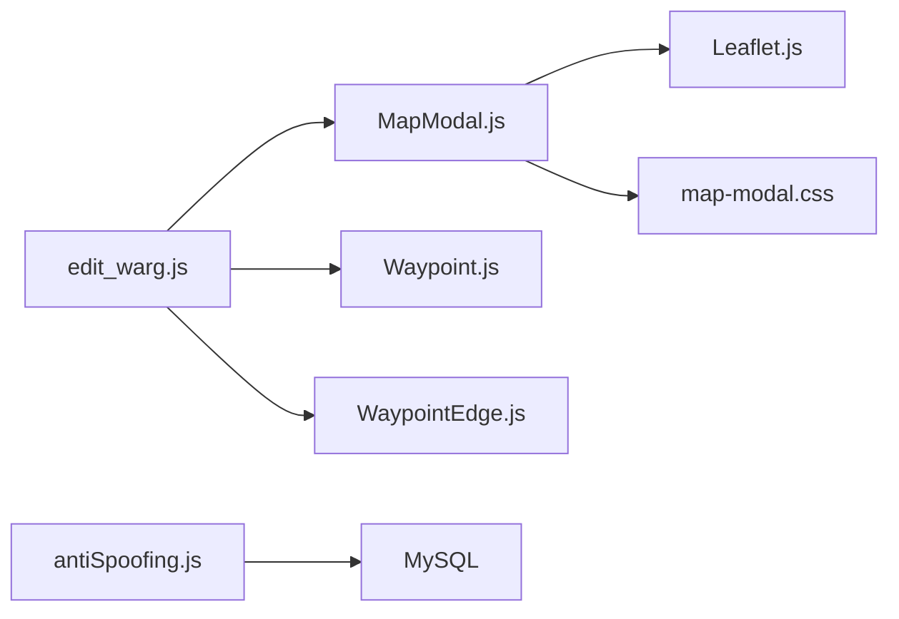

# Interactive Map Editor

<cite>
**Referenced Files in This Document**
- [MapModal.js](file://client/scripts/components/MapModal.js)
- [map-modal.css](file://client/styles/map-modal.css)
- [edit_warg.js](file://client/scripts/edit_warg.js)
- [Waypoint.js](file://server/src/models/Waypoint.js)
- [WaypointEdge.js](file://server/src/models/WaypointEdge.js)
- [waypoint-authoring.md](file://warg-docs/docs/2-architecture-and-design/waypoint-authoring.md)
- [antiSpoofing.js](file://server/src/middleware/antiSpoofing.js)
- [spoofing-detection.md](file://warg-docs/docs/2-architecture-and-design/spoofing-detection.md)
- [implementation-details.md](file://warg-docs/docs/2-architecture-and-design/implementation-details.md)
</cite>

## Table of Contents
1. [Introduction](#introduction)
2. [Project Structure](#project-structure)
3. [Core Components](#core-components)
4. [Architecture Overview](#architecture-overview)
5. [Detailed Component Analysis](#detailed-component-analysis)
6. [Dependency Analysis](#dependency-analysis)
7. [Performance Considerations](#performance-considerations)
8. [Troubleshooting Guide](#troubleshooting-guide)
9. [Conclusion](#conclusion)

## Introduction
This document explains the interactive map editor used by ARG authors to plot waypoints and configure location-based puzzles. It covers Leaflet.js integration, waypoint placement mechanics, distance calculation visualization, real-time coordinate validation, drag-and-drop positioning, proximity radius configuration, visual feedback for accuracy, geospatial validation, anti-spoofing mechanisms, and how map coordinates relate to game logic. It also includes examples of complex waypoint configurations, bulk editing operations, and troubleshooting guidance.

## Project Structure
The interactive map editor is implemented primarily on the client side with supporting server-side models and middleware:
- Client components:
  - Map modal and Leaflet integration: MapModal.js
  - Styling and visual feedback: map-modal.css
  - Authoring workflow and graph interactions: edit_warg.js
- Server models:
  - Waypoint entity (location geometry and validation radius): Waypoint.js
  - Edge entity (directed connections between waypoints): WaypointEdge.js
- Documentation and security:
  - Waypoint authoring concepts and DAG rules: waypoint-authoring.md
  - Anti-spoofing middleware and detection strategies: antiSpoofing.js, spoofing-detection.md, implementation-details.md

**Diagram sources**
- [MapModal.js:1-1032](file://client/scripts/components/MapModal.js#L1-L1032)
- [map-modal.css:1-803](file://client/styles/map-modal.css#L1-L803)
- [edit_warg.js:1-1190](file://client/scripts/edit_warg.js#L1-L1190)
- [Waypoint.js:1-20](file://server/src/models/Waypoint.js#L1-L20)
- [WaypointEdge.js:1-16](file://server/src/models/WaypointEdge.js#L1-L16)
- [waypoint-authoring.md:1-45](file://warg-docs/docs/2-architecture-and-design/waypoint-authoring.md#L1-L45)
- [antiSpoofing.js:1-38](file://server/src/middleware/antiSpoofing.js#L1-L38)
- [spoofing-detection.md:26-46](file://warg-docs/docs/2-architecture-and-design/spoofing-detection.md#L26-L46)
- [implementation-details.md:33-67](file://warg-docs/docs/2-architecture-and-design/implementation-details.md#L33-L67)

**Section sources**
- [MapModal.js:1-1032](file://client/scripts/components/MapModal.js#L1-L1032)
- [map-modal.css:1-803](file://client/styles/map-modal.css#L1-L803)
- [edit_warg.js:1-1190](file://client/scripts/edit_warg.js#L1-L1190)
- [Waypoint.js:1-20](file://server/src/models/Waypoint.js#L1-L20)
- [WaypointEdge.js:1-16](file://server/src/models/WaypointEdge.js#L1-L16)
- [waypoint-authoring.md:1-45](file://warg-docs/docs/2-architecture-and-design/waypoint-authoring.md#L1-L45)
- [antiSpoofing.js:1-38](file://server/src/middleware/antiSpoofing.js#L1-L38)
- [spoofing-detection.md:26-46](file://warg-docs/docs/2-architecture-and-design/spoofing-detection.md#L26-L46)
- [implementation-details.md:33-67](file://warg-docs/docs/2-architecture-and-design/implementation-details.md#L33-L67)

## Core Components
- MapModal.js: Provides a dual-mode map component (editor and player). In editor mode it renders draggable markers, SVG edges, ghost placement previews, and a circular bubble mask that constrains visibility to a campus area. It dynamically loads Leaflet CSS/JS and manages marker state, selection, dragging, and edge drawing.
- edit_warg.js: Orchestrates the authoring workflow. It initializes MapModal in editor mode, handles click-to-place, drag-to-move, edge drawing with cycle prevention (BFS), panel updates for node/edge properties, and save/publish flows.
- map-modal.css: Styles the modal, HUD, markers, popups, and editor-specific visuals (ghost nodes, start nodes, selected states).
- Waypoint.js: Defines the database schema for waypoints including a geospatial POINT column and a validation_radius_m field for proximity checks.
- WaypointEdge.js: Defines the directed edge table linking from_waypoint_id to to_waypoint_id with optional conditions_json for branching logic.
- antiSpoofing.js: Middleware that validates location submissions using drift variance, speed checks, and pedometer correlation.
- Documentation files: Explain the graph model, DAG enforcement, and anti-spoofing design.

**Section sources**
- [MapModal.js:1-1032](file://client/scripts/components/MapModal.js#L1-L1032)
- [edit_warg.js:1-1190](file://client/scripts/edit_warg.js#L1-L1190)
- [map-modal.css:1-803](file://client/styles/map-modal.css#L1-L803)
- [Waypoint.js:1-20](file://server/src/models/Waypoint.js#L1-L20)
- [WaypointEdge.js:1-16](file://server/src/models/WaypointEdge.js#L1-L16)
- [antiSpoofing.js:1-38](file://server/src/middleware/antiSpoofing.js#L1-L38)
- [waypoint-authoring.md:1-45](file://warg-docs/docs/2-architecture-and-design/waypoint-authoring.md#L1-L45)
- [spoofing-detection.md:26-46](file://warg-docs/docs/2-architecture-and-design/spoofing-detection.md#L26-L46)
- [implementation-details.md:33-67](file://warg-docs/docs/2-architecture-and-design/implementation-details.md#L33-L67)

## Architecture Overview
The editor integrates Leaflet.js via dynamic script injection, renders markers and SVG edges, and exposes callbacks for placement and movement. The authoring script wires these callbacks to maintain an in-memory graph of nodes and edges, enforcing DAG constraints before persisting changes. On the server, waypoints store geospatial data and validation radii; edges define directed transitions. Anti-spoofing middleware validates player interactions based on drift, speed, and pedometer signals.

**Diagram sources**
- [edit_warg.js:200-300](file://client/scripts/edit_warg.js#L200-L300)
- [MapModal.js:74-133](file://client/scripts/components/MapModal.js#L74-L133)
- [MapModal.js:461-526](file://client/scripts/components/MapModal.js#L461-L526)
- [Waypoint.js:1-20](file://server/src/models/Waypoint.js#L1-L20)
- [WaypointEdge.js:1-16](file://server/src/models/WaypointEdge.js#L1-L16)

## Detailed Component Analysis

### MapModal.js — Leaflet Integration and Editor Mode
Key responsibilities:
- Dynamic loading of Leaflet CSS/JS and HTML structure injection.
- Editor mode initialization with callbacks for map clicks, node selection/movement, and edge drawing.
- Rendering draggable editor markers with custom icons and a small drag handle.
- SVG overlay for drawing edges between nodes, including temporary preview lines while drawing.
- Circular bubble mask to restrict visible area around a center point using geodesic bounds.
- Player mode utilities such as updating player location and accuracy radius.

Important behaviors:
- Geodesic bounds computation uses meters-per-degree approximations to constrain the map viewport.
- Marker dragging is intentionally disabled by default; only the handle enables dragging to avoid accidental moves.
- Edge drawing uses mouse events on marker cores and map-level mousemove/mouseup to render dashed SVG lines with arrowheads.
- Selection highlights both nodes and edges.

**Diagram sources**
- [MapModal.js:1-1032](file://client/scripts/components/MapModal.js#L1-L1032)

**Section sources**
- [MapModal.js:74-133](file://client/scripts/components/MapModal.js#L74-L133)
- [MapModal.js:186-199](file://client/scripts/components/MapModal.js#L186-L199)
- [MapModal.js:347-386](file://client/scripts/components/MapModal.js#L347-L386)
- [MapModal.js:461-526](file://client/scripts/components/MapModal.js#L461-L526)
- [MapModal.js:596-751](file://client/scripts/components/MapModal.js#L596-L751)
- [MapModal.js:753-854](file://client/scripts/components/MapModal.js#L753-L854)
- [MapModal.js:856-915](file://client/scripts/components/MapModal.js#L856-L915)

### edit_warg.js — Authoring Workflow and Graph Logic
Key responsibilities:
- Initialize MapModal in editor mode and wire event callbacks.
- Handle click-to-place new waypoints and update the in-memory nodes array.
- Manage drag-to-move and reflect coordinates back into the nodes array.
- Implement edge drawing by dragging from one node’s core to another, with BFS cycle detection to enforce DAG.
- Provide UI panels for editing node titles/descriptions and configuring minigame triggers per edge.
- Save and publish ARGs, mapping frontend IDs to backend IDs and persisting waypoints and edges.

Complex configurations:
- Multiple minigames per waypoint with reference images and unlimited attempts toggles.
- Conditional transitions based on minigame outcomes (pass/fail) stored in edge conditions.

Bulk editing operations:
- Global save/publish actions that serialize all nodes and edges.
- Bulk removal of nodes and associated edges when deleting a waypoint.

**Diagram sources**
- [edit_warg.js:200-300](file://client/scripts/edit_warg.js#L200-L300)
- [edit_warg.js:273-289](file://client/scripts/edit_warg.js#L273-L289)
- [edit_warg.js:586-603](file://client/scripts/edit_warg.js#L586-L603)
- [edit_warg.js:627-681](file://client/scripts/edit_warg.js#L627-L681)

**Section sources**
- [edit_warg.js:1-1190](file://client/scripts/edit_warg.js#L1-L1190)

### map-modal.css — Visual Feedback System
Highlights:
- Dark theme with accent colors and subtle scan overlays.
- Marker styles for completed/current/locked states and editor-specific variants (ghost, selected, start-node).
- Popup styling for player mode with badges, progress bars, and action buttons.
- Responsive layout adjustments for mobile devices.

These styles provide immediate visual feedback for:
- Node selection and hover states.
- Ghost placement preview during placement mode.
- Start node indicators and edge highlighting.

**Section sources**
- [map-modal.css:1-803](file://client/styles/map-modal.css#L1-L803)

### Waypoint.js and WaypointEdge.js — Data Models
- Waypoint stores geospatial POINT data and a validation_radius_m field defining the acceptable proximity for arrival checks.
- WaypointEdge defines directed connections between waypoints with optional conditions_json for branching logic.

These models underpin the graph structure described in the documentation and are persisted by the server when saving or publishing ARGs.

**Section sources**
- [Waypoint.js:1-20](file://server/src/models/Waypoint.js#L1-L20)
- [WaypointEdge.js:1-16](file://server/src/models/WaypointEdge.js#L1-L16)

### Waypoint Authoring Concepts
The authoring system treats ARGs as directed graphs:
- Nodes represent waypoints; edges represent sequential flow.
- Root nodes (in-degree zero) determine starting points; multiple roots unlock simultaneously.
- If no edges exist, all waypoints are treated as root nodes (open-world collection).
- Closed loops fall back to unlocking all waypoints.
- Creator Studio enforces DAG structure via BFS cycle detection.

**Section sources**
- [waypoint-authoring.md:1-45](file://warg-docs/docs/2-architecture-and-design/waypoint-authoring.md#L1-L45)

### Anti-Spoofing and Geospatial Validation
Anti-spoofing middleware validates location submissions:
- Drift detection: Computes variance over a buffer of recent coordinates; zero variance indicates spoofing.
- Speed detection: Calculates distance/time between last verified interaction and current submission; flags unrealistic speeds.
- Pedometer integration: Correlates step counts with geographical distance covered; mismatches raise suspicion.

The client sends buffer and steps alongside location data; the server logs trust events and adjusts user trust scores accordingly.

**Diagram sources**
- [implementation-details.md:33-67](file://warg-docs/docs/2-architecture-and-design/implementation-details.md#L33-L67)
- [antiSpoofing.js:1-38](file://server/src/middleware/antiSpoofing.js#L1-L38)
- [spoofing-detection.md:26-46](file://warg-docs/docs/2-architecture-and-design/spoofing-detection.md#L26-L46)

**Section sources**
- [antiSpoofing.js:1-38](file://server/src/middleware/antiSpoofing.js#L1-L38)
- [spoofing-detection.md:26-46](file://warg-docs/docs/2-architecture-and-design/spoofing-detection.md#L26-L46)
- [implementation-details.md:33-67](file://warg-docs/docs/2-architecture-and-design/implementation-details.md#L33-L67)

## Dependency Analysis
- Client dependencies:
  - edit_warg.js depends on MapModal.js for map rendering and editor interactions.
  - MapModal.js depends on Leaflet.js (loaded dynamically) and map-modal.css for styling.
- Server dependencies:
  - antiSpoofing.js depends on database models (User, LocationEvent, TrustEvent) to compute trust profiles and validate interactions.
  - Waypoint.js and WaypointEdge.js define the persistence schema for the graph.

**Diagram sources**
- [edit_warg.js:1-1190](file://client/scripts/edit_warg.js#L1-L1190)
- [MapModal.js:1-1032](file://client/scripts/components/MapModal.js#L1-L1032)
- [map-modal.css:1-803](file://client/styles/map-modal.css#L1-L803)
- [Waypoint.js:1-20](file://server/src/models/Waypoint.js#L1-L20)
- [WaypointEdge.js:1-16](file://server/src/models/WaypointEdge.js#L1-L16)
- [antiSpoofing.js:1-38](file://server/src/middleware/antiSpoofing.js#L1-L38)

**Section sources**
- [edit_warg.js:1-1190](file://client/scripts/edit_warg.js#L1-L1190)
- [MapModal.js:1-1032](file://client/scripts/components/MapModal.js#L1-L1032)
- [map-modal.css:1-803](file://client/styles/map-modal.css#L1-L803)
- [Waypoint.js:1-20](file://server/src/models/Waypoint.js#L1-L20)
- [WaypointEdge.js:1-16](file://server/src/models/WaypointEdge.js#L1-L16)
- [antiSpoofing.js:1-38](file://server/src/middleware/antiSpoofing.js#L1-L38)

## Performance Considerations
- Leaflet initialization: Dynamic script injection avoids blocking initial page load; ensure network availability for CDN resources.
- SVG edge redraws: Re-project edges on pan/zoom/resize; limit frequent redraws by debouncing heavy operations if needed.
- Marker interactions: Disabling dragging except on handles reduces unintended moves and improves responsiveness.
- Geodesic bounds: Approximation using meters-per-degree is efficient; consider more precise libraries if higher accuracy is required.
- Anti-spoofing checks: Variance and speed calculations are lightweight; ensure database queries for last location are indexed appropriately.

[No sources needed since this section provides general guidance]

## Troubleshooting Guide
Common issues and resolutions:
- Leaflet not loading:
  - Symptom: Map container exists but no tiles render.
  - Cause: CDN script fails to load or CSP blocks external scripts.
  - Resolution: Verify network connectivity and allowlist the Leaflet CDN; inspect console for script load errors.
- Markers not draggable:
  - Symptom: Dragging marker body does nothing.
  - Cause: Dragging is intentionally disabled; must use the small handle.
  - Resolution: Use the handle to enable dragging; confirm handle presence in DOM.
- Edge drawing creates cycles:
  - Symptom: Attempting to connect nodes is blocked with a cyclic loop alert.
  - Cause: BFS detects existing path from target back to source.
  - Resolution: Redesign graph to remove cycles; follow DAG rules.
- Ghost node persists:
  - Symptom: Ghost marker remains after exiting placement mode.
  - Cause: Placement cursor state not reset.
  - Resolution: Ensure _endEdgeDraw clears temp edge and resets cursor; hide ghost node explicitly.
- Bubble mask misaligned:
  - Symptom: Mask circle does not match expected radius or center.
  - Cause: Container size changed without recompute.
  - Resolution: Trigger invalidateSize and _updateMask on resize/fullscreen toggle.
- Anti-spoofing rejects interactions:
  - Symptom: Arriving at waypoint returns denied/flagged.
  - Cause: Zero drift variance, unrealistic speed, or pedometer mismatch.
  - Resolution: Ensure device motion sensors are active; collect realistic coordinate buffer; verify steps correlate with distance.

**Section sources**
- [MapModal.js:186-199](file://client/scripts/components/MapModal.js#L186-L199)
- [MapModal.js:461-526](file://client/scripts/components/MapModal.js#L461-L526)
- [edit_warg.js:273-289](file://client/scripts/edit_warg.js#L273-L289)
- [edit_warg.js:291-296](file://client/scripts/edit_warg.js#L291-L296)
- [MapModal.js:1008-1026](file://client/scripts/components/MapModal.js#L1008-L1026)
- [antiSpoofing.js:1-38](file://server/src/middleware/antiSpoofing.js#L1-L38)

## Conclusion
The interactive map editor combines a robust Leaflet-based interface with a clear authoring workflow that enforces DAG constraints and provides rich visual feedback. Waypoints and edges are modeled for persistence, and anti-spoofing middleware ensures geospatial integrity. Authors can place and configure waypoints efficiently, visualize connections, and rely on validated location data to power engaging ARG experiences.

[No sources needed since this section summarizes without analyzing specific files]