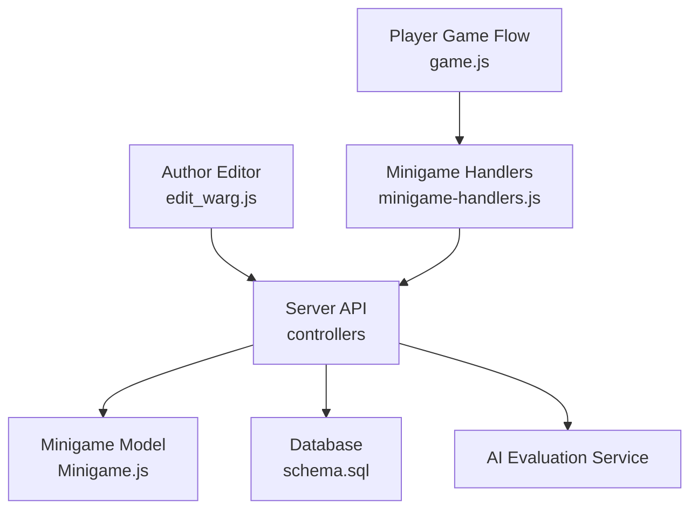
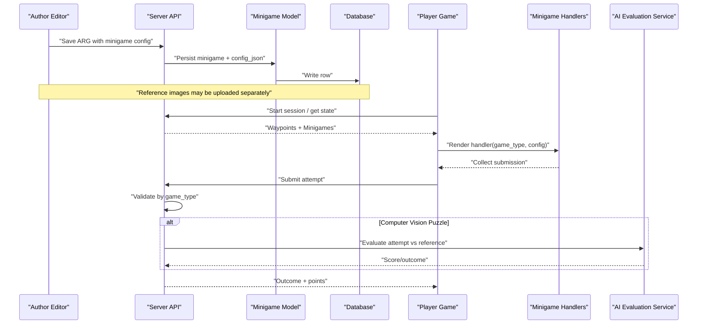
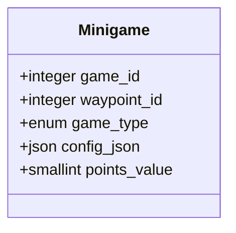
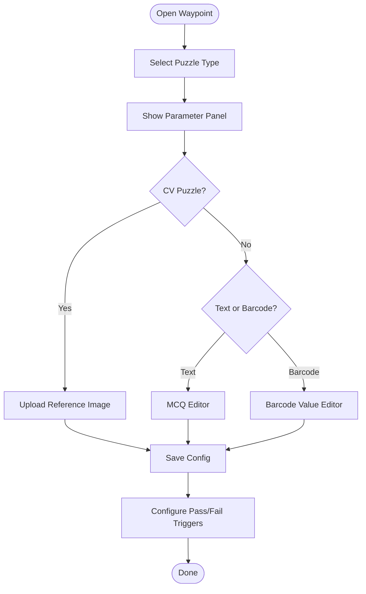
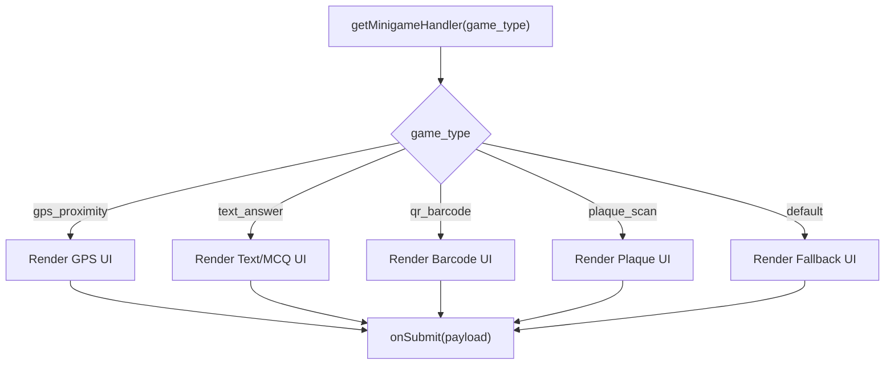
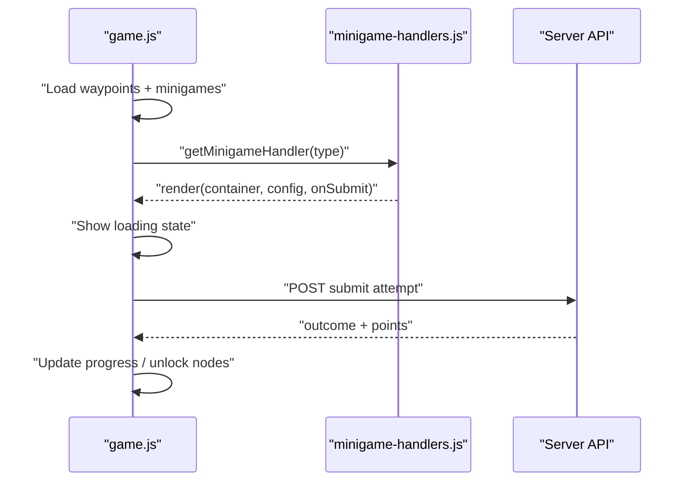
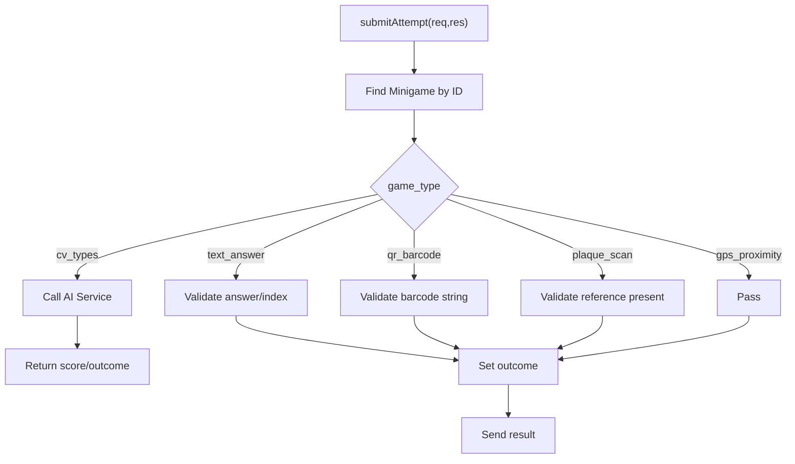
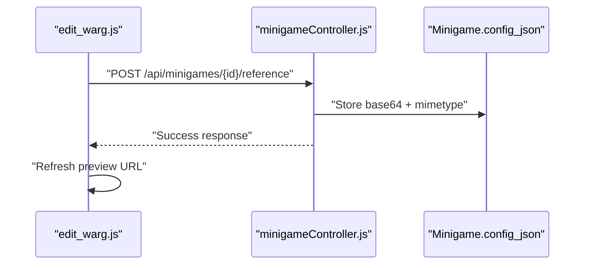
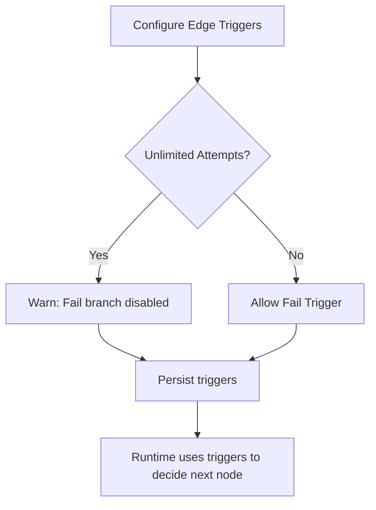
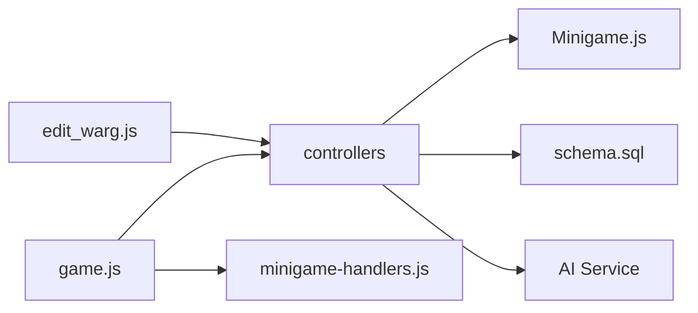

# Minigame Configuration System

<cite>
**Referenced Files in This Document**
- [Minigame.js](file://server/src/models/Minigame.js)
- [minigameController.js](file://server/src/controllers/minigameController.js)
- [gameController.js](file://server/src/controllers/gameController.js)
- [edit_warg.js](file://client/scripts/edit_warg.js)
- [minigame-handlers.js](file://client/scripts/components/minigame-handlers.js)
- [game.js](file://client/scripts/game.js)
- [schema.sql](file://database/schema.sql)
- [implementation-details.md](file://warg-docs/docs/2-architecture-and-design/implementation-details.md)
</cite>

## Table of Contents
1. [Introduction](#introduction)
2. [Project Structure](#project-structure)
3. [Core Components](#core-components)
4. [Architecture Overview](#architecture-overview)
5. [Detailed Component Analysis](#detailed-component-analysis)
6. [Dependency Analysis](#dependency-analysis)
7. [Performance Considerations](#performance-considerations)
8. [Troubleshooting Guide](#troubleshooting-guide)
9. [Conclusion](#conclusion)

## Introduction
This document explains the minigame configuration system that allows authors to create and manage puzzle types inside their Alternate Reality Games (ARGs). It covers:
- The type selection interface in the authoring tool
- Parameter configuration panels for each puzzle category
- Validation rules enforced by the server
- Integration between client UI, backend controllers, and AI evaluation services
- Dynamic form generation based on puzzle types
- Preview behavior during gameplay
- Supported puzzle categories including color matching, OCR-like scanning, image recognition, and related variants
- Examples of complex setups, conditional logic, and debugging techniques

The goal is to help both authors and developers understand how minigames are configured, validated, and executed end-to-end.

## Project Structure
The minigame configuration system spans several layers:
- Database schema defines the minigame record and its flexible configuration payload
- Server-side models and controllers handle persistence, reference image management, attempt submission, and validation
- Client-side authoring tools provide dynamic forms for puzzle parameters and preview capabilities
- Runtime game flow renders handlers per puzzle type and submits attempts to the backend

**Diagram sources**
- [edit_warg.js:27-42](file://client/scripts/edit_warg.js#L27-L42)
- [Minigame.js:4-10](file://server/src/models/Minigame.js#L4-L10)
- [schema.sql:236-236](file://database/schema.sql#L236-L236)
- [minigameController.js:7-31](file://server/src/controllers/minigameController.js#L7-L31)
- [game.js:511-604](file://client/scripts/game.js#L511-L604)
- [minigame-handlers.js:7-200](file://client/scripts/components/minigame-handlers.js#L7-L200)

**Section sources**
- [Minigame.js:4-10](file://server/src/models/Minigame.js#L4-L10)
- [schema.sql:236-236](file://database/schema.sql#L236-L236)
- [edit_warg.js:27-42](file://client/scripts/edit_warg.js#L27-L42)
- [minigameController.js:7-31](file://server/src/controllers/minigameController.js#L7-L31)
- [game.js:511-604](file://client/scripts/game.js#L511-L604)
- [minigame-handlers.js:7-200](file://client/scripts/components/minigame-handlers.js#L7-L200)

## Core Components
- Minigame model: Defines supported puzzle types and stores a JSON configuration object per minigame.
- Minigame controller: Handles reference image upload/retrieval and routes attempt submissions to the appropriate AI evaluation endpoint.
- Game controller: Validates player submissions according to puzzle type and returns pass/fail outcomes.
- Author editor: Provides dynamic UI for selecting puzzle types, setting parameters, uploading reference images, and configuring conditional transitions.
- Minigame handlers: Render interactive UIs for specific puzzle types and collect player inputs.
- Game runtime: Orchestrates waypoint progression, invokes handlers, and submits attempts to the backend.

Key responsibilities:
- Type selection and mapping between backend enum values and frontend labels
- Parameter configuration panels per puzzle type
- Reference image handling for computer vision puzzles
- Submission validation and outcome determination
- Conditional branching based on pass/fail results

**Section sources**
- [Minigame.js:4-10](file://server/src/models/Minigame.js#L4-L10)
- [minigameController.js:7-125](file://server/src/controllers/minigameController.js#L7-L125)
- [gameController.js:213-244](file://server/src/controllers/gameController.js#L213-L244)
- [edit_warg.js:27-42](file://client/scripts/edit_warg.js#L27-L42)
- [minigame-handlers.js:7-200](file://client/scripts/components/minigame-handlers.js#L7-L200)
- [game.js:511-604](file://client/scripts/game.js#L511-L604)

## Architecture Overview
The minigame configuration system integrates authoring, storage, runtime execution, and optional AI evaluation.

**Diagram sources**
- [edit_warg.js:627-681](file://client/scripts/edit_warg.js#L627-L681)
- [Minigame.js:4-10](file://server/src/models/Minigame.js#L4-L10)
- [minigameController.js:53-125](file://server/src/controllers/minigameController.js#L53-L125)
- [gameController.js:213-244](file://server/src/controllers/gameController.js#L213-L244)
- [game.js:511-604](file://client/scripts/game.js#L511-L604)
- [minigame-handlers.js:7-200](file://client/scripts/components/minigame-handlers.js#L7-L200)

## Detailed Component Analysis

### Minigame Model and Supported Types
The Minigame model defines the canonical set of puzzle types and stores a flexible JSON configuration per minigame.

Supported types include:
- gps_proximity
- text_answer
- qr_barcode
- ar_object_scan
- colour_match
- shape_match
- photo_submit
- texture_match
- sift_match
- symmetry_finder
- word_scramble
- plaque_scan

Configuration payload:
- config_json: arbitrary JSON used to store puzzle-specific parameters such as correct answers, barcode values, MCQ options, thresholds, and reference image metadata.

**Diagram sources**
- [Minigame.js:4-10](file://server/src/models/Minigame.js#L4-L10)

**Section sources**
- [Minigame.js:4-10](file://server/src/models/Minigame.js#L4-L10)
- [schema.sql:236-236](file://database/schema.sql#L236-L236)

### Authoring Tool: Type Selection and Parameter Panels
The authoring tool maps backend game types to friendly frontend labels and provides dynamic parameter panels.

Type mapping:
- gps_proximity -> GPS Location
- ar_object_scan -> AR Object Scan
- qr_barcode -> Barcode Game
- shape_match -> Shape Match
- colour_match -> Colour Match
- texture_match -> Texture Match
- sift_match -> Then & Now (SIFT)
- symmetry_finder -> Symmetry Finder
- photo_submit -> Photo Submit
- text_answer -> QnA / MCQ
- plaque_scan -> Plaque Scanner

Parameter configuration highlights:
- Unlimited attempts toggle stored in minigame_config.allow_multiple_attempts
- For computer vision puzzles, authors can upload a reference image; the editor shows a preview once uploaded
- For text_answer, an MCQ editor is available; for qr_barcode, a barcode value editor is available
- Conditional transitions can be configured per minigame outcome (pass/fail)

**Diagram sources**
- [edit_warg.js:27-42](file://client/scripts/edit_warg.js#L27-L42)
- [edit_warg.js:354-375](file://client/scripts/edit_warg.js#L354-L375)
- [edit_warg.js:449-458](file://client/scripts/edit_warg.js#L449-L458)
- [edit_warg.js:487-494](file://client/scripts/edit_warg.js#L487-L494)
- [edit_warg.js:527-576](file://client/scripts/edit_warg.js#L527-L576)

**Section sources**
- [edit_warg.js:27-42](file://client/scripts/edit_warg.js#L27-L42)
- [edit_warg.js:354-375](file://client/scripts/edit_warg.js#L354-L375)
- [edit_warg.js:449-458](file://client/scripts/edit_warg.js#L449-L458)
- [edit_warg.js:487-494](file://client/scripts/edit_warg.js#L487-L494)
- [edit_warg.js:527-576](file://client/scripts/edit_warg.js#L527-L576)

### Minigame Handlers: Dynamic Form Generation
Handlers render interactive UIs per puzzle type and collect player submissions.

Implemented handlers:
- gps_proximity: location verification button; empty submission payload
- text_answer: supports MCQ and free-text input
- qr_barcode: scanner integration plus manual entry fallback
- plaque_scan: camera capture with preview and base64 submission

Fallback behavior:
- Unknown types show a placeholder UI and allow marking complete

**Diagram sources**
- [minigame-handlers.js:7-200](file://client/scripts/components/minigame-handlers.js#L7-L200)

**Section sources**
- [minigame-handlers.js:7-200](file://client/scripts/components/minigame-handlers.js#L7-L200)

### Runtime Game Flow: Rendering and Submission
The game runtime orchestrates waypoint progression, invokes handlers, and submits attempts.

Key behaviors:
- Prefetches minigame references for offline caching
- Detects computer vision puzzle types and sets up camera controls
- Renders handlers dynamically using the selected puzzle type and config
- Submits attempts via the API and handles pass/fail feedback and progression

**Diagram sources**
- [game.js:193-218](file://client/scripts/game.js#L193-L218)
- [game.js:359-451](file://client/scripts/game.js#L359-L451)
- [game.js:511-604](file://client/scripts/game.js#L511-L604)
- [minigame-handlers.js:7-200](file://client/scripts/components/minigame-handlers.js#L7-L200)

**Section sources**
- [game.js:193-218](file://client/scripts/game.js#L193-L218)
- [game.js:359-451](file://client/scripts/game.js#L359-L451)
- [game.js:511-604](file://client/scripts/game.js#L511-L604)

### Server-Side Validation and AI Integration
The server validates submissions based on puzzle type and delegates computer vision evaluations to an external AI service.

Validation rules:
- gps_proximity: always passes if the player reached the arrive endpoint successfully
- text_answer: exact match for free text; index match for MCQ
- qr_barcode: exact string match against configured barcode value
- plaque_scan: requires a configured reference image; otherwise rejects submission

AI integration:
- For computer vision types (shape_match, colour_match, texture_match, sift_match, symmetry_finder), the controller builds a FormData request to the AI service with the attempt image and, when needed, the reference image stored in config_json.

**Diagram sources**
- [gameController.js:213-244](file://server/src/controllers/gameController.js#L213-L244)
- [minigameController.js:53-125](file://server/src/controllers/minigameController.js#L53-L125)

**Section sources**
- [gameController.js:213-244](file://server/src/controllers/gameController.js#L213-L244)
- [minigameController.js:53-125](file://server/src/controllers/minigameController.js#L53-L125)

### Reference Image Management
Authors can upload reference images for computer vision puzzles through the editor. The server stores the image as base64 along with MIME type in config_json and serves it back for previews.

Workflow:
- Author selects a file in the editor
- Editor uploads to the minigame reference endpoint
- Server updates config_json with reference_image_base64 and reference_image_mimetype
- Editor refreshes to show the preview URL

**Diagram sources**
- [edit_warg.js:386-438](file://client/scripts/edit_warg.js#L386-L438)
- [minigameController.js:7-31](file://server/src/controllers/minigameController.js#L7-L31)

**Section sources**
- [edit_warg.js:386-438](file://client/scripts/edit_warg.js#L386-L438)
- [minigameController.js:7-31](file://server/src/controllers/minigameController.js#L7-L31)

### Conditional Logic and Transitions
Authors can configure transitions between waypoints based on minigame outcomes.

Features:
- Per minigame, mark whether pass or fail triggers a transition
- If a minigame has unlimited attempts enabled, fail branch will never trigger (warning shown in editor)
- Conditions are persisted as edge conditions and mapped to game_index and outcome

**Diagram sources**
- [edit_warg.js:527-576](file://client/scripts/edit_warg.js#L527-L576)

**Section sources**
- [edit_warg.js:527-576](file://client/scripts/edit_warg.js#L527-L576)

### Supported Puzzle Categories and Parameters

- Color Matching (colour_match)
  - Purpose: Compare player’s photo to a reference image using HSV-based color analysis
  - Required parameters: reference image stored in config_json
  - Runtime: AI service evaluates color similarity; confidence score returned

- OCR Challenges (plaque_scan)
  - Purpose: Capture and analyze text from plaques/signs
  - Required parameters: reference image stored in config_json
  - Runtime: Requires reference image; otherwise submission rejected

- Image Recognition (shape_match, texture_match, sift_match, symmetry_finder)
  - Purpose: Evaluate visual features such as shapes, textures, SIFT keypoints, or symmetry
  - Required parameters: reference image where applicable
  - Runtime: AI service computes feature matches and returns scores/outcomes

- Text Answer (text_answer)
  - Parameters:
    - is_mcq: boolean
    - options: array of strings (for MCQ)
    - correct_index: integer (for MCQ)
    - answer: string (for free text)
  - Validation: Exact match for free text; index match for MCQ

- QR/Barcode (qr_barcode)
  - Parameters:
    - barcode_value: string
  - Validation: Exact string match

- GPS Proximity (gps_proximity)
  - Behavior: Passes if the player arrived within geofence

- Photo Submit (photo_submit)
  - Behavior: General photo submission; validation depends on additional config or downstream processing

- AR Object Scan (ar_object_scan)
  - Behavior: AR-based interaction; validation depends on additional config or downstream processing

- Word Scramble (word_scramble)
  - Behavior: Text-based puzzle; validation depends on additional config

Notes:
- Computer vision puzzles rely on the AI service endpoints defined in the minigame controller
- Reference images are mandatory for certain CV puzzles and plaque scanning

**Section sources**
- [minigameController.js:67-105](file://server/src/controllers/minigameController.js#L67-L105)
- [gameController.js:213-244](file://server/src/controllers/gameController.js#L213-L244)
- [implementation-details.md:83-93](file://warg-docs/docs/2-architecture-and-design/implementation-details.md#L83-L93)

### Complex Puzzle Setups and Examples
- Multi-step waypoint with mixed puzzle types:
  - Waypoint A: QR code scan followed by text MCQ
  - Waypoint B: Color match requiring a reference image
  - Conditional edges: Only proceed to Waypoint C if Waypoint A fails and Waypoint B passes

- Conditional logic example:
  - Enable unlimited attempts for a challenging color match
  - Disable fail branch for that minigame so players cannot be blocked indefinitely
  - Use pass branch to unlock advanced content

- Preview workflow:
  - Authors upload reference images and see previews in the editor
  - During gameplay, handlers render interactive UIs and provide immediate feedback

[No sources needed since this section aggregates examples without analyzing specific files]

## Dependency Analysis
The system exhibits clear layering and separation of concerns:
- Client authoring tool depends on server APIs to persist configurations and reference images
- Runtime game flow depends on handlers for UI rendering and on server APIs for validation
- Server controllers depend on the Minigame model and database for persistence
- AI evaluation is decoupled via HTTP calls to an external service

**Diagram sources**
- [edit_warg.js:627-681](file://client/scripts/edit_warg.js#L627-L681)
- [game.js:511-604](file://client/scripts/game.js#L511-L604)
- [minigame-handlers.js:7-200](file://client/scripts/components/minigame-handlers.js#L7-L200)
- [Minigame.js:4-10](file://server/src/models/Minigame.js#L4-L10)
- [schema.sql:236-236](file://database/schema.sql#L236-L236)
- [minigameController.js:53-125](file://server/src/controllers/minigameController.js#L53-L125)

**Section sources**
- [edit_warg.js:627-681](file://client/scripts/edit_warg.js#L627-L681)
- [game.js:511-604](file://client/scripts/game.js#L511-L604)
- [minigame-handlers.js:7-200](file://client/scripts/components/minigame-handlers.js#L7-L200)
- [Minigame.js:4-10](file://server/src/models/Minigame.js#L4-L10)
- [schema.sql:236-236](file://database/schema.sql#L236-L236)
- [minigameController.js:53-125](file://server/src/controllers/minigameController.js#L53-L125)

## Performance Considerations
- Offline support:
  - Minigame references are prefetched for unlocked/in-progress waypoints to enable offline play where possible
  - Some puzzle types (e.g., those requiring live computation) are excluded from offline caching
- AI service latency:
  - Computer vision evaluations involve network calls to an external service; ensure timeouts and user feedback are handled
- Large reference images:
  - Storing base64 images in config_json increases payload size; consider optimizing image sizes or using external storage if needed

[No sources needed since this section provides general guidance]

## Troubleshooting Guide
Common issues and resolutions:
- Missing reference image for plaque scan or CV puzzles:
  - Ensure the reference image was uploaded and saved in config_json
  - Verify the server returns the expected MIME type and base64 data
- Incorrect text or barcode answers:
  - Confirm the correct answer or barcode_value is set in config_json
  - For MCQ, verify correct_index matches the intended option
- AI service failures:
  - Check the AI service URL and endpoint availability
  - Inspect error logs and response status codes from the AI service
- Conditional transitions not triggering:
  - Verify triggers are configured correctly for pass/fail
  - If unlimited attempts is enabled, fail branch will not trigger; adjust settings accordingly

Debugging tips:
- Use browser developer tools to inspect network requests and payloads
- Log server-side errors and AI service responses
- Test with minimal configurations first, then add complexity incrementally

**Section sources**
- [minigameController.js:28-31](file://server/src/controllers/minigameController.js#L28-L31)
- [minigameController.js:112-125](file://server/src/controllers/minigameController.js#L112-L125)
- [gameController.js:213-244](file://server/src/controllers/gameController.js#L213-L244)
- [edit_warg.js:527-576](file://client/scripts/edit_warg.js#L527-L576)

## Conclusion
The minigame configuration system provides a robust framework for authors to design diverse puzzles within ARGs. It combines a flexible data model, dynamic UI generation, strict validation, and optional AI-powered evaluation. By understanding the type selection interface, parameter panels, validation rules, and runtime flows, authors can craft engaging experiences while developers can maintain and extend the system confidently.

[No sources needed since this section summarizes without analyzing specific files]