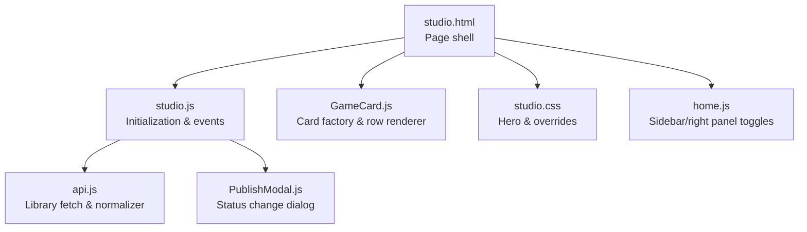
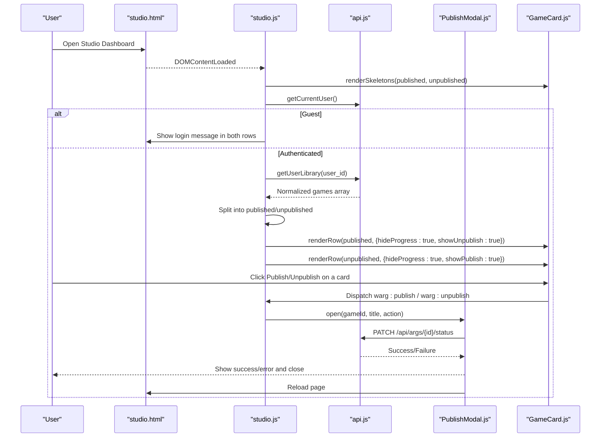
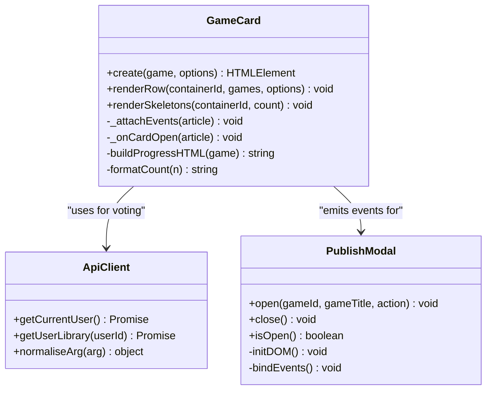
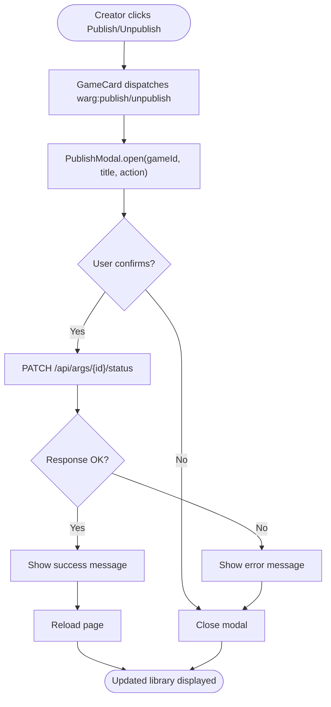
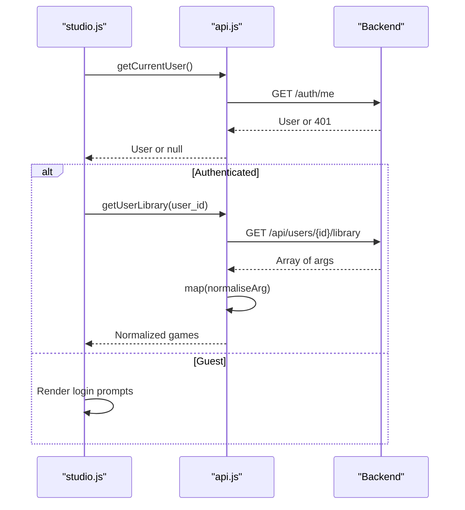
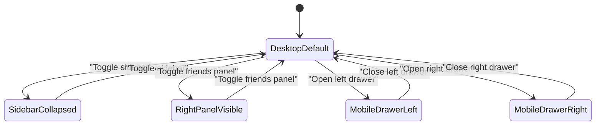
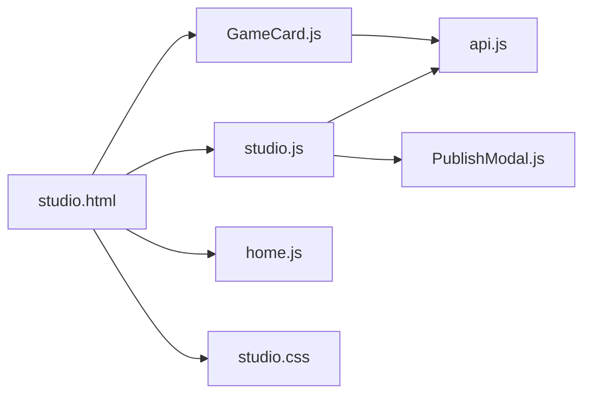

# Studio Dashboard

<cite>
**Referenced Files in This Document**   
- [studio.html](file://client/studio.html)
- [studio.js](file://client/scripts/studio.js)
- [GameCard.js](file://client/scripts/components/GameCard.js)
- [PublishModal.js](file://client/scripts/components/PublishModal.js)
- [api.js](file://client/scripts/api.js)
- [home.js](file://client/scripts/home.js)
- [studio.css](file://client/styles/studio.css)
</cite>

## Table of Contents
1. [Introduction](#introduction)
2. [Project Structure](#project-structure)
3. [Core Components](#core-components)
4. [Architecture Overview](#architecture-overview)
5. [Detailed Component Analysis](#detailed-component-analysis)
6. [Dependency Analysis](#dependency-analysis)
7. [Performance Considerations](#performance-considerations)
8. [Troubleshooting Guide](#troubleshooting-guide)
9. [Conclusion](#conclusion)

## Introduction
The Studio Dashboard is the primary hub for ARG creators to manage their game library, create new games, and control publication status. It provides:
- A hero section that directs creators to the creation tool
- Two game listings: published and unpublished
- A left sidebar for navigation and a right panel for social features
- A robust GameCard rendering system with publish/unpublish actions
- API integration for fetching the creator’s library and updating game status

This documentation explains the layout, component behavior, data flow, responsive patterns, accessibility, and user interactions.

## Project Structure
The Studio Dashboard page composes HTML structure, styling, and JavaScript logic across several files:
- Page shell and sections are defined in studio.html
- Page initialization and event wiring are handled by studio.js
- Game cards are rendered via GameCard.js
- Publish/unpublish confirmation uses PublishModal.js
- Data fetching and normalization are provided by api.js
- Responsive drawer behaviors are implemented in home.js
- Visual design and responsive adjustments live in studio.css

**Diagram sources**
- [studio.html:1-365](file://client/studio.html#L1-L365)
- [studio.js:1-86](file://client/scripts/studio.js#L1-L86)
- [GameCard.js:1-533](file://client/scripts/components/GameCard.js#L1-L533)
- [PublishModal.js:1-196](file://client/scripts/components/PublishModal.js#L1-L196)
- [api.js:1-401](file://client/scripts/api.js#L1-L401)
- [home.js:31-77](file://client/scripts/home.js#L31-L77)
- [studio.css:1-96](file://client/styles/studio.css#L1-L96)

**Section sources**
- [studio.html:1-365](file://client/studio.html#L1-L365)
- [studio.js:1-86](file://client/scripts/studio.js#L1-L86)
- [GameCard.js:1-533](file://client/scripts/components/GameCard.js#L1-L533)
- [PublishModal.js:1-196](file://client/scripts/components/PublishModal.js#L1-L196)
- [api.js:1-401](file://client/scripts/api.js#L1-L401)
- [home.js:31-77](file://client/scripts/home.js#L31-L77)
- [studio.css:1-96](file://client/styles/studio.css#L1-L96)

## Core Components
- Hero Section: Prominent call-to-action to start building a new WARG. Clicking navigates to the creation page.
- Published Games Row: Displays all games with status “published”. Each card exposes an Unpublish action.
- Unpublished Games Row: Displays drafts or non-published games. Each card exposes a Publish action.
- Sidebar Navigation: Left-side navigation with Discover, My Library, Creator Studio, Account, and Settings.
- Right Panel: Friends list, activity summary, and invite banner.

Key responsibilities:
- studio.js initializes skeletons, checks authentication, fetches the user’s library, splits into published/unpublished, renders rows, wires hero click, and listens for publish/unpublish events.
- GameCard.js creates interactive cards, handles like/dislike/flag, manages publish/unpublish buttons, and emits custom events for status changes.
- PublishModal.js presents a confirmation dialog and calls the backend to update game status.
- api.js normalizes server responses into a shape compatible with GameCard and provides getUserLibrary.

**Section sources**
- [studio.html:149-186](file://client/studio.html#L149-L186)
- [studio.js:9-84](file://client/scripts/studio.js#L9-L84)
- [GameCard.js:142-263](file://client/scripts/components/GameCard.js#L142-L263)
- [PublishModal.js:6-196](file://client/scripts/components/PublishModal.js#L6-L196)
- [api.js:57-115](file://client/scripts/api.js#L57-L115)
- [api.js:157-164](file://client/scripts/api.js#L157-L164)

## Architecture Overview
The dashboard follows a clear client-side flow:
- On load, skeleton cards render immediately for perceived performance.
- The script checks authentication; guests see a login prompt instead of library content.
- For authenticated users, it fetches the library, normalizes data, splits by status, and renders rows using GameCard.
- Publishing/unpublishing triggers a modal confirmation and updates the backend; on success, the page reloads to reflect the new state.

**Diagram sources**
- [studio.js:9-84](file://client/scripts/studio.js#L9-L84)
- [api.js:123-164](file://client/scripts/api.js#L123-L164)
- [GameCard.js:265-289](file://client/scripts/components/GameCard.js#L265-L289)
- [PublishModal.js:83-146](file://client/scripts/components/PublishModal.js#L83-L146)

## Detailed Component Analysis

### Dashboard Layout and Sections
- Hero Section: Centered call-to-action with gradient background and hover effects. Clicking navigates to the creation page.
- Published and Unpublished Rows: Two sections with accessible headings and list roles. Cards populate dynamically.
- Sidebar: Contains navigation links and a close button for mobile drawers.
- Topbar: Hamburger menu, branding, search input, filter, notifications, friends toggle, and profile avatar.
- Right Panel: Activity stats, friend search, online/offline lists, and invite banner.

Accessibility highlights:
- Semantic landmarks (aside, header, main, nav).
- aria-label attributes for controls and regions.
- aria-expanded and aria-controls for toggles.
- role="list" and role="listitem" for card lists.
- Keyboard support for activating cards and menus.

Responsive behavior:
- Left sidebar and right panel act as drawers on small screens and collapsible panels on larger screens.
- Toggle buttons update aria-expanded accordingly.

**Section sources**
- [studio.html:19-144](file://client/studio.html#L19-L144)
- [studio.html:149-186](file://client/studio.html#L149-L186)
- [studio.html:188-352](file://client/studio.html#L188-L352)
- [home.js:31-77](file://client/scripts/home.js#L31-L77)

### GameCard Rendering System
GameCard is a factory that builds interactive cards and can render entire rows at once. Key capabilities:
- Mode-based visuals (solo/coop/pvp/live) with distinct badges and gradients.
- Optional progress display (hidden in Studio context).
- Author avatar initials and name.
- Action buttons:
  - Like/Dislike with optimistic UI and localStorage persistence.
  - Flag content via a modal.
  - Publish/Unpublish for creator workflows.
  - Admin delete (when available).
- Emits custom events for publish/unpublish actions.
- Provides helpers:
  - create(game, options): returns a single card element.
  - renderRow(containerId, games, options): fills a container with cards.
  - renderSkeletons(containerId, count): shows loading placeholders.

Complexity considerations:
- DOM construction is batched via DocumentFragment for efficient rendering.
- Event delegation within each card minimizes overhead.
- LocalStorage usage for votes is wrapped in try/catch to avoid failures.

**Diagram sources**
- [GameCard.js:142-533](file://client/scripts/components/GameCard.js#L142-L533)
- [PublishModal.js:6-196](file://client/scripts/components/PublishModal.js#L6-L196)
- [api.js:57-115](file://client/scripts/api.js#L57-L115)

**Section sources**
- [GameCard.js:142-533](file://client/scripts/components/GameCard.js#L142-L533)

### Game Status Management (Published vs Unpublished)
- studio.js filters the normalized library by raw status field:
  - published: status === 'published'
  - unpublished: any other status
- Published row renders cards with showUnpublish enabled.
- Unpublished row renders cards with showPublish enabled.
- Clicking Publish/Unpublish on a card dispatches a custom event.
- studio.js listens for these events and opens PublishModal with the appropriate action.
- PublishModal sends a PATCH request to update the game status and displays success or error feedback. On success, the page reloads to reflect the updated state.

**Diagram sources**
- [GameCard.js:265-289](file://client/scripts/components/GameCard.js#L265-L289)
- [studio.js:76-84](file://client/scripts/studio.js#L76-L84)
- [PublishModal.js:83-146](file://client/scripts/components/PublishModal.js#L83-L146)

**Section sources**
- [studio.js:47-66](file://client/scripts/studio.js#L47-L66)
- [GameCard.js:218-251](file://client/scripts/components/GameCard.js#L218-L251)
- [PublishModal.js:83-146](file://client/scripts/components/PublishModal.js#L83-L146)

### API Integration for Fetching and Displaying Game Data
- Authentication check: getCurrentUser returns null for guests.
- Library retrieval: getUserLibrary fetches all games created by the user and normalizes them to GameCard-compatible objects.
- Normalization maps backend fields to frontend expectations, including author initials, rating computation, image URL generation, and preserving raw fields for status checks.
- Errors during library fetch are caught and surfaced as user-friendly messages in both rows.

**Diagram sources**
- [api.js:123-164](file://client/scripts/api.js#L123-L164)
- [api.js:57-115](file://client/scripts/api.js#L57-L115)
- [studio.js:18-45](file://client/scripts/studio.js#L18-L45)

**Section sources**
- [api.js:57-115](file://client/scripts/api.js#L57-L115)
- [api.js:123-164](file://client/scripts/api.js#L123-L164)
- [studio.js:18-45](file://client/scripts/studio.js#L18-L45)

### Responsive Design Patterns
- Left sidebar and right panel switch between drawer mode (mobile) and collapsible panels (desktop).
- Toggle buttons update aria-expanded and control visibility classes.
- Overlay backdrop appears when drawers are open on mobile.
- Hero typography and spacing adapt via media queries.

**Diagram sources**
- [home.js:31-77](file://client/scripts/home.js#L31-L77)
- [studio.html:19-144](file://client/studio.html#L19-L144)
- [studio.html:188-352](file://client/studio.html#L188-L352)

**Section sources**
- [home.js:31-77](file://client/scripts/home.js#L31-L77)
- [studio.css:79-89](file://client/styles/studio.css#L79-L89)

### Accessibility Features
- Semantic elements and roles: aside, header, main, nav, role="banner", role="search".
- Controls have descriptive aria-labels and aria-expanded states.
- Lists use role="list" and items role="listitem".
- Progress indicators include aria-valuenow, aria-valuemin, aria-valuemax, and aria-label.
- Keyboard activation for cards and menus.
- Focus management and overlay handling in modals.

**Section sources**
- [studio.html:27-81](file://client/studio.html#L27-L81)
- [studio.html:86-144](file://client/studio.html#L86-L144)
- [GameCard.js:122-140](file://client/scripts/components/GameCard.js#L122-L140)
- [GameCard.js:455-462](file://client/scripts/components/GameCard.js#L455-L462)
- [PublishModal.js:21-54](file://client/scripts/components/PublishModal.js#L21-L54)

### User Interaction Flows
- Creating a new game: Click the hero section to navigate to the creation page.
- Managing the library: Browse published and unpublished rows; click a card to edit or play depending on context.
- Publishing/unpublishing: Use the card action buttons to trigger the confirmation modal and update status.
- Navigating sections: Use the left sidebar to move between Discover, My Library, Creator Studio, Account, and Settings.

**Section sources**
- [studio.js:68-74](file://client/scripts/studio.js#L68-L74)
- [GameCard.js:464-473](file://client/scripts/components/GameCard.js#L464-L473)
- [studio.html:37-80](file://client/studio.html#L37-L80)

## Dependency Analysis
The Studio Dashboard depends on shared components and utilities:
- studio.js depends on api.js for data and PublishModal.js for status changes.
- GameCard.js integrates with api.js for voting and may dynamically import modals.
- home.js provides global drawer behaviors used across pages.
- studio.css styles the hero and hides progress bars in the creator context.

**Diagram sources**
- [studio.html:357-360](file://client/studio.html#L357-L360)
- [studio.js:7-8](file://client/scripts/studio.js#L7-L8)
- [GameCard.js:320-347](file://client/scripts/components/GameCard.js#L320-L347)
- [home.js:31-77](file://client/scripts/home.js#L31-L77)
- [studio.css:91-96](file://client/styles/studio.css#L91-L96)

**Section sources**
- [studio.html:357-360](file://client/studio.html#L357-L360)
- [studio.js:7-8](file://client/scripts/studio.js#L7-L8)
- [GameCard.js:320-347](file://client/scripts/components/GameCard.js#L320-L347)
- [home.js:31-77](file://client/scripts/home.js#L31-L77)
- [studio.css:91-96](file://client/styles/studio.css#L91-L96)

## Performance Considerations
- Skeleton loading: Immediate skeleton rendering improves perceived performance while data loads.
- Batched DOM insertion: GameCard.renderRow uses DocumentFragment to minimize reflows.
- Conditional rendering: Progress bars are hidden in the Studio context to reduce unnecessary DOM nodes.
- Optimistic UI: Likes/dislikes update locally before network responses, improving responsiveness.
- Cache busting: Utility functions exist to clear cached game data when needed.

[No sources needed since this section provides general guidance]

## Troubleshooting Guide
Common issues and resolutions:
- No games displayed:
  - Ensure the user is authenticated; guests see a login prompt.
  - Check for errors in library fetch and verify the backend endpoint returns data.
- Publish/Unpublish not working:
  - Verify the PATCH request to /api/args/{id}/status succeeds.
  - Confirm the modal is opened with correct gameId and action.
- Cards not rendering:
  - Ensure GameCard and api modules are loaded before studio.js runs.
  - Validate that containers with ids row-published and row-unpublished exist.
- Drawer not opening/closing:
  - Confirm home.js toggle functions are initialized and aria-expanded is updated.

**Section sources**
- [studio.js:18-45](file://client/scripts/studio.js#L18-L45)
- [PublishModal.js:83-146](file://client/scripts/components/PublishModal.js#L83-L146)
- [GameCard.js:484-495](file://client/scripts/components/GameCard.js#L484-L495)
- [home.js:31-77](file://client/scripts/home.js#L31-L77)

## Conclusion
The Studio Dashboard offers a polished, accessible, and responsive environment for ARG creators. It combines a clear layout with powerful components:
- Hero-driven creation workflow
- Organized published/unpublished game listings
- Robust GameCard rendering with interactive actions
- Seamless API integration for data and status management
- Accessible navigation and social features

By following the documented flows and leveraging the provided components, creators can efficiently manage their game library and bring new experiences to players.