# Camera & Image Processing

<cite>
**Referenced Files in This Document**
- [README.md](file://README.md)
- [CameraCapture.js](file://client/scripts/components/CameraCapture.js)
- [minigame-handlers.js](file://client/scripts/components/minigame-handlers.js)
- [game.js](file://client/scripts/game.js)
- [main.py](file://ai-engine/main.py)
- [hsv_matcher.py](file://ai-engine/vision/hsv_matcher.py)
- [sam_extractor.py](file://ai-engine/vision/sam_extractor.py)
- [mobilenet_extractor.py](file://ai-engine/vision/mobilenet_extractor.py)
- [ocr_matcher.py](file://ai-engine/vision/ocr_matcher.py)
- [symmetry.py](file://ai-engine/vision/symmetry.py)
- [third-party-code.md](file://warg-docs/docs/8-third-party/third-party-code.md)
</cite>

## Table of Contents
1. [Introduction](#introduction)
2. [Project Structure](#project-structure)
3. [Core Components](#core-components)
4. [Architecture Overview](#architecture-overview)
5. [Detailed Component Analysis](#detailed-component-analysis)
6. [Dependency Analysis](#dependency-analysis)
7. [Performance Considerations](#performance-considerations)
8. [Troubleshooting Guide](#troubleshooting-guide)
9. [Conclusion](#conclusion)

## Introduction
This document explains the camera capture and image processing pipeline used by the WARG Platform to evaluate visual puzzles. It covers:
- HTML5 QRCode scanning integration for barcode/QR challenges
- Camera stream management, image capture, and preprocessing on the client
- AI engine endpoints for computer vision tasks including HSV color matching, shape detection via SAM, texture recognition via MobileNet, OCR-based plaque reading, and symmetry evaluation
- Confidence scoring mechanisms and pass/fail thresholds
- Error handling for camera permissions and offline resilience
- Puzzle examples such as color matching, shape detection, and OCR-based challenges
- Mobile camera optimizations, battery usage considerations, and cross-browser compatibility notes

The platform’s high-level architecture is a client-server system with an Express backend that proxies requests to a FastAPI AI service. The README identifies html5-QRCode as the scanner library and lists advanced features like Shape Matching and Colour Matching using HSV histograms.

**Section sources**
- [README.md:62-75](file://README.md#L62-L75)
- [README.md:48-58](file://README.md#L48-L58)

## Project Structure
The camera and image processing functionality spans three main areas:
- Client-side UI and camera utilities (HTML5 video, canvas capture, QR scanner)
- Server-side API routing and proxying to the AI engine
- AI engine services implementing computer vision algorithms

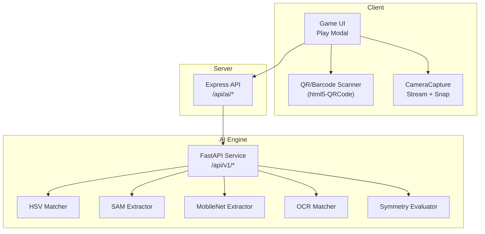

**Diagram sources**
- [minigame-handlers.js:69-129](file://client/scripts/components/minigame-handlers.js#L69-L129)
- [CameraCapture.js:1-111](file://client/scripts/components/CameraCapture.js#L1-L111)
- [main.py:77-157](file://ai-engine/main.py#L77-L157)

**Section sources**
- [minigame-handlers.js:69-129](file://client/scripts/components/minigame-handlers.js#L69-L129)
- [CameraCapture.js:1-111](file://client/scripts/components/CameraCapture.js#L1-L111)
- [main.py:77-157](file://ai-engine/main.py#L77-L157)

## Core Components
- CameraCapture: Manages camera stream, overlays reference images, and captures compressed JPEG blobs from the live video feed.
- Minigame Handlers: Provide puzzle-specific UIs, including QR/barcode scanning and plaque photo capture.
- AI Engine Endpoints: Expose standardized evaluation APIs for color, shape, texture, OCR, and symmetry tasks.
- Game Flow: Integrates camera capture, AI evaluation, confidence scoring, and result presentation to players.

Key responsibilities:
- Client: Stream acquisition, user interaction, image capture, and result display.
- Server: Route and authenticate requests to the AI engine.
- AI Engine: Perform computer vision analysis and return confidence scores with pass/fail decisions.

**Section sources**
- [CameraCapture.js:1-111](file://client/scripts/components/CameraCapture.js#L1-L111)
- [minigame-handlers.js:69-187](file://client/scripts/components/minigame-handlers.js#L69-L187)
- [main.py:77-157](file://ai-engine/main.py#L77-L157)

## Architecture Overview
The end-to-end flow for camera-based puzzles:
1. Player opens a puzzle requiring image input.
2. UI renders either a QR scanner or a camera capture interface.
3. For QR/barcode: Html5QrcodeScanner starts the camera, decodes codes, and submits results.
4. For image-based puzzles: CameraCapture starts the environment-facing camera, optionally shows a reference overlay, and captures a compressed JPEG blob.
5. Client sends the image to the server’s AI endpoint.
6. Server authenticates and forwards the request to the AI engine.
7. AI engine runs the appropriate algorithm (HSV, SAM, MobileNet, OCR, or symmetry).
8. AI engine returns a confidence score and pass/fail decision.
9. Client displays feedback and updates game state accordingly.

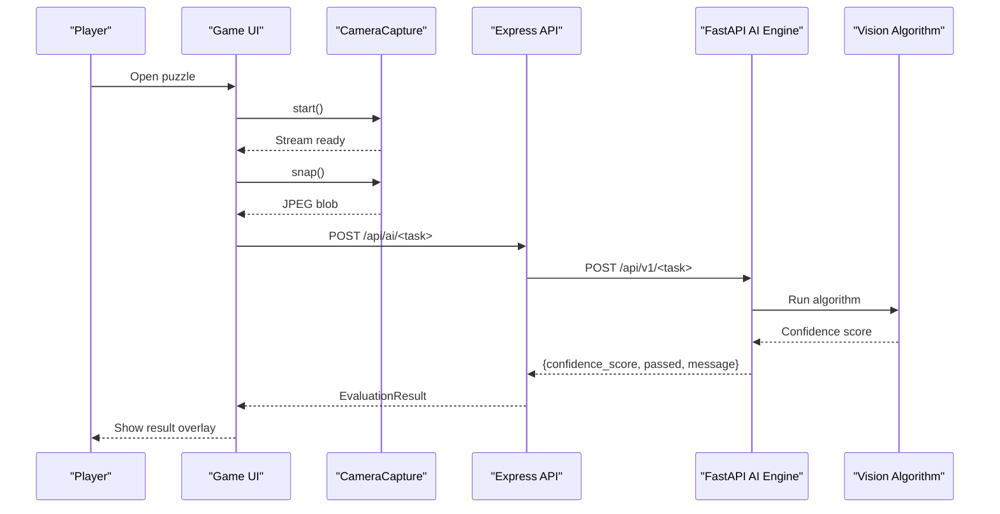

**Diagram sources**
- [minigame-handlers.js:97-127](file://client/scripts/components/minigame-handlers.js#L97-L127)
- [CameraCapture.js:37-109](file://client/scripts/components/CameraCapture.js#L37-L109)
- [main.py:77-157](file://ai-engine/main.py#L77-L157)

## Detailed Component Analysis

### Client-Side Camera Capture and QR Scanning
- CameraCapture class:
  - Creates video and canvas elements; supports optional reference overlay.
  - Requests camera access with environment-facing mode.
  - Stops tracks and cleans up DOM nodes and object URLs.
  - Captures frames at a maximum dimension of 800x800 and encodes as JPEG with quality 0.7.
- QR/Barcode scanner:
  - Uses Html5QrcodeScanner with FPS 10 and a fixed scan box size.
  - Provides manual entry fallback when scanning fails.
- Plaque photo capture:
  - Uses native file input with capture="environment" to open device camera.
  - Displays preview and allows retake or submit.

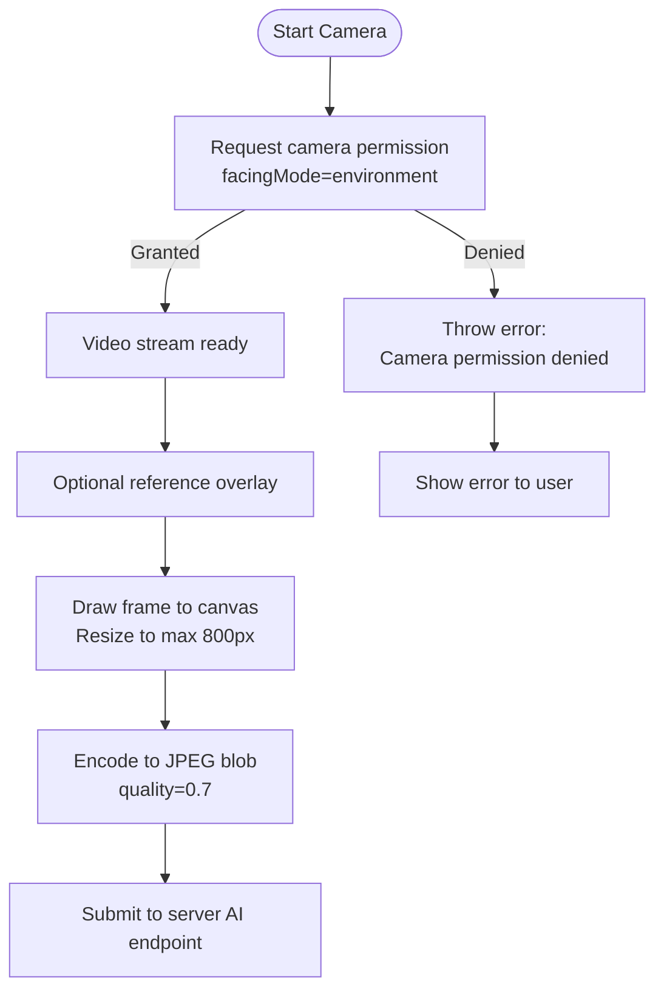

**Diagram sources**
- [CameraCapture.js:37-109](file://client/scripts/components/CameraCapture.js#L37-L109)
- [minigame-handlers.js:97-127](file://client/scripts/components/minigame-handlers.js#L97-L127)
- [minigame-handlers.js:130-187](file://client/scripts/components/minigame-handlers.js#L130-L187)

**Section sources**
- [CameraCapture.js:1-111](file://client/scripts/components/CameraCapture.js#L1-L111)
- [minigame-handlers.js:69-187](file://client/scripts/components/minigame-handlers.js#L69-L187)

### AI Engine Integration and Computer Vision Tasks
The AI engine exposes standardized endpoints returning a consistent response model with confidence_score, passed, and message fields. Algorithms include:
- HSV Color Matching: Compares Hue-Saturation histograms using Bhattacharyya distance.
- Shape Detection (SAM): Extracts primary shapes using MobileSAM with a dynamic crosshair and computes aligned Jaccard Index.
- Texture Recognition (MobileNet): Extracts feature embeddings and compares via cosine similarity.
- OCR-Based Challenges: Preprocesses plaque images and compares extracted text using sequence similarity.
- Symmetry Evaluation: Blurs and mirrors halves to compute structural similarity.

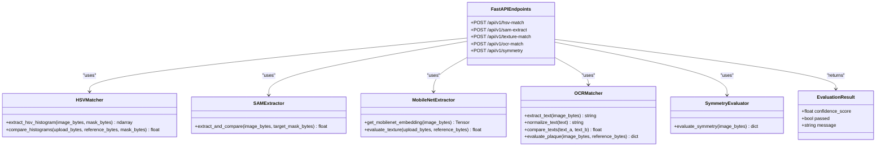

**Diagram sources**
- [main.py:56-157](file://ai-engine/main.py#L56-L157)
- [hsv_matcher.py:4-62](file://ai-engine/vision/hsv_matcher.py#L4-L62)
- [sam_extractor.py:18-90](file://ai-engine/vision/sam_extractor.py#L18-L90)
- [mobilenet_extractor.py:24-50](file://ai-engine/vision/mobilenet_extractor.py#L24-L50)
- [ocr_matcher.py:9-79](file://ai-engine/vision/ocr_matcher.py#L9-L79)
- [symmetry.py:40-65](file://ai-engine/vision/symmetry.py#L40-L65)

#### HSV Color Matching Pipeline
- Converts images to HSV color space.
- Masks out low-saturation pixels to avoid false matches between chromatic and achromatic images.
- Computes a normalized 2D histogram over Hue (12 bins) and Saturation (8 bins).
- Compares histograms using Bhattacharyya distance and converts to similarity score.

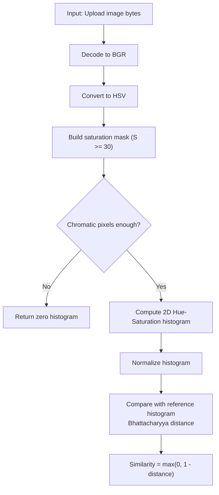

**Diagram sources**
- [hsv_matcher.py:4-62](file://ai-engine/vision/hsv_matcher.py#L4-L62)

**Section sources**
- [hsv_matcher.py:4-62](file://ai-engine/vision/hsv_matcher.py#L4-L62)

#### Shape Detection with MobileSAM
- Loads MobileSAM predictor and uses a dynamic five-point crosshair centered in the image.
- Generates masks for the primary shape.
- Aligns player and reference masks by cropping to bounding boxes and resizing to match dimensions.
- Calculates the Jaccard Index (IoU) as the confidence score.

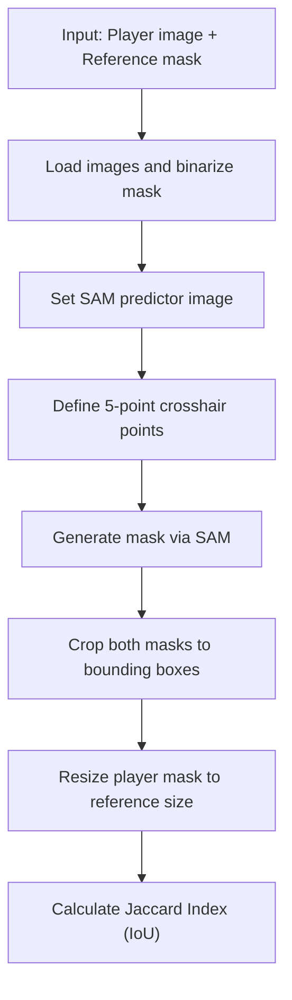

**Diagram sources**
- [sam_extractor.py:52-90](file://ai-engine/vision/sam_extractor.py#L52-L90)

**Section sources**
- [sam_extractor.py:1-90](file://ai-engine/vision/sam_extractor.py#L1-L90)

#### Texture Recognition with MobileNet
- Strips color information to reduce lighting sensitivity.
- Applies standard ImageNet preprocessing (resize, center crop, normalize).
- Extracts a 1280-dimensional embedding via MobileNetV2.
- Computes cosine similarity between upload and reference embeddings.

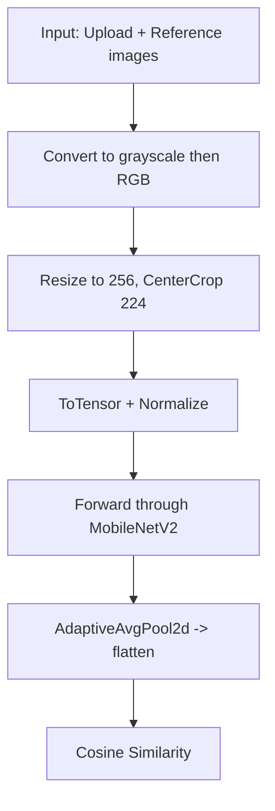

**Diagram sources**
- [mobilenet_extractor.py:16-50](file://ai-engine/vision/mobilenet_extractor.py#L16-L50)

**Section sources**
- [mobilenet_extractor.py:1-50](file://ai-engine/vision/mobilenet_extractor.py#L1-L50)

#### OCR-Based Plaque Reading
- Preprocesses images for engraved/weathered text: grayscale, upscale if small, Gaussian blur, adaptive threshold.
- Runs Tesseract OCR and normalizes text (lowercase, strip punctuation, collapse whitespace).
- Compares sequences using difflib.SequenceMatcher ratio.
- Returns confidence score and pass/fail based on threshold.

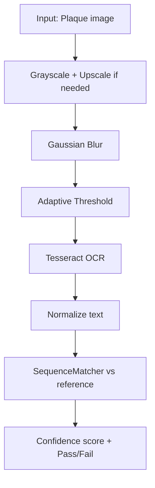

**Diagram sources**
- [ocr_matcher.py:9-79](file://ai-engine/vision/ocr_matcher.py#L9-L79)

**Section sources**
- [ocr_matcher.py:1-79](file://ai-engine/vision/ocr_matcher.py#L1-L79)

#### Symmetry Evaluation
- Converts to grayscale and applies heavy Gaussian blur to suppress noise.
- Mirrors left half and compares with right half using SSIM.
- Converts score to percentage and applies a generous threshold to account for skew.

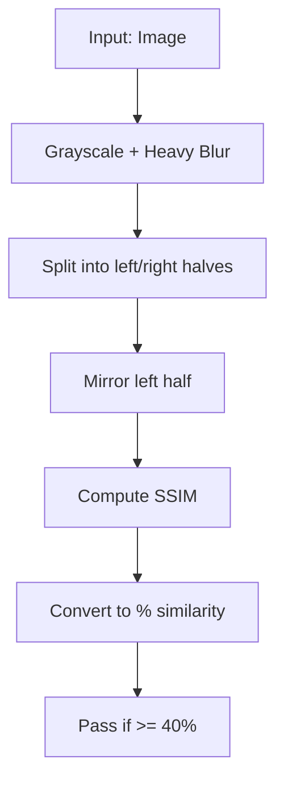

**Diagram sources**
- [symmetry.py:40-65](file://ai-engine/vision/symmetry.py#L40-L65)

**Section sources**
- [symmetry.py:40-65](file://ai-engine/vision/symmetry.py#L40-L65)

### Game Flow and Result Presentation
- The game UI integrates camera capture and AI evaluation within a play modal.
- Results are shown in an overlay indicating pass/fail, confidence percentage, and points awarded.
- Offline scenarios show a message indicating delayed analysis upon reconnection.

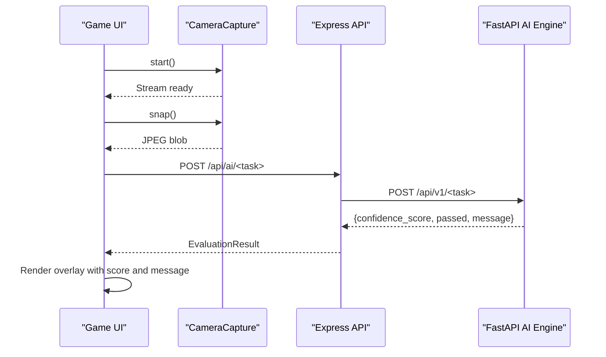

**Diagram sources**
- [game.js:411-441](file://client/scripts/game.js#L411-L441)
- [main.py:56-60](file://ai-engine/main.py#L56-L60)

**Section sources**
- [game.js:411-441](file://client/scripts/game.js#L411-L441)

## Dependency Analysis
- Client dependencies:
  - Html5QrcodeScanner for QR/barcode scanning.
  - navigator.mediaDevices.getUserMedia for camera access.
  - Canvas API for frame capture and JPEG encoding.
- Server dependencies:
  - Express routes proxying to FastAPI endpoints.
  - Authentication via API key header to the AI engine.
- AI engine dependencies:
  - OpenCV and NumPy for image decoding and array operations.
  - PyTorch and torchvision for MobileNet and MobileSAM.
  - Tesseract OCR for text extraction.
  - Third-party libraries documented in the project docs.

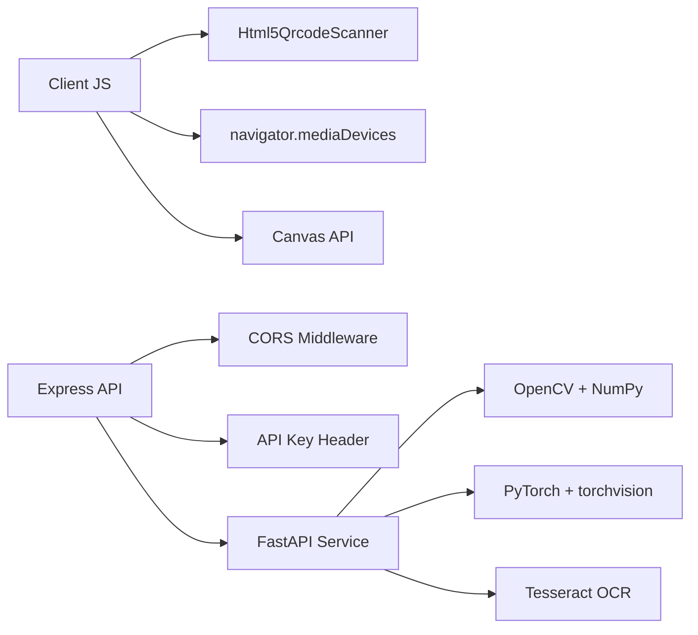

**Diagram sources**
- [main.py:1-33](file://ai-engine/main.py#L1-L33)
- [third-party-code.md:86-104](file://warg-docs/docs/8-third-party/third-party-code.md#L86-L104)

**Section sources**
- [main.py:1-33](file://ai-engine/main.py#L1-L33)
- [third-party-code.md:86-104](file://warg-docs/docs/8-third-party/third-party-code.md#L86-L104)

## Performance Considerations
- Image sizing:
  - Client caps captured frames to 800x800 and compresses to JPEG at 0.7 quality to reduce payload size and processing time.
- Algorithm selection:
  - HSV histogram comparison is lightweight and suitable for color-matching puzzles.
  - SAM-based shape detection requires GPU acceleration where available; CPU fallback may be slower.
  - MobileNet embeddings provide robust texture recognition but involve neural network inference.
  - OCR preprocessing includes upscaling and adaptive thresholding to improve readability on challenging surfaces.
- Battery and mobile optimization:
  - Use environment-facing camera to minimize unnecessary sensor usage.
  - Avoid continuous streaming beyond what is required; stop streams promptly after capture.
  - Prefer one-shot capture flows rather than persistent video feeds.
- Cross-browser compatibility:
  - Html5QrcodeScanner abstracts browser differences for QR/barcode scanning.
  - getUserMedia behavior varies across browsers; ensure HTTPS context and handle permission errors gracefully.
  - Canvas JPEG encoding support is broad but verify fallbacks for older environments.

[No sources needed since this section provides general guidance]

## Troubleshooting Guide
Common issues and resolutions:
- Camera permission denied:
  - The client throws a descriptive error when getUserMedia fails. Ensure HTTPS, grant camera permissions, and verify device capabilities.
- Video not ready:
  - If attempting to snap before the stream is ready, the client rejects with a “Video not ready” error. Wait for metadata events or retry after a short delay.
- Failed to create blob:
  - Canvas JPEG encoding can fail in some environments; handle rejection and prompt the user to retry.
- AI engine authentication:
  - The AI service requires an X-API-Key header; invalid or missing keys result in 401 Unauthorized.
- Missing files in multipart requests:
  - Endpoints validate required files; missing uploads return 400 Bad Request.
- Offline gameplay:
  - When offline, the UI informs users that analysis will occur upon reconnection.

**Section sources**
- [CameraCapture.js:45-53](file://client/scripts/components/CameraCapture.js#L45-L53)
- [CameraCapture.js:74-109](file://client/scripts/components/CameraCapture.js#L74-L109)
- [main.py:14-20](file://ai-engine/main.py#L14-L20)
- [server/tests/integration/ai.test.js:56-77](file://server/tests/integration/ai.test.js#L56-L77)
- [game.js:411-441](file://client/scripts/game.js#L411-L441)

## Conclusion
The WARG Platform’s camera and image processing pipeline combines a robust client-side capture experience with a scalable AI engine for computer vision tasks. By leveraging HSV color histograms, MobileSAM for shape detection, MobileNet for texture recognition, and OCR for plaque reading, the system supports diverse puzzle types while maintaining performance and reliability. Proper error handling, mobile optimizations, and cross-browser considerations ensure a smooth user experience across devices.

[No sources needed since this section summarizes without analyzing specific files]