# Core Game Interface

<cite>
**Referenced Files in This Document**   
- [game.html](file://client/game.html)
- [game.js](file://client/scripts/game.js)
- [sensors.js](file://client/scripts/sensors.js)
- [MapModal.js](file://client/scripts/components/MapModal.js)
- [CameraCapture.js](file://client/scripts/components/CameraCapture.js)
- [minigame-handlers.js](file://client/scripts/components/minigame-handlers.js)
- [PlayModal.js](file://client/scripts/components/PlayModal.js)
- [game.css](file://client/styles/game.css)
- [server.js](file://server/server.js)
- [schema.sql](file://database/schema.sql)
- [implementation-details.md](file://warg-docs/docs/2-architecture-and-design/implementation-details.md)
</cite>

## Table of Contents
1. [Introduction](#introduction)
2. [Project Structure](#project-structure)
3. [Core Components](#core-components)
4. [Architecture Overview](#architecture-overview)
5. [Detailed Component Analysis](#detailed-component-analysis)
6. [Dependency Analysis](#dependency-analysis)
7. [Performance Considerations](#performance-considerations)
8. [Troubleshooting Guide](#troubleshooting-guide)
9. [Conclusion](#conclusion)

## Introduction
This document explains the core game interface of the WARG Platform, focusing on the main gameplay screen, Leaflet.js map integration for geospatial puzzle navigation, real-time player positioning, waypoint progression, camera capture for image-based puzzles, GPS proximity validation UI feedback, interactive map controls, game state management, progress tracking, and multiplayer synchronization through WebSocket connections. It also covers minigame integration patterns, location anti-spoofing indicators, and mobile-responsive gameplay considerations.

## Project Structure
The gameplay experience is centered around a dedicated game page that renders an interactive map, a play modal for minigames, and a discussion panel. The client-side logic coordinates:
- Map rendering and node interaction via a reusable map component.
- Geolocation watching and sensor data collection for anti-spoofing.
- Minigame orchestration through a handler registry.
- Camera capture for visual puzzles.
- Real-time connection handling and offline resilience.

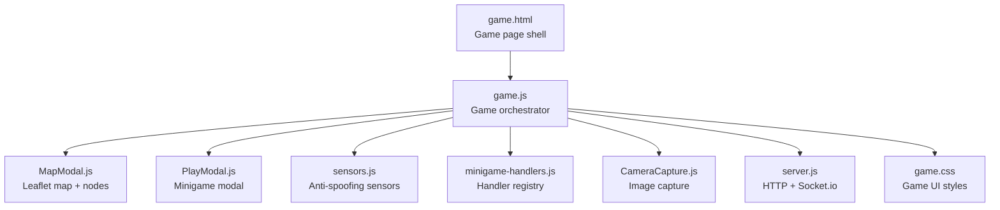

**Diagram sources**
- [game.html:167-255](file://client/game.html#L167-L255)
- [game.js:143-271](file://client/scripts/game.js#L143-L271)
- [MapModal.js:138-184](file://client/scripts/components/MapModal.js#L138-L184)
- [PlayModal.js:47-83](file://client/scripts/components/PlayModal.js#L47-L83)
- [sensors.js:25-58](file://client/scripts/sensors.js#L25-L58)
- [minigame-handlers.js:7-200](file://client/scripts/components/minigame-handlers.js#L7-L200)
- [CameraCapture.js:1-112](file://client/scripts/components/CameraCapture.js#L1-L112)
- [server.js:1-37](file://server/server.js#L1-L37)
- [game.css:311-453](file://client/styles/game.css#L311-L453)

**Section sources**
- [game.html:167-255](file://client/game.html#L167-L255)
- [game.js:143-271](file://client/scripts/game.js#L143-L271)

## Core Components
- Game orchestrator: Initializes session, loads ARG state, starts sensors, initializes map, watches player location, handles voting, comments, and minigame flows.
- Map modal: Renders Leaflet map with OpenStreetMap tiles, manages markers, edges, bubble mask, player marker, and emits play events.
- Play modal: Presents waypoint descriptions, canvas area, and dynamic controls injected by minigame handlers.
- Sensor collector: Buffers recent GPS positions and counts steps from device motion to support anti-spoofing.
- Camera capture: Streams environment camera, overlays reference images, and captures compressed JPEG blobs for AI validation.
- Minigame handlers: Provide UI for GPS proximity, text answers, QR/barcode scanning, plaque photo submission, and fallbacks.
- Server: HTTP API plus Socket.io server for live/co-op modes.

**Section sources**
- [game.js:143-271](file://client/scripts/game.js#L143-L271)
- [MapModal.js:138-184](file://client/scripts/components/MapModal.js#L138-L184)
- [PlayModal.js:47-83](file://client/scripts/components/PlayModal.js#L47-L83)
- [sensors.js:25-58](file://client/scripts/sensors.js#L25-L58)
- [CameraCapture.js:1-112](file://client/scripts/components/CameraCapture.js#L1-L112)
- [minigame-handlers.js:7-200](file://client/scripts/components/minigame-handlers.js#L7-L200)
- [server.js:1-37](file://server/server.js#L1-L37)

## Architecture Overview
The gameplay loop integrates geolocation, map visualization, minigame execution, and server validation. Offline resilience uses BroadcastChannel and Service Worker messaging to sync attempts when connectivity returns.

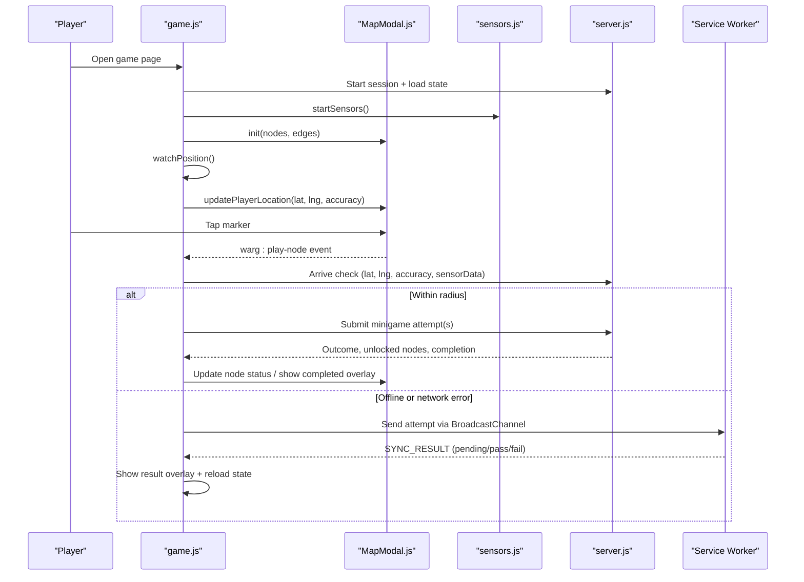

**Diagram sources**
- [game.js:143-271](file://client/scripts/game.js#L143-L271)
- [game.js:354-631](file://client/scripts/game.js#L354-L631)
- [MapModal.js:400-423](file://client/scripts/components/MapModal.js#L400-L423)
- [sensors.js:25-58](file://client/scripts/sensors.js#L25-L58)
- [server.js:1-37](file://server/server.js#L1-L37)

## Detailed Component Analysis

### Main Gameplay Screen Architecture
- Layout: A topbar, left sidebar navigation, right friends/activity panel, and a central game container with a map wrapper and feedback/discussion section.
- Map placeholder: The map container holds the dynamically injected Leaflet modal.
- Feedback & Discussion: Includes like/dislike buttons, flag/report, and threaded comments with spoiler toggling and admin delete actions.
- Play Modal: A modal dialog with title, description, optional canvas, and dynamic controls.

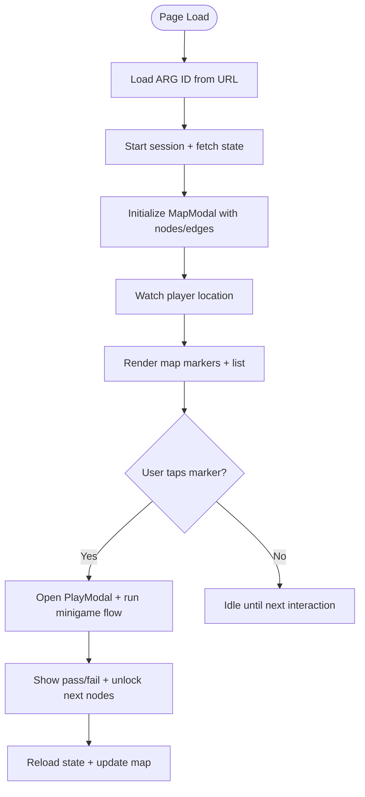

**Diagram sources**
- [game.html:167-255](file://client/game.html#L167-L255)
- [game.js:143-271](file://client/scripts/game.js#L143-L271)
- [game.js:354-631](file://client/scripts/game.js#L354-L631)

**Section sources**
- [game.html:167-255](file://client/game.html#L167-L255)
- [game.js:143-271](file://client/scripts/game.js#L143-L271)

### Leaflet.js Map Integration and Waypoint Progression
- Dynamic dependency loading: CSS and JS are loaded on demand; Leaflet is fetched if not present.
- Map initialization: Centered on campus bounds, constrained zoom levels, and a circular bubble mask limiting visibility.
- Nodes and edges: Markers represent waypoints; SVG overlays draw directed edges between nodes.
- Player position: A persistent marker and accuracy circle are updated as geolocation updates arrive.
- Node interactions: Clicking a marker opens a popup with a “Play” button that dispatches a custom event consumed by the game orchestrator.

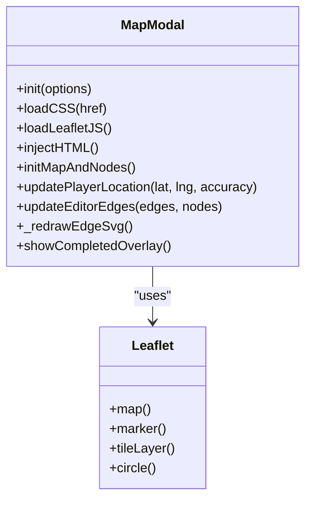

**Diagram sources**
- [MapModal.js:138-184](file://client/scripts/components/MapModal.js#L138-L184)
- [MapModal.js:366-426](file://client/scripts/components/MapModal.js#L366-L426)
- [MapModal.js:436-453](file://client/scripts/components/MapModal.js#L436-L453)
- [MapModal.js:601-751](file://client/scripts/components/MapModal.js#L601-L751)

**Section sources**
- [MapModal.js:138-184](file://client/scripts/components/MapModal.js#L138-L184)
- [MapModal.js:366-426](file://client/scripts/components/MapModal.js#L366-L426)
- [MapModal.js:436-453](file://client/scripts/components/MapModal.js#L436-L453)
- [MapModal.js:601-751](file://client/scripts/components/MapModal.js#L601-L751)

### Real-Time Player Positioning and GPS Proximity Validation
- Location watching: The game page watches high-accuracy geolocation updates and logs them for anti-spoofing.
- Map feedback: The player marker and accuracy circle are updated in real time.
- Arrival validation: When a player attempts to interact with a waypoint, the client sends current location and sensor data to the server. If outside the radius, a dev override prompt appears.

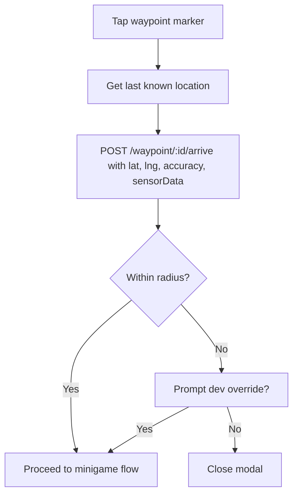

**Diagram sources**
- [game.js:257-267](file://client/scripts/game.js#L257-L267)
- [game.js:486-510](file://client/scripts/game.js#L486-L510)

**Section sources**
- [game.js:257-267](file://client/scripts/game.js#L257-L267)
- [game.js:486-510](file://client/scripts/game.js#L486-L510)

### Camera Capture Functionality for Image-Based Puzzles
- Camera stream: Uses the environment-facing camera with autoplay and inline playback.
- Reference overlay: Displays a semi-transparent reference image aligned to the video feed.
- Capture: Draws the current frame onto a canvas and exports a compressed JPEG blob.
- Submission: The blob is sent to the server’s minigame endpoint; results are shown in an overlay.

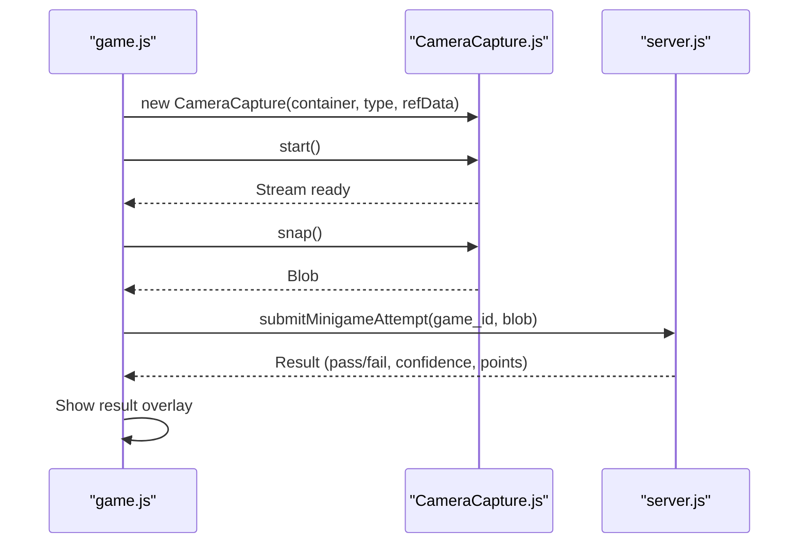

**Diagram sources**
- [game.js:367-451](file://client/scripts/game.js#L367-L451)
- [CameraCapture.js:1-112](file://client/scripts/components/CameraCapture.js#L1-L112)

**Section sources**
- [game.js:367-451](file://client/scripts/game.js#L367-L451)
- [CameraCapture.js:1-112](file://client/scripts/components/CameraCapture.js#L1-L112)

### Interactive Map Controls and UI Feedback
- Map controls: Zoom controls enabled; fullscreen toggle available; bubble mask constrains view.
- Edges: SVG overlays visualize directed edges between waypoints, redrawn on pan/zoom.
- Status visuals: Completed/unlocked/locked states are visually distinct; unlocked nodes pulse.
- Mobile layout: On small screens, the map remains visible while the play modal becomes a bottom sheet.

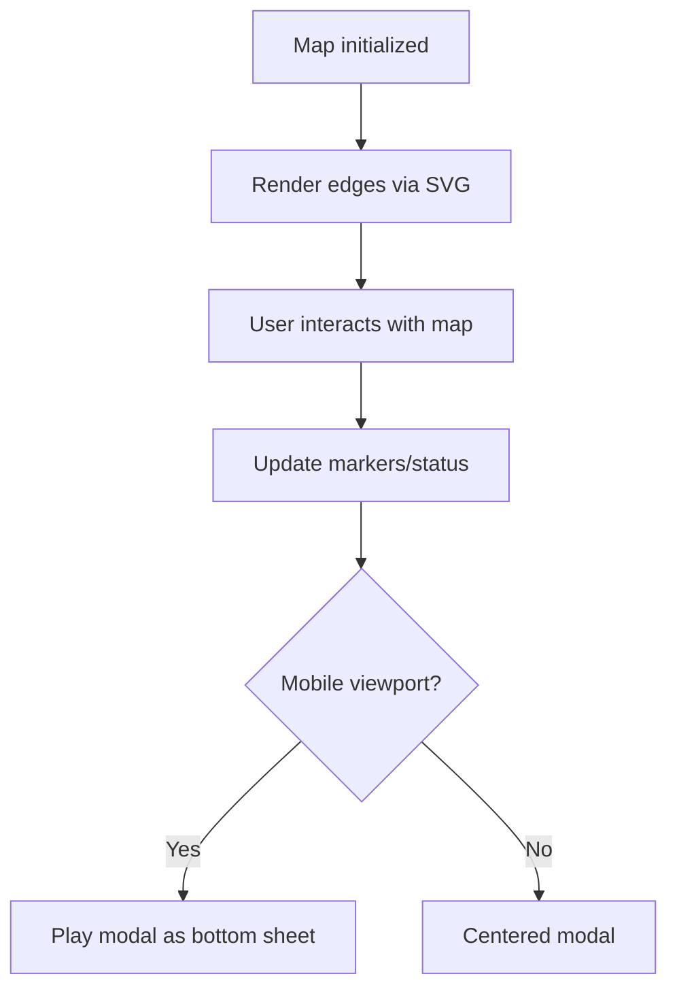

**Diagram sources**
- [MapModal.js:366-426](file://client/scripts/components/MapModal.js#L366-L426)
- [MapModal.js:601-751](file://client/scripts/components/MapModal.js#L601-L751)
- [game.css:650-666](file://client/styles/game.css#L650-L666)
- [game.css:753-800](file://client/styles/game.css#L753-L800)

**Section sources**
- [MapModal.js:366-426](file://client/scripts/components/MapModal.js#L366-L426)
- [MapModal.js:601-751](file://client/scripts/components/MapModal.js#L601-L751)
- [game.css:650-666](file://client/styles/game.css#L650-L666)
- [game.css:753-800](file://client/styles/game.css#L753-L800)

### Game State Management and Progress Tracking
- Session lifecycle: Starts a session and fetches full state including waypoints, edges, and progress.
- Node mapping: Converts server waypoints into internal nodes with status labels and progress percentages.
- Prefetching: Prefetches minigame references for unlocked/in-progress nodes to improve offline readiness.
- Completion overlay: Shows a completion overlay when the session is marked complete.

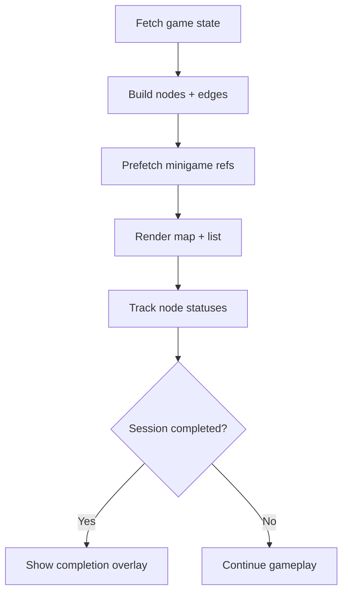

**Diagram sources**
- [game.js:143-271](file://client/scripts/game.js#L143-L271)

**Section sources**
- [game.js:143-271](file://client/scripts/game.js#L143-L271)

### Minigame Integration Patterns
- Handler registry: A single function returns a renderer and submit callback per game type.
- Supported types:
  - GPS proximity: Simple verification UI.
  - Text answer: Supports multiple-choice and free-text inputs.
  - QR/barcode: Integrates a scanner with manual entry fallback.
  - Plaque scan: Photo capture and preview before submission.
- Flow: After arrival validation, the orchestrator renders each minigame sequentially, submits results, and advances to the next or completes the waypoint.

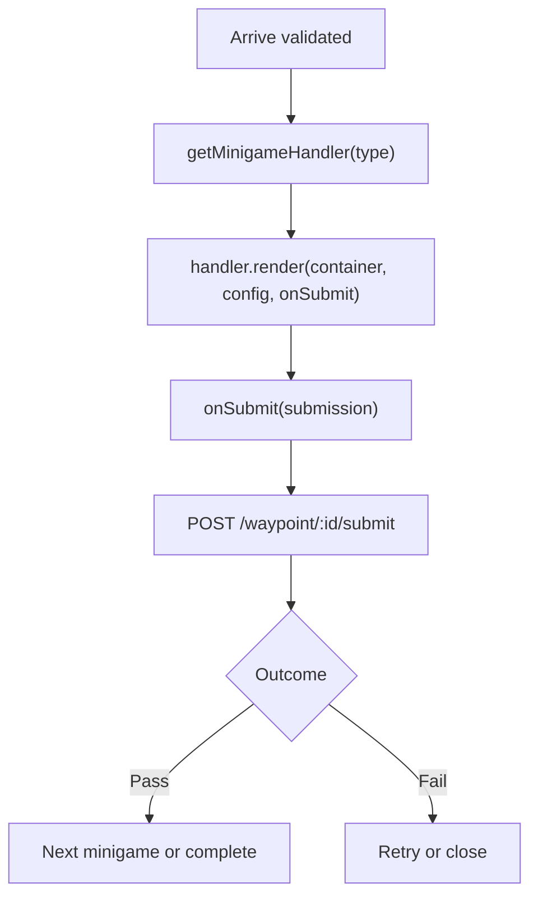

**Diagram sources**
- [game.js:517-604](file://client/scripts/game.js#L517-L604)
- [minigame-handlers.js:7-200](file://client/scripts/components/minigame-handlers.js#L7-L200)

**Section sources**
- [game.js:517-604](file://client/scripts/game.js#L517-L604)
- [minigame-handlers.js:7-200](file://client/scripts/components/minigame-handlers.js#L7-L200)

### Location Anti-Spoofing Visual Indicators
- Sensor collection: Accelerometer step detection and GPS coordinate buffering occur during gameplay.
- Data payload: Sensor buffer and step count are included with arrival checks.
- Server-side analysis: Documentation describes drift, speed, and pedometer checks that influence trust scoring and potential flags.

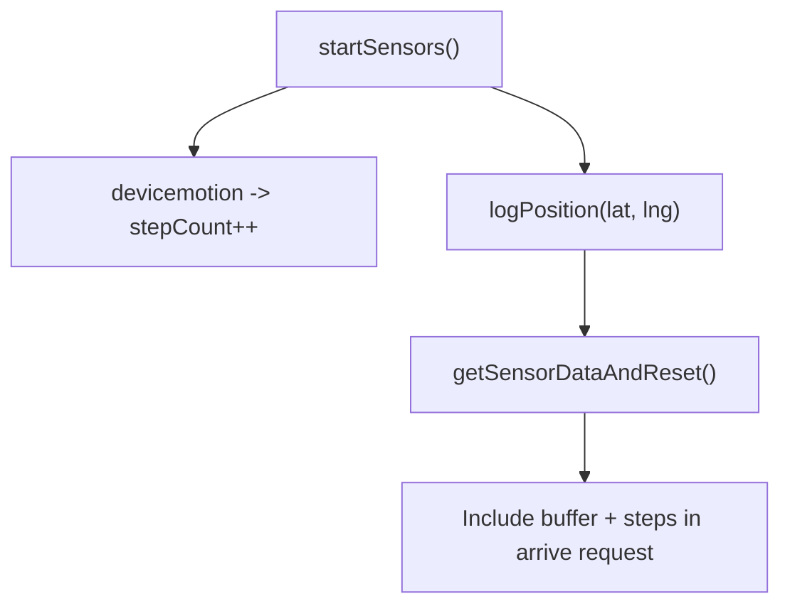

**Diagram sources**
- [sensors.js:9-58](file://client/scripts/sensors.js#L9-L58)
- [game.js:486-495](file://client/scripts/game.js#L486-L495)
- [implementation-details.md:39-64](file://warg-docs/docs/2-architecture-and-design/implementation-details.md#L39-L64)

**Section sources**
- [sensors.js:9-58](file://client/scripts/sensors.js#L9-L58)
- [game.js:486-495](file://client/scripts/game.js#L486-L495)
- [implementation-details.md:39-64](file://warg-docs/docs/2-architecture-and-design/implementation-details.md#L39-L64)

### Mobile-Responsive Gameplay Considerations
- Map height adapts on smaller screens.
- When the play modal is open on mobile, the overlay becomes transparent and non-blocking so the map remains scrollable.
- The play modal transforms into a bottom sheet anchored at the bottom of the viewport.

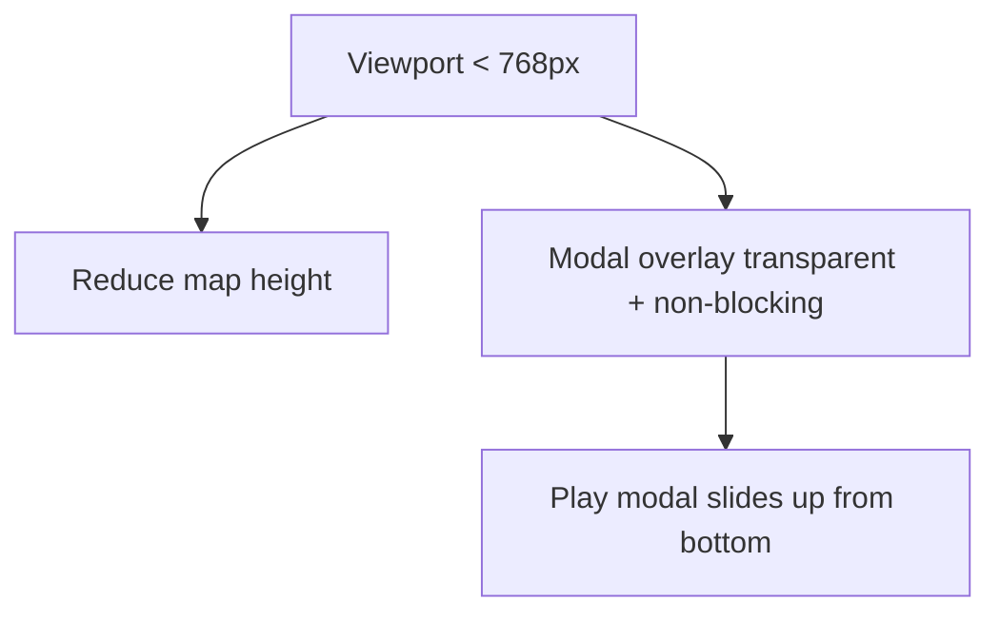

**Diagram sources**
- [game.css:189-194](file://client/styles/game.css#L189-L194)
- [game.css:753-800](file://client/styles/game.css#L753-L800)

**Section sources**
- [game.css:189-194](file://client/styles/game.css#L189-L194)
- [game.css:753-800](file://client/styles/game.css#L753-L800)

### Real-Time Multiplayer Synchronization Through WebSocket Connections
- Server setup: Express app wrapped in an HTTP server with Socket.io configured for CORS and credentials.
- Client-side note: The documentation outlines tick-based broadcasting for live/co-op games using WebSockets; the current client code focuses on HTTP-based minigame submissions and offline sync.

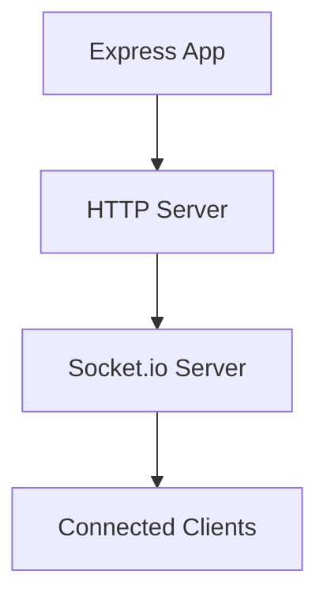

**Diagram sources**
- [server.js:1-37](file://server/server.js#L1-L37)
- [implementation-details.md:207-209](file://warg-docs/docs/2-architecture-and-design/implementation-details.md#L207-L209)

**Section sources**
- [server.js:1-37](file://server/server.js#L1-L37)
- [implementation-details.md:207-209](file://warg-docs/docs/2-architecture-and-design/implementation-details.md#L207-L209)

## Dependency Analysis
- Client dependencies:
  - Leaflet.js and OpenStreetMap tiles are loaded dynamically by the map component.
  - html5-qrcode is used for QR/barcode scanning in minigame handlers.
- Internal dependencies:
  - game.js depends on MapModal, PlayModal, sensors, minigame handlers, and CameraCapture.
  - MapModal depends on Leaflet and OpenStreetMap tile service.
- Data model:
  - Minigames are attached to waypoints and define how players complete nodes.

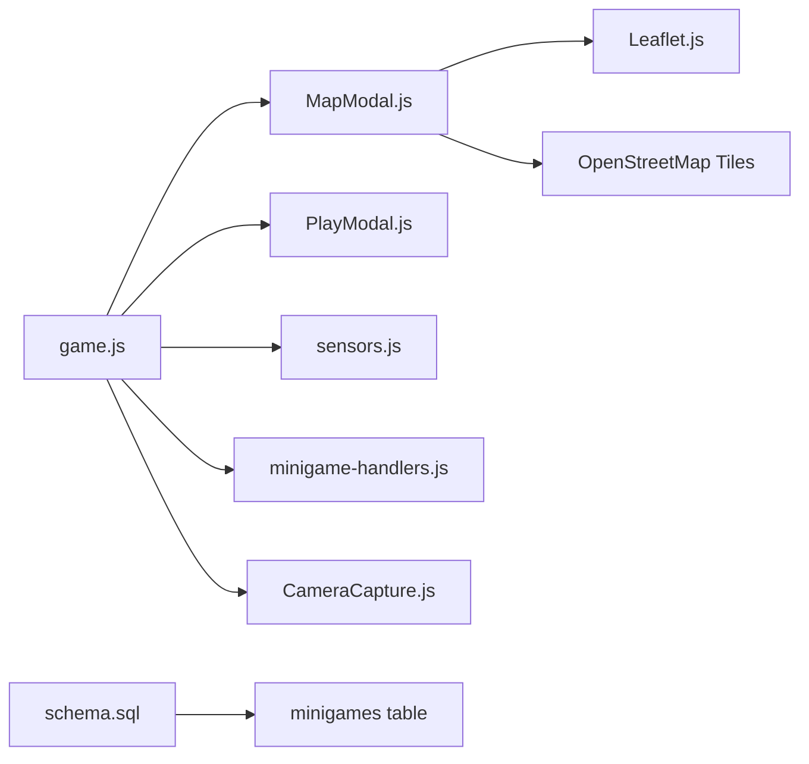

**Diagram sources**
- [game.js:7-12](file://client/scripts/game.js#L7-L12)
- [MapModal.js:186-199](file://client/scripts/components/MapModal.js#L186-L199)
- [schema.sql:212-223](file://database/schema.sql#L212-L223)

**Section sources**
- [game.js:7-12](file://client/scripts/game.js#L7-L12)
- [MapModal.js:186-199](file://client/scripts/components/MapModal.js#L186-L199)
- [schema.sql:212-223](file://database/schema.sql#L212-L223)

## Performance Considerations
- Lazy loading: Leaflet CSS/JS are loaded only when needed to reduce initial bundle size.
- Image capture optimization: Canvas frames are resized to a maximum dimension and exported as JPEG with reduced quality to minimize payload size.
- Geolocation throttling: watchPosition uses a reasonable maximumAge to balance freshness and battery usage.
- Edge redrawing: SVG edges are redrawn on map movement/zoom but cached to avoid unnecessary work.

[No sources needed since this section provides general guidance]

## Troubleshooting Guide
- Camera permission denied: The camera capture component throws an error if getUserMedia fails; ensure HTTPS and user permission.
- Geolocation unavailable: The game shows alerts when geolocation is unsupported or fails; verify device permissions and location services.
- Offline sync failures: BroadcastChannel messages report errors; check network connectivity and service worker registration.
- Minigame submission errors: Errors during submission reset the UI and retry rendering; inspect console logs for details.

**Section sources**
- [CameraCapture.js:45-53](file://client/scripts/components/CameraCapture.js#L45-L53)
- [game.js:480-484](file://client/scripts/game.js#L480-L484)
- [game.js:616-628](file://client/scripts/game.js#L616-L628)
- [game.js:595-600](file://client/scripts/game.js#L595-L600)

## Conclusion
The WARG Platform’s core game interface combines a responsive Leaflet-based map, robust geolocation and sensor-driven anti-spoofing, modular minigame handlers, and a camera capture pipeline for visual puzzles. Game state is managed centrally, with clear progression tracking and optional WebSocket-based multiplayer synchronization. The design emphasizes modularity, offline resilience, and mobile-friendly UX patterns.

[No sources needed since this section summarizes without analyzing specific files]