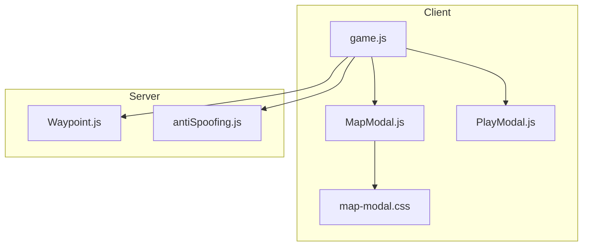
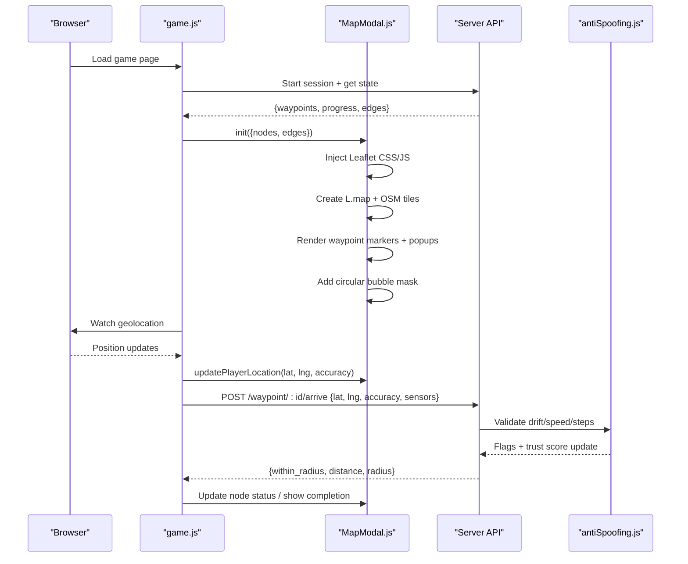
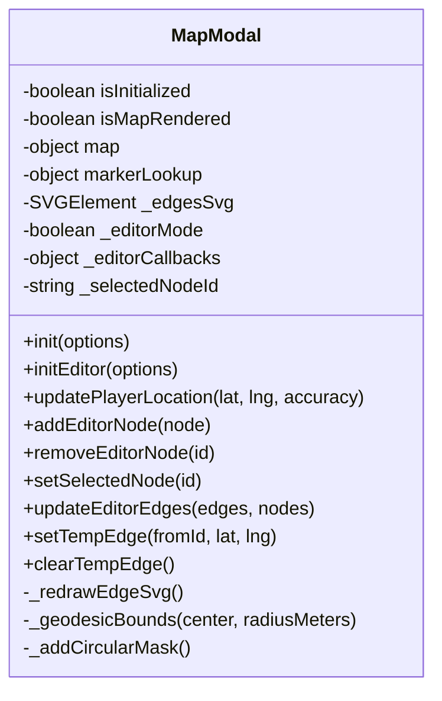
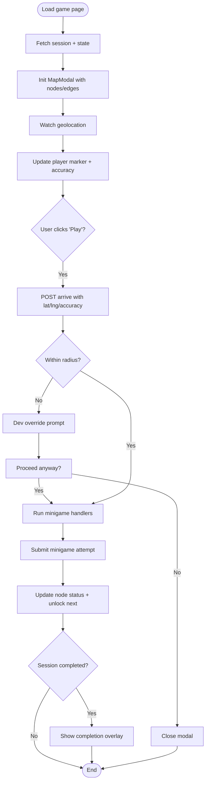
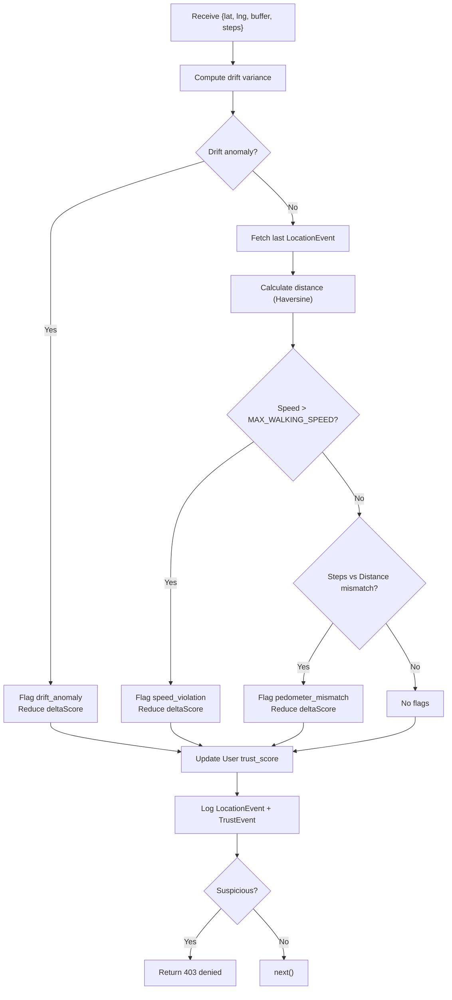
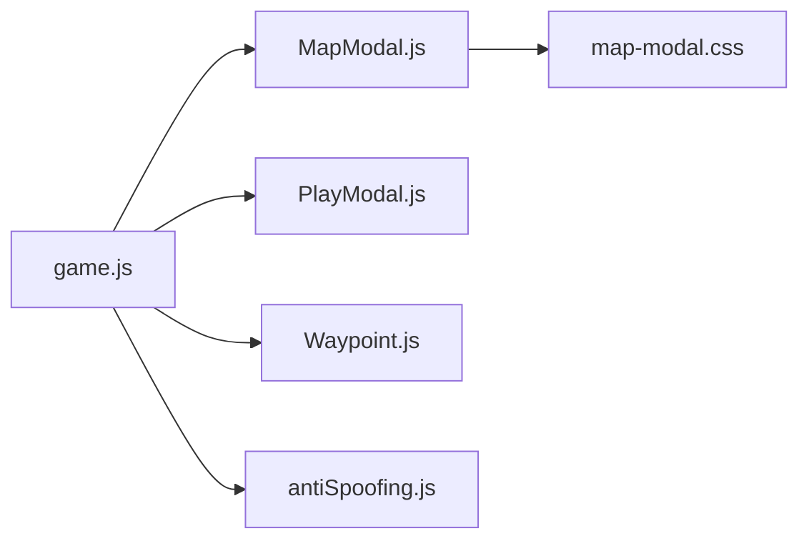

# Map & Geospatial Interface

<cite>
**Referenced Files in This Document**   
- [MapModal.js](file://client/scripts/components/MapModal.js)
- [map-modal.css](file://client/styles/map-modal.css)
- [game.js](file://client/scripts/game.js)
- [PlayModal.js](file://client/scripts/components/PlayModal.js)
- [Waypoint.js](file://server/src/models/Waypoint.js)
- [antiSpoofing.js](file://server/src/middleware/antiSpoofing.js)
- [third-party-code.md](file://warg-docs/docs/8-third-party/third-party-code.md)
</cite>

## Table of Contents
1. [Introduction](#introduction)
2. [Project Structure](#project-structure)
3. [Core Components](#core-components)
4. [Architecture Overview](#architecture-overview)
5. [Detailed Component Analysis](#detailed-component-analysis)
6. [Dependency Analysis](#dependency-analysis)
7. [Performance Considerations](#performance-considerations)
8. [Troubleshooting Guide](#troubleshooting-guide)
9. [Conclusion](#conclusion)

## Introduction
This document explains the map and geospatial interface of the WARG Platform. It focuses on Leaflet.js integration, waypoint visualization, player positioning, GPS proximity validation UI feedback, location-based puzzle markers, spatial navigation controls, layer management, custom marker styles, real-time movement tracking, waypoint progression visualization, distance calculations, anti-spoofing indicators, mobile-responsive interactions, touch gestures, and performance optimization for large datasets.

The map is a modal-driven component that can be used both by players during gameplay and by editors when authoring or editing WARG nodes. The client dynamically loads Leaflet and OpenStreetMap tiles, renders waypoints as styled markers, draws SVG edges between nodes in editor mode, and overlays a circular campus bubble mask. Player location is tracked via the browser’s Geolocation API and visualized with a glowing dot and accuracy circle. Proximity validation occurs through server-side checks that return radius and distance information to the client, which then guides user flow and UI feedback. Anti-spoofing middleware evaluates drift, speed, and pedometer consistency to protect location-based gameplay.

## Project Structure
The map and geospatial features span client components, styles, game orchestration, server models, and anti-spoofing middleware:

- Client map component: `client/scripts/components/MapModal.js`
- Map styling and responsive layout: `client/styles/map-modal.css`
- Game page orchestration and geolocation watch: `client/scripts/game.js`
- Play modal integration for minigames and submission flow: `client/scripts/components/PlayModal.js`
- Waypoint data model (geospatial geometry): `server/src/models/Waypoint.js`
- Anti-spoofing middleware (distance, speed, drift, steps): `server/src/middleware/antiSpoofing.js`
- Third-party dependencies documentation: `warg-docs/docs/8-third-party/third-party-code.md`

**Diagram sources**
- [game.js:143-270](file://client/scripts/game.js#L143-L270)
- [MapModal.js:138-184](file://client/scripts/components/MapModal.js#L138-L184)
- [map-modal.css:306-331](file://client/styles/map-modal.css#L306-L331)
- [Waypoint.js:4-11](file://server/src/models/Waypoint.js#L4-L11)
- [antiSpoofing.js:27-164](file://server/src/middleware/antiSpoofing.js#L27-L164)

**Section sources**
- [MapModal.js:1-43](file://client/scripts/components/MapModal.js#L1-L43)
- [map-modal.css:1-41](file://client/styles/map-modal.css#L1-L41)
- [game.js:143-270](file://client/scripts/game.js#L143-L270)
- [Waypoint.js:4-11](file://server/src/models/Waypoint.js#L4-L11)
- [antiSpoofing.js:27-164](file://server/src/middleware/antiSpoofing.js#L27-L164)

## Core Components
- Map Modal (`MapModal.js`): Initializes Leaflet, manages layers, renders waypoints, handles popups, updates player position, and provides editor-mode node and edge drawing.
- Game Page (`game.js`): Loads game state, initializes the map modal, watches player location, triggers waypoint arrival checks, and orchestrates minigame flows.
- Play Modal (`PlayModal.js`): Presents waypoint descriptions, controls, and feedback; integrates with camera minigames and submission results.
- Waypoint Model (`Waypoint.js`): Defines geospatial point storage and validation radius for proximity checks.
- Anti-Spoofing Middleware (`antiSpoofing.js`): Validates location submissions using drift, speed, and pedometer checks, updating trust scores and logging events.

Key responsibilities:
- Interactive map rendering with Leaflet and OpenStreetMap tiles.
- Waypoint markers with status-aware styling and popups.
- Real-time player marker and accuracy circle.
- Circular campus bubble mask limiting visible area.
- Editor-mode SVG edges connecting nodes.
- GPS proximity validation UI feedback and geofence enforcement.
- Mobile-responsive layout and touch-friendly interactions.

**Section sources**
- [MapModal.js:138-184](file://client/scripts/components/MapModal.js#L138-L184)
- [MapModal.js:366-426](file://client/scripts/components/MapModal.js#L366-L426)
- [MapModal.js:436-453](file://client/scripts/components/MapModal.js#L436-L453)
- [MapModal.js:753-800](file://client/scripts/components/MapModal.js#L753-L800)
- [game.js:143-270](file://client/scripts/game.js#L143-L270)
- [game.js:486-630](file://client/scripts/game.js#L486-L630)
- [Waypoint.js:4-11](file://server/src/models/Waypoint.js#L4-L11)
- [antiSpoofing.js:27-164](file://server/src/middleware/antiSpoofing.js#L27-L164)

## Architecture Overview
The map architecture combines a dynamic client-side Leaflet instance with server-side geospatial data and validation.

**Diagram sources**
- [game.js:143-270](file://client/scripts/game.js#L143-L270)
- [game.js:486-630](file://client/scripts/game.js#L486-L630)
- [MapModal.js:138-184](file://client/scripts/components/MapModal.js#L138-L184)
- [MapModal.js:366-426](file://client/scripts/components/MapModal.js#L366-L426)
- [MapModal.js:436-453](file://client/scripts/components/MapModal.js#L436-L453)
- [antiSpoofing.js:27-164](file://server/src/middleware/antiSpoofing.js#L27-L164)

## Detailed Component Analysis

### Map Modal Component (`MapModal.js`)
Responsibilities:
- Dynamically inject Leaflet CSS/JS and modal HTML structure.
- Initialize Leaflet map with OpenStreetMap tiles and constraints (min/max zoom, max bounds).
- Render waypoint markers with status-aware icons and popups.
- Manage player marker and accuracy circle.
- Provide editor-mode APIs for adding/removing nodes, selecting nodes, drawing edges, and redrawing SVG connections.
- Implement a circular bubble mask overlay to limit visible map area around the center.

Key implementation highlights:
- Dynamic dependency loading ensures Leaflet is available only when needed.
- Map initialization sets tile layer, zoom control, and bounds.
- Player location updates create or move a glowing marker and an accuracy circle.
- Editor mode adds draggable markers with custom handles and SVG edges.
- Bubble mask uses SVG mask to hide everything outside a geodesic circle.

**Diagram sources**
- [MapModal.js:8-43](file://client/scripts/components/MapModal.js#L8-L43)
- [MapModal.js:138-184](file://client/scripts/components/MapModal.js#L138-L184)
- [MapModal.js:366-426](file://client/scripts/components/MapModal.js#L366-L426)
- [MapModal.js:436-453](file://client/scripts/components/MapModal.js#L436-L453)
- [MapModal.js:461-526](file://client/scripts/components/MapModal.js#L461-L526)
- [MapModal.js:601-633](file://client/scripts/components/MapModal.js#L601-L633)
- [MapModal.js:648-751](file://client/scripts/components/MapModal.js#L648-L751)
- [MapModal.js:753-800](file://client/scripts/components/MapModal.js#L753-L800)

**Section sources**
- [MapModal.js:138-184](file://client/scripts/components/MapModal.js#L138-L184)
- [MapModal.js:366-426](file://client/scripts/components/MapModal.js#L366-L426)
- [MapModal.js:436-453](file://client/scripts/components/MapModal.js#L436-L453)
- [MapModal.js:461-526](file://client/scripts/components/MapModal.js#L461-L526)
- [MapModal.js:601-633](file://client/scripts/components/MapModal.js#L601-L633)
- [MapModal.js:648-751](file://client/scripts/components/MapModal.js#L648-L751)
- [MapModal.js:753-800](file://client/scripts/components/MapModal.js#L753-L800)

### Game Page Orchestration (`game.js`)
Responsibilities:
- Load ARG state and initialize the map modal with nodes and edges.
- Start sensor collection and geolocation watching.
- Handle waypoint arrival checks and submit minigame attempts.
- Update node statuses and show completion overlays.
- Integrate camera-based minigames and offline sync handling.

Key implementation highlights:
- Fetches game state and constructs node objects from waypoints and progress.
- Calls `mapModal.init` with nodes and edges.
- Watches geolocation and forwards updates to `mapModal.updatePlayerLocation`.
- On play-node event, opens PlayModal, performs geofence check, and runs minigame handlers.
- Updates map markers based on server responses (unlocked/completed).

**Diagram sources**
- [game.js:143-270](file://client/scripts/game.js#L143-L270)
- [game.js:354-630](file://client/scripts/game.js#L354-L630)

**Section sources**
- [game.js:143-270](file://client/scripts/game.js#L143-L270)
- [game.js:354-630](file://client/scripts/game.js#L354-L630)

### Play Modal Integration (`PlayModal.js`)
Responsibilities:
- Display waypoint title and description with read-more behavior.
- Lock background scrolling on desktop while keeping mobile map scrollable.
- Provide controls container for minigame UI and feedback.
- Support camera capture minigames and result overlays.

Key implementation highlights:
- Opens/closes modal with accessibility attributes.
- Conditionally locks body scroll on non-mobile devices.
- Integrates with game.js to render minigame controls and feedback.

**Section sources**
- [PlayModal.js:37-83](file://client/scripts/components/PlayModal.js#L37-L83)

### Waypoint Data Model (`Waypoint.js`)
Responsibilities:
- Define database schema for waypoints including geospatial POINT geometry and validation radius.

Key fields:
- `waypoint_id`: Primary key.
- `arg_id`: Associated ARG identifier.
- `title`, `description`: Human-readable content.
- `location`: GEOMETRY('POINT', 4326) storing coordinates.
- `validation_radius_m`: Radius in meters for proximity validation.
- `sort_order`: Ordering within an ARG.

**Section sources**
- [Waypoint.js:4-11](file://server/src/models/Waypoint.js#L4-L11)

### Anti-Spoofing Middleware (`antiSpoofing.js`)
Responsibilities:
- Validate location submissions using drift variance, speed limits, and pedometer consistency.
- Update user trust score and flag suspicious activity.
- Log location events and trust events.
- Block requests if suspicious patterns are detected.

Key logic:
- Haversine distance calculation between last known location and current location.
- Drift anomaly detection via low variance in buffered coordinates.
- Speed violation detection exceeding walking speed threshold.
- Pedometer mismatch detection comparing steps to traveled distance.
- Trust score adjustment and flagging when thresholds are breached.

**Diagram sources**
- [antiSpoofing.js:27-164](file://server/src/middleware/antiSpoofing.js#L27-L164)

**Section sources**
- [antiSpoofing.js:27-164](file://server/src/middleware/antiSpoofing.js#L27-L164)

### Styling and Responsive Layout (`map-modal.css`)
Responsibilities:
- Style the modal container, field log sidebar, HUD, markers, popups, and overlays.
- Apply dark theme filters to OSM tiles while preserving marker/popups.
- Implement circular bubble mask overlay and scanning effects.
- Provide mobile-responsive layout adjustments for smaller screens.

Key styling highlights:
- Tile filter inversion/hue rotation for dark mode.
- Marker states: completed, current, locked with distinct colors and glow.
- Popup styling with custom backgrounds and borders.
- Mobile breakpoint reflows map and field log into stacked layout.

**Section sources**
- [map-modal.css:306-331](file://client/styles/map-modal.css#L306-L331)
- [map-modal.css:472-535](file://client/styles/map-modal.css#L472-L535)
- [map-modal.css:606-753](file://client/styles/map-modal.css#L606-L753)
- [map-modal.css:755-803](file://client/styles/map-modal.css#L755-L803)

### Third-Party Dependencies
Leaflet.js and OpenStreetMap tiles are documented as core third-party dependencies:
- Leaflet v1.9.4 loaded dynamically via CDN.
- OpenStreetMap tiles used as the base map layer.

**Section sources**
- [third-party-code.md:5-15](file://warg-docs/docs/8-third-party/third-party-code.md#L5-L15)

## Dependency Analysis
The map and geospatial subsystem has clear separation of concerns:
- `game.js` orchestrates data fetching, geolocation, and UI flow.
- `MapModal.js` encapsulates all Leaflet-related logic and DOM manipulation.
- `PlayModal.js` handles presentation and interaction for minigames.
- `Waypoint.js` defines persistent geospatial data structures.
- `antiSpoofing.js` enforces integrity of location-based actions.

**Diagram sources**
- [game.js:143-270](file://client/scripts/game.js#L143-L270)
- [MapModal.js:138-184](file://client/scripts/components/MapModal.js#L138-L184)
- [map-modal.css:306-331](file://client/styles/map-modal.css#L306-L331)
- [Waypoint.js:4-11](file://server/src/models/Waypoint.js#L4-L11)
- [antiSpoofing.js:27-164](file://server/src/middleware/antiSpoofing.js#L27-L164)

**Section sources**
- [game.js:143-270](file://client/scripts/game.js#L143-L270)
- [MapModal.js:138-184](file://client/scripts/components/MapModal.js#L138-L184)
- [map-modal.css:306-331](file://client/styles/map-modal.css#L306-L331)
- [Waypoint.js:4-11](file://server/src/models/Waypoint.js#L4-L11)
- [antiSpoofing.js:27-164](file://server/src/middleware/antiSpoofing.js#L27-L164)

## Performance Considerations
- Dynamic dependency loading: Leaflet CSS/JS are injected only when the map modal initializes, reducing initial payload.
- Tile layer filtering: Dark mode filters are applied to OSM tiles but excluded for markers/popups to avoid unnecessary repaints.
- Marker management: Markers are cached in `markerLookup` and updated rather than recreated on each location change.
- Accuracy circle updates: The player accuracy circle radius is updated incrementally without recreating layers.
- Edge redraw optimization: SVG edges are redrawn only on map move/zoom/resize events, minimizing DOM operations.
- Circular bubble mask: Uses SVG mask to efficiently hide areas outside the campus bubble without heavy compositing.
- Mobile responsiveness: Layout switches to stacked orientation on small screens, improving touch usability and reducing layout thrash.

Recommendations for large datasets:
- Batch waypoint creation and use Layer Groups to toggle visibility.
- Use clustering for dense waypoint sets to reduce marker count.
- Debounce geolocation updates to avoid excessive marker refreshes.
- Precompute distances where possible and cache results.
- Limit zoom levels to reduce tile load and improve rendering performance.

[No sources needed since this section provides general guidance]

## Troubleshooting Guide
Common issues and resolutions:
- Leaflet not loading: Ensure CDN availability and verify dynamic script injection succeeds. Check console for script load errors.
- Map not rendering: Confirm the map container exists and `initMapAndNodes` is called after DOM readiness. Call `invalidateSize()` after layout changes.
- Player marker not updating: Verify geolocation permissions and that `watchPosition` is active. Check `updatePlayerLocation` calls.
- Waypoint markers not visible: Ensure nodes have valid latitude/longitude and status values. Confirm marker icons are created correctly.
- Edges not drawing in editor mode: Verify edges array contains valid `from` and `to` node IDs and that `_redrawEdgeSvg` is triggered on map events.
- Geofence validation failing: Check server response for `within_radius` and `distance`. Use dev override if necessary for testing.
- Anti-spoofing blocking requests: Review drift variance, speed, and pedometer mismatch logs. Adjust thresholds or provide realistic sensor data.

**Section sources**
- [MapModal.js:186-199](file://client/scripts/components/MapModal.js#L186-L199)
- [MapModal.js:366-426](file://client/scripts/components/MapModal.js#L366-L426)
- [MapModal.js:436-453](file://client/scripts/components/MapModal.js#L436-L453)
- [MapModal.js:648-751](file://client/scripts/components/MapModal.js#L648-L751)
- [game.js:486-630](file://client/scripts/game.js#L486-L630)
- [antiSpoofing.js:27-164](file://server/src/middleware/antiSpoofing.js#L27-L164)

## Conclusion
The WARG Platform’s map and geospatial interface combines a modular Leaflet-based map component with robust geolocation tracking, waypoint visualization, and server-side validation. The system supports interactive exploration, real-time player movement, and secure location-based gameplay through anti-spoofing measures. Editor tools enable precise node placement and edge drawing, while responsive styling ensures smooth mobile experiences. By following the architectural patterns and performance recommendations outlined here, developers can extend and optimize the map interface effectively.

[No sources needed since this section summarizes without analyzing specific files]