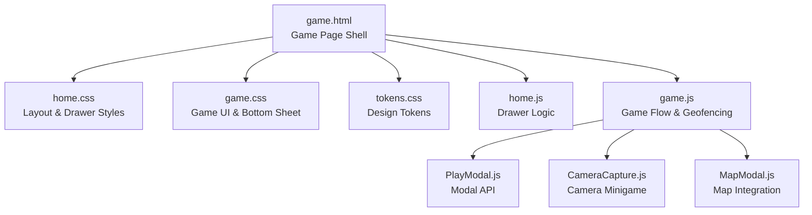
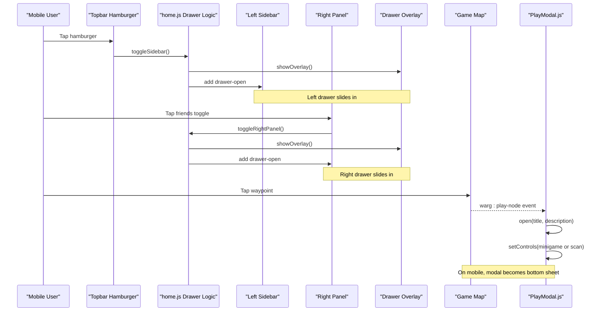
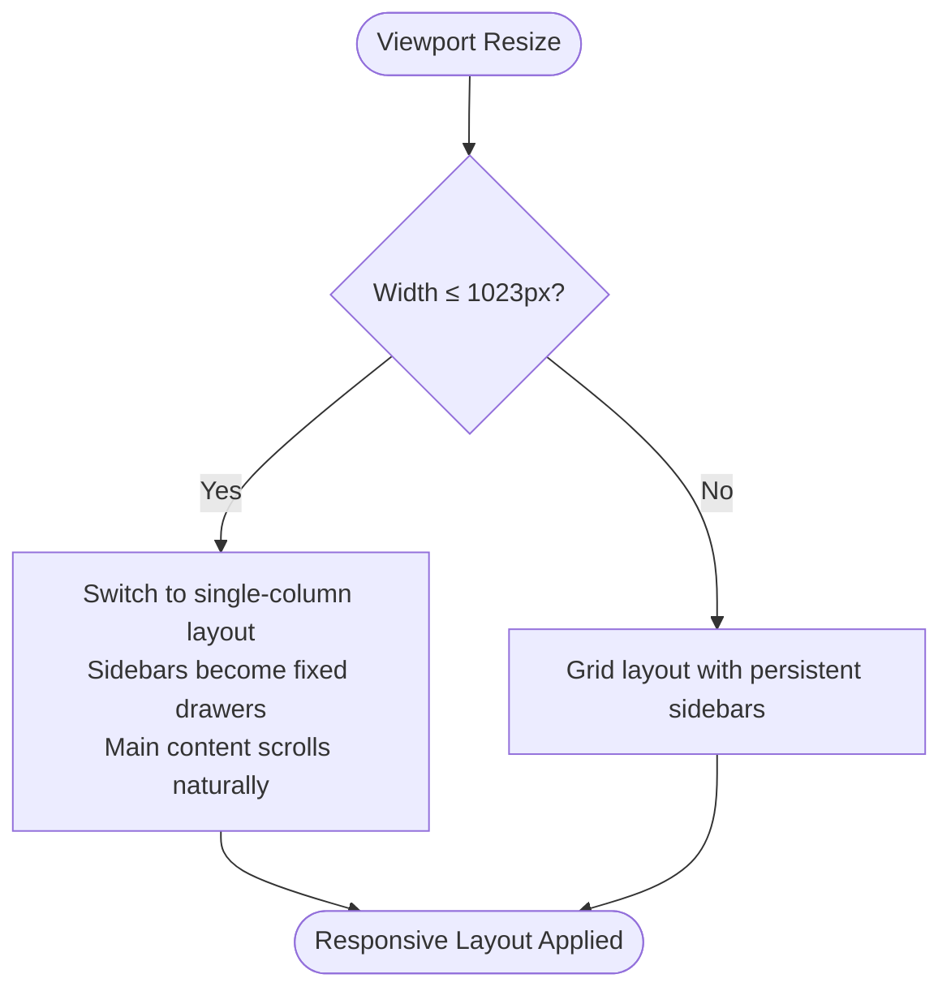
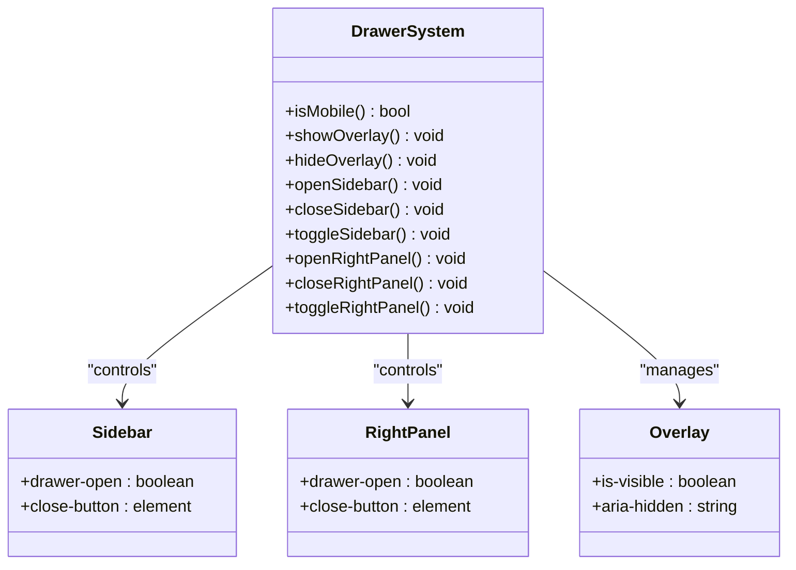
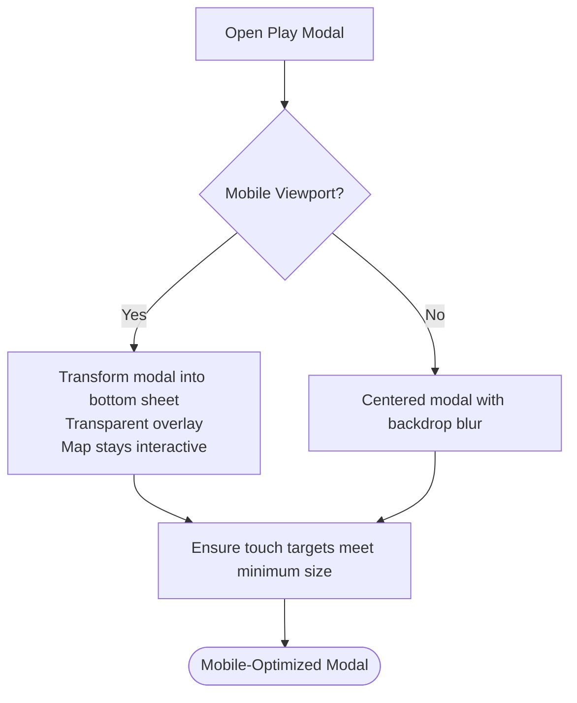
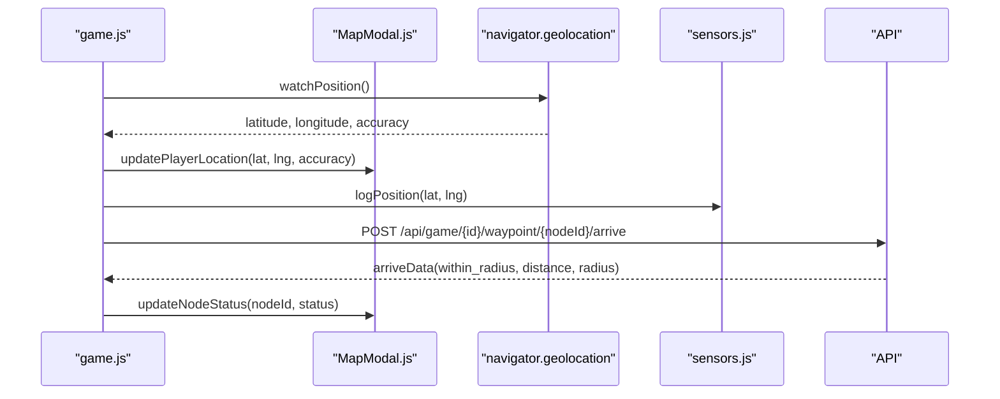
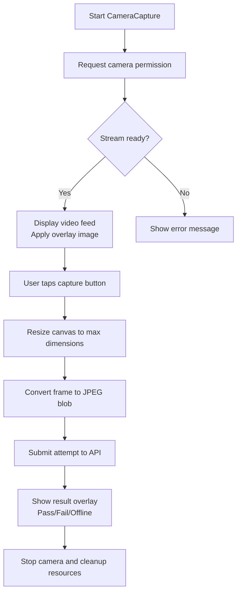
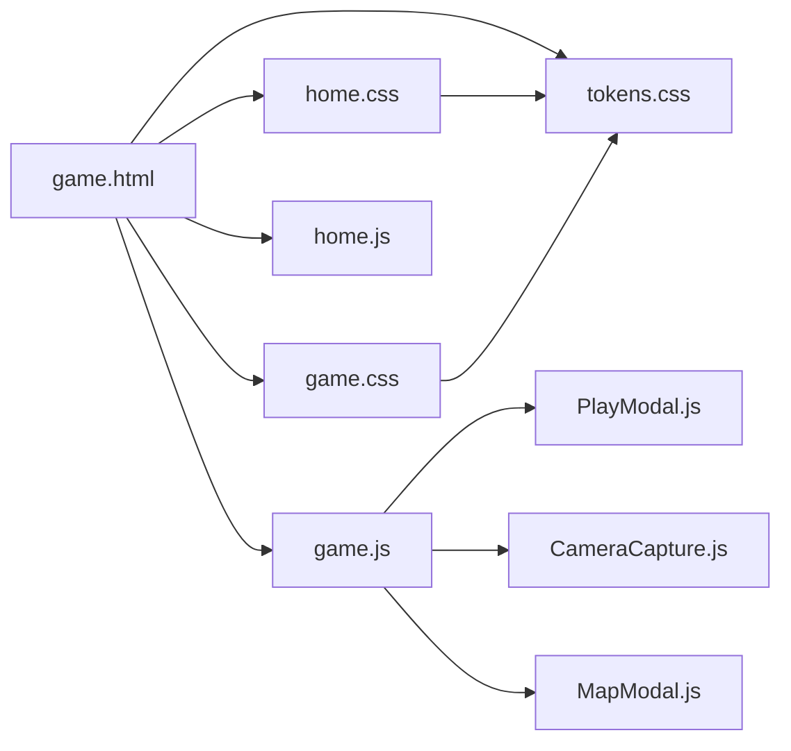

# Mobile Responsive Design

<cite>
**Referenced Files in This Document**   
- [game.html](file://client/game.html)
- [home.css](file://client/styles/home.css)
- [tokens.css](file://client/styles/tokens.css)
- [game.css](file://client/styles/game.css)
- [home.js](file://client/scripts/home.js)
- [game.js](file://client/scripts/game.js)
- [PlayModal.js](file://client/scripts/components/PlayModal.js)
- [CameraCapture.js](file://client/scripts/components/CameraCapture.js)
- [MapModal.js](file://client/scripts/components/MapModal.js)
</cite>

## Table of Contents
1. [Introduction](#introduction)
2. [Project Structure](#project-structure)
3. [Core Components](#core-components)
4. [Architecture Overview](#architecture-overview)
5. [Detailed Component Analysis](#detailed-component-analysis)
6. [Dependency Analysis](#dependency-analysis)
7. [Performance Considerations](#performance-considerations)
8. [Troubleshooting Guide](#troubleshooting-guide)
9. [Conclusion](#conclusion)

## Introduction
This document explains the mobile responsive design implementation for the WARG Platform’s core game interface. It covers the adaptive layout system, drawer navigation, collapsible panels, space-efficient layouts, touch-friendly controls, mobile-optimized map interactions, CSS design tokens, responsive breakpoints, cross-device compatibility strategies, accessibility considerations, and progressive enhancement techniques.

The goal is to help developers understand how the game page adapts from desktop to mobile, how drawers and bottom sheets are implemented, and how location-based gameplay remains usable on small screens with limited input methods.

## Project Structure
The mobile-responsive game experience is primarily composed of:
- A semantic HTML shell that defines the topbar, left sidebar, main content area, right panel, and modal overlays.
- CSS layers and media queries that transform fixed sidebars into slide-in drawers and convert modals into bottom sheets on smaller screens.
- JavaScript modules that manage drawer state, play modal behavior, camera capture, geolocation, and map integration.

**Diagram sources**
- [game.html:21-465](file://client/game.html#L21-L465)
- [home.css:1137-1233](file://client/styles/home.css#L1137-L1233)
- [game.css:753-800](file://client/styles/game.css#L753-L800)
- [tokens.css:10-112](file://client/styles/tokens.css#L10-L112)
- [home.js:18-117](file://client/scripts/home.js#L18-L117)
- [game.js:143-272](file://client/scripts/game.js#L143-L272)
- [PlayModal.js:47-81](file://client/scripts/components/PlayModal.js#L47-L81)
- [CameraCapture.js:37-54](file://client/scripts/components/CameraCapture.js#L37-L54)
- [MapModal.js:436-453](file://client/scripts/components/MapModal.js#L436-L453)

**Section sources**
- [game.html:21-465](file://client/game.html#L21-L465)
- [home.css:1137-1233](file://client/styles/home.css#L1137-L1233)
- [game.css:753-800](file://client/styles/game.css#L753-L800)
- [tokens.css:10-112](file://client/styles/tokens.css#L10-L112)
- [home.js:18-117](file://client/scripts/home.js#L18-L117)
- [game.js:143-272](file://client/scripts/game.js#L143-L272)
- [PlayModal.js:47-81](file://client/scripts/components/PlayModal.js#L47-L81)
- [CameraCapture.js:37-54](file://client/scripts/components/CameraCapture.js#L37-L54)
- [MapModal.js:436-453](file://client/scripts/components/MapModal.js#L436-L453)

## Core Components
The mobile-responsive game interface relies on several key components:

- Adaptive Layout System
  - The app shell switches from a grid-based desktop layout to a single-column mobile layout at a mobile breakpoint.
  - Sidebars become fixed-position drawers that slide in from the edges.
  - Main content scrolls naturally on mobile without internal scrolling.

- Drawer Navigation System
  - Left sidebar acts as primary navigation.
  - Right panel shows friends and activity.
  - An overlay backdrop prevents background interaction when drawers are open.
  - Keyboard and click-to-dismiss behaviors improve usability.

- Collapsible Panels and Space-Efficient Layouts
  - On desktop, sidebars can be collapsed; on mobile, they are hidden by default and opened via drawers.
  - The feedback/discussion section uses a collapsible header to save vertical space.

- Touch-Friendly Controls
  - Modal close buttons and interactive elements use a minimum touch target size.
  - Modals adapt to bottom sheets on mobile to keep the map visible underneath.

- Mobile-Optimized Map Interactions
  - The map placeholder and progress timeline adjust height on mobile.
  - When the play modal opens on mobile, it becomes a bottom sheet while allowing touches to pass through to the map.

- CSS Design Tokens
  - Centralized tokens define colors, typography, spacing, radius, elevation, transitions, and layout dimensions.
  - Tokens include a dedicated touch-target variable for consistent sizing across devices.

**Section sources**
- [home.css:1137-1233](file://client/styles/home.css#L1137-L1233)
- [home.js:18-117](file://client/scripts/home.js#L18-L117)
- [game.css:189-194](file://client/styles/game.css#L189-L194)
- [game.css:753-800](file://client/styles/game.css#L753-L800)
- [tokens.css:10-112](file://client/styles/tokens.css#L10-L112)

## Architecture Overview
The mobile architecture combines semantic HTML structure, layered CSS, and modular JavaScript to deliver a responsive game experience.

**Diagram sources**
- [home.js:34-94](file://client/scripts/home.js#L34-L94)
- [home.js:96-117](file://client/scripts/home.js#L96-L117)
- [game.js:353-357](file://client/scripts/game.js#L353-L357)
- [PlayModal.js:47-81](file://client/scripts/components/PlayModal.js#L47-L81)
- [game.css:753-800](file://client/styles/game.css#L753-L800)

## Detailed Component Analysis

### Adaptive Layout System
The layout adapts based on viewport width:
- Desktop: Grid-based app shell with persistent sidebars.
- Mobile (≤1023px): Single-column flex layout where sidebars become fixed-position drawers.
- Main content becomes scrollable at the body level rather than internally.

Key behaviors:
- `.app-shell` switches to column layout and removes grid transitions on mobile.
- `.sidebar` and `.right-panel` become fixed drawers with `translateX` transforms.
- `.main-content` allows natural scrolling and removes internal overflow constraints.

**Diagram sources**
- [home.css:1137-1233](file://client/styles/home.css#L1137-L1233)

**Section sources**
- [home.css:1137-1233](file://client/styles/home.css#L1137-L1233)

### Drawer Navigation System
The drawer system manages both left and right panels:
- A shared overlay backdrop dims the background and blocks interaction when drawers are open.
- Drawer state is toggled via JavaScript functions that add or remove `.drawer-open`.
- Escape key and overlay clicks dismiss drawers.
- On mobile, drawers slide in/out; on desktop, sidebars collapse/expand within the grid.

Accessibility highlights:
- Toggle buttons expose `aria-expanded` and `aria-controls`.
- Close buttons inside drawers provide explicit dismissal affordances.
- Body scroll is disabled while drawers are open to prevent background interaction.

**Diagram sources**
- [home.js:18-117](file://client/scripts/home.js#L18-L117)
- [game.html:23-93](file://client/game.html#L23-L93)
- [game.html:258-424](file://client/game.html#L258-L424)

**Section sources**
- [home.js:18-117](file://client/scripts/home.js#L18-L117)
- [game.html:23-93](file://client/game.html#L23-L93)
- [game.html:258-424](file://client/game.html#L258-L424)

### Collapsible Panels and Space-Efficient Layouts
The feedback and discussion section uses a collapsible header to reduce vertical space on mobile:
- Clicking the header toggles visibility of the content area.
- The toggle icon rotates to indicate expanded/collapsed state.
- This pattern helps keep the map prominent while still providing access to comments and actions.

Space efficiency patterns:
- Timeline nodes and popovers are compact and hover/focus-friendly.
- Action bars use rounded pill-shaped buttons with adequate spacing.
- Comments list has a constrained height with custom scrollbar styling.

**Section sources**
- [game.html:184-254](file://client/game.html#L184-L254)
- [game.css:139-187](file://client/styles/game.css#L139-L187)
- [game.css:455-547](file://client/styles/game.css#L455-L547)

### Mobile-Specific UI Patterns: Bottom Sheets and Touch Targets
On mobile, the play modal transforms into a bottom sheet:
- The modal overlay becomes transparent and non-blocking so the map remains interactive.
- The modal itself slides up from the bottom and occupies the lower portion of the screen.
- Touch targets for close buttons and interactive elements follow a minimum size guideline.

Touch-friendly control patterns:
- Modal close buttons use a standardized touch target dimension.
- Buttons have clear hover and active states.
- Inputs and compose areas are sized for comfortable tapping.

**Diagram sources**
- [game.css:753-800](file://client/styles/game.css#L753-L800)
- [game.css:310-453](file://client/styles/game.css#L310-L453)
- [PlayModal.js:47-81](file://client/scripts/components/PlayModal.js#L47-L81)

**Section sources**
- [game.css:753-800](file://client/styles/game.css#L753-L800)
- [game.css:310-453](file://client/styles/game.css#L310-L453)
- [PlayModal.js:47-81](file://client/scripts/components/PlayModal.js#L47-L81)

### Mobile-Optimized Map Interactions
The map integrates with the game flow and supports mobile-specific behaviors:
- The map placeholder resizes on mobile to preserve space for other UI elements.
- Player location updates update the map marker and accuracy circle.
- Waypoint interactions trigger the play modal, which becomes a bottom sheet on mobile.

Geolocation and sensor integration:
- The game watches player location and logs position data.
- Sensor data is included in waypoint arrival submissions.
- Offline mode banners inform users about sync behavior.

**Diagram sources**
- [game.js:257-267](file://client/scripts/game.js#L257-L267)
- [game.js:486-510](file://client/scripts/game.js#L486-L510)
- [MapModal.js:436-453](file://client/scripts/components/MapModal.js#L436-L453)

**Section sources**
- [game.css:189-194](file://client/styles/game.css#L189-L194)
- [game.js:257-267](file://client/scripts/game.js#L257-L267)
- [game.js:486-510](file://client/scripts/game.js#L486-L510)
- [MapModal.js:436-453](file://client/scripts/components/MapModal.js#L436-L453)

### Touch-Friendly Controls and Camera Minigame
The camera minigame provides a mobile-optimized way to interact with AR-style challenges:
- The camera stream uses the environment-facing camera.
- The video feed is displayed inline with an optional reference overlay.
- Snapshots are resized to a maximum dimension to optimize performance.
- Feedback overlays indicate success, failure, or offline processing.

Touch interaction patterns:
- Capture button is large and centered for easy tapping.
- Feedback messages appear above the camera view.
- Result overlays provide clear next steps and close actions.

**Diagram sources**
- [CameraCapture.js:37-54](file://client/scripts/components/CameraCapture.js#L37-L54)
- [CameraCapture.js:74-110](file://client/scripts/components/CameraCapture.js#L74-L110)
- [game.js:367-451](file://client/scripts/game.js#L367-L451)

**Section sources**
- [CameraCapture.js:37-54](file://client/scripts/components/CameraCapture.js#L37-L54)
- [CameraCapture.js:74-110](file://client/scripts/components/CameraCapture.js#L74-L110)
- [game.js:367-451](file://client/scripts/game.js#L367-L451)

### CSS Design Tokens and Responsive Breakpoints
Design tokens centralize visual and layout values:
- Colors define brand, accent, text, border, and status semantics.
- Typography tokens standardize font sizes, weights, and line heights.
- Spacing follows an 8pt grid system.
- Radius and elevation tokens ensure consistent card and shadow styles.
- Transition tokens provide consistent animation timing.
- Layout tokens define sidebar widths, panel widths, topbar height, and touch target size.

Responsive breakpoints:
- Tablet breakpoint (≥640px) enables search bar and adjusts topbar spacing.
- Mobile breakpoint (≤1023px) activates drawer layout and collapses sidebars.
- Game-specific mobile adjustments (≤768px) resize map and convert modals to bottom sheets.

Cross-device compatibility strategies:
- Use `100dvh` for full-height layouts on mobile browsers.
- Avoid internal scrolling on main content to let body handle scroll.
- Provide reduced motion support via `prefers-reduced-motion`.
- Use safe area insets for bottom padding on devices with notches.

**Section sources**
- [tokens.css:10-112](file://client/styles/tokens.css#L10-L112)
- [home.css:1125-1129](file://client/styles/home.css#L1125-L1129)
- [home.css:1137-1233](file://client/styles/home.css#L1137-L1233)
- [game.css:753-800](file://client/styles/game.css#L753-L800)

### Accessibility Considerations and Screen Reader Support
Accessibility features in the mobile game interface:
- Semantic roles and labels are applied to navigation, search, and interactive regions.
- Drawer toggle buttons expose `aria-expanded` and `aria-controls`.
- Modal dialogs use `role="dialog"` and `aria-modal="true"`.
- Close buttons have descriptive `aria-label` attributes.
- Lists such as comments and friend lists use `role="log"` and `aria-label` for context.
- Reduced motion preferences are respected to minimize animations.

Progressive enhancement techniques:
- The interface works without JavaScript by providing basic HTML structure.
- JavaScript enhances drawer behavior, modal interactions, and map functionality.
- Geolocation and camera features gracefully degrade when unavailable.
- Offline banners inform users about sync behavior and network status.

**Section sources**
- [game.html:31-93](file://client/game.html#L31-L93)
- [game.html:98-162](file://client/game.html#L98-L162)
- [game.html:167-254](file://client/game.html#L167-L254)
- [game.html:434-461](file://client/game.html#L434-L461)
- [home.css:1239-1244](file://client/styles/home.css#L1239-L1244)
- [game.js:14-48](file://client/scripts/game.js#L14-L48)

## Dependency Analysis
The mobile-responsive game interface has clear dependencies between HTML structure, CSS layers, and JavaScript modules.

**Diagram sources**
- [game.html:14-17](file://client/game.html#L14-L17)
- [game.html:428-462](file://client/game.html#L428-L462)
- [home.css:1137-1233](file://client/styles/home.css#L1137-L1233)
- [game.css:753-800](file://client/styles/game.css#L753-L800)
- [tokens.css:10-112](file://client/styles/tokens.css#L10-L112)
- [home.js:18-117](file://client/scripts/home.js#L18-L117)
- [game.js:7-12](file://client/scripts/game.js#L7-L12)

**Section sources**
- [game.html:14-17](file://client/game.html#L14-L17)
- [game.html:428-462](file://client/game.html#L428-L462)
- [home.css:1137-1233](file://client/styles/home.css#L1137-L1233)
- [game.css:753-800](file://client/styles/game.css#L753-L800)
- [tokens.css:10-112](file://client/styles/tokens.css#L10-L112)
- [home.js:18-117](file://client/scripts/home.js#L18-L117)
- [game.js:7-12](file://client/scripts/game.js#L7-L12)

## Performance Considerations
Performance optimizations for mobile devices include:
- Resizing camera frames before converting to blobs to reduce memory usage.
- Using `playsInline` and environment-facing camera for better mobile video handling.
- Limiting modal background scrolling lock to desktop only, preserving mobile map interactivity.
- Prefetching minigame references to improve offline availability.
- Using service worker messaging for manual sync when Background Sync is unavailable.
- Applying reduced motion preferences to minimize animations for sensitive users.

Recommendations:
- Debounce frequent geolocation updates if needed to reduce battery drain.
- Avoid heavy DOM manipulations during camera streaming.
- Use lazy loading for non-critical assets on mobile networks.
- Test camera permissions and fallbacks across iOS Safari and Android Chrome.

[No sources needed since this section provides general guidance]

## Troubleshooting Guide
Common issues and resolutions:
- Drawer does not close on mobile: Ensure `.drawer-open` is removed and overlay is hidden. Verify Escape key handler and overlay click listener.
- Modal blocks map interaction on mobile: Confirm modal overlay sets `pointer-events: none` and modal itself sets `pointer-events: auto`.
- Camera fails to start: Check browser permissions and verify `getUserMedia` call succeeds. Handle errors gracefully and inform users.
- Geolocation unavailable: Provide fallback messages and allow manual coordinate entry if possible.
- Offline sync failures: Display error banners and retry logic. Use BroadcastChannel for cross-tab sync results.

**Section sources**
- [home.js:102-117](file://client/scripts/home.js#L102-L117)
- [game.css:771-778](file://client/styles/game.css#L771-L778)
- [CameraCapture.js:45-53](file://client/scripts/components/CameraCapture.js#L45-L53)
- [game.js:14-48](file://client/scripts/game.js#L14-L48)

## Conclusion
The WARG Platform’s mobile responsive design successfully adapts the core game interface for smaller screens through a combination of semantic HTML, layered CSS, and modular JavaScript. The drawer navigation system, collapsible panels, and bottom sheet modals create a space-efficient layout optimized for touch interaction. Design tokens ensure visual consistency, while responsive breakpoints and cross-device strategies improve compatibility. Accessibility features and progressive enhancement techniques make the experience inclusive and robust across various mobile browsers and devices.

[No sources needed since this section summarizes without analyzing specific files]