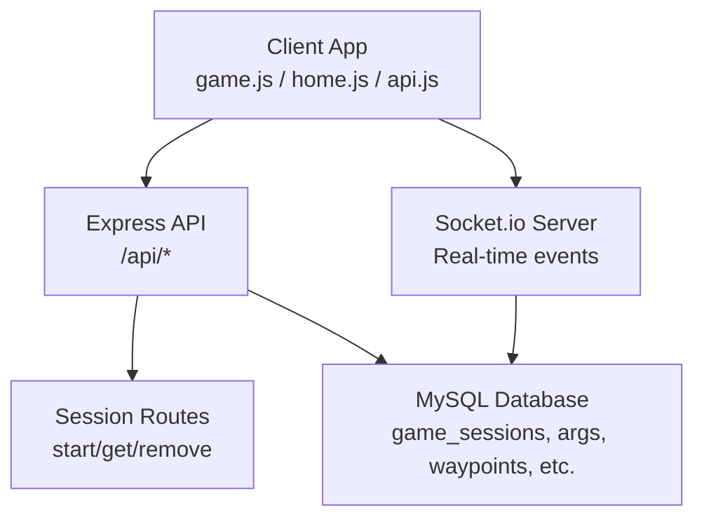
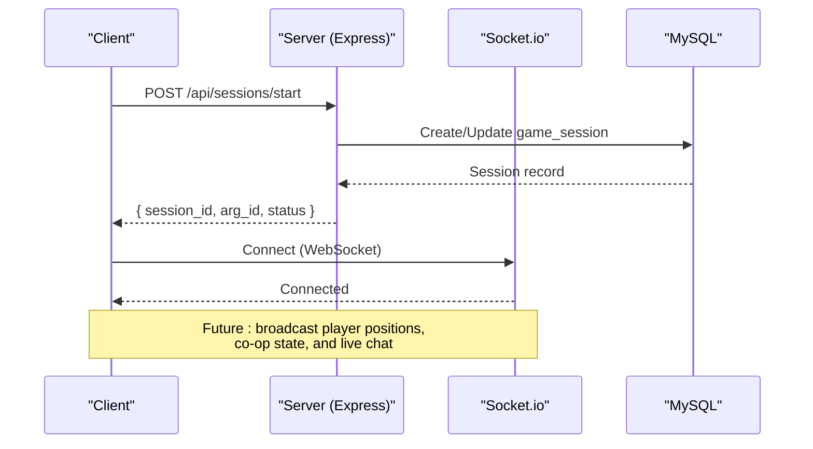
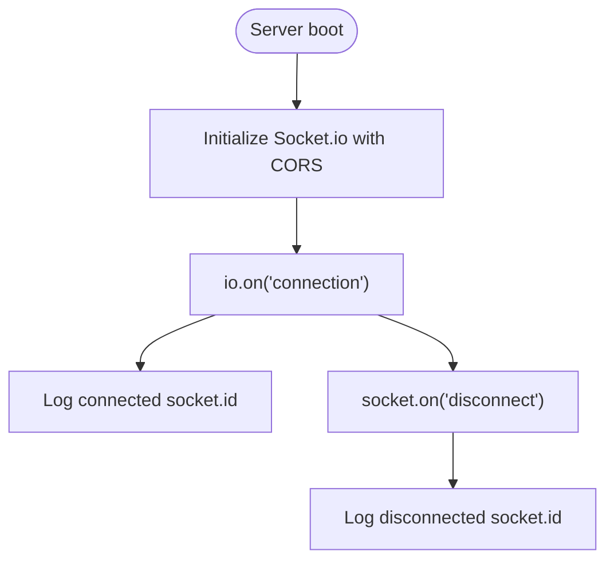
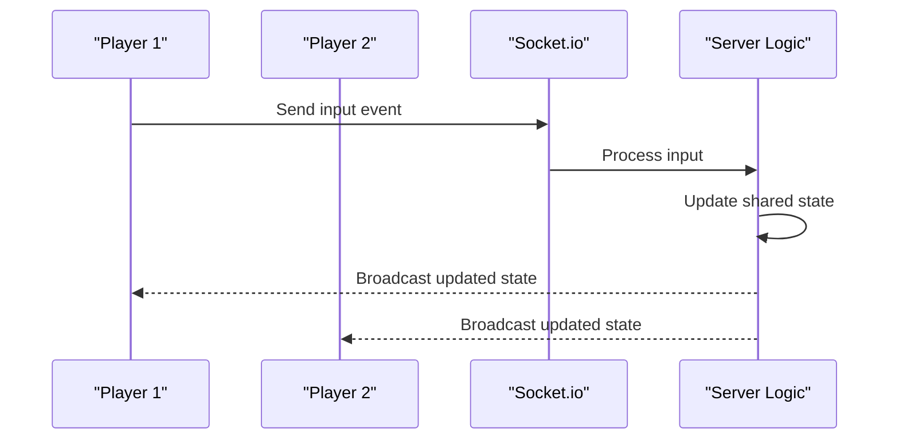
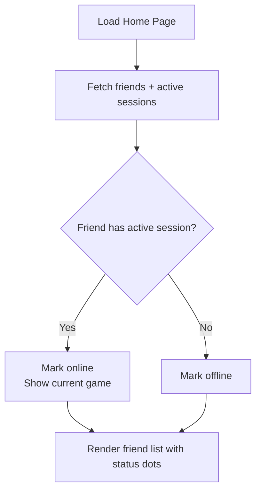
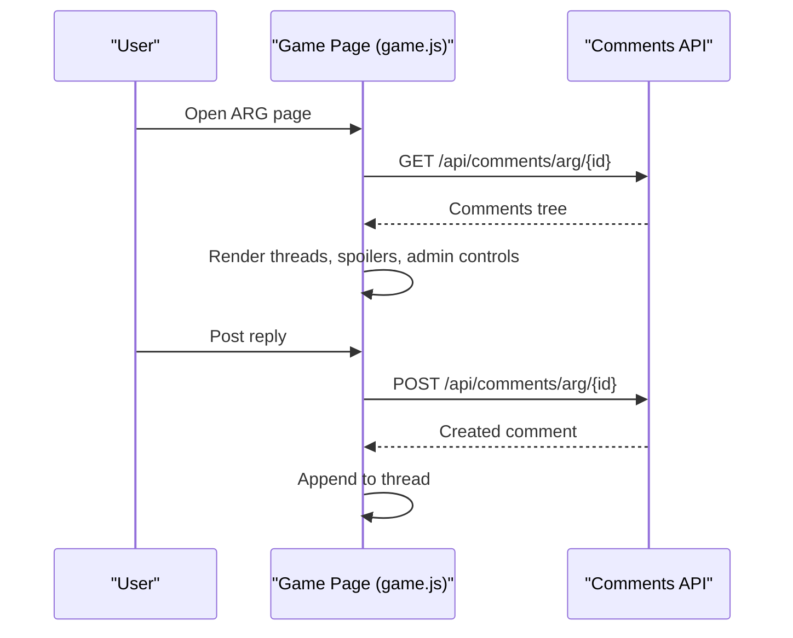
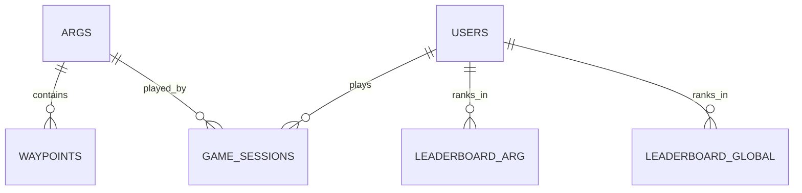
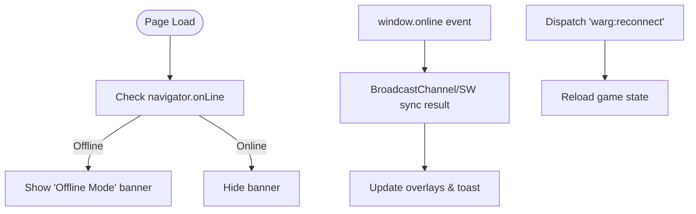
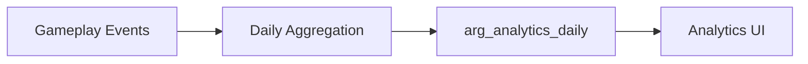
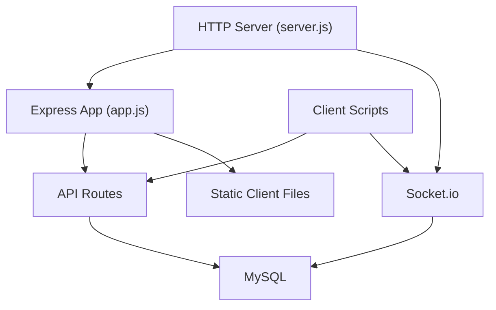

# Real-time Multiplayer Features

<cite>
**Referenced Files in This Document**
- [server.js](file://server/server.js)
- [app.js](file://server/src/app.js)
- [sessionRoutes.js](file://server/src/routes/sessionRoutes.js)
- [GameSession.js](file://server/src/models/GameSession.js)
- [schema.sql](file://database/schema.sql)
- [game.js](file://client/scripts/game.js)
- [home.js](file://client/scripts/home.js)
- [api.js](file://client/scripts/api.js)
- [implementation-details.md](file://warg-docs/docs/2-architecture-and-design/implementation-details.md)
</cite>

## Table of Contents
1. [Introduction](#introduction)
2. [Project Structure](#project-structure)
3. [Core Components](#core-components)
4. [Architecture Overview](#architecture-overview)
5. [Detailed Component Analysis](#detailed-component-analysis)
6. [Dependency Analysis](#dependency-analysis)
7. [Performance Considerations](#performance-considerations)
8. [Troubleshooting Guide](#troubleshooting-guide)
9. [Conclusion](#conclusion)

## Introduction
This document explains the real-time multiplayer features in the WARG Platform, focusing on:
- WebSocket connection management and Socket.io setup
- Real-time player synchronization and collaborative gameplay mechanics
- Friend system integration, online status tracking, and multiplayer invitation workflows
- Chat and comment system for live interaction during gameplay
- Co-op game modes, shared progress tracking, and competitive leaderboards
- Connection reliability, reconnection strategies, and offline fallback mechanisms
- Analytics integration for multiplayer engagement and performance metrics

The platform currently provides a foundation for live/co-op play via Socket.io, with robust REST APIs for sessions, friends, comments, and leaderboard data. Real-time state broadcasting is designed around geofenced locations and tick-based updates as documented in the architecture guide.

## Project Structure
At a high level:
- The server exposes an Express application and a Socket.io server for live features.
- Game sessions and presence are persisted to MySQL and exposed through REST endpoints.
- The client manages game state, offline sync, and UI interactions, including friend lists and comments.

**Diagram sources**
- [server.js:1-72](file://server/server.js#L1-L72)
- [app.js:1-132](file://server/src/app.js#L1-L132)
- [sessionRoutes.js:1-9](file://server/src/routes/sessionRoutes.js#L1-L9)
- [schema.sql:287-304](file://database/schema.sql#L287-L304)

**Section sources**
- [server.js:1-72](file://server/server.js#L1-L72)
- [app.js:1-132](file://server/src/app.js#L1-L132)
- [sessionRoutes.js:1-9](file://server/src/routes/sessionRoutes.js#L1-L9)
- [schema.sql:287-304](file://database/schema.sql#L287-L304)

## Core Components
- Socket.io server: Initializes CORS-aware connections and logs connect/disconnect events. It is intended for live/co-op game modes.
- Express app: Configures CORS, sessions (with MySQL-backed store), Passport, and mounts API routes.
- Session routes: Provide endpoints to start, get active sessions, and remove recent sessions.
- Game session model and schema: Persist per-user ARG attempts, status, timestamps, points, and distance walked.
- Client game page: Manages connection banners, offline sync, geolocation, minigame flows, and comments.
- Home page: Implements friend search, friend requests, pending requests, and online presence derived from active sessions.
- API helpers: Encapsulate calls for active sessions, friends, friend requests, and user search.

**Section sources**
- [server.js:14-45](file://server/server.js#L14-L45)
- [app.js:26-117](file://server/src/app.js#L26-L117)
- [sessionRoutes.js:1-9](file://server/src/routes/sessionRoutes.js#L1-L9)
- [GameSession.js:1-19](file://server/src/models/GameSession.js#L1-L19)
- [schema.sql:287-304](file://database/schema.sql#L287-L304)
- [game.js:14-48](file://client/scripts/game.js#L14-L48)
- [home.js:385-450](file://client/scripts/home.js#L385-L450)
- [api.js:165-210](file://client/scripts/api.js#L165-L210)

## Architecture Overview
The multiplayer architecture combines REST-driven persistence with optional real-time channels:
- REST APIs manage sessions, progress, comments, and social features.
- Socket.io is available for live broadcasts (e.g., co-op or PvP).
- Presence is inferred from active game sessions; the client renders online/offline indicators accordingly.
- Offline-first UX ensures progress can be saved locally and synced when connectivity returns.

**Diagram sources**
- [sessionRoutes.js:1-9](file://server/src/routes/sessionRoutes.js#L1-L9)
- [server.js:38-45](file://server/server.js#L38-L45)
- [schema.sql:287-304](file://database/schema.sql#L287-L304)

## Detailed Component Analysis

### WebSocket Connection Management
- The server initializes a Socket.io server with CORS configured to allow origins from environment variables or local development.
- Basic connection and disconnect handlers log socket IDs.
- The design supports future room/channel logic for co-op rooms, live leaderboards, and presence broadcasting.

**Diagram sources**
- [server.js:14-45](file://server/server.js#L14-L45)

**Section sources**
- [server.js:14-45](file://server/server.js#L14-L45)

### Real-time Player Synchronization and Collaborative Gameplay
- The architecture documentation describes tick-based updates where player inputs are transmitted and processed, then a new game state is broadcast to players in a geofenced location using WebSockets.
- The current codebase provides the Socket.io foundation and REST endpoints for session/state; the broadcast layer can be extended to support co-op rooms and live leaderboards.

**Diagram sources**
- [implementation-details.md:207-209](file://warg-docs/docs/2-architecture-and-design/implementation-details.md#L207-L209)
- [server.js:14-45](file://server/server.js#L14-L45)

**Section sources**
- [implementation-details.md:207-209](file://warg-docs/docs/2-architecture-and-design/implementation-details.md#L207-L209)
- [server.js:14-45](file://server/server.js#L14-L45)

### Friend System Integration, Online Status Tracking, and Invitation Workflows
- Friends list and online presence are rendered on the home page by fetching friends and inferring online status from active game sessions.
- The client API provides functions to search users, send friend requests, retrieve pending requests, and respond to them.
- When a friend has an active session, the UI shows “Playing: <game title>” and marks them online.

**Diagram sources**
- [home.js:385-450](file://client/scripts/home.js#L385-L450)
- [api.js:165-210](file://client/scripts/api.js#L165-L210)

**Section sources**
- [home.js:385-450](file://client/scripts/home.js#L385-L450)
- [api.js:165-210](file://client/scripts/api.js#L165-L210)

### Chat and Comment System for Live Interaction
- The game page includes a threaded comment system that loads comments for an ARG, supports replies, spoiler toggling, and admin deletion.
- While not yet real-time via WebSockets, it provides a solid base for live collaboration and hints during gameplay.

**Diagram sources**
- [game.js:633-800](file://client/scripts/game.js#L633-L800)

**Section sources**
- [game.js:633-800](file://client/scripts/game.js#L633-L800)

### Co-op Game Modes, Shared Progress Tracking, and Competitive Leaderboards
- ARG mode supports solo, coop, pvp, and live modes at the database level.
- Leaderboard tables exist for per-ARG rankings and global all-time rankings.
- The client’s sample data references co-op games and live leaderboards, indicating intended multiplayer experiences.

**Diagram sources**
- [schema.sql:114-151](file://database/schema.sql#L114-L151)
- [schema.sql:287-304](file://database/schema.sql#L287-L304)
- [schema.sql:535-569](file://database/schema.sql#L535-L569)

**Section sources**
- [schema.sql:114-151](file://database/schema.sql#L114-L151)
- [schema.sql:287-304](file://database/schema.sql#L287-L304)
- [schema.sql:535-569](file://database/schema.sql#L535-L569)

### Connection Reliability, Reconnection Strategies, and Offline Fallback Mechanisms
- The game page displays a connection banner indicating offline/online states.
- On reconnect, it triggers a custom event to reload game state and reconcile progress.
- Service Worker messages and BroadcastChannel are used to coordinate offline analysis results and UI updates.

**Diagram sources**
- [game.js:14-48](file://client/scripts/game.js#L14-L48)
- [game.js:64-129](file://client/scripts/game.js#L64-L129)

**Section sources**
- [game.js:14-48](file://client/scripts/game.js#L14-L48)
- [game.js:64-129](file://client/scripts/game.js#L64-L129)

### Analytics Integration for Multiplayer Engagement and Performance Metrics
- The database includes daily analytics tables for ARG-level stats such as sessions started/completed, unique players, and engagement signals.
- The analytics UI presents performance overview cards and feedback statistics.

**Diagram sources**
- [schema.sql:576-594](file://database/schema.sql#L576-L594)
- [analytics.html:81-105](file://client/analytics.html#L81-L105)

**Section sources**
- [schema.sql:576-594](file://database/schema.sql#L576-L594)
- [analytics.html:81-105](file://client/analytics.html#L81-L105)

## Dependency Analysis
- The Express app configures CORS, sessions, Passport, and mounts API routes.
- Socket.io is initialized alongside the HTTP server and shares CORS configuration.
- Session routes depend on the database models and provide endpoints consumed by the client.
- The client depends on API helpers for friends, sessions, and comments.

**Diagram sources**
- [app.js:26-117](file://server/src/app.js#L26-L117)
- [server.js:1-72](file://server/server.js#L1-L72)
- [sessionRoutes.js:1-9](file://server/src/routes/sessionRoutes.js#L1-L9)

**Section sources**
- [app.js:26-117](file://server/src/app.js#L26-L117)
- [server.js:1-72](file://server/server.js#L1-L72)
- [sessionRoutes.js:1-9](file://server/src/routes/sessionRoutes.js#L1-L9)

## Performance Considerations
- Use efficient tick rates for live updates to balance responsiveness and bandwidth.
- Interpolate between ticks for smooth rendering while minimizing network overhead.
- Cache ARG metadata and unlocked minigame references to reduce repeated fetches.
- Leverage service worker caching for assets and API responses to improve offline resilience.
- Monitor sensor usage to avoid excessive battery drain during location tracking.

[No sources needed since this section provides general guidance]

## Troubleshooting Guide
- WebSocket connection failures: Verify CORS settings and allowed origins in both Express and Socket.io configurations.
- Session persistence issues: Ensure MySQL-backed session store is configured and reachable.
- Offline sync errors: Confirm BroadcastChannel and Service Worker messaging paths are functioning and that manual sync is triggered on reconnect.
- Friend presence not updating: Validate that active sessions are returned for users and that the home page refreshes after request acceptance/decline.

**Section sources**
- [server.js:14-45](file://server/server.js#L14-L45)
- [app.js:50-84](file://server/src/app.js#L50-L84)
- [game.js:14-48](file://client/scripts/game.js#L14-L48)
- [home.js:501-576](file://client/scripts/home.js#L501-L576)

## Conclusion
The WARG Platform provides a solid foundation for real-time multiplayer experiences:
- Socket.io is ready for live broadcasts and co-op rooms.
- REST APIs handle sessions, presence, friends, and comments.
- Offline-first UX ensures continuity and reliable syncing.
- Leaderboards and analytics tables support competitive and engagement insights.

Future enhancements should focus on implementing room-based broadcasting, live chat over WebSockets, and real-time presence updates to fully realize collaborative and competitive multiplayer gameplay.