# Frontend Application

<cite>
**Referenced Files in This Document**
- [index.html](file://client/index.html)
- [config.js](file://client/scripts/config.js)
- [api.js](file://client/scripts/api.js)
- [sw.js](file://client/sw.js)
- [home.js](file://client/scripts/home.js)
- [game.js](file://client/scripts/game.js)
- [admin.js](file://client/scripts/admin.js)
- [studio.js](file://client/scripts/studio.js)
- [user-profile.js](file://client/scripts/user-profile.js)
- [sensors.js](file://client/scripts/sensors.js)
- [GameCard.js](file://client/scripts/components/GameCard.js)
- [MapModal.js](file://client/scripts/components/MapModal.js)
- [PlayModal.js](file://client/scripts/components/PlayModal.js)
- [CameraCapture.js](file://client/scripts/components/CameraCapture.js)
- [tokens.css](file://client/styles/tokens.css)
- [home.css](file://client/styles/home.css)
- [game.css](file://client/styles/game.css)
</cite>

## Table of Contents
1. [Introduction](#introduction)
2. [Project Structure](#project-structure)
3. [Core Components](#core-components)
4. [Architecture Overview](#architecture-overview)
5. [Detailed Component Analysis](#detailed-component-analysis)
6. [Dependency Analysis](#dependency-analysis)
7. [Performance Considerations](#performance-considerations)
8. [Troubleshooting Guide](#troubleshooting-guide)
9. [Conclusion](#conclusion)

## Introduction
This document describes the WARG Platform’s static frontend: a multi-page, vanilla JavaScript application with modular components, a shared API client, and offline resilience via service workers. It covers the game interface, studio tools, admin panels, user profiles, Leaflet.js map integration, real-time sensor data collection, VJB Design System tokens, responsive CSS architecture, accessibility practices, and performance techniques for mobile-first gameplay.

## Project Structure
The frontend is organized as a set of HTML pages under client/, each paired with page-specific scripts and styles. Shared logic lives in scripts/ (API client, configuration, sensors, reusable components), and styles are layered using CSS cascade layers with design tokens.

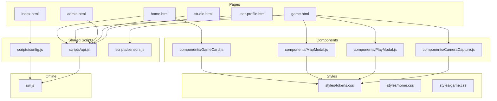

**Diagram sources**
- [index.html:1-17](file://client/index.html#L1-L17)
- [config.js:1-30](file://client/scripts/config.js#L1-L30)
- [api.js:1-401](file://client/scripts/api.js#L1-L401)
- [sw.js:1-235](file://client/sw.js#L1-L235)
- [home.js:1-755](file://client/scripts/home.js#L1-L755)
- [game.js:1-838](file://client/scripts/game.js#L1-L838)
- [admin.js:1-272](file://client/scripts/admin.js#L1-L272)
- [studio.js:1-86](file://client/scripts/studio.js#L1-L86)
- [user-profile.js:1-126](file://client/scripts/user-profile.js#L1-L126)
- [sensors.js:1-59](file://client/scripts/sensors.js#L1-L59)
- [GameCard.js:1-533](file://client/scripts/components/GameCard.js#L1-L533)
- [MapModal.js:1-1032](file://client/scripts/components/MapModal.js#L1-L1032)
- [PlayModal.js:1-163](file://client/scripts/components/PlayModal.js#L1-L163)
- [CameraCapture.js:1-112](file://client/scripts/components/CameraCapture.js#L1-L112)
- [tokens.css:1-116](file://client/styles/tokens.css#L1-L116)
- [home.css:1-800](file://client/styles/home.css#L1-L800)
- [game.css:1-808](file://client/styles/game.css#L1-L808)

**Section sources**
- [index.html:1-17](file://client/index.html#L1-L17)
- [config.js:1-30](file://client/scripts/config.js#L1-L30)

## Core Components
- GameCard: Reusable card factory for ARG listings with actions (like/dislike/flag/publish/unpublish), progress visualization, and keyboard accessibility.
- MapModal: Leaflet-based map modal supporting player view and editor mode; manages markers, edges, bubble mask, and fullscreen behavior.
- PlayModal: Modal container for waypoint briefs and minigame controls; supports dynamic control injection and feedback overlays.
- CameraCapture: Camera stream manager for CV minigames with reference overlay and snapshot capture.
- Sensors: Client-side anti-spoofing data collector (accelerometer steps and geolocation buffer).

Key responsibilities and interactions:
- Home page uses GameCard to render rows (recent, new, creators) and integrates friend search and requests.
- Game page orchestrates MapModal, PlayModal, CameraCapture, and Sensors to run waypoints and minigames.
- Admin and Studio pages use GameCard and API helpers for content management.
- User Profile page displays stats, badges, and library.

**Section sources**
- [GameCard.js:1-533](file://client/scripts/components/GameCard.js#L1-L533)
- [MapModal.js:1-1032](file://client/scripts/components/MapModal.js#L1-L1032)
- [PlayModal.js:1-163](file://client/scripts/components/PlayModal.js#L1-L163)
- [CameraCapture.js:1-112](file://client/scripts/components/CameraCapture.js#L1-L112)
- [sensors.js:1-59](file://client/scripts/sensors.js#L1-L59)
- [home.js:1-755](file://client/scripts/home.js#L1-L755)
- [game.js:1-838](file://client/scripts/game.js#L1-L838)
- [admin.js:1-272](file://client/scripts/admin.js#L1-L272)
- [studio.js:1-86](file://client/scripts/studio.js#L1-L86)
- [user-profile.js:1-126](file://client/scripts/user-profile.js#L1-L126)

## Architecture Overview
The frontend follows a multi-page SPA-like architecture without a framework:
- Entry point redirects to login and loads config/service worker registration.
- Page scripts initialize UI, fetch data via api.js, and render components.
- The API client normalizes backend responses into a consistent shape used by components.
- Offline resilience is provided by sw.js with network-first, stale-while-revalidate, and cache-first strategies, plus background sync for minigame attempts.

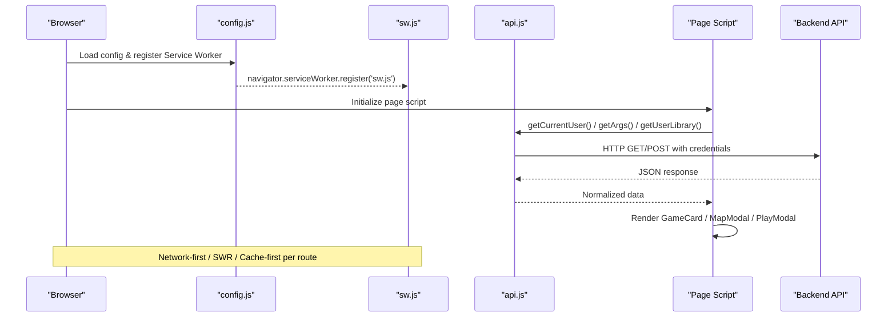

**Diagram sources**
- [config.js:1-30](file://client/scripts/config.js#L1-L30)
- [sw.js:1-235](file://client/sw.js#L1-L235)
- [api.js:1-401](file://client/scripts/api.js#L1-L401)
- [home.js:1-755](file://client/scripts/home.js#L1-L755)
- [game.js:1-838](file://client/scripts/game.js#L1-L838)

## Detailed Component Analysis

### Vanilla JavaScript Architecture and State Management
- Global configuration sets API base URL and registers the service worker.
- api.js provides typed helpers for all endpoints and normalizes Arg objects to a GameCard-compatible format.
- Page scripts manage local state (e.g., current user, active sessions, friends list) and update DOM imperatively.
- LocalStorage is used for optimistic votes and dismissed items; BroadcastChannel coordinates offline sync results across tabs.

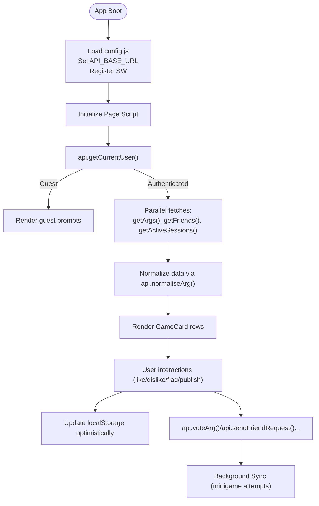

**Diagram sources**
- [config.js:1-30](file://client/scripts/config.js#L1-L30)
- [api.js:1-401](file://client/scripts/api.js#L1-L401)
- [home.js:1-755](file://client/scripts/home.js#L1-L755)
- [sw.js:150-235](file://client/sw.js#L150-L235)

**Section sources**
- [config.js:1-30](file://client/scripts/config.js#L1-L30)
- [api.js:1-401](file://client/scripts/api.js#L1-L401)
- [home.js:1-755](file://client/scripts/home.js#L1-L755)

### Game Interface (game.html)
- Loads game state, initializes MapModal with nodes and edges, and watches geolocation.
- Prefetches minigame references for offline availability.
- Handles voting, flagging, comments, and minigame flows (GPS proximity or CV camera tasks).
- Integrates sensors for anti-spoofing and updates map player location.

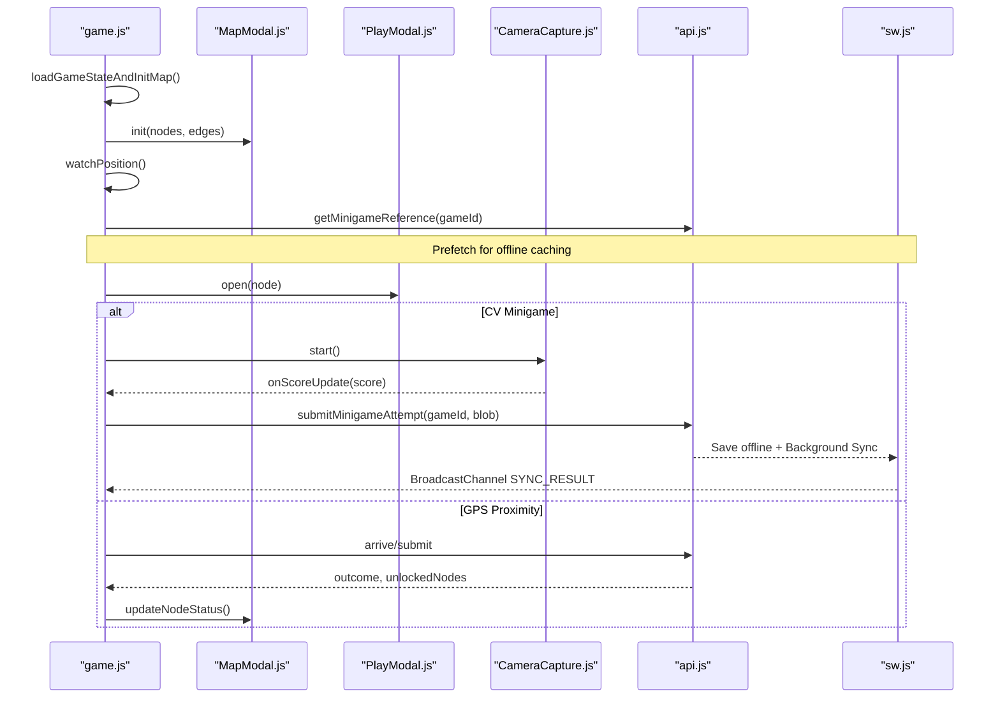

**Diagram sources**
- [game.js:1-838](file://client/scripts/game.js#L1-L838)
- [MapModal.js:1-1032](file://client/scripts/components/MapModal.js#L1-L1032)
- [PlayModal.js:1-163](file://client/scripts/components/PlayModal.js#L1-L163)
- [CameraCapture.js:1-112](file://client/scripts/components/CameraCapture.js#L1-L112)
- [api.js:211-310](file://client/scripts/api.js#L211-L310)
- [sw.js:150-235](file://client/sw.js#L150-L235)

**Section sources**
- [game.js:1-838](file://client/scripts/game.js#L1-L838)

### Studio Tools (studio.html)
- Fetches authenticated user’s library and splits into published/unpublished rows.
- Uses GameCard to render publish/unpublish actions and navigates to create_warg.html from hero card.

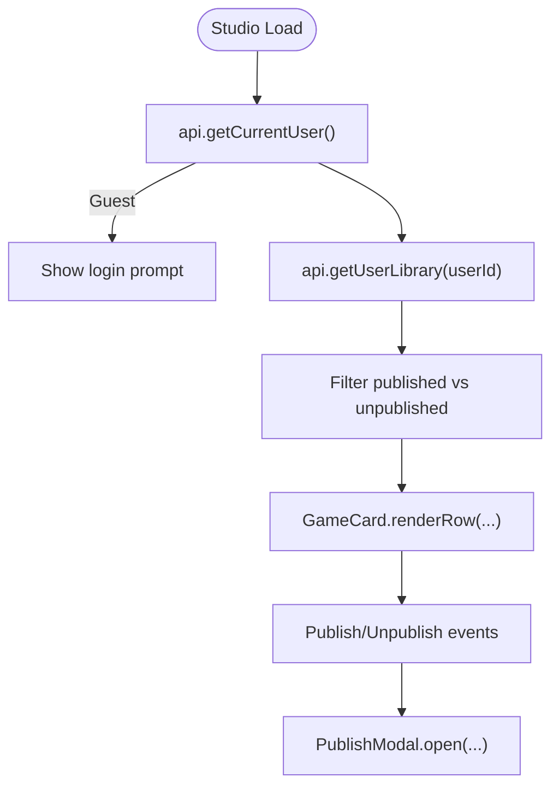

**Diagram sources**
- [studio.js:1-86](file://client/scripts/studio.js#L1-L86)
- [GameCard.js:1-533](file://client/scripts/components/GameCard.js#L1-L533)

**Section sources**
- [studio.js:1-86](file://client/scripts/studio.js#L1-L86)

### Admin Panels (admin.html)
- Displays recent flags and flagged games, allows resolving flags and deleting games.
- Provides user search with ban/unban toggles.

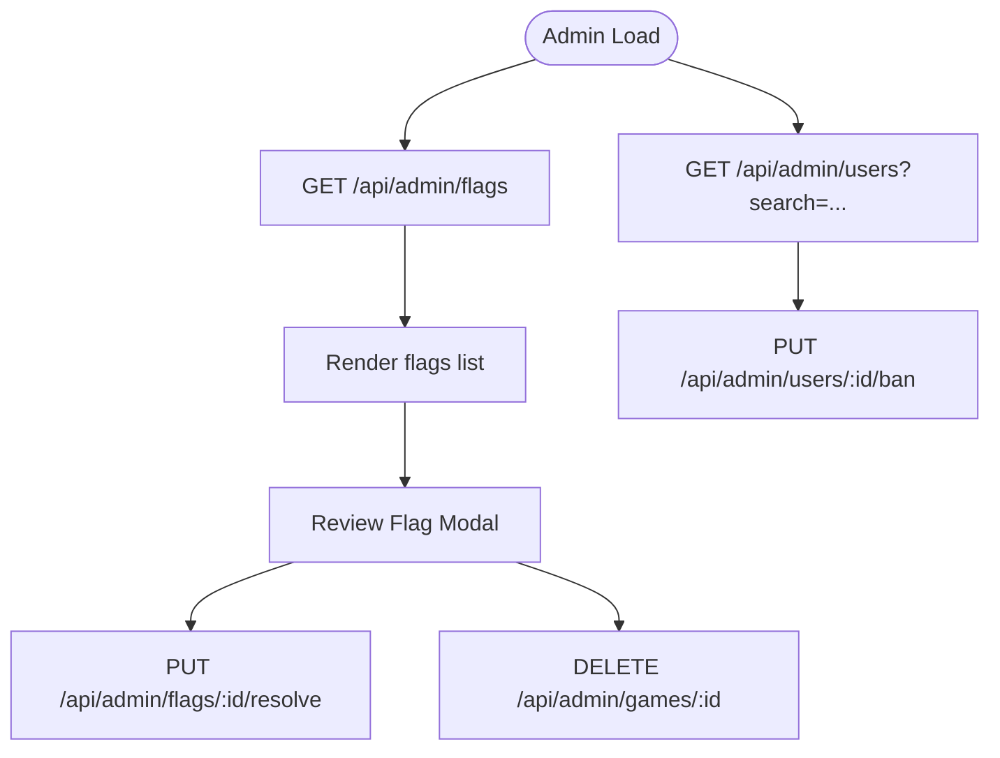

**Diagram sources**
- [admin.js:1-272](file://client/scripts/admin.js#L1-L272)

**Section sources**
- [admin.js:1-272](file://client/scripts/admin.js#L1-L272)

### User Profiles (user-profile.html)
- Populates profile avatar, role title, stats, badges, and library grid.
- Shows guest state with login prompt when not authenticated.

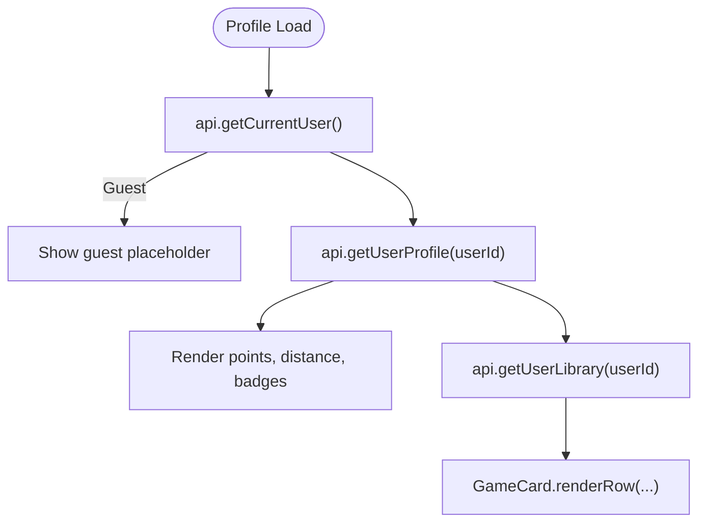

**Diagram sources**
- [user-profile.js:1-126](file://client/scripts/user-profile.js#L1-L126)

**Section sources**
- [user-profile.js:1-126](file://client/scripts/user-profile.js#L1-L126)

### Leaflet.js Map Integration
- MapModal dynamically injects Leaflet CSS/JS and renders OpenStreetMap tiles.
- Supports player mode (markers, popups, field log) and editor mode (draggable nodes, edge drawing, SVG overlays).
- Implements a circular bubble mask around the campus area and tracks player location with accuracy circle.

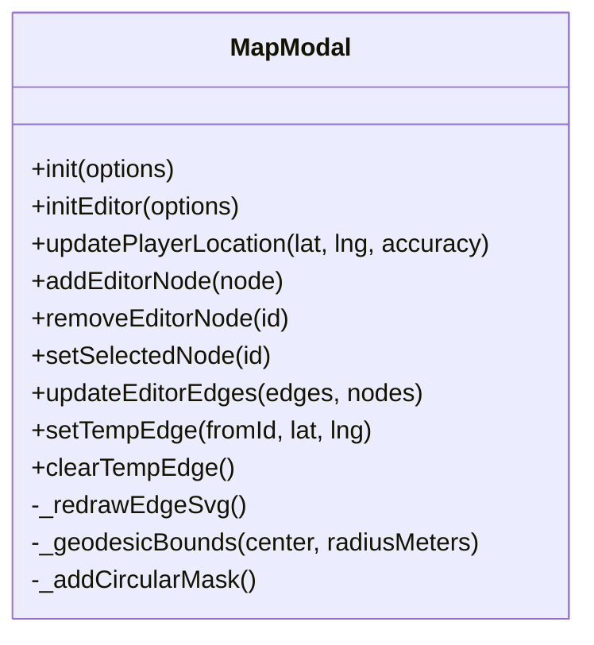

**Diagram sources**
- [MapModal.js:1-1032](file://client/scripts/components/MapModal.js#L1-L1032)

**Section sources**
- [MapModal.js:1-1032](file://client/scripts/components/MapModal.js#L1-L1032)

### Real-Time WebSocket Communication
- No WebSocket usage was found in the analyzed frontend files. Real-time updates rely on polling APIs and BroadcastChannel for cross-tab sync of offline results.

[No sources needed since this section does not analyze specific files]

### Offline Resilience with Service Workers
- sw.js defines install/activate lifecycle, caches static assets, and applies routing strategies:
  - Network-first for sensitive routes (/auth/me, /api/sessions, etc.)
  - Stale-while-revalidate for catalogue/minigames/library
  - Cache-first for static assets and map tiles
- Background Sync queues minigame attempts and retries them when online, notifying clients via BroadcastChannel.

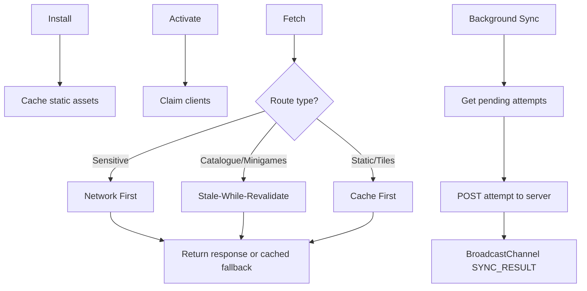

**Diagram sources**
- [sw.js:1-235](file://client/sw.js#L1-L235)

**Section sources**
- [sw.js:1-235](file://client/sw.js#L1-L235)

### VJB Design System Implementation
- tokens.css defines color palette, typography, spacing, radii, shadows, transitions, and layout variables.
- All pages and components consume these tokens for consistent dark theme and brand accents.

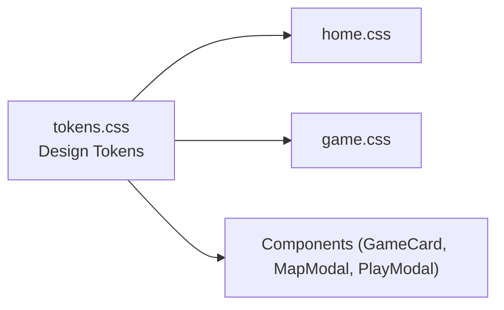

**Diagram sources**
- [tokens.css:1-116](file://client/styles/tokens.css#L1-L116)
- [home.css:1-800](file://client/styles/home.css#L1-L800)
- [game.css:1-808](file://client/styles/game.css#L1-L808)

**Section sources**
- [tokens.css:1-116](file://client/styles/tokens.css#L1-L116)

### Responsive CSS Architecture and Accessibility
- home.css implements a mobile-first app shell with collapsible sidebars and drawer overlays on small screens.
- Touch targets sized to 44px, focus-visible outlines, aria attributes on interactive elements, and semantic roles.
- game.css adapts modals to bottom sheets on mobile and ensures map visibility during modal open states.

**Section sources**
- [home.css:1-800](file://client/styles/home.css#L1-L800)
- [game.css:1-808](file://client/styles/game.css#L1-L808)

## Dependency Analysis
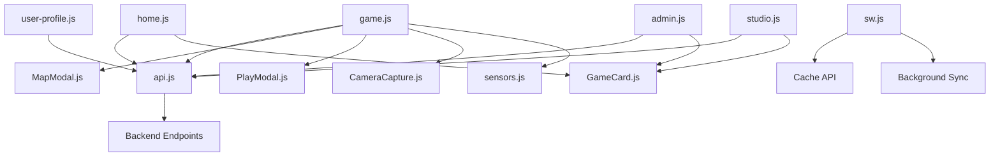

**Diagram sources**
- [api.js:1-401](file://client/scripts/api.js#L1-L401)
- [home.js:1-755](file://client/scripts/home.js#L1-L755)
- [game.js:1-838](file://client/scripts/game.js#L1-L838)
- [admin.js:1-272](file://client/scripts/admin.js#L1-L272)
- [studio.js:1-86](file://client/scripts/studio.js#L1-L86)
- [user-profile.js:1-126](file://client/scripts/user-profile.js#L1-L126)
- [MapModal.js:1-1032](file://client/scripts/components/MapModal.js#L1-L1032)
- [PlayModal.js:1-163](file://client/scripts/components/PlayModal.js#L1-L163)
- [CameraCapture.js:1-112](file://client/scripts/components/CameraCapture.js#L1-L112)
- [sensors.js:1-59](file://client/scripts/sensors.js#L1-L59)
- [GameCard.js:1-533](file://client/scripts/components/GameCard.js#L1-L533)
- [sw.js:1-235](file://client/sw.js#L1-L235)

**Section sources**
- [api.js:1-401](file://client/scripts/api.js#L1-L401)
- [sw.js:1-235](file://client/sw.js#L1-L235)

## Performance Considerations
- Lazy loading of Leaflet JS/CSS only when MapModal is initialized.
- Skeleton loaders for cards and lists to improve perceived performance.
- Optimistic UI updates for likes/dislikes persisted locally until server confirmation.
- Prefetching minigame references for offline play.
- Using BroadcastChannel to avoid re-fetching after offline sync.
- Debounced friend search input to reduce API calls.
- Efficient DOM rendering via DocumentFragment in GameCard.renderRow.

[No sources needed since this section provides general guidance]

## Troubleshooting Guide
- Camera permission denied: CameraCapture throws an error if getUserMedia fails; ensure HTTPS and grant camera permissions.
- Offline submission failures: Check Background Sync and BroadcastChannel messages; verify service worker registration and cache names.
- Vote counts mismatch: Clear local votes key or reconcile with server response; check localStorage integrity.
- Map not rendering: Ensure Leaflet loaded and container has dimensions; call invalidateSize after layout settles.
- Admin actions failing: Confirm credentials and role; verify endpoint paths and status codes.

**Section sources**
- [CameraCapture.js:37-53](file://client/scripts/components/CameraCapture.js#L37-L53)
- [sw.js:150-235](file://client/sw.js#L150-L235)
- [game.js:277-344](file://client/scripts/game.js#L277-L344)
- [MapModal.js:138-184](file://client/scripts/components/MapModal.js#L138-L184)
- [admin.js:118-169](file://client/scripts/admin.js#L118-L169)

## Conclusion
The WARG Platform frontend combines a simple, maintainable vanilla JavaScript architecture with robust componentization, a centralized API client, and comprehensive offline support. The VJB Design System ensures visual consistency, while responsive CSS and accessibility features deliver a polished mobile-first experience. Leaflet maps, sensor data, and background sync enable engaging geospatial gameplay even under connectivity constraints.