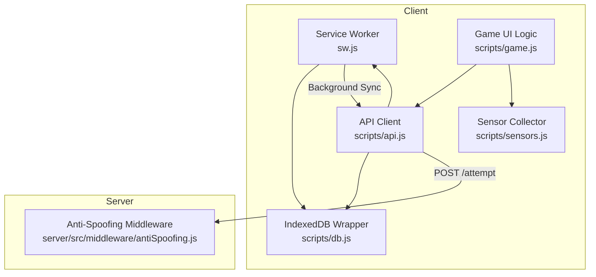
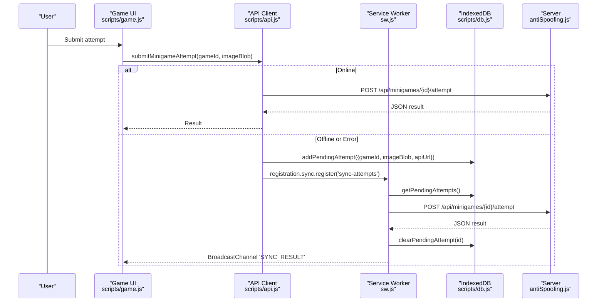
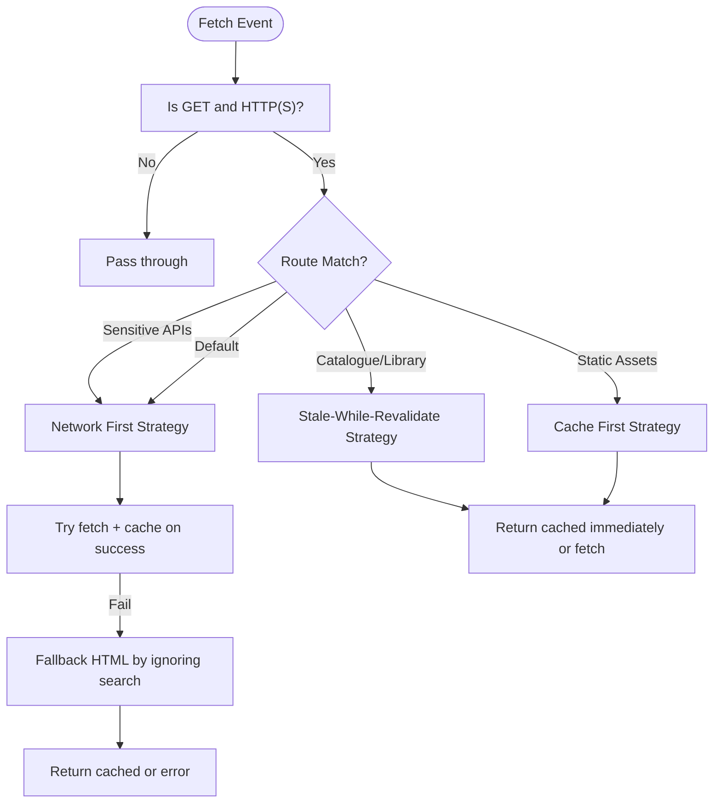
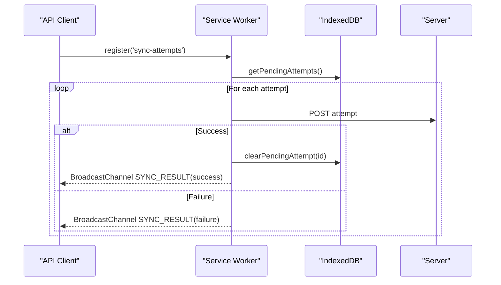
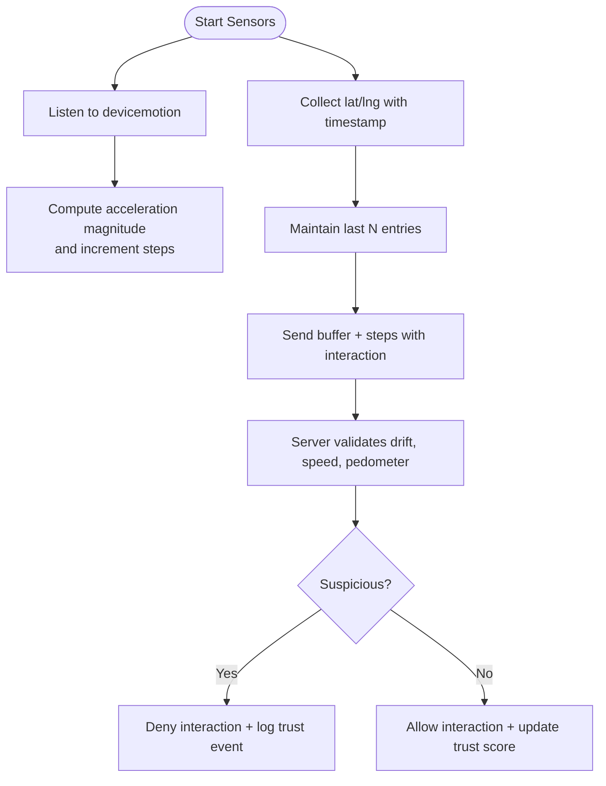
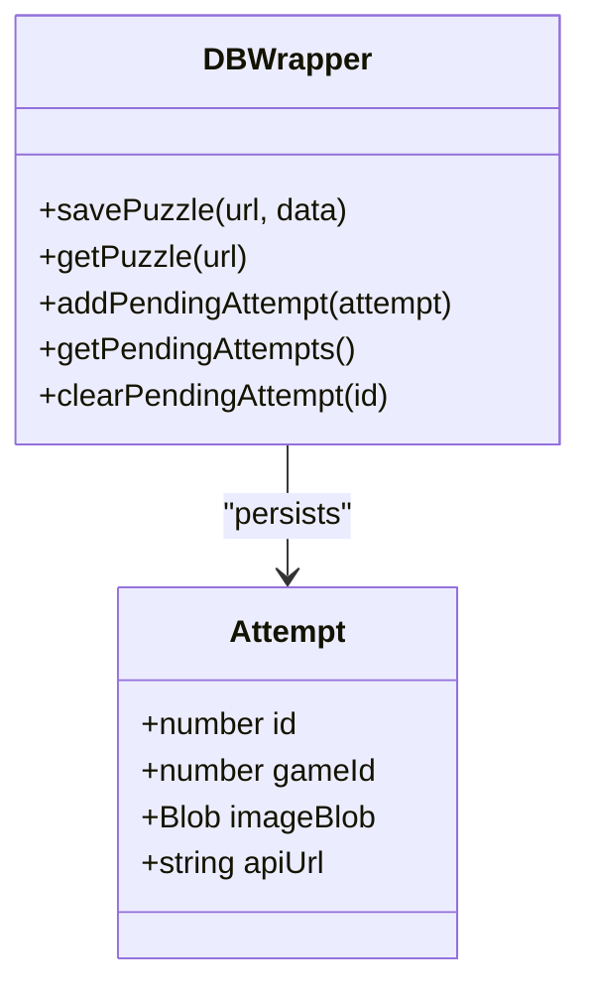
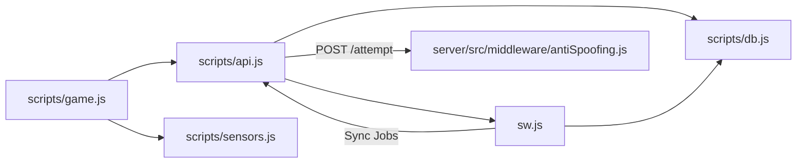

# Offline Capabilities & Service Workers

<cite>
**Referenced Files in This Document**
- [sw.js](file://client/sw.js)
- [db.js](file://client/scripts/db.js)
- [api.js](file://client/scripts/api.js)
- [sensors.js](file://client/scripts/sensors.js)
- [game.js](file://client/scripts/game.js)
- [offline.spec.js](file://client/tests/offline.spec.js)
- [caching.spec.js](file://client/tests/caching.spec.js)
- [antiSpoofing.js](file://server/src/middleware/antiSpoofing.js)
</cite>

## Table of Contents
1. [Introduction](#introduction)
2. [Project Structure](#project-structure)
3. [Core Components](#core-components)
4. [Architecture Overview](#architecture-overview)
5. [Detailed Component Analysis](#detailed-component-analysis)
6. [Dependency Analysis](#dependency-analysis)
7. [Performance Considerations](#performance-considerations)
8. [Troubleshooting Guide](#troubleshooting-guide)
9. [Conclusion](#conclusion)
10. [Appendices](#appendices)

## Introduction
This document explains the offline capabilities and service worker implementation in the WARG Platform. It covers:
- Service worker lifecycle, caching strategies for game assets and API responses
- Background sync mechanisms for queued actions
- Sensor data collection used for location spoofing detection
- Offline game state persistence using IndexedDB
- Progressive web app features (installability, background updates, notifications)
- Network request interception, cache invalidation policies, and fallback behaviors when connectivity is lost
- Examples of implementing offline-first patterns, testing service workers, and debugging offline scenarios

## Project Structure
The offline stack spans client-side scripts, a service worker, IndexedDB, and server-side anti-spoofing middleware. The key files are:
- Service worker: defines install/activate/fetch handlers, caching strategies, and background sync
- Client scripts: API client with offline-first submission, sensor collector, and IndexedDB wrapper
- Tests: Playwright tests validating offline behavior and caching strategies
- Server middleware: validates location telemetry to detect spoofing

**Diagram sources**
- [sw.js:1-235](file://client/sw.js#L1-L235)
- [api.js:255-344](file://client/scripts/api.js#L255-L344)
- [db.js:1-94](file://client/scripts/db.js#L1-L94)
- [sensors.js:1-59](file://client/scripts/sensors.js#L1-L59)
- [game.js:28-48](file://client/scripts/game.js#L28-L48)
- [antiSpoofing.js:1-168](file://server/src/middleware/antiSpoofing.js#L1-L168)

**Section sources**
- [sw.js:1-235](file://client/sw.js#L1-L235)
- [api.js:1-401](file://client/scripts/api.js#L1-L401)
- [db.js:1-94](file://client/scripts/db.js#L1-L94)
- [sensors.js:1-59](file://client/scripts/sensors.js#L1-L59)
- [game.js:28-48](file://client/scripts/game.js#L28-L48)
- [antiSpoofing.js:1-168](file://server/src/middleware/antiSpoofing.js#L1-L168)

## Core Components
- Service Worker (SW): Registers static assets on install, cleans old caches on activate, intercepts fetch requests, applies tiered caching strategies, and performs background sync for queued attempts.
- IndexedDB Wrapper: Provides lightweight persistence for puzzles and pending attempts; exposed globally to both window and service worker contexts.
- API Client: Implements offline-first submission for minigame attempts, manual cache busting helpers, and dynamic image caching for reference images.
- Sensor Collector: Captures accelerometer steps and buffers recent GPS coordinates for anti-spoofing analysis.
- Game UI Logic: Listens to online/offline events, triggers manual sync via service worker message, and displays toast notifications for sync results.
- Anti-Spoofing Middleware: Validates drift, speed, and pedometer signals to protect against location spoofing.

**Section sources**
- [sw.js:28-48](file://client/sw.js#L28-L48)
- [sw.js:50-148](file://client/sw.js#L50-L148)
- [sw.js:150-234](file://client/sw.js#L150-L234)
- [db.js:1-94](file://client/scripts/db.js#L1-L94)
- [api.js:224-344](file://client/scripts/api.js#L224-L344)
- [sensors.js:1-59](file://client/scripts/sensors.js#L1-L59)
- [game.js:28-48](file://client/scripts/game.js#L28-L48)
- [antiSpoofing.js:27-168](file://server/src/middleware/antiSpoofing.js#L27-L168)

## Architecture Overview
The platform implements an offline-first approach:
- Static assets and critical HTML/CSS/JS are precached during install.
- API responses are cached using strategy routing: network-first for sensitive routes, stale-while-revalidate for catalogues, and cache-first for static resources.
- When offline or when network errors occur, user actions (e.g., submitting a minigame attempt) are persisted locally and later synced via Background Sync.
- Sensor telemetry is collected client-side and validated server-side to detect spoofing.

**Diagram sources**
- [api.js:255-294](file://client/scripts/api.js#L255-L294)
- [sw.js:150-234](file://client/sw.js#L150-L234)
- [db.js:48-79](file://client/scripts/db.js#L48-L79)
- [antiSpoofing.js:27-168](file://server/src/middleware/antiSpoofing.js#L27-L168)

## Detailed Component Analysis

### Service Worker Lifecycle and Caching Strategies
- Install: Precaches a curated list of static assets under a versioned cache name.
- Activate: Deletes older caches and claims clients for immediate control.
- Fetch Interception:
  - Network-first for sensitive endpoints like sessions and user profile.
  - Stale-while-revalidate for catalogue and library endpoints to provide fast UI while updating in background.
  - Cache-first for local assets and third-party tiles/avatars.
  - Fallback logic for HTML pages with query parameters.
- Background Sync:
  - Handles tag-based sync jobs to retry queued attempts.
  - Uses BroadcastChannel to notify open windows about sync outcomes.
  - Shows notifications if no clients are present.

**Diagram sources**
- [sw.js:50-148](file://client/sw.js#L50-L148)

**Section sources**
- [sw.js:28-48](file://client/sw.js#L28-L48)
- [sw.js:50-148](file://client/sw.js#L50-L148)

### Background Sync Mechanism
- The API client registers a Background Sync job when saving an attempt offline.
- The service worker listens for sync events and processes pending attempts from IndexedDB.
- On success, it clears the attempt and notifies the UI via BroadcastChannel; otherwise, it reports failure and may show a notification.

**Diagram sources**
- [api.js:255-294](file://client/scripts/api.js#L255-L294)
- [sw.js:150-234](file://client/sw.js#L150-L234)
- [db.js:48-79](file://client/scripts/db.js#L48-L79)

**Section sources**
- [api.js:255-294](file://client/scripts/api.js#L255-L294)
- [sw.js:150-234](file://client/sw.js#L150-L234)
- [db.js:48-79](file://client/scripts/db.js#L48-L79)

### Sensor Data Collection for Location Spoofing Detection
- Client-side sensors:
  - Accelerometer step counting via DeviceMotionEvent.
  - Buffering recent GPS coordinates with timestamps.
- Server-side validation:
  - Drift anomaly detection based on coordinate variance.
  - Speed violation detection using distance/time between events.
  - Pedometer mismatch detection comparing steps vs. distance.

**Diagram sources**
- [sensors.js:1-59](file://client/scripts/sensors.js#L1-L59)
- [antiSpoofing.js:27-168](file://server/src/middleware/antiSpoofing.js#L27-L168)

**Section sources**
- [sensors.js:1-59](file://client/scripts/sensors.js#L1-L59)
- [antiSpoofing.js:27-168](file://server/src/middleware/antiSpoofing.js#L27-L168)

### Offline Game State Persistence
- Pending attempts are stored in IndexedDB with auto-increment IDs.
- The service worker reads and clears these records during sync.
- The API client exposes methods to add, retrieve, and clear pending attempts.

**Diagram sources**
- [db.js:1-94](file://client/scripts/db.js#L1-L94)

**Section sources**
- [db.js:1-94](file://client/scripts/db.js#L1-L94)

### Progressive Web App Features
- Installable and updatable via service worker.
- Background updates through cache versioning and activation cleanup.
- Notifications for sync outcomes when no clients are active.
- Manual sync trigger via service worker messages when Background Sync is unavailable.

**Section sources**
- [sw.js:28-48](file://client/sw.js#L28-L48)
- [sw.js:157-160](file://client/sw.js#L157-L160)
- [sw.js:197-226](file://client/sw.js#L197-L226)
- [game.js:28-48](file://client/scripts/game.js#L28-L48)

### Network Request Interception and Fallback Behaviors
- Sensitive endpoints use network-first to ensure fresh auth/session data, falling back to cached HTML if needed.
- Catalogue/library endpoints use stale-while-revalidate to prioritize UI responsiveness while refreshing data in background.
- Static assets and third-party resources use cache-first for instant loading.
- HTML page fallback ignores query parameters to serve cached index/home pages when offline.

**Section sources**
- [sw.js:50-148](file://client/sw.js#L50-L148)

### Cache Invalidation Policies
- Versioned cache name ensures new installs replace old caches.
- Activation deletes all caches except the current one.
- API client provides a helper to clear specific game-related routes from caches to bust stale content.

**Section sources**
- [sw.js:3-48](file://client/sw.js#L3-L48)
- [api.js:316-344](file://client/scripts/api.js#L316-L344)

## Dependency Analysis
The following diagram shows how components depend on each other to implement offline-first behavior and anti-spoofing.

**Diagram sources**
- [api.js:255-344](file://client/scripts/api.js#L255-L344)
- [sw.js:150-234](file://client/sw.js#L150-L234)
- [db.js:48-79](file://client/scripts/db.js#L48-L79)
- [game.js:28-48](file://client/scripts/game.js#L28-L48)
- [sensors.js:1-59](file://client/scripts/sensors.js#L1-L59)
- [antiSpoofing.js:27-168](file://server/src/middleware/antiSpoofing.js#L27-L168)

**Section sources**
- [api.js:255-344](file://client/scripts/api.js#L255-L344)
- [sw.js:150-234](file://client/sw.js#L150-L234)
- [db.js:48-79](file://client/scripts/db.js#L48-L79)
- [game.js:28-48](file://client/scripts/game.js#L28-L48)
- [sensors.js:1-59](file://client/scripts/sensors.js#L1-L59)
- [antiSpoofing.js:27-168](file://server/src/middleware/antiSpoofing.js#L27-L168)

## Performance Considerations
- Prefer stale-while-revalidate for read-heavy catalogue endpoints to reduce latency and improve perceived performance.
- Use cache-first for static assets and third-party tiles to minimize network usage.
- Keep the precache list minimal and versioned to avoid bloating storage.
- Avoid excessive polling; rely on Background Sync and BroadcastChannel for efficient updates.
- Debounce sensor events where appropriate to reduce overhead.

[No sources needed since this section provides general guidance]

## Troubleshooting Guide
Common issues and resolutions:
- Service worker not controlling pages:
  - Ensure activation calls claim clients and that the correct cache version is installed.
- Cached stale data persists:
  - Use the API client’s cache clearing helper to remove specific routes.
  - Verify cache names and route matching in the service worker.
- Background Sync not triggering:
  - Confirm SyncManager availability and that the registration call succeeds.
  - If unavailable, use manual sync via service worker messages.
- Offline attempts not syncing:
  - Check IndexedDB queue for pending attempts.
  - Validate server endpoint availability and credentials.
  - Inspect BroadcastChannel messages for sync results.

**Section sources**
- [sw.js:28-48](file://client/sw.js#L28-L48)
- [api.js:316-344](file://client/scripts/api.js#L316-L344)
- [sw.js:157-160](file://client/sw.js#L157-L160)
- [sw.js:163-234](file://client/sw.js#L163-L234)

## Conclusion
The WARG Platform implements robust offline capabilities through a well-structured service worker, strategic caching, IndexedDB persistence, and background sync. Sensor-driven anti-spoofing adds integrity checks to gameplay. Together, these components deliver a resilient, progressive web experience that remains functional and secure even under intermittent connectivity.

[No sources needed since this section summarizes without analyzing specific files]

## Appendices

### Testing Offline Scenarios
- Playwright test for offline queuing and sync:
  - Mocks user profile and waypoints, sets browser offline, saves an attempt to IndexedDB, goes online, simulates BroadcastChannel messages, and verifies toast notifications.
- Caching strategy tests:
  - Verifies cache busting for specific games, stale-while-revalidate behavior, and network-first fallback to cache.

**Section sources**
- [offline.spec.js:1-95](file://client/tests/offline.spec.js#L1-L95)
- [caching.spec.js:1-95](file://client/tests/caching.spec.js#L1-L95)

### Implementing Offline-First Patterns
- Detect navigator.onLine and fall back to IndexedDB when offline.
- Register Background Sync jobs for queued operations.
- Provide manual sync triggers for environments lacking SyncManager.
- Use BroadcastChannel to communicate sync outcomes to UI.

**Section sources**
- [api.js:255-294](file://client/scripts/api.js#L255-L294)
- [sw.js:157-160](file://client/sw.js#L157-L160)
- [sw.js:187-195](file://client/sw.js#L187-L195)

### Debugging Offline Scenarios
- Open DevTools Application tab to inspect IndexedDB stores and Service Worker caches.
- Use Network panel to simulate offline and observe fallback behavior.
- Monitor BroadcastChannel messages in Console for sync results.
- Validate server logs for anti-spoofing flags and trust score changes.

**Section sources**
- [sw.js:163-234](file://client/sw.js#L163-L234)
- [antiSpoofing.js:27-168](file://server/src/middleware/antiSpoofing.js#L27-L168)