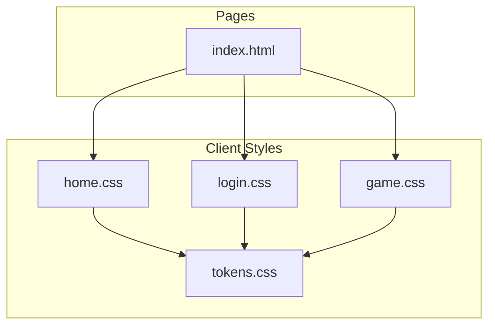
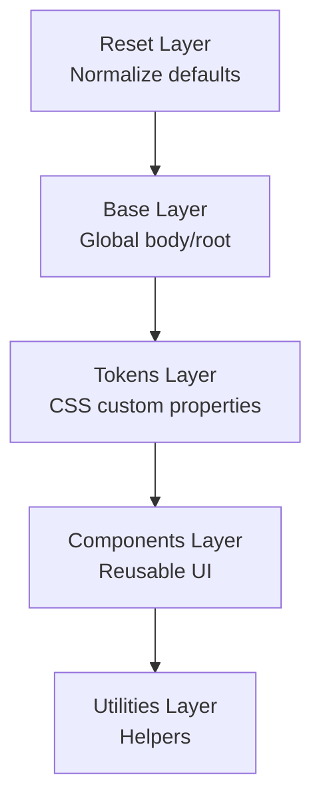
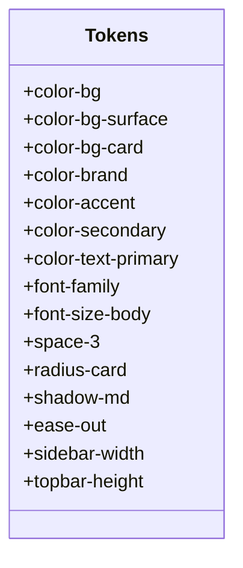
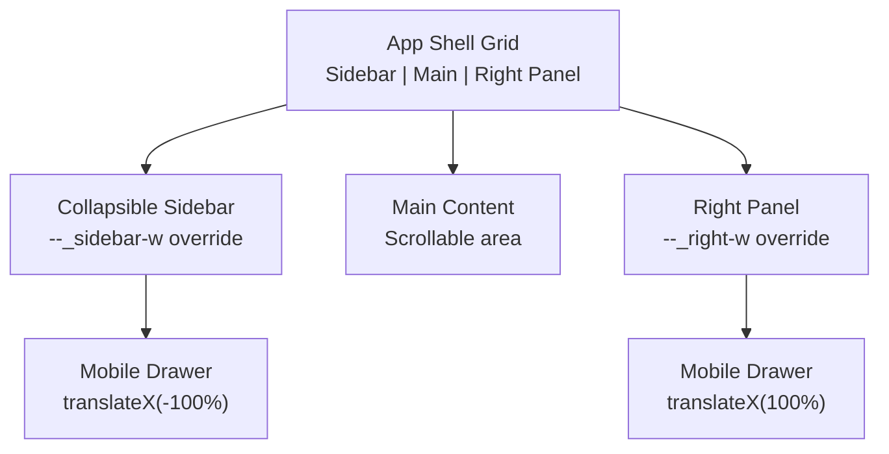
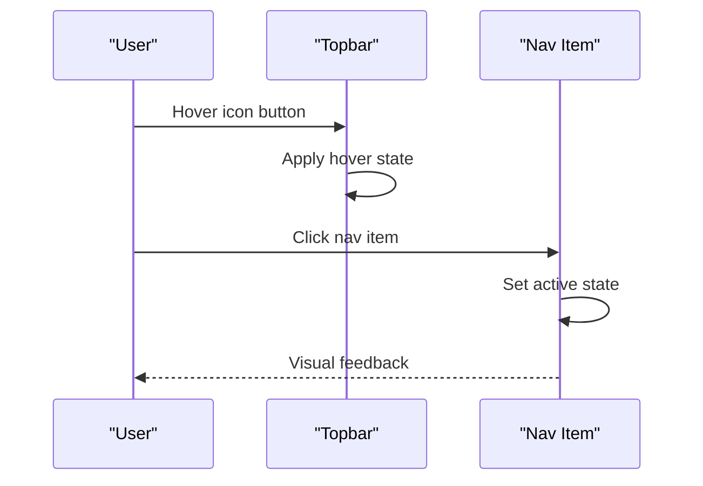
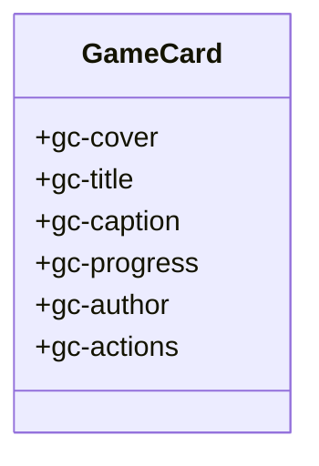
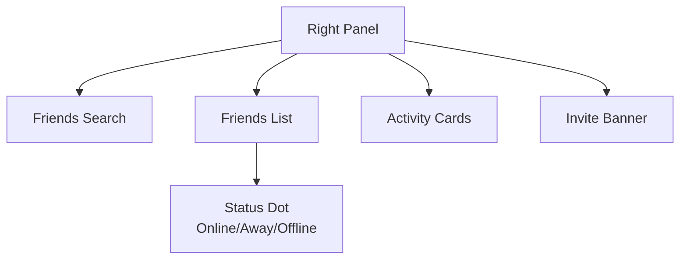
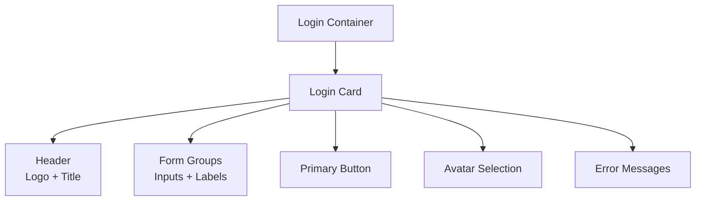
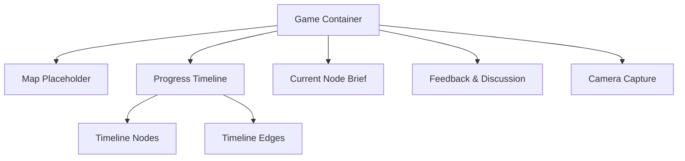
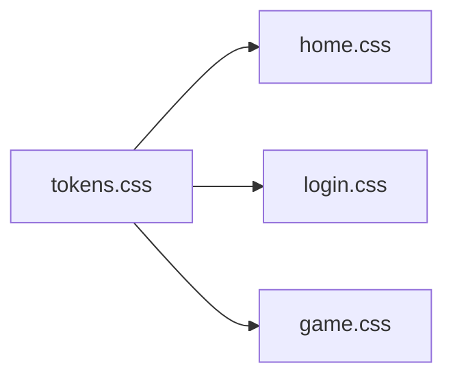

# Styling System & Design

<cite>
**Referenced Files in This Document**
- [tokens.css](file://client/styles/tokens.css)
- [home.css](file://client/styles/home.css)
- [login.css](file://client/styles/login.css)
- [game.css](file://client/styles/game.css)
- [index.html](file://client/index.html)
</cite>

## Table of Contents
1. [Introduction](#introduction)
2. [Project Structure](#project-structure)
3. [Core Components](#core-components)
4. [Architecture Overview](#architecture-overview)
5. [Detailed Component Analysis](#detailed-component-analysis)
6. [Dependency Analysis](#dependency-analysis)
7. [Performance Considerations](#performance-considerations)
8. [Troubleshooting Guide](#troubleshooting-guide)
9. [Conclusion](#conclusion)
10. [Appendices](#appendices)

## Introduction
This document explains the VJB Design System implementation and CSS architecture used throughout the WARG Platform frontend. It focuses on:
- The CSS custom properties (tokens) system for consistent theming
- Component-specific styling patterns
- Responsive design principles
- Color palette, typography, spacing, and component style guidelines
- Examples of creating new components following the design system
- Dark mode support and optimization strategies
- Asset management for images, icons, and static resources

The WARG Platform uses a layered CSS approach with cascade layers, a centralized token file, and page-level styles that compose shared tokens into reusable UI components.

## Project Structure
The frontend styling is organized under `client/styles/`. The most important files are:
- `tokens.css`: Centralized design tokens (colors, typography, spacing, radii, shadows, transitions, layout dimensions)
- `home.css`: App shell, topbar, sidebar, main content, game cards, right panel, utilities, responsive behavior, skeleton states, feedback modal, and toast
- `login.css`: Login and signup form styles using the same token system
- `game.css`: Game page view including map placeholder, progress timeline, modals, comments, camera capture, and mobile bottom sheet behavior
- `index.html`: Minimal redirect entry point; actual pages include their own HTML structure and link to these styles

**Diagram sources**
- [index.html:1-17](file://client/index.html#L1-L17)
- [tokens.css:1-116](file://client/styles/tokens.css#L1-L116)
- [home.css:1-1496](file://client/styles/home.css#L1-L1496)
- [login.css:1-342](file://client/styles/login.css#L1-L342)
- [game.css:1-808](file://client/styles/game.css#L1-L808)

**Section sources**
- [index.html:1-17](file://client/index.html#L1-L17)
- [tokens.css:1-116](file://client/styles/tokens.css#L1-L116)
- [home.css:1-1496](file://client/styles/home.css#L1-L1496)
- [login.css:1-342](file://client/styles/login.css#L1-L342)
- [game.css:1-808](file://client/styles/game.css#L1-L808)

## Core Components
The VJB Design System is built around a small set of core concepts:
- Tokens as single source of truth for colors, typography, spacing, radii, shadows, transitions, and layout sizes
- Cascade layers to control specificity and maintainability
- Page-level styles composing tokens into components
- Mobile-first responsive rules
- Consistent naming conventions for components and modifiers

Key responsibilities:
- `tokens.css` defines global tokens and base animations
- `home.css` implements the app shell and primary UI components
- `login.css` implements authentication flows
- `game.css` implements the active game view and related interactions

**Section sources**
- [tokens.css:1-116](file://client/styles/tokens.css#L1-L116)
- [home.css:1-1496](file://client/styles/home.css#L1-L1496)
- [login.css:1-342](file://client/styles/login.css#L1-L342)
- [game.css:1-808](file://client/styles/game.css#L1-L808)

## Architecture Overview
The styling architecture follows a layered model:
- Reset layer: Normalize browser defaults
- Base layer: Global body and root settings
- Tokens layer: Custom properties for theme and design primitives
- Components layer: Reusable UI elements
- Utilities layer: Small helper classes

**Diagram sources**
- [home.css:12-40](file://client/styles/home.css#L12-L40)
- [home.css:46-77](file://client/styles/home.css#L46-L77)
- [tokens.css:6-116](file://client/styles/tokens.css#L6-L116)

**Section sources**
- [home.css:12-40](file://client/styles/home.css#L12-L40)
- [home.css:46-77](file://client/styles/home.css#L46-L77)
- [tokens.css:6-116](file://client/styles/tokens.css#L6-L116)

## Detailed Component Analysis

### Token System
The token system centralizes all visual primitives:
- Colors: background, surface, card, overlay, brand, accent, secondary, text variants, borders, status colors
- Typography: font family, sizes, weights, line heights
- Spacing: 8pt grid scale
- Border radius: small, button, input, card, image, full
- Shadows: small, medium, large, glow
- Transitions: easing curves and durations
- Layout: sidebar widths, right panel width, topbar height, touch target size

**Diagram sources**
- [tokens.css:10-112](file://client/styles/tokens.css#L10-L112)

**Section sources**
- [tokens.css:10-112](file://client/styles/tokens.css#L10-L112)

### App Shell and Layout
The app shell uses CSS Grid to create a three-column layout:
- Left sidebar
- Main content
- Right panel

It also supports:
- Collapsible sidebar and right panel via CSS custom property overrides
- Sticky topbar
- Smooth transitions for column resizing
- Mobile drawers for sidebar and right panel

**Diagram sources**
- [home.css:46-77](file://client/styles/home.css#L46-L77)
- [home.css:1137-1233](file://client/styles/home.css#L1137-L1233)

**Section sources**
- [home.css:46-77](file://client/styles/home.css#L46-L77)
- [home.css:1137-1233](file://client/styles/home.css#L1137-L1233)

### Topbar and Navigation
Topbar includes:
- Brand logo and wordmark
- Search input with focus states
- Icon buttons with hover and active states
- Notification badge using data attributes

Navigation items use:
- Touch targets
- Active indicators
- Labels hidden when sidebar collapses

**Diagram sources**
- [home.css:105-268](file://client/styles/home.css#L105-L268)
- [home.css:313-416](file://client/styles/home.css#L313-L416)

**Section sources**
- [home.css:105-268](file://client/styles/home.css#L105-L268)
- [home.css:313-416](file://client/styles/home.css#L313-L416)

### Game Card Component
Game cards follow a consistent pattern:
- Cover with aspect ratio and gradient overlay
- Badge for game type
- Title and caption with line clamping
- Progress bar with gradient fill
- Author avatar and name
- Action buttons for like, dislike, flag, rating

**Diagram sources**
- [home.css:522-826](file://client/styles/home.css#L522-L826)

**Section sources**
- [home.css:522-826](file://client/styles/home.css#L522-L826)

### Right Panel and Friends List
The right panel displays:
- Friends search
- Friend list with avatars and status dots
- Activity summary cards
- Invite banner with call-to-action

**Diagram sources**
- [home.css:836-1100](file://client/styles/home.css#L836-L1100)

**Section sources**
- [home.css:836-1100](file://client/styles/home.css#L836-L1100)

### Login Form
Login styles implement:
- Centered card layout
- Form groups with labels and inputs
- Primary button with hover and disabled states
- Avatar selection grid
- Error messages and validation states
- Social login button

**Diagram sources**
- [login.css:32-150](file://client/styles/login.css#L32-L150)
- [login.css:152-269](file://client/styles/login.css#L152-L269)

**Section sources**
- [login.css:32-150](file://client/styles/login.css#L32-L150)
- [login.css:152-269](file://client/styles/login.css#L152-L269)

### Game Page View
The game page includes:
- Map placeholder with striped background
- Progress timeline with nodes and edges
- Popover for node details
- Current node brief with play action
- Feedback and discussion sections
- Camera capture UI
- Mobile bottom sheet for play modal

**Diagram sources**
- [game.css:6-24](file://client/styles/game.css#L6-L24)
- [game.css:68-137](file://client/styles/game.css#L68-L137)
- [game.css:196-287](file://client/styles/game.css#L196-L287)
- [game.css:673-750](file://client/styles/game.css#L673-L750)

**Section sources**
- [game.css:6-24](file://client/styles/game.css#L6-L24)
- [game.css:68-137](file://client/styles/game.css#L68-L137)
- [game.css:196-287](file://client/styles/game.css#L196-L287)
- [game.css:673-750](file://client/styles/game.css#L673-L750)

## Dependency Analysis
The styling dependencies are straightforward:
- All page styles depend on `tokens.css` for design primitives
- `home.css` composes tokens into app shell and components
- `login.css` composes tokens into authentication forms
- `game.css` composes tokens into game-specific views

**Diagram sources**
- [tokens.css:1-116](file://client/styles/tokens.css#L1-L116)
- [home.css:1-1496](file://client/styles/home.css#L1-L1496)
- [login.css:1-342](file://client/styles/login.css#L1-L342)
- [game.css:1-808](file://client/styles/game.css#L1-L808)

**Section sources**
- [tokens.css:1-116](file://client/styles/tokens.css#L1-L116)
- [home.css:1-1496](file://client/styles/home.css#L1-L1496)
- [login.css:1-342](file://client/styles/login.css#L1-L342)
- [game.css:1-808](file://client/styles/game.css#L1-L808)

## Performance Considerations
- Use CSS custom properties for theme values to minimize repaints and enable efficient updates
- Prefer logical properties (`inline-size`, `block-size`, `margin-inline`) for better internationalization and modern layout performance
- Use `aspect-ratio` for media elements to prevent layout shift during loading
- Avoid heavy animations; prefer transitions with short durations and easing curves defined in tokens
- Use `scrollbar-width` and vendor-prefixed scrollbars sparingly; rely on native scrollbar customization where supported
- Keep cascade layers minimal and well-organized to reduce specificity conflicts
- Use mobile-first media queries to avoid unnecessary overrides

[No sources needed since this section provides general guidance]

## Troubleshooting Guide
Common issues and resolutions:
- Theme not applying: Ensure `tokens.css` is loaded before page styles
- Incorrect colors: Verify token names match exactly; check for typos in custom property references
- Layout breaks on mobile: Check media query breakpoints and drawer states
- Modal not closing: Verify aria attributes and class toggles
- Scrollbar not themed: Confirm `scrollbar-color` and fallback pseudo-elements are present

**Section sources**
- [home.css:1137-1233](file://client/styles/home.css#L1137-L1233)
- [login.css:254-269](file://client/styles/login.css#L254-L269)
- [game.css:310-348](file://client/styles/game.css#L310-L348)

## Conclusion
The WARG Platform’s styling system is built on a robust token-based architecture with clear separation of concerns. The VJB Design System provides consistent theming through CSS custom properties, modular component styles, and responsive layouts. By following the established patterns, developers can extend the system with new components while maintaining visual consistency and performance.

[No sources needed since this section summarizes without analyzing specific files]

## Appendices

### Creating New Components
To create a new component following the design system:
1. Define any new tokens in `tokens.css` if needed
2. Create a new CSS file or add to an existing page stylesheet
3. Use cascade layers: reset, base, tokens, components, utilities
4. Reference tokens for colors, spacing, typography, and radii
5. Implement responsive behavior using media queries
6. Add accessibility features like focus states and aria attributes

**Section sources**
- [tokens.css:10-112](file://client/styles/tokens.css#L10-L112)
- [home.css:12-40](file://client/styles/home.css#L12-L40)

### Dark Mode Support
The platform currently sets dark mode at the root level:
- `color-scheme: dark` is applied to html and body
- Tokens define dark-themed colors by default
- For future light mode support, consider adding `light-dark()` functions and media queries for `prefers-color-scheme`

**Section sources**
- [home.css:15-19](file://client/styles/home.css#L15-L19)
- [login.css:6-9](file://client/styles/login.css#L6-L9)
- [tokens.css:11-43](file://client/styles/tokens.css#L11-L43)

### Asset Management
Static assets are stored in `client/assets/`:
- Images: e.g., `warg-logo.png`
- Icons: Inline SVGs within components or external icon libraries
- Fonts: Loaded from Google Fonts via CSS imports

Best practices:
- Optimize images for web (WebP format when possible)
- Use lazy loading for below-the-fold images
- Cache static assets appropriately
- Use CSS sprites or inline SVGs for small icons

**Section sources**
- [index.html:1-17](file://client/index.html#L1-L17)
- [tokens.css:8-8](file://client/styles/tokens.css#L8-L8)