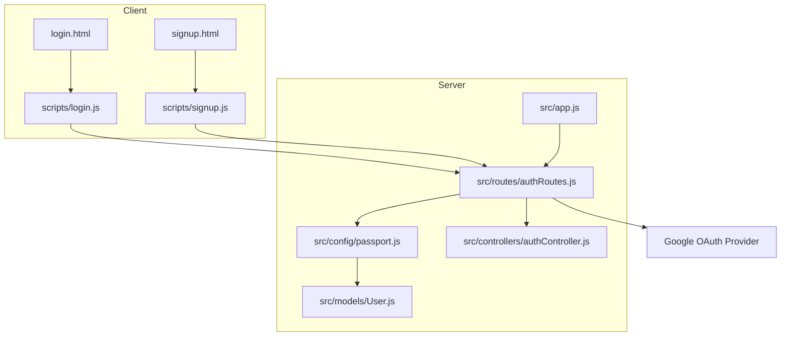
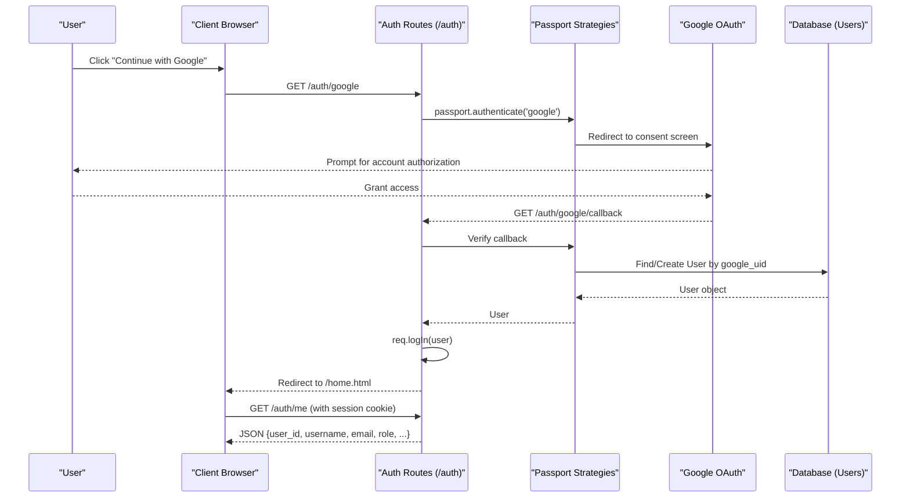
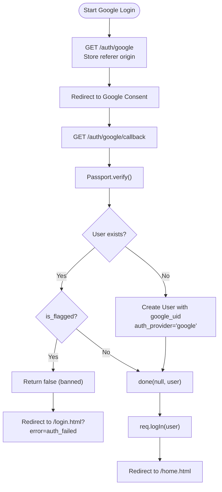
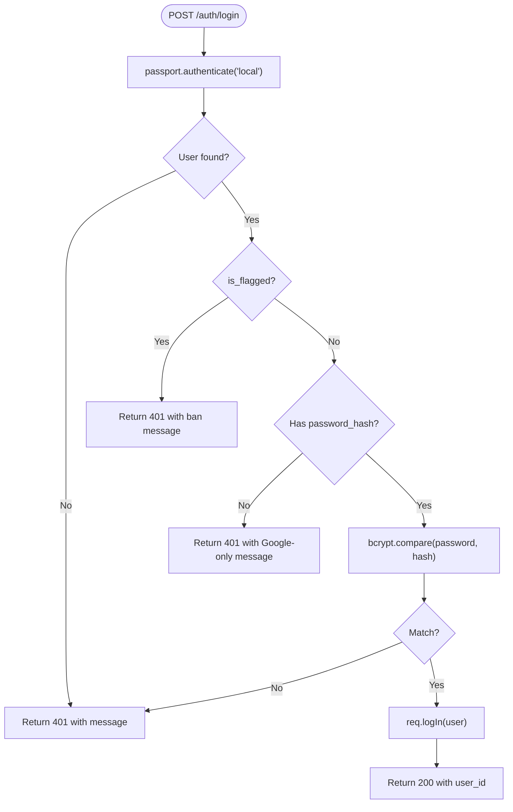
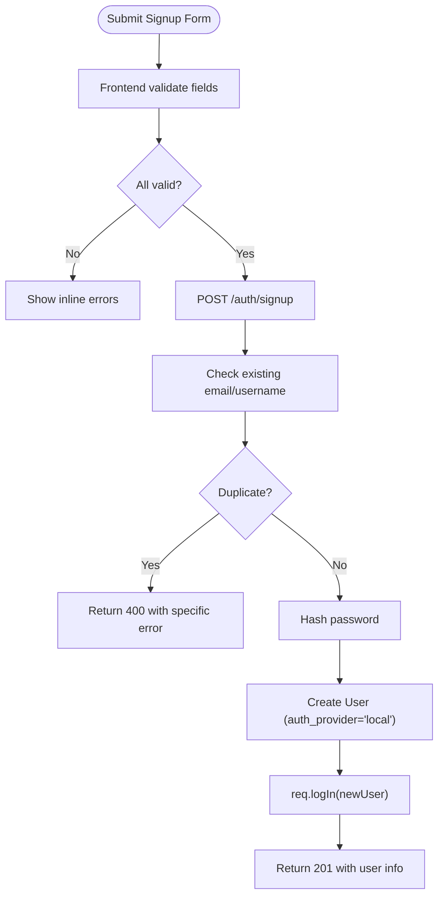
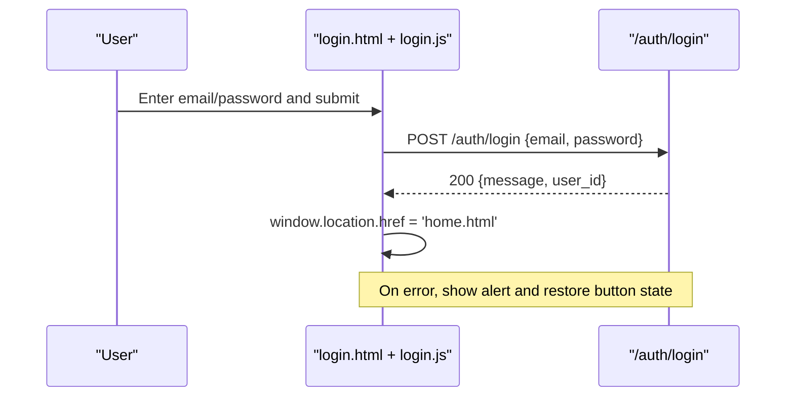
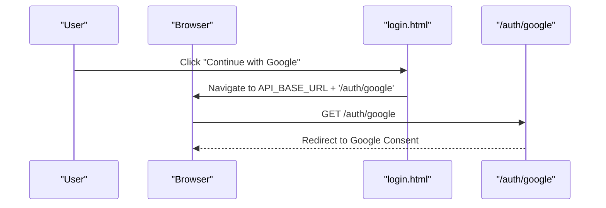
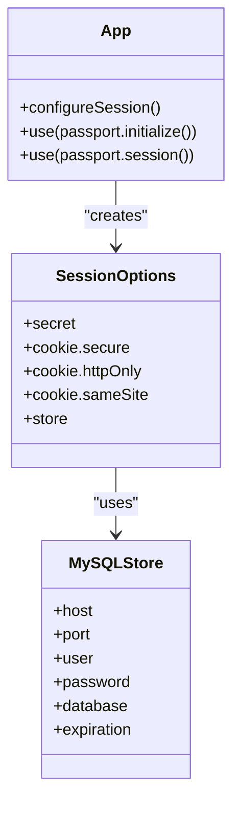
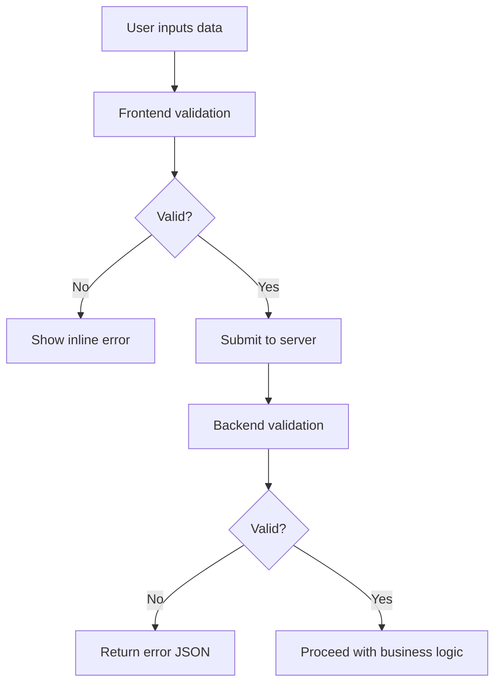
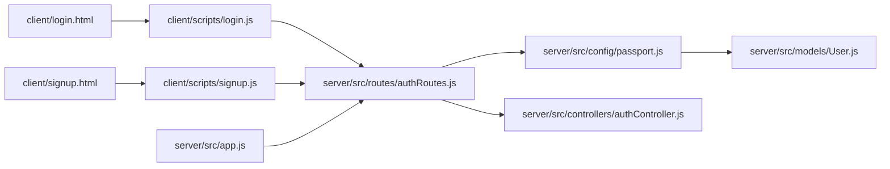

# Authentication Flow

<cite>
**Referenced Files in This Document**
- [app.js](file://server/src/app.js)
- [passport.js](file://server/src/config/passport.js)
- [authRoutes.js](file://server/src/routes/authRoutes.js)
- [authController.js](file://server/src/controllers/authController.js)
- [User.js](file://server/src/models/User.js)
- [login.html](file://client/login.html)
- [login.js](file://client/scripts/login.js)
- [signup.html](file://client/signup.html)
- [signup.js](file://client/scripts/signup.js)
- [auth.md](file://warg-docs/docs/6-api-reference/auth.md)
</cite>

## Table of Contents
1. [Introduction](#introduction)
2. [Project Structure](#project-structure)
3. [Core Components](#core-components)
4. [Architecture Overview](#architecture-overview)
5. [Detailed Component Analysis](#detailed-component-analysis)
6. [Dependency Analysis](#dependency-analysis)
7. [Performance Considerations](#performance-considerations)
8. [Troubleshooting Guide](#troubleshooting-guide)
9. [Conclusion](#conclusion)

## Introduction
This document explains the authentication flow in WARG Platform, covering:
- Google OAuth integration (redirect flow, token handling, and session creation)
- Local authentication fallback with email/password validation
- Form validation patterns and error handling strategies
- Security considerations
- Examples of login form submission, Google sign-in button usage, and account registration workflow
- Session management and how authentication state is maintained across pages

## Project Structure
The authentication system spans both client and server layers:
- Client-side HTML forms and JavaScript for user interactions
- Server-side Express routes, Passport strategies, controllers, and models
- Session configuration and middleware to maintain authenticated state

**Diagram sources**
- [app.js:96-107](file://server/src/app.js#L96-L107)
- [authRoutes.js:6-55](file://server/src/routes/authRoutes.js#L6-L55)
- [passport.js:24-64](file://server/src/config/passport.js#L24-L64)
- [authController.js:5-61](file://server/src/controllers/authController.js#L5-L61)
- [User.js:4-25](file://server/src/models/User.js#L4-L25)
- [login.html:41-52](file://client/login.html#L41-L52)
- [login.js:4-42](file://client/scripts/login.js#L4-L42)
- [signup.html:24-73](file://client/signup.html#L24-L73)
- [signup.js:59-132](file://client/scripts/signup.js#L59-L132)

**Section sources**
- [app.js:1-132](file://server/src/app.js#L1-L132)
- [authRoutes.js:1-124](file://server/src/routes/authRoutes.js#L1-L124)
- [passport.js:1-99](file://server/src/config/passport.js#L1-L99)
- [authController.js:1-83](file://server/src/controllers/authController.js#L1-L83)
- [User.js:1-28](file://server/src/models/User.js#L1-L28)
- [login.html:1-66](file://client/login.html#L1-L66)
- [login.js:1-44](file://client/scripts/login.js#L1-L44)
- [signup.html:1-81](file://client/signup.html#L1-L81)
- [signup.js:1-145](file://client/scripts/signup.js#L1-L145)

## Core Components
- Google OAuth Strategy: Registers Google OAuth2 strategy, maps provider profile to a local User record, and handles new/existing users.
- Local Strategy: Validates email/password using bcrypt and enforces provider constraints.
- Auth Routes: Expose endpoints for Google OAuth redirect/callback, local signup/login, logout, and current user info.
- Auth Controller: Implements signup logic, duplicate checks, password hashing, and helper endpoints.
- User Model: Defines database schema for users, including provider fields and flags.
- Session Configuration: Configures express-session with MySQL-backed store and secure cookie options.
- Client Forms: Provide UI for email/password login, Google sign-in, and registration with avatar selection/upload.

**Section sources**
- [passport.js:24-95](file://server/src/config/passport.js#L24-L95)
- [authRoutes.js:6-121](file://server/src/routes/authRoutes.js#L6-L121)
- [authController.js:5-82](file://server/src/controllers/authController.js#L5-L82)
- [User.js:4-25](file://server/src/models/User.js#L4-L25)
- [app.js:50-84](file://server/src/app.js#L50-L84)
- [login.html:24-57](file://client/login.html#L24-L57)
- [login.js:4-42](file://client/scripts/login.js#L4-L42)
- [signup.html:24-73](file://client/signup.html#L24-L73)
- [signup.js:59-132](file://client/scripts/signup.js#L59-L132)

## Architecture Overview
The authentication architecture combines client-side UI flows with server-side Passport strategies and persistent sessions.

**Diagram sources**
- [authRoutes.js:6-55](file://server/src/routes/authRoutes.js#L6-L55)
- [authRoutes.js:97-121](file://server/src/routes/authRoutes.js#L97-L121)
- [passport.js:24-64](file://server/src/config/passport.js#L24-L64)
- [User.js:4-25](file://server/src/models/User.js#L4-L25)

## Detailed Component Analysis

### Google OAuth Integration
- Redirect Flow:
  - The client triggers a direct navigation to `/auth/google`.
  - The route stores the originating origin in the session for post-auth redirection.
  - Passport authenticates via Google, requesting profile and email scopes.
- Callback Handling:
  - After Google redirects back to `/auth/google/callback`, Passport verifies the request.
  - If successful, the user is logged in and redirected to the home page.
  - Errors are mapped to query parameters on the login page for user feedback.
- Token Handling:
  - Access tokens are managed internally by Passport; they are not exposed to the client.
  - The server creates a session and persists it via a secure cookie.
- User Creation:
  - New users are created from Google profile data, with `auth_provider` set to 'google'.
  - Existing users are returned if found by `google_uid`; banned users are rejected.

**Diagram sources**
- [authRoutes.js:6-55](file://server/src/routes/authRoutes.js#L6-L55)
- [passport.js:24-64](file://server/src/config/passport.js#L24-L64)

**Section sources**
- [authRoutes.js:6-55](file://server/src/routes/authRoutes.js#L6-L55)
- [passport.js:24-64](file://server/src/config/passport.js#L24-L64)

### Local Authentication Fallback (Email/Password)
- Validation:
  - The LocalStrategy uses email and password fields.
  - It checks for user existence, bans, and whether the account has a password hash.
  - Passwords are compared using bcrypt.
- Route Handling:
  - On success, the user is logged in and a JSON response includes minimal user identity.
  - On failure, appropriate error messages are returned.

**Diagram sources**
- [passport.js:66-95](file://server/src/config/passport.js#L66-L95)
- [authRoutes.js:63-81](file://server/src/routes/authRoutes.js#L63-L81)

**Section sources**
- [passport.js:66-95](file://server/src/config/passport.js#L66-L95)
- [authRoutes.js:63-81](file://server/src/routes/authRoutes.js#L63-L81)

### Account Registration Workflow
- Frontend Validation:
  - Username length, email format, and password length are validated before submission.
  - Errors are displayed inline per field.
- Backend Processing:
  - Duplicate email or username checks are performed.
  - Password is hashed with bcrypt.
  - A new user is created with `auth_provider: 'local'`.
  - The user is automatically logged in after successful signup.

**Diagram sources**
- [signup.js:59-132](file://client/scripts/signup.js#L59-L132)
- [authController.js:5-61](file://server/src/controllers/authController.js#L5-L61)

**Section sources**
- [signup.js:59-132](file://client/scripts/signup.js#L59-L132)
- [authController.js:5-61](file://server/src/controllers/authController.js#L5-L61)

### Login Form Submission Process
- The login form submits email/password to `/auth/login`.
- On success, the browser navigates to the home page.
- On failure, an alert displays the error message.

**Diagram sources**
- [login.js:4-42](file://client/scripts/login.js#L4-L42)
- [authRoutes.js:63-81](file://server/src/routes/authRoutes.js#L63-L81)

**Section sources**
- [login.js:4-42](file://client/scripts/login.js#L4-L42)
- [authRoutes.js:63-81](file://server/src/routes/authRoutes.js#L63-L81)

### Google Sign-In Button Implementation
- The login page includes a Google button that navigates directly to `/auth/google`.
- The backend route initiates the Google OAuth flow and returns to the callback endpoint.

**Diagram sources**
- [login.html:41-52](file://client/login.html#L41-L52)
- [authRoutes.js:6-16](file://server/src/routes/authRoutes.js#L6-L16)

**Section sources**
- [login.html:41-52](file://client/login.html#L41-L52)
- [authRoutes.js:6-16](file://server/src/routes/authRoutes.js#L6-L16)

### Session Management and State Maintenance
- Session Storage:
  - In production/development, sessions are stored in MySQL using `express-mysql-session`.
  - In tests, an in-memory store is used.
- Cookie Configuration:
  - Secure, httpOnly cookies with SameSite policy based on environment.
  - Max age set to 24 hours.
- Passport Integration:
  - Serialize/deserialize user IDs into the session.
  - Middleware initializes Passport and enables session-based auth.

**Diagram sources**
- [app.js:50-84](file://server/src/app.js#L50-L84)
- [passport.js:7-22](file://server/src/config/passport.js#L7-L22)

**Section sources**
- [app.js:50-84](file://server/src/app.js#L50-L84)
- [passport.js:7-22](file://server/src/config/passport.js#L7-L22)

### Form Validation Patterns and Error Handling
- Frontend:
  - Inline validation for username length, email format, and password length.
  - Visual error indicators per field.
  - Disabled submit button during processing to prevent duplicates.
- Backend:
  - Duplicate checks for email and username.
  - Specific error messages for different failure cases.
  - Graceful error responses with HTTP status codes.

**Diagram sources**
- [signup.js:59-132](file://client/scripts/signup.js#L59-L132)
- [authController.js:5-61](file://server/src/controllers/authController.js#L5-L61)

**Section sources**
- [signup.js:59-132](file://client/scripts/signup.js#L59-L132)
- [authController.js:5-61](file://server/src/controllers/authController.js#L5-L61)

### Security Considerations
- Passwords:
  - Hashed with bcrypt before storage.
  - Not transmitted in plaintext beyond HTTPS.
- Sessions:
  - Secure, httpOnly cookies with environment-aware SameSite settings.
  - Persistent storage via MySQL to survive restarts.
- Provider Constraints:
  - Accounts created via Google do not require passwords; local login is blocked for such accounts.
  - Banned users are consistently denied access across strategies.
- CORS:
  - Allowed origins are configured via environment variables; local development allows localhost.

**Section sources**
- [authController.js:29-31](file://server/src/controllers/authController.js#L29-L31)
- [passport.js:76-88](file://server/src/config/passport.js#L76-L88)
- [app.js:29-44](file://server/src/app.js#L29-L44)
- [app.js:50-84](file://server/src/app.js#L50-L84)

## Dependency Analysis
Authentication components depend on each other as follows:

**Diagram sources**
- [login.html:62-63](file://client/login.html#L62-L63)
- [login.js:16-23](file://client/scripts/login.js#L16-L23)
- [signup.html:77-78](file://client/signup.html#L77-L78)
- [signup.js:94-106](file://client/scripts/signup.js#L94-L106)
- [authRoutes.js:1-4](file://server/src/routes/authRoutes.js#L1-L4)
- [passport.js:1-5](file://server/src/config/passport.js#L1-L5)
- [authController.js:1-3](file://server/src/controllers/authController.js#L1-L3)
- [User.js:1-2](file://server/src/models/User.js#L1-L2)
- [app.js:96-107](file://server/src/app.js#L96-L107)

**Section sources**
- [authRoutes.js:1-124](file://server/src/routes/authRoutes.js#L1-L124)
- [passport.js:1-99](file://server/src/config/passport.js#L1-L99)
- [authController.js:1-83](file://server/src/controllers/authController.js#L1-L83)
- [User.js:1-28](file://server/src/models/User.js#L1-L28)
- [app.js:96-107](file://server/src/app.js#L96-L107)

## Performance Considerations
- Database Pooling:
  - Sequelize connection pool is configured to manage concurrent queries efficiently.
- Session Store:
  - MySQL-backed session store avoids memory growth and supports persistence across restarts.
- Rate Limiting:
  - No explicit rate limiting is present; consider adding to protect against brute-force attempts on login/signup.
- Avatar Uploads:
  - Client-side preview uses Data URLs; ensure size limits are enforced to avoid large payloads.

[No sources needed since this section provides general guidance]

## Troubleshooting Guide
- Google OAuth disabled:
  - If `GOOGLE_CLIENT_ID` or `GOOGLE_CLIENT_SECRET` are missing, Google login is disabled; verify environment variables.
- Session issues:
  - Ensure `SESSION_SECRET` is set and `DATABASE_URL` points to a reachable MySQL instance.
  - Check CORS configuration if cross-origin requests fail.
- Login failures:
  - For Google-only accounts, local login will be rejected; instruct users to sign in with Google.
  - Banned users receive consistent error messages across strategies.
- Signup conflicts:
  - Duplicate email or username returns specific errors; update the form accordingly.

**Section sources**
- [passport.js:27-64](file://server/src/config/passport.js#L27-L64)
- [app.js:50-84](file://server/src/app.js#L50-L84)
- [authRoutes.js:63-81](file://server/src/routes/authRoutes.js#L63-L81)
- [authController.js:13-27](file://server/src/controllers/authController.js#L13-L27)

## Conclusion
WARG Platform’s authentication integrates Google OAuth and local email/password login through Passport strategies, with robust session management backed by MySQL. The client provides intuitive forms for login and registration, while the server enforces security best practices such as password hashing, secure cookies, and provider-specific constraints. Proper configuration of environment variables and CORS ensures reliable operation across environments.

[No sources needed since this section summarizes without analyzing specific files]