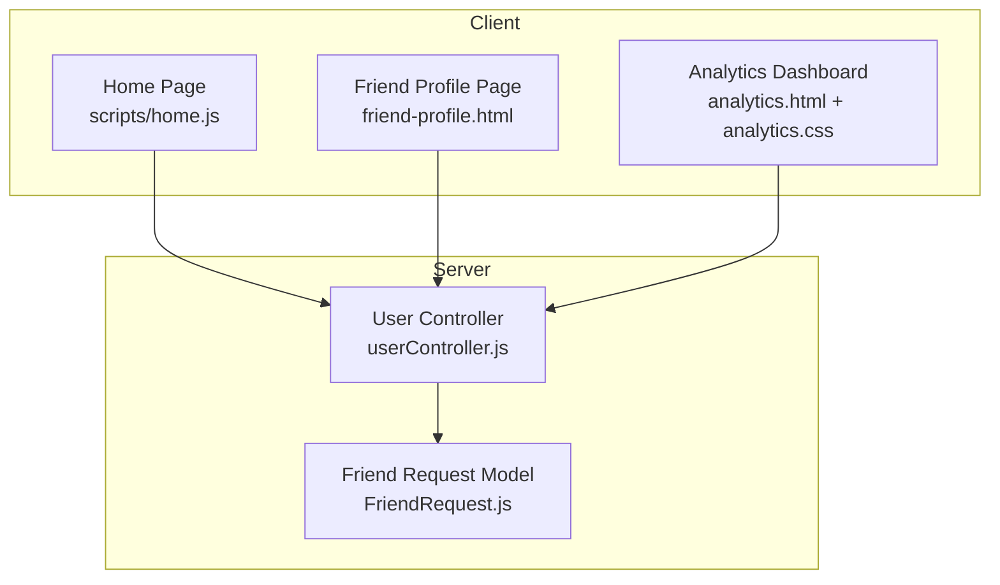
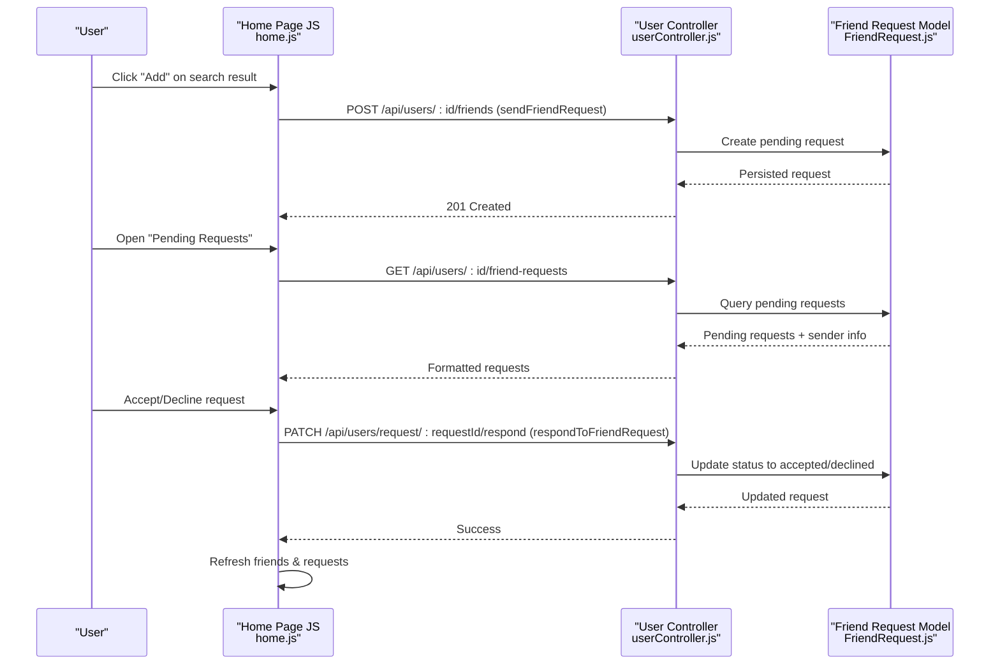
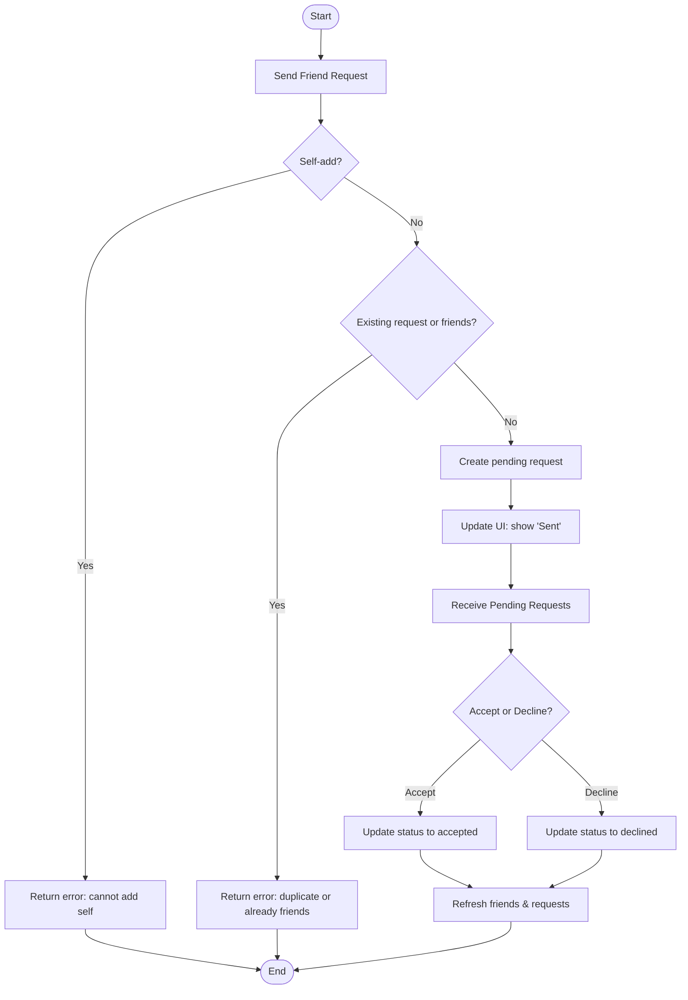
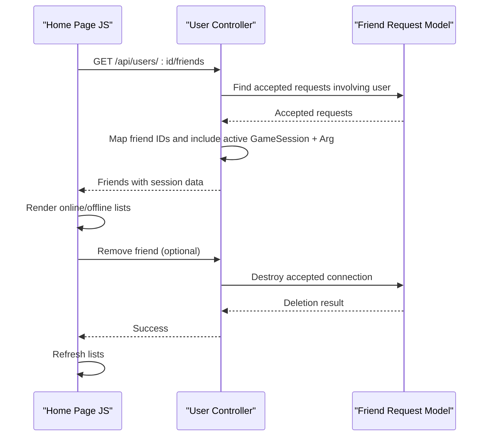
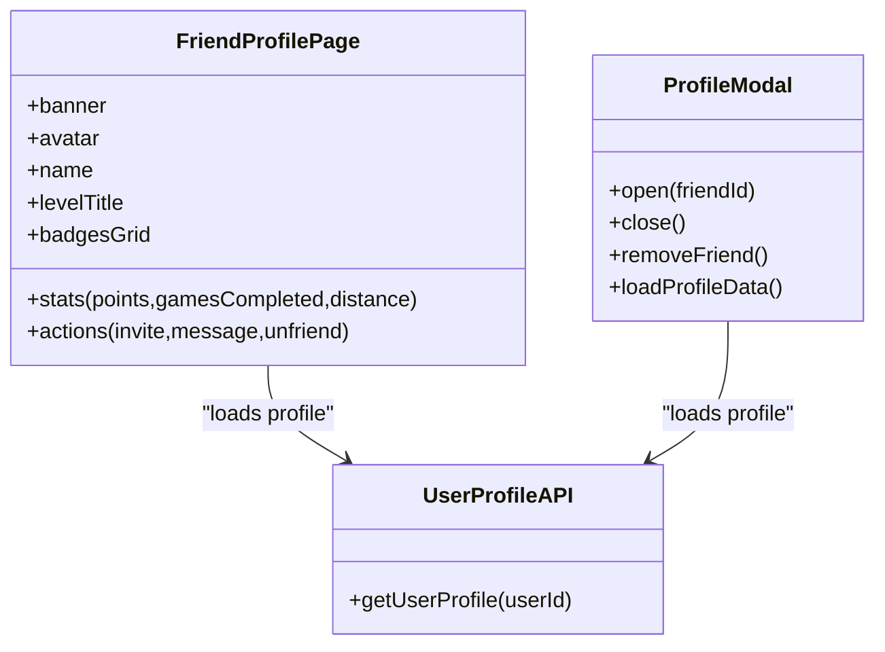
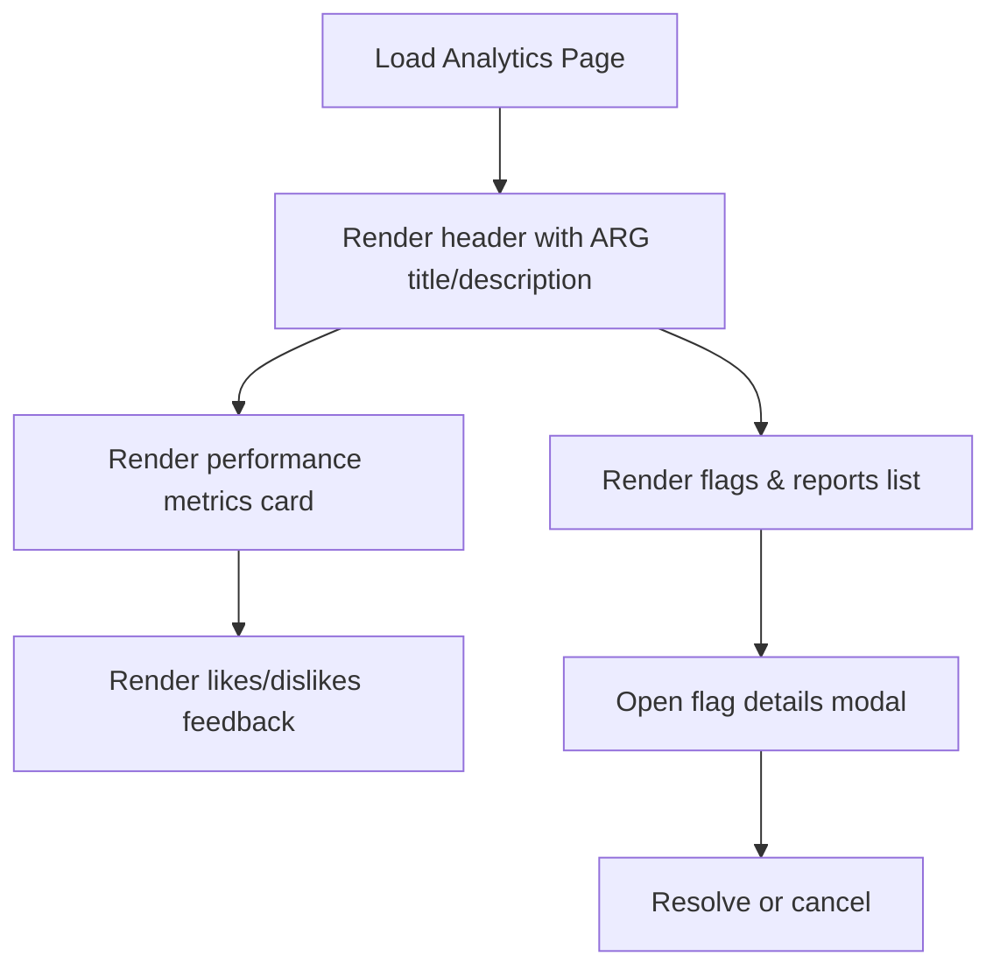
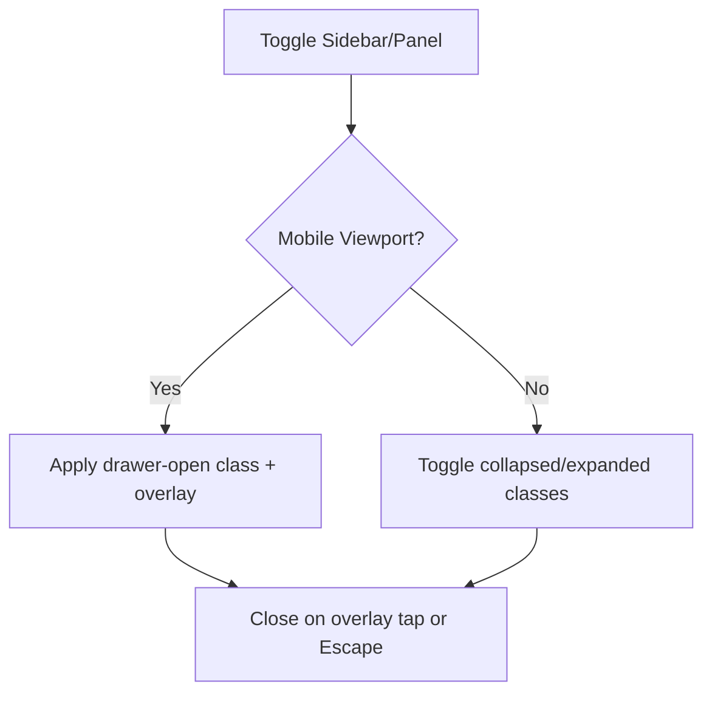
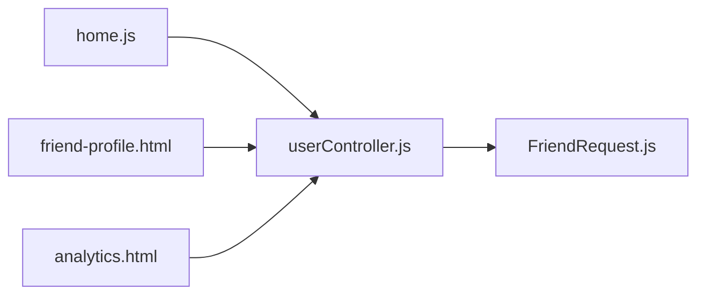

# Social Features UI

<cite>
**Referenced Files in This Document**
- [friend-profile.html](file://client/friend-profile.html)
- [home.js](file://client/scripts/home.js)
- [analytics.html](file://client/analytics.html)
- [analytics.css](file://client/styles/analytics.css)
- [userController.js](file://server/src/controllers/userController.js)
- [FriendRequest.js](file://server/src/models/FriendRequest.js)
</cite>

## Table of Contents
1. [Introduction](#introduction)
2. [Project Structure](#project-structure)
3. [Core Components](#core-components)
4. [Architecture Overview](#architecture-overview)
5. [Detailed Component Analysis](#detailed-component-analysis)
6. [Dependency Analysis](#dependency-analysis)
7. [Performance Considerations](#performance-considerations)
8. [Troubleshooting Guide](#troubleshooting-guide)
9. [Conclusion](#conclusion)

## Introduction
This document explains the social interaction interfaces in WARG Platform with a focus on:
- Friend request system (sending, receiving, acceptance/rejection)
- Friend profile viewing and privacy controls
- Social analytics dashboard for activity metrics and engagement statistics
- Friend list management, profile sharing, and social feed integration
- Responsive design patterns for mobile social interactions
- Real-time updates for friend status changes

The documentation maps user flows to concrete client pages and server endpoints, highlighting how data moves between UI components and backend services.

## Project Structure
The social features span both client and server code:
- Client-side HTML/CSS/JS provide the user-facing social experiences (friends, requests, profiles, analytics).
- Server-side controllers and models implement the core social logic (friend requests, friends retrieval, profile enrichment).

**Diagram sources**
- [home.js:200-352](file://client/scripts/home.js#L200-L352)
- [friend-profile.html:1-211](file://client/friend-profile.html#L1-L211)
- [analytics.html:1-195](file://client/analytics.html#L1-L195)
- [analytics.css:1-439](file://client/styles/analytics.css#L1-L439)
- [userController.js:1-226](file://server/src/controllers/userController.js#L1-L226)
- [FriendRequest.js:1-16](file://server/src/models/FriendRequest.js#L1-L16)

**Section sources**
- [home.js:200-352](file://client/scripts/home.js#L200-L352)
- [friend-profile.html:1-211](file://client/friend-profile.html#L1-L211)
- [analytics.html:1-195](file://client/analytics.html#L1-L195)
- [analytics.css:1-439](file://client/styles/analytics.css#L1-L439)
- [userController.js:1-226](file://server/src/controllers/userController.js#L1-L226)
- [FriendRequest.js:1-16](file://server/src/models/FriendRequest.js#L1-L16)

## Core Components
- Friend request lifecycle: send, receive, accept/decline.
- Friends list rendering with online/offline status derived from active game sessions.
- Friend profile modal and dedicated page for viewing stats, badges, and actions.
- Analytics dashboard for performance and engagement metrics.

Key responsibilities:
- Client scripts orchestrate API calls, render lists, handle user interactions, and manage modals/drawers.
- Server controller validates inputs, persists state, and returns enriched data.
- Model defines the friend request schema and states.

**Section sources**
- [home.js:385-576](file://client/scripts/home.js#L385-L576)
- [userController.js:39-134](file://server/src/controllers/userController.js#L39-L134)
- [FriendRequest.js:1-16](file://server/src/models/FriendRequest.js#L1-L16)

## Architecture Overview
The social feature architecture connects UI components to REST endpoints that query and update relational data.

**Diagram sources**
- [home.js:452-576](file://client/scripts/home.js#L452-L576)
- [userController.js:97-199](file://server/src/controllers/userController.js#L97-L199)
- [FriendRequest.js:1-16](file://server/src/models/FriendRequest.js#L1-L16)

## Detailed Component Analysis

### Friend Request System
The friend request system supports sending, receiving, and responding to requests.

- Sending a request:
  - The home page renders search results and an “Add” button per user.
  - On click, it calls the API to create a pending request.
  - The server validates self-adds and duplicates, then creates a pending request.

- Receiving requests:
  - The home page fetches pending requests for the current user.
  - It displays each request with sender details and accept/decline actions.

- Accepting or declining:
  - The client sends a response with status accepted or declined.
  - The server validates the status, updates the request, and returns success.
  - The client refreshes the friends and requests lists.

**Diagram sources**
- [home.js:452-576](file://client/scripts/home.js#L452-L576)
- [userController.js:97-199](file://server/src/controllers/userController.js#L97-L199)

**Section sources**
- [home.js:452-576](file://client/scripts/home.js#L452-L576)
- [userController.js:97-199](file://server/src/controllers/userController.js#L97-L199)
- [FriendRequest.js:1-16](file://server/src/models/FriendRequest.js#L1-L16)

### Friend List Management and Status Updates
- Rendering friends:
  - The home page fetches accepted friend relationships and enriches them with active game sessions.
  - Online status is determined by presence of active sessions; offline otherwise.
  - Each friend item shows username, avatar initials, and activity text.

- Interactions:
  - Clicking a friend opens a profile modal.
  - Removing a friend triggers removal via API and refreshes the list.

**Diagram sources**
- [home.js:385-449](file://client/scripts/home.js#L385-L449)
- [userController.js:39-74](file://server/src/controllers/userController.js#L39-L74)
- [userController.js:201-225](file://server/src/controllers/userController.js#L201-L225)

**Section sources**
- [home.js:385-449](file://client/scripts/home.js#L385-L449)
- [userController.js:39-74](file://server/src/controllers/userController.js#L39-L74)
- [userController.js:201-225](file://server/src/controllers/userController.js#L201-L225)

### Friend Profile Viewing Interface and Privacy Controls
- Dedicated friend profile page:
  - Displays banner, avatar, name, level/title, action buttons (invite, message, unfriend), stats (points, games completed, distance), and badges grid.
  - Uses consistent layout tokens and responsive structure.

- In-app profile modal:
  - Opens when clicking a friend from the list.
  - Loads profile data via API and shows points, distance, badge count, and computed level.
  - Provides remove friend action with confirmation feedback.

- Privacy considerations:
  - The server excludes sensitive fields (e.g., google_uid, session_token) when returning user profiles.
  - Publicly visible attributes are limited to safe identifiers and display fields.

**Diagram sources**
- [friend-profile.html:1-211](file://client/friend-profile.html#L1-L211)
- [home.js:679-754](file://client/scripts/home.js#L679-L754)
- [userController.js:4-25](file://server/src/controllers/userController.js#L4-L25)

**Section sources**
- [friend-profile.html:1-211](file://client/friend-profile.html#L1-L211)
- [home.js:679-754](file://client/scripts/home.js#L679-L754)
- [userController.js:4-25](file://server/src/controllers/userController.js#L4-L25)

### Social Analytics Dashboard
- Purpose:
  - Show performance overview metrics (currently playing, completed, average waypoints/day).
  - Display engagement feedback (likes/dislikes).
  - Provide flags and reports list with detail modal and actions.

- Layout and responsiveness:
  - Grid-based dashboard adapts from single-column on small screens to two columns on larger screens.
  - Cards have hover effects and accessible headers/icons.

**Diagram sources**
- [analytics.html:70-134](file://client/analytics.html#L70-L134)
- [analytics.css:27-105](file://client/styles/analytics.css#L27-L105)
- [analytics.css:249-329](file://client/styles/analytics.css#L249-L329)

**Section sources**
- [analytics.html:70-134](file://client/analytics.html#L70-L134)
- [analytics.css:27-105](file://client/styles/analytics.css#L27-L105)
- [analytics.css:249-329](file://client/styles/analytics.css#L249-L329)

### Profile Sharing Functionality and Social Feed Integration
- Profile sharing:
  - The friend profile page exposes invite-to-game and messaging actions, enabling social coordination.
  - The profile modal provides quick access to key stats and remove-friend functionality.

- Social feed integration:
  - The home page integrates friend activity into the main feed by showing recently played ARGs and trending/new content.
  - Friends’ online status and current game titles appear in the friends panel, enhancing social awareness.

**Section sources**
- [friend-profile.html:86-124](file://client/friend-profile.html#L86-L124)
- [home.js:200-352](file://client/scripts/home.js#L200-L352)
- [home.js:385-449](file://client/scripts/home.js#L385-L449)

### Responsive Design Patterns for Mobile Social Interactions
- Navigation drawers:
  - Left sidebar and right panel toggle between drawer mode on mobile and collapsed/expanded modes on desktop.
  - Overlay backdrop prevents background scrolling and dismisses on tap or Escape key.

- Breakpoint handling:
  - JavaScript detects viewport size to switch behaviors and cleans up drawer classes on resize.

- Accessibility:
  - ARIA attributes control expanded/collapsed states and screen reader announcements.
  - Keyboard shortcuts (Escape, Enter/Space for interactive items) improve usability.

**Diagram sources**
- [home.js:18-124](file://client/scripts/home.js#L18-L124)

**Section sources**
- [home.js:18-124](file://client/scripts/home.js#L18-L124)

### Real-Time Updates for Friend Status Changes
- Current implementation:
  - Friend status (online/offline) is derived from active game sessions returned by the server.
  - The home page re-renders lists after accepting/declining requests or removing a friend.

- Real-time considerations:
  - No WebSocket or SSE integration is present in the analyzed files.
  - To achieve real-time updates, consider adding event-driven notifications or polling intervals to refresh friend statuses and pending requests.

**Section sources**
- [home.js:385-449](file://client/scripts/home.js#L385-L449)
- [userController.js:39-74](file://server/src/controllers/userController.js#L39-L74)

## Dependency Analysis
The social features rely on clear dependencies between client scripts, server controllers, and models.

**Diagram sources**
- [home.js:200-352](file://client/scripts/home.js#L200-L352)
- [friend-profile.html:1-211](file://client/friend-profile.html#L1-L211)
- [analytics.html:1-195](file://client/analytics.html#L1-L195)
- [userController.js:1-226](file://server/src/controllers/userController.js#L1-L226)
- [FriendRequest.js:1-16](file://server/src/models/FriendRequest.js#L1-L16)

**Section sources**
- [home.js:200-352](file://client/scripts/home.js#L200-L352)
- [friend-profile.html:1-211](file://client/friend-profile.html#L1-L211)
- [analytics.html:1-195](file://client/analytics.html#L1-L195)
- [userController.js:1-226](file://server/src/controllers/userController.js#L1-L226)
- [FriendRequest.js:1-16](file://server/src/models/FriendRequest.js#L1-L16)

## Performance Considerations
- Batched data loading:
  - The home page uses parallel requests for public ARGs and current user data to reduce latency.
- Efficient friend rendering:
  - Friends are fetched once and rendered into online/offline lists based on session presence.
- Skeleton loaders:
  - Initial skeleton cards improve perceived performance while data loads.
- CSS transitions:
  - Lightweight hover and transform animations keep UI responsive.

[No sources needed since this section provides general guidance]

## Troubleshooting Guide
Common issues and resolutions:
- Failed to send friend request:
  - Occurs if attempting self-add or duplicate request; server returns appropriate errors.
  - Ensure client handles 400 responses and resets button state.

- Failed to respond to friend request:
  - Invalid status values cause validation errors; ensure only accepted/decline are sent.
  - Verify request ID exists before responding.

- Failed to fetch friends or requests:
  - Database errors propagate to client; log server-side errors and return 500 responses.
  - Client should display fallback messages and retry gracefully.

- Profile load failures:
  - If profile API fails, the modal shows a toast and closes; verify user permissions and field exclusions.

**Section sources**
- [userController.js:97-134](file://server/src/controllers/userController.js#L97-L134)
- [userController.js:136-199](file://server/src/controllers/userController.js#L136-L199)
- [home.js:481-495](file://client/scripts/home.js#L481-L495)
- [home.js:537-572](file://client/scripts/home.js#L537-L572)
- [home.js:704-718](file://client/scripts/home.js#L704-L718)

## Conclusion
WARG Platform’s social features provide a cohesive experience for managing friendships, viewing profiles, and analyzing engagement. The client-side interfaces integrate smoothly with server-side controllers and models to support friend request workflows, friend list management, and analytics dashboards. While real-time updates are not yet implemented, the existing architecture allows for straightforward extension with event-driven mechanisms. Responsive design patterns ensure accessibility and usability across devices.

[No sources needed since this section summarizes without analyzing specific files]