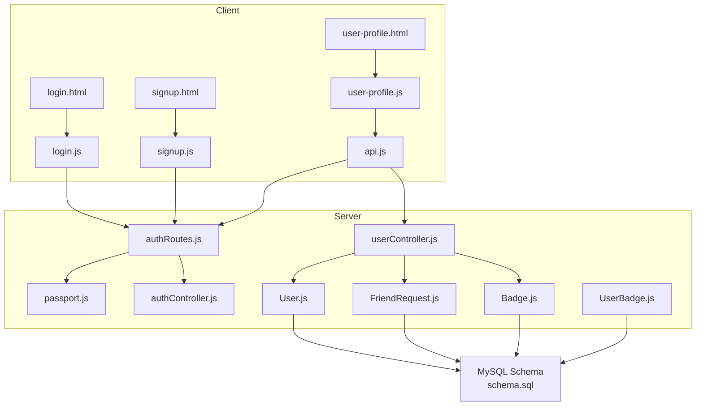
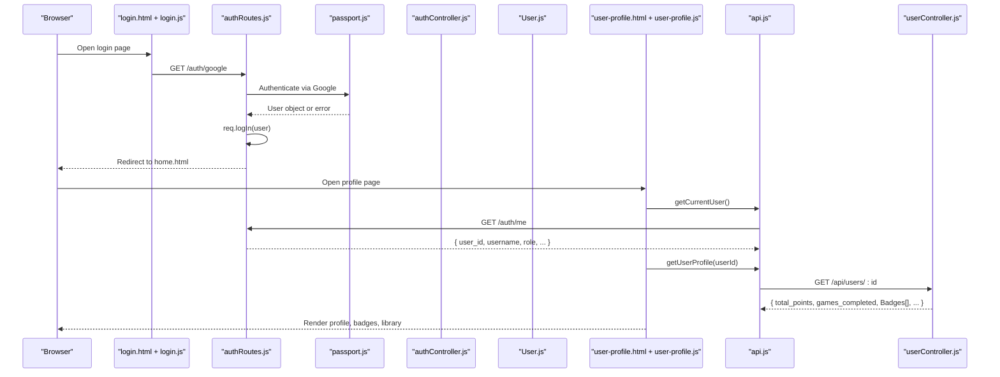
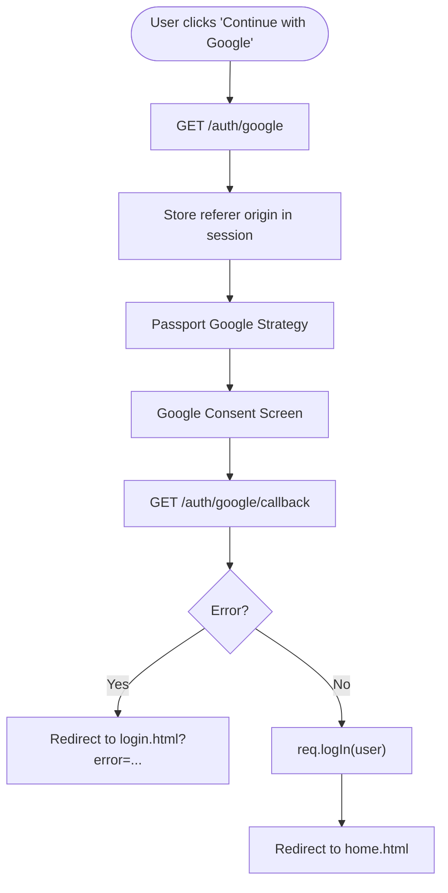
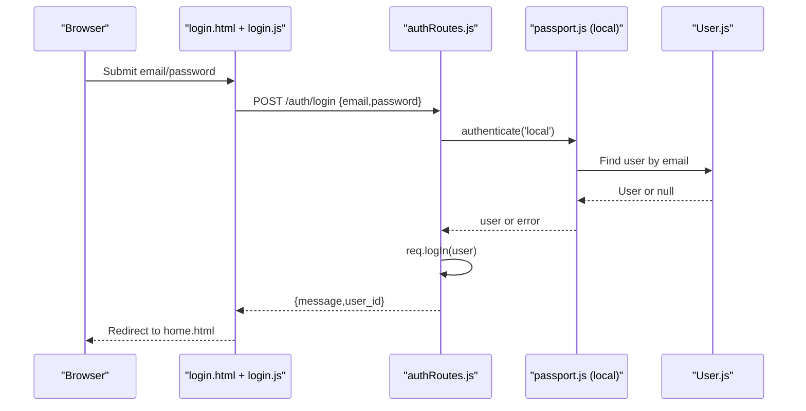
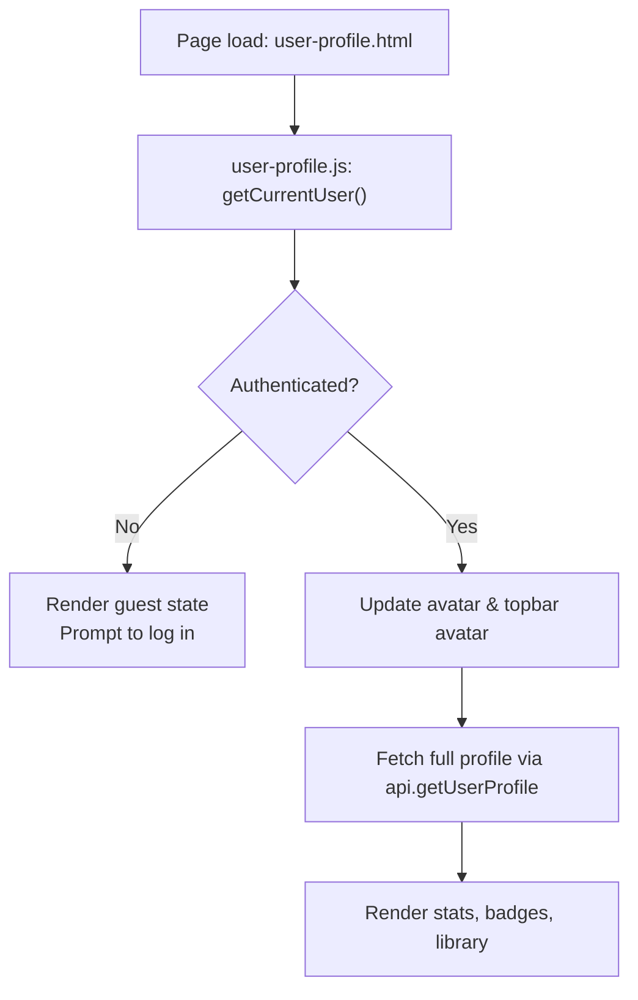
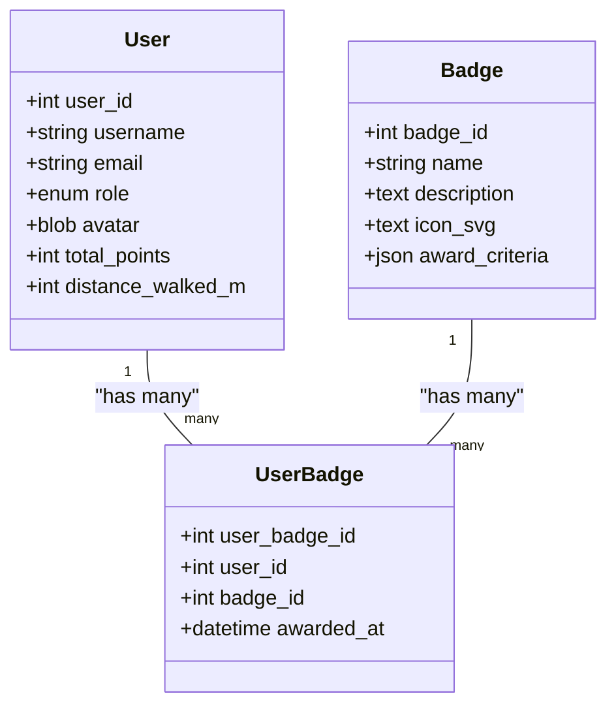
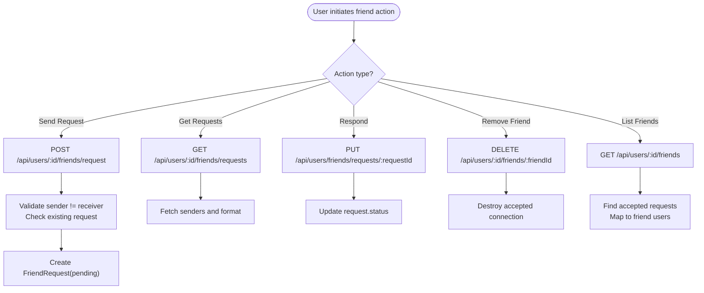
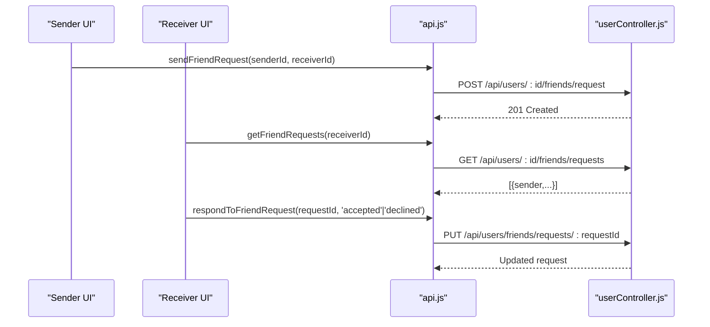
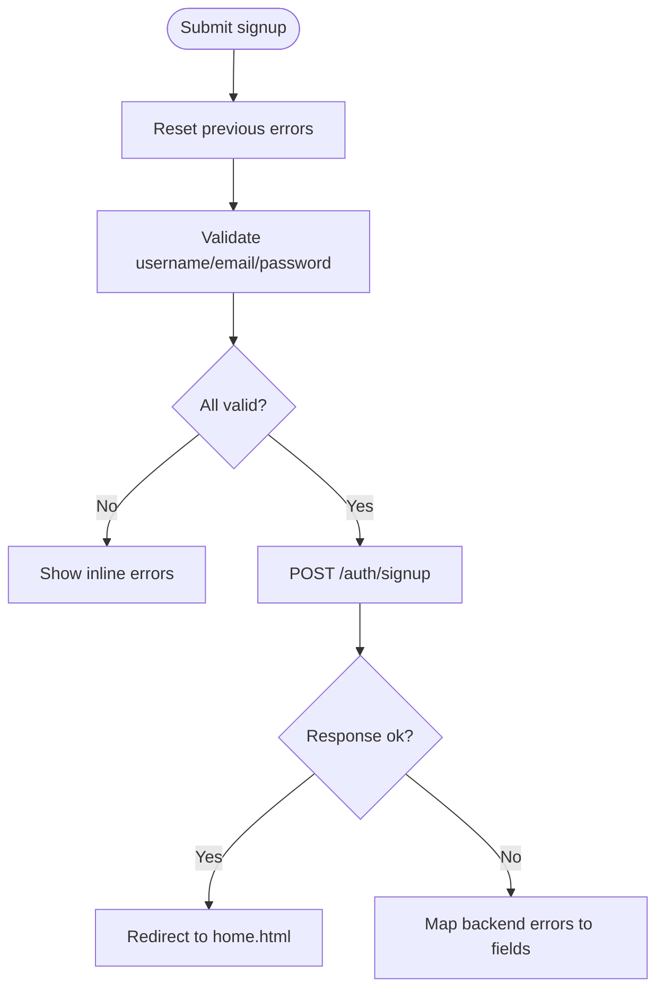
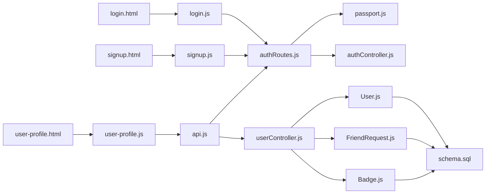

# User Management Interfaces

<cite>
**Referenced Files in This Document**
- [login.html](file://client/login.html)
- [login.js](file://client/scripts/login.js)
- [signup.html](file://client/signup.html)
- [signup.js](file://client/scripts/signup.js)
- [user-profile.html](file://client/user-profile.html)
- [user-profile.js](file://client/scripts/user-profile.js)
- [api.js](file://client/scripts/api.js)
- [authRoutes.js](file://server/src/routes/authRoutes.js)
- [passport.js](file://server/src/config/passport.js)
- [authController.js](file://server/src/controllers/authController.js)
- [userController.js](file://server/src/controllers/userController.js)
- [User.js](file://server/src/models/User.js)
- [FriendRequest.js](file://server/src/models/FriendRequest.js)
- [Badge.js](file://server/src/models/Badge.js)
- [UserBadge.js](file://server/src/models/UserBadge.js)
- [schema.sql](file://database/schema.sql)
</cite>

## Table of Contents
1. [Introduction](#introduction)
2. [Project Structure](#project-structure)
3. [Core Components](#core-components)
4. [Architecture Overview](#architecture-overview)
5. [Detailed Component Analysis](#detailed-component-analysis)
6. [Dependency Analysis](#dependency-analysis)
7. [Performance Considerations](#performance-considerations)
8. [Troubleshooting Guide](#troubleshooting-guide)
9. [Conclusion](#conclusion)

## Introduction
This document explains the user management and authentication interfaces in the WARG Platform, focusing on:
- Google OAuth login flow
- Local authentication fallback (email/password)
- Session management UI and state handling
- User profile system including avatar management, achievement badges display, and friend relationship management
- Friend request workflow, profile privacy considerations, and social interaction features
- Form validation patterns, error handling strategies, and responsive design considerations for mobile authentication flows

The goal is to provide both a high-level architectural view and detailed code-level analysis with diagrams and references to specific source files.

## Project Structure
The user management and authentication features span client-side HTML/JS and server-side routes, controllers, models, and configuration:
- Client pages: login.html, signup.html, user-profile.html
- Client scripts: login.js, signup.js, user-profile.js, api.js
- Server routes: authRoutes.js
- Server config: passport.js
- Server controllers: authController.js, userController.js
- Server models: User.js, FriendRequest.js, Badge.js, UserBadge.js
- Database schema: schema.sql

**Diagram sources**
- [login.html:1-66](file://client/login.html#L1-L66)
- [signup.html:1-81](file://client/signup.html#L1-L81)
- [user-profile.html:1-191](file://client/user-profile.html#L1-L191)
- [login.js:1-44](file://client/scripts/login.js#L1-L44)
- [signup.js:1-145](file://client/scripts/signup.js#L1-L145)
- [user-profile.js:1-126](file://client/scripts/user-profile.js#L1-L126)
- [api.js:1-401](file://client/scripts/api.js#L1-L401)
- [authRoutes.js:1-124](file://server/src/routes/authRoutes.js#L1-L124)
- [passport.js:1-99](file://server/src/config/passport.js#L1-L99)
- [authController.js:1-83](file://server/src/controllers/authController.js#L1-L83)
- [userController.js:1-226](file://server/src/controllers/userController.js#L1-L226)
- [User.js:1-28](file://server/src/models/User.js#L1-L28)
- [FriendRequest.js:1-16](file://server/src/models/FriendRequest.js#L1-L16)
- [Badge.js:1-18](file://server/src/models/Badge.js#L1-L18)
- [UserBadge.js:1-16](file://server/src/models/UserBadge.js#L1-L16)
- [schema.sql:1-691](file://database/schema.sql#L1-L691)

**Section sources**
- [login.html:1-66](file://client/login.html#L1-L66)
- [signup.html:1-81](file://client/signup.html#L1-L81)
- [user-profile.html:1-191](file://client/user-profile.html#L1-L191)
- [login.js:1-44](file://client/scripts/login.js#L1-L44)
- [signup.js:1-145](file://client/scripts/signup.js#L1-L145)
- [user-profile.js:1-126](file://client/scripts/user-profile.js#L1-L126)
- [api.js:1-401](file://client/scripts/api.js#L1-L401)
- [authRoutes.js:1-124](file://server/src/routes/authRoutes.js#L1-L124)
- [passport.js:1-99](file://server/src/config/passport.js#L1-L99)
- [authController.js:1-83](file://server/src/controllers/authController.js#L1-L83)
- [userController.js:1-226](file://server/src/controllers/userController.js#L1-L226)
- [User.js:1-28](file://server/src/models/User.js#L1-L28)
- [FriendRequest.js:1-16](file://server/src/models/FriendRequest.js#L1-L16)
- [Badge.js:1-18](file://server/src/models/Badge.js#L1-L18)
- [UserBadge.js:1-16](file://server/src/models/UserBadge.js#L1-L16)
- [schema.sql:1-691](file://database/schema.sql#L1-L691)

## Core Components
- Authentication entry points:
  - Google OAuth via Passport strategy and Express routes
  - Local email/password login via Passport local strategy
- Session management:
  - Express session-based login with serialize/deserialize
  - Client-side current user checks and guest mode rendering
- Profile and social features:
  - User profile page with stats, badges, and library
  - Friend requests CRUD endpoints and friend list retrieval
  - Avatar generation and optional upload during signup

Key responsibilities:
- authRoutes.js: HTTP endpoints for Google OAuth and local login/logout/me
- passport.js: Strategy configuration for Google and local auth
- authController.js: Signup logic and existence checks
- userController.js: Profile, library, friends, friend requests, search
- api.js: Shared client API helpers for all authenticated endpoints
- user-profile.js: Profile UI population and badge/library rendering
- login.js / signup.js: Form handling, validation, and submission

**Section sources**
- [authRoutes.js:1-124](file://server/src/routes/authRoutes.js#L1-L124)
- [passport.js:1-99](file://server/src/config/passport.js#L1-L99)
- [authController.js:1-83](file://server/src/controllers/authController.js#L1-L83)
- [userController.js:1-226](file://server/src/controllers/userController.js#L1-L226)
- [api.js:1-401](file://client/scripts/api.js#L1-L401)
- [user-profile.js:1-126](file://client/scripts/user-profile.js#L1-L126)
- [login.js:1-44](file://client/scripts/login.js#L1-L44)
- [signup.js:1-145](file://client/scripts/signup.js#L1-L145)

## Architecture Overview
The authentication architecture combines client-side forms and redirects with server-side Passport strategies and Express sessions. The profile and social features are exposed through REST endpoints consumed by the shared client API.

**Diagram sources**
- [login.html:1-66](file://client/login.html#L1-L66)
- [login.js:1-44](file://client/scripts/login.js#L1-L44)
- [authRoutes.js:1-124](file://server/src/routes/authRoutes.js#L1-L124)
- [passport.js:1-99](file://server/src/config/passport.js#L1-L99)
- [authController.js:1-83](file://server/src/controllers/authController.js#L1-L83)
- [User.js:1-28](file://server/src/models/User.js#L1-L28)
- [user-profile.html:1-191](file://client/user-profile.html#L1-L191)
- [user-profile.js:1-126](file://client/scripts/user-profile.js#L1-L126)
- [api.js:1-401](file://client/scripts/api.js#L1-L401)
- [userController.js:1-226](file://server/src/controllers/userController.js#L1-L226)

## Detailed Component Analysis

### Google OAuth Login Flow
- Entry point:
  - Login page includes a “Continue with Google” button that navigates to /auth/google.
- Server route:
  - Stores the original origin in the session for redirect back after consent.
  - Uses Passport Google strategy with profile and email scopes.
- Callback:
  - On success, logs the user in and redirects to home.html.
  - On failure, redirects to login.html with an error query parameter.
- Passport strategy:
  - If GOOGLE_CLIENT_ID/SECRET are set, registers Google strategy.
  - Looks up existing user by google_uid; if not found, creates a new user with provider google.
  - Checks flagged status before allowing login.

**Diagram sources**
- [login.html:41-51](file://client/login.html#L41-L51)
- [authRoutes.js:7-55](file://server/src/routes/authRoutes.js#L7-L55)
- [passport.js:27-64](file://server/src/config/passport.js#L27-L64)

**Section sources**
- [login.html:41-51](file://client/login.html#L41-L51)
- [authRoutes.js:7-55](file://server/src/routes/authRoutes.js#L7-L55)
- [passport.js:27-64](file://server/src/config/passport.js#L27-L64)

### Local Authentication Fallback
- Client form:
  - login.html provides email/password fields and submits to /auth/login.
  - login.js handles submit, disables button, sends JSON body, and redirects on success.
- Server route:
  - POST /auth/login uses Passport local strategy.
  - On success, logs in and returns JSON with user_id.
- Passport local strategy:
  - Validates email/password against stored hash.
  - Rejects accounts without password_hash (Google-only users).
  - Blocks flagged users.

**Diagram sources**
- [login.html:24-35](file://client/login.html#L24-L35)
- [login.js:4-42](file://client/scripts/login.js#L4-L42)
- [authRoutes.js:64-81](file://server/src/routes/authRoutes.js#L64-L81)
- [passport.js:67-95](file://server/src/config/passport.js#L67-L95)
- [User.js:1-28](file://server/src/models/User.js#L1-L28)

**Section sources**
- [login.html:24-35](file://client/login.html#L24-L35)
- [login.js:4-42](file://client/scripts/login.js#L4-L42)
- [authRoutes.js:64-81](file://server/src/routes/authRoutes.js#L64-L81)
- [passport.js:67-95](file://server/src/config/passport.js#L67-L95)
- [User.js:1-28](file://server/src/models/User.js#L1-L28)

### Session Management UI
- Current user detection:
  - api.getCurrentUser calls GET /auth/me and returns null for guests.
- Profile page behavior:
  - user-profile.js renders guest state with a prompt to log in with Google.
  - For authenticated users, updates avatar, name, title, stats, badges, and library.
- Topbar avatar:
  - Updates topbar avatar image based on current user’s username.

**Diagram sources**
- [api.js:123-130](file://client/scripts/api.js#L123-L130)
- [authRoutes.js:98-121](file://server/src/routes/authRoutes.js#L98-L121)
- [user-profile.js:7-65](file://client/scripts/user-profile.js#L7-L65)

**Section sources**
- [api.js:123-130](file://client/scripts/api.js#L123-L130)
- [authRoutes.js:98-121](file://server/src/routes/authRoutes.js#L98-L121)
- [user-profile.js:7-65](file://client/scripts/user-profile.js#L7-L65)

### User Profile System
- Avatar management:
  - Profile page sets avatar URL using DiceBear identicon seeded by username.
  - Signup allows selecting from preset pixel avatars or uploading a custom image (data URL).
- Achievement badges display:
  - Profile fetches user profile including Badges joined via UserBadge.
  - Renders badge items with name, description, and awarded date.
- Stats and library:
  - Displays total points, games completed, distance walked.
  - Loads user library (ARGs created by the user) and renders cards.

**Diagram sources**
- [User.js:1-28](file://server/src/models/User.js#L1-L28)
- [Badge.js:1-18](file://server/src/models/Badge.js#L1-L18)
- [UserBadge.js:1-16](file://server/src/models/UserBadge.js#L1-L16)

**Section sources**
- [user-profile.html:109-175](file://client/user-profile.html#L109-L175)
- [user-profile.js:31-123](file://client/scripts/user-profile.js#L31-L123)
- [userController.js:4-25](file://server/src/controllers/userController.js#L4-L25)
- [User.js:1-28](file://server/src/models/User.js#L1-L28)
- [Badge.js:1-18](file://server/src/models/Badge.js#L1-L18)
- [UserBadge.js:1-16](file://server/src/models/UserBadge.js#L1-L16)

### Friend Relationship Management
- Endpoints:
  - Send friend request: POST /api/users/:id/friends/request
  - Get friend requests: GET /api/users/:id/friends/requests
  - Respond to friend request: PUT /api/users/friends/requests/:requestId
  - Remove friend: DELETE /api/users/:id/friends/:friendId
  - Get friends: GET /api/users/:id/friends
- Data model:
  - FriendRequest tracks sender, receiver, status, and timestamp.
- Logic highlights:
  - Prevents duplicate or self requests.
  - Returns accepted relationships as friends.
  - Enriches friend data with active game presence when available.

**Diagram sources**
- [userController.js:97-225](file://server/src/controllers/userController.js#L97-L225)
- [FriendRequest.js:1-16](file://server/src/models/FriendRequest.js#L1-L16)
- [api.js:178-209](file://client/scripts/api.js#L178-L209)

**Section sources**
- [userController.js:97-225](file://server/src/controllers/userController.js#L97-L225)
- [FriendRequest.js:1-16](file://server/src/models/FriendRequest.js#L1-L16)
- [api.js:178-209](file://client/scripts/api.js#L178-L209)

### Friend Request Workflow
- Sending:
  - Client calls sendFriendRequest(senderId, receiverId).
  - Server validates constraints and creates pending request.
- Receiving:
  - Client calls getFriendRequests(userId).
  - Server returns pending requests enriched with sender info.
- Responding:
  - Client calls respondToFriendRequest(requestId, status).
  - Server updates status to accepted or declined.
- Removing:
  - Client calls removeFriend(userId, friendId).
  - Server destroys accepted connection.

**Diagram sources**
- [api.js:190-209](file://client/scripts/api.js#L190-L209)
- [userController.js:97-199](file://server/src/controllers/userController.js#L97-L199)

**Section sources**
- [api.js:190-209](file://client/scripts/api.js#L190-L209)
- [userController.js:97-199](file://server/src/controllers/userController.js#L97-L199)

### Profile Privacy Settings
- Public vs private data:
  - Profile endpoint excludes sensitive fields like google_uid and session_token.
  - Guest mode shows placeholder content and prompts login.
- Role-based visibility:
  - Title displays role (player/creator/admin), which can be used to gate advanced features.
- Notes:
  - No explicit per-user privacy toggles are implemented in the analyzed code.
  - Admin role detection is performed client-side via api.getCurrentUser().

**Section sources**
- [userController.js:4-25](file://server/src/controllers/userController.js#L4-L25)
- [user-profile.js:7-29](file://client/scripts/user-profile.js#L7-L29)
- [api.js:374-400](file://client/scripts/api.js#L374-L400)

### Social Interaction Features
- Library display:
  - User-created ARGs are fetched and rendered using GameCard component.
- Presence indicators:
  - Friends list includes active game context when available.
- Search:
  - User search endpoint supports partial username matching.

**Section sources**
- [user-profile.js:108-123](file://client/scripts/user-profile.js#L108-L123)
- [userController.js:27-37](file://server/src/controllers/userController.js#L27-L37)
- [userController.js:39-74](file://server/src/controllers/userController.js#L39-L74)
- [userController.js:76-95](file://server/src/controllers/userController.js#L76-L95)

### Form Validation Patterns
- Signup form:
  - Validates username length, email format, and password length.
  - Shows inline errors and prevents submission if invalid.
  - Handles backend validation errors (e.g., duplicate email/username).
- Login form:
  - Disables submit button during processing and restores on error.
  - Alerts generic messages on network or server errors.

**Diagram sources**
- [signup.js:59-132](file://client/scripts/signup.js#L59-L132)
- [authController.js:5-61](file://server/src/controllers/authController.js#L5-L61)

**Section sources**
- [signup.js:59-132](file://client/scripts/signup.js#L59-L132)
- [authController.js:5-61](file://server/src/controllers/authController.js#L5-L61)

### Error Handling Patterns
- Network errors:
  - Client catches fetch failures and alerts users.
- Backend validation:
  - Server returns structured error messages; client maps them to fields where possible.
- Authentication errors:
  - Passport strategies return informative messages (e.g., incorrect credentials, banned account).
- Logout:
  - Clears session cookie and returns success message.

**Section sources**
- [login.js:15-41](file://client/scripts/login.js#L15-L41)
- [signup.js:93-130](file://client/scripts/signup.js#L93-L130)
- [authRoutes.js:84-95](file://server/src/routes/authRoutes.js#L84-L95)
- [passport.js:67-95](file://server/src/config/passport.js#L67-L95)

### Responsive Design Considerations for Mobile Authentication Flows
- Viewport meta tag ensures proper scaling on mobile devices.
- Login and signup forms use simple stacked layouts suitable for small screens.
- Profile page uses CSS variables and grid layouts to adapt to different screen sizes.
- Drawer overlay and hamburger menu support mobile navigation patterns.

**Section sources**
- [login.html:1-13](file://client/login.html#L1-L13)
- [signup.html:1-13](file://client/signup.html#L1-L13)
- [user-profile.html:1-15](file://client/user-profile.html#L1-L15)
- [user-profile.html:18-21](file://client/user-profile.html#L18-L21)
- [user-profile.html:68-98](file://client/user-profile.html#L68-L98)

## Dependency Analysis
The following diagram illustrates key dependencies between client and server components involved in user management and authentication.

**Diagram sources**
- [login.html:1-66](file://client/login.html#L1-L66)
- [signup.html:1-81](file://client/signup.html#L1-L81)
- [user-profile.html:1-191](file://client/user-profile.html#L1-L191)
- [login.js:1-44](file://client/scripts/login.js#L1-L44)
- [signup.js:1-145](file://client/scripts/signup.js#L1-L145)
- [user-profile.js:1-126](file://client/scripts/user-profile.js#L1-L126)
- [api.js:1-401](file://client/scripts/api.js#L1-L401)
- [authRoutes.js:1-124](file://server/src/routes/authRoutes.js#L1-L124)
- [passport.js:1-99](file://server/src/config/passport.js#L1-L99)
- [authController.js:1-83](file://server/src/controllers/authController.js#L1-L83)
- [userController.js:1-226](file://server/src/controllers/userController.js#L1-L226)
- [User.js:1-28](file://server/src/models/User.js#L1-L28)
- [FriendRequest.js:1-16](file://server/src/models/FriendRequest.js#L1-L16)
- [Badge.js:1-18](file://server/src/models/Badge.js#L1-L18)
- [schema.sql:1-691](file://database/schema.sql#L1-L691)

**Section sources**
- [api.js:1-401](file://client/scripts/api.js#L1-L401)
- [authRoutes.js:1-124](file://server/src/routes/authRoutes.js#L1-L124)
- [userController.js:1-226](file://server/src/controllers/userController.js#L1-L226)

## Performance Considerations
- Minimize unnecessary re-renders on profile page by checking for null profiles and early returns.
- Use efficient queries in userController.getUserProfile to avoid loading sensitive fields.
- Leverage database views for aggregated stats to reduce application-side computation.
- Avoid large payloads by excluding sensitive columns from serialized user objects.

[No sources needed since this section provides general guidance]

## Troubleshooting Guide
- Google OAuth disabled:
  - If GOOGLE_CLIENT_ID/SECRET are not set, Google login will be unavailable; check console warnings.
- Local login fails for Google-only accounts:
  - Accounts created via Google do not have password_hash; instruct users to sign in with Google.
- Duplicate email/username on signup:
  - Server returns specific error messages; map these to field-level errors in the UI.
- Session issues:
  - Ensure cookies are enabled and same-site settings are correct for cross-origin deployments.
- Profile not loading:
  - Verify /auth/me returns authenticated user; check network tab for 401 responses.

**Section sources**
- [passport.js:27-64](file://server/src/config/passport.js#L27-L64)
- [passport.js:67-95](file://server/src/config/passport.js#L67-L95)
- [authController.js:5-61](file://server/src/controllers/authController.js#L5-L61)
- [authRoutes.js:98-121](file://server/src/routes/authRoutes.js#L98-L121)

## Conclusion
The WARG Platform’s user management and authentication interfaces combine robust server-side strategies with intuitive client-side flows. Google OAuth provides seamless social login, while local authentication offers a reliable fallback. The profile system presents personalized stats, badges, and library content, and the friend request workflow enables rich social interactions. Clear validation and error handling patterns improve user experience, and responsive design considerations ensure usability across devices.

[No sources needed since this section summarizes without analyzing specific files]