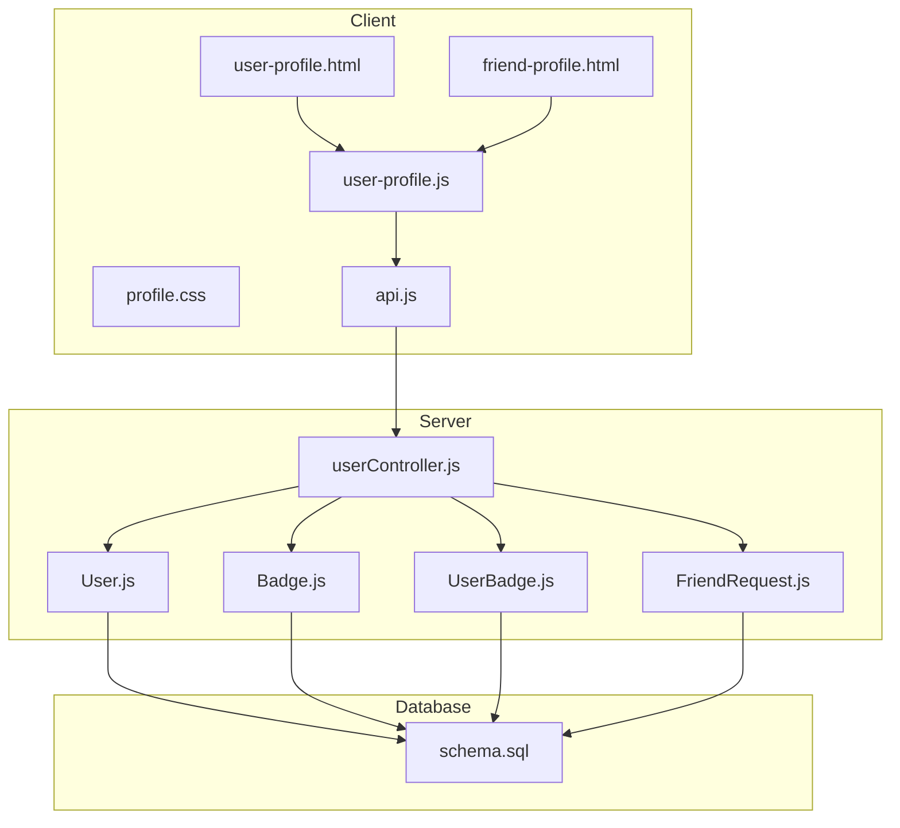
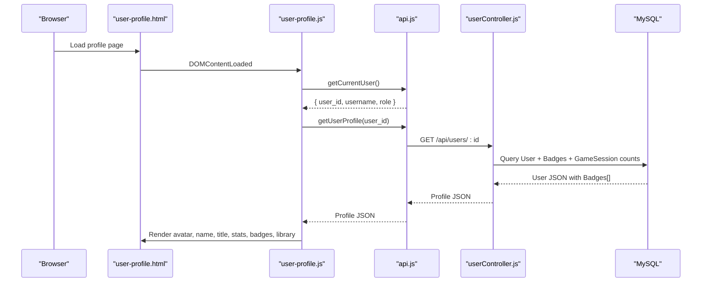
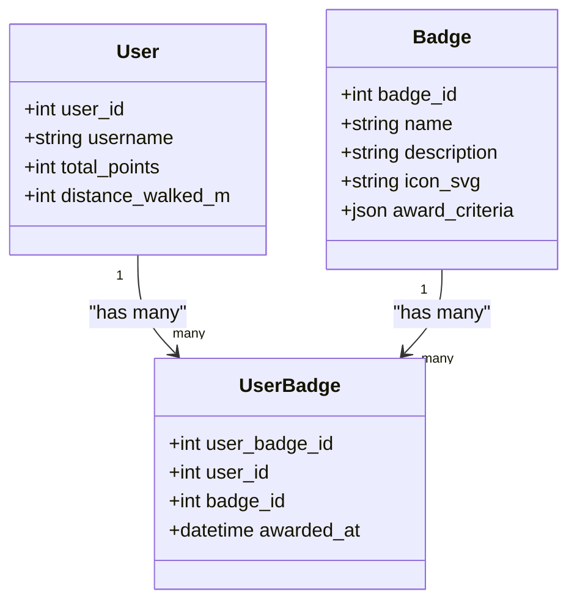
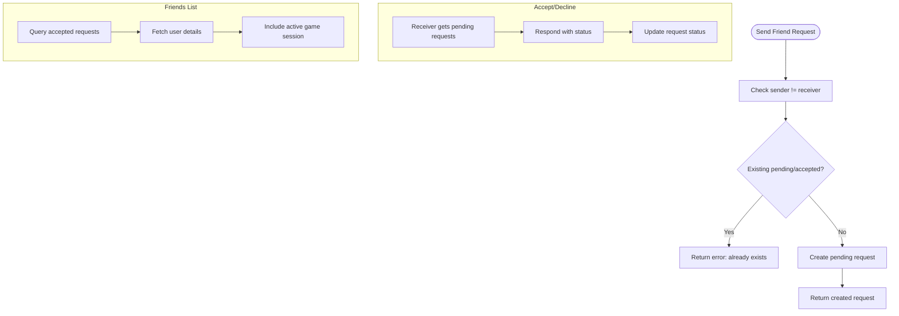
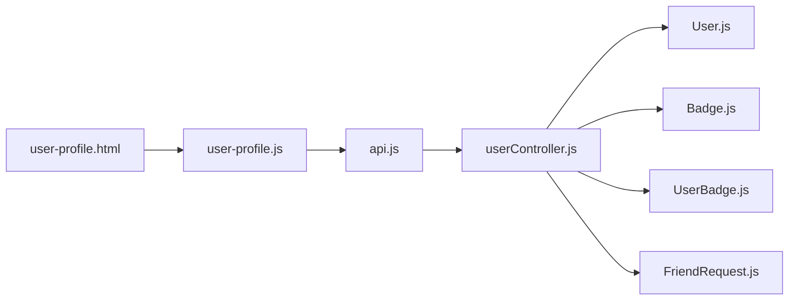

# User Profile Management

<cite>
**Referenced Files in This Document**
- [user-profile.html](file://client/user-profile.html)
- [friend-profile.html](file://client/friend-profile.html)
- [profile.css](file://client/styles/profile.css)
- [user-profile.js](file://client/scripts/user-profile.js)
- [api.js](file://client/scripts/api.js)
- [userController.js](file://server/src/controllers/userController.js)
- [User.js](file://server/src/models/User.js)
- [Badge.js](file://server/src/models/Badge.js)
- [UserBadge.js](file://server/src/models/UserBadge.js)
- [FriendRequest.js](file://server/src/models/FriendRequest.js)
- [schema.sql](file://database/schema.sql)
</cite>

## Table of Contents
1. [Introduction](#introduction)
2. [Project Structure](#project-structure)
3. [Core Components](#core-components)
4. [Architecture Overview](#architecture-overview)
5. [Detailed Component Analysis](#detailed-component-analysis)
6. [Dependency Analysis](#dependency-analysis)
7. [Performance Considerations](#performance-considerations)
8. [Troubleshooting Guide](#troubleshooting-guide)
9. [Conclusion](#conclusion)

## Introduction
This document explains the user profile management interfaces in the WARG Platform. It covers:
- Profile page layout and sections
- Avatar display and upload patterns
- Personal information editing capabilities
- Achievement badge system (display, earning criteria, visual representation)
- Friend relationship management (requests, acceptance workflow, visibility controls)
- Examples for fetching profile data, updating user information, and displaying social connections
- Responsive design patterns for mobile profile viewing
- Accessibility considerations implemented across the profile pages

## Project Structure
The profile feature spans client-side HTML/CSS/JS and server-side controllers/models with a MySQL schema.

**Diagram sources**
- [user-profile.html:1-191](file://client/user-profile.html#L1-L191)
- [friend-profile.html:1-211](file://client/friend-profile.html#L1-L211)
- [profile.css:1-315](file://client/styles/profile.css#L1-L315)
- [user-profile.js:1-126](file://client/scripts/user-profile.js#L1-L126)
- [api.js:1-401](file://client/scripts/api.js#L1-L401)
- [userController.js:1-226](file://server/src/controllers/userController.js#L1-L226)
- [User.js:1-28](file://server/src/models/User.js#L1-L28)
- [Badge.js:1-18](file://server/src/models/Badge.js#L1-L18)
- [UserBadge.js:1-16](file://server/src/models/UserBadge.js#L1-L16)
- [FriendRequest.js:1-16](file://server/src/models/FriendRequest.js#L1-L16)
- [schema.sql:1-691](file://database/schema.sql#L1-L691)

**Section sources**
- [user-profile.html:1-191](file://client/user-profile.html#L1-L191)
- [friend-profile.html:1-211](file://client/friend-profile.html#L1-L211)
- [profile.css:1-315](file://client/styles/profile.css#L1-L315)
- [user-profile.js:1-126](file://client/scripts/user-profile.js#L1-L126)
- [api.js:1-401](file://client/scripts/api.js#L1-L401)
- [userController.js:1-226](file://server/src/controllers/userController.js#L1-L226)
- [User.js:1-28](file://server/src/models/User.js#L1-L28)
- [Badge.js:1-18](file://server/src/models/Badge.js#L1-L18)
- [UserBadge.js:1-16](file://server/src/models/UserBadge.js#L1-L16)
- [FriendRequest.js:1-16](file://server/src/models/FriendRequest.js#L1-L16)
- [schema.sql:1-691](file://database/schema.sql#L1-L691)

## Core Components
- Profile page layout: header banner, avatar, name/title, stats grid, badges grid, library grid
- Badge system: definition, awarding metadata, per-user award timestamps
- Friend relationships: requests, acceptance, listing friends, removing friends
- Data flow: client scripts call API helpers which hit server routes and models

Key responsibilities:
- user-profile.html: static structure and accessibility attributes
- user-profile.js: fetches current user, full profile, badges, and library; renders UI
- api.js: HTTP helpers and typed endpoints for profile, friends, and library
- userController.js: server endpoints for profile, library, friends, and friend requests
- Models and schema: define users, badges, user_badges, and friend_requests

**Section sources**
- [user-profile.html:100-175](file://client/user-profile.html#L100-L175)
- [user-profile.js:7-124](file://client/scripts/user-profile.js#L7-L124)
- [api.js:123-209](file://client/scripts/api.js#L123-L209)
- [userController.js:4-225](file://server/src/controllers/userController.js#L4-L225)
- [schema.sql:496-528](file://database/schema.sql#L496-L528)
- [schema.sql:68-84](file://database/schema.sql#L68-L84)

## Architecture Overview
The profile feature follows a standard client-server pattern:
- The browser loads the profile page and runs user-profile.js
- user-profile.js calls api.js helpers to fetch authenticated user and profile data
- api.js sends HTTP requests to server routes
- userController.js queries database via Sequelize models
- Results are rendered into the DOM

**Diagram sources**
- [user-profile.js:7-124](file://client/scripts/user-profile.js#L7-L124)
- [api.js:123-164](file://client/scripts/api.js#L123-L164)
- [userController.js:4-25](file://server/src/controllers/userController.js#L4-L25)

## Detailed Component Analysis

### Profile Page Layout and Sections
- Header banner and profile info area with avatar and edit icon
- Name row with editable name control
- Role-based title display
- Stats grid: total points, games completed, distance walked
- Badges section: grid of earned badges with date
- Library section: grid of user-created ARGs using shared GameCard component

Accessibility highlights:
- Semantic headings and roles
- ARIA labels on interactive elements
- Keyboard-focusable buttons with descriptive titles

Responsive behavior:
- Flex column stacking on small screens
- Centered alignment for profile details on mobile
- Grid auto-fit for stats and badges

**Section sources**
- [user-profile.html:100-175](file://client/user-profile.html#L100-L175)
- [profile.css:15-168](file://client/styles/profile.css#L15-L168)
- [profile.css:170-244](file://client/styles/profile.css#L170-L244)
- [profile.css:294-314](file://client/styles/profile.css#L294-L314)

### Avatar Display and Upload Functionality
- Current user avatar is generated from username via an external identicon service
- Topbar avatar and profile avatar are updated dynamically
- Edit icon is present for potential future upload flows
- The signup flow demonstrates avatar selection and custom file upload patterns that can be extended to profile editing

Implementation notes:
- Avatar URLs are built from username seed
- Alt text is personalized for accessibility
- No direct server endpoint for profile avatar upload is exposed in the analyzed files; the UI provides hooks for future implementation

Example references:
- Updating avatar and topbar avatar after login
- Placeholder edit button for avatar changes

**Section sources**
- [user-profile.js:31-45](file://client/scripts/user-profile.js#L31-L45)
- [user-profile.html:109-117](file://client/user-profile.html#L109-L117)

### Personal Information Editing Capabilities
- The profile page includes edit icons for name and avatar
- Title is derived from user role and displayed read-only
- No explicit update endpoint or form submission logic is present in the analyzed profile script; the edit actions are placeholders for future implementation

Future extension points:
- Add a modal or inline editor for name and bio
- Integrate avatar upload with backend storage
- Validate inputs before sending updates

**Section sources**
- [user-profile.html:118-131](file://client/user-profile.html#L118-L131)
- [user-profile.js:55-63](file://client/scripts/user-profile.js#L55-L63)

### Achievement Badge System
- Badge definitions include name, description, optional SVG icon, and award_criteria JSON
- Per-user awards are tracked with awarded_at timestamp
- Profile page displays earned badges with star icon and formatted date
- Badge list is empty if none are awarded

Earning criteria:
- Criteria stored as JSON in Badge.award_criteria
- Frontend uses awarded_at from UserBadge to show when a badge was earned

Visual representation:
- Star icon inside a circular badge container
- Hover effects and responsive grid layout

**Diagram sources**
- [Badge.js:1-18](file://server/src/models/Badge.js#L1-L18)
- [UserBadge.js:1-16](file://server/src/models/UserBadge.js#L1-L16)
- [User.js:1-28](file://server/src/models/User.js#L1-L28)
- [schema.sql:500-528](file://database/schema.sql#L500-L528)

Rendering logic:
- Fetches profile including Badges joined through UserBadge
- Formats awarded_at date and renders badge items

**Section sources**
- [userController.js:4-25](file://server/src/controllers/userController.js#L4-L25)
- [user-profile.js:80-106](file://client/scripts/user-profile.js#L80-L106)
- [profile.css:192-244](file://client/styles/profile.css#L192-L244)

### Friend Relationship Management
Features:
- Send friend request
- List pending requests received by the user
- Accept or decline requests
- List accepted friends
- Remove a friend

Workflow:
- Client calls sendFriendRequest(senderId, receiverId)
- Server validates and creates a pending request
- Receiver lists pending requests and responds with accept/decline
- Accepted pairs become friends; friends list shows basic user info and active game presence

Visibility controls:
- Friends list includes minimal user fields (id, username, avatar)
- Active game session info is included for presence indication

**Diagram sources**
- [userController.js:97-134](file://server/src/controllers/userController.js#L97-L134)
- [userController.js:136-199](file://server/src/controllers/userController.js#L136-L199)
- [userController.js:39-74](file://server/src/controllers/userController.js#L39-L74)

Examples:
- Sending a request: api.sendFriendRequest(senderId, receiverId)
- Getting requests: api.getFriendRequests(userId)
- Responding: respondToFriendRequest(requestId, 'accepted' | 'declined')
- Listing friends: api.getFriends(userId)
- Removing friend: api.removeFriend(userId, friendId)

**Section sources**
- [api.js:178-209](file://client/scripts/api.js#L178-L209)
- [userController.js:39-225](file://server/src/controllers/userController.js#L39-L225)
- [FriendRequest.js:1-16](file://server/src/models/FriendRequest.js#L1-L16)
- [schema.sql:68-84](file://database/schema.sql#L68-L84)

### Profile Data Fetching and Rendering
- On load, get current user; if guest, show placeholder and login prompt
- Update avatar and topbar avatar based on username
- Fetch full profile to populate stats and badges
- Render library using GameCard component

Error handling:
- Graceful fallbacks for missing profile data
- Console errors logged for failed network calls

**Section sources**
- [user-profile.js:7-124](file://client/scripts/user-profile.js#L7-L124)
- [api.js:123-164](file://client/scripts/api.js#L123-L164)

### Example: Displaying Social Connections
- Friend profile page shows action buttons: Invite to Game, Message, Unfriend
- These represent common social interactions available once friendship is established

Note:
- The friend-profile.html is a static template; dynamic behavior would integrate with the same API helpers used elsewhere

**Section sources**
- [friend-profile.html:101-120](file://client/friend-profile.html#L101-L120)

## Dependency Analysis
Frontend dependencies:
- user-profile.html depends on profile.css and user-profile.js
- user-profile.js depends on api.js and GameCard component

Backend dependencies:
- userController.js depends on User, Badge, UserBadge, FriendRequest models
- Models depend on database schema definitions

**Diagram sources**
- [user-profile.html:183-186](file://client/user-profile.html#L183-L186)
- [user-profile.js:1-126](file://client/scripts/user-profile.js#L1-L126)
- [api.js:1-401](file://client/scripts/api.js#L1-L401)
- [userController.js:1-226](file://server/src/controllers/userController.js#L1-L226)

**Section sources**
- [user-profile.html:183-186](file://client/user-profile.html#L183-L186)
- [user-profile.js:1-126](file://client/scripts/user-profile.js#L1-L126)
- [api.js:1-401](file://client/scripts/api.js#L1-L401)
- [userController.js:1-226](file://server/src/controllers/userController.js#L1-L226)

## Performance Considerations
- Use CSS Grid with auto-fit/minmax for responsive layouts without heavy media queries
- Avoid large image payloads; use lightweight SVG icons for badges
- Defer non-critical rendering (e.g., library grid) until after core profile data is loaded
- Cache repeated reads where appropriate (e.g., current user)

[No sources needed since this section provides general guidance]

## Troubleshooting Guide
Common issues and resolutions:
- Guest state not detected: ensure getCurrentUser returns null for unauthenticated users
- Missing profile data: check getUserProfile endpoint and verify user_id passed correctly
- Badge dates not showing: confirm UserBadge.awarded_at is populated and formatted
- Friend request errors: validate sender/receiver uniqueness and existing statuses
- Network failures: handle API errors gracefully and provide user feedback

Relevant code paths:
- Guest handling and placeholder content
- Profile fetch try/catch blocks
- Friend request validation and duplicate checks

**Section sources**
- [user-profile.js:7-29](file://client/scripts/user-profile.js#L7-L29)
- [user-profile.js:47-53](file://client/scripts/user-profile.js#L47-L53)
- [userController.js:97-134](file://server/src/controllers/userController.js#L97-L134)

## Conclusion
The WARG Platform’s user profile management provides a solid foundation for displaying personal information, achievements, and social connections. The frontend offers accessible, responsive layouts while the backend exposes clear APIs for profile, badges, and friend operations. Future enhancements can extend avatar upload, profile editing, and richer social features by building on the existing architecture and data models.

[No sources needed since this section summarizes without analyzing specific files]