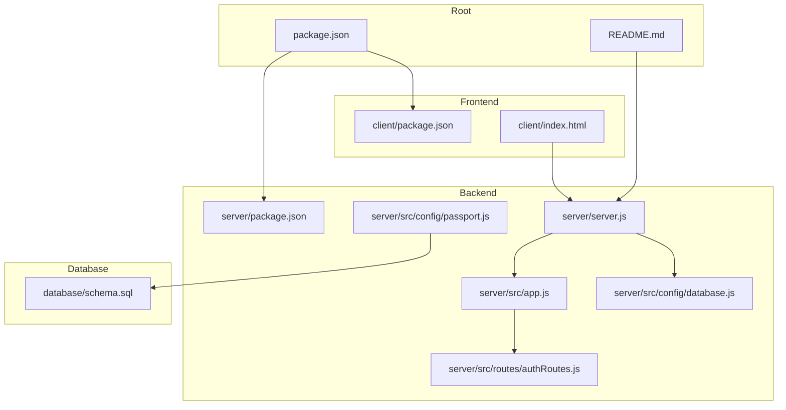
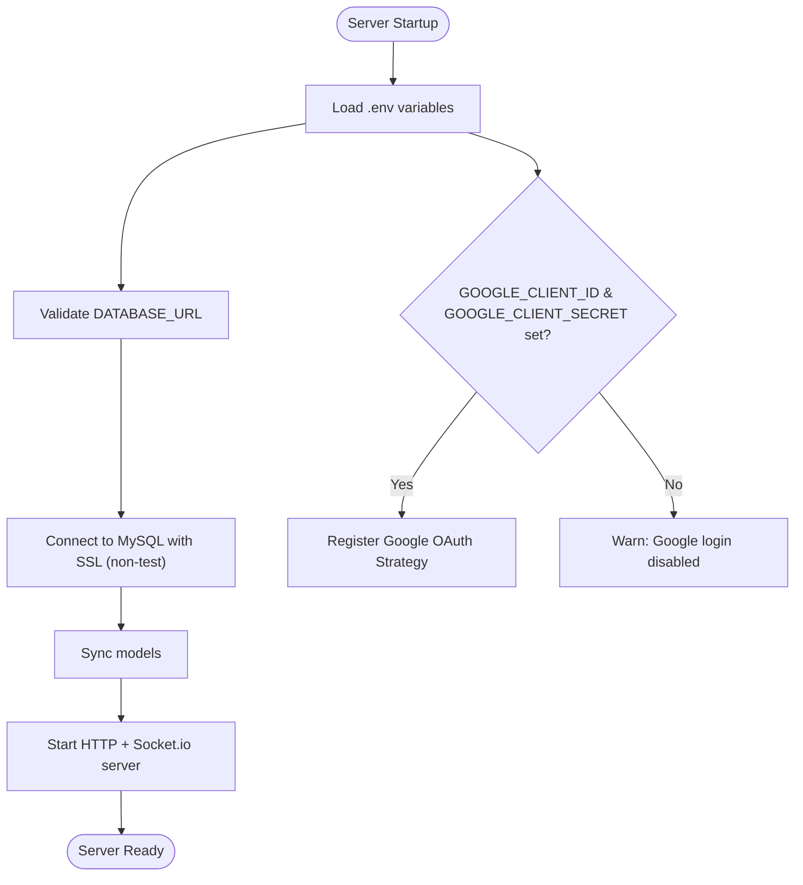
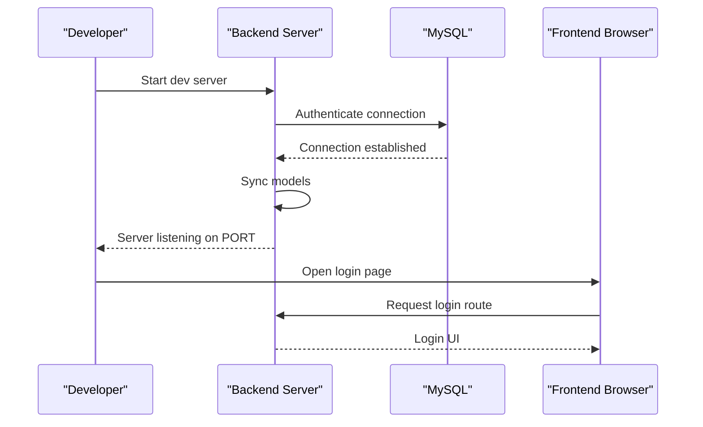

# Getting Started

<cite>
**Referenced Files in This Document**
- [README.md](file://README.md)
- [package.json](file://package.json)
- [server/package.json](file://server/package.json)
- [client/package.json](file://client/package.json)
- [database/schema.sql](file://database/schema.sql)
- [server/server.js](file://server/server.js)
- [server/src/config/database.js](file://server/src/config/database.js)
- [server/src/config/passport.js](file://server/src/config/passport.js)
- [server/src/app.js](file://server/src/app.js)
- [server/src/routes/authRoutes.js](file://server/src/routes/authRoutes.js)
- [client/index.html](file://client/index.html)
</cite>

## Table of Contents
1. [Introduction](#introduction)
2. [Project Structure](#project-structure)
3. [Prerequisites](#prerequisites)
4. [Installation](#installation)
5. [Environment Configuration](#environment-configuration)
6. [Starting the Development Server](#starting-the-development-server)
7. [Quick Start Examples](#quick-start-examples)
8. [Troubleshooting Guide](#troubleshooting-guide)
9. [Next Steps](#next-steps)

## Introduction
WARG Platform is a location-based Alternate Reality Game (ARG) and interactive scavenger hunt system designed for campus engagement. It allows users to create, publish, and play custom geospatial games with friends and peers. The platform provides:
- A server-side game engine that validates player locations and puzzle progress
- An authoring console for creating ARGs, waypoints, clues, and minigames
- Social features such as profiles, leaderboards, comments, and flags
- Optional live co-op gameplay via WebSockets
- Anti-spoofing heuristics and trust scoring for advanced deployments

The repository includes a Node.js/Express backend, a static HTML/JS frontend, a MySQL database schema, and an optional AI vision service.

**Section sources**
- [README.md:16-76](file://README.md#L16-L76)

## Project Structure
At a high level, the project is organized into:
- Root configuration and documentation
- Backend API server under `server/`
- Static client application under `client/`
- Database schema under `database/`
- Optional AI engine under `ai-engine/`

**Diagram sources**
- [package.json:1-8](file://package.json#L1-L8)
- [server/package.json:1-39](file://server/package.json#L1-L39)
- [client/package.json:1-25](file://client/package.json#L1-L25)
- [server/server.js:1-72](file://server/server.js#L1-L72)
- [server/src/app.js:1-80](file://server/src/app.js#L1-L80)
- [server/src/config/database.js:1-38](file://server/src/config/database.js#L1-L38)
- [server/src/config/passport.js:1-99](file://server/src/config/passport.js#L1-L99)
- [server/src/routes/authRoutes.js:1-40](file://server/src/routes/authRoutes.js#L1-L40)
- [client/index.html:1-17](file://client/index.html#L1-L17)
- [database/schema.sql:1-20](file://database/schema.sql#L1-L20)

**Section sources**
- [README.md:62-76](file://README.md#L62-L76)
- [server/server.js:1-72](file://server/server.js#L1-L72)
- [client/index.html:1-17](file://client/index.html#L1-L17)

## Prerequisites
Before installing, ensure your machine has:
- Node.js 18 or newer
- MySQL 8.x with spatial extensions enabled
- A Google OAuth Client ID and Secret (optional but recommended for login)
- A running MySQL instance and a database ready for the WARG schema

Notes:
- The backend uses MySQL with SRID 4326 (WGS 84) for geospatial data.
- Google OAuth is optional; the server can start without it, but login will be disabled if credentials are missing.

**Section sources**
- [README.md:7-9](file://README.md#L7-L9)
- [README.md:62-76](file://README.md#L62-L76)
- [server/src/config/passport.js:24-64](file://server/src/config/passport.js#L24-L64)

## Installation
Follow these steps to set up the platform locally:

1. Clone the repository
   - Use Git to clone the repository to your local machine.

2. Install dependencies
   - Run the root dependency installer to install shared packages.
   - Then install backend and frontend dependencies separately:
     - Backend: `cd server && npm install`
     - Frontend: `cd client && npm install`

3. Prepare the database
   - Create a MySQL database for WARG.
   - Import the provided schema file to initialize tables and indexes.

4. Configure environment variables
   - Create a `.env` file in the `server/` directory with required values:
     - `DATABASE_URL`: Full MySQL connection string (include SSL mode if required by your provider).
     - `GOOGLE_CLIENT_ID` and `GOOGLE_CLIENT_SECRET`: Your Google OAuth credentials.
     - `GOOGLE_CALLBACK_URL`: Callback URL for Google OAuth (defaults to `/auth/google/callback`).
     - `CLIENT_URL` or `CLIENT_PAGES_URL`: Allowed origins for CORS and redirect targets.
     - `PORT`: Port for the backend server (default 3000).

5. Seed initial data (optional)
   - If you want sample data, run the seed script from the backend.

**Section sources**
- [README.md:79-93](file://README.md#L79-L93)
- [server/package.json:6-14](file://server/package.json#L6-L14)
- [database/schema.sql:1-20](file://database/schema.sql#L1-L20)

## Environment Configuration
The backend reads environment variables at startup. Key variables include:

- `DATABASE_URL`
  - Used by Sequelize to connect to MySQL.
  - SSL is enforced outside of tests.
- `GOOGLE_CLIENT_ID`, `GOOGLE_CLIENT_SECRET`
  - Enable Google OAuth strategy when present.
- `GOOGLE_CALLBACK_URL`
  - Redirect target after Google authentication.
- `CLIENT_URL`, `CLIENT_PAGES_URL`
  - Control allowed CORS origins and redirect destinations.
- `PORT`
  - HTTP server port.

Important behaviors:
- If Google credentials are missing, the server starts normally but disables Google login.
- In non-test environments, the database connection enforces SSL.
- Socket.io CORS accepts localhost in development even if not explicitly listed.

**Diagram sources**
- [server/server.js:47-71](file://server/server.js#L47-L71)
- [server/src/config/database.js:1-38](file://server/src/config/database.js#L1-L38)
- [server/src/config/passport.js:24-64](file://server/src/config/passport.js#L24-L64)

**Section sources**
- [server/src/config/database.js:1-38](file://server/src/config/database.js#L1-L38)
- [server/src/config/passport.js:24-64](file://server/src/config/passport.js#L24-L64)
- [server/server.js:14-36](file://server/server.js#L14-L36)

## Starting the Development Server
After installation and environment setup:

1. Start the backend server
   - From the `server/` directory, run the development script.
   - The server will attempt to connect to the database and sync models.

2. Serve the frontend
   - The frontend is static HTML/JS/CSS. You can serve it using any static server or open the files directly in a browser.
   - The root page redirects to the login page.

3. Verify the server is running
   - Check console logs for successful database connection and server readiness.
   - Open the frontend in your browser and navigate to the login page.

**Diagram sources**
- [server/server.js:47-71](file://server/server.js#L47-L71)
- [client/index.html:1-17](file://client/index.html#L1-L17)

**Section sources**
- [server/server.js:47-71](file://server/server.js#L47-L71)
- [client/index.html:1-17](file://client/index.html#L1-L17)

## Quick Start Examples
Here are practical examples to get you running quickly:

- Run the platform locally
  - Ensure MySQL is running and the schema is imported.
  - Set environment variables in `server/.env`.
  - Start the backend server and open the frontend in your browser.

- Create your first game
  - Log in using Google OAuth (if configured) or local auth.
  - Use the authoring console to plot waypoints, write clues, and define minigame puzzles.
  - Publish the game and invite players.

- Test basic functionality
  - Play a published game and verify location validation works.
  - Submit answers or scan QR/barcodes if configured.
  - Observe progress updates and leaderboard entries.

Tips:
- If Google OAuth is not configured, use local email/password registration where available.
- For local development, allow localhost origins in CORS settings.

**Section sources**
- [README.md:79-93](file://README.md#L79-L93)
- [server/src/config/passport.js:24-64](file://server/src/config/passport.js#L24-L64)
- [client/index.html:1-17](file://client/index.html#L1-L17)

## Troubleshooting Guide
Common issues and resolutions:

- Database connection errors
  - Symptoms: Server cannot connect to MySQL or shows connection refused/timed out.
  - Checks:
    - Confirm `DATABASE_URL` is correct and points to a reachable MySQL instance.
    - Ensure SSL is configured if your provider requires it.
    - Verify the schema has been imported successfully.
  - References:
    - Database configuration enforces SSL outside tests.
    - Server attempts to authenticate and sync models on startup.

- Google OAuth not working
  - Symptoms: Google login is unavailable or fails during callback.
  - Checks:
    - Ensure `GOOGLE_CLIENT_ID` and `GOOGLE_CLIENT_SECRET` are set.
    - Verify `GOOGLE_CALLBACK_URL` matches your Google OAuth configuration.
    - Confirm `CLIENT_URL` or `CLIENT_PAGES_URL` includes the frontend origin.
  - Behavior:
    - Without credentials, the server starts but disables Google login.

- CORS and frontend connectivity
  - Symptoms: Frontend requests blocked due to CORS.
  - Checks:
    - Set `CLIENT_URL` to include your frontend origin(s).
    - In development, localhost is allowed automatically.
  - References:
    - Socket.io CORS logic allows localhost in development.

- Missing environment variables
  - Symptoms: Unexpected behavior or disabled features.
  - Checks:
    - Validate all required variables are present in `.env`.
    - Restart the server after changes.

- Initial data and testing
  - Use the seed script to populate sample data if needed.
  - Run backend tests to validate configuration and routes.

**Section sources**
- [server/src/config/database.js:1-38](file://server/src/config/database.js#L1-L38)
- [server/src/config/passport.js:24-64](file://server/src/config/passport.js#L24-L64)
- [server/server.js:14-36](file://server/server.js#L14-L36)
- [server/server.js:47-71](file://server/server.js#L47-L71)

## Next Steps
- Explore the authoring console to design ARGs with waypoints and minigames.
- Integrate additional services like the AI vision engine for advanced scanning challenges.
- Customize deployment to production platforms as documented in the repository’s deployment guide.

[No sources needed since this section provides general guidance]