# AI Service Architecture

<cite>
**Referenced Files in This Document**
- [main.py](file://ai-engine/main.py)
- [hsv_matcher.py](file://ai-engine/vision/hsv_matcher.py)
- [mobilenet_extractor.py](file://ai-engine/vision/mobilenet_extractor.py)
- [sam_extractor.py](file://ai-engine/vision/sam_extractor.py)
- [then_vs_now.py](file://ai-engine/vision/then_vs_now.py)
- [symmetry.py](file://ai-engine/vision/symmetry.py)
- [ocr_matcher.py](file://ai-engine/vision/ocr_matcher.py)
- [Dockerfile](file://ai-engine/Dockerfile)
- [requirements.txt](file://ai-engine/requirements.txt)
- [DEPLOYMENT.md](file://ai-engine/DEPLOYMENT.md)
- [aiController.js](file://server/src/controllers/aiController.js)
- [aiRoutes.js](file://server/src/routes/aiRoutes.js)
</cite>

## Table of Contents
1. [Introduction](#introduction)
2. [Project Structure](#project-structure)
3. [Core Components](#core-components)
4. [Architecture Overview](#architecture-overview)
5. [Detailed Component Analysis](#detailed-component-analysis)
6. [Dependency Analysis](#dependency-analysis)
7. [Performance Considerations](#performance-considerations)
8. [Troubleshooting Guide](#troubleshooting-guide)
9. [Conclusion](#conclusion)

## Introduction
This document explains the AI microservice architecture built with FastAPI and Python that powers computer vision tasks for the WARG platform. It covers the end-to-end image processing pipeline from client uploads through OpenCV preprocessing to model inference, including HSV color matching, MobileNet feature extraction, and Segment Anything Model (SAM) integration. It also documents the REST API endpoints exposed by the FastAPI service, request/response schemas, error handling patterns, Docker containerization strategy, resource requirements, scaling considerations for GPU-intensive operations, and performance optimization techniques such as model caching, batch processing, and memory management.

## Project Structure
The AI engine is a standalone FastAPI application under ai-engine. The Express backend in server proxies authenticated requests to the AI service.

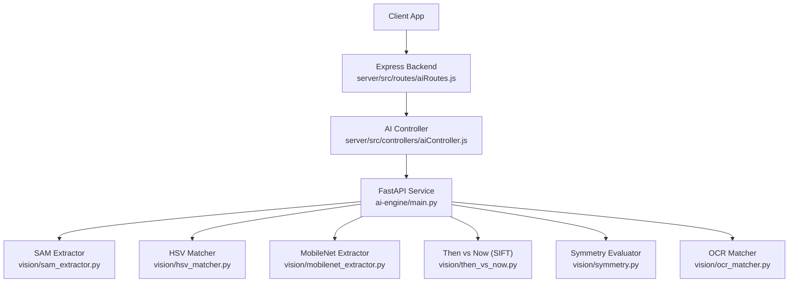

**Diagram sources**
- [aiRoutes.js:15-37](file://server/src/routes/aiRoutes.js#L15-L37)
- [aiController.js:3-154](file://server/src/controllers/aiController.js#L3-L154)
- [main.py:77-157](file://ai-engine/main.py#L77-L157)
- [sam_extractor.py:1-90](file://ai-engine/vision/sam_extractor.py#L1-L90)
- [hsv_matcher.py:1-62](file://ai-engine/vision/hsv_matcher.py#L1-L62)
- [mobilenet_extractor.py:1-50](file://ai-engine/vision/mobilenet_extractor.py#L1-L50)
- [then_vs_now.py:1-48](file://ai-engine/vision/then_vs_now.py#L1-L48)
- [symmetry.py:1-65](file://ai-engine/vision/symmetry.py#L1-L65)
- [ocr_matcher.py:1-79](file://ai-engine/vision/ocr_matcher.py#L1-L79)

**Section sources**
- [aiRoutes.js:1-40](file://server/src/routes/aiRoutes.js#L1-L40)
- [aiController.js:1-163](file://server/src/controllers/aiController.js#L1-L163)
- [main.py:1-157](file://ai-engine/main.py#L1-L157)

## Core Components
- FastAPI service entrypoint and routing:
  - Health and root endpoints
  - Security middleware using an API key header
  - CORS configuration for the frontend and backend origins
- Vision modules:
  - HSV color histogram matching
  - MobileNetV2 feature extraction and texture similarity
  - SAM-based shape extraction and mask alignment
  - SIFT-based archival matching with RANSAC
  - Symmetry evaluation via SSIM
  - OCR-based plaque text comparison
- Containerization:
  - CPU-only PyTorch build with OpenCV headless and Tesseract
  - Environment variables for port and unbuffered logs

Key responsibilities:
- main.py exposes REST endpoints and delegates to vision modules.
- Each vision module encapsulates preprocessing, model inference, and scoring logic.
- The Express layer authenticates users and forwards multipart form data to the AI service.

**Section sources**
- [main.py:1-52](file://ai-engine/main.py#L1-L52)
- [hsv_matcher.py:1-62](file://ai-engine/vision/hsv_matcher.py#L1-L62)
- [mobilenet_extractor.py:1-50](file://ai-engine/vision/mobilenet_extractor.py#L1-L50)
- [sam_extractor.py:1-90](file://ai-engine/vision/sam_extractor.py#L1-L90)
- [then_vs_now.py:1-48](file://ai-engine/vision/then_vs_now.py#L1-L48)
- [symmetry.py:1-65](file://ai-engine/vision/symmetry.py#L1-L65)
- [ocr_matcher.py:1-79](file://ai-engine/vision/ocr_matcher.py#L1-L79)
- [Dockerfile:1-40](file://ai-engine/Dockerfile#L1-L40)

## Architecture Overview
The system follows a layered architecture:
- Client applications send images to the Express backend.
- Express validates authentication and file inputs, then forwards them to the AI service.
- FastAPI routes handle security checks and delegate to specialized vision modules.
- Vision modules perform OpenCV preprocessing and model inference, returning normalized scores.

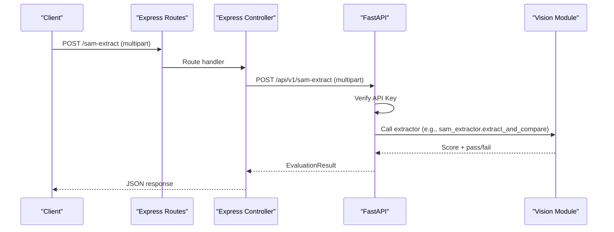

**Diagram sources**
- [aiRoutes.js:15-18](file://server/src/routes/aiRoutes.js#L15-L18)
- [aiController.js:3-32](file://server/src/controllers/aiController.js#L3-L32)
- [main.py:77-93](file://ai-engine/main.py#L77-L93)
- [sam_extractor.py:52-90](file://ai-engine/vision/sam_extractor.py#L52-L90)

## Detailed Component Analysis

### FastAPI Service Endpoints and Security
- Security:
  - API key validation via header X-API-Key.
  - Unauthorized responses when invalid or missing keys.
- CORS:
  - Allows specific frontend and backend origins.
- Endpoints:
  - GET / — status check
  - GET /health — reports loaded models
  - POST /api/v1/sam-extract — shape evaluation via SAM
  - POST /api/v1/hsv-match — color evaluation via HSV histograms
  - POST /api/v1/texture-match — texture evaluation via MobileNet embeddings
  - POST /api/v1/sift-match — archival matching via SIFT
  - POST /api/v1/symmetry — symmetry evaluation via SSIM
  - POST /api/v1/ocr-match — plaque text comparison via OCR

Request/response schema:
- All evaluation endpoints accept multipart/form-data with one or two image fields depending on the endpoint.
- Responses conform to a consistent EvaluationResult structure: confidence_score (float), passed (bool), message (string).

Error handling:
- Missing or invalid API key returns 401.
- Vision modules raise exceptions on decode failures; FastAPI converts these to HTTP errors.
- The Express controller wraps network errors and returns 500 with a generic message.

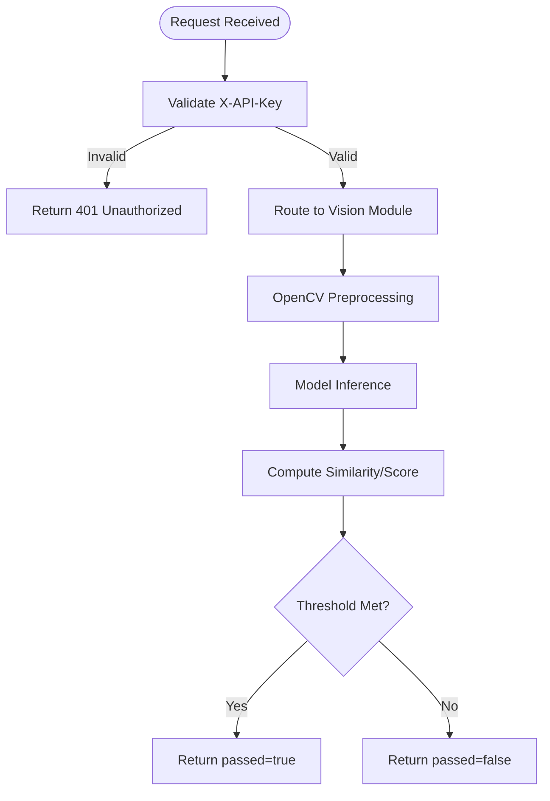

**Diagram sources**
- [main.py:14-20](file://ai-engine/main.py#L14-L20)
- [main.py:77-157](file://ai-engine/main.py#L77-L157)

**Section sources**
- [main.py:1-52](file://ai-engine/main.py#L1-L52)
- [main.py:77-157](file://ai-engine/main.py#L77-L157)

### HSV Color Matching Pipeline
- Purpose: Compare color distributions between player upload and reference image using HSV histograms.
- Processing:
  - Decode bytes to OpenCV image.
  - Convert to HSV.
  - Mask out low-saturation pixels to avoid achromatic noise.
  - Compute 2D Hue-Saturation histogram and normalize.
  - Compare histograms using Bhattacharyya distance and convert to similarity score.
- Endpoint: POST /api/v1/hsv-match accepts image and reference_image.

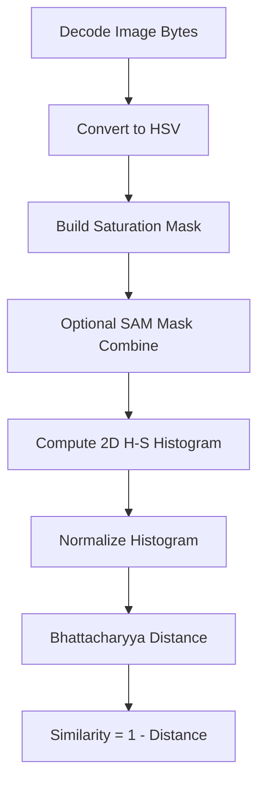

**Diagram sources**
- [hsv_matcher.py:4-50](file://ai-engine/vision/hsv_matcher.py#L4-L50)
- [hsv_matcher.py:52-62](file://ai-engine/vision/hsv_matcher.py#L52-L62)
- [main.py:95-111](file://ai-engine/main.py#L95-L111)

**Section sources**
- [hsv_matcher.py:1-62](file://ai-engine/vision/hsv_matcher.py#L1-L62)
- [main.py:95-111](file://ai-engine/main.py#L95-L111)

### MobileNet Feature Extraction and Texture Similarity
- Purpose: Extract structural features using MobileNetV2 and compare embeddings via cosine similarity.
- Processing:
  - Load pre-trained MobileNetV2 at module import time (model caching).
  - Preprocess images: resize, center crop, tensor conversion, normalization.
  - Strip color channel to grayscale then back to RGB for lighting agnosticism.
  - Compute adaptive average pooling to flatten features into a 1D embedding.
  - Evaluate cosine similarity between upload and reference embeddings.
- Endpoint: POST /api/v1/texture-match accepts image and reference_image.

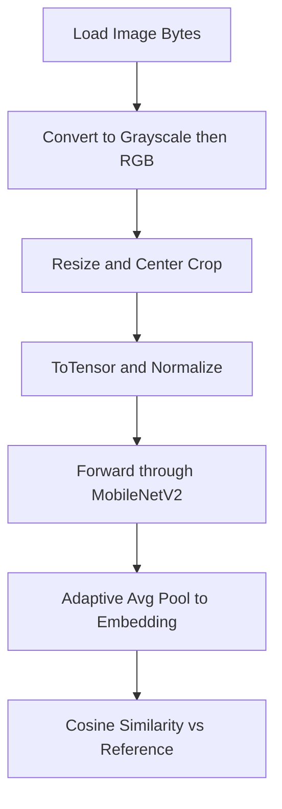

**Diagram sources**
- [mobilenet_extractor.py:11-22](file://ai-engine/vision/mobilenet_extractor.py#L11-L22)
- [mobilenet_extractor.py:24-38](file://ai-engine/vision/mobilenet_extractor.py#L24-L38)
- [mobilenet_extractor.py:40-50](file://ai-engine/vision/mobilenet_extractor.py#L40-L50)
- [main.py:113-125](file://ai-engine/main.py#L113-L125)

**Section sources**
- [mobilenet_extractor.py:1-50](file://ai-engine/vision/mobilenet_extractor.py#L1-L50)
- [main.py:113-125](file://ai-engine/main.py#L113-L125)

### Segment Anything Model (SAM) Integration
- Purpose: Extract primary shapes using SAM guided by a dynamic crosshair and evaluate overlap against a target mask.
- Processing:
  - Initialize MobileSAM predictor at startup; fallback if weights are missing.
  - Set image in predictor and generate five-point crosshair prompts around the image center.
  - Run predictor to obtain a binary mask.
  - Align masks by cropping to bounding boxes and resizing to match dimensions.
  - Compute Jaccard Index (IoU) between aligned masks.
- Endpoint: POST /api/v1/sam-extract accepts image and target_mask.

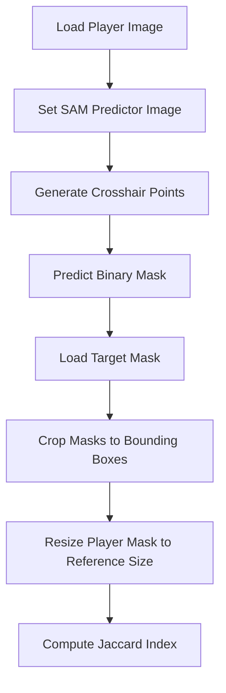

**Diagram sources**
- [sam_extractor.py:6-16](file://ai-engine/vision/sam_extractor.py#L6-L16)
- [sam_extractor.py:18-41](file://ai-engine/vision/sam_extractor.py#L18-L41)
- [sam_extractor.py:52-90](file://ai-engine/vision/sam_extractor.py#L52-L90)
- [main.py:77-93](file://ai-engine/main.py#L77-L93)

**Section sources**
- [sam_extractor.py:1-90](file://ai-engine/vision/sam_extractor.py#L1-L90)
- [main.py:77-93](file://ai-engine/main.py#L77-L93)

### SIFT Archival Matching (Then vs Now)
- Purpose: Match historical/archival images to current captures using SIFT keypoints and geometric verification.
- Processing:
  - Decode both images to grayscale.
  - Detect and compute SIFT descriptors.
  - Match descriptors using BFMatcher with Lowe’s ratio test.
  - Apply RANSAC homography to filter geometrically consistent matches.
  - Return count of inliers and pass/fail based on minimum matches threshold.
- Endpoint: POST /api/v1/sift-match accepts image and archival_image.

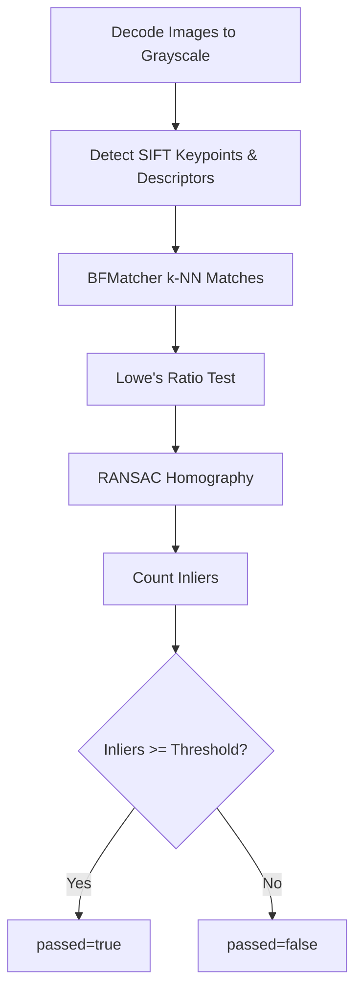

**Diagram sources**
- [then_vs_now.py:4-48](file://ai-engine/vision/then_vs_now.py#L4-L48)
- [main.py:127-138](file://ai-engine/main.py#L127-L138)

**Section sources**
- [then_vs_now.py:1-48](file://ai-engine/vision/then_vs_now.py#L1-L48)
- [main.py:127-138](file://ai-engine/main.py#L127-L138)

### Symmetry Evaluation
- Purpose: Assess bilateral symmetry by mirroring one half and comparing via SSIM.
- Processing:
  - Decode image and convert to grayscale.
  - Apply Gaussian blur to reduce fine details.
  - Split image vertically, mirror left half, and compute SSIM against right half.
  - Normalize score to percentage and apply threshold.
- Endpoint: POST /api/v1/symmetry accepts image.

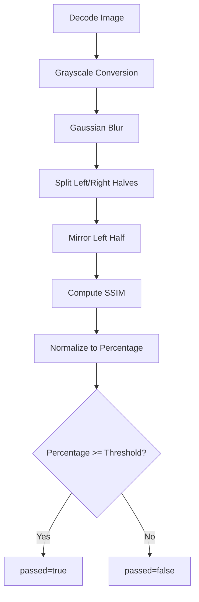

**Diagram sources**
- [symmetry.py:4-29](file://ai-engine/vision/symmetry.py#L4-L29)
- [symmetry.py:31-65](file://ai-engine/vision/symmetry.py#L31-L65)
- [main.py:140-150](file://ai-engine/main.py#L140-L150)

**Section sources**
- [symmetry.py:1-65](file://ai-engine/vision/symmetry.py#L1-L65)
- [main.py:140-150](file://ai-engine/main.py#L140-L150)

### OCR Plaque Text Matching
- Purpose: Extract and compare engraved/weathered plaque text using Tesseract OCR.
- Processing:
  - Decode image, convert to grayscale, upscale if small, denoise, and apply adaptive thresholding.
  - Run Tesseract to extract text.
  - Normalize text (lowercase, strip punctuation, collapse whitespace).
  - Compare texts using sequence similarity ratio.
  - Return confidence score and pass/fail based on threshold.
- Endpoint: POST /api/v1/ocr-match accepts image and reference_image.

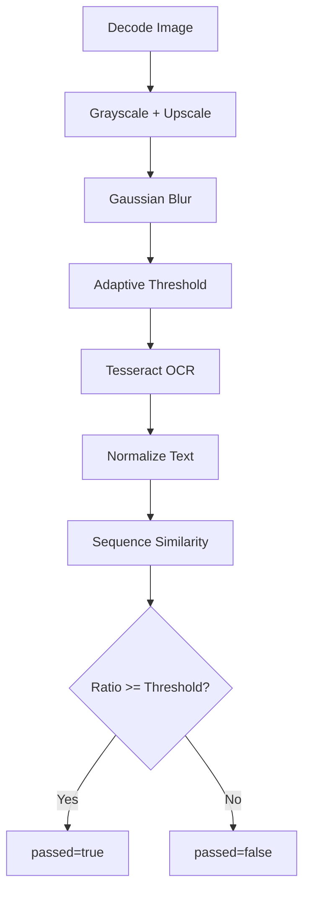

**Diagram sources**
- [ocr_matcher.py:9-34](file://ai-engine/vision/ocr_matcher.py#L9-L34)
- [ocr_matcher.py:36-51](file://ai-engine/vision/ocr_matcher.py#L36-L51)
- [ocr_matcher.py:53-79](file://ai-engine/vision/ocr_matcher.py#L53-L79)
- [main.py:152-157](file://ai-engine/main.py#L152-L157)

**Section sources**
- [ocr_matcher.py:1-79](file://ai-engine/vision/ocr_matcher.py#L1-L79)
- [main.py:152-157](file://ai-engine/main.py#L152-L157)

### Express Backend Integration
- Authentication:
  - All AI routes require authentication via middleware.
- File Uploads:
  - Multer stores files in memory with a 5MB limit per file.
- Routing:
  - Maps client endpoints to AI service endpoints.
- Controller:
  - Validates required files, builds FormData, forwards to FastAPI, and handles non-OK responses.

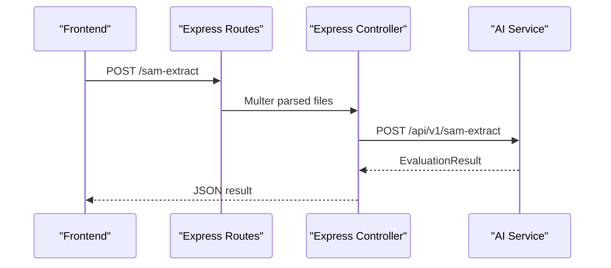

**Diagram sources**
- [aiRoutes.js:15-37](file://server/src/routes/aiRoutes.js#L15-L37)
- [aiController.js:3-32](file://server/src/controllers/aiController.js#L3-L32)

**Section sources**
- [aiRoutes.js:1-40](file://server/src/routes/aiRoutes.js#L1-L40)
- [aiController.js:1-163](file://server/src/controllers/aiController.js#L1-L163)

## Dependency Analysis
- External libraries:
  - FastAPI, Uvicorn, python-multipart for web serving and multipart parsing.
  - OpenCV headless for image decoding and processing.
  - PyTorch and Torchvision for MobileNetV2 inference.
  - Pillow for image I/O.
  - timm for additional model utilities.
  - MobileSAM for SAM predictor.
  - pytesseract for OCR.
- Runtime environment:
  - System dependencies include GL libraries, glib, git, and Tesseract binaries.
  - Port exposure configured via environment variable PORT.

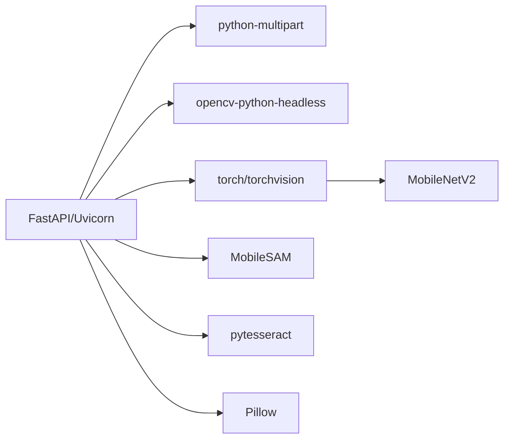

**Diagram sources**
- [requirements.txt:1-13](file://ai-engine/requirements.txt#L1-L13)
- [Dockerfile:14-20](file://ai-engine/Dockerfile#L14-L20)
- [Dockerfile:24-32](file://ai-engine/Dockerfile#L24-L32)

**Section sources**
- [requirements.txt:1-13](file://ai-engine/requirements.txt#L1-L13)
- [Dockerfile:1-40](file://ai-engine/Dockerfile#L1-L40)

## Performance Considerations
- Model caching:
  - MobileNetV2 is loaded once at module import time, reducing per-request overhead.
  - SAM predictor initialization occurs at module load; ensure weights exist to avoid runtime penalties.
- Batch processing:
  - Current endpoints process single images; consider batching multiple images per request to amortize model loading and I/O costs.
- Memory management:
  - Avoid keeping large numpy arrays or tensors beyond function scope.
  - Use streaming where possible and release buffers after processing.
- GPU acceleration:
  - SAM currently falls back to CPU if CUDA is unavailable; enable GPU-capable environments for faster inference.
  - Ensure PyTorch GPU wheels are used in production for optimal throughput.
- Concurrency:
  - Uvicorn workers can be scaled horizontally; tune worker count based on CPU cores and memory limits.
- Image size limits:
  - Enforce strict size constraints at the Express layer (already set to 5MB) to prevent excessive memory usage.
- Optimization techniques:
  - Quantization or ONNX export for MobileNetV2 to reduce latency.
  - Precompute reference embeddings for MobileNet to avoid repeated inference on static references.
  - Cache frequent results keyed by image hashes to avoid redundant computations.

[No sources needed since this section provides general guidance]

## Troubleshooting Guide
- Missing API key:
  - Ensure X-API-Key header is present and matches the configured value.
- Invalid or missing files:
  - Validate required multipart fields before sending to the AI service.
- SAM weights not found:
  - Ensure mobile_sam.pt exists at weights/mobile_sam.pt inside the container.
- Tesseract not installed:
  - Confirm tesseract-ocr and language packs are installed in the container image.
- High memory usage:
  - Monitor RAM usage; the service requires at least 1 GB, ideally 2 GB due to model loads.
- Network errors:
  - The Express controller logs and returns generic 500 errors; inspect AI service logs for underlying issues.

**Section sources**
- [main.py:14-20](file://ai-engine/main.py#L14-L20)
- [sam_extractor.py:10-16](file://ai-engine/vision/sam_extractor.py#L10-L16)
- [Dockerfile:14-20](file://ai-engine/Dockerfile#L14-L20)
- [DEPLOYMENT.md:8-14](file://ai-engine/DEPLOYMENT.md#L8-L14)
- [aiController.js:21-31](file://server/src/controllers/aiController.js#L21-L31)

## Conclusion
The AI microservice provides a robust, modular computer vision pipeline integrated with FastAPI. It supports diverse algorithms—HSV color matching, MobileNet texture similarity, SAM shape extraction, SIFT archival matching, symmetry evaluation, and OCR text comparison—each encapsulated in dedicated modules. The Express backend authenticates and proxies requests, while the FastAPI service enforces security and delegates to vision components. Containerization ensures reproducibility, and careful attention to model caching, concurrency, and memory management enables scalable deployment for GPU-intensive workloads.