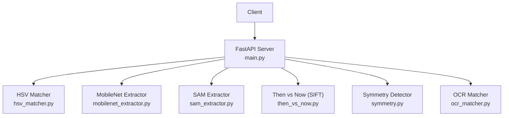
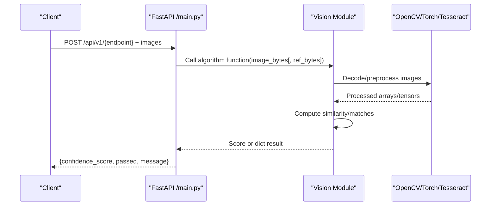
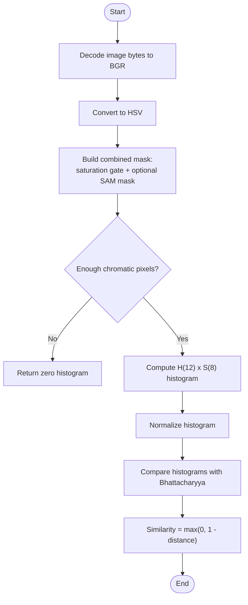
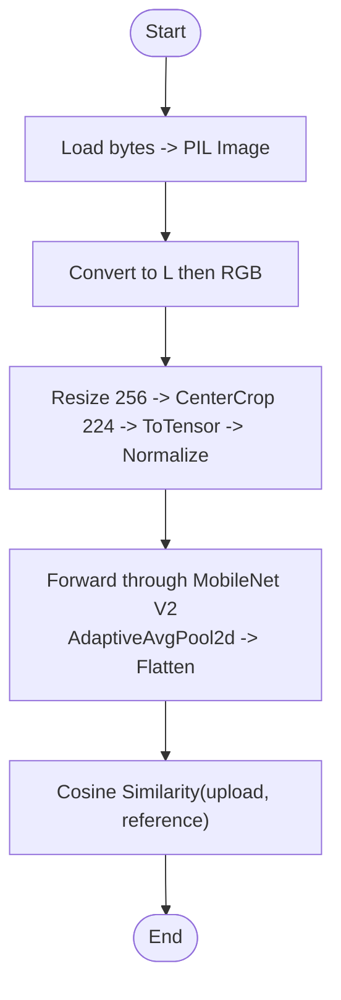
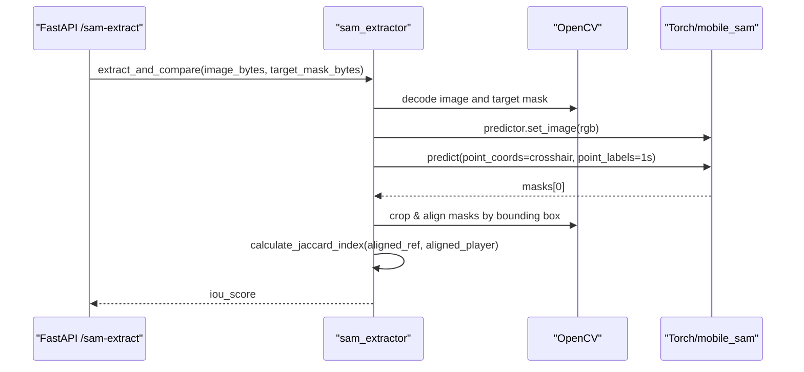
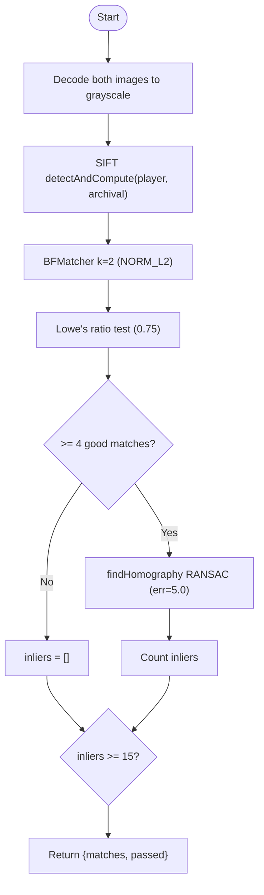
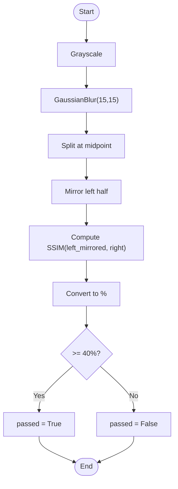
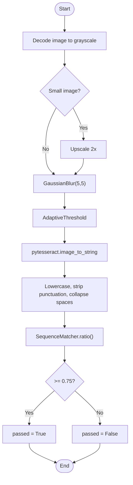
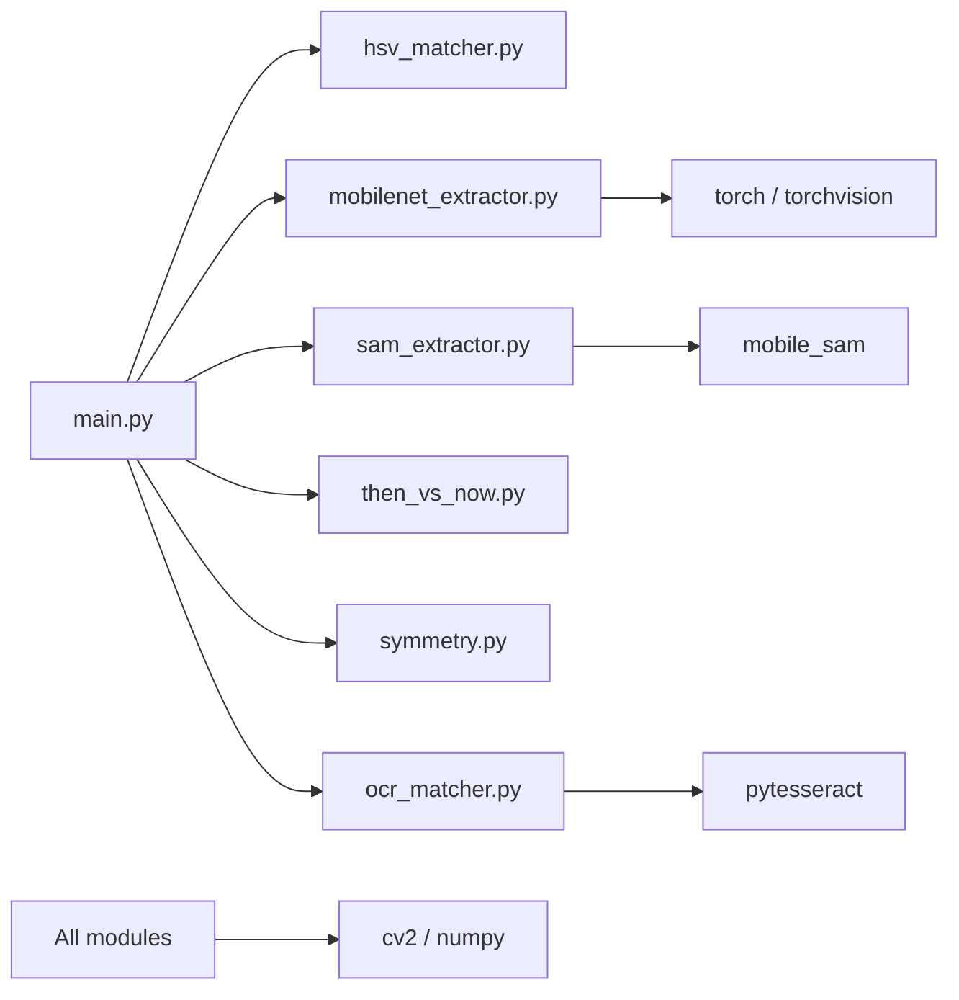

# Computer Vision Algorithms

<cite>
**Referenced Files in This Document**
- [main.py](file://ai-engine/main.py)
- [hsv_matcher.py](file://ai-engine/vision/hsv_matcher.py)
- [mobilenet_extractor.py](file://ai-engine/vision/mobilenet_extractor.py)
- [sam_extractor.py](file://ai-engine/vision/sam_extractor.py)
- [then_vs_now.py](file://ai-engine/vision/then_vs_now.py)
- [symmetry.py](file://ai-engine/vision/symmetry.py)
- [ocr_matcher.py](file://ai-engine/vision/ocr_matcher.py)
</cite>

## Table of Contents
1. [Introduction](#introduction)
2. [Project Structure](#project-structure)
3. [Core Components](#core-components)
4. [Architecture Overview](#architecture-overview)
5. [Detailed Component Analysis](#detailed-component-analysis)
6. [Dependency Analysis](#dependency-analysis)
7. [Performance Considerations](#performance-considerations)
8. [Troubleshooting Guide](#troubleshooting-guide)
9. [Conclusion](#conclusion)

## Introduction
This document explains the computer vision algorithms implemented in the AI engine, focusing on their purpose, implementation approach, and integration within the processing pipeline. The system provides several specialized evaluation endpoints:

- HSV color matching using Bhattacharyya distance for color space analysis
- MobileNet feature extraction for texture similarity through cosine similarity
- SAM (Segment Anything Model) integration for shape detection with aligned Jaccard index calculation
- SIFT feature matching for archival image comparison
- Symmetry detection via structural similarity
- OCR-based plaque recognition

The FastAPI application orchestrates these modules, exposing REST endpoints that accept image payloads and return standardized evaluation results.

## Project Structure
The AI engine is a Python service built with FastAPI. Each algorithm lives in its own module under ai-engine/vision, and main.py wires them into HTTP endpoints.

**Diagram sources**
- [main.py:1-157](file://ai-engine/main.py#L1-L157)
- [hsv_matcher.py:1-62](file://ai-engine/vision/hsv_matcher.py#L1-L62)
- [mobilenet_extractor.py:1-50](file://ai-engine/vision/mobilenet_extractor.py#L1-L50)
- [sam_extractor.py:1-90](file://ai-engine/vision/sam_extractor.py#L1-L90)
- [then_vs_now.py:1-48](file://ai-engine/vision/then_vs_now.py#L1-L48)
- [symmetry.py:1-65](file://ai-engine/vision/symmetry.py#L1-L65)
- [ocr_matcher.py:1-79](file://ai-engine/vision/ocr_matcher.py#L1-L79)

**Section sources**
- [main.py:1-157](file://ai-engine/main.py#L1-L157)

## Core Components
- HSV Color Matching: Computes normalized Hue-Saturation histograms and compares them using Bhattacharyya distance to produce a similarity score.
- MobileNet Texture Similarity: Uses a pre-trained MobileNet V2 to extract embeddings and computes cosine similarity between upload and reference images.
- SAM Shape Detection: Detects shapes using SAM with a dynamic crosshair prompt and evaluates overlap against a target mask using the aligned Jaccard index.
- SIFT Archival Comparison: Detects keypoints and descriptors with SIFT, applies Lowe’s ratio test and RANSAC geometric verification, and counts inliers.
- Symmetry Detection: Mirrors one half of a blurred grayscale image and compares it to the other half using SSIM.
- OCR Plaque Recognition: Preprocesses images for engraved text, runs Tesseract OCR, normalizes text, and compares strings using SequenceMatcher.

**Section sources**
- [hsv_matcher.py:1-62](file://ai-engine/vision/hsv_matcher.py#L1-L62)
- [mobilenet_extractor.py:1-50](file://ai-engine/vision/mobilenet_extractor.py#L1-L50)
- [sam_extractor.py:1-90](file://ai-engine/vision/sam_extractor.py#L1-L90)
- [then_vs_now.py:1-48](file://ai-engine/vision/then_vs_now.py#L1-L48)
- [symmetry.py:1-65](file://ai-engine/vision/symmetry.py#L1-L65)
- [ocr_matcher.py:1-79](file://ai-engine/vision/ocr_matcher.py#L1-L79)

## Architecture Overview
The FastAPI server exposes endpoints that read image bytes, delegate to the appropriate vision module, and return a standardized EvaluationResult containing confidence_score, passed, and message.

**Diagram sources**
- [main.py:77-157](file://ai-engine/main.py#L77-L157)

## Detailed Component Analysis

### HSV Color Matching (Bhattacharyya Distance)
Purpose:
- Compare color distributions robustly by working in HSV space and ignoring low-saturation pixels that carry little hue information.

Implementation approach:
- Decodes image bytes to an OpenCV matrix, converts to HSV.
- Optionally combines an external binary mask (e.g., from SAM) with a saturation gate (S >= 30).
- Builds a 2D histogram over Hue (12 bins) and Saturation (8 bins), normalizes it, and flattens it.
- Compares upload and reference histograms using Bhattacharyya distance; converts to similarity in [0,1].

Input/output formats:
- Input: Two images as bytes; optional mask bytes for targeted regions.
- Output: A float similarity score in [0,1] used by the endpoint to set passed based on threshold.

Threshold configuration:
- Endpoint threshold: 0.80 for passing.

Performance characteristics:
- CPU-only, vectorized NumPy/OpenCV operations.
- Histogram computation is fast; suitable for real-time scoring.

Integration:
- Exposed via /api/v1/hsv-match.

**Diagram sources**
- [hsv_matcher.py:4-62](file://ai-engine/vision/hsv_matcher.py#L4-L62)

**Section sources**
- [hsv_matcher.py:4-62](file://ai-engine/vision/hsv_matcher.py#L4-L62)
- [main.py:95-111](file://ai-engine/main.py#L95-L111)

### MobileNet Feature Extraction (Cosine Similarity)
Purpose:
- Measure structural/textural similarity independent of lighting by extracting deep features from a pre-trained MobileNet V2 and comparing embeddings with cosine similarity.

Implementation approach:
- Loads MobileNet V2 with ImageNet weights at module import time.
- Applies standard preprocessing: resize to 256, center crop to 224, convert to tensor, normalize with ImageNet stats.
- Converts input bytes to grayscale then RGB to reduce lighting sensitivity before embedding.
- Extracts features and pools to a 1D vector (1280 dimensions).
- Computes cosine similarity between upload and reference embeddings.

Input/output formats:
- Input: Two images as bytes.
- Output: Float similarity in [-1,1], typically positive for similar textures.

Threshold configuration:
- Endpoint threshold: 0.60 for passing.

Model loading and memory management:
- Model loaded once at startup and kept in memory.
- Inference runs without gradients to save memory.

Optimization techniques:
- Grayscale conversion reduces color variance.
- Batched inference can be added later if needed.

Integration:
- Exposed via /api/v1/texture-match.

**Diagram sources**
- [mobilenet_extractor.py:11-50](file://ai-engine/vision/mobilenet_extractor.py#L11-L50)

**Section sources**
- [mobilenet_extractor.py:11-50](file://ai-engine/vision/mobilenet_extractor.py#L11-L50)
- [main.py:113-125](file://ai-engine/main.py#L113-L125)

### SAM Shape Detection (Aligned Jaccard Index)
Purpose:
- Segment the primary shape in the player’s image using SAM prompted by a dynamic crosshair, then compare the segmented mask to a reference mask using the Jaccard index after bounding-box alignment and resizing.

Implementation approach:
- Initializes SAM predictor with vit_t checkpoint; moves model to GPU if available.
- For each request, sets the image, defines a 5-point crosshair centered in the image, and predicts a single mask.
- Aligns masks by cropping both to their bounding boxes and resizing the player mask to match the reference crop size.
- Computes Jaccard index (IoU) on boolean masks.

Input/output formats:
- Input: Player image bytes and target mask bytes (grayscale/binary).
- Output: Float IoU in [0,1].

Threshold configuration:
- Endpoint threshold: 0.75 for passing.

Memory and device considerations:
- Predictor is created once at import; uses CUDA when available.
- Masks are processed as NumPy arrays; minimal memory overhead.

Integration:
- Exposed via /api/v1/sam-extract.

**Diagram sources**
- [sam_extractor.py:6-90](file://ai-engine/vision/sam_extractor.py#L6-L90)
- [main.py:77-93](file://ai-engine/main.py#L77-L93)

**Section sources**
- [sam_extractor.py:6-90](file://ai-engine/vision/sam_extractor.py#L6-L90)
- [main.py:77-93](file://ai-engine/main.py#L77-L93)

### SIFT Feature Matching (Archival Comparison)
Purpose:
- Match historical/archival images to current captures by detecting SIFT keypoints and descriptors, filtering matches with Lowe’s ratio test, and verifying geometry with RANSAC homography.

Implementation approach:
- Decodes both images to grayscale.
- Runs SIFT detectAndCompute on both images.
- Matches descriptors using BFMatcher with k=2.
- Applies Lowe’s ratio test (threshold 0.75).
- Estimates homography with RANSAC (error threshold 5.0) and counts inliers.
- Returns number of inliers and pass/fail based on min_matches.

Input/output formats:
- Input: Two grayscale-compatible images as bytes.
- Output: Dict with matches (count) and passed (bool).

Threshold configuration:
- Default min_matches: 15.
- Endpoint returns matches count; passed determined by whether inliers >= min_matches.

Performance characteristics:
- CPU-bound OpenCV operations; efficient for moderate-resolution images.
- Ratio test and RANSAC reduce false positives.

Integration:
- Exposed via /api/v1/sift-match.

**Diagram sources**
- [then_vs_now.py:4-48](file://ai-engine/vision/then_vs_now.py#L4-L48)

**Section sources**
- [then_vs_now.py:4-48](file://ai-engine/vision/then_vs_now.py#L4-L48)
- [main.py:127-138](file://ai-engine/main.py#L127-L138)

### Symmetry Detection (SSIM-Based)
Purpose:
- Assess bilateral symmetry by mirroring one half of a heavily blurred grayscale image and comparing it to the other half using SSIM.

Implementation approach:
- Converts image to grayscale and applies Gaussian blur to suppress fine details.
- Splits image vertically at midpoint, mirrors left half, and computes SSIM against right half.
- Converts SSIM to percentage and applies a generous threshold to tolerate minor camera skew.

Input/output formats:
- Input: Single image bytes.
- Output: Dict with similarity_score (percentage) and passed (bool).

Threshold configuration:
- Passed if similarity_score >= 40.0%.

Performance characteristics:
- Pure OpenCV implementation; very fast.

Integration:
- Exposed via /api/v1/symmetry.

**Diagram sources**
- [symmetry.py:4-65](file://ai-engine/vision/symmetry.py#L4-L65)

**Section sources**
- [symmetry.py:4-65](file://ai-engine/vision/symmetry.py#L4-L65)
- [main.py:140-150](file://ai-engine/main.py#L140-L150)

### OCR-Based Plaque Recognition
Purpose:
- Recognize engraved or weathered text on plaques by preprocessing images for Tesseract OCR and comparing extracted text with a reference using string similarity.

Implementation approach:
- Decodes image, converts to grayscale, optionally upscales small images.
- Applies light denoising and adaptive thresholding to handle uneven lighting/glare.
- Runs Tesseract to extract text.
- Normalizes text (lowercase, strip punctuation, collapse whitespace).
- Compares normalized strings using difflib.SequenceMatcher.

Input/output formats:
- Input: Two images as bytes (upload and reference).
- Output: Dict with confidence_score, passed, and message.

Threshold configuration:
- Global THRESHOLD: 0.75 for passing.

Error handling:
- If no readable text is found in the reference, returns confidence_score 0.0 and passed False with a descriptive message.

Integration:
- Exposed via /api/v1/ocr-match.

**Diagram sources**
- [ocr_matcher.py:7-79](file://ai-engine/vision/ocr_matcher.py#L7-L79)

**Section sources**
- [ocr_matcher.py:7-79](file://ai-engine/vision/ocr_matcher.py#L7-L79)
- [main.py:152-157](file://ai-engine/main.py#L152-L157)

## Dependency Analysis
The FastAPI server imports all vision modules and routes requests to them. Some modules initialize heavy models at import time (MobileNet, SAM), while others are stateless functions.

**Diagram sources**
- [main.py:1-6](file://ai-engine/main.py#L1-L6)
- [mobilenet_extractor.py:1-6](file://ai-engine/vision/mobilenet_extractor.py#L1-L6)
- [sam_extractor.py:1-4](file://ai-engine/vision/sam_extractor.py#L1-L4)
- [ocr_matcher.py:1-5](file://ai-engine/vision/ocr_matcher.py#L1-L5)

**Section sources**
- [main.py:1-6](file://ai-engine/main.py#L1-L6)

## Performance Considerations
- Model Loading Strategy:
  - MobileNet V2 is loaded once at module import and kept in memory for repeated inference.
  - SAM predictor is initialized once at import; ensure the checkpoint exists to avoid runtime warnings.
- Memory Management:
  - Use torch.no_grad() during MobileNet inference to avoid storing intermediate gradients.
  - Convert inputs to grayscale where appropriate (MobileNet path, SIFT path) to reduce computational load.
- GPU Optimization:
  - Move SAM to CUDA when available; keep tensors on the same device as the model.
  - Batch multiple requests if possible to amortize model load overhead.
- Algorithmic Optimizations:
  - HSV matcher uses compact 12x8 histograms and avoids achromatic noise via saturation gating.
  - SIFT uses Lowe’s ratio test and RANSAC to minimize false matches.
  - Symmetry detection blurs images to focus on large-scale structure and uses a permissive threshold.
- I/O Efficiency:
  - Read image bytes directly and decode only once per algorithm call.
  - Avoid unnecessary conversions; reuse decoded arrays where feasible.

[No sources needed since this section provides general guidance]

## Troubleshooting Guide
Common issues and resolutions:
- SAM weights missing:
  - Symptom: Warning printed about missing checkpoint; predictor is None.
  - Resolution: Place mobile_sam.pt at the expected path and restart the service.
- No readable text in OCR:
  - Symptom: evaluate_plaque returns confidence_score 0.0 and passed False.
  - Resolution: Improve image quality, increase resolution, or adjust preprocessing parameters.
- Low SIFT matches:
  - Symptom: passed is False due to insufficient inliers.
  - Resolution: Ensure sufficient overlap between archival and current images; consider adjusting min_matches.
- Poor HSV similarity:
  - Symptom: similarity below threshold.
  - Resolution: Verify reference image is clean/cropped; check saturation gating behavior for achromatic content.
- Symmetry threshold too strict/lenient:
  - Symptom: borderline cases fail/pass unexpectedly.
  - Resolution: Tune the percentage threshold in the symmetry evaluator according to use case.

**Section sources**
- [sam_extractor.py:6-16](file://ai-engine/vision/sam_extractor.py#L6-L16)
- [ocr_matcher.py:53-79](file://ai-engine/vision/ocr_matcher.py#L53-L79)
- [then_vs_now.py:4-48](file://ai-engine/vision/then_vs_now.py#L4-L48)
- [hsv_matcher.py:4-62](file://ai-engine/vision/hsv_matcher.py#L4-L62)
- [symmetry.py:31-65](file://ai-engine/vision/symmetry.py#L31-L65)

## Conclusion
The AI engine integrates six complementary computer vision algorithms to evaluate user-submitted images across color, texture, shape, archival consistency, symmetry, and textual content. Each algorithm is encapsulated in a dedicated module and exposed through FastAPI endpoints with clear thresholds and standardized responses. Proper model initialization, device placement, and preprocessing steps ensure robust performance across diverse inputs.

[No sources needed since this section summarizes without analyzing specific files]