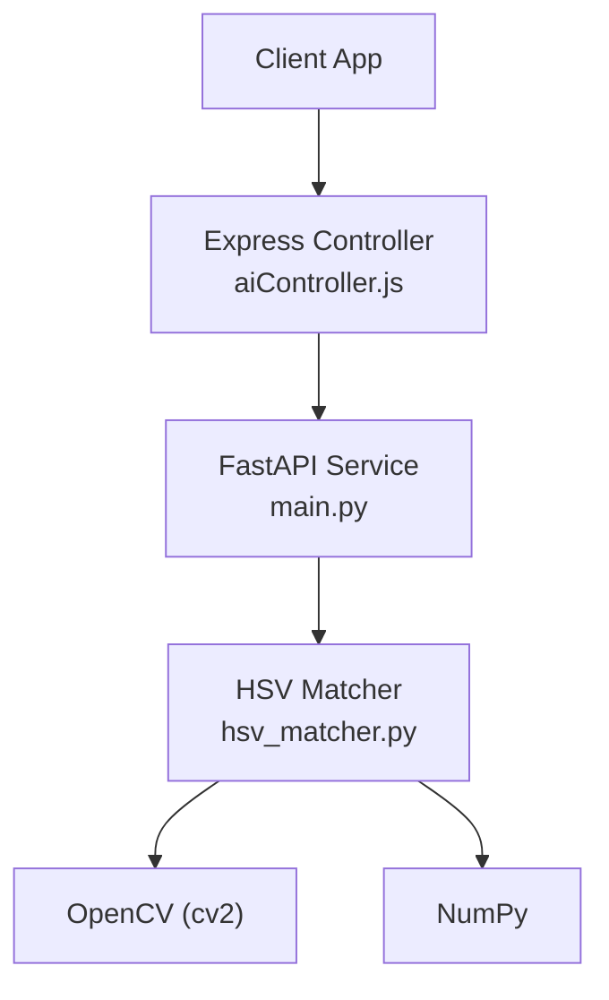
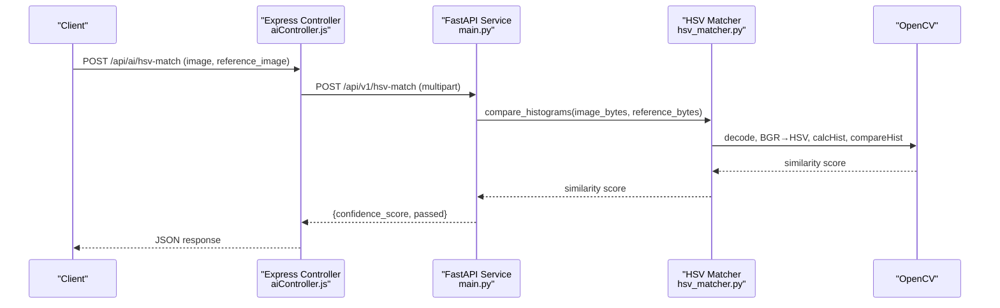
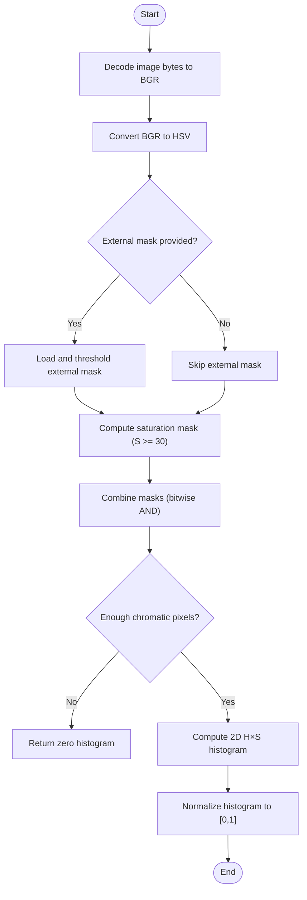
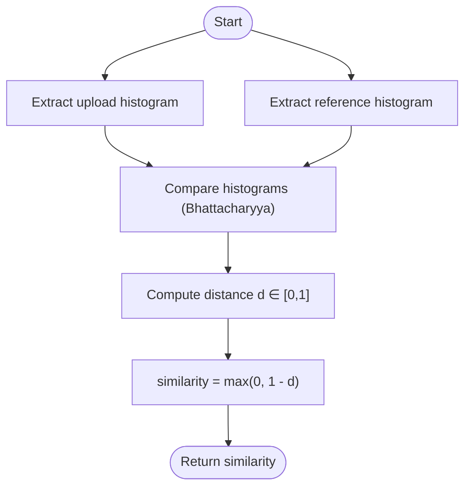
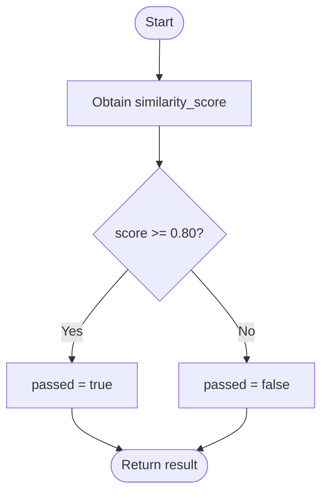
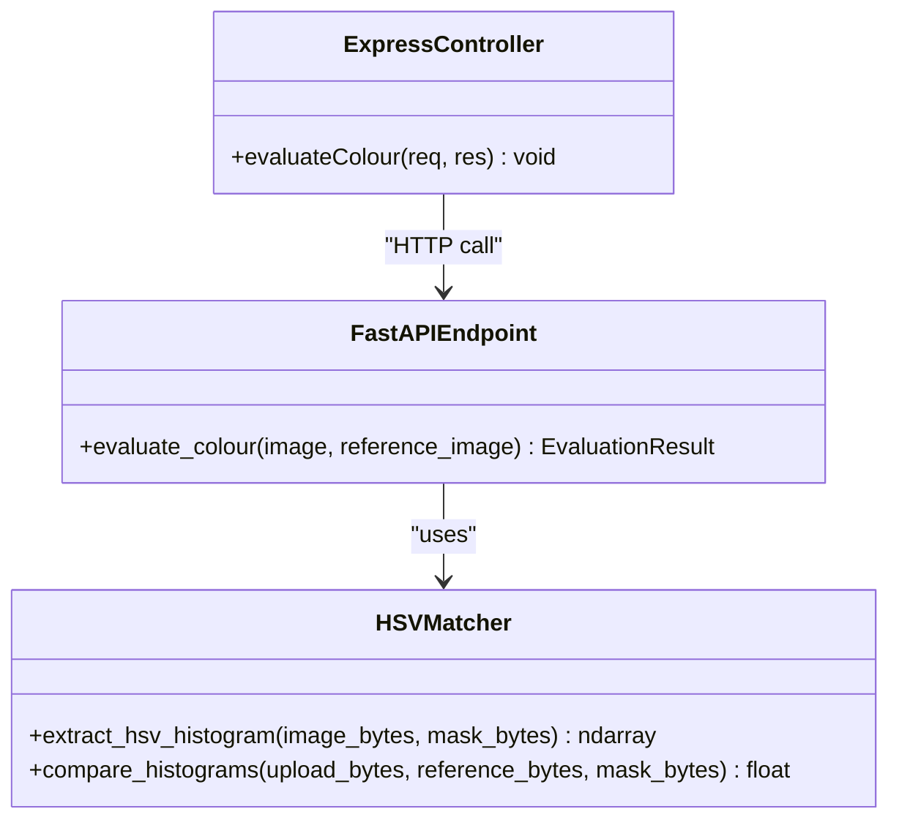
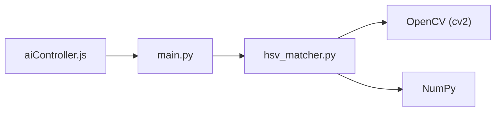

# HSV Color Matching Algorithm

<cite>
**Referenced Files in This Document**
- [hsv_matcher.py](file://ai-engine/vision/hsv_matcher.py)
- [main.py](file://ai-engine/main.py)
- [aiController.js](file://server/src/controllers/aiController.js)
</cite>

## Table of Contents
1. [Introduction](#introduction)
2. [Project Structure](#project-structure)
3. [Core Components](#core-components)
4. [Architecture Overview](#architecture-overview)
5. [Detailed Component Analysis](#detailed-component-analysis)
6. [Dependency Analysis](#dependency-analysis)
7. [Performance Considerations](#performance-considerations)
8. [Troubleshooting Guide](#troubleshooting-guide)
9. [Conclusion](#conclusion)

## Introduction
This document explains the HSV color matching algorithm used to evaluate whether a player’s uploaded image matches a reference image by comparing their color distributions. The implementation:
- Converts images from BGR to HSV color space
- Masks out low-saturation pixels to avoid misleading hue information
- Builds a 2D Hue-Saturation histogram
- Compares histograms using the Bhattacharyya distance
- Produces a similarity score and a pass/fail decision based on a threshold

The algorithm is exposed via an API endpoint that accepts two images (upload and reference), computes the similarity, and returns a confidence score along with a boolean pass flag.

## Project Structure
The HSV color matching feature spans three key files:
- ai-engine/vision/hsv_matcher.py: Core algorithm for HSV histogram extraction and comparison
- ai-engine/main.py: FastAPI service exposing /api/v1/hsv-match
- server/src/controllers/aiController.js: Express controller forwarding client requests to the AI engine

**Diagram sources**
- [aiController.js:34-63](file://server/src/controllers/aiController.js#L34-L63)
- [main.py:95-111](file://ai-engine/main.py#L95-L111)
- [hsv_matcher.py:4-62](file://ai-engine/vision/hsv_matcher.py#L4-L62)

**Section sources**
- [hsv_matcher.py:1-62](file://ai-engine/vision/hsv_matcher.py#L1-L62)
- [main.py:95-111](file://ai-engine/main.py#L95-L111)
- [aiController.js:34-63](file://server/src/controllers/aiController.js#L34-L63)

## Core Components
- HSV Histogram Extraction
  - Decodes image bytes to a BGR image
  - Converts to HSV
  - Applies a saturation mask to discard achromatic pixels
  - Optionally combines with an external binary mask
  - Computes a normalized 2D histogram over Hue (12 bins) and Saturation (8 bins)
- Histogram Comparison
  - Uses Bhattacharyya distance between upload and reference histograms
  - Converts distance to a similarity score in [0, 1]
- API Endpoint
  - Accepts two images (image and reference_image)
  - Returns confidence_score and passed flag (threshold-based)

**Section sources**
- [hsv_matcher.py:4-62](file://ai-engine/vision/hsv_matcher.py#L4-L62)
- [main.py:95-111](file://ai-engine/main.py#L95-L111)

## Architecture Overview
The end-to-end flow for HSV color matching:

**Diagram sources**
- [aiController.js:34-63](file://server/src/controllers/aiController.js#L34-L63)
- [main.py:95-111](file://ai-engine/main.py#L95-L111)
- [hsv_matcher.py:52-62](file://ai-engine/vision/hsv_matcher.py#L52-L62)

## Detailed Component Analysis

### HSV Histogram Extraction Pipeline
The pipeline transforms raw image bytes into a normalized 2D histogram robust to lighting variations by focusing on chromatic content.

Key steps:
- Decode image bytes to a BGR image
- Convert to HSV color space
- Build a combined mask:
  - Optional external binary mask (e.g., from segmentation)
  - Saturation gate discarding pixels with low saturation
- If too few chromatic pixels remain, return a zero histogram to penalize achromatic uploads against chromatic references
- Compute a 2D histogram over Hue (12 bins, range 0–179) and Saturation (8 bins, range 0–255)
- Normalize the histogram to [0, 1] per bin

**Diagram sources**
- [hsv_matcher.py:4-50](file://ai-engine/vision/hsv_matcher.py#L4-L50)

**Section sources**
- [hsv_matcher.py:4-50](file://ai-engine/vision/hsv_matcher.py#L4-L50)

### Bhattacharyya Distance and Similarity Scoring
After extracting histograms for both the upload and reference images, the algorithm compares them using the Bhattacharyya distance. A lower distance indicates higher similarity. The implementation converts this distance into a similarity score in [0, 1] by subtracting the distance from 1 and clamping at 0.

**Diagram sources**
- [hsv_matcher.py:52-62](file://ai-engine/vision/hsv_matcher.py#L52-L62)

**Section sources**
- [hsv_matcher.py:52-62](file://ai-engine/vision/hsv_matcher.py#L52-L62)

### Threshold-Based Matching Logic
The API endpoint applies a fixed threshold to determine pass/fail:
- Passed if similarity_score >= 0.80
- Otherwise failed

This threshold can be tuned depending on use cases and environmental conditions.

**Diagram sources**
- [main.py:95-111](file://ai-engine/main.py#L95-L111)

**Section sources**
- [main.py:95-111](file://ai-engine/main.py#L95-L111)

### Input Image Processing and Color Space Transformations
- Input format: Two multipart images are accepted:
  - image: Player’s uploaded image
  - reference_image: Creator’s reference image
- Processing:
  - Both images are decoded and converted to HSV
  - Only chromatic pixels (saturation above a threshold) contribute to the histogram
  - An optional external mask can restrict computation to specific regions

**Diagram sources**
- [hsv_matcher.py:4-62](file://ai-engine/vision/hsv_matcher.py#L4-L62)
- [main.py:95-111](file://ai-engine/main.py#L95-L111)
- [aiController.js:34-63](file://server/src/controllers/aiController.js#L34-L63)

**Section sources**
- [hsv_matcher.py:4-62](file://ai-engine/vision/hsv_matcher.py#L4-L62)
- [main.py:95-111](file://ai-engine/main.py#L95-L111)
- [aiController.js:34-63](file://server/src/controllers/aiController.js#L34-L63)

## Dependency Analysis
- hsv_matcher.py depends on:
  - cv2 (OpenCV): image decoding, color conversion, histogram computation, histogram comparison
  - numpy: array handling
- main.py depends on:
  - FastAPI: HTTP endpoints, request parsing
  - hsv_matcher: core algorithm
- aiController.js depends on:
  - Node Fetch: calling the AI engine
  - Express: routing and request handling

**Diagram sources**
- [hsv_matcher.py:1-2](file://ai-engine/vision/hsv_matcher.py#L1-L2)
- [main.py:6](file://ai-engine/main.py#L6)
- [aiController.js:34-63](file://server/src/controllers/aiController.js#L34-L63)

**Section sources**
- [hsv_matcher.py:1-2](file://ai-engine/vision/hsv_matcher.py#L1-L2)
- [main.py:6](file://ai-engine/main.py#L6)
- [aiController.js:34-63](file://server/src/controllers/aiController.js#L34-L63)

## Performance Considerations
- Histogram resolution
  - 12×8 bins balances discriminative power and computational cost
  - Increasing bins improves detail but may increase sensitivity to noise
- Saturation gating
  - Discards low-saturation pixels to reduce noise from achromatic regions
  - Adjusting the saturation threshold can improve robustness under varying lighting
- Normalization
  - Min-max normalization ensures consistent scale across images
- External masks
  - Using segmentation masks (e.g., SAM) can focus computation on relevant regions and reduce background noise
- Real-time processing
  - Avoid unnecessary re-decoding; reuse buffers where possible
  - Pre-crop or downscale large images before processing
  - Batch multiple comparisons when feasible

[No sources needed since this section provides general guidance]

## Troubleshooting Guide
Common issues and remedies:
- Low similarity scores due to lighting changes
  - Ensure sufficient saturation; very bright or dark images may yield weak hue signals
  - Consider adjusting the saturation threshold or applying exposure correction upstream
- Background noise affecting results
  - Provide an external mask to limit computation to the target region
  - Use pre-cropped reference images to minimize irrelevant background
- Achromatic images scoring near zero
  - The algorithm intentionally returns a zero histogram when few chromatic pixels survive, leading to low similarity against chromatic references
  - Validate input images contain meaningful color content
- API errors
  - Missing required files: ensure both image and reference_image are attached
  - Network or CORS issues: verify allowed origins and headers in the FastAPI service configuration

**Section sources**
- [main.py:95-111](file://ai-engine/main.py#L95-L111)
- [aiController.js:34-63](file://server/src/controllers/aiController.js#L34-L63)

## Conclusion
The HSV color matching algorithm provides a lightweight, interpretable method for evaluating color similarity between images. By focusing on chromatic content through saturation gating and comparing Hue-Saturation histograms via Bhattacharyya distance, it achieves robust performance under varied lighting. The API exposes a simple interface returning a confidence score and pass/fail decision. Tuning thresholds, leveraging external masks, and optimizing preprocessing can further improve accuracy and efficiency for real-world scenarios.

[No sources needed since this section summarizes without analyzing specific files]