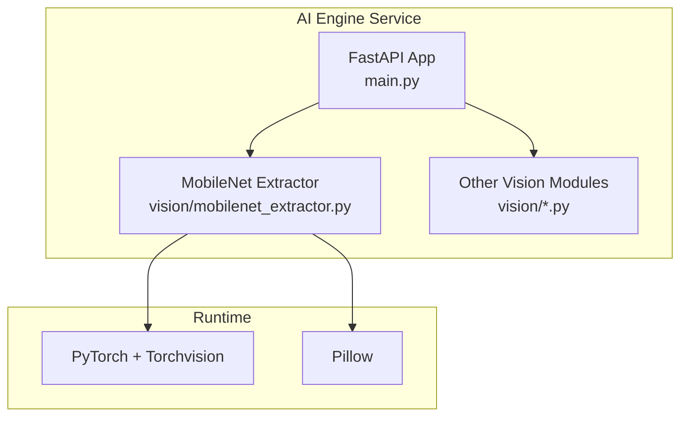
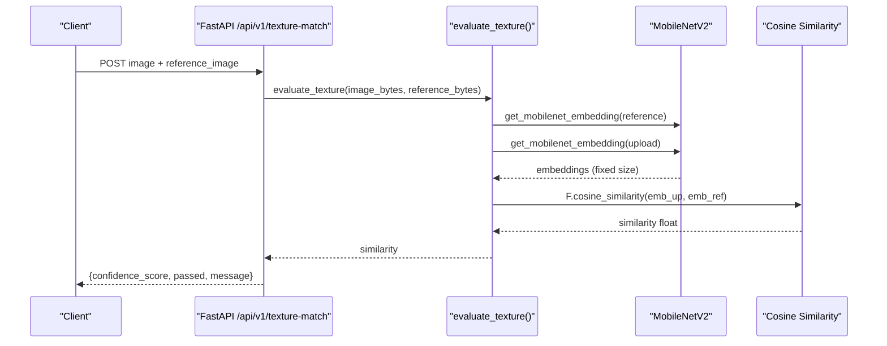
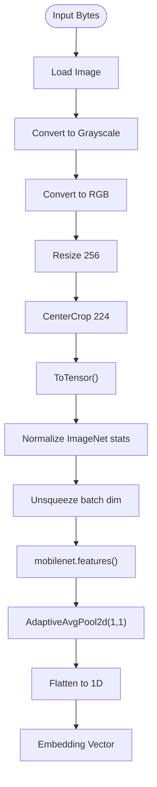
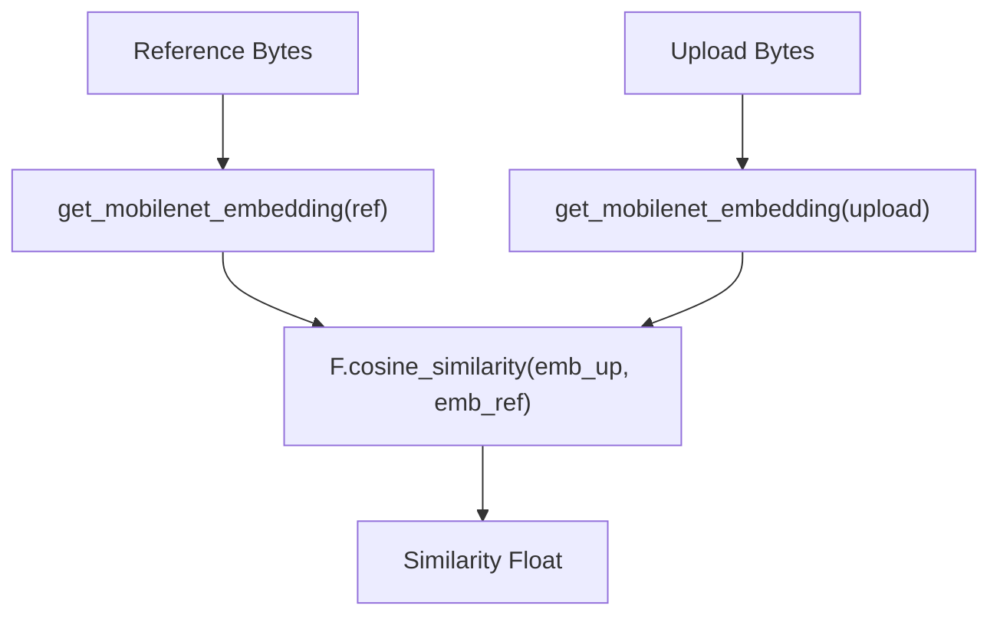
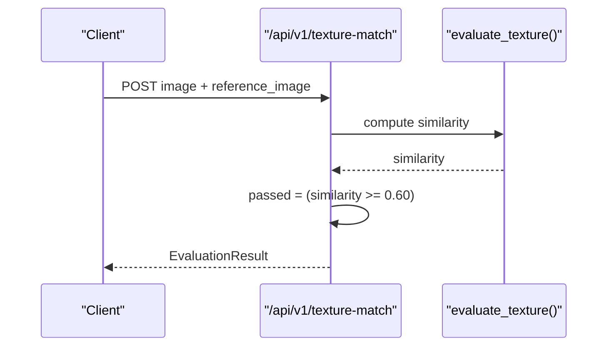
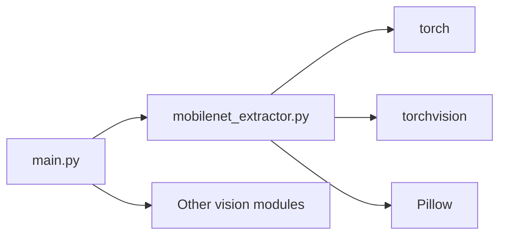

# MobileNet Feature Extraction

<cite>
**Referenced Files in This Document**
- [mobilenet_extractor.py](file://ai-engine/vision/mobilenet_extractor.py)
- [main.py](file://ai-engine/main.py)
- [requirements.txt](file://ai-engine/requirements.txt)
- [Dockerfile](file://ai-engine/Dockerfile)
- [DEPLOYMENT.md](file://ai-engine/DEPLOYMENT.md)
- [sam_extractor.py](file://ai-engine/vision/sam_extractor.py)
</cite>

## Table of Contents
1. [Introduction](#introduction)
2. [Project Structure](#project-structure)
3. [Core Components](#core-components)
4. [Architecture Overview](#architecture-overview)
5. [Detailed Component Analysis](#detailed-component-analysis)
6. [Dependency Analysis](#dependency-analysis)
7. [Performance Considerations](#performance-considerations)
8. [Troubleshooting Guide](#troubleshooting-guide)
9. [Conclusion](#conclusion)

## Introduction
This document explains the MobileNet-based feature extraction system used for texture and pattern recognition within the WARG AI Engine. It covers the convolutional neural network architecture, preprocessing pipeline, cosine similarity calculations for comparing feature vectors, model loading optimization strategies, and deployment considerations including GPU acceleration, memory management, and quantization options.

## Project Structure
The MobileNet feature extraction is implemented as a Python module under the AI engine service and exposed via FastAPI endpoints. The key files are:
- Vision module implementing MobileNet embedding and similarity scoring
- API layer exposing endpoints that accept images and return evaluation results
- Runtime configuration and deployment artifacts

**Diagram sources**
- [main.py:1-157](file://ai-engine/main.py#L1-L157)
- [mobilenet_extractor.py:1-50](file://ai-engine/vision/mobilenet_extractor.py#L1-L50)

**Section sources**
- [main.py:1-157](file://ai-engine/main.py#L1-L157)
- [mobilenet_extractor.py:1-50](file://ai-engine/vision/mobilenet_extractor.py#L1-L50)

## Core Components
- MobileNetV2 Embedding Module: Loads a pre-trained MobileNetV2 model, applies ImageNet-standard preprocessing, extracts intermediate features, and pools them into a fixed-size vector.
- Texture Similarity Function: Computes cosine similarity between two embeddings to score structural similarity.
- FastAPI Endpoints: Accept image uploads, call the extractor, and return confidence scores with pass/fail decisions based on thresholds.

Key responsibilities:
- Preprocessing: Resize, center crop, tensor conversion, normalization.
- Inference: Feature extraction without gradient computation.
- Comparison: Cosine similarity over flattened pooled features.
- API: Authentication, CORS, health checks, and structured responses.

**Section sources**
- [mobilenet_extractor.py:11-38](file://ai-engine/vision/mobilenet_extractor.py#L11-L38)
- [mobilenet_extractor.py:40-50](file://ai-engine/vision/mobilenet_extractor.py#L40-L50)
- [main.py:113-125](file://ai-engine/main.py#L113-L125)

## Architecture Overview
The texture matching workflow integrates the FastAPI server with the MobileNet extractor. Requests flow from clients through the API layer to the vision module, which performs inference and returns similarity scores.

**Diagram sources**
- [main.py:113-125](file://ai-engine/main.py#L113-L125)
- [mobilenet_extractor.py:24-50](file://ai-engine/vision/mobilenet_extractor.py#L24-L50)

## Detailed Component Analysis

### MobileNetV2 Embedding Pipeline
- Model Loading: Uses torchvision’s MobileNetV2 with ImageNet weights and sets the model to evaluation mode at import time.
- Preprocessing: Resizes to 256 pixels, center crops to 224x224, converts to tensor, and normalizes using ImageNet mean/std.
- Color Handling: Converts input bytes to grayscale then back to RGB to reduce lighting sensitivity while keeping three-channel inputs expected by the model.
- Feature Extraction: Calls the model’s features block, applies adaptive average pooling to 1x1, and flattens to a 1D vector.
- Inference Mode: Disables gradients during embedding extraction to reduce memory usage.

**Diagram sources**
- [mobilenet_extractor.py:16-38](file://ai-engine/vision/mobilenet_extractor.py#L16-L38)

**Section sources**
- [mobilenet_extractor.py:11-38](file://ai-engine/vision/mobilenet_extractor.py#L11-L38)

### Cosine Similarity Scoring
- Two embeddings are computed: one for the reference image and one for the uploaded image.
- Cosine similarity is calculated across the full embedding vectors.
- The resulting scalar is returned as the confidence score.

**Diagram sources**
- [mobilenet_extractor.py:40-50](file://ai-engine/vision/mobilenet_extractor.py#L40-L50)

**Section sources**
- [mobilenet_extractor.py:40-50](file://ai-engine/vision/mobilenet_extractor.py#L40-L50)

### API Endpoint and Thresholding
- Endpoint: `/api/v1/texture-match` accepts two multipart images and calls the extractor.
- Decision Logic: Marks a match as passed if the cosine similarity meets or exceeds a tuned threshold.
- Response: Returns a structured result with confidence score, pass/fail flag, and message.

**Diagram sources**
- [main.py:113-125](file://ai-engine/main.py#L113-L125)

**Section sources**
- [main.py:113-125](file://ai-engine/main.py#L113-L125)

### Data Models and Responses
- EvaluationResult: Contains confidence_score, passed, and message fields.
- TextureEmbeddingResult: Defines embedding list and dimensions for potential future use.

**Section sources**
- [main.py:56-70](file://ai-engine/main.py#L56-L70)

## Dependency Analysis
The MobileNet feature extraction depends on PyTorch and Torchvision for model execution and transforms, and Pillow for image I/O. The FastAPI server orchestrates requests and integrates with other vision modules.

**Diagram sources**
- [main.py:1-10](file://ai-engine/main.py#L1-L10)
- [mobilenet_extractor.py:1-6](file://ai-engine/vision/mobilenet_extractor.py#L1-L6)

**Section sources**
- [requirements.txt:1-12](file://ai-engine/requirements.txt#L1-L12)
- [main.py:1-10](file://ai-engine/main.py#L1-L10)
- [mobilenet_extractor.py:1-6](file://ai-engine/vision/mobilenet_extractor.py#L1-L6)

## Performance Considerations

### Preprocessing and Batch Processing
- Preprocessing steps include resizing, center cropping, tensor conversion, and normalization. These are applied per image in the current implementation.
- Batch processing is not explicitly implemented; each request processes one pair of images sequentially.

Optimization opportunities:
- Implement batching to process multiple images per inference call to amortize model load overhead.
- Cache the preprocessing transform pipeline and reuse it across requests.

**Section sources**
- [mobilenet_extractor.py:16-38](file://ai-engine/vision/mobilenet_extractor.py#L16-L38)

### Feature Vector Dimensions
- The embedding is produced by adaptive average pooling to 1x1 and flattening, yielding a 1D vector. The code comments indicate a dimensionality of 1280.

Practical implications:
- Fixed-length vectors simplify storage and comparison.
- Larger dimensions increase memory footprint but can capture richer texture information.

**Section sources**
- [mobilenet_extractor.py:33-38](file://ai-engine/vision/mobilenet_extractor.py#L33-L38)

### Similarity Thresholds
- The texture endpoint uses a cosine similarity threshold of 0.60 to determine pass/fail.

Guidance:
- Adjust thresholds based on dataset characteristics and desired precision/recall trade-offs.
- Validate thresholds with held-out test sets before production rollout.

**Section sources**
- [main.py:123-124](file://ai-engine/main.py#L123-L124)

### Memory Management
- The model is loaded once at module import time and set to evaluation mode.
- Gradient computation is disabled during embedding extraction to reduce memory usage.
- The Dockerfile and deployment guide specify CPU-only PyTorch and note significant RAM consumption at startup (~400–500 MB). Minimum recommended memory is 1 GB, with 2 GB recommended.

Recommendations:
- Monitor container memory usage and set appropriate resource limits.
- Use process-level restarts or health checks to recover from OOM conditions.

**Section sources**
- [mobilenet_extractor.py:11-14](file://ai-engine/vision/mobilenet_extractor.py#L11-L14)
- [mobilenet_extractor.py:33-38](file://ai-engine/vision/mobilenet_extractor.py#L33-L38)
- [Dockerfile:1-5](file://ai-engine/Dockerfile#L1-L5)
- [DEPLOYMENT.md:8-14](file://ai-engine/DEPLOYMENT.md#L8-L14)

### GPU Acceleration
- The MobileNet extractor does not explicitly move tensors to GPU; inference runs on whatever device PyTorch defaults to (typically CPU in this setup).
- Another vision module demonstrates conditional device placement for CUDA when available.

Options:
- Move the MobileNet model and tensors to CUDA when available to accelerate inference.
- Ensure the runtime environment includes a compatible CUDA-enabled PyTorch build.

**Section sources**
- [mobilenet_extractor.py:11-14](file://ai-engine/vision/mobilenet_extractor.py#L11-L14)
- [sam_extractor.py:10-13](file://ai-engine/vision/sam_extractor.py#L10-L13)

### Model Quantization Options
- No quantization is currently applied to MobileNet in the extractor.
- For deployment efficiency, consider post-training quantization or dynamic quantization supported by PyTorch to reduce model size and improve throughput on CPU.

Caveats:
- Validate accuracy impact after quantization.
- Ensure compatibility with the serving stack and hardware.

[No sources needed since this section provides general guidance]

## Troubleshooting Guide

Common issues and resolutions:
- Out-of-memory errors:
  - Symptom: Container killed due to insufficient RAM.
  - Resolution: Increase container memory to at least 1 GB; prefer 2 GB. Verify environment variables and resource limits.
- Missing dependencies:
  - Symptom: Import errors for torch, torchvision, or Pillow.
  - Resolution: Install requirements from the provided file and ensure correct Python version.
- Slow inference:
  - Symptom: High latency per request.
  - Resolution: Enable GPU acceleration where available; consider batching and quantization.

Operational checks:
- Health endpoint reports model availability and status.
- Use the root endpoint to verify service liveness.

**Section sources**
- [DEPLOYMENT.md:8-14](file://ai-engine/DEPLOYMENT.md#L8-L14)
- [requirements.txt:1-12](file://ai-engine/requirements.txt#L1-L12)
- [main.py:35-52](file://ai-engine/main.py#L35-L52)

## Conclusion
The MobileNet-based feature extraction system provides a robust pipeline for texture and pattern recognition using a pre-trained MobileNetV2 model. It standardizes preprocessing, extracts fixed-dimensional embeddings, and compares them via cosine similarity. The FastAPI integration exposes clear endpoints with tunable thresholds. Deployment focuses on CPU-only operation with careful memory management, while optional GPU acceleration and quantization can further optimize performance and efficiency.