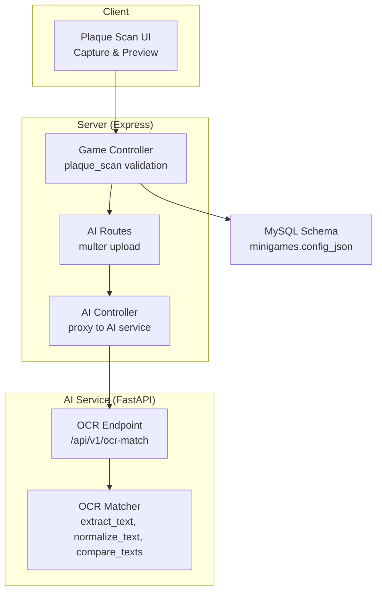
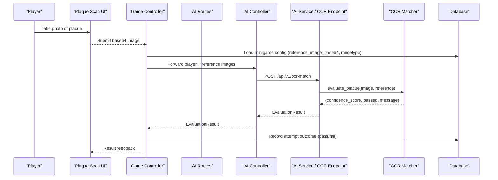
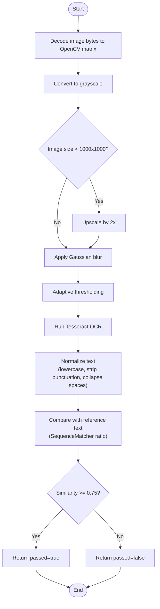
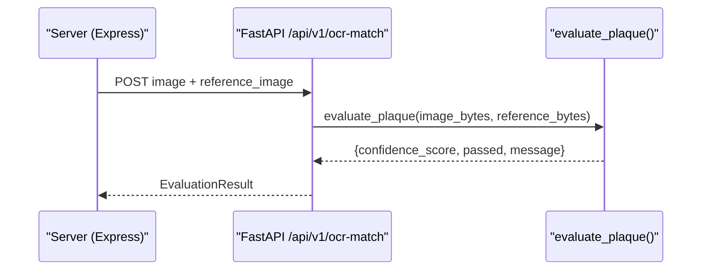
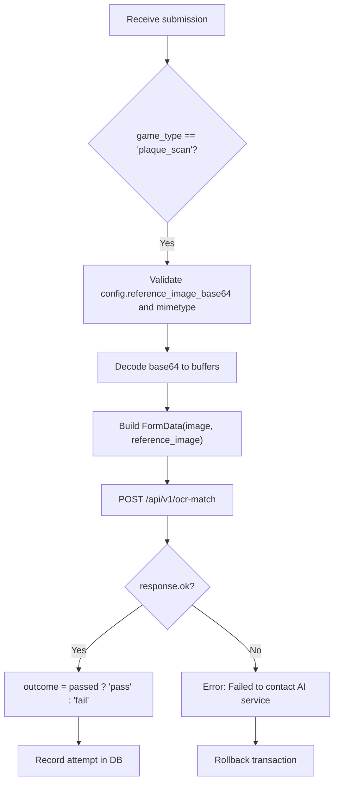
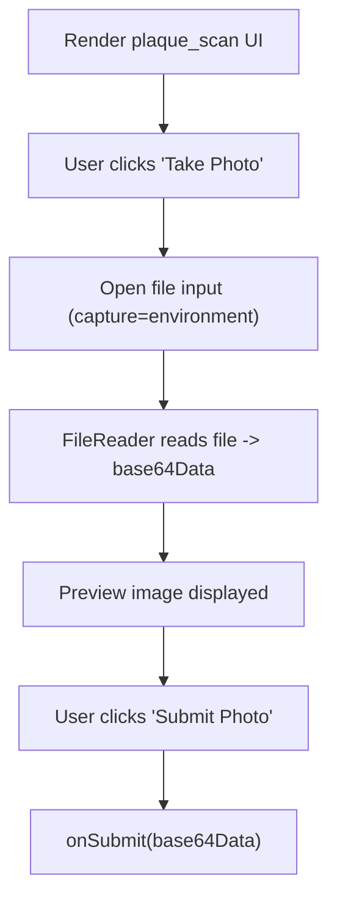
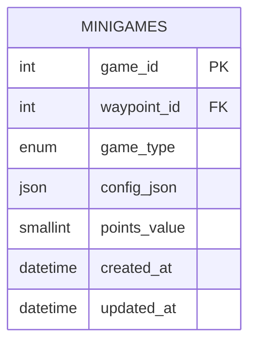
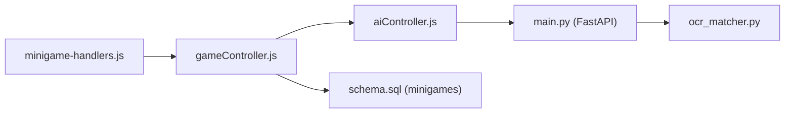

# OCR Plaque Recognition

<cite>
**Referenced Files in This Document**
- [main.py](file://ai-engine/main.py)
- [ocr_matcher.py](file://ai-engine/vision/ocr_matcher.py)
- [mobilenet_extractor.py](file://ai-engine/vision/mobilenet_extractor.py)
- [hsv_matcher.py](file://ai-engine/vision/hsv_matcher.py)
- [then_vs_now.py](file://ai-engine/vision/then_vs_now.py)
- [aiController.js](file://server/src/controllers/aiController.js)
- [gameController.js](file://server/src/controllers/gameController.js)
- [aiRoutes.js](file://server/src/routes/aiRoutes.js)
- [schema.sql](file://database/schema.sql)
- [minigame-handlers.js](file://client/scripts/components/minigame-handlers.js)
</cite>

## Table of Contents
1. [Introduction](#introduction)
2. [Project Structure](#project-structure)
3. [Core Components](#core-components)
4. [Architecture Overview](#architecture-overview)
5. [Detailed Component Analysis](#detailed-component-analysis)
6. [Dependency Analysis](#dependency-analysis)
7. [Performance Considerations](#performance-considerations)
8. [Troubleshooting Guide](#troubleshooting-guide)
9. [Conclusion](#conclusion)
10. [Appendices](#appendices)

## Introduction
This document explains the OCR-based plaque text recognition system used to validate historical plaques and monuments within the WARG platform. It covers the end-to-end pipeline from image capture to text extraction, normalization, fuzzy matching, and integration with the game engine and database. The documentation also provides guidance for handling varied plaque styles, weathering, multilingual content, accuracy improvements, and database integration patterns.

## Project Structure
The OCR plaque recognition feature spans three layers:
- Client: Captures a photo of the plaque and submits it as base64 data.
- Server (Express): Validates the minigame configuration, forwards images to the AI service, and records outcomes.
- AI Service (FastAPI): Performs OCR preprocessing, text extraction, normalization, and fuzzy comparison.

**Diagram sources**
- [minigame-handlers.js:130-187](file://client/scripts/components/minigame-handlers.js#L130-L187)
- [gameController.js:239-274](file://server/src/controllers/gameController.js#L239-L274)
- [aiRoutes.js:1-40](file://server/src/routes/aiRoutes.js#L1-L40)
- [aiController.js:1-163](file://server/src/controllers/aiController.js#L1-L163)
- [main.py:152-157](file://ai-engine/main.py#L152-L157)
- [ocr_matcher.py:9-78](file://ai-engine/vision/ocr_matcher.py#L9-L78)
- [schema.sql:212-246](file://database/schema.sql#L212-L246)

**Section sources**
- [minigame-handlers.js:130-187](file://client/scripts/components/minigame-handlers.js#L130-L187)
- [gameController.js:239-274](file://server/src/controllers/gameController.js#L239-L274)
- [aiRoutes.js:1-40](file://server/src/routes/aiRoutes.js#L1-L40)
- [aiController.js:1-163](file://server/src/controllers/aiController.js#L1-L163)
- [main.py:152-157](file://ai-engine/main.py#L152-L157)
- [ocr_matcher.py:9-78](file://ai-engine/vision/ocr_matcher.py#L9-L78)
- [schema.sql:212-246](file://database/schema.sql#L212-L246)

## Core Components
- OCR Preprocessing and Text Extraction: Converts uploaded images to grayscale, upscales small images, applies Gaussian blur, adaptive thresholding, and runs Tesseract OCR.
- Text Normalization: Lowercases, strips punctuation, collapses whitespace, and trims.
- Fuzzy Matching: Uses sequence similarity to score normalized strings.
- Game Integration: The server validates plaque scan minigame configuration, sends player and reference images to the AI service, and persists pass/fail outcomes.
- Database Schema: Defines minigame types including plaque_scan and stores per-type configuration JSON.

Key responsibilities:
- ai-engine/vision/ocr_matcher.py: OCR pipeline and matching logic.
- ai-engine/main.py: FastAPI endpoint exposing OCR evaluation.
- server/src/controllers/gameController.js: Handles plaque_scan flow and calls AI service.
- database/schema.sql: Minigame type enumeration and config schema.

**Section sources**
- [ocr_matcher.py:9-78](file://ai-engine/vision/ocr_matcher.py#L9-L78)
- [main.py:152-157](file://ai-engine/main.py#L152-L157)
- [gameController.js:239-274](file://server/src/controllers/gameController.js#L239-L274)
- [schema.sql:212-246](file://database/schema.sql#L212-L246)

## Architecture Overview
The OCR plaque recognition workflow integrates client-side capture, server-side orchestration, and AI-driven OCR processing.

**Diagram sources**
- [minigame-handlers.js:130-187](file://client/scripts/components/minigame-handlers.js#L130-L187)
- [gameController.js:239-274](file://server/src/controllers/gameController.js#L239-L274)
- [aiController.js:1-163](file://server/src/controllers/aiController.js#L1-L163)
- [main.py:152-157](file://ai-engine/main.py#L152-L157)
- [ocr_matcher.py:53-78](file://ai-engine/vision/ocr_matcher.py#L53-L78)
- [schema.sql:212-246](file://database/schema.sql#L212-L246)

## Detailed Component Analysis

### OCR Pipeline: Preprocessing, Extraction, Normalization, Matching
The OCR matcher implements a robust pipeline tailored for engraved or weathered text on plaques and monuments.

- Image decoding and grayscale conversion.
- Upscaling small images to improve OCR accuracy.
- Light denoising via Gaussian blur.
- Adaptive thresholding to handle uneven lighting and glare.
- Tesseract OCR to extract raw text.
- Normalization: lowercase, punctuation removal, whitespace collapsing.
- Fuzzy comparison using sequence similarity.

**Diagram sources**
- [ocr_matcher.py:9-78](file://ai-engine/vision/ocr_matcher.py#L9-L78)

**Section sources**
- [ocr_matcher.py:9-78](file://ai-engine/vision/ocr_matcher.py#L9-L78)

### FastAPI OCR Endpoint
The AI service exposes an endpoint that accepts two images: the player’s photo and a reference image configured for the minigame. It returns a standardized evaluation result.

**Diagram sources**
- [main.py:152-157](file://ai-engine/main.py#L152-L157)
- [ocr_matcher.py:53-78](file://ai-engine/vision/ocr_matcher.py#L53-L78)

**Section sources**
- [main.py:152-157](file://ai-engine/main.py#L152-L157)
- [ocr_matcher.py:53-78](file://ai-engine/vision/ocr_matcher.py#L53-L78)

### Server-Side Plaque Scan Validation
The game controller handles plaque_scan minigames by validating configuration, constructing FormData with player and reference images, calling the AI service, and recording outcomes.

**Diagram sources**
- [gameController.js:239-274](file://server/src/controllers/gameController.js#L239-L274)

**Section sources**
- [gameController.js:239-274](file://server/src/controllers/gameController.js#L239-L274)

### Client-Side Plaque Capture UI
The UI component renders a capture interface for plaque scans, previews the selected image, and submits base64 data to the game controller.

**Diagram sources**
- [minigame-handlers.js:130-187](file://client/scripts/components/minigame-handlers.js#L130-L187)

**Section sources**
- [minigame-handlers.js:130-187](file://client/scripts/components/minigame-handlers.js#L130-L187)

### Data Model: Minigame Configuration for Plaque Scans
The database schema defines minigame types and flexible JSON configuration. For plaque_scan, the configuration includes a base64-encoded reference image and its MIME type.

**Diagram sources**
- [schema.sql:212-246](file://database/schema.sql#L212-L246)

**Section sources**
- [schema.sql:212-246](file://database/schema.sql#L212-L246)

## Dependency Analysis
The OCR plaque recognition system depends on several modules across layers:

- Client depends on the plaque_scan UI handler to capture and submit images.
- Server depends on gameController for business logic and aiController for proxying requests.
- AI service depends on vision modules for OCR and other computer vision tasks.
- Database schema defines minigame types and configuration structure.

**Diagram sources**
- [minigame-handlers.js:130-187](file://client/scripts/components/minigame-handlers.js#L130-L187)
- [gameController.js:239-274](file://server/src/controllers/gameController.js#L239-L274)
- [aiController.js:1-163](file://server/src/controllers/aiController.js#L1-L163)
- [main.py:152-157](file://ai-engine/main.py#L152-L157)
- [ocr_matcher.py:9-78](file://ai-engine/vision/ocr_matcher.py#L9-L78)
- [schema.sql:212-246](file://database/schema.sql#L212-L246)

**Section sources**
- [minigame-handlers.js:130-187](file://client/scripts/components/minigame-handlers.js#L130-L187)
- [gameController.js:239-274](file://server/src/controllers/gameController.js#L239-L274)
- [aiController.js:1-163](file://server/src/controllers/aiController.js#L1-L163)
- [main.py:152-157](file://ai-engine/main.py#L152-L157)
- [ocr_matcher.py:9-78](file://ai-engine/vision/ocr_matcher.py#L9-L78)
- [schema.sql:212-246](file://database/schema.sql#L212-L246)

## Performance Considerations
- Image scaling: Small images are upscaled before OCR to improve character recognition quality.
- Adaptive thresholding: Helps mitigate uneven lighting and glare common on metal or stone surfaces.
- Sequence similarity: Lightweight fuzzy matching suitable for short historical texts; consider Levenshtein distance or token-based ratios for longer inscriptions.
- Batch processing: If multiple plaques are processed concurrently, consider queuing OCR jobs to avoid CPU saturation.
- Caching: Cache normalized reference texts and embeddings if references are reused across many attempts.

[No sources needed since this section provides general guidance]

## Troubleshooting Guide
Common issues and resolutions:
- No readable text in reference image: The OCR matcher returns a failed result when the reference contains no text after preprocessing. Ensure the reference image is clear and properly cropped.
- Low similarity scores: Adjust thresholds or enhance preprocessing (e.g., stronger denoising, contrast enhancement).
- AI service connectivity errors: Verify environment variables for AI service URL and API keys; check network reachability and CORS settings.
- Missing configuration: The plaque_scan minigame requires reference_image_base64 and reference_image_mimetype; ensure these fields are present in config_json.

**Section sources**
- [ocr_matcher.py:53-78](file://ai-engine/vision/ocr_matcher.py#L53-L78)
- [gameController.js:239-274](file://server/src/controllers/gameController.js#L239-L274)

## Conclusion
The OCR plaque recognition system provides a practical pipeline for recognizing and validating historical plaque text. It combines robust preprocessing, Tesseract-based OCR, and fuzzy matching to accommodate varied plaque styles and conditions. Integrated into the WARG platform through well-defined server routes and database schemas, it supports gameplay workflows while remaining extensible for multilingual support and advanced accuracy techniques.

[No sources needed since this section summarizes without analyzing specific files]

## Appendices

### Handling Different Plaque Styles and Weathering
- Engraved vs. painted text: Adaptive thresholding helps with both deep engravings and faded paint.
- Glare and shadows: Use additional preprocessing steps such as CLAHE (contrast-limited adaptive histogram equalization) and morphological operations to isolate strokes.
- Curved surfaces: Perspective correction can improve linearity of text lines before OCR.

[No sources needed since this section provides general guidance]

### Multilingual Support
- Configure Tesseract language packs for target languages (e.g., eng+fra+deu).
- Normalize diacritics and transliterate where appropriate to improve matching across historical records.
- Store normalized text variants in database indexes for faster retrieval and comparison.

[No sources needed since this section provides general guidance]

### Accuracy Improvement Techniques
- Multi-scale OCR: Run OCR at multiple scales and aggregate results.
- Confidence scoring: Use Tesseract confidence metrics to filter low-quality extractions.
- Post-processing rules: Apply domain-specific dictionaries and regex patterns to correct common OCR errors in historical texts.

[No sources needed since this section provides general guidance]

### Integration with Historical Databases
- Store extracted text alongside metadata (location, date, source archive).
- Index normalized text fields for search and fuzzy queries.
- Link minigame configurations to archival records to enable provenance tracking.

[No sources needed since this section provides general guidance]