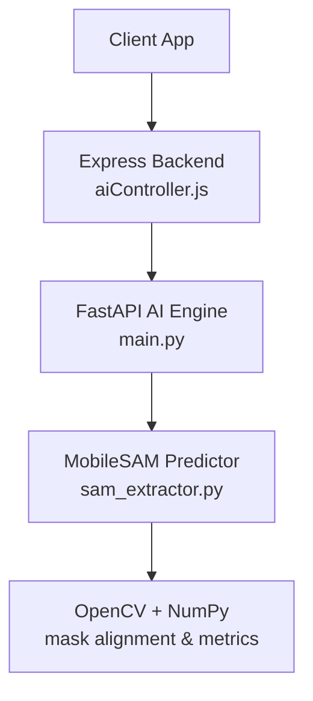
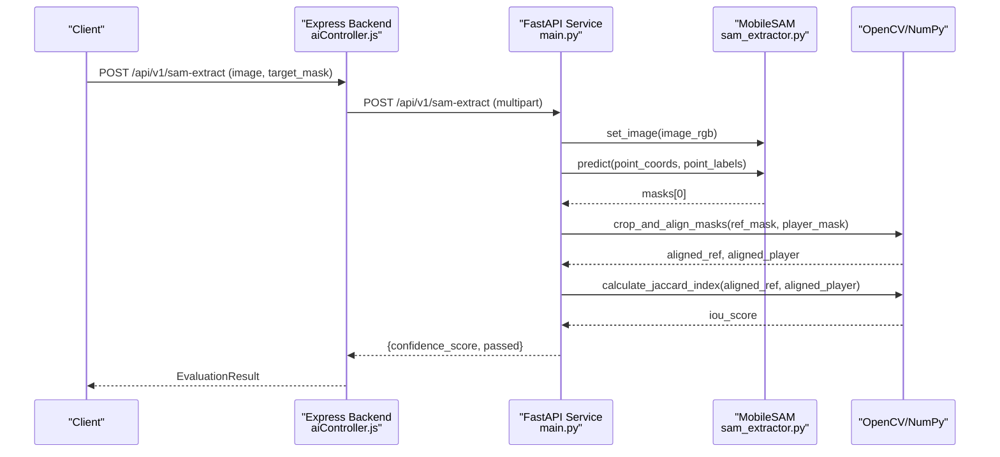
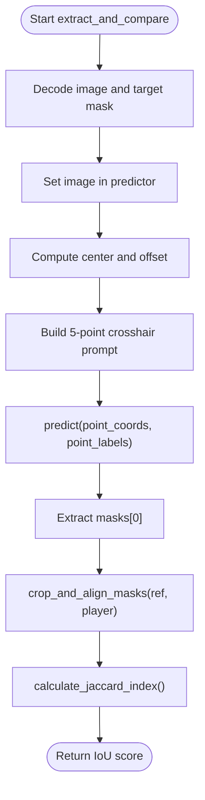
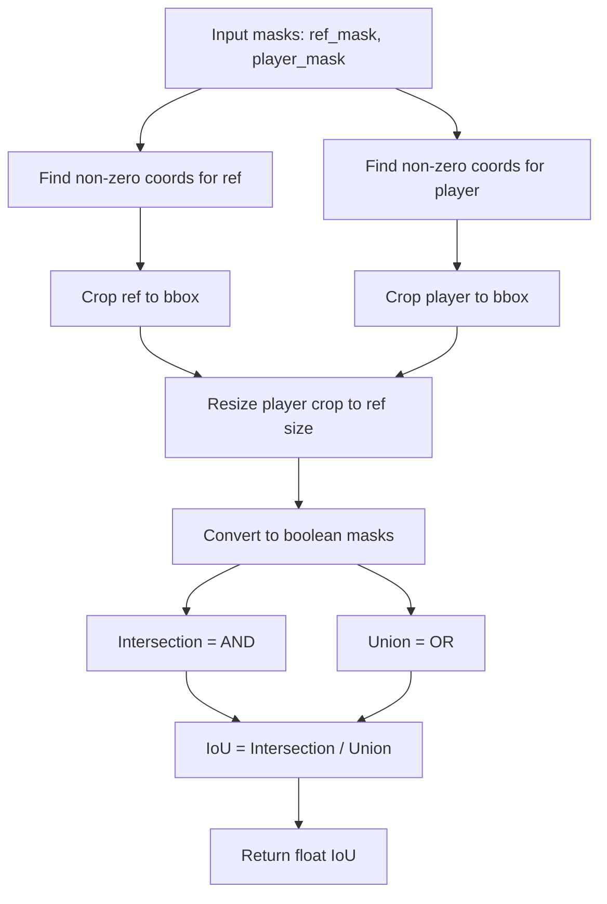
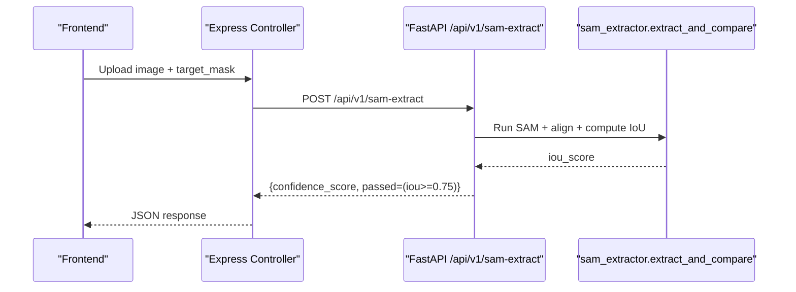
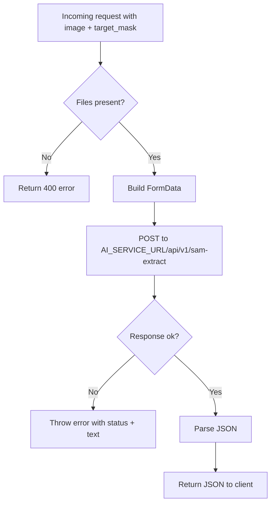
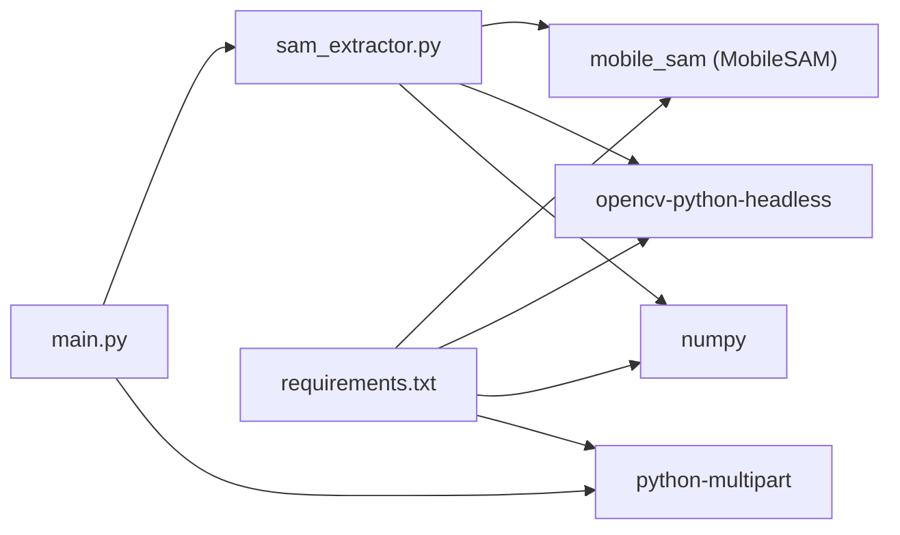

# SAM Shape Detection

<cite>
**Referenced Files in This Document**
- [sam_extractor.py](file://ai-engine/vision/sam_extractor.py)
- [main.py](file://ai-engine/main.py)
- [requirements.txt](file://ai-engine/requirements.txt)
- [DEPLOYMENT.md](file://ai-engine/DEPLOYMENT.md)
- [third-party-code.md](file://warg-docs/docs/8-third-party/third-party-code.md)
- [aiController.js](file://server/src/controllers/aiController.js)
</cite>

## Table of Contents
1. [Introduction](#introduction)
2. [Project Structure](#project-structure)
3. [Core Components](#core-components)
4. [Architecture Overview](#architecture-overview)
5. [Detailed Component Analysis](#detailed-component-analysis)
6. [Dependency Analysis](#dependency-analysis)
7. [Performance Considerations](#performance-considerations)
8. [Troubleshooting Guide](#troubleshooting-guide)
9. [Conclusion](#conclusion)

## Introduction
This document explains the Segment Anything Model (SAM) integration for shape detection and segmentation within the WARG platform’s AI Engine. It focuses on:
- Prompt-based segmentation using MobileSAM with a dynamic crosshair prompt
- Mask alignment and Jaccard index calculation for measuring overlap between reference and predicted masks
- Integration points between the Express backend and the FastAPI AI service
- Deployment, accuracy thresholds, and optimization strategies for large-scale image processing

The implementation uses Meta’s SAM family via MobileSAM to perform zero-shot segmentation guided by point prompts. The system evaluates how closely a player’s segmented shape matches an authoritative reference mask.

## Project Structure
The SAM-related functionality is implemented in the Python AI Engine microservice and exposed through a FastAPI endpoint. The Node.js server forwards requests to this service.

**Diagram sources**
- [aiController.js:1-32](file://server/src/controllers/aiController.js#L1-L32)
- [main.py:77-93](file://ai-engine/main.py#L77-L93)
- [sam_extractor.py:1-90](file://ai-engine/vision/sam_extractor.py#L1-L90)

**Section sources**
- [main.py:1-157](file://ai-engine/main.py#L1-L157)
- [aiController.js:1-32](file://server/src/controllers/aiController.js#L1-L32)

## Core Components
- MobileSAM predictor initialization and inference
- Dynamic crosshair prompting strategy
- Mask cropping and dimension alignment
- Jaccard index computation for mask overlap
- FastAPI endpoint exposing shape evaluation
- Express controller forwarding multipart form data

Key responsibilities:
- sam_extractor.py: model loading, prediction, mask alignment, metric calculation
- main.py: HTTP API, request handling, thresholding logic
- aiController.js: client-facing route that calls the AI service
- requirements.txt: dependency declarations including MobileSAM
- DEPLOYMENT.md: runtime memory requirements and deployment notes
- third-party-code.md: rationale for MobileSAM usage

**Section sources**
- [sam_extractor.py:1-90](file://ai-engine/vision/sam_extractor.py#L1-L90)
- [main.py:77-93](file://ai-engine/main.py#L77-L93)
- [aiController.js:1-32](file://server/src/controllers/aiController.js#L1-L32)
- [requirements.txt:1-13](file://ai-engine/requirements.txt#L1-L13)
- [DEPLOYMENT.md:8-14](file://ai-engine/DEPLOYMENT.md#L8-L14)
- [third-party-code.md:86-89](file://warg-docs/docs/8-third-party/third-party-code.md#L86-L89)

## Architecture Overview
The end-to-end flow for shape evaluation:

**Diagram sources**
- [aiController.js:3-32](file://server/src/controllers/aiController.js#L3-L32)
- [main.py:77-93](file://ai-engine/main.py#L77-L93)
- [sam_extractor.py:52-90](file://ai-engine/vision/sam_extractor.py#L52-L90)

## Detailed Component Analysis

### MobileSAM Integration and Prompt Strategy
- Model type and checkpoint path are defined at module level.
- The predictor is initialized once at import time; if weights are missing, a warning is printed and predictor is set to None.
- Prediction uses a dynamic 5-point crosshair centered on the image, with labels indicating foreground points.
- Multimask output is disabled to return a single mask.

Prompt engineering details:
- Points are generated relative to image dimensions to adapt to different resolutions.
- All points are labeled as positive prompts to encourage segmentation around the central region.
- The offset scales with the smaller image dimension to maintain consistent spatial coverage across sizes.

**Diagram sources**
- [sam_extractor.py:52-90](file://ai-engine/vision/sam_extractor.py#L52-L90)

**Section sources**
- [sam_extractor.py:6-16](file://ai-engine/vision/sam_extractor.py#L6-L16)
- [sam_extractor.py:68-86](file://ai-engine/vision/sam_extractor.py#L68-L86)

### Mask Alignment and Jaccard Index Calculation
- Bounding boxes are computed for both reference and player masks.
- Masks are cropped to their bounding boxes and resized to identical dimensions using nearest-neighbor interpolation to preserve binary values.
- Jaccard index (IoU) is calculated as intersection over union of boolean masks.
- If union is empty, the function returns 0.0 to avoid division by zero.

**Diagram sources**
- [sam_extractor.py:18-50](file://ai-engine/vision/sam_extractor.py#L18-L50)

**Section sources**
- [sam_extractor.py:18-50](file://ai-engine/vision/sam_extractor.py#L18-L50)

### FastAPI Endpoint and Thresholding
- The endpoint accepts two files: the player image and the reference mask.
- It invokes the SAM extraction and alignment pipeline and returns a confidence score.
- A pass/fail decision is made using a fixed threshold (0.75).

**Diagram sources**
- [main.py:77-93](file://ai-engine/main.py#L77-L93)
- [aiController.js:3-32](file://server/src/controllers/aiController.js#L3-L32)

**Section sources**
- [main.py:77-93](file://ai-engine/main.py#L77-L93)

### Express Backend Integration
- The Express controller validates required files, constructs FormData, and forwards it to the AI service URL.
- Errors from the AI service are propagated back to the client.

**Diagram sources**
- [aiController.js:3-32](file://server/src/controllers/aiController.js#L3-L32)

**Section sources**
- [aiController.js:1-32](file://server/src/controllers/aiController.js#L1-L32)

### Contour Analysis and Geometric Properties
- The current implementation does not compute contours or geometric properties directly.
- However, OpenCV utilities are available and can be extended to compute:
  - Contours from binary masks
  - Area, perimeter, centroid, bounding box, aspect ratio
  - Convex hull and solidity
  - Hu moments for shape descriptors
- These features can augment post-processing and provide additional geometric validation beyond IoU.

[No sources needed since this section provides general guidance]

## Dependency Analysis
External dependencies relevant to SAM segmentation:
- MobileSAM: zero-shot segmentation model
- PyTorch/Torchvision: ML framework powering MobileSAM
- OpenCV/NumPy: image decoding, mask operations, metrics
- Pillow: image loading/formatting
- python-multipart: parsing multipart form data in FastAPI

**Diagram sources**
- [main.py:1-6](file://ai-engine/main.py#L1-L6)
- [sam_extractor.py:1-4](file://ai-engine/vision/sam_extractor.py#L1-L4)
- [requirements.txt:1-13](file://ai-engine/requirements.txt#L1-L13)

**Section sources**
- [requirements.txt:1-13](file://ai-engine/requirements.txt#L1-L13)
- [third-party-code.md:86-109](file://warg-docs/docs/8-third-party/third-party-code.md#L86-L109)

## Performance Considerations
- Memory footprint: The AI Engine loads PyTorch + MobileSAM + MobileNetV2 at startup, consuming approximately 400–500 MB RAM before serving requests.
- Minimum recommended memory: 1 GB; recommended: 2 GB to avoid OOM kills under load.
- Device placement: The predictor is moved to CUDA when available; otherwise CPU is used.
- Throughput: For large-scale processing, consider batching images and reusing the predictor instance to avoid repeated model loading overhead.
- Image preprocessing: Keep input sizes reasonable; resizing large images prior to segmentation can reduce inference time.

**Section sources**
- [DEPLOYMENT.md:8-14](file://ai-engine/DEPLOYMENT.md#L8-L14)
- [sam_extractor.py:10-16](file://ai-engine/vision/sam_extractor.py#L10-L16)

## Troubleshooting Guide
Common issues and mitigations:
- Missing SAM weights:
  - Symptom: Warning about missing weights; predictor becomes None.
  - Action: Ensure the checkpoint file exists at the expected path.
- Health check shows models unavailable:
  - Symptom: /health reports sam=false.
  - Action: Verify environment variables, container resources, and weight availability.
- High latency or OOM errors:
  - Symptom: 502 Bad Gateway or process killed.
  - Action: Increase container memory to at least 1 GB; prefer 2 GB.
- Incorrect mask alignment:
  - Symptom: Low IoU despite visually correct segmentation.
  - Action: Inspect reference mask quality; ensure binary masks are clean and properly thresholded.

Operational checks:
- Use the health endpoint to verify model readiness.
- Confirm CORS origins allow the frontend domain.
- Validate API key configuration for secure access.

**Section sources**
- [sam_extractor.py:10-16](file://ai-engine/vision/sam_extractor.py#L10-L16)
- [main.py:39-52](file://ai-engine/main.py#L39-L52)
- [DEPLOYMENT.md:8-14](file://ai-engine/DEPLOYMENT.md#L8-L14)

## Conclusion
The WARG platform integrates MobileSAM to perform prompt-based segmentation and evaluate shape similarity against reference masks using aligned Jaccard index. The FastAPI service exposes a simple endpoint that the Express backend calls to score player attempts. With proper deployment sizing and optional contour-based geometric analysis, the system can scale to support large volumes of image processing while maintaining robust segmentation accuracy.