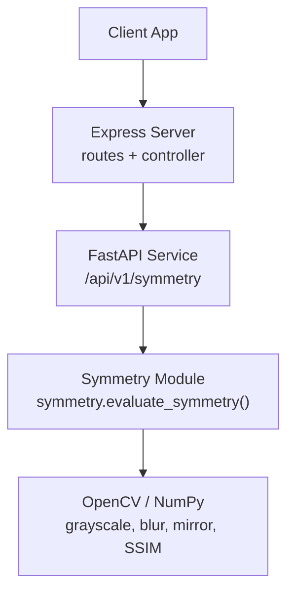
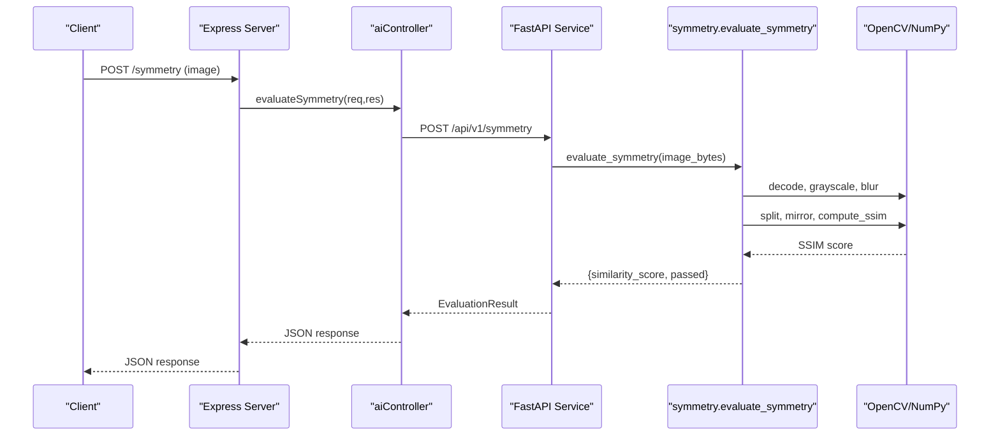
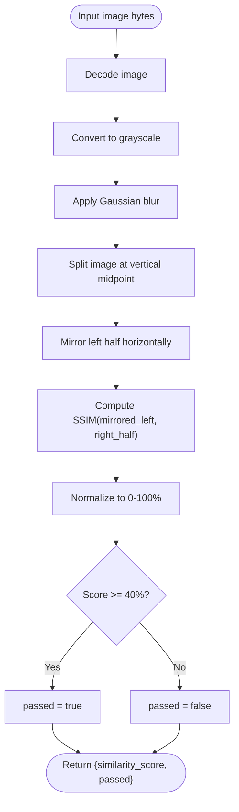
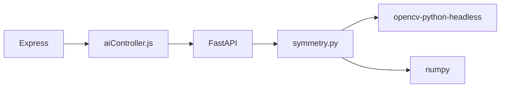

# Symmetry Detection Algorithms

<cite>
**Referenced Files in This Document**
- [symmetry.py](file://ai-engine/vision/symmetry.py)
- [main.py](file://ai-engine/main.py)
- [aiController.js](file://server/src/controllers/aiController.js)
- [aiRoutes.js](file://server/src/routes/aiRoutes.js)
- [implementation-details.md](file://warg-docs/docs/2-architecture-and-design/implementation-details.md)
- [requirements.txt](file://ai-engine/requirements.txt)
</cite>

## Table of Contents
1. [Introduction](#introduction)
2. [Project Structure](#project-structure)
3. [Core Components](#core-components)
4. [Architecture Overview](#architecture-overview)
5. [Detailed Component Analysis](#detailed-component-analysis)
6. [Dependency Analysis](#dependency-analysis)
7. [Performance Considerations](#performance-considerations)
8. [Troubleshooting Guide](#troubleshooting-guide)
9. [Conclusion](#conclusion)

## Introduction
This document explains the symmetry detection algorithms used for architectural and natural pattern recognition within the WARG Platform. It focuses on reflectional symmetry evaluation, the mathematical foundation of the Structural Similarity Index (SSIM), preprocessing steps such as grayscale conversion and Gaussian blurring, and how the system integrates into the broader AI microservice architecture. The goal is to make the implementation accessible while providing sufficient technical depth for performance tuning and accuracy trade-offs.

The current implementation evaluates vertical reflectional symmetry by:
- Converting the input image to grayscale
- Applying a strong Gaussian blur to reduce noise and fine texture
- Splitting the image vertically at the center
- Mirroring one half and comparing it with the other using SSIM
- Returning a normalized similarity score and a pass/fail decision based on a generous threshold

While the documentation objective also mentions rotational symmetry, axis detection methods, edge detection preprocessing, and noise reduction techniques, the repository’s symmetry module implements only vertical reflectional symmetry via SSIM. Rotational symmetry and explicit edge detection are not present in the codebase.

## Project Structure
The symmetry feature spans three layers:
- Frontend/backend routing layer (Express): routes and controller forward requests to the Python AI service
- API gateway layer (FastAPI): validates inputs and delegates to the vision module
- Vision algorithm layer (OpenCV + NumPy): performs image processing and SSIM computation

**Diagram sources**
- [aiRoutes.js:35-37](file://server/src/routes/aiRoutes.js#L35-L37)
- [aiController.js:127-154](file://server/src/controllers/aiController.js#L127-L154)
- [main.py:140-150](file://ai-engine/main.py#L140-L150)
- [symmetry.py:31-65](file://ai-engine/vision/symmetry.py#L31-L65)

**Section sources**
- [aiRoutes.js:35-37](file://server/src/routes/aiRoutes.js#L35-L37)
- [aiController.js:127-154](file://server/src/controllers/aiController.js#L127-L154)
- [main.py:140-150](file://ai-engine/main.py#L140-L150)
- [symmetry.py:31-65](file://ai-engine/vision/symmetry.py#L31-L65)

## Core Components
- Symmetry evaluation function: computes SSIM between mirrored left half and right half after grayscale conversion and Gaussian blurring
- SSIM implementation: pure OpenCV-based calculation using local means, variances, and covariance over a sliding window
- API endpoint: exposes POST /api/v1/symmetry that returns confidence_score, passed, and message
- Integration points: Express routes and controller proxy requests to the FastAPI service

Key responsibilities:
- Image decoding and color space conversion
- Noise reduction via Gaussian blur
- Vertical split and mirroring
- SSIM computation and normalization
- Thresholding to produce a binary pass result

**Section sources**
- [symmetry.py:4-29](file://ai-engine/vision/symmetry.py#L4-L29)
- [symmetry.py:31-65](file://ai-engine/vision/symmetry.py#L31-L65)
- [main.py:140-150](file://ai-engine/main.py#L140-L150)

## Architecture Overview
The symmetry detection pipeline is part of a multi-service architecture where the Node.js backend forwards image analysis tasks to a Python inference microservice.

**Diagram sources**
- [aiRoutes.js:35-37](file://server/src/routes/aiRoutes.js#L35-L37)
- [aiController.js:127-154](file://server/src/controllers/aiController.js#L127-L154)
- [main.py:140-150](file://ai-engine/main.py#L140-L150)
- [symmetry.py:31-65](file://ai-engine/vision/symmetry.py#L31-L65)

## Detailed Component Analysis

### Reflectional Symmetry Algorithm
The algorithm evaluates vertical reflectional symmetry by comparing the mirrored left half of an image with the right half using SSIM.

Processing steps:
1. Decode the uploaded image buffer
2. Convert to grayscale
3. Apply a heavy Gaussian blur to suppress noise and small asymmetries
4. Compute the horizontal midpoint and extract left/right halves
5. Mirror the left half horizontally
6. Compute SSIM between mirrored left and right halves
7. Normalize SSIM to a percentage and apply a threshold to determine pass/fail

Mathematical foundation (SSIM):
- Local mean and variance estimation using Gaussian-weighted windows
- Covariance between corresponding local regions
- Combination of luminance, contrast, and structure terms
- Averaging the SSIM map to obtain a single similarity score

**Diagram sources**
- [symmetry.py:31-65](file://ai-engine/vision/symmetry.py#L31-L65)

**Section sources**
- [symmetry.py:31-65](file://ai-engine/vision/symmetry.py#L31-L65)

### SSIM Implementation Details
The SSIM function uses OpenCV operations to estimate local statistics:
- Gaussian smoothing to compute local means
- Squared smoothing to compute local variances
- Cross-term smoothing to compute local covariance
- Numerical stability constants C1 and C2
- Final SSIM map averaged across pixels

Complexity considerations:
- Time complexity depends on image size and kernel size; multiple Gaussian blurs dominate runtime
- Space complexity is proportional to image dimensions due to intermediate arrays

Optimization opportunities:
- Use separable filters or smaller kernels when appropriate
- Downscale images before processing for real-time scenarios
- Cache or reuse precomputed blurs if evaluating multiple pairs

**Section sources**
- [symmetry.py:4-29](file://ai-engine/vision/symmetry.py#L4-L29)

### API Endpoint and Response Model
The FastAPI endpoint:
- Accepts multipart/form-data with an image file
- Calls symmetry.evaluate_symmetry
- Returns a standardized EvaluationResult containing confidence_score, passed, and message

Integration notes:
- Health check includes a “symmetry” capability flag
- Security middleware enforces API key validation

**Section sources**
- [main.py:140-150](file://ai-engine/main.py#L140-L150)
- [main.py:39-52](file://ai-engine/main.py#L39-L52)

### Express Routing and Controller
Express routes:
- Define POST /symmetry accepting a single image field
- Enforce authentication middleware
- Limit upload size to 5MB

Controller logic:
- Validates presence of required files
- Builds FormData and forwards request to FastAPI
- Handles non-OK responses and propagates errors
- Returns JSON response from the AI service

**Section sources**
- [aiRoutes.js:35-37](file://server/src/routes/aiRoutes.js#L35-L37)
- [aiController.js:127-154](file://server/src/controllers/aiController.js#L127-L154)

### Documentation Context
The project documentation describes the symmetry finder minigame:
- Players draw an axis line on the camera feed
- Validation mirrors the captured frame about the drawn axis and compares halves using SSIM
- A generous threshold accounts for minor camera skew and imperfect real-world symmetry

Note: The current implementation evaluates vertical reflectional symmetry without requiring a user-drawn axis. The documentation’s mention of drawing an axis reflects intended gameplay mechanics, while the code provides automatic vertical-axis evaluation.

**Section sources**
- [implementation-details.md:171-178](file://warg-docs/docs/2-architecture-and-design/implementation-details.md#L171-L178)

## Dependency Analysis
External dependencies relevant to symmetry detection:
- OpenCV (opencv-python-headless): image decoding, color conversion, blurring, flipping, and SSIM-related operations
- NumPy: array operations and buffer handling
- FastAPI/Uvicorn: HTTP server and request handling
- Torch/Torchvision/Pillow/timm: used elsewhere in the AI engine but not directly in symmetry detection

Runtime environment:
- CPU-only PyTorch index configured
- Minimal dependencies for symmetry path: OpenCV and NumPy

**Diagram sources**
- [requirements.txt:1-13](file://ai-engine/requirements.txt#L1-L13)
- [main.py:1-6](file://ai-engine/main.py#L1-L6)
- [symmetry.py:1-2](file://ai-engine/vision/symmetry.py#L1-L2)

**Section sources**
- [requirements.txt:1-13](file://ai-engine/requirements.txt#L1-L13)
- [main.py:1-6](file://ai-engine/main.py#L1-L6)
- [symmetry.py:1-2](file://ai-engine/vision/symmetry.py#L1-L2)

## Performance Considerations
Real-time optimization strategies:
- Downscale input images before processing to reduce pixel count
- Reduce Gaussian kernel size or sigma to speed up blurring
- Skip SSIM map generation and use approximate metrics if needed
- Batch requests and reuse model resources where applicable
- Use asynchronous I/O and connection pooling in Express to handle concurrent requests efficiently

Accuracy trade-offs:
- Stronger blurring improves robustness to noise and texture but may reduce sensitivity to subtle structural differences
- Lower thresholds increase false positives; higher thresholds improve precision but risk missing imperfect symmetry
- Grayscale conversion reduces computational load but discards color information; consider color-aware variants if needed

Operational tips:
- Monitor latency and throughput under load
- Profile OpenCV operations to identify bottlenecks
- Tune thresholds per domain (architectural facades vs. natural patterns)

[No sources needed since this section provides general guidance]

## Troubleshooting Guide
Common issues and resolutions:
- Invalid or missing image buffer: ensure the client uploads a valid image and the decoder succeeds
- Poor symmetry scores due to lighting or texture: adjust blur parameters or preprocess with denoising
- High false positive/negative rates: recalibrate the threshold based on test datasets
- Slow response times: downscale images, reduce kernel sizes, or optimize OpenCV settings

Error handling paths:
- FastAPI raises ValueError when image decoding fails
- Express controller catches network errors and returns a 500 error with a descriptive message
- Non-OK responses from the AI service are logged and propagated

**Section sources**
- [symmetry.py:35-38](file://ai-engine/vision/symmetry.py#L35-L38)
- [aiController.js:143-153](file://server/src/controllers/aiController.js#L143-L153)

## Conclusion
The WARG Platform’s symmetry detection module implements vertical reflectional symmetry evaluation using SSIM. It converts images to grayscale, applies Gaussian blurring to mitigate noise and texture, splits the image vertically, mirrors one half, and compares it with the other half. The approach balances simplicity and effectiveness, with a generous threshold to accommodate real-world imperfections and minor camera skew.

For broader applications such as building facade symmetry and natural pattern recognition, the same core pipeline can be adapted by adjusting preprocessing parameters and thresholds. While the repository does not include rotational symmetry detection or explicit edge detection preprocessing, the existing SSIM framework provides a solid foundation for extending functionality. Performance tuning through image scaling, kernel sizing, and efficient I/O will be essential for real-time deployments.

[No sources needed since this section summarizes without analyzing specific files]