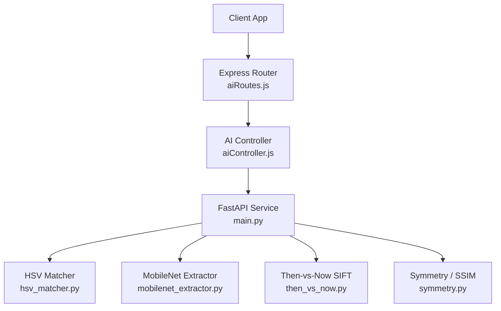
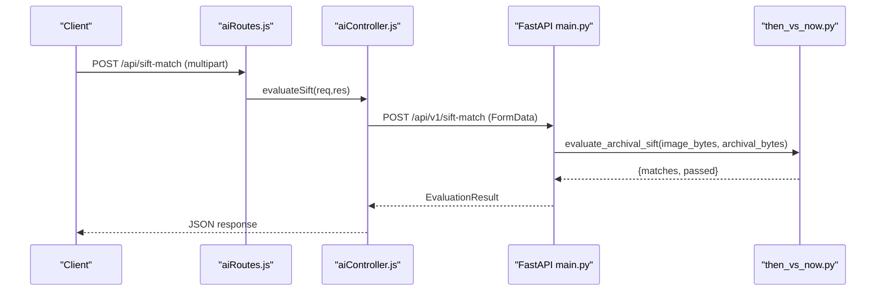
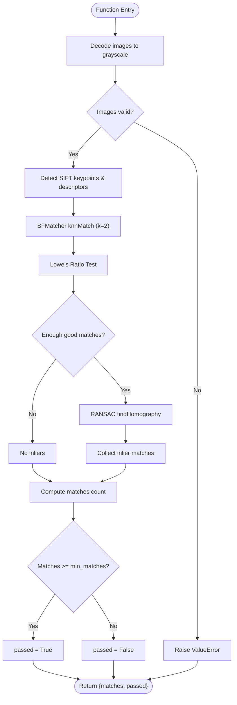
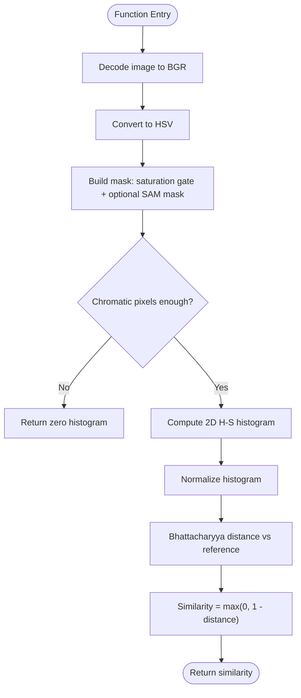
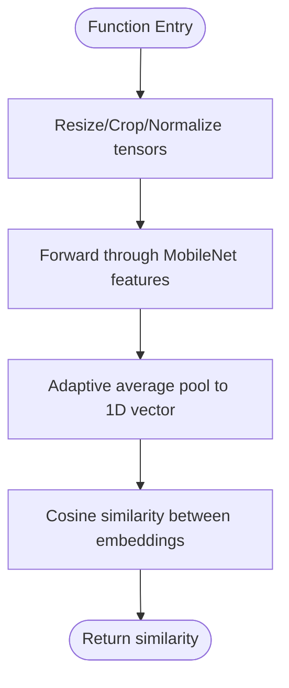
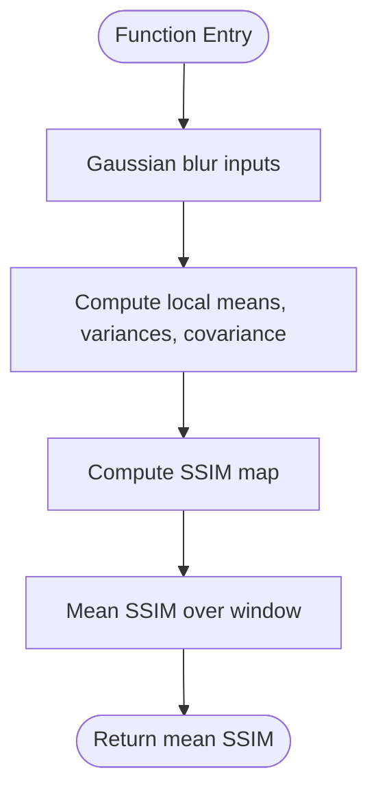
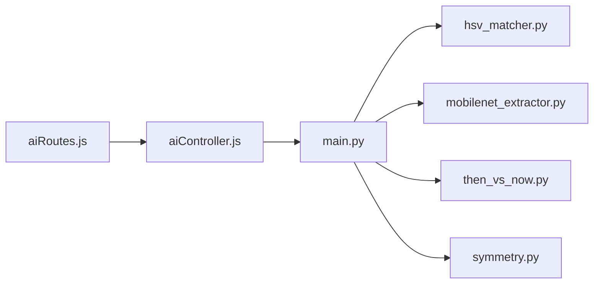

# Then vs Now Image Comparison

<cite>
**Referenced Files in This Document**
- [ai-engine/main.py](file://ai-engine/main.py)
- [ai-engine/vision/then_vs_now.py](file://ai-engine/vision/then_vs_now.py)
- [ai-engine/vision/hsv_matcher.py](file://ai-engine/vision/hsv_matcher.py)
- [ai-engine/vision/mobilenet_extractor.py](file://ai-engine/vision/mobilenet_extractor.py)
- [ai-engine/vision/symmetry.py](file://ai-engine/vision/symmetry.py)
- [server/src/routes/aiRoutes.js](file://server/src/routes/aiRoutes.js)
- [server/src/controllers/aiController.js](file://server/src/controllers/aiController.js)
</cite>

## Table of Contents
1. [Introduction](#introduction)
2. [Project Structure](#project-structure)
3. [Core Components](#core-components)
4. [Architecture Overview](#architecture-overview)
5. [Detailed Component Analysis](#detailed-component-analysis)
6. [Dependency Analysis](#dependency-analysis)
7. [Performance Considerations](#performance-considerations)
8. [Troubleshooting Guide](#troubleshooting-guide)
9. [Conclusion](#conclusion)

## Introduction
This document explains the archival image comparison system that analyzes historical versus current images. The system combines multiple algorithms: color matching, feature extraction, and structural similarity measures. It exposes endpoints for comparing a player’s current photo with an archival reference, including SIFT-based geometric verification to handle scale and orientation differences. Confidence scoring is provided per algorithm, enabling flexible interpretation of change detection results.

The system is implemented as a FastAPI-based AI service with a Node.js server proxying requests. Vision modules implement color histograms (HSV), deep feature embeddings (MobileNet), SIFT keypoint matching with RANSAC, and structural similarity computations.

## Project Structure
The archival comparison functionality spans two layers:
- Server layer (Node.js): routes and controllers forward multipart image uploads to the AI service.
- AI service layer (Python/FastAPI): implements vision algorithms and returns confidence scores and pass/fail decisions.

**Diagram sources**
- [server/src/routes/aiRoutes.js:15-33](file://server/src/routes/aiRoutes.js#L15-L33)
- [server/src/controllers/aiController.js:1-163](file://server/src/controllers/aiController.js#L1-L163)
- [ai-engine/main.py:77-157](file://ai-engine/main.py#L77-L157)
- [ai-engine/vision/hsv_matcher.py:1-62](file://ai-engine/vision/hsv_matcher.py#L1-L62)
- [ai-engine/vision/mobilenet_extractor.py:1-50](file://ai-engine/vision/mobilenet_extractor.py#L1-L50)
- [ai-engine/vision/then_vs_now.py:1-48](file://ai-engine/vision/then_vs_now.py#L1-L48)
- [ai-engine/vision/symmetry.py:1-65](file://ai-engine/vision/symmetry.py#L1-L65)

**Section sources**
- [server/src/routes/aiRoutes.js:1-39](file://server/src/routes/aiRoutes.js#L1-L39)
- [server/src/controllers/aiController.js:1-163](file://server/src/controllers/aiController.js#L1-L163)
- [ai-engine/main.py:1-157](file://ai-engine/main.py#L1-L157)

## Core Components
- Color Matching (HSV Histograms): Computes normalized Hue-Saturation histograms and compares them using Bhattacharyya distance. Achromatic pixels are masked out to avoid false matches.
- Feature Extraction (MobileNet Embeddings): Uses a pre-trained MobileNet model to extract 1D feature vectors; structural similarity is measured via cosine similarity.
- Geometric Verification (SIFT + RANSAC): Detects keypoints and descriptors, performs Lowe’s ratio test, then enforces geometric consistency via RANSAC homography estimation.
- Structural Similarity (SSIM): Implements SSIM for symmetry checks and can be used more broadly for structural comparisons.

These components are exposed through FastAPI endpoints and proxied by the Express server.

**Section sources**
- [ai-engine/vision/hsv_matcher.py:1-62](file://ai-engine/vision/hsv_matcher.py#L1-L62)
- [ai-engine/vision/mobilenet_extractor.py:1-50](file://ai-engine/vision/mobilenet_extractor.py#L1-L50)
- [ai-engine/vision/then_vs_now.py:1-48](file://ai-engine/vision/then_vs_now.py#L1-L48)
- [ai-engine/vision/symmetry.py:1-65](file://ai-engine/vision/symmetry.py#L1-L65)
- [ai-engine/main.py:95-157](file://ai-engine/main.py#L95-L157)

## Architecture Overview
The end-to-end flow for archival comparison uses the SIFT endpoint to match a current image against an archival reference. The server forwards multipart form data to the AI service, which runs SIFT detection, matching, and geometric verification.

**Diagram sources**
- [server/src/routes/aiRoutes.js:30-33](file://server/src/routes/aiRoutes.js#L30-L33)
- [server/src/controllers/aiController.js:96-125](file://server/src/controllers/aiController.js#L96-L125)
- [ai-engine/main.py:127-138](file://ai-engine/main.py#L127-L138)
- [ai-engine/vision/then_vs_now.py:4-48](file://ai-engine/vision/then_vs_now.py#L4-L48)

## Detailed Component Analysis

### SIFT-Based Archival Comparison
The SIFT pipeline detects keypoints and descriptors on both images, performs initial matching, filters with Lowe’s ratio test, and validates geometry with RANSAC. The result includes the number of inlier matches and a pass/fail decision based on a minimum match threshold.

**Diagram sources**
- [ai-engine/vision/then_vs_now.py:4-48](file://ai-engine/vision/then_vs_now.py#L4-L48)

**Section sources**
- [ai-engine/vision/then_vs_now.py:1-48](file://ai-engine/vision/then_vs_now.py#L1-L48)
- [ai-engine/main.py:127-138](file://ai-engine/main.py#L127-L138)

### Color Matching with HSV Histograms
Color matching computes a normalized 2D Hue-Saturation histogram, masking low-saturation pixels to reduce noise from achromatic regions. Similarity is derived from Bhattacharyya distance between histograms.

**Diagram sources**
- [ai-engine/vision/hsv_matcher.py:4-62](file://ai-engine/vision/hsv_matcher.py#L4-L62)

**Section sources**
- [ai-engine/vision/hsv_matcher.py:1-62](file://ai-engine/vision/hsv_matcher.py#L1-L62)
- [ai-engine/main.py:95-111](file://ai-engine/main.py#L95-L111)

### Texture and Structural Similarity via MobileNet
Texture evaluation extracts deep features using MobileNet and computes cosine similarity between embeddings. This provides a robust measure of structural similarity across lighting and minor viewpoint changes.

**Diagram sources**
- [ai-engine/vision/mobilenet_extractor.py:17-50](file://ai-engine/vision/mobilenet_extractor.py#L17-L50)

**Section sources**
- [ai-engine/vision/mobilenet_extractor.py:1-50](file://ai-engine/vision/mobilenet_extractor.py#L1-L50)
- [ai-engine/main.py:113-125](file://ai-engine/main.py#L113-L125)

### Structural Similarity (SSIM) Implementation
A pure OpenCV implementation of SSIM is provided for symmetry checks and can be adapted for broader structural comparisons.

**Diagram sources**
- [ai-engine/vision/symmetry.py:4-29](file://ai-engine/vision/symmetry.py#L4-L29)

**Section sources**
- [ai-engine/vision/symmetry.py:1-65](file://ai-engine/vision/symmetry.py#L1-L65)

## Dependency Analysis
The server routes and controller delegate to the AI service endpoints. The AI service imports vision modules to perform analysis.

**Diagram sources**
- [server/src/routes/aiRoutes.js:15-33](file://server/src/routes/aiRoutes.js#L15-L33)
- [server/src/controllers/aiController.js:1-163](file://server/src/controllers/aiController.js#L1-L163)
- [ai-engine/main.py:6-6](file://ai-engine/main.py#L6-L6)

**Section sources**
- [server/src/routes/aiRoutes.js:1-39](file://server/src/routes/aiRoutes.js#L1-L39)
- [server/src/controllers/aiController.js:1-163](file://server/src/controllers/aiController.js#L1-L163)
- [ai-engine/main.py:1-157](file://ai-engine/main.py#L1-L157)

## Performance Considerations
- SIFT Detection and Matching: Computationally intensive due to keypoint detection and descriptor matching. Use appropriate thresholds (e.g., minimum matches) to prune early when insufficient matches exist.
- MobileNet Embeddings: Requires GPU acceleration where possible to speed up inference. Batch processing can improve throughput when evaluating many images.
- HSV Histograms: Lightweight but sensitive to illumination; ensure proper masking and normalization to avoid noisy comparisons.
- SSIM: Windowed computation can be expensive on large images; consider downsampling or region-of-interest processing.

[No sources needed since this section provides general guidance]

## Troubleshooting Guide
- Invalid or missing files: Controllers validate required fields and return clear error messages if files are missing.
- AI service errors: Controllers check HTTP status and propagate errors back to clients.
- Decoding failures: Vision modules raise exceptions when image buffers cannot be decoded; ensure correct formats and non-empty payloads.

**Section sources**
- [server/src/controllers/aiController.js:3-31](file://server/src/controllers/aiController.js#L3-L31)
- [server/src/controllers/aiController.js:65-94](file://server/src/controllers/aiController.js#L65-L94)
- [server/src/controllers/aiController.js:96-125](file://server/src/controllers/aiController.js#L96-L125)
- [ai-engine/vision/then_vs_now.py:12-13](file://ai-engine/vision/then_vs_now.py#L12-L13)

## Conclusion
The archival image comparison system integrates color histograms, deep feature embeddings, and geometric verification to robustly compare historical and current images. SIFT with RANSAC handles scale and orientation differences, while HSV and MobileNet provide complementary signals for color and texture. Confidence scores and pass/fail decisions enable flexible interpretation of change detection results. For large archives, prioritize GPU acceleration for deep models and tune thresholds to balance accuracy and performance.

[No sources needed since this section summarizes without analyzing specific files]