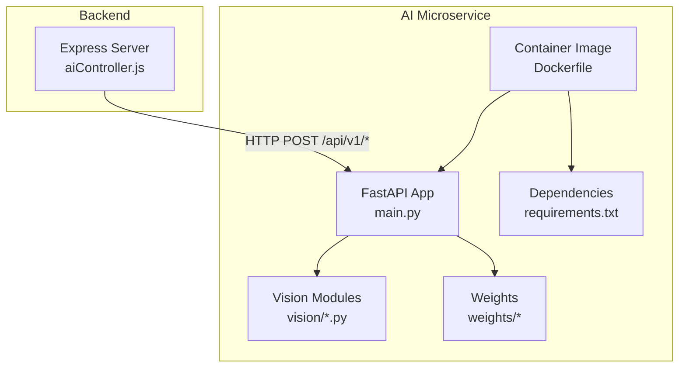
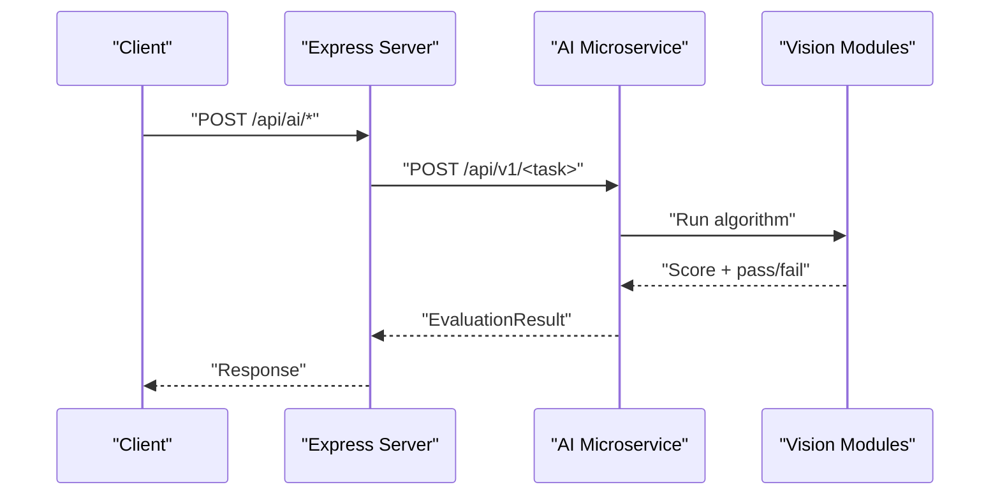
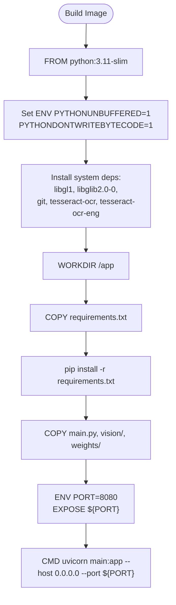
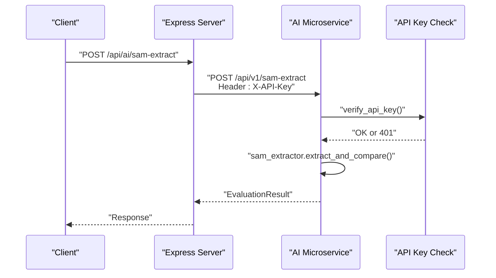
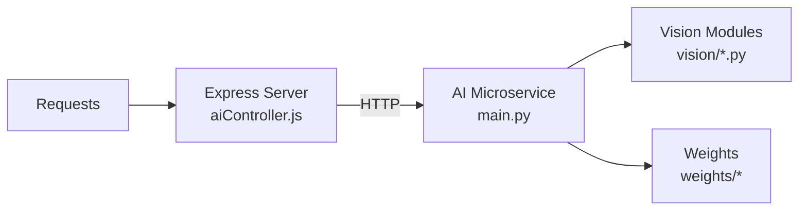

# Deployment & Containerization

<cite>
**Referenced Files in This Document**
- [Dockerfile](file://ai-engine/Dockerfile)
- [requirements.txt](file://ai-engine/requirements.txt)
- [.dockerignore](file://ai-engine/.dockerignore)
- [main.py](file://ai-engine/main.py)
- [DEPLOYMENT.md](file://ai-engine/DEPLOYMENT.md)
- [ci.yml](file://.gitea/workflows/ci.yml)
- [aiController.js](file://server/src/controllers/aiController.js)
</cite>

## Table of Contents
1. [Introduction](#introduction)
2. [Project Structure](#project-structure)
3. [Core Components](#core-components)
4. [Architecture Overview](#architecture-overview)
5. [Detailed Component Analysis](#detailed-component-analysis)
6. [Dependency Analysis](#dependency-analysis)
7. [Performance Considerations](#performance-considerations)
8. [Troubleshooting Guide](#troubleshooting-guide)
9. [Conclusion](#conclusion)
10. [Appendices](#appendices)

## Introduction
This document provides comprehensive deployment and containerization guidance for the AI microservice that powers image-based evaluations (shape, color, texture, SIFT, symmetry, OCR). It covers Docker build structure, base image selection, dependency management via requirements.txt, .dockerignore optimizations, environment configuration (including API authentication), scaling considerations for CPU vs GPU workloads, load balancing strategies, monitoring setup, and step-by-step deployment instructions for multiple platforms.

## Project Structure
The AI microservice lives under ai-engine and exposes a FastAPI application served by Uvicorn. The Node.js backend proxies requests to this service.

**Diagram sources**
- [main.py:1-157](file://ai-engine/main.py#L1-L157)
- [aiController.js:1-163](file://server/src/controllers/aiController.js#L1-L163)
- [Dockerfile:1-40](file://ai-engine/Dockerfile#L1-L40)
- [requirements.txt:1-13](file://ai-engine/requirements.txt#L1-L13)

**Section sources**
- [Dockerfile:1-40](file://ai-engine/Dockerfile#L1-L40)
- [requirements.txt:1-13](file://ai-engine/requirements.txt#L1-L13)
- [main.py:1-157](file://ai-engine/main.py#L1-L157)
- [aiController.js:1-163](file://server/src/controllers/aiController.js#L1-L163)

## Core Components
- FastAPI application with endpoints for shape extraction, color matching, texture matching, SIFT comparison, symmetry analysis, and OCR matching.
- API key authentication via header X-API-Key backed by environment variable AI_KEY.
- CORS configured to allow frontend origins.
- Health endpoint reporting model readiness.

Key responsibilities:
- main.py: API routes, security middleware, health checks, response models.
- vision modules: Implement specific computer vision algorithms.
- Dockerfile: Build reproducible container images for CPU-only inference.
- requirements.txt: Pin Python dependencies including PyTorch CPU wheels.

**Section sources**
- [main.py:1-157](file://ai-engine/main.py#L1-L157)
- [DEPLOYMENT.md:1-81](file://ai-engine/DEPLOYMENT.md#L1-L81)

## Architecture Overview
The Express backend forwards image processing requests to the AI microservice. The microservice runs on a single process per container, serving HTTP requests over port 8080.

**Diagram sources**
- [aiController.js:1-163](file://server/src/controllers/aiController.js#L1-L163)
- [main.py:77-157](file://ai-engine/main.py#L77-L157)

## Detailed Component Analysis

### Dockerfile Structure and Base Image Selection
- Base image: python:3.11-slim for a minimal footprint.
- System dependencies installed for OpenCV headless and Tesseract OCR.
- Application code and weights are copied into the image.
- Port exposure and command use PORT env var with default 8080.

Optimization highlights:
- Layer caching by copying requirements.txt before app code.
- No-cache-dir pip install to reduce image size.
- PYTHONUNBUFFERED enabled for better container logs.

**Diagram sources**
- [Dockerfile:1-40](file://ai-engine/Dockerfile#L1-L40)

**Section sources**
- [Dockerfile:1-40](file://ai-engine/Dockerfile#L1-L40)

### Dependency Management with requirements.txt
- Uses extra-index-url for PyTorch CPU wheels.
- Includes FastAPI, Uvicorn, OpenCV headless, NumPy, Torch/Torchvision, Pillow, timm, MobileSAM from GitHub, and pytesseract.

Recommendations:
- Pin exact versions for reproducibility.
- Separate dev/test dependencies if needed.

**Section sources**
- [requirements.txt:1-13](file://ai-engine/requirements.txt#L1-L13)

### .dockerignore Optimizations
- Excludes Python cache files, virtual environments, Git metadata, markdown docs, and .env files to keep images small and secure.

Best practices:
- Add large directories like node_modules or test artifacts if present.
- Avoid committing secrets; rely on runtime environment variables.

**Section sources**
- [.dockerignore:1-11](file://ai-engine/.dockerignore#L1-L11)

### Environment Configuration
- AI_KEY: Used to authenticate requests via X-API-Key header. Defaults to a development value when not set.
- PORT: Default 8080; Cloud Run injects $PORT at runtime.
- AI_SERVICE_URL: Set in the Express backend to point to the deployed AI microservice URL.

Security notes:
- Always provide AI_KEY in production via platform secret managers or environment variables.
- Restrict CORS origins to only trusted domains.

**Section sources**
- [main.py:10-20](file://ai-engine/main.py#L10-L20)
- [main.py:22-33](file://ai-engine/main.py#L22-L33)
- [Dockerfile:34-39](file://ai-engine/Dockerfile#L34-L39)
- [aiController.js:1-1](file://server/src/controllers/aiController.js#L1-L1)

### API Endpoints and Authentication Flow
Endpoints:
- GET /health: Returns status and model readiness flags.
- POST /api/v1/sam-extract: Shape evaluation using SAM.
- POST /api/v1/hsv-match: Color histogram similarity.
- POST /api/v1/texture-match: Texture embedding similarity.
- POST /api/v1/sift-match: SIFT archival matching.
- POST /api/v1/symmetry: Symmetry analysis.
- POST /api/v1/ocr-match: OCR plaque matching.

Authentication:
- All write endpoints require X-API-Key header matching AI_KEY.

**Diagram sources**
- [main.py:10-20](file://ai-engine/main.py#L10-L20)
- [main.py:77-93](file://ai-engine/main.py#L77-L93)
- [aiController.js:3-32](file://server/src/controllers/aiController.js#L3-L32)

**Section sources**
- [main.py:35-52](file://ai-engine/main.py#L35-L52)
- [main.py:77-157](file://ai-engine/main.py#L77-L157)

### Scaling Considerations: CPU vs GPU Workloads
- Current image targets CPU-only PyTorch and is optimized for Google Cloud Run and similar serverless/container platforms.
- Minimum RAM: 1 GB; recommended: 2 GB due to model loading overhead.
- GPU workloads are not included in the current image; adding GPU support requires a different base image and platform configuration.

Guidance:
- For CPU-only inference, scale horizontally by increasing replicas behind a load balancer.
- If GPU is required later, switch to a CUDA-enabled base image and configure platform-specific GPU resources.

**Section sources**
- [Dockerfile:1-5](file://ai-engine/Dockerfile#L1-L5)
- [DEPLOYMENT.md:8-14](file://ai-engine/DEPLOYMENT.md#L8-L14)

### Load Balancing Strategies
- Use a managed load balancer or platform autoscaler to distribute traffic across multiple AI microservice instances.
- Ensure sticky sessions are not required since the service is stateless.
- Configure health checks to route traffic only to healthy instances.

[No sources needed since this section provides general guidance]

### Monitoring Setup
- Health endpoint (/health) can be polled by orchestrators and external monitors.
- Enable structured logging and integrate with your platform’s log aggregation.
- Track request latency, error rates, and memory usage per replica.

**Section sources**
- [main.py:39-52](file://ai-engine/main.py#L39-L52)

## Dependency Analysis
The AI microservice depends on:
- FastAPI and Uvicorn for web serving.
- OpenCV headless for image processing.
- PyTorch/Torchvision for ML inference.
- Tesseract OCR for text recognition.
- Vision modules implementing specific algorithms.

The Express backend depends on:
- AI_SERVICE_URL to locate the AI microservice.
- Standard HTTP client to forward requests.

**Diagram sources**
- [aiController.js:1-163](file://server/src/controllers/aiController.js#L1-L163)
- [main.py:1-157](file://ai-engine/main.py#L1-L157)

**Section sources**
- [requirements.txt:1-13](file://ai-engine/requirements.txt#L1-L13)
- [aiController.js:1-163](file://server/src/controllers/aiController.js#L1-L163)

## Performance Considerations
- Model loading cost: PyTorch + MobileSAM + MobileNetV2 consume ~400–500 MB RAM at startup.
- Keep containers warm by maintaining minimum replicas to avoid cold starts.
- Tune concurrency settings in Uvicorn based on CPU cores and workload characteristics.
- Cache frequent results where appropriate to reduce repeated computations.
- Monitor memory usage and adjust resource limits to prevent OOM kills.

**Section sources**
- [DEPLOYMENT.md:8-14](file://ai-engine/DEPLOYMENT.md#L8-L14)

## Troubleshooting Guide
Common issues and resolutions:
- 502 Bad Gateway on free tiers: Insufficient memory; upgrade to at least 1 GB RAM.
- Unauthorized errors: Ensure X-API-Key matches AI_KEY in the AI microservice.
- Missing Tesseract: Ensure system package tesseract-ocr is installed in the container image.
- CORS errors: Verify allowed origins include the frontend domain.
- Health check failures: Confirm all models loaded successfully; inspect /health response.

Operational checks:
- Validate deployment by calling /health and verifying model readiness flags.
- Test each endpoint with sample images to ensure correct behavior.

**Section sources**
- [DEPLOYMENT.md:8-14](file://ai-engine/DEPLOYMENT.md#L8-L14)
- [main.py:39-52](file://ai-engine/main.py#L39-L52)
- [main.py:10-20](file://ai-engine/main.py#L10-L20)

## Conclusion
The AI microservice is a containerized FastAPI application designed for CPU-only inference with robust health checks and API key authentication. It integrates seamlessly with the Express backend and supports horizontal scaling. Proper environment configuration, resource sizing, and monitoring are essential for reliable production deployments.

[No sources needed since this section summarizes without analyzing specific files]

## Appendices

### Step-by-Step Deployment Instructions

#### AWS Lightsail (Container Service)
- Prerequisites: AWS account, AWS CLI, Docker.
- Steps:
  1. Build the Docker image locally.
  2. Create a Lightsail container service with at least 1 GB RAM.
  3. Push the image to Lightsail.
  4. Create a deployment exposing port 8080.
  5. Retrieve the public URL and verify with /health.

Reference commands and flow are documented in the project’s deployment guide.

**Section sources**
- [DEPLOYMENT.md:18-43](file://ai-engine/DEPLOYMENT.md#L18-L43)

#### Google Cloud Run
- Build and push the image to a container registry.
- Deploy to Cloud Run with:
  - Memory limit ≥ 1 GB (recommended 2 GB).
  - CPU-only instance type.
  - Environment variables:
    - PORT=8080
    - AI_KEY=<your-secret>
- Set up autoscaling and health checks.

[No sources needed since this section provides general guidance]

#### Render
- The AI microservice cannot run on Render Free Tier due to memory constraints; use a paid plan with sufficient RAM.
- Configure environment variables:
  - AI_SERVICE_URL points to the AI microservice URL in the Express backend.
  - AI_KEY for authentication.

**Section sources**
- [DEPLOYMENT.md:8-14](file://ai-engine/DEPLOYMENT.md#L8-L14)
- [DEPLOYMENT.md:47-57](file://ai-engine/DEPLOYMENT.md#L47-L57)

#### Self-hosted Kubernetes
- Create a Deployment with:
  - Replicas scaled based on CPU/memory metrics.
  - Resource requests/limits: CPU and memory aligned with model loading needs.
  - Environment variables:
    - PORT=8080
    - AI_KEY=<your-secret>
- Expose via Service and Ingress.
- Configure HorizontalPodAutoscaler and liveness/readiness probes using /health.

[No sources needed since this section provides general guidance]

### CI Pipeline Notes
- The CI pipeline runs linting and tests for both backend and frontend.
- Database integration tests spin up MySQL in CI.

**Section sources**
- [ci.yml:1-74](file://.gitea/workflows/ci.yml#L1-L74)