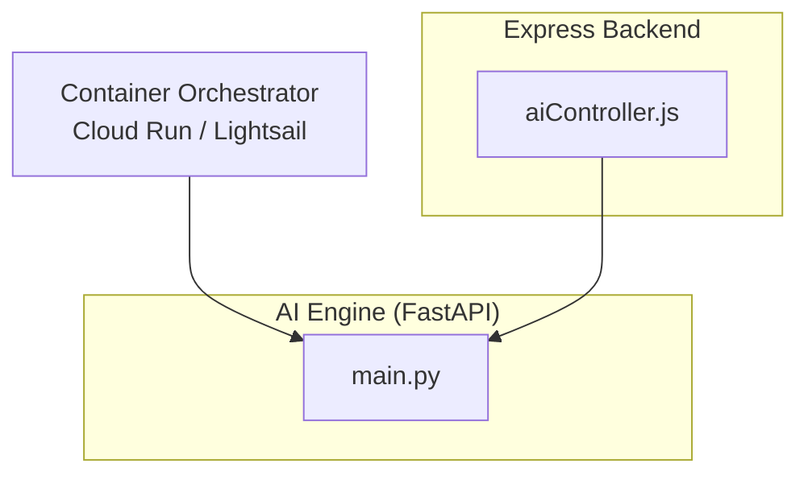
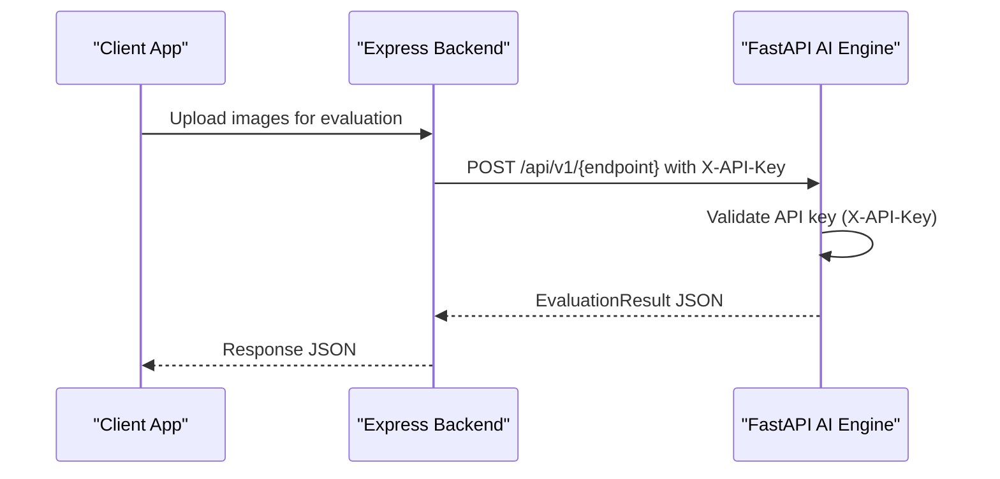
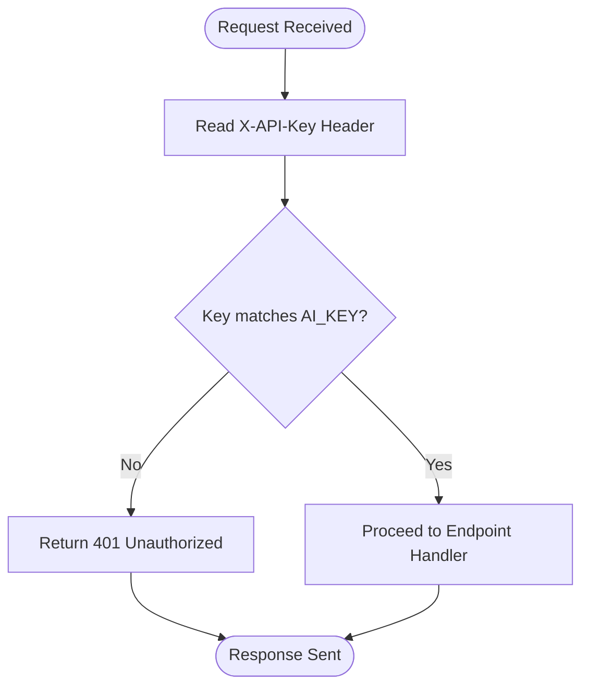
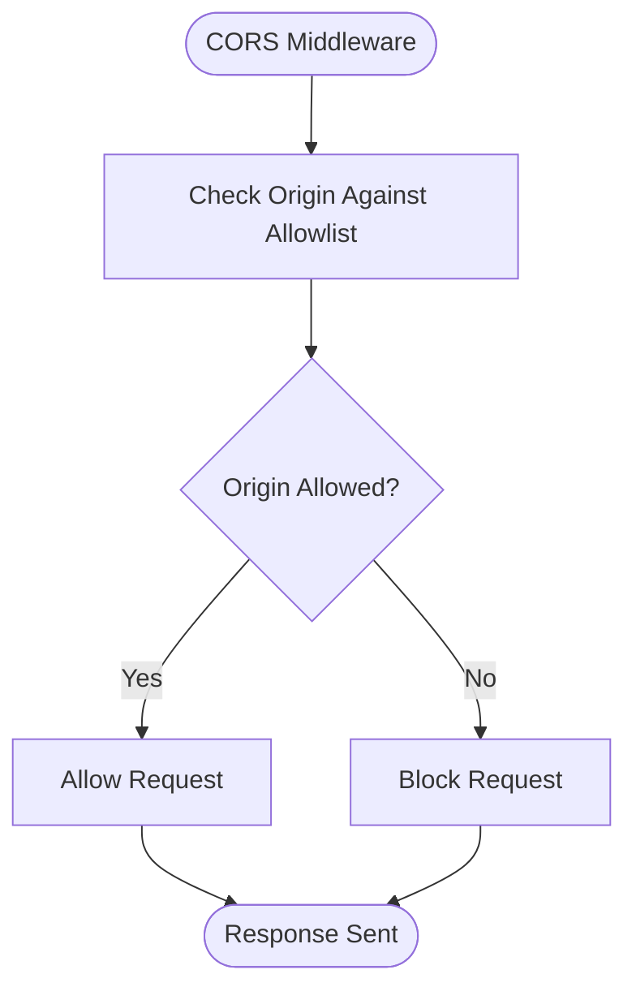
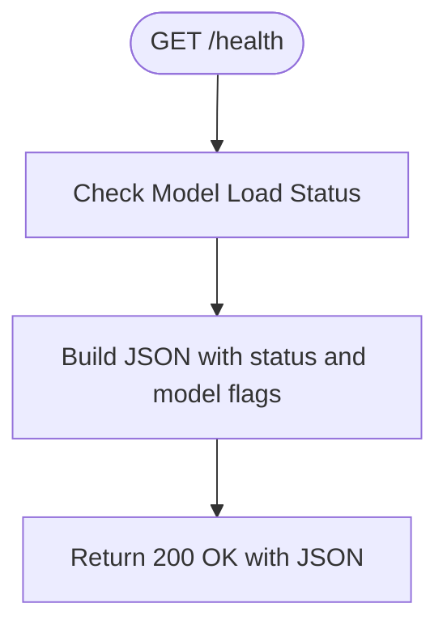
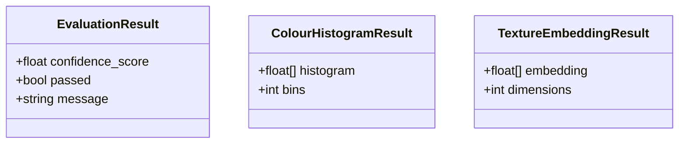
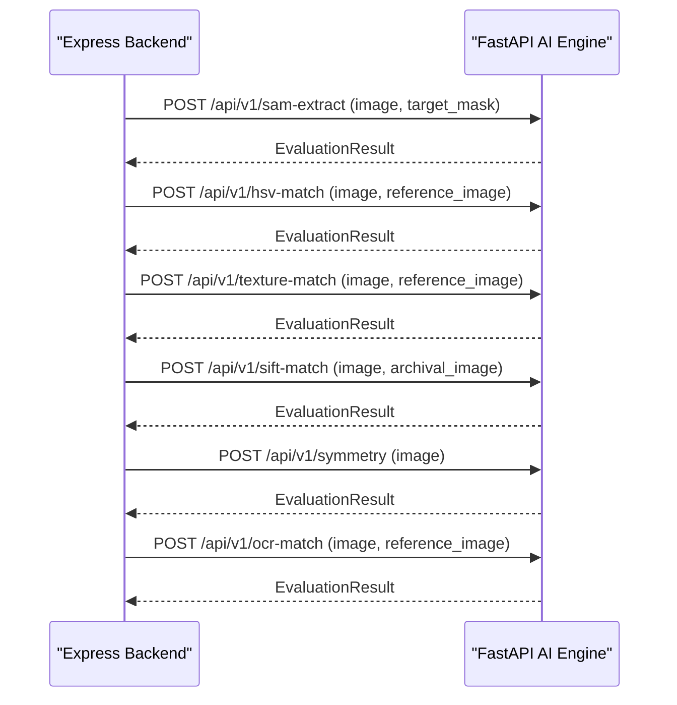
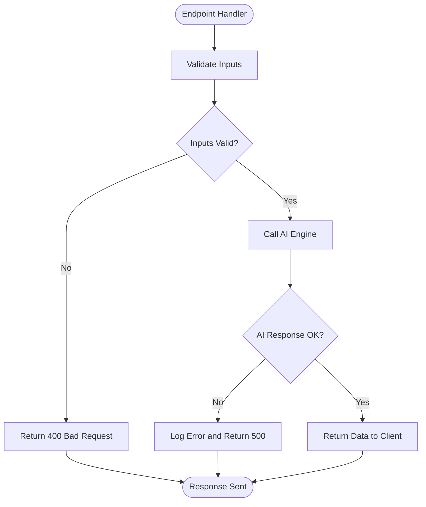
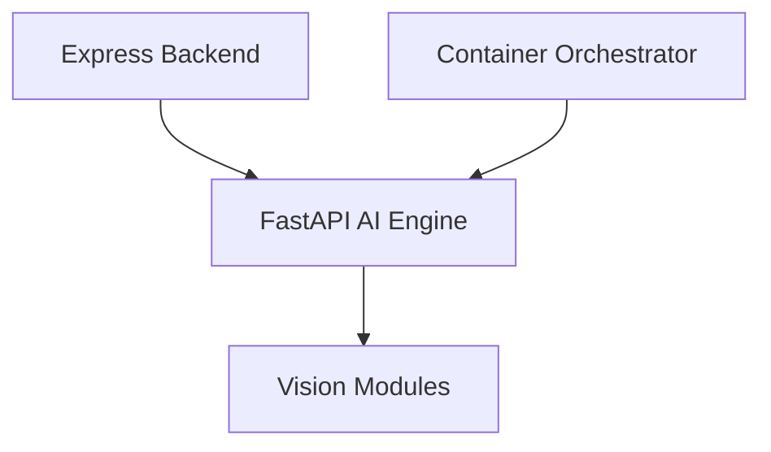

# FastAPI Server Configuration

<cite>
**Referenced Files in This Document**   
- [main.py](file://ai-engine/main.py)
- [DEPLOYMENT.md](file://ai-engine/DEPLOYMENT.md)
- [aiController.js](file://server/src/controllers/aiController.js)
</cite>

## Table of Contents
1. [Introduction](#introduction)
2. [Project Structure](#project-structure)
3. [Core Components](#core-components)
4. [Architecture Overview](#architecture-overview)
5. [Detailed Component Analysis](#detailed-component-analysis)
6. [Dependency Analysis](#dependency-analysis)
7. [Performance Considerations](#performance-considerations)
8. [Troubleshooting Guide](#troubleshooting-guide)
9. [Conclusion](#conclusion)
10. [Appendices](#appendices)

## Introduction
This document explains the FastAPI server configuration and security setup for the AI Engine microservice. It covers:
- API key authentication using X-API-Key headers
- CORS middleware to allow cross-origin requests from the Express backend
- Health check endpoints for container orchestration
- Request/response models, including EvaluationResult, ColourHistogramResult, and TextureEmbeddingResult
- Security implementation with APIKeyHeader validation and error handling patterns
- Environment variable configuration, API key management, and integration with container orchestrators like Cloud Run or Lightsail

## Project Structure
The AI Engine is a FastAPI application that exposes image analysis endpoints used by the Express backend. The relevant files are:
- ai-engine/main.py: FastAPI app, security, CORS, health endpoint, and evaluation routes
- ai-engine/DEPLOYMENT.md: Deployment guidance for Lightsail and environment configuration
- server/src/controllers/aiController.js: Express controller that calls the AI Engine endpoints

**Diagram sources**
- [main.py:1-157](file://ai-engine/main.py#L1-L157)
- [aiController.js:1-163](file://server/src/controllers/aiController.js#L1-L163)

**Section sources**
- [main.py:1-157](file://ai-engine/main.py#L1-L157)
- [DEPLOYMENT.md:1-81](file://ai-engine/DEPLOYMENT.md#L1-L81)
- [aiController.js:1-163](file://server/src/controllers/aiController.js#L1-L163)

## Core Components
- FastAPI application initialization and title
- API key authentication via X-API-Key header
- CORS middleware configured for specific origins
- Health check endpoint returning service status and model readiness
- Pydantic response models for standardized outputs

Key responsibilities:
- main.py defines the FastAPI app, security, CORS, health endpoint, and evaluation routes
- aiController.js proxies client requests to the AI Engine endpoints
- DEPLOYMENT.md provides deployment instructions and environment variables

**Section sources**
- [main.py:8-33](file://ai-engine/main.py#L8-L33)
- [main.py:35-52](file://ai-engine/main.py#L35-L52)
- [aiController.js:1-163](file://server/src/controllers/aiController.js#L1-L163)
- [DEPLOYMENT.md:47-81](file://ai-engine/DEPLOYMENT.md#L47-L81)

## Architecture Overview
The Express backend sends image data to the AI Engine over HTTP. The AI Engine validates the request using an API key header, processes images through vision modules, and returns structured results.

**Diagram sources**
- [main.py:10-20](file://ai-engine/main.py#L10-L20)
- [main.py:77-157](file://ai-engine/main.py#L77-L157)
- [aiController.js:16-27](file://server/src/controllers/aiController.js#L16-L27)

## Detailed Component Analysis

### API Key Authentication (X-API-Key)
- The AI Engine uses APIKeyHeader to require an X-API-Key header on protected endpoints.
- A verify_api_key function compares the provided key against the environment variable AI_KEY.
- If the key is missing or invalid, the server responds with 401 Unauthorized.

**Diagram sources**
- [main.py:10-20](file://ai-engine/main.py#L10-L20)

**Section sources**
- [main.py:10-20](file://ai-engine/main.py#L10-L20)

### CORS Middleware Configuration
- The AI Engine enables CORS to allow cross-origin requests from the Express backend and development environments.
- Allowed origins include production domains and local development URLs.
- All methods and headers are allowed to simplify integration.

**Diagram sources**
- [main.py:22-33](file://ai-engine/main.py#L22-L33)

**Section sources**
- [main.py:22-33](file://ai-engine/main.py#L22-L33)

### Health Check Endpoints
- The root endpoint returns a simple status message.
- The /health endpoint reports overall service status and indicates whether core models are loaded and ready.

**Diagram sources**
- [main.py:35-52](file://ai-engine/main.py#L35-L52)

**Section sources**
- [main.py:35-52](file://ai-engine/main.py#L35-L52)

### Request/Response Models
- EvaluationResult: Standardized result for all evaluation endpoints, containing confidence_score, passed boolean, and message.
- ColourHistogramResult: Represents histogram-based color similarity output with histogram array and bins count.
- TextureEmbeddingResult: Represents texture embedding output with embedding vector and dimensions.

**Diagram sources**
- [main.py:56-70](file://ai-engine/main.py#L56-L70)

**Section sources**
- [main.py:56-70](file://ai-engine/main.py#L56-L70)

### Evaluation Endpoints
Endpoints accept image uploads and return EvaluationResult objects after processing:
- /api/v1/sam-extract: Shape extraction and evaluation
- /api/v1/hsv-match: Color similarity via HSV histograms
- /api/v1/texture-match: Texture similarity via embeddings
- /api/v1/sift-match: SIFT-based archival matching
- /api/v1/symmetry: Symmetry evaluation
- /api/v1/ocr-match: OCR plaque matching

**Diagram sources**
- [main.py:77-157](file://ai-engine/main.py#L77-L157)
- [aiController.js:16-27](file://server/src/controllers/aiController.js#L16-L27)

**Section sources**
- [main.py:77-157](file://ai-engine/main.py#L77-L157)
- [aiController.js:1-163](file://server/src/controllers/aiController.js#L1-L163)

### Error Handling Patterns
- API key validation errors return 401 Unauthorized with a descriptive detail message.
- Missing or invalid inputs in the Express controller result in 400 Bad Request responses.
- Network or processing failures in the Express controller result in 500 Internal Server Error responses.

**Diagram sources**
- [main.py:14-20](file://ai-engine/main.py#L14-L20)
- [aiController.js:4-31](file://server/src/controllers/aiController.js#L4-L31)

**Section sources**
- [main.py:14-20](file://ai-engine/main.py#L14-L20)
- [aiController.js:4-31](file://server/src/controllers/aiController.js#L4-L31)

## Dependency Analysis
- The AI Engine depends on FastAPI, Uvicorn, and vision modules for image processing.
- The Express backend depends on the AI Engine URL and environment variables to route requests.
- Container orchestrators depend on the /health endpoint for liveness checks.

**Diagram sources**
- [main.py:1-6](file://ai-engine/main.py#L1-L6)
- [aiController.js:1-163](file://server/src/controllers/aiController.js#L1-L163)

**Section sources**
- [main.py:1-6](file://ai-engine/main.py#L1-L6)
- [aiController.js:1-163](file://server/src/controllers/aiController.js#L1-L163)

## Performance Considerations
- The AI Engine loads heavy ML models at startup; ensure sufficient memory (minimum 1 GB RAM, recommended 2 GB).
- Avoid running on resource-constrained free tiers to prevent OOM kills during image processing.
- Use efficient image sizes and consider caching where appropriate to reduce repeated computations.

[No sources needed since this section provides general guidance]

## Troubleshooting Guide
- Verify the AI_KEY environment variable is set correctly in your deployment environment.
- Ensure the Express backend includes the X-API-Key header when calling AI Engine endpoints.
- Confirm CORS settings allow the Express backend’s origin.
- Test the /health endpoint to validate service readiness and model availability.

**Section sources**
- [DEPLOYMENT.md:47-81](file://ai-engine/DEPLOYMENT.md#L47-L81)
- [main.py:10-20](file://ai-engine/main.py#L10-L20)
- [main.py:22-33](file://ai-engine/main.py#L22-L33)
- [main.py:35-52](file://ai-engine/main.py#L35-L52)

## Conclusion
The FastAPI AI Engine provides secure, validated endpoints for image analysis with clear health checks and standardized response models. Proper configuration of API keys, CORS, and environment variables ensures reliable integration with the Express backend and container orchestrators.

[No sources needed since this section summarizes without analyzing specific files]

## Appendices

### Environment Variables and API Keys
- AI_KEY: Secret key used for X-API-Key validation on protected endpoints.
- AI_SERVICE_URL: URL of the AI Engine used by the Express backend.

Configuration steps:
- Set AI_KEY in your deployment environment (e.g., Render dashboard environment variables).
- Set AI_SERVICE_URL in the Express backend environment to point to the deployed AI Engine.

**Section sources**
- [main.py:10-12](file://ai-engine/main.py#L10-L12)
- [aiController.js:1-1](file://server/src/controllers/aiController.js#L1-L1)
- [DEPLOYMENT.md:47-57](file://ai-engine/DEPLOYMENT.md#L47-L57)

### Integration with Container Orchestrators
- Cloud Run: Configure liveness probes to call /health.
- AWS Lightsail: Follow the deployment guide to build, push, and deploy the Docker image, then configure environment variables and public endpoints.

**Section sources**
- [DEPLOYMENT.md:18-43](file://ai-engine/DEPLOYMENT.md#L18-L43)
- [DEPLOYMENT.md:59-66](file://ai-engine/DEPLOYMENT.md#L59-L66)