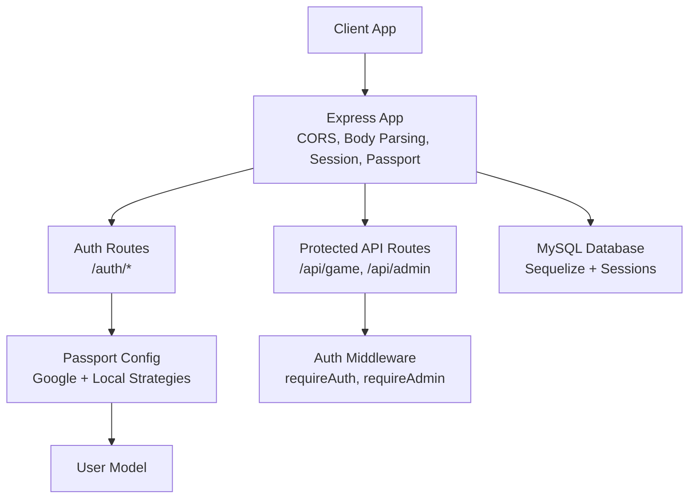
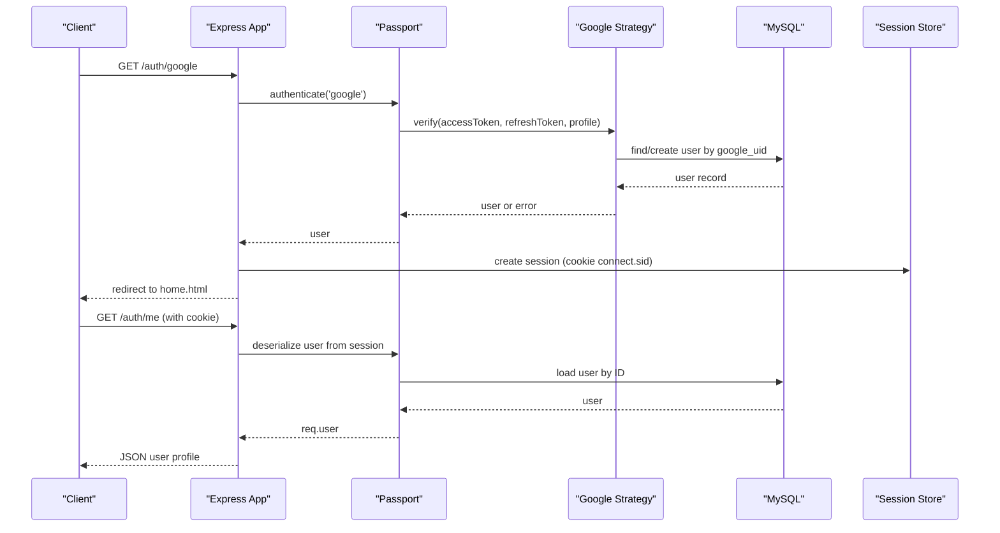
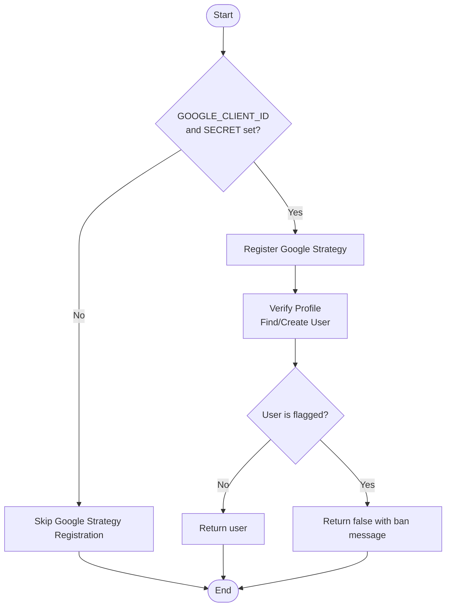
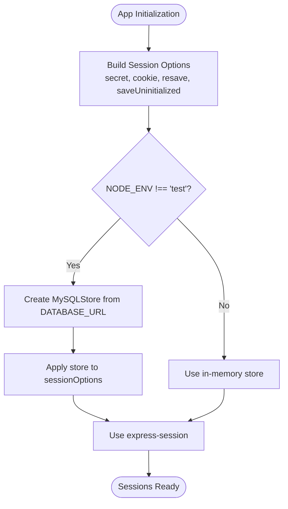
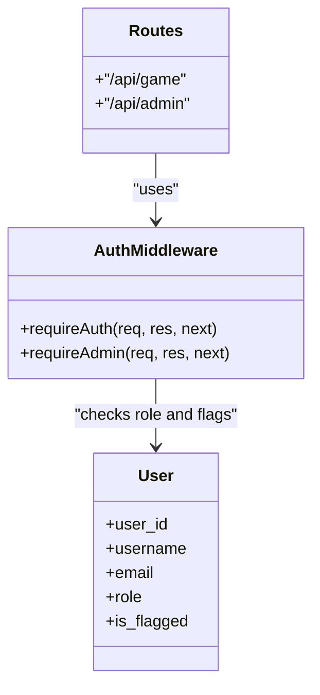
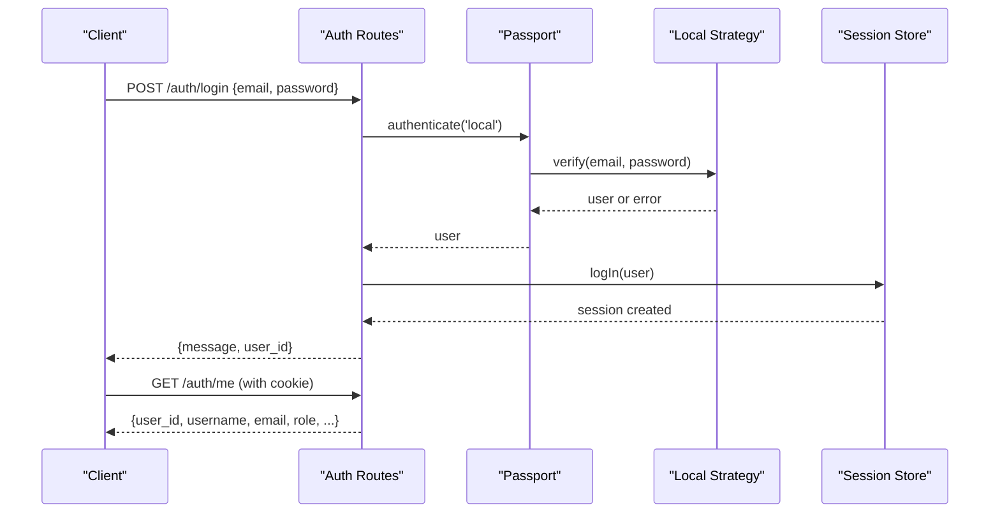
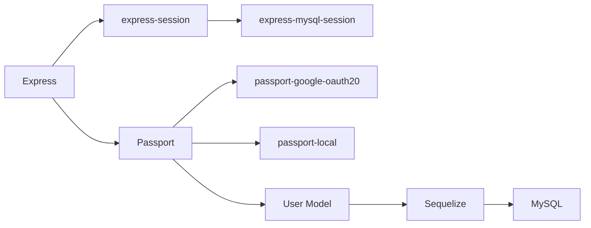

# Authentication & Authorization System

<cite>
**Referenced Files in This Document**   
- [app.js](file://server/src/app.js)
- [passport.js](file://server/src/config/passport.js)
- [authRoutes.js](file://server/src/routes/authRoutes.js)
- [authController.js](file://server/src/controllers/authController.js)
- [authMiddleware.js](file://server/src/middleware/authMiddleware.js)
- [User.js](file://server/src/models/User.js)
- [database.js](file://server/src/config/database.js)
- [antiSpoofing.js](file://server/src/middleware/antiSpoofing.js)
- [auth.md](file://warg-docs/docs/6-api-reference/auth.md)
- [admin-security.md](file://warg-docs/docs/5-policies/admin-security.md)
</cite>

## Table of Contents
1. [Introduction](#introduction)
2. [Project Structure](#project-structure)
3. [Core Components](#core-components)
4. [Architecture Overview](#architecture-overview)
5. [Detailed Component Analysis](#detailed-component-analysis)
6. [Dependency Analysis](#dependency-analysis)
7. [Performance Considerations](#performance-considerations)
8. [Troubleshooting Guide](#troubleshooting-guide)
9. [Conclusion](#conclusion)

## Introduction
This document explains the authentication and authorization system implemented in the WARG Platform backend. It covers:
- Passport.js strategy configuration for Google OAuth and local email/password login
- Session management backed by MySQL via express-mysql-session
- Role-based access control (RBAC) using user roles and flags
- The end-to-end authentication flow from client login to protected route access
- Middleware architecture for protecting routes, checking permissions, and enforcing security policies
- Security considerations including CORS, CSRF posture, rate limiting posture, and session security best practices

Note: The current implementation uses server-side sessions rather than stateless JWT tokens. Documentation references to JWT are clarified where they do not match the actual code.

## Project Structure
The authentication-related code is organized into:
- Application bootstrap and middleware wiring
- Passport strategies for Google OAuth and local login
- Authentication routes for login, signup, logout, and profile retrieval
- Controllers handling signup and existence checks
- Middleware for requiring authentication and admin role
- User model with roles and flags used for authorization decisions

**Diagram sources**
- [app.js:26-117](file://server/src/app.js#L26-L117)
- [authRoutes.js:1-124](file://server/src/routes/authRoutes.js#L1-L124)
- [passport.js:1-99](file://server/src/config/passport.js#L1-L99)
- [User.js:1-28](file://server/src/models/User.js#L1-L28)
- [database.js:1-38](file://server/src/config/database.js#L1-L38)
- [authMiddleware.js:1-22](file://server/src/middleware/authMiddleware.js#L1-L22)

**Section sources**
- [app.js:26-117](file://server/src/app.js#L26-L117)
- [authRoutes.js:1-124](file://server/src/routes/authRoutes.js#L1-L124)
- [passport.js:1-99](file://server/src/config/passport.js#L1-L99)
- [User.js:1-28](file://server/src/models/User.js#L1-L28)
- [database.js:1-38](file://server/src/config/database.js#L1-L38)
- [authMiddleware.js:1-22](file://server/src/middleware/authMiddleware.js#L1-L22)

## Core Components
- Passport strategies:
  - Google OAuth 2.0 strategy that creates or finds users by google_uid and handles banned accounts
  - Local strategy for email/password login with bcrypt verification and provider checks
- Session management:
  - express-session configured with secure cookie settings
  - MySQL-backed session store for persistence across restarts
- Authorization:
  - requireAuth middleware ensures authenticated users and blocks flagged/banned users
  - requireAdmin middleware enforces admin role for administrative routes
- Authentication endpoints:
  - Google OAuth redirect and callback
  - Local signup and login
  - Logout and current user info endpoint

**Section sources**
- [passport.js:24-95](file://server/src/config/passport.js#L24-L95)
- [app.js:50-88](file://server/src/app.js#L50-L88)
- [authMiddleware.js:1-22](file://server/src/middleware/authMiddleware.js#L1-L22)
- [authRoutes.js:6-124](file://server/src/routes/authRoutes.js#L6-L124)

## Architecture Overview
The authentication architecture combines server-side sessions with Passport strategies and Express middleware to protect routes and enforce RBAC.

**Diagram sources**
- [authRoutes.js:6-55](file://server/src/routes/authRoutes.js#L6-L55)
- [passport.js:24-64](file://server/src/config/passport.js#L24-L64)
- [app.js:84-88](file://server/src/app.js#L84-L88)
- [User.js:1-28](file://server/src/models/User.js#L1-L28)

## Detailed Component Analysis

### Passport.js Strategy Configuration
- Google OAuth 2.0:
  - Registered only when GOOGLE_CLIENT_ID and GOOGLE_CLIENT_SECRET are present
  - Callback URL defaults to /auth/google/callback
  - On success: finds existing user by google_uid or creates a new account with auth_provider set to 'google'
  - Banned users (is_flagged) are rejected during strategy verification
- Local Strategy:
  - Uses email and password fields
  - Rejects if user does not exist, is flagged, or lacks a password_hash (indicating Google-only account)
  - Compares provided password against stored hash using bcryptjs

**Diagram sources**
- [passport.js:24-64](file://server/src/config/passport.js#L24-L64)

**Section sources**
- [passport.js:24-95](file://server/src/config/passport.js#L24-L95)

### Session Management with MySQL Sessions
- Session options:
  - Secret from SESSION_SECRET environment variable
  - Cookie settings: httpOnly enabled; secure and sameSite adjusted for production vs development
  - maxAge set to 24 hours
- Persistence:
  - In non-test environments, express-mysql-session is used to persist sessions in MySQL
  - Connection details derived from DATABASE_URL
  - Error handling logs session store errors
- Test behavior:
  - In test mode, in-memory session store is used to avoid external dependencies

**Diagram sources**
- [app.js:50-84](file://server/src/app.js#L50-L84)
- [database.js:1-38](file://server/src/config/database.js#L1-L38)

**Section sources**
- [app.js:50-84](file://server/src/app.js#L50-L84)
- [database.js:1-38](file://server/src/config/database.js#L1-L38)

### Role-Based Access Control (RBAC)
- Roles:
  - User model defines role enum values: player, creator, admin
- Authorization middleware:
  - requireAuth: ensures request is authenticated and user is not flagged; otherwise returns 401 or 403
  - requireAdmin: ensures user has role 'admin'; otherwise returns 403
- Route protection:
  - Game routes under /api/game are protected by requireAuth
  - Admin routes under /api/admin are protected by both requireAuth and requireAdmin

**Diagram sources**
- [authMiddleware.js:1-22](file://server/src/middleware/authMiddleware.js#L1-L22)
- [User.js:1-28](file://server/src/models/User.js#L1-L28)
- [app.js:110-117](file://server/src/app.js#L110-L117)

**Section sources**
- [authMiddleware.js:1-22](file://server/src/middleware/authMiddleware.js#L1-L22)
- [User.js:1-28](file://server/src/models/User.js#L1-L28)
- [app.js:110-117](file://server/src/app.js#L110-L117)

### Authentication Flow: Client Login to Token Validation
Important clarification: The current backend uses server-side sessions, not JWT tokens. The documentation reference mentioning JWT is outdated relative to the current implementation.

- Google OAuth flow:
  - Client initiates login at /auth/google
  - Server redirects to Google consent screen
  - On callback at /auth/google/callback, server authenticates via Passport, logs in user, sets session cookie, and redirects to client home page
  - Subsequent requests include the session cookie; server deserializes user and populates req.user
- Local login flow:
  - Client sends credentials to /auth/login
  - Passport verifies via Local strategy
  - On success, server logs in user and returns a minimal response indicating successful login
- Current user info:
  - Client calls /auth/me with the session cookie to retrieve user profile data

**Diagram sources**
- [authRoutes.js:63-124](file://server/src/routes/authRoutes.js#L63-L124)
- [passport.js:66-95](file://server/src/config/passport.js#L66-L95)
- [app.js:84-88](file://server/src/app.js#L84-L88)

**Section sources**
- [authRoutes.js:63-124](file://server/src/routes/authRoutes.js#L63-L124)
- [passport.js:66-95](file://server/src/config/passport.js#L66-L95)
- [auth.md:59-80](file://warg-docs/docs/6-api-reference/auth.md#L59-L80)

### Protected Route Definitions and Permission Checks
- Game routes:
  - Mounted under /api/game with requireAuth middleware applied globally to all subroutes
- Admin routes:
  - Mounted under /api/admin with requireAuth and requireAdmin middleware applied globally to all subroutes
- Custom permission checks:
  - requireAuth rejects flagged users with a 403 error after confirming authentication
  - requireAdmin restricts access to users with role 'admin'

Examples of protected route definitions:
- Game routes: app.use('/api/game', requireAuth, gameRoutes)
- Admin routes: app.use('/api/admin', requireAuth, requireAdmin, adminRoutes)

**Section sources**
- [app.js:110-117](file://server/src/app.js#L110-L117)
- [authMiddleware.js:1-22](file://server/src/middleware/authMiddleware.js#L1-L22)

### Custom Authentication Strategies
- Google OAuth:
  - Strategy registration conditional on environment variables
  - Handles user creation and lookup based on Google profile
  - Enforces ban check via is_flagged
- Local Strategy:
  - Validates email/password combination
  - Prevents local login for Google-only accounts lacking password_hash
  - Enforces ban check via is_flagged

**Section sources**
- [passport.js:24-95](file://server/src/config/passport.js#L24-L95)

### Security Policies and Best Practices
- CORS:
  - Allowed origins parsed from CLIENT_URL; supports comma-separated list
  - Allows localhost in non-production environments for development convenience
  - Credentials enabled to support cookies
- Session security:
  - httpOnly cookie prevents client-side script access
  - secure flag enforced in production
  - sameSite set to none in production to support cross-site cookies when needed
- CSRF posture:
  - No explicit CSRF middleware is present in the application bootstrap
  - Since the API primarily uses session cookies and JSON responses, CSRF risk depends on client usage patterns
  - Recommendation: add CSRF protection for state-changing endpoints if serving HTML forms or if clients rely on browser-native CSRF protections
- Rate limiting posture:
  - No explicit rate limiting middleware is present
  - Recommendation: add rate limiting for sensitive endpoints like /auth/login and /auth/signup to mitigate brute-force attacks
- Anti-spoofing:
  - Separate anti-spoofing middleware exists for location-based features; it is not part of authentication but demonstrates additional security controls

**Section sources**
- [app.js:29-48](file://server/src/app.js#L29-L48)
- [app.js:50-84](file://server/src/app.js#L50-L84)
- [antiSpoofing.js:1-38](file://server/src/middleware/antiSpoofing.js#L1-L38)

## Dependency Analysis
The authentication subsystem depends on:
- Express for routing and middleware
- Passport for strategy orchestration
- express-session and express-mysql-session for session persistence
- Sequelize and MySQL for user data and session storage
- bcryptjs for password hashing

**Diagram sources**
- [app.js:26-117](file://server/src/app.js#L26-L117)
- [passport.js:1-99](file://server/src/config/passport.js#L1-L99)
- [User.js:1-28](file://server/src/models/User.js#L1-L28)
- [database.js:1-38](file://server/src/config/database.js#L1-L38)

**Section sources**
- [app.js:26-117](file://server/src/app.js#L26-L117)
- [passport.js:1-99](file://server/src/config/passport.js#L1-L99)
- [User.js:1-28](file://server/src/models/User.js#L1-L28)
- [database.js:1-38](file://server/src/config/database.js#L1-L38)

## Performance Considerations
- Session store:
  - MySQL-backed sessions provide persistence but introduce database overhead; ensure proper indexing on session table and monitor connection pool usage
- Database pooling:
  - Sequelize pool configured with reasonable limits; tune based on workload
- Passport serialization:
  - Deserialization loads full user objects; consider excluding unnecessary attributes to reduce payload size
- Request body limits:
  - Large body limits (50mb) may increase memory usage; tighten limits for specific endpoints if possible

[No sources needed since this section provides general guidance]

## Troubleshooting Guide
Common issues and resolutions:
- Google OAuth disabled:
  - If GOOGLE_CLIENT_ID or GOOGLE_CLIENT_SECRET are missing, Google strategy will not register; verify environment variables
- Banned user login attempts:
  - Both Google and Local strategies reject flagged users; check is_flagged status in the user record
- Session errors:
  - If session creation fails, the callback redirects to the client with an error parameter; inspect server logs for session store errors
- Local login failures:
  - Ensure the user has a password_hash if attempting local login; Google-only accounts lack passwords
- Admin access denied:
  - Require admin role; verify user.role equals 'admin'

**Section sources**
- [passport.js:24-95](file://server/src/config/passport.js#L24-L95)
- [authRoutes.js:18-55](file://server/src/routes/authRoutes.js#L18-L55)
- [authMiddleware.js:1-22](file://server/src/middleware/authMiddleware.js#L1-L22)

## Conclusion
The WARG Platform backend implements a robust authentication and authorization system using Passport.js strategies for Google OAuth and local login, with server-side sessions persisted in MySQL. Role-based access control is enforced through middleware that protects routes and validates user roles and flags. While the current implementation relies on sessions rather than JWT tokens, it provides strong security foundations with CORS, secure session cookies, and clear separation between authentication and authorization concerns. Recommended enhancements include adding CSRF protection and rate limiting to further harden the system.

[No sources needed since this section summarizes without analyzing specific files]