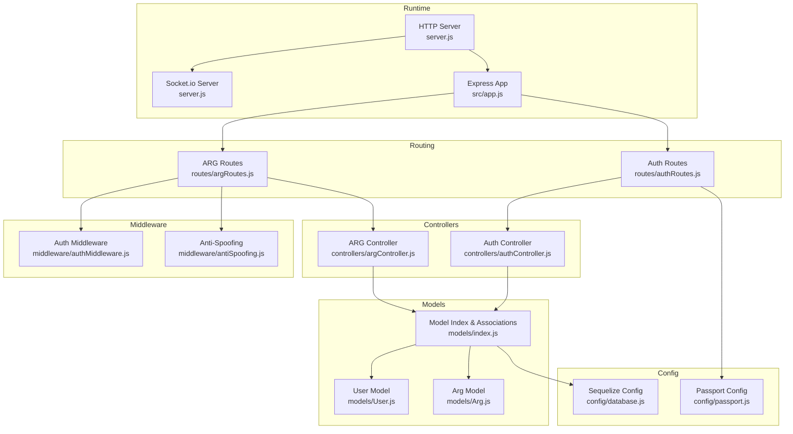
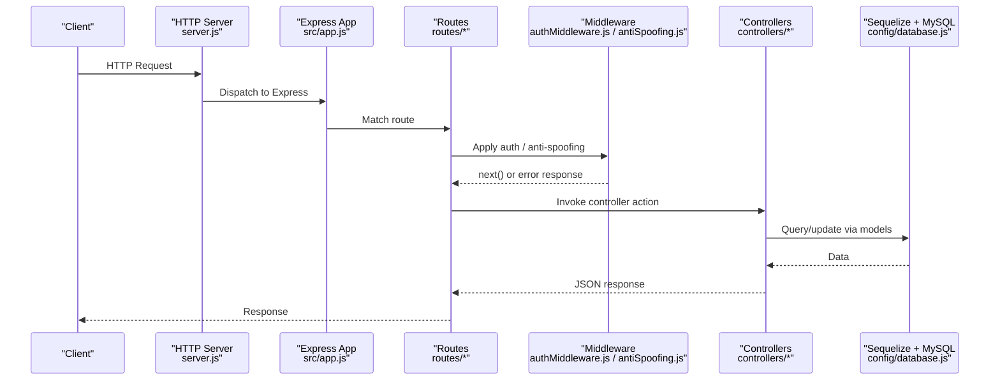
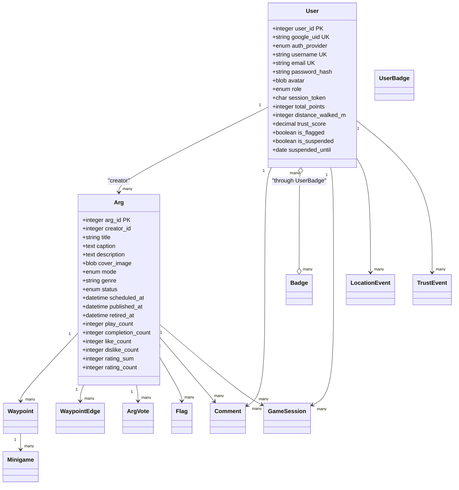
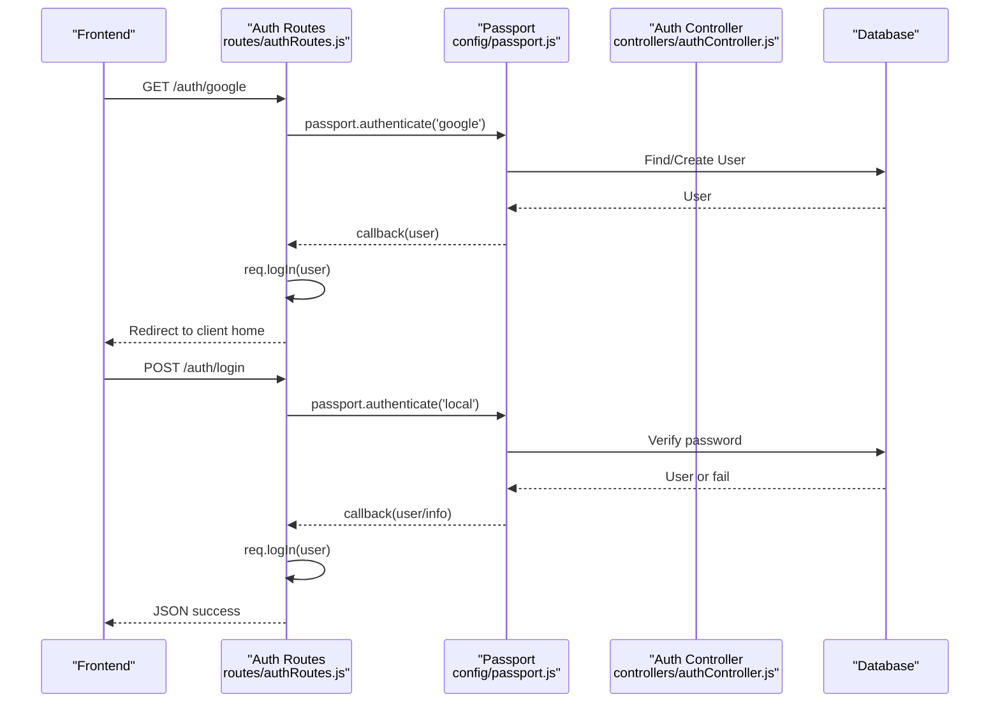
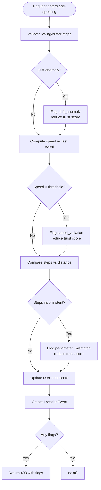
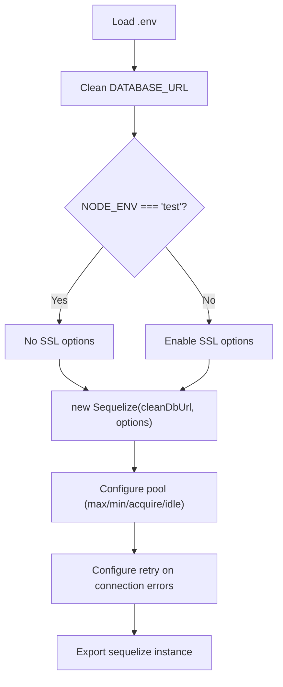
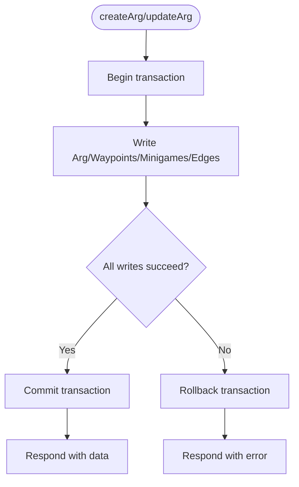
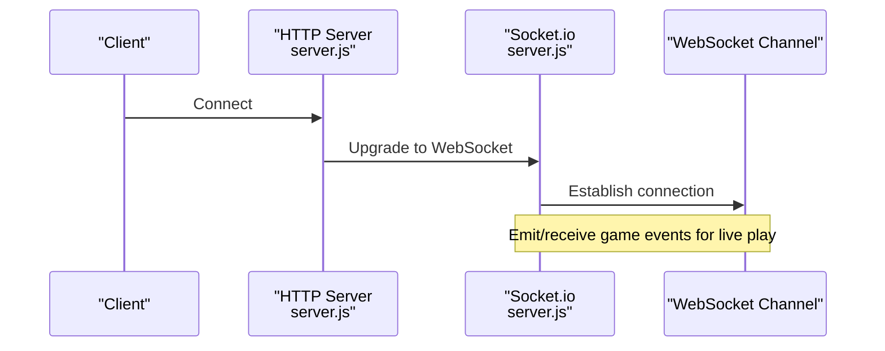
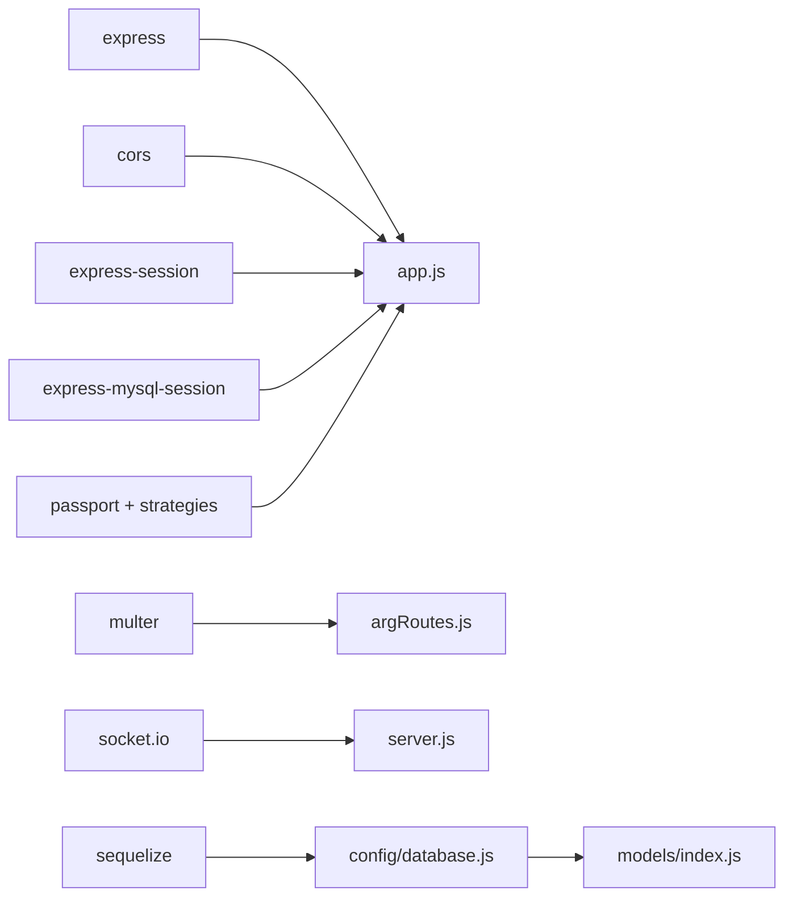

# Backend Architecture

<cite>
**Referenced Files in This Document**
- [server.js](file://server/server.js)
- [app.js](file://server/src/app.js)
- [database.js](file://server/src/config/database.js)
- [passport.js](file://server/src/config/passport.js)
- [index.js](file://server/src/models/index.js)
- [User.js](file://server/src/models/User.js)
- [Arg.js](file://server/src/models/Arg.js)
- [authRoutes.js](file://server/src/routes/authRoutes.js)
- [argRoutes.js](file://server/src/routes/argRoutes.js)
- [authController.js](file://server/src/controllers/authController.js)
- [argController.js](file://server/src/controllers/argController.js)
- [authMiddleware.js](file://server/src/middleware/authMiddleware.js)
- [antiSpoofing.js](file://server/src/middleware/antiSpoofing.js)
</cite>

## Table of Contents
1. [Introduction](#introduction)
2. [Project Structure](#project-structure)
3. [Core Components](#core-components)
4. [Architecture Overview](#architecture-overview)
5. [Detailed Component Analysis](#detailed-component-analysis)
6. [Dependency Analysis](#dependency-analysis)
7. [Performance Considerations](#performance-considerations)
8. [Troubleshooting Guide](#troubleshooting-guide)
9. [Conclusion](#conclusion)

## Introduction
This document explains the backend architecture of the WARG Platform’s Node.js/Express server. It covers the MVC pattern (controllers, models, routes), middleware for authentication and security, database configuration with Sequelize ORM, and real-time multiplayer support via WebSockets. It also includes concrete examples from the codebase and guidance on environment configuration and common operational issues.

## Project Structure
The server follows a feature-based MVC layout:
- Entry point initializes HTTP server, Socket.io, and Express app
- App wiring mounts routes, session management, Passport, and static assets
- Routes delegate to controllers
- Controllers orchestrate business logic using Sequelize models
- Models define schema and associations
- Middleware enforces auth, admin roles, and anti-spoofing rules

**Diagram sources**
- [server.js:1-37](file://server/server.js#L1-L37)
- [app.js:1-132](file://server/src/app.js#L1-L132)
- [authRoutes.js:1-124](file://server/src/routes/authRoutes.js#L1-L124)
- [argRoutes.js:1-32](file://server/src/routes/argRoutes.js#L1-L32)
- [authController.js:1-83](file://server/src/controllers/authController.js#L1-L83)
- [argController.js:1-452](file://server/src/controllers/argController.js#L1-L452)
- [index.js:1-135](file://server/src/models/index.js#L1-L135)
- [User.js:1-28](file://server/src/models/User.js#L1-L28)
- [Arg.js:1-31](file://server/src/models/Arg.js#L1-L31)
- [database.js:1-38](file://server/src/config/database.js#L1-L38)
- [passport.js:1-99](file://server/src/config/passport.js#L1-L99)
- [authMiddleware.js:1-22](file://server/src/middleware/authMiddleware.js#L1-L22)
- [antiSpoofing.js:1-168](file://server/src/middleware/antiSpoofing.js#L1-L168)

**Section sources**
- [server.js:1-37](file://server/server.js#L1-L37)
- [app.js:1-132](file://server/src/app.js#L1-L132)

## Core Components
- Express application setup: CORS, body parsing limits, trust proxy, sessions, Passport initialization, route mounting, and static file serving
- Authentication: Google OAuth and local email/password strategies via Passport; session persistence with MySQL-backed store in non-test environments
- Database: Sequelize ORM configured with SSL, connection pooling, and retry policies
- Models and associations: Centralized model index defining relationships across users, args, waypoints, minigames, votes, flags, comments, badges, and events
- Controllers: Auth controller handles signup and user existence checks; ARG controller implements CRUD, voting, flagging, cover image handling, and transactional waypoint/minigame updates
- Middleware: Role-based authorization and anti-spoofing validation for location inputs

**Section sources**
- [app.js:1-132](file://server/src/app.js#L1-L132)
- [passport.js:1-99](file://server/src/config/passport.js#L1-L99)
- [database.js:1-38](file://server/src/config/database.js#L1-L38)
- [index.js:1-135](file://server/src/models/index.js#L1-L135)
- [authController.js:1-83](file://server/src/controllers/authController.js#L1-L83)
- [argController.js:1-452](file://server/src/controllers/argController.js#L1-L452)
- [authMiddleware.js:1-22](file://server/src/middleware/authMiddleware.js#L1-L22)
- [antiSpoofing.js:1-168](file://server/src/middleware/antiSpoofing.js#L1-L168)

## Architecture Overview
The runtime starts an HTTP server, attaches an Express app, and configures Socket.io for live gameplay. The Express app wires up routes, sessions, Passport, and static assets. Requests flow through middleware (auth, anti-spoofing) into controllers that use Sequelize models backed by MySQL.

**Diagram sources**
- [server.js:1-37](file://server/server.js#L1-L37)
- [app.js:1-132](file://server/src/app.js#L1-L132)
- [authMiddleware.js:1-22](file://server/src/middleware/authMiddleware.js#L1-L22)
- [antiSpoofing.js:1-168](file://server/src/middleware/antiSpoofing.js#L1-L168)
- [database.js:1-38](file://server/src/config/database.js#L1-L38)

## Detailed Component Analysis

### MVC Pattern: Routes, Controllers, Models
- Routes organize endpoints per domain (auth, args, users, sessions, comments, feedback, ai, minigames, game, admin). Some routes are protected by requireAuth and requireAdmin.
- Controllers implement request handling:
  - Auth controller: signup with password hashing and immediate login; check-user endpoint for uniqueness validation
  - ARG controller: list/get by id with included relations; create/update with transactions; vote/flag; cover image upload and retrieval
- Models define schemas and associations centrally in the model index.

**Diagram sources**
- [User.js:1-28](file://server/src/models/User.js#L1-L28)
- [Arg.js:1-31](file://server/src/models/Arg.js#L1-L31)
- [index.js:24-110](file://server/src/models/index.js#L24-L110)

**Section sources**
- [authRoutes.js:1-124](file://server/src/routes/authRoutes.js#L1-L124)
- [argRoutes.js:1-32](file://server/src/routes/argRoutes.js#L1-L32)
- [authController.js:1-83](file://server/src/controllers/authController.js#L1-L83)
- [argController.js:1-452](file://server/src/controllers/argController.js#L1-L452)
- [index.js:1-135](file://server/src/models/index.js#L1-L135)

### Authentication and Authorization
- Passport strategies:
  - Google OAuth: conditional registration when credentials exist; creates or retrieves users; supports banned user handling
  - Local strategy: email/password verification with bcrypt; prevents local login for Google-only accounts
- Session management:
  - express-session with MySQL-backed store in production/dev; in-memory store in tests
  - Cookie options include secure, sameSite, httpOnly, and maxAge
- Route protection:
  - requireAuth ensures authenticated users and blocks flagged accounts
  - requireAdmin restricts admin-only routes

**Diagram sources**
- [authRoutes.js:7-81](file://server/src/routes/authRoutes.js#L7-L81)
- [passport.js:24-95](file://server/src/config/passport.js#L24-L95)
- [authController.js:5-60](file://server/src/controllers/authController.js#L5-L60)

**Section sources**
- [passport.js:1-99](file://server/src/config/passport.js#L1-L99)
- [authRoutes.js:1-124](file://server/src/routes/authRoutes.js#L1-L124)
- [authController.js:1-83](file://server/src/controllers/authController.js#L1-L83)
- [authMiddleware.js:1-22](file://server/src/middleware/authMiddleware.js#L1-L22)
- [app.js:50-88](file://server/src/app.js#L50-L88)

### Request Validation and Security Measures
- CORS: dynamic origin allowlist based on CLIENT_URL; allows localhost in non-production
- Body parsing: JSON and URL-encoded bodies limited to 50MB
- File uploads: Multer memory storage with size limit and MIME type filter for images
- Anti-spoofing middleware:
  - Validates drift variance in location buffer
  - Computes speed between last known location and current
  - Compares pedometer steps against distance
  - Updates user trust score and flags suspicious activity
  - Logs LocationEvent and TrustEvent records

**Diagram sources**
- [antiSpoofing.js:27-164](file://server/src/middleware/antiSpoofing.js#L27-L164)

**Section sources**
- [app.js:29-46](file://server/src/app.js#L29-L46)
- [argRoutes.js:7-19](file://server/src/routes/argRoutes.js#L7-L19)
- [antiSpoofing.js:1-168](file://server/src/middleware/antiSpoofing.js#L1-L168)

### Database Connection Management (Sequelize ORM)
- Connection string cleaning and dialect options:
  - Removes ssl-mode parameter from DATABASE_URL
  - Enables SSL in non-test environments
- Pool configuration:
  - max/min connections, acquire/idle timeouts
- Retry policy:
  - Retries on specific connection errors and timeouts

**Diagram sources**
- [database.js:1-38](file://server/src/config/database.js#L1-L38)

**Section sources**
- [database.js:1-38](file://server/src/config/database.js#L1-L38)

### Transaction Handling in Controllers
- ARG creation and update wrap multiple writes (Arg, Waypoint, Minigame, WaypointEdge) in a single transaction
- On success, commit and return mapped IDs; on failure, rollback and return error details

**Diagram sources**
- [argController.js:78-156](file://server/src/controllers/argController.js#L78-L156)
- [argController.js:159-325](file://server/src/controllers/argController.js#L159-L325)

**Section sources**
- [argController.js:78-156](file://server/src/controllers/argController.js#L78-L156)
- [argController.js:159-325](file://server/src/controllers/argController.js#L159-L325)

### WebSocket Integration for Real-Time Multiplayer
- Socket.io server attached to the same HTTP server
- CORS configured for allowed origins from CLIENT_URL
- Intended for live/co-op game modes and geofenced state broadcasting

**Diagram sources**
- [server.js:1-37](file://server/server.js#L1-L37)

**Section sources**
- [server.js:1-37](file://server/server.js#L1-L37)

## Dependency Analysis
Key dependencies and their roles:
- Express: web framework and routing
- cors: cross-origin requests
- express-session: session management
- express-mysql-session: persistent sessions in MySQL
- passport + strategies: authentication
- multer: file uploads
- socket.io: real-time communication
- sequelize: ORM and connection management

**Diagram sources**
- [app.js:1-132](file://server/src/app.js#L1-L132)
- [server.js:1-37](file://server/server.js#L1-L37)
- [argRoutes.js:1-32](file://server/src/routes/argRoutes.js#L1-L32)
- [database.js:1-38](file://server/src/config/database.js#L1-L38)
- [index.js:1-135](file://server/src/models/index.js#L1-L135)

**Section sources**
- [app.js:1-132](file://server/src/app.js#L1-L132)
- [server.js:1-37](file://server/server.js#L1-L37)

## Performance Considerations
- Connection pooling:
  - Tune pool.max and pool.min according to expected concurrency and database capacity
  - Monitor acquire and idle timeouts to avoid connection starvation
- Session store:
  - Use MySQL-backed store in production to survive restarts; ensure session table exists and indexes are adequate
- Body parsing limits:
  - Keep 50MB limit only if necessary; consider streaming large files to object storage instead of memory
- File uploads:
  - MemoryStorage keeps files in RAM; for high throughput, consider disk storage or external object storage
- Anti-spoofing computations:
  - Avoid heavy calculations on hot paths; cache recent events where appropriate
- Database queries:
  - Use selective includes and attributes to reduce payload size
  - Add indexes on frequently filtered columns (e.g., status, user_id)

[No sources needed since this section provides general guidance]

## Troubleshooting Guide
- Connection timeouts and refused connections:
  - Ensure DATABASE_URL is correct and SSL settings match provider requirements
  - Rely on Sequelize retry configuration for transient failures
- Session not persisting:
  - Verify MySQL session store credentials and table creation
  - In tests, confirm in-memory store is used intentionally
- CORS errors:
  - Set CLIENT_URL to include all allowed origins; ensure trailing slashes are normalized
- Authentication failures:
  - For Google OAuth, verify GOOGLE_CLIENT_ID and GOOGLE_CLIENT_SECRET are set
  - For local login, ensure password_hash exists for local accounts
- Anti-spoofing denials:
  - Review flags returned by anti-spoofing middleware; adjust thresholds if legitimate movement is blocked
- Memory leaks:
  - Avoid storing large buffers in memory; stream uploads or offload to object storage
  - Reuse Sequelize instances and avoid creating new connections per request

**Section sources**
- [database.js:1-38](file://server/src/config/database.js#L1-L38)
- [app.js:50-88](file://server/src/app.js#L50-L88)
- [passport.js:24-64](file://server/src/config/passport.js#L24-L64)
- [antiSpoofing.js:142-147](file://server/src/middleware/antiSpoofing.js#L142-L147)

## Conclusion
The WARG Platform backend uses a clear MVC structure with robust authentication, strong security measures, and reliable database management. Transactions ensure data consistency during complex operations, while anti-spoofing protects integrity of location-based features. Socket.io enables real-time multiplayer experiences. Proper configuration of environment variables and monitoring of performance bottlenecks will help maintain a stable and scalable system.