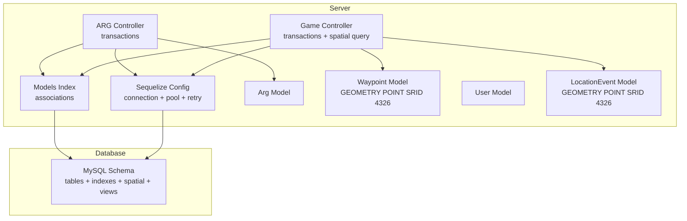
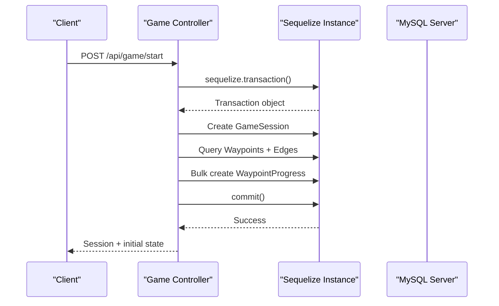
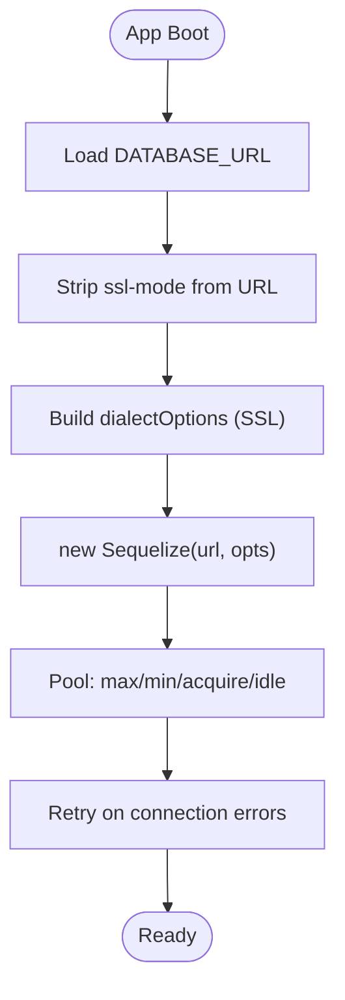
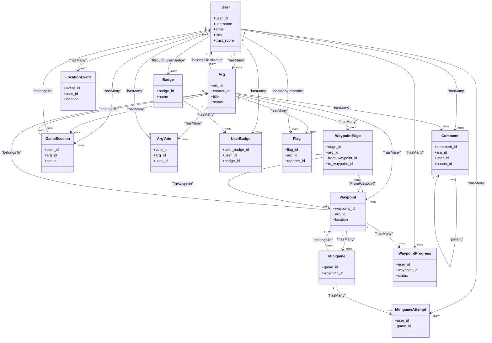
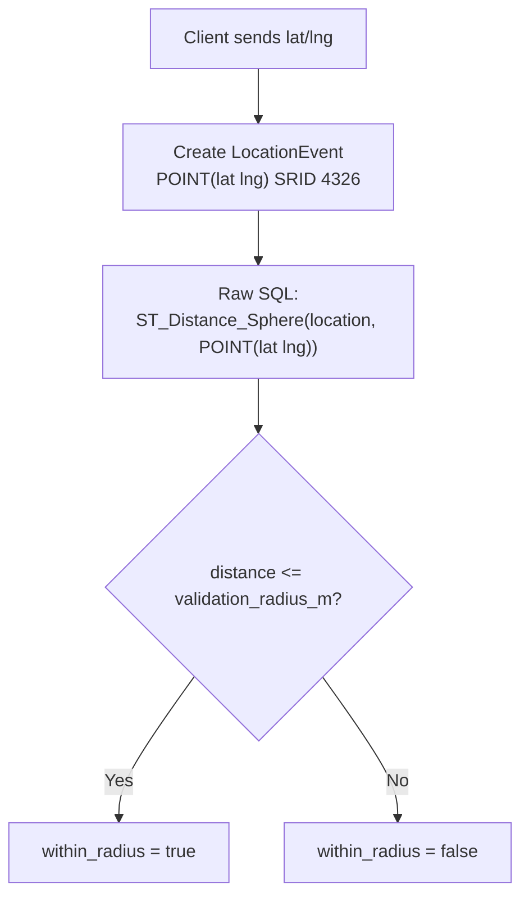
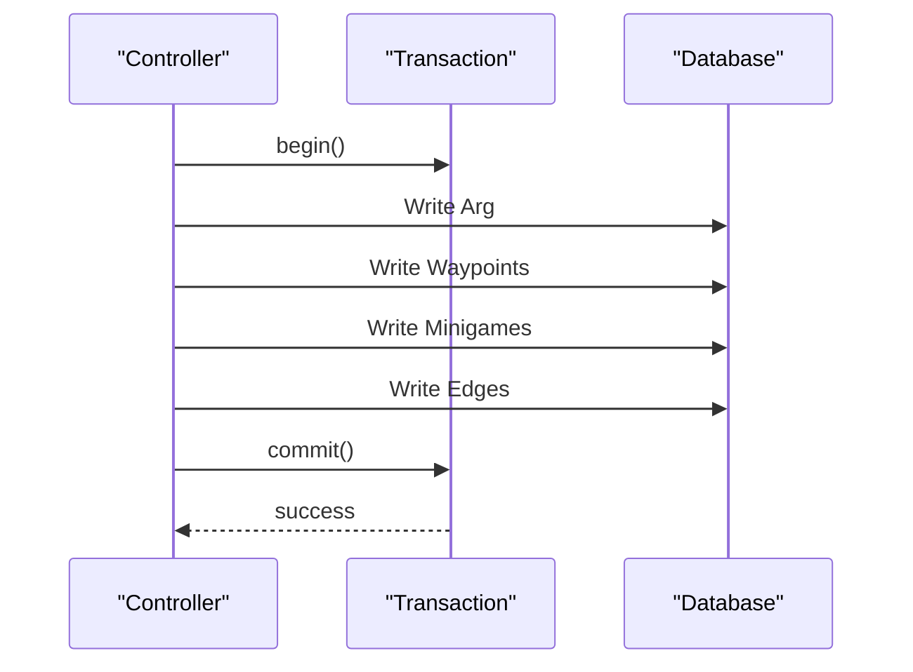
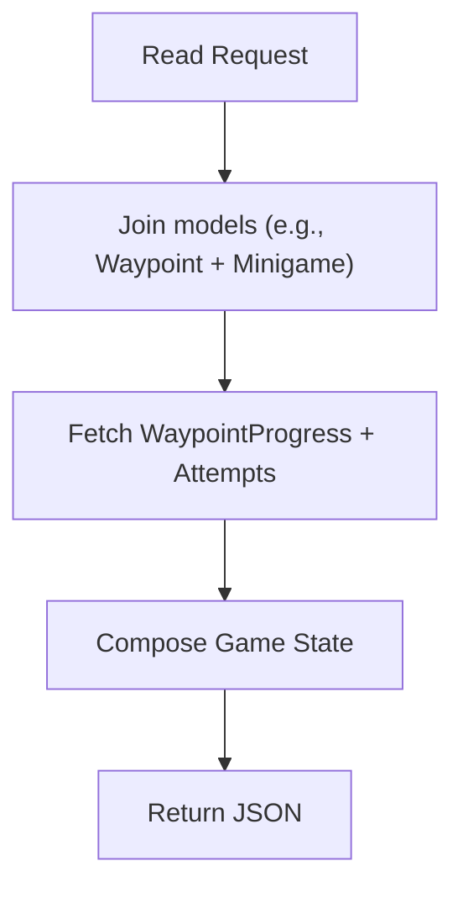
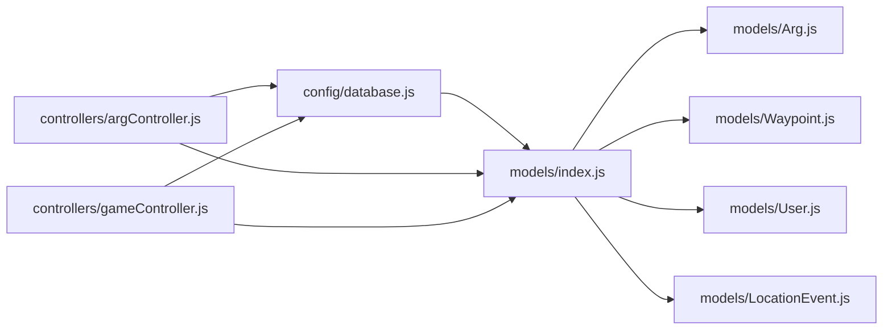
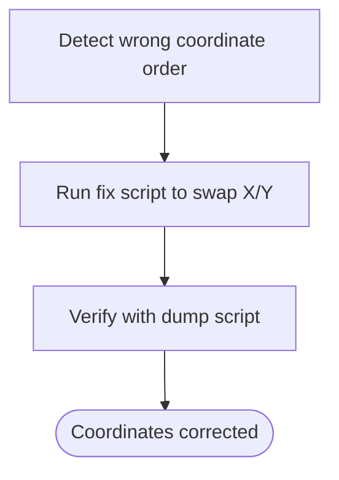

# Database Layer & ORM

<cite>
**Referenced Files in This Document**
- [database.js](file://server/src/config/database.js)
- [index.js](file://server/src/models/index.js)
- [schema.sql](file://database/schema.sql)
- [Arg.js](file://server/src/models/Arg.js)
- [Waypoint.js](file://server/src/models/Waypoint.js)
- [User.js](file://server/src/models/User.js)
- [LocationEvent.js](file://server/src/models/LocationEvent.js)
- [argController.js](file://server/src/controllers/argController.js)
- [gameController.js](file://server/src/controllers/gameController.js)
- [test_loc.js](file://server/test_loc.js)
- [fix_wp.js](file://server/fix_wp.js)
- [dump_wp.js](file://server/dump_wp.js)
</cite>

## Table of Contents
1. [Introduction](#introduction)
2. [Project Structure](#project-structure)
3. [Core Components](#core-components)
4. [Architecture Overview](#architecture-overview)
5. [Detailed Component Analysis](#detailed-component-analysis)
6. [Dependency Analysis](#dependency-analysis)
7. [Performance Considerations](#performance-considerations)
8. [Troubleshooting Guide](#troubleshooting-guide)
9. [Conclusion](#conclusion)

## Introduction
This document explains the database layer and Sequelize ORM usage in the WARG Platform. It covers connection pooling, transaction management, query optimization strategies, model relationships (hasMany, belongsTo, through), spatial features for geospatial queries, complex queries and joins, migration strategy, backup procedures, and production monitoring approaches.

## Project Structure
The database layer is implemented with:
- A centralized Sequelize configuration that sets up MySQL connectivity, SSL options, connection pooling, and retry behavior.
- An index file that wires all models and defines associations.
- A comprehensive SQL schema defining tables, indexes, spatial columns, and views.
- Controllers that use transactions and raw SQL for spatial operations.

**Diagram sources**
- [database.js:11-35](file://server/src/config/database.js#L11-L35)
- [index.js:24-110](file://server/src/models/index.js#L24-L110)
- [schema.sql:160-179](file://database/schema.sql#L160-L179)
- [schema.sql:354-372](file://database/schema.sql#L354-L372)
- [argController.js:78-156](file://server/src/controllers/argController.js#L78-L156)
- [gameController.js:40-83](file://server/src/controllers/gameController.js#L40-L83)
- [gameController.js:163-201](file://server/src/controllers/gameController.js#L163-L201)

**Section sources**
- [database.js:1-38](file://server/src/config/database.js#L1-L38)
- [index.js:1-135](file://server/src/models/index.js#L1-L135)
- [schema.sql:1-691](file://database/schema.sql#L1-L691)

## Core Components
- Connection and Pooling: Centralized Sequelize instance with MySQL dialect, SSL options, pool sizing, and retry rules.
- Models and Associations: All domain entities are defined as Sequelize models; relationships are declared in a single index file using hasMany, belongsTo, and through.
- Spatial Data: Geometric POINT columns with SRID 4326 for geolocation data; spatial indexes on waypoints and location events.
- Transactions: Controllers wrap multi-step writes in transactions to ensure consistency.
- Raw SQL for Spatial Queries: Distance calculations use MySQL spatial functions via Sequelize’s raw query interface.

**Section sources**
- [database.js:11-35](file://server/src/config/database.js#L11-L35)
- [index.js:24-110](file://server/src/models/index.js#L24-L110)
- [schema.sql:160-179](file://database/schema.sql#L160-L179)
- [schema.sql:354-372](file://database/schema.sql#L354-L372)
- [argController.js:78-156](file://server/src/controllers/argController.js#L78-L156)
- [gameController.js:163-201](file://server/src/controllers/gameController.js#L163-L201)

## Architecture Overview
The application uses Sequelize as an ORM over MySQL. The configuration module exports a shared Sequelize instance used by all models and controllers. Models define attributes and table mappings; relationships are centralized. Controllers orchestrate business logic, often wrapping multiple writes in transactions. Spatial queries leverage MySQL’s geometry types and functions.

**Diagram sources**
- [gameController.js:40-83](file://server/src/controllers/gameController.js#L40-L83)
- [database.js:11-35](file://server/src/config/database.js#L11-L35)

## Detailed Component Analysis

### Connection Pooling and Retry Configuration
- Dialect: MySQL.
- SSL: Enabled in non-test environments with strict requirements disabled for convenience.
- Pool: max connections, min idle connections, acquire timeout, and idle timeout configured.
- Retry: Automatic retries for common connection-related errors.

**Diagram sources**
- [database.js:4-35](file://server/src/config/database.js#L4-L35)

**Section sources**
- [database.js:1-38](file://server/src/config/database.js#L1-L38)

### Model Relationships
Relationships are defined centrally:
- User follows: self-referential many-to-many via UserFollow.
- FriendRequest: belongsTo User twice (sender/receiver).
- Notification: belongsTo User; User hasMany Notification.
- Arg: belongsTo User (creator); User hasMany Arg.
- Waypoint: belongsTo Arg; Arg hasMany Waypoint.
- WaypointEdge: belongsTo Arg; belongsTo Waypoint twice (from/to).
- Minigame: belongsTo Waypoint; Waypoint hasMany Minigame.
- Asset: belongsTo User (uploader), Waypoint, Arg.
- GameSession: belongsTo User and Arg; both haveMany.
- WaypointProgress: belongsTo User and Waypoint.
- MinigameAttempt: belongsTo User and Minigame.
- Tracking events: LocationEvent, TrustEvent, ArgVote belongTo User; ArgVote also belongsTo Arg; Arg hasMany ArgVote.
- Badges: User and Badge many-to-many via UserBadge; direct hasMany from User/Badge to UserBadge.
- Flags: belongsTo Arg and User (reporter/resolver); Arg and User haveMany Flag.
- Comments: belongsTo User and Arg; self-referential replies.
- UserFeedback: belongsTo User; User hasMany.

**Diagram sources**
- [index.js:24-110](file://server/src/models/index.js#L24-L110)

**Section sources**
- [index.js:24-110](file://server/src/models/index.js#L24-L110)

### Spatial Database Features and Geospatial Queries
- Waypoints store a POINT column with SRID 4326 and a spatial index.
- Location events store a POINT column with SRID 4326 and a spatial index.
- Controllers construct POINT values using ST_GeomFromText and compute distances using ST_Distance_Sphere.

**Diagram sources**
- [schema.sql:160-179](file://database/schema.sql#L160-L179)
- [schema.sql:354-372](file://database/schema.sql#L354-L372)
- [gameController.js:163-201](file://server/src/controllers/gameController.js#L163-L201)
- [test_loc.js:4-17](file://server/test_loc.js#L4-L17)

**Section sources**
- [Waypoint.js:4-17](file://server/src/models/Waypoint.js#L4-L17)
- [LocationEvent.js:4-18](file://server/src/models/LocationEvent.js#L4-L18)
- [schema.sql:160-179](file://database/schema.sql#L160-L179)
- [schema.sql:354-372](file://database/schema.sql#L354-L372)
- [gameController.js:163-201](file://server/src/controllers/gameController.js#L163-L201)
- [test_loc.js:4-17](file://server/test_loc.js#L4-L17)

### Transaction Management
Transactions are used to ensure atomicity across related writes:
- Creating an ARG includes creating the ARG, waypoints, minigames, and edges within one transaction.
- Starting a game session creates or resumes a session and initializes waypoint progress atomically.
- Submitting a minigame result is wrapped in a transaction to update attempts and progress consistently.

**Diagram sources**
- [argController.js:78-156](file://server/src/controllers/argController.js#L78-L156)
- [gameController.js:40-83](file://server/src/controllers/gameController.js#L40-L83)

**Section sources**
- [argController.js:78-156](file://server/src/controllers/argController.js#L78-L156)
- [gameController.js:40-83](file://server/src/controllers/gameController.js#L40-L83)

### Complex Queries, Joins, and Performance Tuning
- Joins: Controllers include related models (e.g., waypoints with minigames) and fetch progress and attempts together to build full game state.
- Indexes: The schema defines numerous indexes (e.g., on arg status, mode, genre, published_at; on user role/trust; on foreign keys; composite leaderboard indexes).
- Spatial Indexes: SPATIAL INDEX on waypoints.location and location_events.location to accelerate proximity checks.
- Denormalization: ARG aggregates (play_count, completion_count, like/dislike counts, rating_sum/count) reduce heavy aggregation at read time.
- Views: Precomputed views (e.g., average rating per ARG, player stats, friend activity feed) simplify frequent reads.

**Diagram sources**
- [gameController.js:85-161](file://server/src/controllers/gameController.js#L85-L161)
- [schema.sql:645-683](file://database/schema.sql#L645-L683)

**Section sources**
- [gameController.js:85-161](file://server/src/controllers/gameController.js#L85-L161)
- [schema.sql:114-151](file://database/schema.sql#L114-L151)
- [schema.sql:160-179](file://database/schema.sql#L160-L179)
- [schema.sql:354-372](file://database/schema.sql#L354-L372)
- [schema.sql:645-683](file://database/schema.sql#L645-L683)

## Dependency Analysis
The database layer depends on:
- Sequelize instance exported from the config module.
- Individual model files exporting entity definitions.
- The models index wiring all relationships.
- Controllers importing models and the shared Sequelize instance for transactions and raw queries.

**Diagram sources**
- [database.js:1-38](file://server/src/config/database.js#L1-L38)
- [index.js:1-23](file://server/src/models/index.js#L1-L23)
- [argController.js:78-156](file://server/src/controllers/argController.js#L78-L156)
- [gameController.js:40-83](file://server/src/controllers/gameController.js#L40-L83)

**Section sources**
- [database.js:1-38](file://server/src/config/database.js#L1-L38)
- [index.js:1-135](file://server/src/models/index.js#L1-L135)
- [argController.js:78-156](file://server/src/controllers/argController.js#L78-L156)
- [gameController.js:40-83](file://server/src/controllers/gameController.js#L40-L83)

## Performance Considerations
- Connection Pool Sizing: Tune pool.max based on CPU cores and expected concurrency; keep pool.min low to avoid idle connections.
- SSL Overhead: In production, consider enabling proper certificate validation if supported by your hosting environment.
- Spatial Queries: Use SPATIAL INDEX on POINT columns; prefer ST_Distance_Sphere for quick distance checks; avoid full-table scans by filtering on arg_id first.
- Index Strategy: Ensure frequently filtered columns (status, mode, genre, published_at, user role/trust) are indexed; add composite indexes where queries filter on multiple fields.
- Denormalized Aggregates: Keep ARG aggregate counters updated via triggers or application logic to avoid expensive COUNT/SUM at read time.
- Batch Writes: Use Promise.all with transactions for bulk inserts (e.g., initializing waypoint progress).
- Raw SQL for Spatial Ops: Use raw queries for advanced spatial functions not exposed by Sequelize’s API.

[No sources needed since this section provides general guidance]

## Troubleshooting Guide
- Coordinate Order Issues: If POINT coordinates appear reversed (longitude/latitude swapped), correct them using a script that swaps X/Y when necessary.
- Inserting Spatial Points: When inserting POINT values via Sequelize, construct them using ST_GeomFromText with explicit SRID 4326.
- Debugging Spatial Data: Dump sample rows with ST_AsText to inspect stored coordinates.

**Diagram sources**
- [fix_wp.js:3-10](file://server/fix_wp.js#L3-L10)
- [dump_wp.js:10-18](file://server/dump_wp.js#L10-L18)

**Section sources**
- [fix_wp.js:1-13](file://server/fix_wp.js#L1-L13)
- [dump_wp.js:1-20](file://server/dump_wp.js#L1-L20)
- [test_loc.js:1-18](file://server/test_loc.js#L1-L18)

## Migration Strategy
- Schema Definition: The canonical schema is maintained in schema.sql with InnoDB, utf8mb4, and spatial SRID 4326.
- Application Migrations: For incremental changes, introduce versioned migration scripts executed during deployment. Apply migrations before starting the server to ensure schema consistency.
- Backward Compatibility: Add new columns with defaults and nullable flags to avoid breaking existing clients; deprecate legacy fields gradually.

[No sources needed since this section provides general guidance]

## Backup Procedures
- Logical Backups: Use mysqldump to export schema and data periodically; schedule automated backups off-hours.
- Point-in-Time Recovery: Enable binary logs and configure replication for PITR capabilities.
- Validation: Regularly restore backups to a staging environment to validate integrity.

[No sources needed since this section provides general guidance]

## Monitoring Approaches
- Query Logging: Temporarily enable Sequelize logging to capture slow queries; analyze patterns and optimize with indexes or rewritten queries.
- Metrics: Track connection pool utilization, query latency, error rates, and spatial query performance.
- Alerts: Set alerts for connection failures, high pool wait times, and slow queries exceeding thresholds.

**Section sources**
- [database.js:11-14](file://server/src/config/database.js#L11-L14)

## Conclusion
The WARG Platform’s database layer leverages Sequelize with MySQL to provide robust relational modeling, strong transactional guarantees, and powerful geospatial capabilities. Proper indexing, denormalized aggregates, and precomputed views support efficient reads, while spatial indexes and raw SQL functions enable accurate location-based operations. With careful tuning of connection pools, migrations, backups, and monitoring, the system can scale reliably in production.