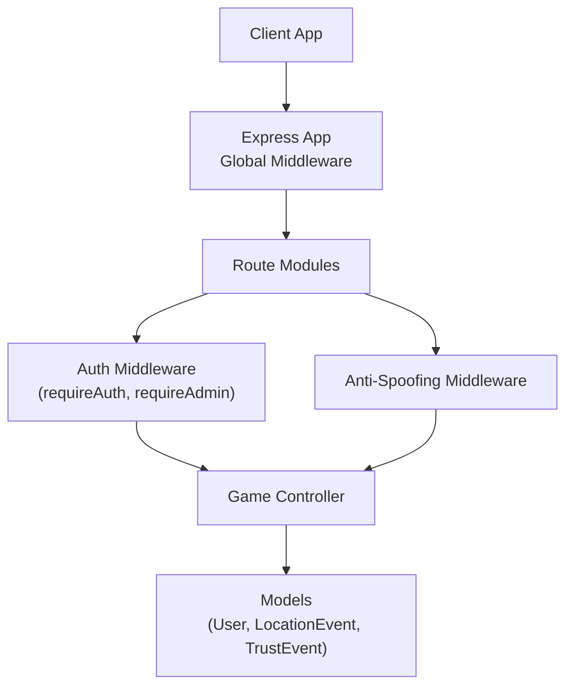
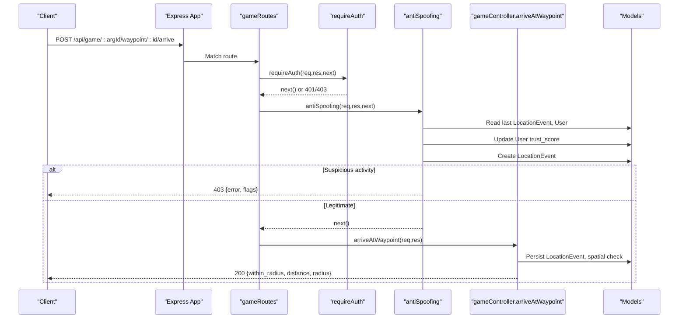
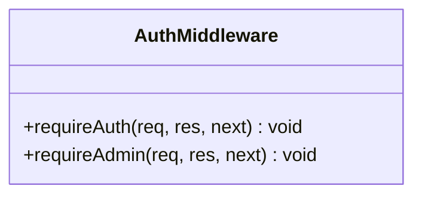
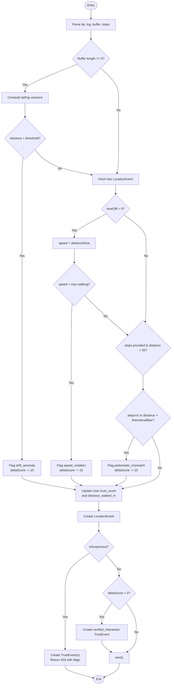
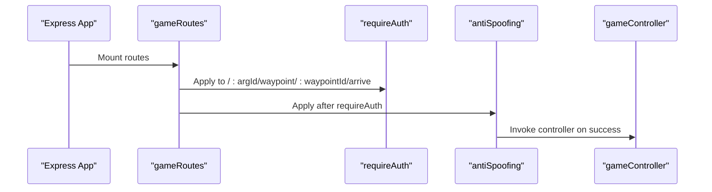
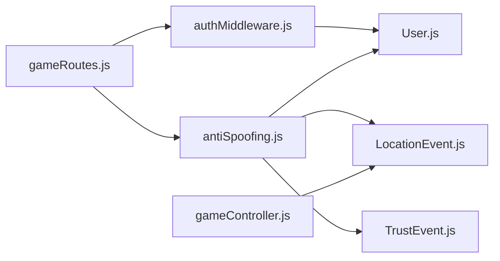

# Middleware Architecture

<cite>
**Referenced Files in This Document**
- [app.js](file://server/src/app.js)
- [authMiddleware.js](file://server/src/middleware/authMiddleware.js)
- [antiSpoofing.js](file://server/src/middleware/antiSpoofing.js)
- [gameRoutes.js](file://server/src/routes/gameRoutes.js)
- [gameController.js](file://server/src/controllers/gameController.js)
- [User.js](file://server/src/models/User.js)
- [LocationEvent.js](file://server/src/models/LocationEvent.js)
- [TrustEvent.js](file://server/src/models/TrustEvent.js)
</cite>

## Table of Contents
1. [Introduction](#introduction)
2. [Project Structure](#project-structure)
3. [Core Components](#core-components)
4. [Architecture Overview](#architecture-overview)
5. [Detailed Component Analysis](#detailed-component-analysis)
6. [Dependency Analysis](#dependency-analysis)
7. [Performance Considerations](#performance-considerations)
8. [Troubleshooting Guide](#troubleshooting-guide)
9. [Conclusion](#conclusion)

## Introduction
This document explains the middleware architecture that handles cross-cutting concerns across the WARG Platform backend. It focuses on the request/response processing pipeline, custom middleware development patterns, and error handling strategies. It also documents the anti-spoofing middleware for location verification, authentication/authorization middleware, and how these integrate with the overall request lifecycle. While logging middleware is not present in the current codebase, this guide outlines where it would fit and how to implement it consistently with existing patterns.

## Project Structure
The server uses Express with a layered approach:
- Application bootstrap and global middleware (CORS, session, Passport) are defined in the app entrypoint.
- Route-level middleware composes security checks and domain-specific validations.
- Controllers handle business logic after middleware has validated and prepared requests.

**Diagram sources**
- [app.js:26-128](file://server/src/app.js#L26-L128)
- [gameRoutes.js:1-12](file://server/src/routes/gameRoutes.js#L1-L12)
- [authMiddleware.js:1-21](file://server/src/middleware/authMiddleware.js#L1-L21)
- [antiSpoofing.js:27-165](file://server/src/middleware/antiSpoofing.js#L27-L165)
- [gameController.js:163-201](file://server/src/controllers/gameController.js#L163-L201)

**Section sources**
- [app.js:26-128](file://server/src/app.js#L26-L128)
- [gameRoutes.js:1-12](file://server/src/routes/gameRoutes.js#L1-L12)

## Core Components
- Authentication/Authorization Middleware:
  - requireAuth: Ensures the user is authenticated; blocks flagged users.
  - requireAdmin: Restricts access to admin roles.
- Anti-Spoofing Middleware:
  - Validates location data integrity and plausibility.
  - Computes trust score adjustments and records events.
  - Blocks suspicious interactions early in the pipeline.

Key responsibilities:
- Security: Enforce authentication and authorization at route boundaries.
- Integrity: Validate inputs and detect spoofing attempts.
- Observability: Record trust and location events for auditing.

**Section sources**
- [authMiddleware.js:1-21](file://server/src/middleware/authMiddleware.js#L1-L21)
- [antiSpoofing.js:27-165](file://server/src/middleware/antiSpoofing.js#L27-L165)

## Architecture Overview
The request lifecycle for protected game endpoints follows this order:
1. Global middleware sets up CORS, body parsing, sessions, and Passport.
2. Route-level middleware applies authentication and anti-spoofing checks.
3. Controller processes business logic and returns responses.

**Diagram sources**
- [gameRoutes.js:8-8](file://server/src/routes/gameRoutes.js#L8-L8)
- [authMiddleware.js:1-9](file://server/src/middleware/authMiddleware.js#L1-L9)
- [antiSpoofing.js:27-165](file://server/src/middleware/antiSpoofing.js#L27-L165)
- [gameController.js:163-201](file://server/src/controllers/gameController.js#L163-L201)

## Detailed Component Analysis

### Authentication and Authorization Middleware
- requireAuth:
  - Checks isAuthenticated().
  - If user is flagged, returns 403 Forbidden.
  - Otherwise proceeds to next middleware/controller.
- requireAdmin:
  - Requires both authentication and role=admin.
  - Returns 403 if conditions are not met.

Usage patterns:
- Applied globally at route groups in app.js for /api/game and /api/admin.
- Reused within route modules when needed.

Error handling:
- Immediate JSON responses with clear status codes (401 Unauthorized, 403 Forbidden).

**Section sources**
- [authMiddleware.js:1-21](file://server/src/middleware/authMiddleware.js#L1-L21)
- [app.js:110-117](file://server/src/app.js#L110-L117)

#### Class-like structure of auth middleware

**Diagram sources**
- [authMiddleware.js:1-21](file://server/src/middleware/authMiddleware.js#L1-L21)

### Anti-Spoofing Middleware
Purpose:
- Verify location data plausibility using drift detection, speed checks, and pedometer mismatch analysis.
- Adjust user trust scores and record audit events.
- Block suspicious requests early to protect downstream controllers.

Processing flow:
- Extracts lat/lng/buffer/steps from request body.
- Performs drift variance analysis on buffer points.
- Compares current location with last recorded event to compute speed.
- Validates steps vs. distance ratio.
- Updates User trust_score and flags if below threshold.
- Records LocationEvent and TrustEvent entries.
- Returns 403 with flags if suspicious; otherwise continues.

Error handling:
- Catches internal errors and passes control to next middleware to avoid blocking legitimate gameplay.

**Diagram sources**
- [antiSpoofing.js:27-165](file://server/src/middleware/antiSpoofing.js#L27-L165)

Data models involved:
- User: trust_score, is_flagged, distance_walked_m.
- LocationEvent: stores geospatial point and suspicion flags.
- TrustEvent: logs delta_score changes and context.

**Section sources**
- [antiSpoofing.js:27-165](file://server/src/middleware/antiSpoofing.js#L27-L165)
- [User.js:4-25](file://server/src/models/User.js#L4-L25)
- [LocationEvent.js:4-18](file://server/src/models/LocationEvent.js#L4-L18)
- [TrustEvent.js:4-14](file://server/src/models/TrustEvent.js#L4-L14)

### Request/Response Processing Pipeline
Global middleware setup:
- CORS with dynamic origin allowlist and local dev bypass.
- Body parsers with generous size limits.
- Session management with MySQL-backed store in non-test environments.
- Passport initialization and session support.

Route composition:
- Game routes apply requireAuth then antiSpoofing before controller logic.
- Admin routes apply requireAuth and requireAdmin.

**Diagram sources**
- [app.js:26-128](file://server/src/app.js#L26-L128)
- [gameRoutes.js:1-12](file://server/src/routes/gameRoutes.js#L1-L12)

**Section sources**
- [app.js:26-128](file://server/src/app.js#L26-L128)
- [gameRoutes.js:1-12](file://server/src/routes/gameRoutes.js#L1-L12)

### Custom Middleware Development Patterns
Patterns used in this codebase:
- Function-based middleware returning void and calling next() or sending responses.
- Async middleware using async/await for database operations.
- Composable middleware applied at route level for fine-grained control.

Recommended pattern for new middleware:
- Keep single responsibility (e.g., input validation, rate limiting).
- Use try/catch to prevent unhandled rejections; either respond or pass to next.
- Avoid heavy computation; offload to background jobs if necessary.

Example composition:
- requireAuth -> antiSpoofing -> controller
- requireAuth -> requireAdmin -> admin controller

**Section sources**
- [authMiddleware.js:1-21](file://server/src/middleware/authMiddleware.js#L1-L21)
- [antiSpoofing.js:27-165](file://server/src/middleware/antiSpoofing.js#L27-L165)
- [gameRoutes.js:8-8](file://server/src/routes/gameRoutes.js#L8-L8)

### Error Handling Strategies
- Authentication middleware:
  - 401 Unauthorized for missing authentication.
  - 403 Forbidden for flagged users or insufficient privileges.
- Anti-spoofing middleware:
  - 403 Forbidden with detailed flags when suspicious behavior is detected.
  - Graceful fallback: catches internal errors and calls next() to avoid blocking legitimate requests.
- Controllers:
  - Return structured JSON errors with appropriate HTTP status codes.
  - Use transactions to ensure consistency and rollback on failure.

Best practices:
- Centralize error formatting in a dedicated error-handling middleware (not present yet).
- Log errors with correlation IDs for traceability.

**Section sources**
- [authMiddleware.js:1-21](file://server/src/middleware/authMiddleware.js#L1-L21)
- [antiSpoofing.js:160-165](file://server/src/middleware/antiSpoofing.js#L160-L165)
- [gameController.js:40-83](file://server/src/controllers/gameController.js#L40-L83)
- [gameController.js:203-349](file://server/src/controllers/gameController.js#L203-L349)

### Logging Middleware
Current state:
- No dedicated logging middleware exists in the server codebase.
- Errors are logged via console.error in controllers and middleware.

Recommendation:
- Add a logging middleware early in the pipeline to capture request metadata, timing, and response status.
- Integrate structured logging (e.g., JSON) with correlation IDs.
- Ensure sensitive fields (e.g., tokens, PII) are redacted.

Integration point:
- Place after body parsing and before route handlers to capture full request context.

[No sources needed since this section provides general guidance]

### Input Validation Middleware
Current state:
- Minimal explicit input validation in middleware; controllers perform basic checks.
- Anti-spoofing performs domain-specific validation of location data.

Recommendation:
- Introduce a reusable input validation middleware using a schema validator.
- Validate presence, types, ranges, and formats for common payloads.
- Return consistent 400 Bad Request responses with field-level errors.

[No sources needed since this section provides general guidance]

### Security Middleware Implementations
- CORS: Configured with an allowlist and local development exception.
- Sessions: Secure cookie settings with httpOnly and environment-aware sameSite/secure flags.
- Passport: Initialized and session-enabled for persistent authentication.
- Role-based access: requireAdmin enforces admin-only routes.

**Section sources**
- [app.js:29-44](file://server/src/app.js#L29-L44)
- [app.js:50-84](file://server/src/app.js#L50-L84)
- [app.js:86-88](file://server/src/app.js#L86-L88)
- [authMiddleware.js:11-16](file://server/src/middleware/authMiddleware.js#L11-L16)

## Dependency Analysis
The following diagram shows how middleware depends on models and routes during a typical request:

**Diagram sources**
- [authMiddleware.js:1-21](file://server/src/middleware/authMiddleware.js#L1-L21)
- [antiSpoofing.js:1-165](file://server/src/middleware/antiSpoofing.js#L1-L165)
- [gameRoutes.js:1-12](file://server/src/routes/gameRoutes.js#L1-L12)
- [gameController.js:163-201](file://server/src/controllers/gameController.js#L163-L201)
- [User.js:4-25](file://server/src/models/User.js#L4-L25)
- [LocationEvent.js:4-18](file://server/src/models/LocationEvent.js#L4-L18)
- [TrustEvent.js:4-14](file://server/src/models/TrustEvent.js#L4-L14)

**Section sources**
- [gameRoutes.js:1-12](file://server/src/routes/gameRoutes.js#L1-L12)
- [antiSpoofing.js:1-165](file://server/src/middleware/antiSpoofing.js#L1-L165)
- [authMiddleware.js:1-21](file://server/src/middleware/authMiddleware.js#L1-L21)

## Performance Considerations
- Database queries:
  - Anti-spoofing reads the latest LocationEvent per user; consider indexing by user_id and recorded_at (already indexed in model).
  - Batch updates where possible; trust score updates are single-row writes.
- Asynchronous operations:
  - Use async/await to avoid blocking the event loop.
  - Parallelize independent reads/writes within controllers using Promise.all where safe.
- Memory and payload sizes:
  - Body parser limits are set high; validate and sanitize inputs to prevent abuse.
- Caching:
  - Consider caching frequent reads (e.g., user trust thresholds) with short TTLs.
  - Offload heavy computations (e.g., complex drift analysis) to background workers if latency becomes critical.

[No sources needed since this section provides general guidance]

## Troubleshooting Guide
Common issues and resolutions:
- 401 Unauthorized:
  - Ensure session is established and Passport is initialized.
  - Check client credentials and cookies.
- 403 Forbidden:
  - Account flagged due to low trust score or insufficient role.
  - Review TrustEvent logs and anti-spoofing flags.
- 403 with anti-spoofing flags:
  - Inspect buffer variance, speed calculations, and step-distance ratios.
  - Validate device sensor data quality and timestamp accuracy.
- Internal errors in anti-spoofing:
  - The middleware falls back to next(); verify database connectivity and query correctness.

Operational tips:
- Enable structured logging for all middleware and controllers.
- Monitor trust score trends and flag rates to detect anomalies.
- Use integration tests to simulate spoofing scenarios and assert middleware behavior.

**Section sources**
- [authMiddleware.js:1-21](file://server/src/middleware/authMiddleware.js#L1-L21)
- [antiSpoofing.js:143-147](file://server/src/middleware/antiSpoofing.js#L143-L147)
- [antiSpoofing.js:160-165](file://server/src/middleware/antiSpoofing.js#L160-L165)

## Conclusion
The middleware architecture centers on robust authentication/authorization and a sophisticated anti-spoofing layer that protects location-sensitive features. Requests flow through global middleware, route-level security checks, and finally into controllers that implement domain logic. To enhance observability and maintainability, introduce centralized logging and input validation middleware, and continue refining performance through indexing, batching, and selective caching.