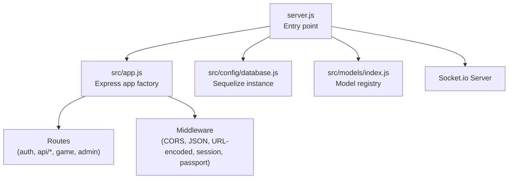
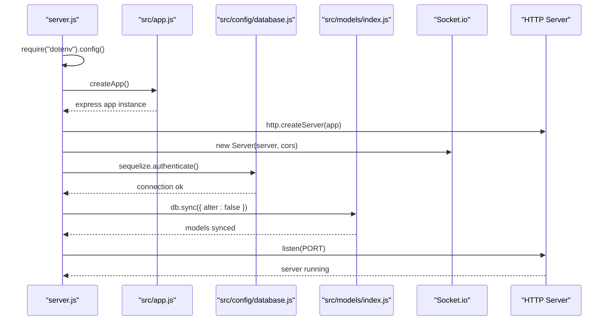
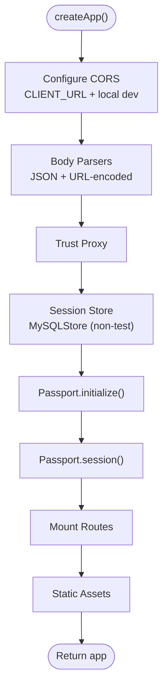
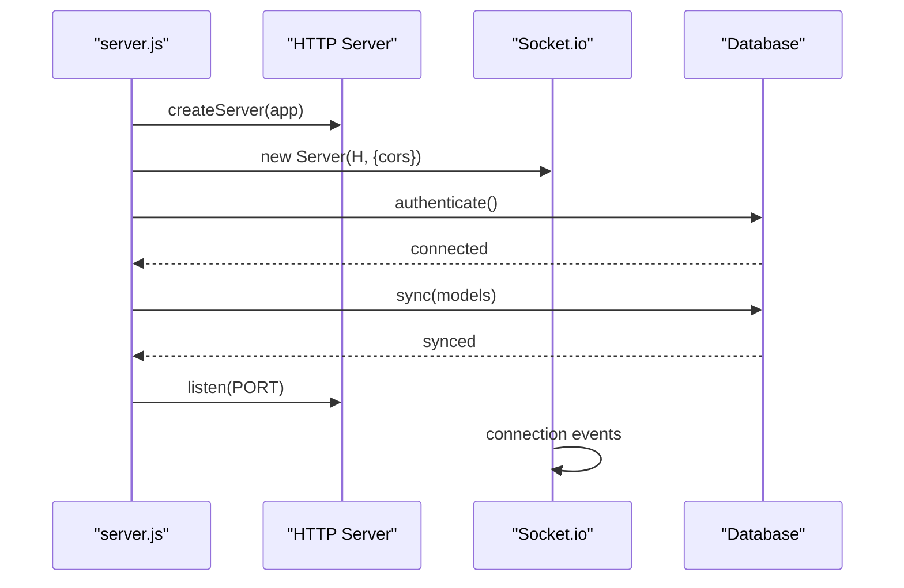
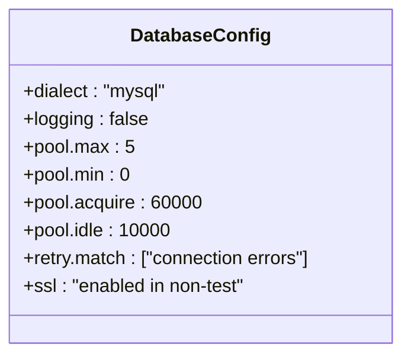
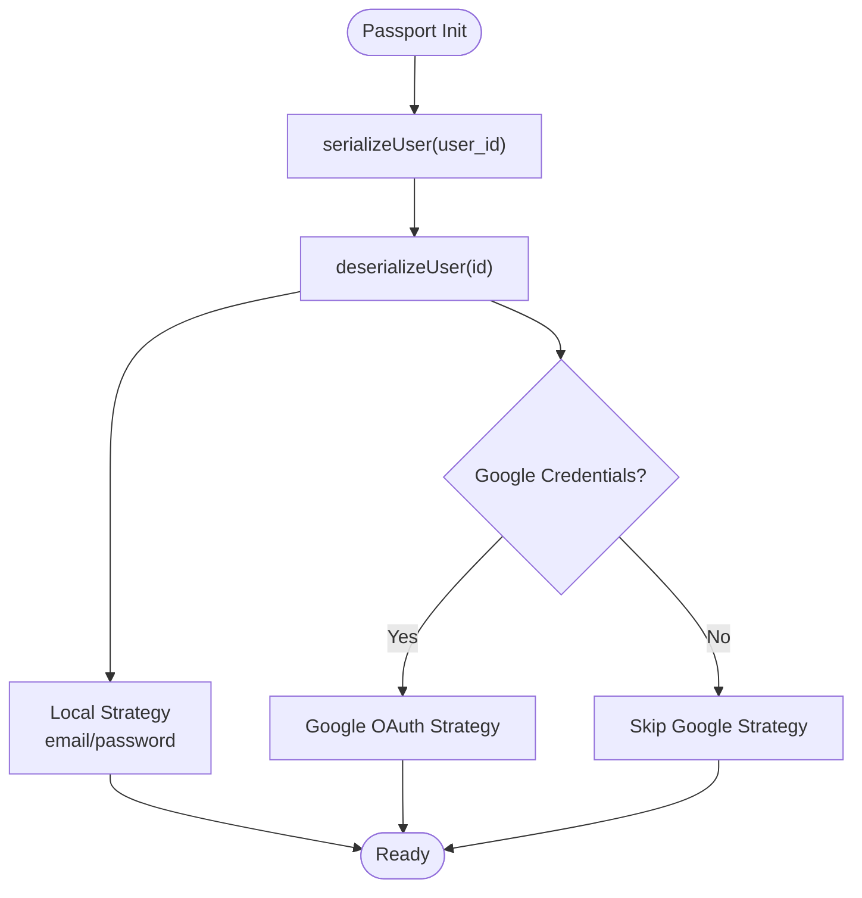
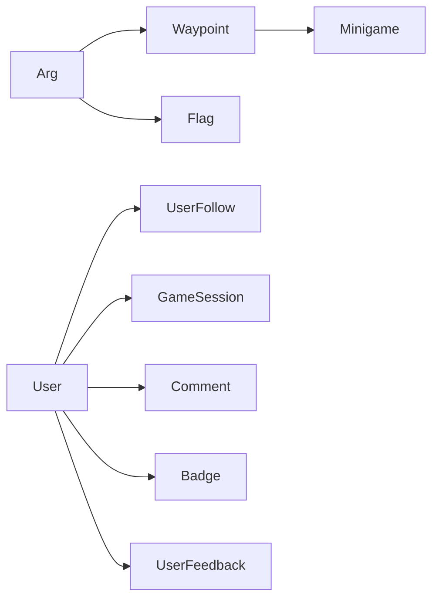
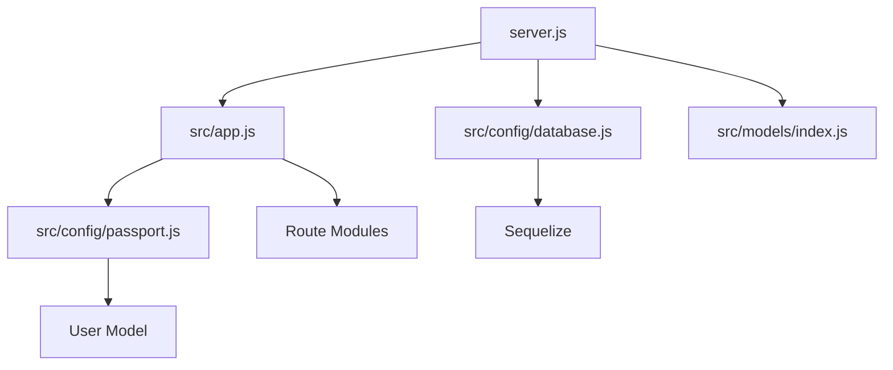

# Server Initialization & Configuration

<cite>
**Referenced Files in This Document**
- [server.js](file://server/server.js)
- [app.js](file://server/src/app.js)
- [database.js](file://server/src/config/database.js)
- [passport.js](file://server/src/config/passport.js)
- [models/index.js](file://server/src/models/index.js)
</cite>

## Table of Contents
1. [Introduction](#introduction)
2. [Project Structure](#project-structure)
3. [Core Components](#core-components)
4. [Architecture Overview](#architecture-overview)
5. [Detailed Component Analysis](#detailed-component-analysis)
6. [Dependency Analysis](#dependency-analysis)
7. [Performance Considerations](#performance-considerations)
8. [Troubleshooting Guide](#troubleshooting-guide)
9. [Conclusion](#conclusion)

## Introduction
This document explains how the WARG Platform server is initialized and configured. It covers Express bootstrapping, middleware registration order, environment variable handling, database connection initialization, Passport.js configuration, Socket.io setup, error handling posture, logging behavior, graceful shutdown considerations, and dependency injection patterns used to load and initialize modules.

## Project Structure
The server entry point creates an HTTP server, wires up Socket.io, initializes the database, and then starts listening for requests. The Express application itself is built by a factory function that registers middleware and routes without starting a listener, which makes it testable.

**Diagram sources**
- [server.js:1-72](file://server/server.js#L1-L72)
- [app.js:1-132](file://server/src/app.js#L1-L132)
- [database.js:1-38](file://server/src/config/database.js#L1-L38)
- [models/index.js:1-135](file://server/src/models/index.js#L1-L135)

**Section sources**
- [server.js:1-72](file://server/server.js#L1-L72)
- [app.js:1-132](file://server/src/app.js#L1-L132)

## Core Components
- Express application factory: builds and configures the Express app without starting a listener.
- HTTP server: created from the Express app with keep-alive and header timeouts.
- Database layer: Sequelize instance with MySQL dialect, SSL options, pool settings, and retry logic.
- Authentication: Passport.js with Local strategy and conditional Google OAuth strategy.
- Real-time layer: Socket.io attached to the same HTTP server with CORS policy aligned with Express.
- Environment variables: loaded via dotenv; values drive CORS, sessions, DB, and optional features.

**Section sources**
- [app.js:1-132](file://server/src/app.js#L1-L132)
- [server.js:1-72](file://server/server.js#L1-L72)
- [database.js:1-38](file://server/src/config/database.js#L1-L38)
- [passport.js:1-99](file://server/src/config/passport.js#L1-L99)

## Architecture Overview
The runtime bootstrap sequence:
1. Load environment variables.
2. Create the Express app via the factory.
3. Create an HTTP server wrapping the Express app.
4. Initialize Socket.io on top of the HTTP server.
5. Connect to the database and sync models.
6. Start listening on the configured port.

**Diagram sources**
- [server.js:1-72](file://server/server.js#L1-L72)
- [app.js:1-132](file://server/src/app.js#L1-L132)
- [database.js:1-38](file://server/src/config/database.js#L1-L38)
- [models/index.js:1-135](file://server/src/models/index.js#L1-L135)

## Detailed Component Analysis

### Express Application Factory (src/app.js)
Responsibilities:
- Loads environment variables.
- Configures CORS with dynamic origin allowlist and local development bypass.
- Registers body parsers (JSON and URL-encoded) with generous size limits.
- Trusts the first proxy for correct client IP resolution.
- Sets up sessions with secure cookie defaults in production and persistent MySQL-backed store outside tests.
- Initializes Passport (initialize + session).
- Mounts API routes and static assets.

Middleware registration order:
1. CORS
2. JSON parser
3. URL-encoded parser
4. Session (with MySQLStore in non-test environments)
5. Passport.initialize()
6. Passport.session()
7. Routes
8. Static file serving

Environment-specific behaviors:
- CORS allows origins from CLIENT_URL and permits localhost in non-production.
- Session cookie secure and sameSite flags are set based on NODE_ENV.
- In tests, session storage uses in-memory store; otherwise, it uses MySQLStore using DATABASE_URL.

Error handling posture:
- No global Express error handler is registered here.
- Route-level guards return 401 for unauthorized access where applicable.

Logging:
- No dedicated logger is configured at this layer.

**Diagram sources**
- [app.js:1-132](file://server/src/app.js#L1-L132)

**Section sources**
- [app.js:1-132](file://server/src/app.js#L1-L132)

### HTTP Server and Socket.io (server.js)
Responsibilities:
- Creates the HTTP server from the Express app.
- Configures keepAliveTimeout and headersTimeout.
- Attaches Socket.io with CORS matching the Express policy.
- Adds basic socket connection/disconnect logs.
- Starts the server after verifying the database connection and syncing models.

Socket.io CORS:
- Mirrors the Express CORS policy: reads CLIENT_URL and allows localhost in non-production.

Startup flow:
- Authenticate database connection.
- Sync models once at startup.
- Listen on PORT (default 3000 if not provided).
- If database connection fails, still start the server but log that there is no database.

Graceful shutdown:
- Not implemented in this file.

**Diagram sources**
- [server.js:1-72](file://server/server.js#L1-L72)

**Section sources**
- [server.js:1-72](file://server/server.js#L1-L72)

### Database Connection (src/config/database.js)
Responsibilities:
- Reads DATABASE_URL and removes explicit ssl-mode parameter before passing to Sequelize.
- Enables SSL for non-test environments with rejectUnauthorized disabled.
- Disables SQL query logging by default.
- Configures connection pool and retry rules for common connection errors.

Environment-specific behaviors:
- Test environment disables SSL dialect options.
- Production and other environments enable SSL.

**Diagram sources**
- [database.js:1-38](file://server/src/config/database.js#L1-L38)

**Section sources**
- [database.js:1-38](file://server/src/config/database.js#L1-L38)

### Passport.js Configuration (src/config/passport.js)
Responsibilities:
- Serializes and deserializes users into/from sessions.
- Registers Local strategy (email/password) with bcrypt comparison.
- Conditionally registers Google OAuth strategy when credentials are present.
- Blocks banned users and accounts without passwords during local login.

Environment-specific behaviors:
- Google strategy is only registered when GOOGLE_CLIENT_ID and GOOGLE_CLIENT_SECRET are set.
- GOOGLE_CALLBACK_URL can be overridden via environment.

**Diagram sources**
- [passport.js:1-99](file://server/src/config/passport.js#L1-L99)

**Section sources**
- [passport.js:1-99](file://server/src/config/passport.js#L1-L99)

### Model Registry (src/models/index.js)
Responsibilities:
- Imports all model files.
- Defines associations between entities.
- Exposes the shared Sequelize instance and all models.

Initialization:
- Models are required eagerly; associations are defined at module load time.
- Database synchronization occurs at server startup.

**Diagram sources**
- [models/index.js:1-135](file://server/src/models/index.js#L1-L135)

**Section sources**
- [models/index.js:1-135](file://server/src/models/index.js#L1-L135)

## Dependency Analysis
High-level dependencies:
- server.js depends on:
  - src/app.js for the Express app.
  - src/config/database.js for the Sequelize instance.
  - src/models/index.js for model definitions and associations.
  - Socket.io for real-time communication.
- src/app.js depends on:
  - Express, CORS, session, dotenv.
  - Passport configuration.
  - Route modules.
  - Optional MySQLStore for sessions.
- src/config/database.js depends on:
  - Sequelize and dotenv.
- src/config/passport.js depends on:
  - Passport strategies, bcrypt, and User model.

**Diagram sources**
- [server.js:1-72](file://server/server.js#L1-L72)
- [app.js:1-132](file://server/src/app.js#L1-L132)
- [database.js:1-38](file://server/src/config/database.js#L1-L38)
- [passport.js:1-99](file://server/src/config/passport.js#L1-L99)
- [models/index.js:1-135](file://server/src/models/index.js#L1-L135)

**Section sources**
- [server.js:1-72](file://server/server.js#L1-L72)
- [app.js:1-132](file://server/src/app.js#L1-L132)
- [database.js:1-38](file://server/src/config/database.js#L1-L38)
- [passport.js:1-99](file://server/src/config/passport.js#L1-L99)
- [models/index.js:1-135](file://server/src/models/index.js#L1-L135)

## Performance Considerations
- Body parsing limits are set to 50MB for both JSON and URL-encoded payloads. Ensure this aligns with expected request sizes.
- Session store uses MySQL in production-like environments; ensure the database is performant and properly indexed for session tables.
- Database pool size is small (max 5); monitor connection usage under load and adjust as needed.
- SSL is enabled in non-test environments; verify TLS performance and certificate validity.
- Keep-alive and header timeouts are explicitly set; tune these according to your deployment’s network characteristics.

[No sources needed since this section provides general guidance]

## Troubleshooting Guide
Common issues and checks:
- CORS failures:
  - Verify CLIENT_URL includes the exact frontend origin(s), without trailing slashes.
  - Confirm NODE_ENV is set appropriately so local development bypass works as expected.
- Session persistence:
  - In non-test environments, ensure DATABASE_URL is valid and accessible.
  - Watch for MySQLStore error logs indicating connectivity issues.
- Passport authentication:
  - For Google login, ensure GOOGLE_CLIENT_ID and GOOGLE_CLIENT_SECRET are set.
  - For local login, confirm the user has a password hash and is not flagged.
- Database connectivity:
  - Check DATABASE_URL and SSL settings for non-test environments.
  - Review retry configuration if transient connection errors occur.
- Logging:
  - SQL query logging is disabled by default; enable it temporarily in database.js if diagnosing slow queries.

**Section sources**
- [app.js:29-84](file://server/src/app.js#L29-L84)
- [database.js:4-34](file://server/src/config/database.js#L4-L34)
- [passport.js:27-95](file://server/src/config/passport.js#L27-L95)
- [server.js:15-36](file://server/server.js#L15-L36)

## Conclusion
The server initializes by creating an Express app through a test-friendly factory, attaching Socket.io, connecting to the database, and starting the HTTP server. Middleware is registered in a clear order, with environment-driven behavior for CORS, sessions, and SSL. Passport supports both local and Google OAuth authentication, with Google integration conditionally enabled. While robust, the current implementation lacks a global Express error handler and graceful shutdown logic; adding these would improve resilience and operational safety.

[No sources needed since this section summarizes without analyzing specific files]