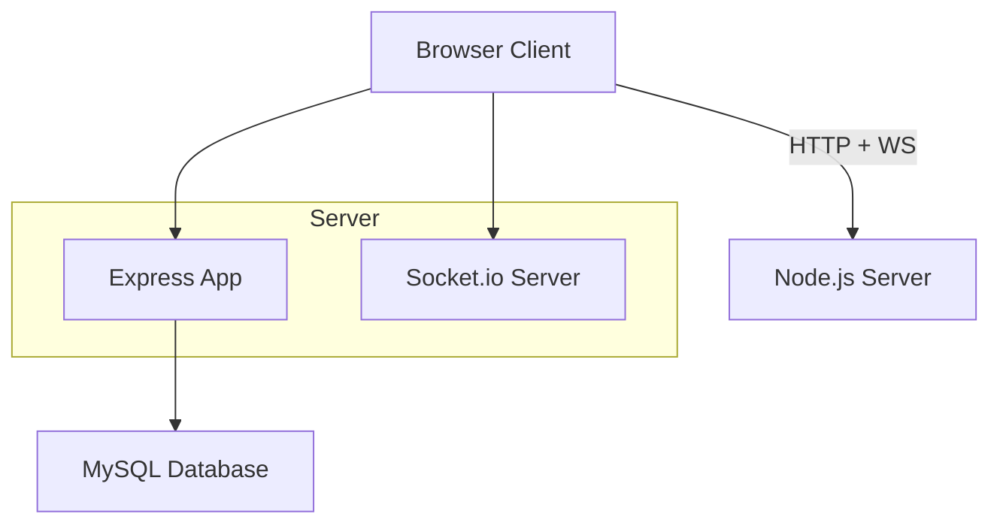
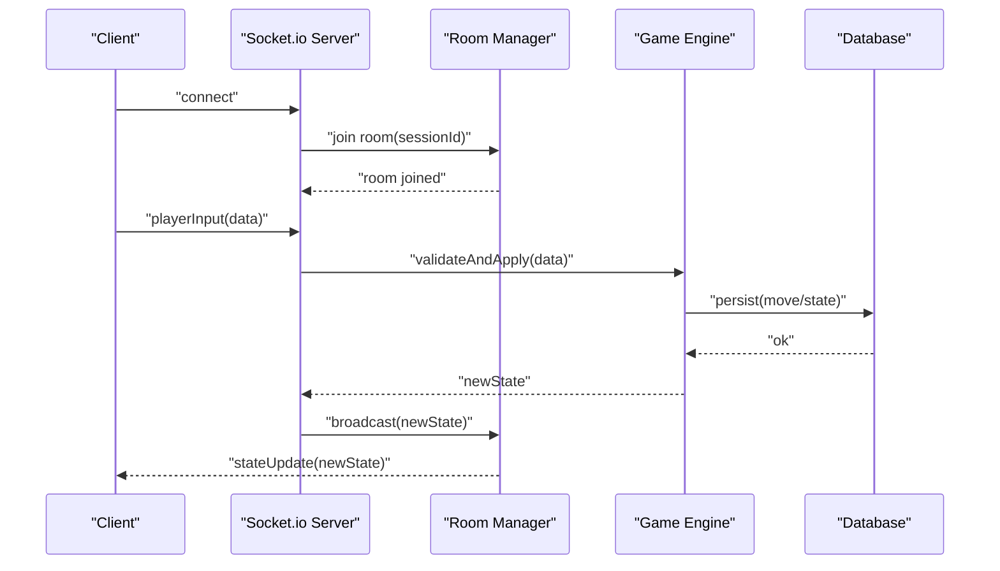
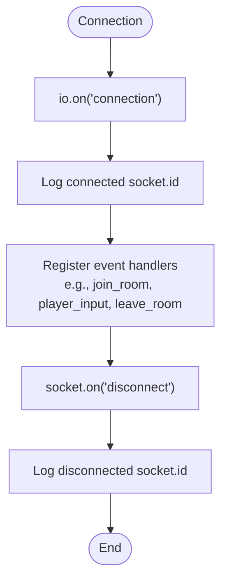
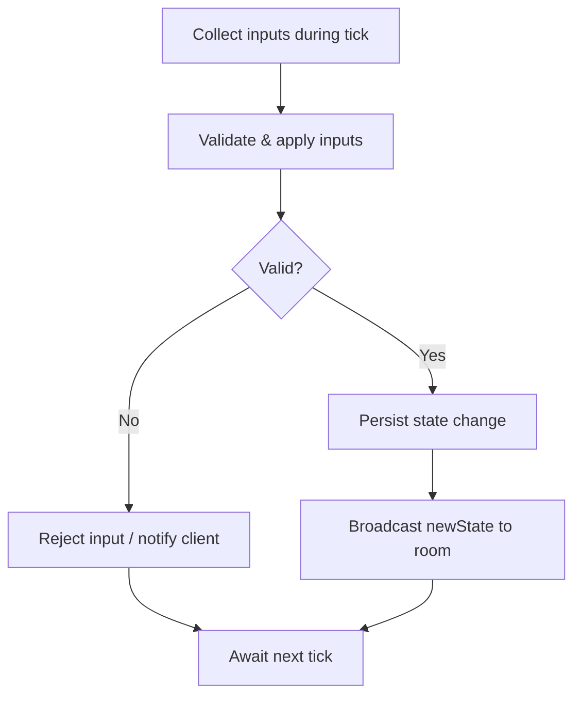
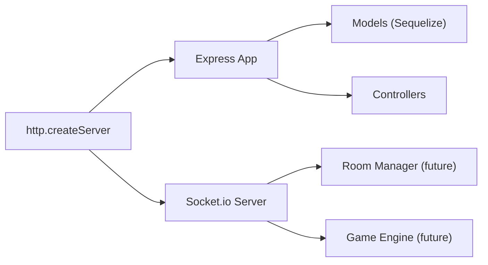

# WebSocket Real-time Communication

<cite>
**Referenced Files in This Document**
- [server.js](file://server/server.js)
- [app.js](file://server/src/app.js)
- [implementation-details.md](file://warg-docs/docs/2-architecture-and-design/implementation-details.md)
- [deployment-guide.md](file://warg-docs/docs/4-deployment/deployment-guide.md)
- [sessionController.js](file://server/src/controllers/sessionController.js)
- [GameSession.js](file://server/src/models/GameSession.js)
- [game.js](file://client/scripts/game.js)
</cite>

## Table of Contents
1. [Introduction](#introduction)
2. [Project Structure](#project-structure)
3. [Core Components](#core-components)
4. [Architecture Overview](#architecture-overview)
5. [Detailed Component Analysis](#detailed-component-analysis)
6. [Dependency Analysis](#dependency-analysis)
7. [Performance Considerations](#performance-considerations)
8. [Troubleshooting Guide](#troubleshooting-guide)
9. [Conclusion](#conclusion)

## Introduction
This document explains the WebSocket-based real-time communication system for the WARG Platform using Socket.io. It covers the connection lifecycle, event-driven architecture, message broadcasting patterns, multiplayer game state synchronization, real-time updates for gameplay events, and client-server communication protocols. It also includes room management strategies for game sessions, error recovery mechanisms, and scalability considerations for high-concurrency scenarios.

The platform’s design envisions live-play and turn-based multiplayer features where the server is authoritative over game state and rules, with WebSockets used to broadcast updates to clients. The current codebase initializes a Socket.io server alongside an Express application and provides foundational hooks for future real-time features.

## Project Structure
At runtime, the HTTP server hosts both REST APIs (Express) and WebSocket connections (Socket.io). The Socket.io server is configured with CORS policies aligned with the Express app’s CORS configuration. Connection handling currently logs connect/disconnect events; additional handlers for rooms, game events, and broadcasting will be added around these hooks.

**Diagram sources**
- [server.js:1-36](file://server/server.js#L1-L36)
- [app.js:1-44](file://server/src/app.js#L1-L44)

**Section sources**
- [server.js:1-36](file://server/server.js#L1-L36)
- [app.js:1-44](file://server/src/app.js#L1-L44)

## Core Components
- Socket.io server initialization and CORS policy
- HTTP server hosting Express and Socket.io
- Basic connection lifecycle hooks (connect/disconnect)
- Game session persistence via models and controllers
- Client-side connectivity awareness and reconnection signaling

Key responsibilities:
- Initialize and configure Socket.io on the same HTTP server as Express.
- Enforce CORS for WebSocket upgrades.
- Provide extensible hooks for room creation, authentication, and event routing.
- Persist game sessions and track active states for coordination between REST and real-time layers.

**Section sources**
- [server.js:1-45](file://server/server.js#L1-L45)
- [app.js:29-44](file://server/src/app.js#L29-L44)
- [sessionController.js:1-39](file://server/src/controllers/sessionController.js#L1-L39)
- [GameSession.js:1-19](file://server/src/models/GameSession.js#L1-L19)

## Architecture Overview
The system follows an event-driven architecture:
- Clients connect via WebSocket to the Socket.io server.
- The server authenticates and groups players into rooms representing game sessions or geofenced locations.
- Player inputs are validated server-side; game state is updated authoritatively.
- At tick boundaries (for live-play), the server broadcasts the new state to all participants in a room.
- For turn-based games, each validated move triggers a state update and broadcast.

**Diagram sources**
- [server.js:39-45](file://server/server.js#L39-L45)
- [implementation-details.md:201-209](file://warg-docs/docs/2-architecture-and-design/implementation-details.md#L201-L209)

## Detailed Component Analysis

### Socket.io Initialization and CORS
- The Socket.io server is created with the same HTTP server that serves Express.
- CORS origin validation mirrors the Express app’s logic, allowing multiple origins from environment variables and local development.
- Methods and credentials are enabled for WebSocket handshake compatibility.

Implementation highlights:
- CORS function normalizes origins and allows local development URLs.
- Credentials are enabled to support cookie-based sessions during WebSocket upgrade.

**Section sources**
- [server.js:14-36](file://server/server.js#L14-L36)
- [app.js:29-44](file://server/src/app.js#L29-L44)

### Connection Lifecycle
- On connect, the server logs the socket ID.
- On disconnect, the server logs the socket ID.
- Future extensions should attach authentication, room joining, and cleanup logic here.

**Diagram sources**
- [server.js:39-45](file://server/server.js#L39-L45)

**Section sources**
- [server.js:39-45](file://server/server.js#L39-L45)

### Room Management for Game Sessions
Recommended pattern:
- Use Socket.io rooms keyed by sessionId or locationId.
- Join clients upon successful authentication and session validation.
- Leave rooms on disconnect or explicit leave events.
- Broadcast room-scoped messages only to members.

Example operations (conceptual):
- joinRoom(sessionId)
- leaveRoom(sessionId)
- broadcastToRoom(event, payload)

These operations integrate with the existing connection hooks and can be implemented within the server’s event handler registration area.

[No sources needed since this section describes recommended patterns not yet implemented]

### Multiplayer Game State Synchronization
Design principles:
- Server-authoritative state machine.
- Validate moves/inputs before updating state.
- Persist validated actions to the database for durability.
- Broadcast state snapshots or deltas to room members at tick boundaries (live-play) or per move (turn-based).

Tick-based live-play flow:
- Collect inputs during a tick window.
- Apply inputs deterministically.
- Persist final state changes.
- Broadcast new state to all participants.

**Diagram sources**
- [implementation-details.md:201-209](file://warg-docs/docs/2-architecture-and-design/implementation-details.md#L201-L209)

**Section sources**
- [implementation-details.md:201-209](file://warg-docs/docs/2-architecture-and-design/implementation-details.md#L201-L209)

### Client-Server Communication Protocols
Protocol guidelines:
- Use typed events such as:
  - "join_game", "leave_game"
  - "player_move", "player_action"
  - "game_state_update", "tick_start", "tick_end"
  - "error", "reconnect"
- Payloads should include minimal data required for validation and rendering.
- Include sequence numbers or timestamps for interpolation and reconciliation.

Client-side resilience:
- Detect online/offline status and show banners.
- Dispatch reconnect events to reconcile state after network restoration.
- Queue offline actions when appropriate and sync when back online.

**Section sources**
- [game.js:14-48](file://client/scripts/game.js#L14-L48)
- [game.js:124-129](file://client/scripts/game.js#L124-L129)

### Error Recovery Mechanisms
- Handle disconnects gracefully; log events and clean up resources.
- Implement client-side retry and exponential backoff for reconnection.
- Reconcile state on reconnect by requesting authoritative snapshot.
- Persist critical game events to the database to survive restarts.

Operational notes:
- Deployment platforms must support WebSockets; free-tier services may spin down and drop connections.

**Section sources**
- [server.js:39-45](file://server/server.js#L39-L45)
- [deployment-guide.md:173-177](file://warg-docs/docs/4-deployment/deployment-guide.md#L173-L177)

## Dependency Analysis
The WebSocket layer depends on:
- Node.js http module for the underlying server.
- Socket.io for real-time transport.
- Express app for REST endpoints and static assets.
- Database models and controllers for session persistence and game state.

**Diagram sources**
- [server.js:1-12](file://server/server.js#L1-L12)
- [app.js:1-128](file://server/src/app.js#L1-L128)

**Section sources**
- [server.js:1-12](file://server/server.js#L1-L12)
- [app.js:1-128](file://server/src/app.js#L1-L128)

## Performance Considerations
- Use rooms to limit broadcast scope and reduce unnecessary traffic.
- Throttle high-frequency events; aggregate inputs per tick.
- Prefer state deltas over full snapshots when possible.
- Offload heavy computations (e.g., image processing) to microservices.
- Monitor memory usage and connection counts; scale horizontally with sticky sessions or shared adapters if needed.
- Ensure deployment supports persistent WebSocket uptime for live features.

[No sources needed since this section provides general guidance]

## Troubleshooting Guide
Common issues and resolutions:
- CORS errors during WebSocket upgrade: verify allowed origins match CLIENT_URL and local development allowances.
- Connection drops on free-tier deployments: upgrade to a plan that keeps services alive for WebSocket-dependent features.
- Session inconsistencies: ensure game sessions are persisted and reconciled on reconnect.
- High CPU/memory usage: review event rates, broadcast sizes, and offload expensive tasks.

Actionable checks:
- Inspect server logs for connect/disconnect events.
- Validate environment variables for CLIENT_URL and NODE_ENV.
- Confirm database connectivity and model synchronization.

**Section sources**
- [server.js:14-36](file://server/server.js#L14-L36)
- [deployment-guide.md:173-177](file://warg-docs/docs/4-deployment/deployment-guide.md#L173-L177)
- [server.js:47-71](file://server/server.js#L47-L71)

## Conclusion
The WARG Platform integrates Socket.io with an Express HTTP server to enable real-time multiplayer experiences. While the current implementation provides foundational connection handling and CORS configuration, the architecture is designed to support robust room management, authoritative game state synchronization, and scalable broadcasting. By following the event-driven patterns and resilience strategies outlined here, developers can implement live-play and turn-based features that remain performant and reliable under high concurrency.

[No sources needed since this section summarizes without analyzing specific files]