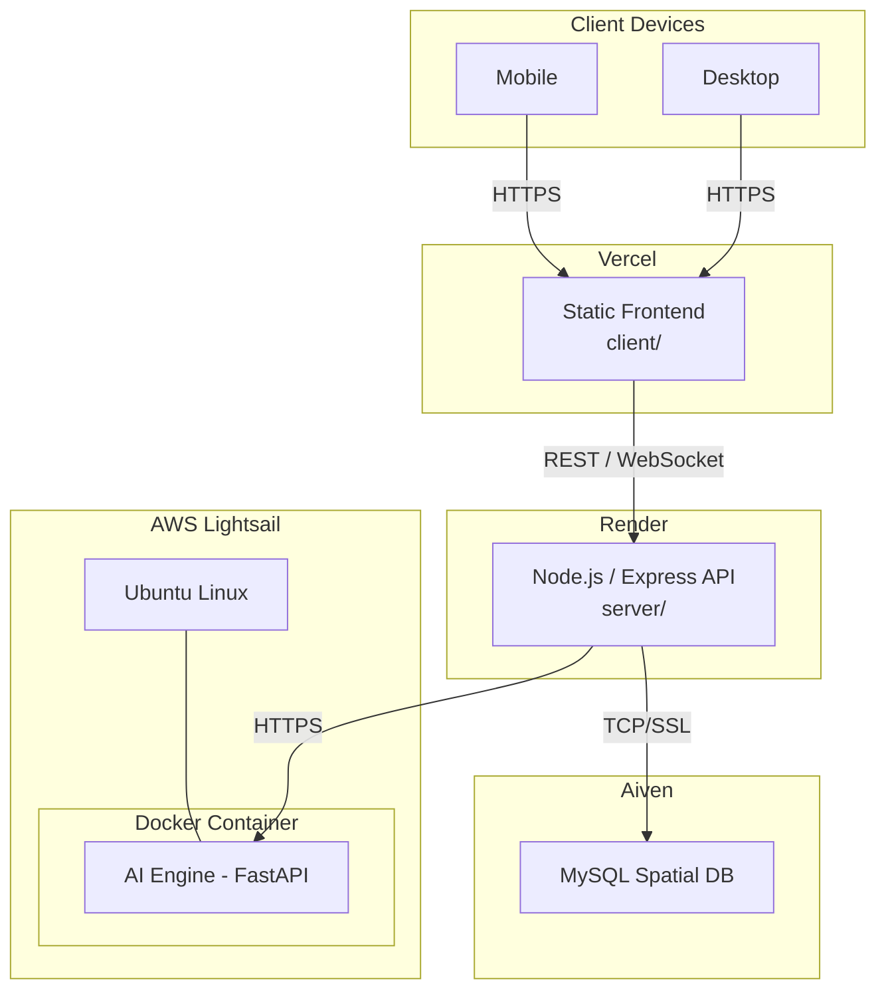
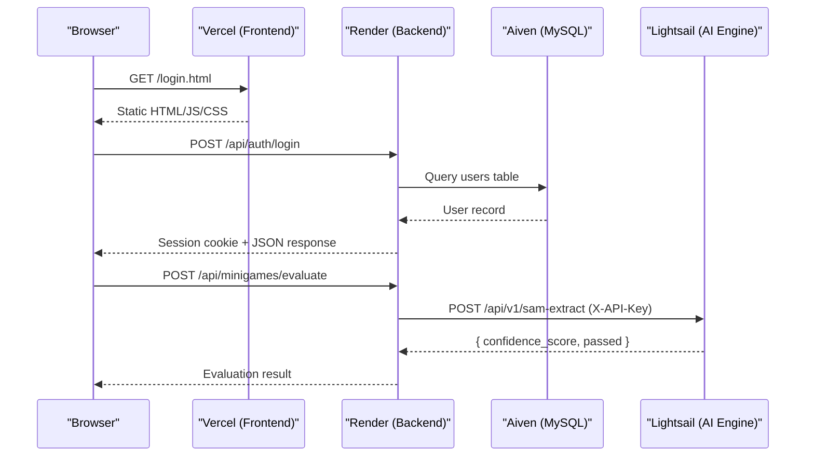
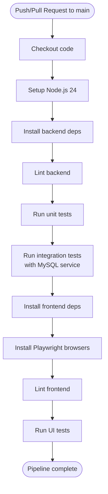
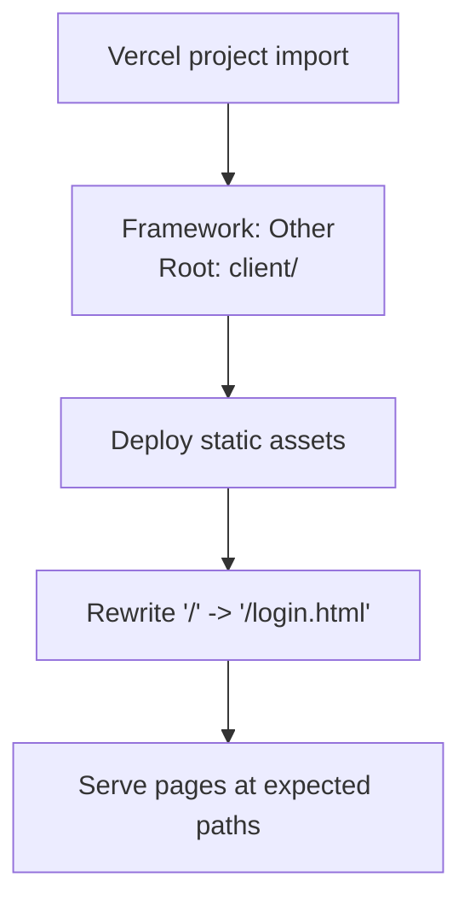
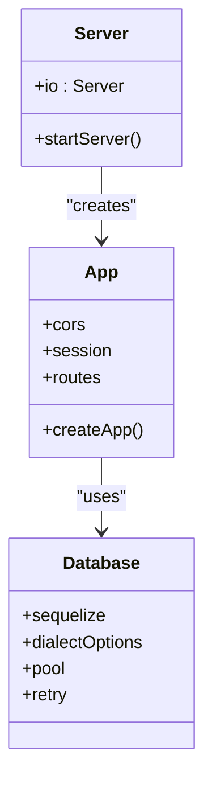
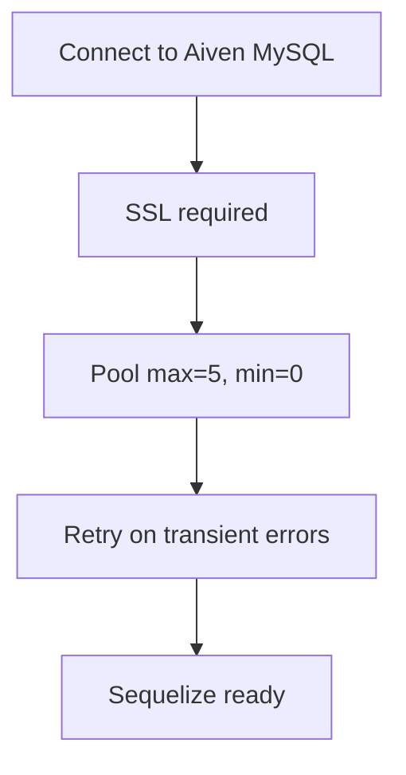
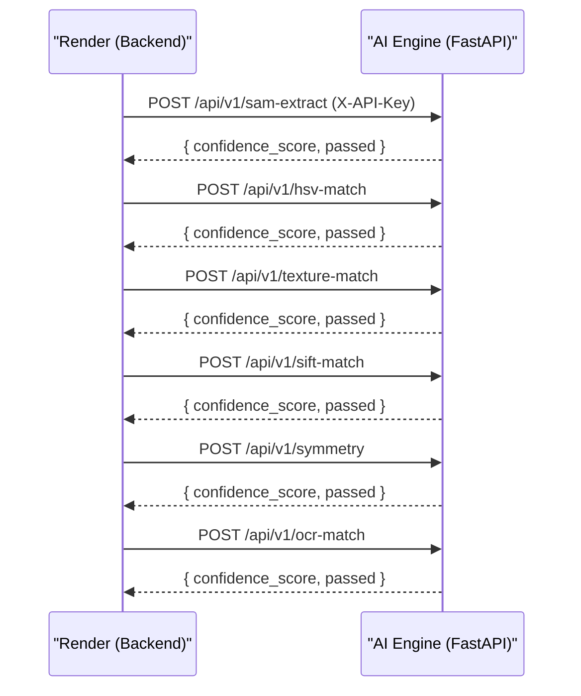
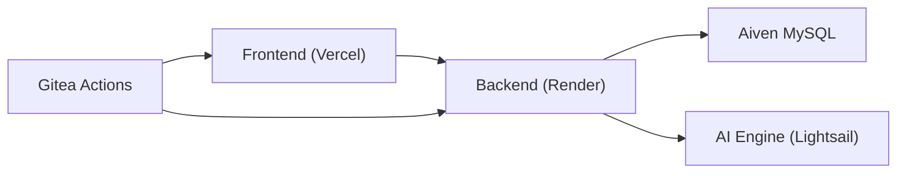

# Deployment Architecture

<cite>
**Referenced Files in This Document**
- [ci.yml](file://.gitea/workflows/ci.yml)
- [vercel.json](file://client/vercel.json)
- [Dockerfile](file://ai-engine/Dockerfile)
- [DEPLOYMENT.md](file://ai-engine/DEPLOYMENT.md)
- [package.json](file://server/package.json)
- [database.js](file://server/src/config/database.js)
- [main.py](file://ai-engine/main.py)
- [deployment-guide.md](file://warg-docs/docs/4-deployment/deployment-guide.md)
- [server.js](file://server/server.js)
- [app.js](file://server/src/app.js)
</cite>

## Table of Contents
1. Introduction
2. Project Structure
3. Core Components
4. Architecture Overview
5. Detailed Component Analysis
6. Dependency Analysis
7. Performance Considerations
8. Troubleshooting Guide
9. Conclusion

## Introduction
This document describes the multi-platform deployment architecture for the WARG Platform, including CI/CD with Gitea Actions, frontend hosting on Vercel, backend hosting on Render, database on Aiven MySQL, and a containerized AI service. It explains environment variable management, secrets handling, configuration across targets, build scripts, deployment hooks, health checks, monitoring/logging strategies, error tracking, performance metrics, scaling considerations, load balancing, and disaster recovery procedures.

## Project Structure
The repository is organized into clear layers:
- Frontend (static HTML/CSS/JS) under client/, deployed to Vercel
- Backend (Node.js/Express) under server/, deployed to Render
- AI Engine (Python/FastAPI) under ai-engine/, containerized via Docker
- Database schema under database/
- Documentation under warg-docs/
- CI pipeline under .gitea/workflows/

**Diagram sources**
- [deployment-guide.md:16-52](file://warg-docs/docs/4-deployment/deployment-guide.md#L16-L52)

**Section sources**
- [deployment-guide.md:1-15](file://warg-docs/docs/4-deployment/deployment-guide.md#L1-L15)

## Core Components
- CI/CD Pipeline (Gitea Actions): Automated linting, unit tests, integration tests, and UI tests across Node.js and Playwright.
- Frontend Hosting (Vercel): Static site hosting with rewrite rules for SPA-like routing.
- Backend Hosting (Render): Node.js/Express API with session persistence to MySQL, CORS, and Socket.io support.
- Database (Aiven MySQL): Managed MySQL with spatial extensions and SSL enforcement.
- AI Service (Docker + FastAPI): CPU-only PyTorch-based image processing endpoints behind an API key.

Key responsibilities:
- Build and test automation
- Environment-driven configuration
- Health checks and readiness probes
- Secure inter-service communication

**Section sources**
- [ci.yml:1-74](file://.gitea/workflows/ci.yml#L1-L74)
- [vercel.json:1-9](file://client/vercel.json#L1-L9)
- [package.json:1-39](file://server/package.json#L1-L39)
- [database.js:1-38](file://server/src/config/database.js#L1-L38)
- [Dockerfile:1-40](file://ai-engine/Dockerfile#L1-L40)
- [main.py:1-157](file://ai-engine/main.py#L1-L157)

## Architecture Overview
The system uses a layered architecture:
- Client devices access static assets from Vercel’s CDN.
- The Express API on Render handles authentication, business logic, and data access.
- The AI Engine runs as a Docker container on AWS Lightsail, exposing REST endpoints for computer vision tasks.
- Aiven MySQL provides persistent storage with spatial capabilities.

**Diagram sources**
- [server.js:1-72](file://server/server.js#L1-L72)
- [app.js:1-132](file://server/src/app.js#L1-L132)
- [main.py:1-157](file://ai-engine/main.py#L1-L157)
- [deployment-guide.md:16-52](file://warg-docs/docs/4-deployment/deployment-guide.md#L16-L52)

## Detailed Component Analysis

### CI/CD Pipeline (Gitea Actions)
- Triggers on push/pull_request to main.
- Spins up a MySQL 8.0 service for integration tests.
- Sets up Node.js 24, installs dependencies, lints, and runs unit/integration tests for the backend.
- Installs Playwright browsers and runs UI tests for the frontend.
- Uses environment variables for test database connection and session secret.

**Diagram sources**
- [ci.yml:1-74](file://.gitea/workflows/ci.yml#L1-L74)

**Section sources**
- [ci.yml:1-74](file://.gitea/workflows/ci.yml#L1-L74)

### Frontend Hosting (Vercel)
- Static site deployment from client/.
- Rewrite rule routes root path to login page.
- No build step required; clean URLs can be enabled via vercel.json if needed.

**Diagram sources**
- [vercel.json:1-9](file://client/vercel.json#L1-L9)
- [deployment-guide.md:216-294](file://warg-docs/docs/4-deployment/deployment-guide.md#L216-L294)

**Section sources**
- [vercel.json:1-9](file://client/vercel.json#L1-L9)
- [deployment-guide.md:216-294](file://warg-docs/docs/4-deployment/deployment-guide.md#L216-L294)

### Backend Hosting (Render)
- Node.js/Express application under server/.
- Scripts define start/dev/test/lint commands.
- Sessions persisted to MySQL using express-mysql-session.
- CORS configured for allowed origins from CLIENT_URL.
- Socket.io enabled for live gameplay features.
- Health check endpoint recommended by documentation.

**Diagram sources**
- [server.js:1-72](file://server/server.js#L1-L72)
- [app.js:1-132](file://server/src/app.js#L1-L132)
- [database.js:1-38](file://server/src/config/database.js#L1-L38)

**Section sources**
- [package.json:1-39](file://server/package.json#L1-L39)
- [server.js:1-72](file://server/server.js#L1-L72)
- [app.js:1-132](file://server/src/app.js#L1-L132)
- [deployment-guide.md:123-181](file://warg-docs/docs/4-deployment/deployment-guide.md#L123-L181)

### Database (Aiven MySQL)
- Managed MySQL with spatial extensions.
- SSL enforced; dialect options configure secure connections.
- Connection pool tuned for production constraints.
- Automated backups and metrics available via Aiven console.

**Diagram sources**
- [database.js:1-38](file://server/src/config/database.js#L1-L38)
- [deployment-guide.md:64-119](file://warg-docs/docs/4-deployment/deployment-guide.md#L64-L119)

**Section sources**
- [database.js:1-38](file://server/src/config/database.js#L1-L38)
- [deployment-guide.md:64-119](file://warg-docs/docs/4-deployment/deployment-guide.md#L64-L119)

### AI Service (Docker + FastAPI)
- Containerized Python service running FastAPI with CPU-only PyTorch.
- Exposes evaluation endpoints for shape, color, texture, SIFT, symmetry, and OCR matching.
- Protected by X-API-Key header; CORS allows Render backend origin.
- Health endpoint reports model readiness.

**Diagram sources**
- [main.py:1-157](file://ai-engine/main.py#L1-L157)

**Section sources**
- [Dockerfile:1-40](file://ai-engine/Dockerfile#L1-L40)
- [DEPLOYMENT.md:1-81](file://ai-engine/DEPLOYMENT.md#L1-L81)
- [main.py:1-157](file://ai-engine/main.py#L1-L157)

## Dependency Analysis
- Frontend depends on backend APIs and optionally on AI endpoints through the backend.
- Backend depends on Aiven MySQL and the AI Engine.
- CI pipeline depends on Node.js runtime and MySQL service for integration tests.

**Diagram sources**
- [deployment-guide.md:16-52](file://warg-docs/docs/4-deployment/deployment-guide.md#L16-L52)
- [ci.yml:1-74](file://.gitea/workflows/ci.yml#L1-L74)

**Section sources**
- [deployment-guide.md:16-52](file://warg-docs/docs/4-deployment/deployment-guide.md#L16-L52)
- [ci.yml:1-74](file://.gitea/workflows/ci.yml#L1-L74)

## Performance Considerations
- Database connection pooling: Keep Sequelize pool.max <= 5 on Aiven Hobbyist to avoid exhaustion.
- Backend timeouts: HTTP keepAliveTimeout and headersTimeout are set to handle long-lived connections (e.g., WebSockets).
- AI Engine memory: Minimum 1 GB RAM recommended; 2 GB preferred due to model loading overhead.
- Caching: Consider caching frequent AI results or precomputing embeddings where feasible.
- CDN: Leverage Vercel’s global CDN for static assets.

[No sources needed since this section provides general guidance]

## Troubleshooting Guide
- CI failures:
  - Ensure MySQL service is healthy before integration tests run.
  - Verify DATABASE_URL and SESSION_SECRET are set for integration tests.
- Backend connectivity:
  - Validate DATABASE_URL includes ssl-mode flag and correct credentials.
  - Check session store errors when MySQL is down.
- AI Engine:
  - Confirm X-API-Key header matches configured value.
  - Use /health endpoint to verify model readiness.
- CORS issues:
  - Ensure CLIENT_URL includes Vercel domain(s) and Render allows those origins.
- Logs and monitoring:
  - Use Render logs tab for backend streaming logs.
  - Monitor Aiven metrics and backups.
  - For AI Engine, inspect container logs on Lightsail.

**Section sources**
- [ci.yml:1-74](file://.gitea/workflows/ci.yml#L1-L74)
- [database.js:1-38](file://server/src/config/database.js#L1-L38)
- [app.js:62-82](file://server/src/app.js#L62-L82)
- [main.py:39-52](file://ai-engine/main.py#L39-L52)
- [deployment-guide.md:179-181](file://warg-docs/docs/4-deployment/deployment-guide.md#L179-L181)

## Conclusion
The WARG Platform employs a robust, multi-platform deployment strategy:
- Vercel delivers static frontend assets efficiently.
- Render hosts the Node.js backend with persistent sessions and WebSocket support.
- Aiven provides managed MySQL with spatial capabilities and SSL.
- Docker containers host the AI Engine on AWS Lightsail, ensuring isolation and scalability.
- Gitea Actions automate testing and quality gates.
With proper environment variable management, health checks, and monitoring, the platform is positioned for reliable production operations, with clear paths for scaling, load balancing, and disaster recovery.

[No sources needed since this section summarizes without analyzing specific files]