# API Integration Layer

<cite>
**Referenced Files in This Document**   
- [api.js](file://client/scripts/api.js)
- [config.js](file://client/scripts/config.js)
- [login.js](file://client/scripts/login.js)
- [signup.js](file://client/scripts/signup.js)
- [game.js](file://client/scripts/game.js)
- [home.js](file://client/scripts/home.js)
- [admin.js](file://client/scripts/admin.js)
</cite>

## Table of Contents
1. [Introduction](#introduction)
2. [Project Structure](#project-structure)
3. [Core Components](#core-components)
4. [Architecture Overview](#architecture-overview)
5. [Detailed Component Analysis](#detailed-component-analysis)
6. [Dependency Analysis](#dependency-analysis)
7. [Performance Considerations](#performance-considerations)
8. [Troubleshooting Guide](#troubleshooting-guide)
9. [Conclusion](#conclusion)

## Introduction
This document explains the client-side API integration layer for the WARG Platform. It focuses on the fetch-based HTTP client, request and response handling, error management patterns, authentication token and session handling, endpoint abstraction, configuration for environment variables and base URLs, retry mechanisms, timeout handling, and network error recovery strategies used across the application.

The integration layer is implemented as a small shared JavaScript module that centralizes common HTTP operations and exposes typed helpers for backend endpoints. Other page scripts consume this module to perform authenticated requests using browser cookies and to handle errors consistently.

## Project Structure
The API integration layer lives under the client scripts directory. The most important files are:

- Shared API client with generic fetch wrappers and endpoint helpers
- Global configuration for API base URL and service worker registration
- Page-specific scripts that call the shared API client or make direct fetch calls
- Admin dashboard script that uses fetch directly for administrative endpoints

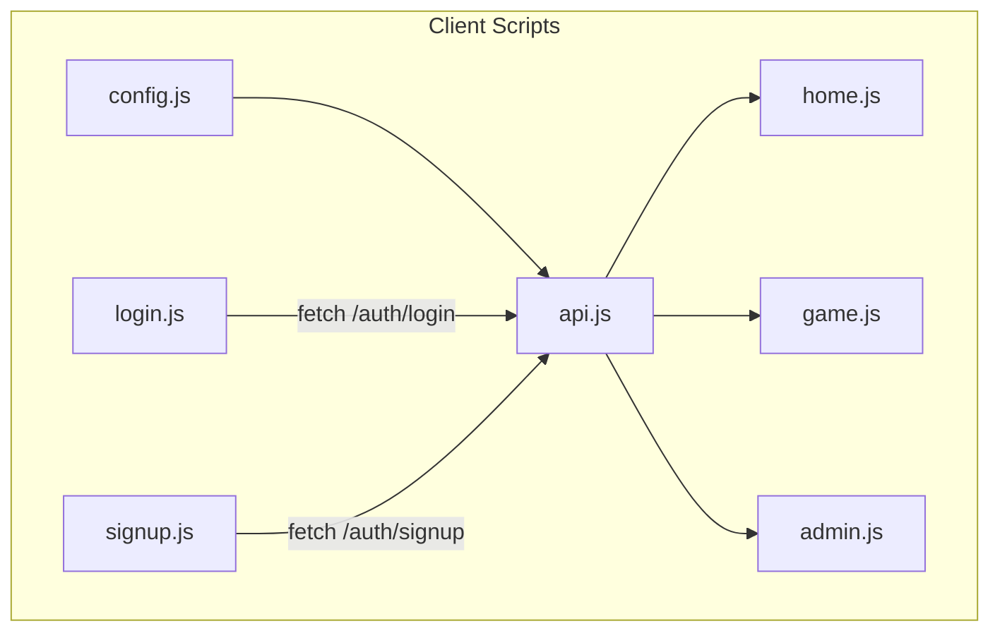

**Diagram sources**
- [config.js:1-30](file://client/scripts/config.js#L1-L30)
- [api.js:1-401](file://client/scripts/api.js#L1-L401)
- [login.js:1-44](file://client/scripts/login.js#L1-L44)
- [signup.js:1-145](file://client/scripts/signup.js#L1-L145)
- [home.js:1-755](file://client/scripts/home.js#L1-L755)
- [game.js:1-838](file://client/scripts/game.js#L1-L838)
- [admin.js:1-272](file://client/scripts/admin.js#L1-L272)

**Section sources**
- [config.js:1-30](file://client/scripts/config.js#L1-L30)
- [api.js:1-401](file://client/scripts/api.js#L1-L401)

## Core Components
The core components of the API integration layer include:

- Configuration module that sets the global API base URL and registers the service worker
- Shared API client that provides generic fetch wrappers and endpoint helpers
- Authentication flows that use credentials cookies for session handling
- Game flow that manages sessions, waypoints, voting, comments, and offline sync
- Home page logic that composes multiple API calls and handles user state
- Admin dashboard logic that performs administrative actions via fetch

Key responsibilities:

- Centralize base URL configuration
- Provide reusable GET/POST/DELETE helpers
- Normalize API responses into UI-friendly shapes
- Handle authentication by including credentials
- Manage game sessions and progress
- Support offline submission and background sync
- Provide cache control utilities for development

**Section sources**
- [config.js:1-30](file://client/scripts/config.js#L1-L30)
- [api.js:1-401](file://client/scripts/api.js#L1-L401)
- [game.js:1-838](file://client/scripts/game.js#L1-L838)
- [home.js:1-755](file://client/scripts/home.js#L1-L755)
- [admin.js:1-272](file://client/scripts/admin.js#L1-L272)

## Architecture Overview
The API integration layer follows a layered approach:

- Configuration layer defines the API base URL and service worker registration
- Client layer exposes typed helpers for backend endpoints
- Page layers consume helpers and handle UI state
- Network layer uses the browser fetch API with credentials cookies for authentication
- Offline layer integrates with the Cache API and Background Sync for resilience

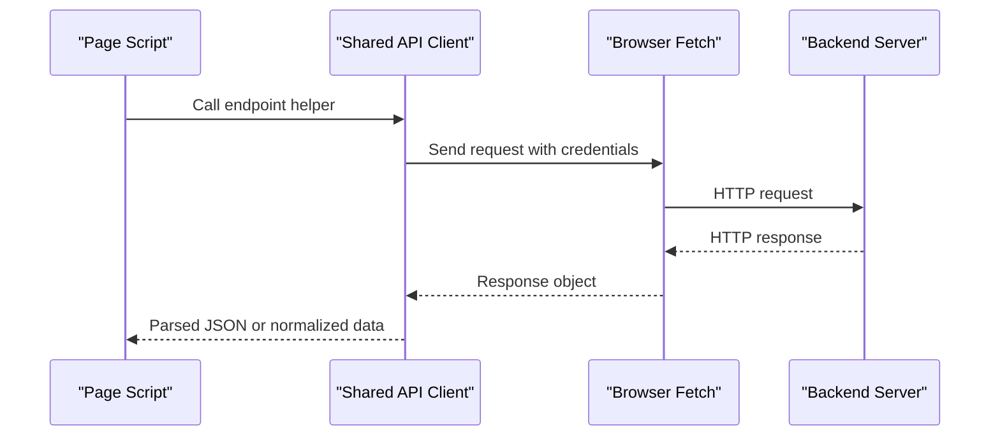

**Diagram sources**
- [api.js:22-55](file://client/scripts/api.js#L22-L55)
- [login.js:15-23](file://client/scripts/login.js#L15-L23)
- [game.js:143-164](file://client/scripts/game.js#L143-L164)

## Detailed Component Analysis

### Configuration System
The configuration system determines the API base URL based on the current hostname and exposes it globally. It also registers the service worker for offline capabilities.

Highlights:

- Base URL defaults to local development when the hostname is localhost or 127.0.0.1
- Production base URL is set for other hostnames
- Global variables are exposed for backward compatibility
- Service worker registration is performed on window load

Configuration behavior:

- If the hostname matches local development, the base URL points to the local server
- Otherwise, the base URL points to the production server
- The service worker is registered only if the browser supports it

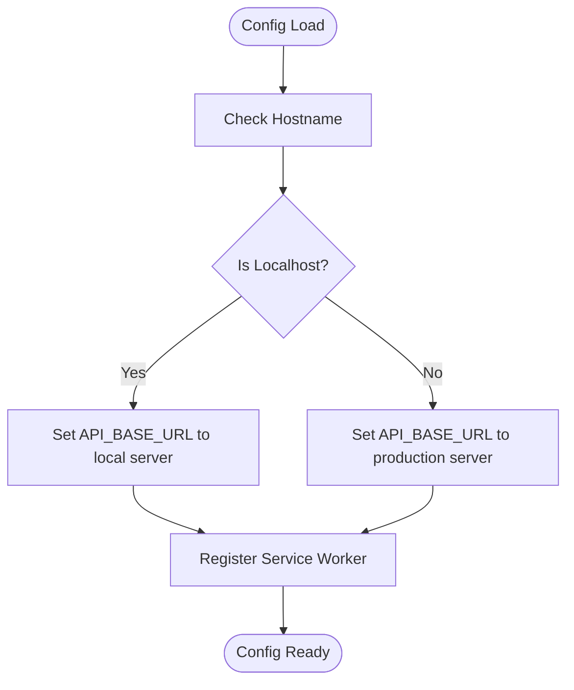

**Diagram sources**
- [config.js:1-30](file://client/scripts/config.js#L1-L30)

**Section sources**
- [config.js:1-30](file://client/scripts/config.js#L1-L30)

### Shared API Client
The shared API client provides generic fetch wrappers and endpoint helpers. It centralizes common HTTP behavior and normalizes API responses.

Core features:

- Generic GET, POST, DELETE wrappers
- Consistent error handling that attaches status and path
- Endpoint helpers for users, ARGs, sessions, friends, feedback, and minigames
- Data normalization for ARG objects
- Minigame reference fetching with cache fallback
- Offline attempt submission with Background Sync
- Feedback submission
- Development utility to clear game caches

Request/response handling:

- GET requests return parsed JSON
- POST requests send JSON bodies with Content-Type header
- DELETE requests return parsed JSON
- Non-ok responses throw an error with status and path metadata

Authentication handling:

- All requests include credentials so cookies are sent automatically
- Session-based authentication is handled by the backend; the client does not manage tokens explicitly

Error management:

- Generic wrappers throw structured errors
- Some helpers catch specific statuses such as 401 and convert them to null or graceful fallbacks
- Network errors are caught where needed and converted to offline storage

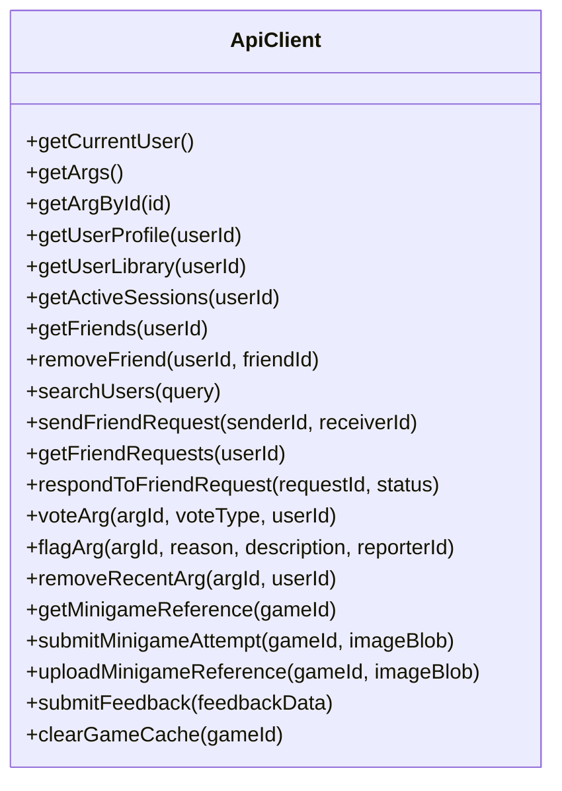

**Diagram sources**
- [api.js:22-55](file://client/scripts/api.js#L22-L55)
- [api.js:117-371](file://client/scripts/api.js#L117-L371)

**Section sources**
- [api.js:1-401](file://client/scripts/api.js#L1-L401)

### Authentication Token Management and Session Handling
The application uses session-based authentication through browser cookies rather than explicit bearer tokens.

Behavior:

- Login and signup requests include credentials
- Subsequent requests include credentials automatically
- The backend sets session cookies after successful authentication
- The client treats 401 responses as unauthenticated states and redirects or shows login prompts

Examples:

- Login form posts credentials and redirects on success
- Signup form posts user data and redirects on success
- Protected endpoints require credentials and return 401 when unauthenticated

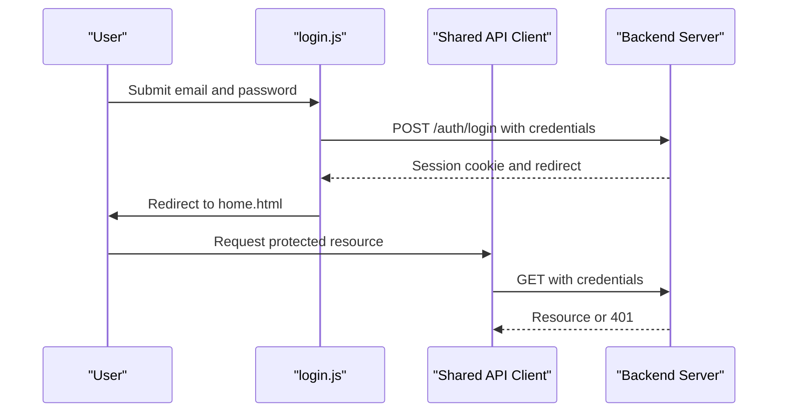

**Diagram sources**
- [login.js:15-29](file://client/scripts/login.js#L15-L29)
- [signup.js:93-112](file://client/scripts/signup.js#L93-L112)
- [api.js:123-130](file://client/scripts/api.js#L123-L130)

**Section sources**
- [login.js:1-44](file://client/scripts/login.js#L1-L44)
- [signup.js:1-145](file://client/scripts/signup.js#L1-L145)
- [api.js:123-130](file://client/scripts/api.js#L123-L130)

### API Endpoint Abstraction
The shared API client abstracts backend endpoints into typed helpers. This reduces duplication and centralizes error handling.

Endpoint categories:

- Authentication and user profile
- ARG listing and details
- User library and profile
- Active sessions
- Friends and friend requests
- Voting and flagging
- Minigame references and attempts
- Feedback submission
- Cache clearing utilities

Concrete examples:

- Get current user returns null for guests instead of throwing
- Get all ARGs returns normalized cards
- Vote and flag endpoints accept typed payloads
- Minigame reference fetching supports both JSON and binary responses
- Minigame attempt submission supports offline mode

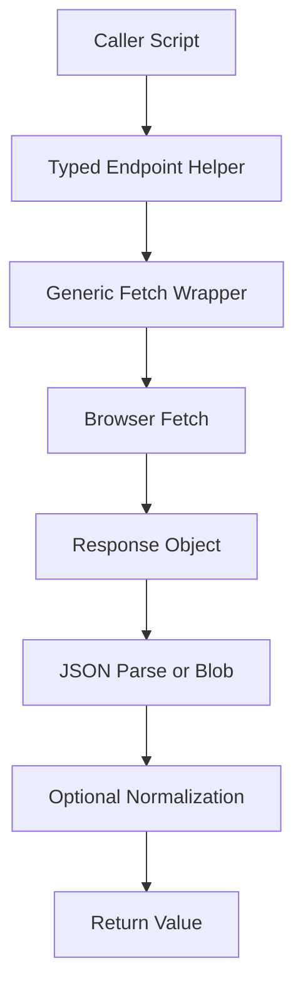

**Diagram sources**
- [api.js:22-55](file://client/scripts/api.js#L22-L55)
- [api.js:117-371](file://client/scripts/api.js#L117-L371)

**Section sources**
- [api.js:117-371](file://client/scripts/api.js#L117-L371)

### GET and POST Request Patterns
GET requests are used for reading resources such as ARGs, user profiles, sessions, and comments. POST requests are used for mutations such as login, signup, voting, flagging, and minigame submissions.

Patterns:

- GET helpers construct URLs from base paths and IDs
- POST helpers stringify JSON bodies and set headers
- Credentials are included for all authenticated requests
- Errors are thrown for non-ok responses unless explicitly handled

Examples:

- Getting ARGs and normalizing them for the UI
- Posting votes and updating UI optimistically before confirming server state
- Posting comments and handling admin deletion

**Section sources**
- [api.js:136-147](file://client/scripts/api.js#L136-L147)
- [api.js:212-218](file://client/scripts/api.js#L212-L218)
- [game.js:319-343](file://client/scripts/game.js#L319-L343)
- [game.js:787-800](file://client/scripts/game.js#L787-L800)

### Error Handling Strategies
Error handling is applied at multiple levels:

- Generic wrappers throw structured errors with status and path
- Specific helpers swallow expected 401 responses for guest-safe endpoints
- Page scripts handle network failures, display user messages, and restore UI state
- Offline detection triggers fallback behavior for critical flows

Strategies:

- Throw-and-catch pattern for API helpers
- Silent failure for non-critical reads like current user
- User-facing alerts and toasts for actionable errors
- Fallback to cached data or offline storage when network fails

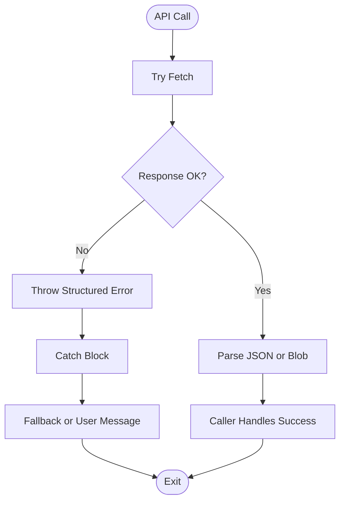

**Diagram sources**
- [api.js:25-55](file://client/scripts/api.js#L25-L55)
- [api.js:123-130](file://client/scripts/api.js#L123-L130)
- [game.js:143-164](file://client/scripts/game.js#L143-L164)

**Section sources**
- [api.js:25-55](file://client/scripts/api.js#L25-L55)
- [api.js:123-130](file://client/scripts/api.js#L123-L130)
- [game.js:143-164](file://client/scripts/game.js#L143-L164)

### Response Parsing and Normalization
The API client normalizes raw ARG responses into a GameCard-compatible shape. This includes computing initials, rating, image links, and preserving raw data for advanced use cases.

Normalization steps:

- Extract creator information
- Compute initials from username
- Calculate average rating
- Build cover image URL
- Map fields to UI model
- Preserve raw payload for debugging or extended features

**Section sources**
- [api.js:57-115](file://client/scripts/api.js#L57-L115)

### Minigame Reference and Attempt Flow
Minigame interactions involve fetching reference images and submitting attempts. The implementation supports both online and offline modes.

Flow:

- Fetch reference image or JSON
- Cache response for offline use
- On submit, check online status
- If offline, save attempt to local storage and register Background Sync
- If online, send FormData and parse result
- Display result overlay and update game state

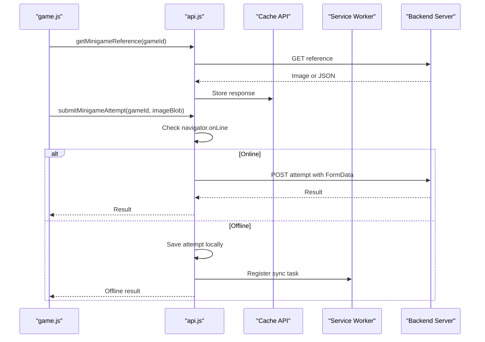

**Diagram sources**
- [api.js:224-310](file://client/scripts/api.js#L224-L310)
- [game.js:398-438](file://client/scripts/game.js#L398-L438)

**Section sources**
- [api.js:224-310](file://client/scripts/api.js#L224-L310)
- [game.js:398-438](file://client/scripts/game.js#L398-L438)

### Game Session and Progress Management
The game page manages session lifecycle, waypoint progression, voting, comments, and reconnection handling.

Key behaviors:

- Start or resume a game session
- Load full game state and render map nodes
- Prefetch minigame references for unlocked waypoints
- Handle geofence arrival and waypoint submission
- Update UI optimistically for votes and comments
- Re-fetch state on reconnect events

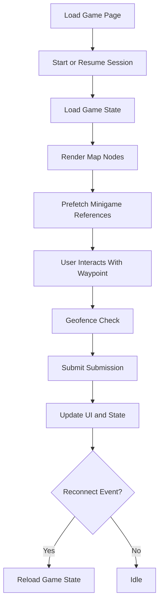

**Diagram sources**
- [game.js:143-227](file://client/scripts/game.js#L143-L227)
- [game.js:486-600](file://client/scripts/game.js#L486-L600)

**Section sources**
- [game.js:143-227](file://client/scripts/game.js#L143-L227)
- [game.js:486-600](file://client/scripts/game.js#L486-L600)

### Home Page Composition and User State
The home page composes multiple API calls and updates UI based on authenticated user state.

Responsibilities:

- Fetch ARGs and current user in parallel
- Render recent games, new games, and trending games
- Show friends list and pending requests
- Search users with debounced input
- Submit feedback and show toast notifications

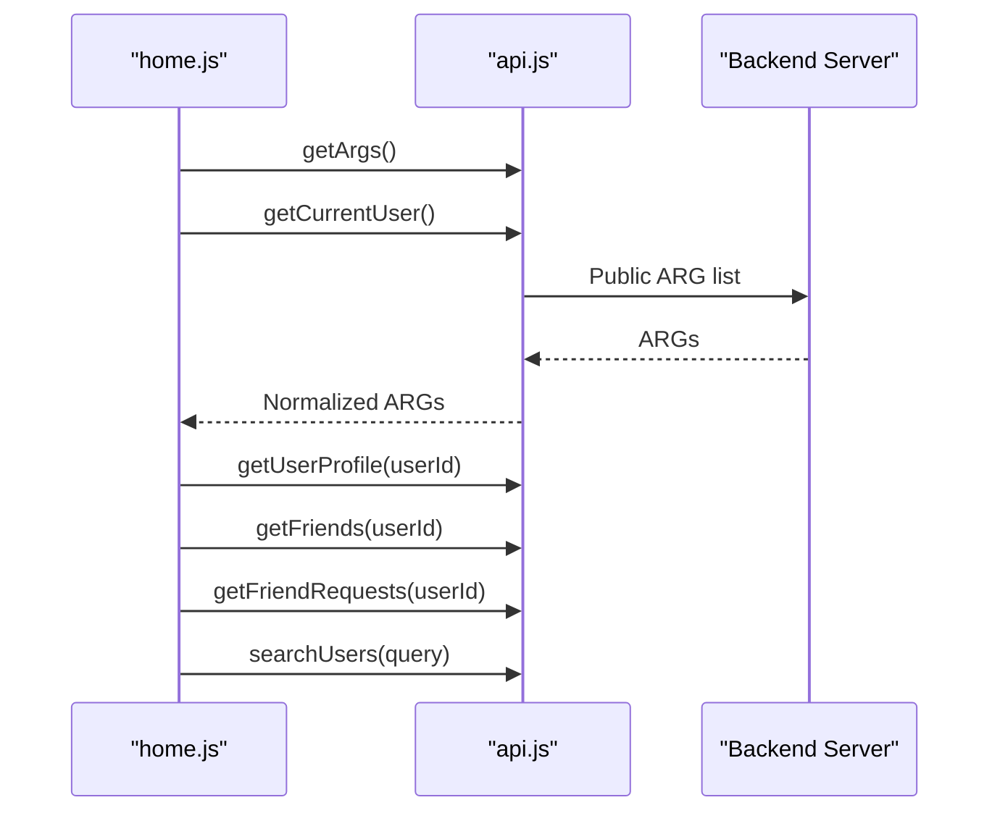

**Diagram sources**
- [home.js:210-352](file://client/scripts/home.js#L210-L352)
- [home.js:452-498](file://client/scripts/home.js#L452-L498)

**Section sources**
- [home.js:210-352](file://client/scripts/home.js#L210-L352)
- [home.js:452-498](file://client/scripts/home.js#L452-L498)

### Admin Dashboard Operations
The admin dashboard uses fetch directly to perform administrative actions such as reviewing flags, deleting games, and banning users.

Operations:

- Load flagged games and recent flags
- Resolve flags
- Delete games
- Search users
- Toggle ban status

Error handling:

- Show skeleton loaders while loading
- Display error messages on failure
- Use confirmation modals for destructive actions

**Section sources**
- [admin.js:15-87](file://client/scripts/admin.js#L15-L87)
- [admin.js:118-169](file://client/scripts/admin.js#L118-L169)
- [admin.js:184-270](file://client/scripts/admin.js#L184-L270)

## Dependency Analysis
The API integration layer has clear dependencies:

- Page scripts depend on the shared API client
- The shared API client depends on the global API base URL
- Authentication depends on session cookies managed by the backend
- Offline features depend on the Cache API and Background Sync

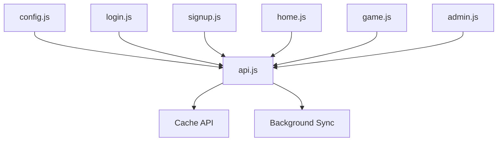

**Diagram sources**
- [config.js:1-30](file://client/scripts/config.js#L1-L30)
- [api.js:1-401](file://client/scripts/api.js#L1-L401)
- [login.js:1-44](file://client/scripts/login.js#L1-L44)
- [signup.js:1-145](file://client/scripts/signup.js#L1-L145)
- [home.js:1-755](file://client/scripts/home.js#L1-L755)
- [game.js:1-838](file://client/scripts/game.js#L1-L838)
- [admin.js:1-272](file://client/scripts/admin.js#L1-L272)

**Section sources**
- [api.js:1-401](file://client/scripts/api.js#L1-L401)
- [config.js:1-30](file://client/scripts/config.js#L1-L30)

## Performance Considerations
The integration layer emphasizes performance and resilience:

- Parallel API calls reduce total load time
- Skeleton loaders improve perceived performance
- Optimistic UI updates provide immediate feedback
- Minigame reference prefetching improves offline readiness
- Cache API stores dynamic assets for faster access
- Debounced user search reduces unnecessary network requests

Recommendations:

- Keep parallel calls grouped where safe
- Avoid redundant requests by caching results in memory when appropriate
- Use skeleton loaders for long-running operations
- Prefer optimistic updates with rollback on failure
- Monitor cache size and clear stale entries during development

[No sources needed since this section provides general guidance]

## Troubleshooting Guide
Common issues and resolutions:

- Unauthenticated requests: Ensure credentials are included and the user is logged in
- Network errors: Check connectivity and rely on offline fallback for supported flows
- Cache issues: Use the provided cache-clearing utility during development
- Session expiration: Redirect to login when receiving 401 responses
- Minigame submission failures: Verify FormData structure and server endpoint availability

Debugging tips:

- Inspect network requests for missing credentials
- Check console for structured error objects with status and path
- Validate base URL configuration for local vs production environments
- Confirm service worker registration for offline features

**Section sources**
- [api.js:25-55](file://client/scripts/api.js#L25-L55)
- [api.js:320-344](file://client/scripts/api.js#L320-L344)
- [game.js:143-164](file://client/scripts/game.js#L143-L164)
- [config.js:18-29](file://client/scripts/config.js#L18-L29)

## Conclusion
The API integration layer provides a consistent, resilient, and developer-friendly interface for server communication. It centralizes fetch usage, standardizes error handling, abstracts endpoints, and supports offline workflows. Authentication relies on session cookies, and the configuration system adapts to local and production environments. The design balances simplicity with robustness, making it suitable for both rapid development and reliable deployment.

[No sources needed since this section summarizes without analyzing specific files]