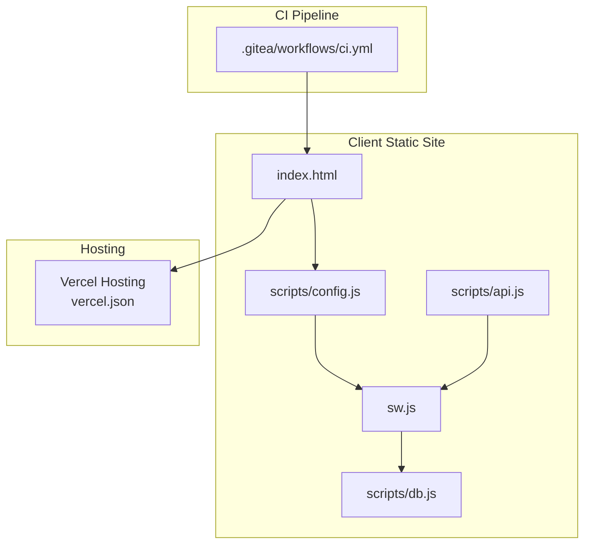
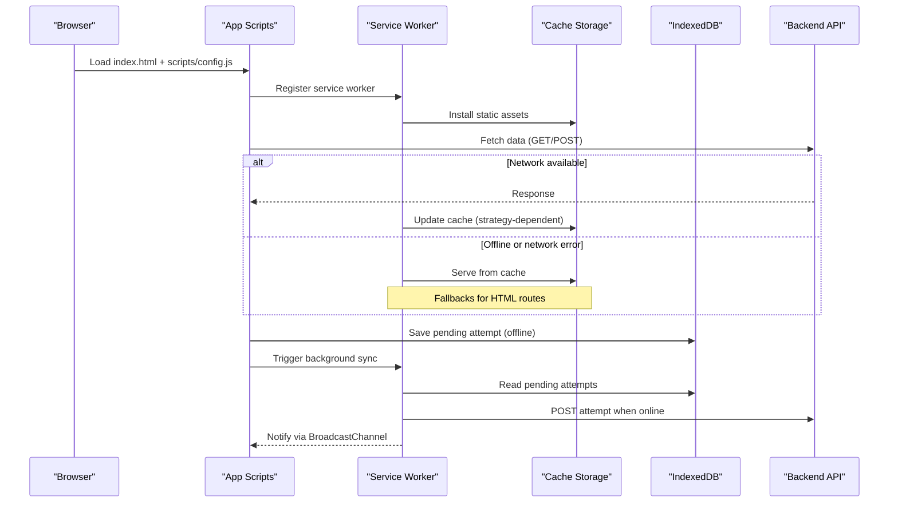
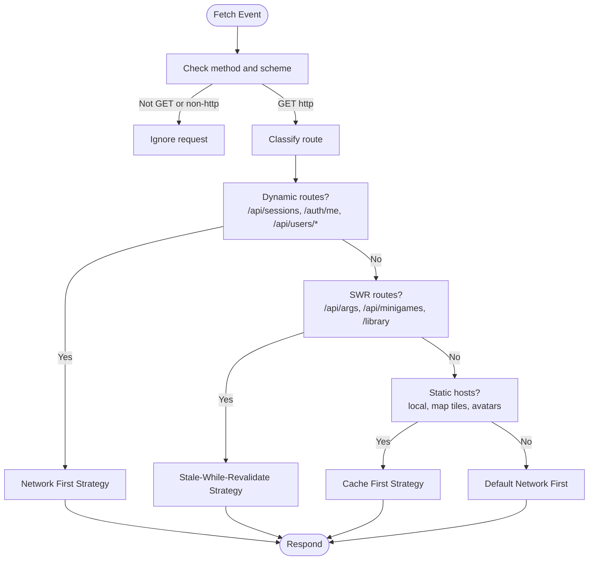
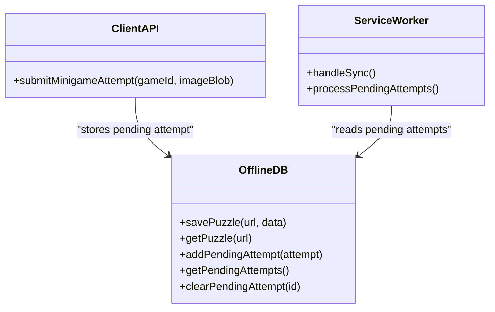
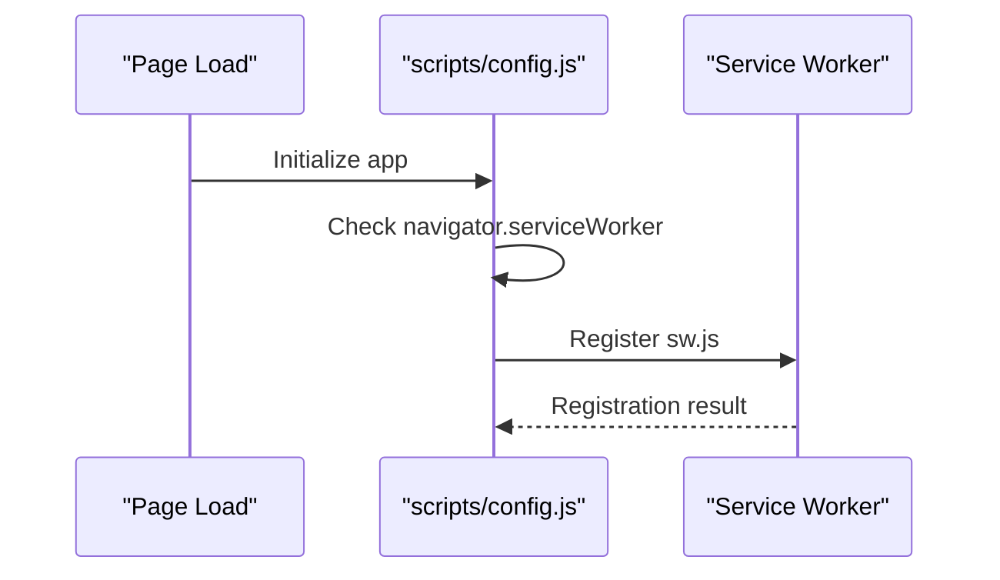
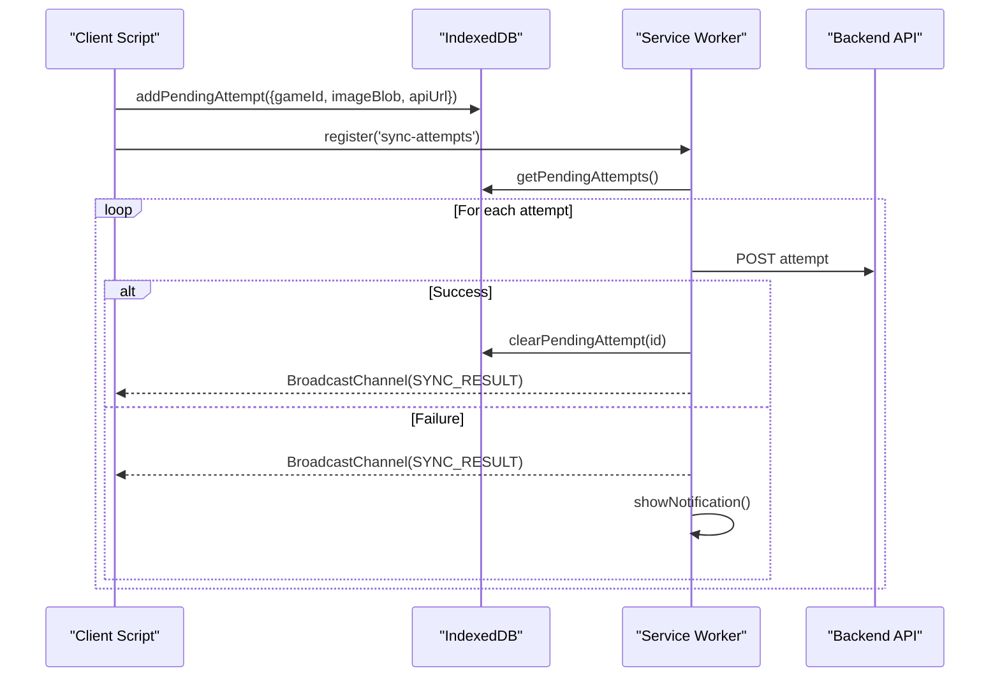
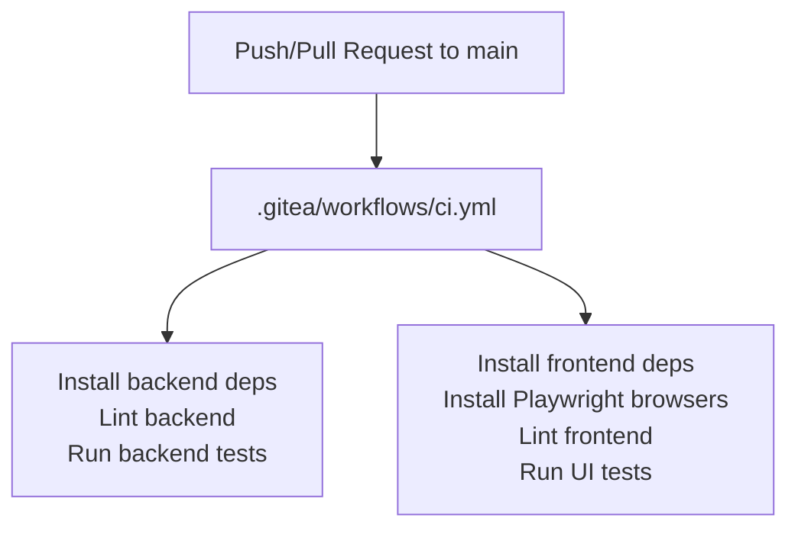
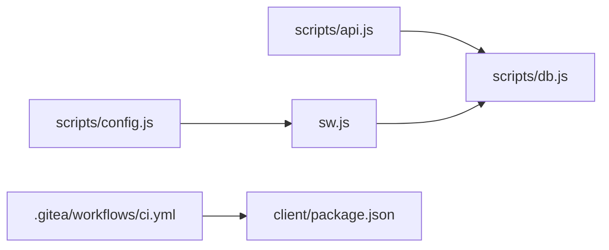

# Build Process & Deployment

<cite>
**Referenced Files in This Document**
- [client/package.json](file://client/package.json)
- [client/vercel.json](file://client/vercel.json)
- [client/sw.js](file://client/sw.js)
- [client/scripts/db.js](file://client/scripts/db.js)
- [client/scripts/config.js](file://client/scripts/config.js)
- [client/scripts/api.js](file://client/scripts/api.js)
- [client/index.html](file://client/index.html)
- [.gitea/workflows/ci.yml](file://.gitea/workflows/ci.yml)
</cite>

## Table of Contents
1. [Introduction](#introduction)
2. [Project Structure](#project-structure)
3. [Core Components](#core-components)
4. [Architecture Overview](#architecture-overview)
5. [Detailed Component Analysis](#detailed-component-analysis)
6. [Dependency Analysis](#dependency-analysis)
7. [Performance Considerations](#performance-considerations)
8. [Troubleshooting Guide](#troubleshooting-guide)
9. [Conclusion](#conclusion)

## Introduction
This document explains the build process and deployment configuration for the static frontend application, focusing on:
- Vercel hosting setup for a single-page static site
- Service worker implementation for offline capabilities, caching strategies, and background sync
- Development workflow, build scripts, and CI pipeline
- Environment configuration, asset optimization strategies, and performance monitoring considerations
- Browser compatibility and progressive web app (PWA) features

The goal is to provide both high-level guidance and code-level details so that developers can understand how the client assets are served, cached, and deployed.

## Project Structure
The frontend is a static HTML/CSS/JS application under the client directory. It uses:
- A service worker for caching and offline support
- IndexedDB for persisting pending operations while offline
- Vercel configuration for routing
- GitHub Actions/Gitea CI for linting and UI tests

**Diagram sources**
- [client/index.html:1-17](file://client/index.html#L1-L17)
- [client/scripts/config.js:19-23](file://client/scripts/config.js#L19-L23)
- [client/sw.js:1-235](file://client/sw.js#L1-L235)
- [client/scripts/db.js:1-94](file://client/scripts/db.js#L1-L94)
- [client/vercel.json:1-9](file://client/vercel.json#L1-L9)
- [.gitea/workflows/ci.yml:1-74](file://.gitea/workflows/ci.yml#L1-L74)

**Section sources**
- [client/index.html:1-17](file://client/index.html#L1-L17)
- [client/vercel.json:1-9](file://client/vercel.json#L1-L9)
- [.gitea/workflows/ci.yml:1-74](file://.gitea/workflows/ci.yml#L1-L74)

## Core Components
- Vercel hosting configuration:
  - Rewrites route root path to login page for SPA-like behavior.
- Service worker:
  - Caches static assets and applies per-route strategies (network-first, stale-while-revalidate, cache-first).
  - Implements background sync for offline attempts.
- Offline persistence:
  - Lightweight IndexedDB wrapper for puzzles and pending attempts.
- Client-side registration:
  - Service worker registration occurs during app initialization.
- CI pipeline:
  - Lints and runs Playwright UI tests for the frontend.

**Section sources**
- [client/vercel.json:1-9](file://client/vercel.json#L1-L9)
- [client/sw.js:1-235](file://client/sw.js#L1-L235)
- [client/scripts/db.js:1-94](file://client/scripts/db.js#L1-L94)
- [client/scripts/config.js:19-23](file://client/scripts/config.js#L19-L23)
- [.gitea/workflows/ci.yml:60-74](file://.gitea/workflows/ci.yml#L60-L74)

## Architecture Overview
The runtime architecture connects the browser, service worker, and backend APIs with caching and offline support.

**Diagram sources**
- [client/scripts/config.js:19-23](file://client/scripts/config.js#L19-L23)
- [client/sw.js:28-48](file://client/sw.js#L28-L48)
- [client/sw.js:113-148](file://client/sw.js#L113-L148)
- [client/scripts/api.js:255-274](file://client/scripts/api.js#L255-L274)
- [client/scripts/db.js:48-79](file://client/scripts/db.js#L48-L79)

## Detailed Component Analysis

### Vercel Hosting Setup
- Root rewrite ensures navigation starts at the login page.
- No build step is configured; the static files are served directly by Vercel.

Key behaviors:
- The root URL redirects to login.html.
- All other routes are served as static assets.

**Section sources**
- [client/vercel.json:1-9](file://client/vercel.json#L1-L9)
- [client/index.html:1-17](file://client/index.html#L1-L17)

### Service Worker Implementation
Responsibilities:
- Install and activate lifecycle management
- Cache static assets
- Apply per-route caching strategies
- Background sync for offline attempts
- Notifications and cross-tab messaging

Caching strategies:
- Network-first for sensitive/dynamic endpoints
- Stale-while-revalidate for catalog/game data
- Cache-first for static assets and third-party tiles/avatars

Background sync:
- Triggers on 'sync-attempts' tag or manual message
- Reads pending attempts from IndexedDB
- Posts attempts to the server and clears them on success
- Uses BroadcastChannel to notify clients and shows notifications if no open windows

**Diagram sources**
- [client/sw.js:50-111](file://client/sw.js#L50-L111)
- [client/sw.js:113-148](file://client/sw.js#L113-L148)

**Section sources**
- [client/sw.js:1-235](file://client/sw.js#L1-L235)

### Offline Persistence with IndexedDB
Purpose:
- Persist puzzles and pending minigame attempts while offline
- Provide an API for both window and service worker contexts

Key operations:
- Open database and create object stores
- Save/get puzzle data
- Add/get/clear pending attempts

Integration points:
- Client script saves pending attempts and triggers background sync
- Service worker reads and processes pending attempts

**Diagram sources**
- [client/scripts/db.js:1-94](file://client/scripts/db.js#L1-L94)
- [client/sw.js:150-235](file://client/sw.js#L150-L235)
- [client/scripts/api.js:255-274](file://client/scripts/api.js#L255-L274)

**Section sources**
- [client/scripts/db.js:1-94](file://client/scripts/db.js#L1-L94)
- [client/scripts/api.js:255-274](file://client/scripts/api.js#L255-L274)
- [client/sw.js:150-235](file://client/sw.js#L150-L235)

### Service Worker Registration and App Initialization
- The app registers the service worker during initialization.
- Registration happens only if the browser supports service workers.

**Diagram sources**
- [client/scripts/config.js:19-23](file://client/scripts/config.js#L19-L23)

**Section sources**
- [client/scripts/config.js:19-23](file://client/scripts/config.js#L19-L23)

### Background Sync Flow
- When offline, client saves the attempt to IndexedDB and registers a sync tag.
- On reconnect, service worker processes pending attempts and posts them to the server.
- Success clears the attempt and notifies clients; failure handles errors and may show notifications.

**Diagram sources**
- [client/scripts/api.js:255-274](file://client/scripts/api.js#L255-L274)
- [client/sw.js:150-235](file://client/sw.js#L150-L235)
- [client/scripts/db.js:48-79](file://client/scripts/db.js#L48-L79)

**Section sources**
- [client/scripts/api.js:255-274](file://client/scripts/api.js#L255-L274)
- [client/sw.js:150-235](file://client/sw.js#L150-L235)
- [client/scripts/db.js:48-79](file://client/scripts/db.js#L48-L79)

### Development Workflow and Build Scripts
- Frontend dependencies include Playwright for UI testing and ESLint for linting.
- Scripts:
  - test:ui runs Playwright tests
  - lint runs ESLint
- CI pipeline:
  - Installs Node.js and caches npm dependencies
  - Runs backend tests with MySQL service
  - Installs frontend dependencies and Playwright browsers
  - Lints frontend and runs UI tests

**Diagram sources**
- [.gitea/workflows/ci.yml:1-74](file://.gitea/workflows/ci.yml#L1-L74)
- [client/package.json:6-23](file://client/package.json#L6-L23)

**Section sources**
- [client/package.json:6-23](file://client/package.json#L6-L23)
- [.gitea/workflows/ci.yml:1-74](file://.gitea/workflows/ci.yml#L1-L74)

### Environment Configuration
- The client initializes configuration and registers the service worker during startup.
- The server reads environment variables for CORS, session settings, and OAuth.
- For the frontend, ensure environment variables used by client scripts are provided at runtime (e.g., API base URLs), and that the service worker is registered after config loads.

Considerations:
- Avoid hardcoding secrets in static assets.
- Use environment-specific configuration files or runtime injection where supported by your hosting provider.

**Section sources**
- [client/scripts/config.js:19-23](file://client/scripts/config.js#L19-L23)
- [server/src/app.js:30-65](file://server/src/app.js#L30-L65)

### Asset Optimization Strategies
Current state:
- Static assets are listed explicitly in the service worker for initial install.
- No bundler or minification is configured in the client package.

Recommendations:
- Introduce a build step to bundle and minify JS/CSS.
- Enable HTTP caching headers for static assets.
- Use modern image formats and responsive images.
- Implement cache busting via versioned filenames.
- Consider using a CDN for static assets.

[No sources needed since this section provides general guidance]

### Performance Monitoring Setup
- The analytics page exists but does not implement browser performance APIs in the analyzed files.
- Recommended additions:
  - Use Performance Observer to capture Long Tasks, Largest Contentful Paint, and Cumulative Layout Shift.
  - Send metrics to a telemetry endpoint or analytics platform.
  - Monitor service worker cache hit rates and sync failures.

[No sources needed since this section provides general guidance]

### Browser Compatibility and PWA Features
- Service Worker:
  - Requires HTTPS (or localhost).
  - Registration guarded by feature detection.
- Background Sync:
  - Uses SyncManager; fallback to manual sync via message passing.
- IndexedDB:
  - Widely supported; used for offline persistence.
- BroadcastChannel:
  - Used for cross-tab communication; check availability before use.

Best practices:
- Feature-detect all advanced APIs before usage.
- Provide graceful degradation when APIs are unavailable.
- Test across major browsers and devices.

**Section sources**
- [client/scripts/config.js:19-23](file://client/scripts/config.js#L19-L23)
- [client/scripts/api.js:262-265](file://client/scripts/api.js#L262-L265)
- [client/sw.js:150-235](file://client/sw.js#L150-L235)

## Dependency Analysis
The frontend has minimal runtime dependencies:
- Service worker depends on Cache Storage, IndexedDB, BroadcastChannel, and SyncManager.
- Client scripts depend on service worker registration and IndexedDB for offline persistence.
- CI pipeline depends on Node.js, Playwright, and ESLint.

**Diagram sources**
- [client/scripts/config.js:19-23](file://client/scripts/config.js#L19-L23)
- [client/sw.js:1-235](file://client/sw.js#L1-L235)
- [client/scripts/api.js:255-274](file://client/scripts/api.js#L255-L274)
- [client/scripts/db.js:1-94](file://client/scripts/db.js#L1-L94)
- [.gitea/workflows/ci.yml:1-74](file://.gitea/workflows/ci.yml#L1-L74)
- [client/package.json:6-23](file://client/package.json#L6-L23)

**Section sources**
- [client/package.json:6-23](file://client/package.json#L6-L23)
- [.gitea/workflows/ci.yml:1-74](file://.gitea/workflows/ci.yml#L1-L74)

## Performance Considerations
- Prefer cache-first for static assets to reduce load times.
- Use stale-while-revalidate for frequently changing data to balance freshness and speed.
- Avoid large payloads; paginate API responses.
- Compress assets and enable HTTP caching.
- Monitor critical rendering paths and optimize above-the-fold content.

[No sources needed since this section provides general guidance]

## Troubleshooting Guide
Common issues and resolutions:
- Service worker not registering:
  - Ensure HTTPS or localhost.
  - Verify registration code runs after config initialization.
- Cache not updating:
  - Increment CACHE_NAME to force re-installation.
  - Clear browser cache and service worker storage.
- Background sync not triggering:
  - Confirm SyncManager availability.
  - Manually trigger sync via message passing if needed.
- Offline attempts failing to sync:
  - Check server response codes; handle 4xx/5xx appropriately.
  - Validate credentials and CORS settings.

**Section sources**
- [client/sw.js:28-48](file://client/sw.js#L28-L48)
- [client/sw.js:150-235](file://client/sw.js#L150-L235)
- [client/scripts/api.js:255-274](file://client/scripts/api.js#L255-L274)

## Conclusion
The static frontend leverages a service worker for robust caching and offline support, with IndexedDB enabling background sync for user actions. Vercel serves the static assets with a simple rewrite rule, and the CI pipeline ensures code quality and UI stability. To further improve performance and maintainability, consider introducing a build step for bundling and minification, implementing performance monitoring, and refining caching policies based on traffic patterns.