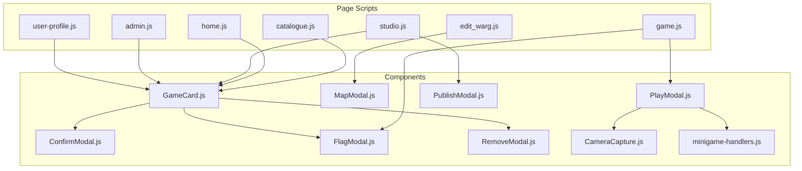
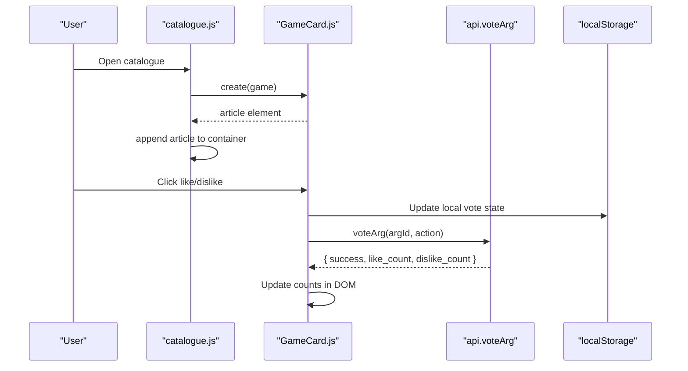
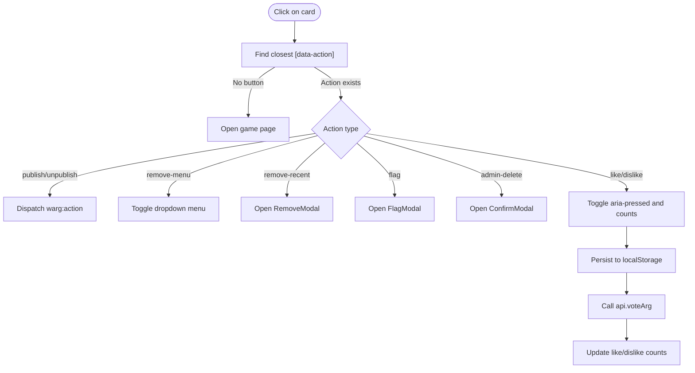
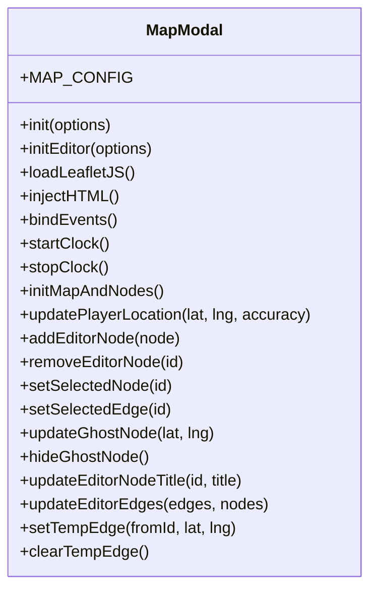
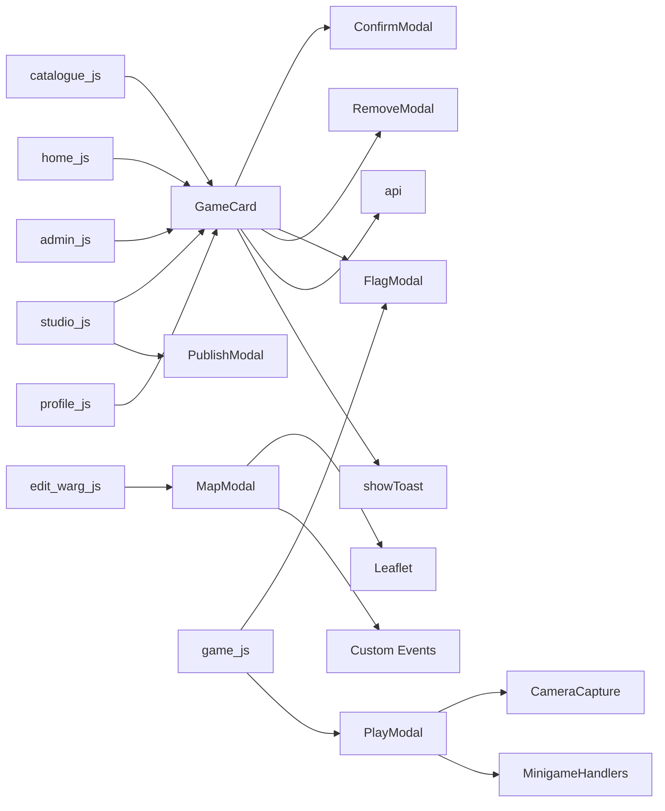

# Component Architecture

<cite>
**Referenced Files in This Document**
- [GameCard.js](file://client/scripts/components/GameCard.js)
- [ConfirmModal.js](file://client/scripts/components/ConfirmModal.js)
- [FlagModal.js](file://client/scripts/components/FlagModal.js)
- [MapModal.js](file://client/scripts/components/MapModal.js)
- [PlayModal.js](file://client/scripts/components/PlayModal.js)
- [PublishModal.js](file://client/scripts/components/PublishModal.js)
- [RemoveModal.js](file://client/scripts/components/RemoveModal.js)
- [CameraCapture.js](file://client/scripts/components/CameraCapture.js)
- [minigame-handlers.js](file://client/scripts/components/minigame-handlers.js)
- [catalogue.js](file://client/scripts/catalogue.js)
- [home.js](file://client/scripts/home.js)
- [studio.js](file://client/scripts/studio.js)
- [edit_warg.js](file://client/scripts/edit_warg.js)
- [game.js](file://client/scripts/game.js)
- [admin.js](file://client/scripts/admin.js)
- [user-profile.js](file://client/scripts/user-profile.js)
</cite>

## Table of Contents
1. [Introduction](#introduction)
2. [Project Structure](#project-structure)
3. [Core Components](#core-components)
4. [Architecture Overview](#architecture-overview)
5. [Detailed Component Analysis](#detailed-component-analysis)
6. [Dependency Analysis](#dependency-analysis)
7. [Performance Considerations](#performance-considerations)
8. [Troubleshooting Guide](#troubleshooting-guide)
9. [Conclusion](#conclusion)

## Introduction
This document explains the vanilla JavaScript component system used across the client application. It focuses on:
- The class-based and factory patterns used to build reusable UI components
- Lifecycle management for modals, maps, and interactive elements
- Event-driven architecture for inter-component communication
- Concrete examples of instantiation, method invocation, and event handling
- Testing strategies, debugging approaches, and performance considerations for DOM manipulation

The system is intentionally lightweight and modular. Components either:
- Export a class instance or singleton (e.g., MapModal, PlayModal)
- Expose a global object with static methods (e.g., GameCard)
- Dynamically inject their own CSS and HTML into the DOM
- Communicate via custom events and shared globals like api and showToast

## Project Structure
The component layer lives under `client/scripts/components`. Consumers are page-level scripts such as `catalogue.js`, `home.js`, `studio.js`, `edit_warg.js`, `game.js`, `admin.js`, and `user-profile.js`.

**Diagram sources**
- [catalogue.js:90-100](file://client/scripts/catalogue.js#L90-L100)
- [home.js:290-350](file://client/scripts/home.js#L290-L350)
- [studio.js:10-70](file://client/scripts/studio.js#L10-L70)
- [edit_warg.js:195-210](file://client/scripts/edit_warg.js#L195-L210)
- [game.js:110-120](file://client/scripts/game.js#L110-L120)
- [admin.js:70-85](file://client/scripts/admin.js#L70-L85)
- [user-profile.js:110-120](file://client/scripts/user-profile.js#L110-L120)

**Section sources**
- [GameCard.js:1-12](file://client/scripts/components/GameCard.js#L1-L12)
- [MapModal.js:1-10](file://client/scripts/components/MapModal.js#L1-L10)
- [PlayModal.js:1-10](file://client/scripts/components/PlayModal.js#L1-L10)

## Core Components
- GameCard: Factory that creates interactive game cards with voting, publishing/unpublishing, flagging, and removal flows.
- ConfirmModal: Generic confirmation dialog for destructive actions.
- FlagModal: Reporting modal with reason selection and description.
- MapModal: Leaflet-backed map modal supporting player view and editor mode with node/edge interactions.
- PlayModal: Modal for waypoint briefs and gameplay controls, including canvas injection and feedback toasts.
- PublishModal: Confirmation and status update flow for publishing/unpublishing games.
- RemoveModal: Confirmation flow to remove a game from recently played.
- CameraCapture: Utility to capture camera frames and produce image blobs.
- minigame-handlers: Registry returning UI handlers per minigame type.

Key responsibilities:
- DOM construction and lifecycle control
- Event binding and delegation
- Optional dynamic dependency loading (CSS/JS)
- Inter-component communication through custom events and shared globals

**Section sources**
- [GameCard.js:142-263](file://client/scripts/components/GameCard.js#L142-L263)
- [ConfirmModal.js:6-12](file://client/scripts/components/ConfirmModal.js#L6-L12)
- [FlagModal.js:7-12](file://client/scripts/components/FlagModal.js#L7-L12)
- [MapModal.js:8-43](file://client/scripts/components/MapModal.js#L8-L43)
- [PlayModal.js:7-21](file://client/scripts/components/PlayModal.js#L7-L21)
- [PublishModal.js:6-10](file://client/scripts/components/PublishModal.js#L6-L10)
- [RemoveModal.js:6-10](file://client/scripts/components/RemoveModal.js#L6-L10)
- [CameraCapture.js:1-35](file://client/scripts/components/CameraCapture.js#L1-L35)
- [minigame-handlers.js:7-200](file://client/scripts/components/minigame-handlers.js#L7-L200)

## Architecture Overview
The system uses three primary composition patterns:
- Factory pattern: GameCard.create returns a ready-to-append DOM element; renderRow batches insertions.
- Class-based components: Modals and utilities encapsulate state, DOM, and behavior.
- Event-driven communication: Custom events propagate user actions between components and pages.

**Diagram sources**
- [catalogue.js:90-100](file://client/scripts/catalogue.js#L90-L100)
- [GameCard.js:142-263](file://client/scripts/components/GameCard.js#L142-L263)
- [GameCard.js:386-452](file://client/scripts/components/GameCard.js#L386-L452)

## Detailed Component Analysis

### GameCard Component
Responsibilities:
- Build card DOM with cover, progress, author, and actions
- Handle like/dislike toggling with optimistic UI updates
- Persist votes locally and call server-side API
- Launch modals for flagging, removing recent, and admin delete
- Provide row rendering helpers

Lifecycle:
- Creation: GameCard.create(game, options) builds and wires the card
- Interaction: _attachEvents binds click and keyboard handlers
- Deletion: Admin delete removes the card from DOM after successful API call

Composition:
- Uses ConfirmModal for admin deletion
- Uses FlagModal for reporting
- Uses RemoveModal for removing from recent list

Event-driven behavior:
- Dispatches warg:publish and warg:unpublish when publish/unpublish buttons are clicked
- Opens modals by checking window globals or dynamically importing modules

**Diagram sources**
- [GameCard.js:265-453](file://client/scripts/components/GameCard.js#L265-L453)

Usage examples:
- Instantiate a single card:
  - Path reference: [GameCard.js:142-263](file://client/scripts/components/GameCard.js#L142-L263)
- Render a row of cards:
  - Path reference: [GameCard.js:475-495](file://client/scripts/components/GameCard.js#L475-L495)
- Consume in catalogue:
  - Path reference: [catalogue.js:90-100](file://client/scripts/catalogue.js#L90-L100)
- Consume in home:
  - Path reference: [home.js:290-350](file://client/scripts/home.js#L290-L350)
- Consume in studio:
  - Path reference: [studio.js:50-70](file://client/scripts/studio.js#L50-L70)
- Consume in admin:
  - Path reference: [admin.js:70-85](file://client/scripts/admin.js#L70-L85)
- Consume in user profile:
  - Path reference: [user-profile.js:110-120](file://client/scripts/user-profile.js#L110-L120)

**Section sources**
- [GameCard.js:142-263](file://client/scripts/components/GameCard.js#L142-L263)
- [GameCard.js:265-453](file://client/scripts/components/GameCard.js#L265-L453)
- [GameCard.js:475-530](file://client/scripts/components/GameCard.js#L475-L530)
- [catalogue.js:90-100](file://client/scripts/catalogue.js#L90-L100)
- [home.js:290-350](file://client/scripts/home.js#L290-L350)
- [studio.js:50-70](file://client/scripts/studio.js#L50-L70)
- [admin.js:70-85](file://client/scripts/admin.js#L70-L85)
- [user-profile.js:110-120](file://client/scripts/user-profile.js#L110-L120)

### ConfirmModal Component
Responsibilities:
- Inject its CSS and overlay HTML once
- Manage open/close state and ESC key handling
- Execute a callback on confirm and restore button states

Lifecycle:
- Constructor initializes DOM and binds events
- open(config) sets title, description, confirm text, and callback
- close() resets aria-hidden and body scroll lock

Usage example:
- Global singleton usage:
  - Path reference: [ConfirmModal.js:124-128](file://client/scripts/components/ConfirmModal.js#L124-L128)
- Invoked from GameCard admin delete:
  - Path reference: [GameCard.js:351-384](file://client/scripts/components/GameCard.js#L351-L384)

**Section sources**
- [ConfirmModal.js:6-12](file://client/scripts/components/ConfirmModal.js#L6-L12)
- [ConfirmModal.js:13-63](file://client/scripts/components/ConfirmModal.js#L13-L63)
- [ConfirmModal.js:65-121](file://client/scripts/components/ConfirmModal.js#L65-L121)
- [ConfirmModal.js:124-128](file://client/scripts/components/ConfirmModal.js#L124-L128)
- [GameCard.js:351-384](file://client/scripts/components/GameCard.js#L351-L384)

### FlagModal Component
Responsibilities:
- Inject CSS and overlay HTML
- Collect reason and description
- Submit via api.flagArg or mock delay
- Show success state and auto-close

Lifecycle:
- Constructor initializes DOM and binds events
- open(argId, title) configures modal content and focus
- close() resets overlay and body scroll

Usage example:
- Instantiation and open:
  - Path reference: [GameCard.js:334-349](file://client/scripts/components/GameCard.js#L334-L349)
  - Path reference: [FlagModal.js:14-27](file://client/scripts/components/FlagModal.js#L14-L27)
- Global exposure:
  - Path reference: [FlagModal.js:166-170](file://client/scripts/components/FlagModal.js#L166-L170)

**Section sources**
- [FlagModal.js:7-12](file://client/scripts/components/FlagModal.js#L7-L12)
- [FlagModal.js:29-92](file://client/scripts/components/FlagModal.js#L29-L92)
- [FlagModal.js:94-163](file://client/scripts/components/FlagModal.js#L94-L163)
- [FlagModal.js:166-170](file://client/scripts/components/FlagModal.js#L166-L170)
- [GameCard.js:334-349](file://client/scripts/components/GameCard.js#L334-L349)

### MapModal Component
Responsibilities:
- Load Leaflet CSS/JS lazily
- Inject modal HTML and initialize map
- Support player mode and editor mode
- Manage markers, popups, edges, and fullscreen behavior
- Emit custom events for gameplay integration

Lifecycle:
- init(options): Player mode initialization
- initEditor(options): Editor mode initialization
- loadLeafletJS(): Lazy script loader
- initMapAndNodes(): Create map, tiles, bubble mask, markers, and lists
- updateEditorEdges(edges, nodes): Draw SVG edges between nodes

Interactions:
- Popup play button dispatches warg:play-node
- Editor callbacks expose node selection/moving and edge drawing

**Diagram sources**
- [MapModal.js:8-43](file://client/scripts/components/MapModal.js#L8-L43)
- [MapModal.js:138-184](file://client/scripts/components/MapModal.js#L138-L184)
- [MapModal.js:186-199](file://client/scripts/components/MapModal.js#L186-L199)
- [MapModal.js:201-314](file://client/scripts/components/MapModal.js#L201-L314)
- [MapModal.js:316-345](file://client/scripts/components/MapModal.js#L316-L345)
- [MapModal.js:366-426](file://client/scripts/components/MapModal.js#L366-L426)
- [MapModal.js:436-453](file://client/scripts/components/MapModal.js#L436-L453)
- [MapModal.js:461-537](file://client/scripts/components/MapModal.js#L461-L537)
- [MapModal.js:542-646](file://client/scripts/components/MapModal.js#L542-L646)
- [MapModal.js:601-751](file://client/scripts/components/MapModal.js#L601-L751)

Usage examples:
- Player mode initialization:
  - Path reference: [MapModal.js:138-184](file://client/scripts/components/MapModal.js#L138-L184)
- Editor mode initialization:
  - Path reference: [edit_warg.js:195-210](file://client/scripts/edit_warg.js#L195-L210)
- Singleton export:
  - Path reference: [MapModal.js:1020-1032](file://client/scripts/components/MapModal.js#L1020-L1032)

**Section sources**
- [MapModal.js:8-43](file://client/scripts/components/MapModal.js#L8-L43)
- [MapModal.js:138-184](file://client/scripts/components/MapModal.js#L138-L184)
- [MapModal.js:186-199](file://client/scripts/components/MapModal.js#L186-L199)
- [MapModal.js:201-314](file://client/scripts/components/MapModal.js#L201-L314)
- [MapModal.js:316-345](file://client/scripts/components/MapModal.js#L316-L345)
- [MapModal.js:366-426](file://client/scripts/components/MapModal.js#L366-L426)
- [MapModal.js:436-453](file://client/scripts/components/MapModal.js#L436-L453)
- [MapModal.js:461-537](file://client/scripts/components/MapModal.js#L461-L537)
- [MapModal.js:542-646](file://client/scripts/components/MapModal.js#L542-L646)
- [MapModal.js:601-751](file://client/scripts/components/MapModal.js#L601-L751)
- [edit_warg.js:195-210](file://client/scripts/edit_warg.js#L195-L210)

### PlayModal Component
Responsibilities:
- Manage modal open/close and read-more behavior
- Inject controls into a dedicated container
- Render feedback toasts and optionally auto-close
- Provide access to canvas for game rendering

Lifecycle:
- Constructor finds existing DOM elements and binds events
- open(title, description) shows modal and handles overflow locking
- setControls(controls) accepts string, array, or HTMLElement
- showFeedback(outcome, autoClose) displays temporary feedback

Usage example:
- Singleton export and usage:
  - Path reference: [PlayModal.js:160-163](file://client/scripts/components/PlayModal.js#L160-L163)
- Canvas access:
  - Path reference: [PlayModal.js:152-157](file://client/scripts/components/PlayModal.js#L152-L157)

**Section sources**
- [PlayModal.js:7-21](file://client/scripts/components/PlayModal.js#L7-L21)
- [PlayModal.js:23-41](file://client/scripts/components/PlayModal.js#L23-L41)
- [PlayModal.js:43-87](file://client/scripts/components/PlayModal.js#L43-L87)
- [PlayModal.js:94-157](file://client/scripts/components/PlayModal.js#L94-L157)
- [PlayModal.js:160-163](file://client/scripts/components/PlayModal.js#L160-L163)

### PublishModal Component
Responsibilities:
- Confirm publish/unpublish action
- PATCH /api/args/{id}/status
- Show success/error state inside modal and reload on close

Lifecycle:
- Constructor initializes DOM and binds events
- open(gameId, gameTitle, action) configures modal content and behavior
- close() hides overlay and restores body scroll

Usage example:
- Instantiation and usage:
  - Path reference: [studio.js:10-15](file://client/scripts/studio.js#L10-L15)
  - Path reference: [studio.js:50-70](file://client/scripts/studio.js#L50-L70)

**Section sources**
- [PublishModal.js:6-10](file://client/scripts/components/PublishModal.js#L6-L10)
- [PublishModal.js:12-62](file://client/scripts/components/PublishModal.js#L12-L62)
- [PublishModal.js:64-147](file://client/scripts/components/PublishModal.js#L64-L147)
- [PublishModal.js:153-194](file://client/scripts/components/PublishModal.js#L153-L194)
- [studio.js:10-15](file://client/scripts/studio.js#L10-L15)
- [studio.js:50-70](file://client/scripts/studio.js#L50-L70)

### RemoveModal Component
Responsibilities:
- Confirm removal from recently played
- Call api.removeRecentArg or simulate delay
- Dispatch warg:removed-recent event for UI updates

Lifecycle:
- Constructor initializes DOM and binds events
- open(argId, gameTitle) configures modal content
- close() hides overlay and restores body scroll

Usage example:
- Dynamic import and singleton usage:
  - Path reference: [GameCard.js:313-332](file://client/scripts/components/GameCard.js#L313-L332)
- Event dispatch:
  - Path reference: [RemoveModal.js:96-100](file://client/scripts/components/RemoveModal.js#L96-L100)

**Section sources**
- [RemoveModal.js:6-10](file://client/scripts/components/RemoveModal.js#L6-L10)
- [RemoveModal.js:12-62](file://client/scripts/components/RemoveModal.js#L12-L62)
- [RemoveModal.js:64-126](file://client/scripts/components/RemoveModal.js#L64-L126)
- [RemoveModal.js:129-133](file://client/scripts/components/RemoveModal.js#L129-L133)
- [GameCard.js:313-332](file://client/scripts/components/GameCard.js#L313-L332)

### CameraCapture Component
Responsibilities:
- Access camera stream and render video
- Overlay reference image if provided
- Capture frame to canvas and return blob

Lifecycle:
- start(): Append video/canvas/overlay and request media stream
- stop(): Stop tracks and clean up DOM references
- snap(): Resize canvas, draw frame, and resolve with blob

Usage example:
- Integration with gameplay:
  - Path reference: [CameraCapture.js:37-54](file://client/scripts/components/CameraCapture.js#L37-L54)
  - Path reference: [CameraCapture.js:74-110](file://client/scripts/components/CameraCapture.js#L74-L110)

**Section sources**
- [CameraCapture.js:1-35](file://client/scripts/components/CameraCapture.js#L1-L35)
- [CameraCapture.js:37-54](file://client/scripts/components/CameraCapture.js#L37-L54)
- [CameraCapture.js:56-72](file://client/scripts/components/CameraCapture.js#L56-L72)
- [CameraCapture.js:74-110](file://client/scripts/components/CameraCapture.js#L74-L110)

### Minigame Handlers
Responsibilities:
- Return a handler object per game type with a render(container, config, onSubmit) function
- Implement GPS proximity, text answer, QR/barcode scanning, plaque photo capture, and fallback

Lifecycle:
- getMinigameHandler(gameType) returns a handler
- Handler.render builds UI and wires submit behavior

Usage example:
- Handler registry:
  - Path reference: [minigame-handlers.js:7-200](file://client/scripts/components/minigame-handlers.js#L7-L200)

**Section sources**
- [minigame-handlers.js:7-200](file://client/scripts/components/minigame-handlers.js#L7-L200)

## Dependency Analysis
Component relationships and coupling:
- GameCard depends on:
  - ConfirmModal (global singleton)
  - FlagModal (global class or dynamic import)
  - RemoveModal (global class or dynamic import)
  - api (for voting and flagging)
  - showToast (for notifications)
- MapModal depends on:
  - Leaflet library (loaded lazily)
  - Custom events (warg:play-node)
- PlayModal depends on:
  - CameraCapture (for gameplay)
  - minigame-handlers (for specific minigame UIs)
- Page scripts depend on components:
  - catalogue.js, home.js, studio.js, admin.js, user-profile.js use GameCard
  - edit_warg.js uses MapModal
  - game.js uses FlagModal and PlayModal

**Diagram sources**
- [GameCard.js:313-384](file://client/scripts/components/GameCard.js#L313-L384)
- [MapModal.js:186-199](file://client/scripts/components/MapModal.js#L186-L199)
- [MapModal.js:400-412](file://client/scripts/components/MapModal.js#L400-L412)
- [PlayModal.js:94-157](file://client/scripts/components/PlayModal.js#L94-L157)
- [minigame-handlers.js:7-200](file://client/scripts/components/minigame-handlers.js#L7-L200)
- [catalogue.js:90-100](file://client/scripts/catalogue.js#L90-L100)
- [home.js:290-350](file://client/scripts/home.js#L290-L350)
- [studio.js:10-70](file://client/scripts/studio.js#L10-L70)
- [edit_warg.js:195-210](file://client/scripts/edit_warg.js#L195-L210)
- [game.js:110-120](file://client/scripts/game.js#L110-L120)
- [admin.js:70-85](file://client/scripts/admin.js#L70-L85)
- [user-profile.js:110-120](file://client/scripts/user-profile.js#L110-L120)

**Section sources**
- [GameCard.js:313-384](file://client/scripts/components/GameCard.js#L313-L384)
- [MapModal.js:186-199](file://client/scripts/components/MapModal.js#L186-L199)
- [MapModal.js:400-412](file://client/scripts/components/MapModal.js#L400-L412)
- [PlayModal.js:94-157](file://client/scripts/components/PlayModal.js#L94-L157)
- [minigame-handlers.js:7-200](file://client/scripts/components/minigame-handlers.js#L7-L200)
- [catalogue.js:90-100](file://client/scripts/catalogue.js#L90-L100)
- [home.js:290-350](file://client/scripts/home.js#L290-L350)
- [studio.js:10-70](file://client/scripts/studio.js#L10-L70)
- [edit_warg.js:195-210](file://client/scripts/edit_warg.js#L195-L210)
- [game.js:110-120](file://client/scripts/game.js#L110-L120)
- [admin.js:70-85](file://client/scripts/admin.js#L70-L85)
- [user-profile.js:110-120](file://client/scripts/user-profile.js#L110-L120)

## Performance Considerations
- Batch DOM insertions:
  - GameCard.renderRow uses a DocumentFragment to minimize reflows.
  - Path reference: [GameCard.js:490-495](file://client/scripts/components/GameCard.js#L490-L495)
- Lazy loading dependencies:
  - MapModal.loadLeafletJS loads Leaflet only when needed.
  - Path reference: [MapModal.js:186-199](file://client/scripts/components/MapModal.js#L186-L199)
- Avoid unnecessary reflows:
  - MapModal.invalidateSize is called after layout settles.
  - Path reference: [MapModal.js:173-181](file://client/scripts/components/MapModal.js#L173-L181)
- Efficient event delegation:
  - GameCard attaches a single click listener and delegates actions via data attributes.
  - Path reference: [GameCard.js:265-277](file://client/scripts/components/GameCard.js#L265-L277)
- Optimistic UI updates:
  - GameCard updates counts immediately and persists to localStorage before API calls.
  - Path reference: [GameCard.js:386-452](file://client/scripts/components/GameCard.js#L386-L452)
- Cleanup resources:
  - CameraCapture.stop releases media tracks and removes DOM nodes.
  - Path reference: [CameraCapture.js:56-72](file://client/scripts/components/CameraCapture.js#L56-L72)

[No sources needed since this section provides general guidance]

## Troubleshooting Guide
Common issues and resolutions:
- Modal not opening:
  - Ensure the modal’s CSS link is injected and the overlay exists.
  - Check isOpen() logic and aria-hidden attribute.
  - Path reference: [ConfirmModal.js:13-20](file://client/scripts/components/ConfirmModal.js#L13-L20)
  - Path reference: [ConfirmModal.js:103-105](file://client/scripts/components/ConfirmModal.js#L103-L105)
- Leaflet not available:
  - Verify loadLeafletJS resolves and window.L exists before map initialization.
  - Path reference: [MapModal.js:186-199](file://client/scripts/components/MapModal.js#L186-L199)
  - Path reference: [MapModal.js:366-380](file://client/scripts/components/MapModal.js#L366-L380)
- Voting counts not updating:
  - Confirm api.voteArg returns expected structure and DOM selectors match.
  - Path reference: [GameCard.js:439-452](file://client/scripts/components/GameCard.js#L439-L452)
- Camera permission denied:
  - Catch error in CameraCapture.start and handle gracefully.
  - Path reference: [CameraCapture.js:45-53](file://client/scripts/components/CameraCapture.js#L45-L53)
- Minigame UI not rendering:
  - Ensure getMinigameHandler returns a handler and render is invoked with correct container.
  - Path reference: [minigame-handlers.js:7-200](file://client/scripts/components/minigame-handlers.js#L7-L200)

**Section sources**
- [ConfirmModal.js:13-20](file://client/scripts/components/ConfirmModal.js#L13-L20)
- [ConfirmModal.js:103-105](file://client/scripts/components/ConfirmModal.js#L103-L105)
- [MapModal.js:186-199](file://client/scripts/components/MapModal.js#L186-L199)
- [MapModal.js:366-380](file://client/scripts/components/MapModal.js#L366-L380)
- [GameCard.js:439-452](file://client/scripts/components/GameCard.js#L439-L452)
- [CameraCapture.js:45-53](file://client/scripts/components/CameraCapture.js#L45-L53)
- [minigame-handlers.js:7-200](file://client/scripts/components/minigame-handlers.js#L7-L200)

## Conclusion
The component system combines factory and class-based patterns to deliver modular, reusable UI elements. GameCard orchestrates complex interactions while delegating modal workflows to specialized components. MapModal and PlayModal encapsulate heavy features like mapping and gameplay controls. Event-driven communication and lazy loading keep the system performant and maintainable. By following the documented instantiation patterns, lifecycle methods, and event handling strategies, developers can extend and compose components confidently.

[No sources needed since this section summarizes without analyzing specific files]