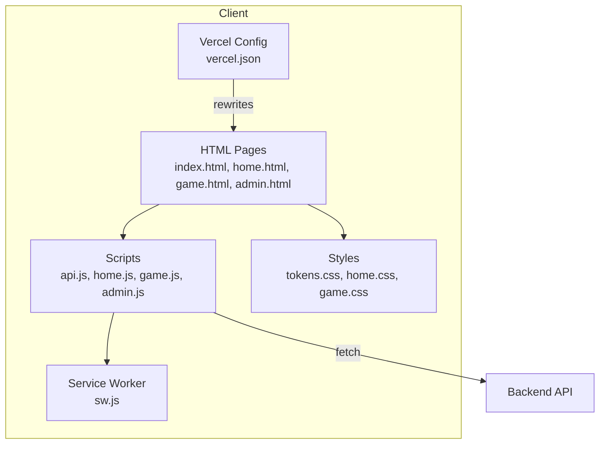
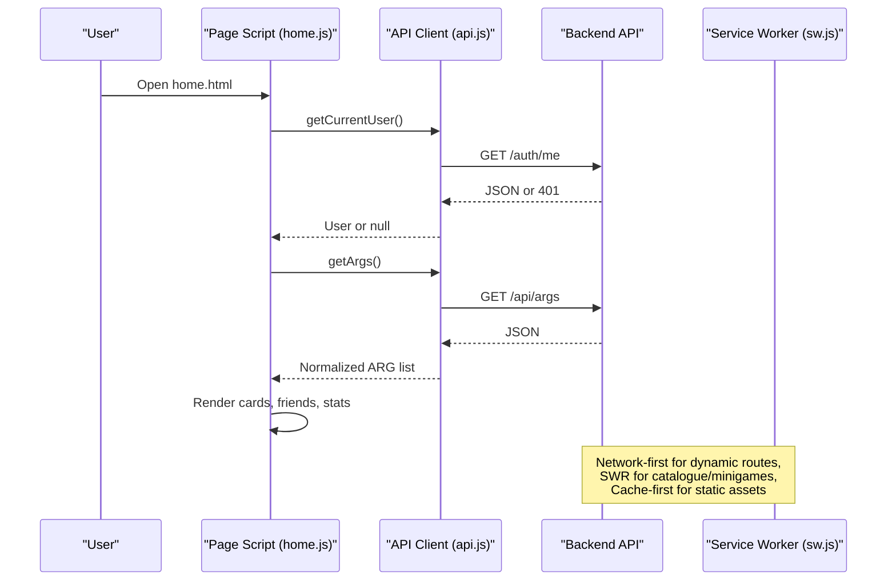
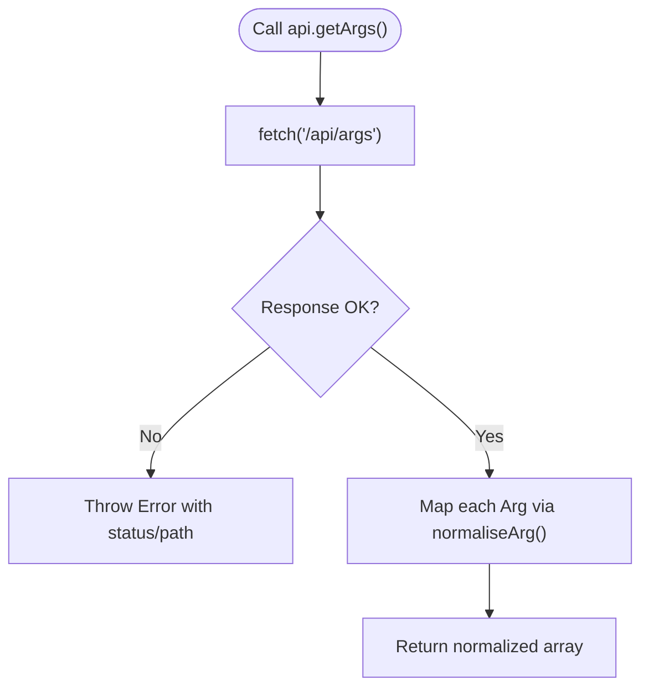
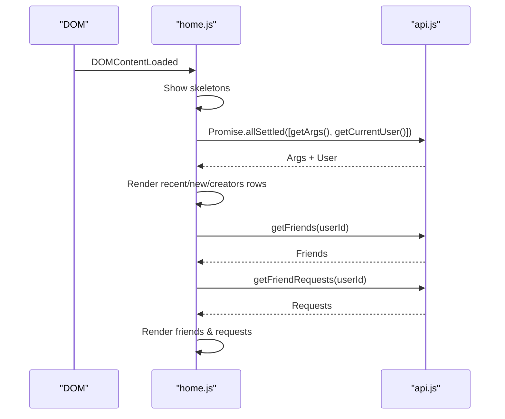
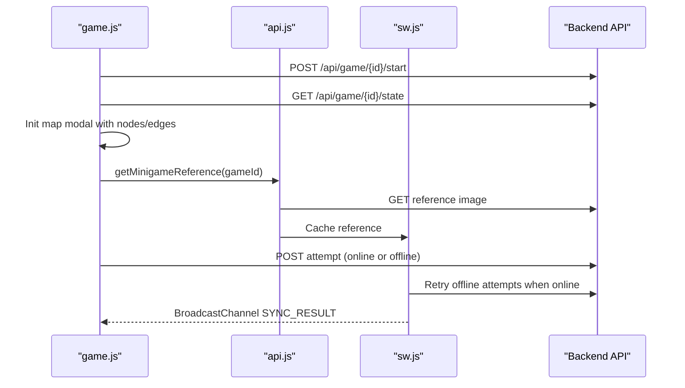
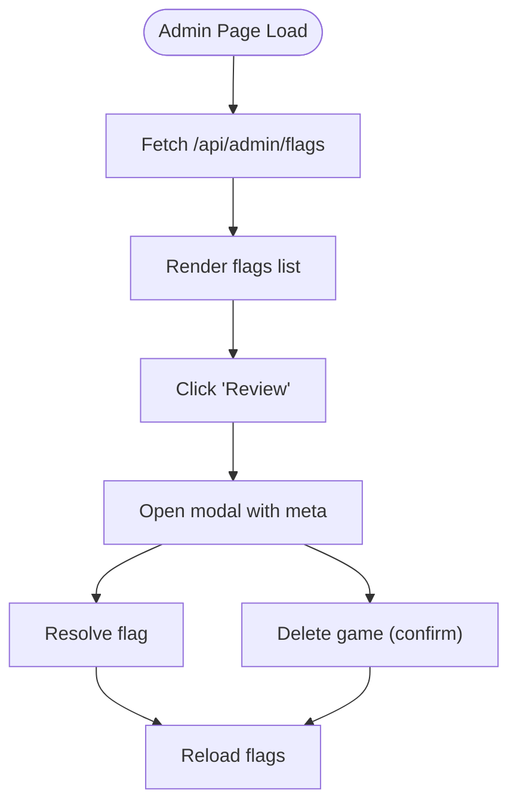
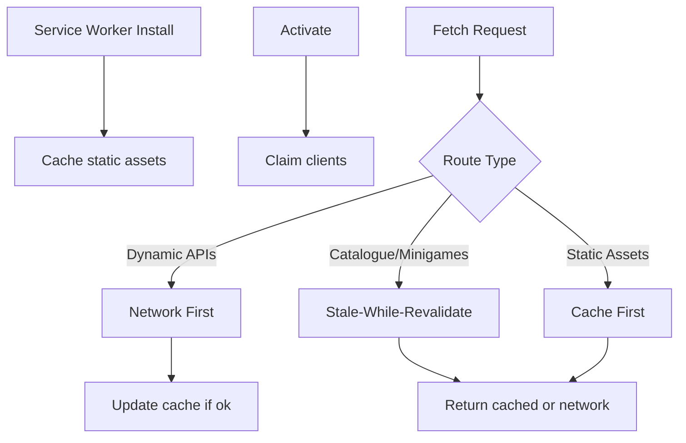
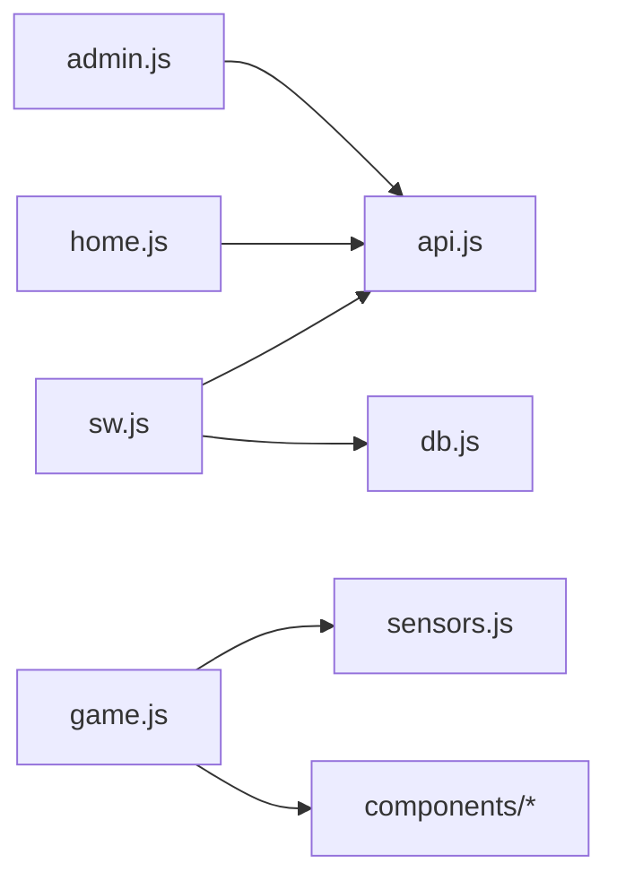

# Frontend Architecture

<cite>
**Referenced Files in This Document**   
- [package.json](file://client/package.json)
- [vercel.json](file://client/vercel.json)
- [index.html](file://client/index.html)
- [api.js](file://client/scripts/api.js)
- [tokens.css](file://client/styles/tokens.css)
- [home.css](file://client/styles/home.css)
- [home.js](file://client/scripts/home.js)
- [game.js](file://client/scripts/game.js)
- [admin.js](file://client/scripts/admin.js)
- [sw.js](file://client/sw.js)
</cite>

## Table of Contents
1. [Introduction](#introduction)
2. [Project Structure](#project-structure)
3. [Core Components](#core-components)
4. [Architecture Overview](#architecture-overview)
5. [Detailed Component Analysis](#detailed-component-analysis)
6. [Dependency Analysis](#dependency-analysis)
7. [Performance Considerations](#performance-considerations)
8. [Troubleshooting Guide](#troubleshooting-guide)
9. [Conclusion](#conclusion)

## Introduction
This document explains the frontend architecture of the WARG Platform’s static multi-page application. The client is a vanilla JavaScript application without frameworks, organized as multiple HTML pages with modular scripts and reusable components. It uses fetch-based API integration, CSS custom properties for design tokens, responsive layouts, and a service worker for offline caching and background sync.

The goals covered here:
- Vanilla JavaScript approach and page initialization patterns
- Modular script organization and component-based structure
- API integration layer using fetch, error handling, and state management patterns
- Styling system based on CSS custom properties and responsive principles
- Asset management, build process, and Vercel deployment configuration
- Browser compatibility, performance optimization (lazy loading), and accessibility practices

## Project Structure
The frontend lives under `client/`. Key areas:
- HTML pages: `index.html`, `home.html`, `game.html`, `catalogue.html`, `login.html`, `signup.html`, `studio.html`, `admin.html`, `analytics.html`, `edit_warg.html`, `create_warg.html`, `user-profile.html`, `friend-profile.html`
- Scripts: `scripts/config.js`, `scripts/api.js`, `scripts/home.js`, `scripts/game.js`, `scripts/admin.js`, plus reusable components under `scripts/components/`
- Styles: `styles/tokens.css` for design tokens; per-page styles like `styles/home.css`, `styles/game.css`, etc.; modal-specific styles under `styles/components/`
- Service worker: `sw.js` for caching strategies and background sync
- Deployment config: `vercel.json` for routing rewrites
- Tooling: `package.json` defines linting and UI tests via Playwright



**Diagram sources**
- [index.html:1-17](file://client/index.html#L1-L17)
- [api.js:1-401](file://client/scripts/api.js#L1-L401)
- [tokens.css:1-116](file://client/styles/tokens.css#L1-L116)
- [home.css:1-800](file://client/styles/home.css#L1-L800)
- [sw.js:1-235](file://client/sw.js#L1-L235)
- [vercel.json:1-9](file://client/vercel.json#L1-L9)

**Section sources**
- [package.json:1-25](file://client/package.json#L1-L25)
- [vercel.json:1-9](file://client/vercel.json#L1-L9)
- [index.html:1-17](file://client/index.html#L1-L17)

## Core Components
- API Client (`scripts/api.js`): Centralized fetch wrapper, endpoint helpers, data normalization, and cache utilities.
- Home Page (`scripts/home.js`): Sidebar/right-panel toggles, search, friends list, notifications, feedback modal, friend profile modal.
- Game Page (`scripts/game.js`): Game session lifecycle, map modal integration, minigame orchestration, geolocation checks, comments, voting.
- Admin Dashboard (`scripts/admin.js`): Flagged games review, user search, ban/unban actions.
- Design Tokens (`styles/tokens.css`): Color palette, typography, spacing, radius, shadows, transitions, layout variables.
- Layout & Components (`styles/home.css`): App shell grid, topbar, sidebar, main content, card rows, game card component styles.
- Service Worker (`sw.js`): Caching strategies (network-first, stale-while-revalidate, cache-first), background sync for offline attempts.

**Section sources**
- [api.js:1-401](file://client/scripts/api.js#L1-L401)
- [home.js:1-755](file://client/scripts/home.js#L1-L755)
- [game.js:1-838](file://client/scripts/game.js#L1-L838)
- [admin.js:1-272](file://client/scripts/admin.js#L1-L272)
- [tokens.css:1-116](file://client/styles/tokens.css#L1-L116)
- [home.css:1-800](file://client/styles/home.css#L1-L800)
- [sw.js:1-235](file://client/sw.js#L1-L235)

## Architecture Overview
The application follows a multi-page SPA-like experience built with vanilla JS:
- Each page loads its own script(s) and shared modules.
- Shared API client abstracts network calls and normalizes responses.
- Reusable components live under `scripts/components/` and are imported where needed.
- CSS layers organize reset, base, tokens, components, utilities.
- Service worker intercepts requests to provide offline capabilities and background sync.



**Diagram sources**
- [home.js:200-352](file://client/scripts/home.js#L200-L352)
- [api.js:117-164](file://client/scripts/api.js#L117-L164)
- [sw.js:50-148](file://client/sw.js#L50-L148)

## Detailed Component Analysis

### API Integration Layer
Responsibilities:
- Auto-detect environment and set base URL.
- Provide generic `_get`, `_post`, `_delete` wrappers with credentials and error mapping.
- Normalize backend Arg objects into a consistent shape used by UI components.
- Expose typed helpers for auth, args, users, sessions, friends, minigames, feedback, and cache clearing.

Error handling:
- Non-OK responses throw enriched errors with status and path.
- Some endpoints swallow 401 gracefully (e.g., current user).

State management patterns:
- Lightweight local storage for votes and dismissed items.
- BroadcastChannel for cross-tab sync results.
- Offline persistence via IndexedDB-backed helper referenced from the service worker.



**Diagram sources**
- [api.js:24-55](file://client/scripts/api.js#L24-L55)
- [api.js:70-115](file://client/scripts/api.js#L70-L115)
- [api.js:136-139](file://client/scripts/api.js#L136-L139)

**Section sources**
- [api.js:12-19](file://client/scripts/api.js#L12-L19)
- [api.js:24-55](file://client/scripts/api.js#L24-L55)
- [api.js:70-115](file://client/scripts/api.js#L70-L115)
- [api.js:117-164](file://client/scripts/api.js#L117-L164)
- [api.js:211-314](file://client/scripts/api.js#L211-L314)
- [api.js:316-370](file://client/scripts/api.js#L316-L370)

### Home Page Module
Responsibilities:
- Manage app shell layout: left sidebar and right panel collapse on desktop, drawer overlays on mobile.
- Handle keyboard shortcuts (Escape, `/`) and focus expansion for search.
- Live search for friends with debounced API calls.
- Initialize data: fetch ARGs and current user, render skeletons, populate sections (recent, new, creators).
- Render friends list and pending requests; handle accept/decline flows.
- Feedback modal submission and friend profile modal interactions.

DOM manipulation patterns:
- Select elements once at startup.
- Toggle classes for visibility and collapsed states.
- Use event delegation for dynamic lists.

Accessibility:
- ARIA attributes for drawers (`aria-hidden`, `aria-expanded`).
- Keyboard activation for interactive roles.



**Diagram sources**
- [home.js:200-352](file://client/scripts/home.js#L200-L352)
- [home.js:385-449](file://client/scripts/home.js#L385-L449)
- [home.js:501-576](file://client/scripts/home.js#L501-L576)

**Section sources**
- [home.js:1-124](file://client/scripts/home.js#L1-L124)
- [home.js:126-189](file://client/scripts/home.js#L126-L189)
- [home.js:200-352](file://client/scripts/home.js#L200-L352)
- [home.js:385-449](file://client/scripts/home.js#L385-L449)
- [home.js:501-576](file://client/scripts/home.js#L501-L576)
- [home.js:614-677](file://client/scripts/home.js#L614-L677)
- [home.js:679-755](file://client/scripts/home.js#L679-L755)

### Game Page Module
Responsibilities:
- Connection banner and online/offline events.
- Start/resume game session and load full state.
- Prefetch minigame references for offline use.
- Integrate map modal with nodes and edges.
- Geolocation watch and sensor logging.
- Voting with optimistic UI updates and localStorage fallback.
- Minigame orchestration: camera-based CV tasks and non-CV tasks with geofence verification.
- Comments tree rendering and posting.

Offline support:
- Background Sync via service worker for offline attempts.
- BroadcastChannel to communicate sync results across tabs.



**Diagram sources**
- [game.js:14-48](file://client/scripts/game.js#L14-L48)
- [game.js:143-272](file://client/scripts/game.js#L143-L272)
- [game.js:354-451](file://client/scripts/game.js#L354-L451)
- [game.js:452-631](file://client/scripts/game.js#L452-L631)
- [sw.js:150-235](file://client/sw.js#L150-L235)

**Section sources**
- [game.js:1-63](file://client/scripts/game.js#L1-L63)
- [game.js:64-140](file://client/scripts/game.js#L64-L140)
- [game.js:143-272](file://client/scripts/game.js#L143-L272)
- [game.js:274-351](file://client/scripts/game.js#L274-L351)
- [game.js:354-451](file://client/scripts/game.js#L354-L451)
- [game.js:452-631](file://client/scripts/game.js#L452-L631)
- [game.js:633-838](file://client/scripts/game.js#L633-L838)

### Admin Dashboard Module
Responsibilities:
- Load flagged games and recent flags with skeleton loaders.
- Review flag details and resolve flags.
- Delete games via confirmation modal.
- Search users and toggle ban status.



**Diagram sources**
- [admin.js:7-87](file://client/scripts/admin.js#L7-L87)
- [admin.js:89-169](file://client/scripts/admin.js#L89-L169)
- [admin.js:179-271](file://client/scripts/admin.js#L179-L271)

**Section sources**
- [admin.js:7-87](file://client/scripts/admin.js#L7-L87)
- [admin.js:89-169](file://client/scripts/admin.js#L89-L169)
- [admin.js:179-271](file://client/scripts/admin.js#L179-L271)

### Styling System and Responsive Design
Design tokens:
- Colors, typography, spacing, radius, elevation, transitions, layout dimensions defined as CSS custom properties.
- Organized under `@layer tokens` for predictable cascade order.

Layout:
- App shell uses CSS Grid with three columns (sidebar, main, right panel).
- Collapsible sidebars via class toggles and CSS custom property overrides.
- Mobile drawers with overlay backdrop.

Components:
- Topbar, sidebar navigation, main content area, horizontal card rows, and game card component styles.
- Accessible focus states and touch targets.

```mermaid
classDiagram
class Tokens {
"+color-bg"
"+color-brand"
"+color-accent"
"+font-family"
"+font-size-body"
"+space-3"
"+radius-card"
"+shadow-md"
"+ease-out"
"+sidebar-width"
}
class AppShell {
"+grid-template-columns"
"+grid-template-areas"
"+block-size : 100dvh"
"+transition : grid-template-columns"
}
class Sidebar {
"+nav-item"
"+active indicator"
"+collapsed state"
}
class MainContent {
"+overflow-y : auto"
"+scrollbar styling"
}
Tokens <.. AppShell : "uses"
Tokens <.. Sidebar : "uses"
Tokens <.. MainContent : "uses"
```

**Diagram sources**
- [tokens.css:10-112](file://client/styles/tokens.css#L10-L112)
- [home.css:46-77](file://client/styles/home.css#L46-L77)
- [home.css:274-416](file://client/styles/home.css#L274-L416)
- [home.css:422-450](file://client/styles/home.css#L422-L450)

**Section sources**
- [tokens.css:1-116](file://client/styles/tokens.css#L1-L116)
- [home.css:1-800](file://client/styles/home.css#L1-L800)

### Asset Management, Build Process, and Deployment
Asset management:
- Static assets (HTML, CSS, JS) are cached by the service worker during install.
- Dynamic images (minigame references) are explicitly cached via API helper and SW interception.

Build process:
- No bundler configured; plain files served directly.
- Linting via ESLint and UI tests via Playwright defined in `package.json`.

Deployment:
- Vercel rewrite redirects root `/` to `login.html`.
- Service worker handles caching strategies for different route types.



**Diagram sources**
- [sw.js:28-48](file://client/sw.js#L28-L48)
- [sw.js:50-148](file://client/sw.js#L50-L148)
- [vercel.json:1-9](file://client/vercel.json#L1-L9)

**Section sources**
- [sw.js:1-27](file://client/sw.js#L1-L27)
- [sw.js:28-48](file://client/sw.js#L28-L48)
- [sw.js:50-148](file://client/sw.js#L50-L148)
- [package.json:6-23](file://client/package.json#L6-L23)
- [vercel.json:1-9](file://client/vercel.json#L1-L9)

## Dependency Analysis
Key dependencies and relationships:
- `home.js` depends on `api.js` for data fetching and uses shared components like `GameCard`.
- `game.js` imports reusable components (`PlayModal`, `FlagModal`, `MapModal`, `CameraCapture`, minigame handlers) and sensors module.
- `admin.js` relies on global `showToast` and optional `confirmModal`.
- `sw.js` caches static assets and intercepts API routes with specific strategies.



**Diagram sources**
- [home.js:1-12](file://client/scripts/home.js#L1-L12)
- [game.js:7-12](file://client/scripts/game.js#L7-L12)
- [sw.js:1-1](file://client/sw.js#L1-L1)

**Section sources**
- [home.js:1-12](file://client/scripts/home.js#L1-L12)
- [game.js:7-12](file://client/scripts/game.js#L7-L12)
- [sw.js:1-1](file://client/sw.js#L1-L1)

## Performance Considerations
- Skeleton loaders for perceived performance while data loads.
- Debounced search input to reduce API calls.
- Parallel data fetching with `Promise.allSettled` to avoid blocking.
- Optimistic UI updates for voting to improve responsiveness.
- Prefetching minigame references for offline availability.
- Service worker caching strategies tailored to route types for fast UI and background updates.
- Lazy initialization of heavy features (camera, sensors) only when needed.

[No sources needed since this section provides general guidance]

## Troubleshooting Guide
Common issues and resolutions:
- API errors: Check response status and thrown error messages; ensure correct base URL detection.
- Offline mode: Verify service worker registration and background sync; check BroadcastChannel messages for sync results.
- Geolocation not available: Ensure permissions granted and browser supports geolocation; handle fallbacks gracefully.
- Cache busting: Use provided cache-clearing utility to refresh stale data after updates.

**Section sources**
- [api.js:24-55](file://client/scripts/api.js#L24-L55)
- [game.js:14-48](file://client/scripts/game.js#L14-L48)
- [sw.js:150-235](file://client/sw.js#L150-L235)

## Conclusion
The WARG Platform frontend is a well-structured vanilla JavaScript application that balances simplicity with robust functionality. By leveraging modular scripts, reusable components, a centralized API client, CSS custom properties, and a service worker, it delivers a responsive, accessible, and performant user experience across devices and network conditions. The architecture supports future enhancements such as additional minigames, richer analytics, and improved offline workflows while maintaining clarity and maintainability.

[No sources needed since this section summarizes without analyzing specific files]