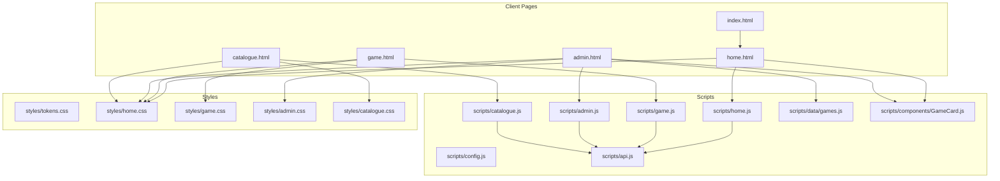
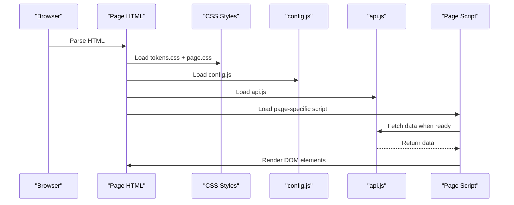
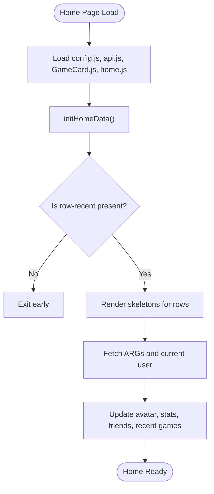
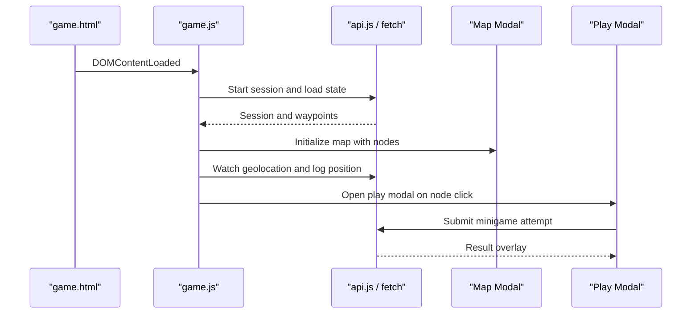
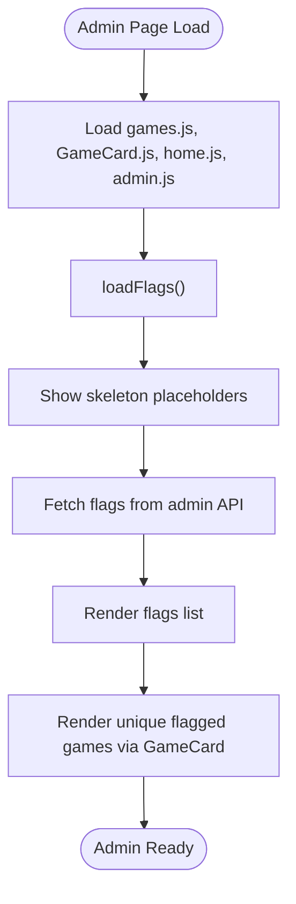
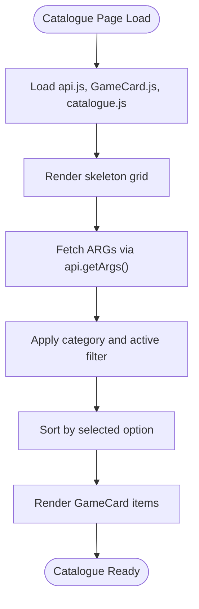
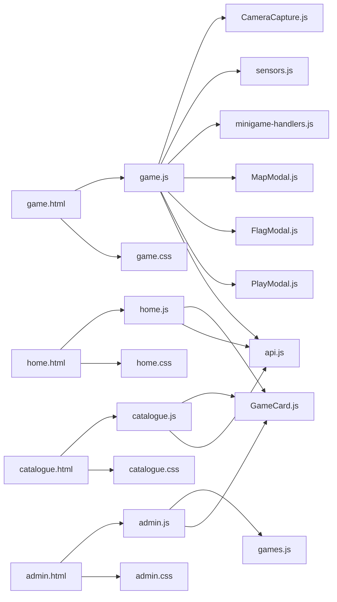

# Page Structure & Organization

<cite>
**Referenced Files in This Document**   
- [index.html](file://client/index.html)
- [home.html](file://client/home.html)
- [game.html](file://client/game.html)
- [admin.html](file://client/admin.html)
- [catalogue.html](file://client/catalogue.html)
- [home.js](file://client/scripts/home.js)
- [game.js](file://client/scripts/game.js)
- [admin.js](file://client/scripts/admin.js)
- [catalogue.js](file://client/scripts/catalogue.js)
- [tokens.css](file://client/styles/tokens.css)
- [home.css](file://client/styles/home.css)
</cite>

## Table of Contents
1. [Introduction](#introduction)
2. [Project Structure](#project-structure)
3. [Core Components](#core-components)
4. [Architecture Overview](#architecture-overview)
5. [Detailed Component Analysis](#detailed-component-analysis)
6. [Dependency Analysis](#dependency-analysis)
7. [Performance Considerations](#performance-considerations)
8. [Troubleshooting Guide](#troubleshooting-guide)
9. [Conclusion](#conclusion)

## Introduction
This document explains the static multi-page application structure under `client/`. The project uses vanilla HTML, CSS, and JavaScript without a frontend framework. Each `.html` file is an independent page entry point with its own markup, styling, and behavior. Shared layout patterns are duplicated across pages for simplicity: a topbar, left sidebar navigation, main content area, and optional right panel. Scripts are loaded directly from `<script>` tags at the bottom of each page, allowing page-specific initialization while reusing shared components and utilities.

The goal is to make it easy to understand how pages are organized, how scripts are included, how DOM initialization works, and how common UI patterns are reused across views.

## Project Structure
At a high level, the client-side code is organized into three main folders:

- `client/*.html`: Static page entry points.
- `client/scripts/*`: JavaScript modules and shared components.
- `client/styles/*`: Global design tokens and per-page styles.

**Diagram sources**
- [index.html:1-17](file://client/index.html#L1-L17)
- [home.html:10-14](file://client/home.html#L10-L14)
- [home.html:480-483](file://client/home.html#L480-L483)
- [game.html:12-17](file://client/game.html#L12-L17)
- [game.html:428-462](file://client/game.html#L428-L462)
- [admin.html:10-16](file://client/admin.html#L10-L16)
- [admin.html:171-175](file://client/admin.html#L171-L175)
- [catalogue.html:10-15](file://client/catalogue.html#L10-L15)
- [catalogue.html:360-362](file://client/catalogue.html#L360-L362)

**Section sources**
- [index.html:1-17](file://client/index.html#L1-L17)
- [home.html:1-488](file://client/home.html#L1-L488)
- [game.html:1-465](file://client/game.html#L1-L465)
- [admin.html:1-182](file://client/admin.html#L1-L182)
- [catalogue.html:1-367](file://client/catalogue.html#L1-L367)

## Core Components
The core reusable pieces include:

- **App shell**: A consistent layout container with a topbar, left sidebar, main content, and optional right panel.
- **Navigation drawer**: Left sidebar that collapses on desktop and becomes a mobile drawer.
- **Right panel**: Friends/activity panel that can be toggled or collapsed.
- **Game card component**: Reusable card used by home and admin pages.
- **Design tokens**: Centralized color, typography, spacing, and layout variables.
- **Shared scripts**: Configuration, API helpers, and page-specific logic.

Key responsibilities:

| Area | Responsibility |
| --- | --- |
| Markup (`*.html`) | Defines page structure, shared layout regions, and page-specific content. |
| Styling (`styles/*.css`) | Provides global tokens and per-page styles; uses CSS layers for reset/base/tokens/components/utilities. |
| Behavior (`scripts/*.js`) | Initializes DOM, wires events, fetches data, and renders dynamic content. |
| Shared components | Provide reusable UI building blocks like cards and modals. |

**Section sources**
- [tokens.css:10-112](file://client/styles/tokens.css#L10-L112)
- [home.css:46-77](file://client/styles/home.css#L46-L77)
- [home.css:274-416](file://client/styles/home.css#L274-L416)
- [home.css:422-515](file://client/styles/home.css#L422-L515)

## Architecture Overview
Each page follows a similar pattern:

1. Load shared design tokens and base layout styles.
2. Load page-specific styles.
3. Load shared configuration and API helpers.
4. Load shared components (for example, GameCard).
5. Load page-specific script that initializes the DOM and binds interactions.

**Diagram sources**
- [home.html:10-14](file://client/home.html#L10-L14)
- [home.html:480-483](file://client/home.html#L480-L483)
- [game.html:12-17](file://client/game.html#L12-L17)
- [game.html:428-462](file://client/game.html#L428-L462)
- [admin.html:10-16](file://client/admin.html#L10-L16)
- [admin.html:171-175](file://client/admin.html#L171-L175)
- [catalogue.html:10-15](file://client/catalogue.html#L10-L15)
- [catalogue.html:360-362](file://client/catalogue.html#L360-L362)

## Detailed Component Analysis

### Entry Point Redirect
The root `index.html` redirects users to the login page. It also loads the shared configuration script early so runtime settings are available before other pages run.

- Redirects to `login.html`.
- Loads `scripts/config.js`.

**Section sources**
- [index.html:1-17](file://client/index.html#L1-L17)

### Home Page
The home page is the discovery view. It includes:

- Shared layout: app shell, sidebar, topbar, main content rows, and right panel.
- Shared styles: `tokens.css` and `home.css`.
- Shared scripts: `config.js`, `api.js`, `GameCard.js`, and `home.js`.

DOM initialization highlights:

- Uses `DOMContentLoaded` to initialize data.
- Renders skeleton placeholders while fetching ARGs and user data.
- Updates avatar, stats, friends list, and recent games.
- Handles feedback modal submission and friend profile modal.

**Diagram sources**
- [home.html:480-483](file://client/home.html#L480-L483)
- [home.js:210-352](file://client/scripts/home.js#L210-L352)
- [home.js:578-579](file://client/scripts/home.js#L578-L579)

**Section sources**
- [home.html:1-488](file://client/home.html#L1-L488)
- [home.js:1-755](file://client/scripts/home.js#L1-L755)

### Game Page
The game page focuses on playing a specific WARG. It includes:

- Shared layout and base styles.
- Game-specific styles.
- External library for QR scanning.
- Game engine integration through `game.js`.
- Play modal and minigame handlers.

Key behaviors:

- Starts or resumes a session.
- Loads game state and initializes map modal.
- Watches player location and updates the map.
- Handles voting, comments, flagging, and offline sync.

**Diagram sources**
- [game.html:12-17](file://client/game.html#L12-L17)
- [game.html:428-462](file://client/game.html#L428-L462)
- [game.js:64-129](file://client/scripts/game.js#L64-L129)
- [game.js:143-272](file://client/scripts/game.js#L143-L272)
- [game.js:354-631](file://client/scripts/game.js#L354-L631)

**Section sources**
- [game.html:1-465](file://client/game.html#L1-L465)
- [game.js:1-838](file://client/scripts/game.js#L1-L838)

### Admin Dashboard
The admin dashboard provides moderation tools:

- Flagged games row.
- Recent flags list.
- Player search and ban/unban controls.
- Confirmation modal integration.

Initialization highlights:

- Loads mock games data and GameCard.
- Shows skeleton loaders while fetching flags.
- Renders flagged games using shared card rendering.
- Handles resolve flag and delete game actions.

**Diagram sources**
- [admin.html:10-16](file://client/admin.html#L10-L16)
- [admin.html:171-175](file://client/admin.html#L171-L175)
- [admin.js:7-87](file://client/scripts/admin.js#L7-L87)

**Section sources**
- [admin.html:1-182](file://client/admin.html#L1-L182)
- [admin.js:1-272](file://client/scripts/admin.js#L1-L272)

### Catalogue Page
The catalogue page displays a filterable and sortable grid of games:

- Filter chips for solo, co-op, PvP, live.
- Sort control for popularity, newest, rating.
- Pagination UI (cosmetic).
- Uses `GameCard` to render items.

Initialization highlights:

- Renders skeleton cards.
- Fetches all published ARGs.
- Applies category filters and sorting.
- Binds chip clicks and sort changes.

**Diagram sources**
- [catalogue.html:10-15](file://client/catalogue.html#L10-L15)
- [catalogue.html:360-362](file://client/catalogue.html#L360-L362)
- [catalogue.js:7-128](file://client/scripts/catalogue.js#L7-L128)

**Section sources**
- [catalogue.html:1-367](file://client/catalogue.html#L1-L367)
- [catalogue.js:1-130](file://client/scripts/catalogue.js#L1-L130)

### Common Layout Patterns
Across multiple pages, the following layout pattern is repeated:

- App shell with three-column grid: sidebar, main, right panel.
- Topbar with brand, search, notifications, and profile.
- Sidebar navigation with active state management.
- Right panel for friends and activity.

This duplication keeps each page self-contained but creates maintenance overhead. A future improvement could extract the layout into a shared template or server-rendered partial.

**Section sources**
- [home.html:17-305](file://client/home.html#L17-L305)
- [game.html:23-426](file://client/game.html#L23-L426)
- [admin.html:20-149](file://client/admin.html#L20-L149)
- [catalogue.html:19-357](file://client/catalogue.html#L19-L357)
- [home.css:46-77](file://client/styles/home.css#L46-L77)
- [home.css:274-416](file://client/styles/home.css#L274-L416)

### Script Loading Strategies
Pages use synchronous `<script>` tags at the bottom of the document. This ensures:

- DOM is parsed before scripts run.
- Shared dependencies like `config.js` and `api.js` are available.
- Page-specific scripts can safely query DOM elements.

Examples:

- Home page loads shared scripts then `home.js`.
- Game page loads external QR scanner, shared scripts, then `game.js` as a module.
- Admin page loads mock data, shared components, and `admin.js`.
- Catalogue page loads API helper, GameCard, and `catalogue.js`.

**Section sources**
- [home.html:480-483](file://client/home.html#L480-L483)
- [game.html:428-462](file://client/game.html#L428-L462)
- [admin.html:171-175](file://client/admin.html#L171-L175)
- [catalogue.html:360-362](file://client/catalogue.html#L360-L362)

### DOM Initialization Patterns
Most page scripts follow this pattern:

1. Wait for `DOMContentLoaded`.
2. Guard against missing containers.
3. Show skeleton loaders.
4. Fetch data from API.
5. Render dynamic content.
6. Bind event listeners.

Examples:

- `home.js` initializes home data and friends lists.
- `game.js` initializes connection banner, map, and play flow.
- `admin.js` initializes flags and user search.
- `catalogue.js` initializes filtering and sorting.

**Section sources**
- [home.js:578-579](file://client/scripts/home.js#L578-L579)
- [game.js:64-129](file://client/scripts/game.js#L64-L129)
- [admin.js:7-87](file://client/scripts/admin.js#L7-L87)
- [catalogue.js:7-128](file://client/scripts/catalogue.js#L7-L128)

### CSS Scoping and Design Tokens
Styling is separated into:

- Global design tokens: colors, typography, spacing, layout variables.
- Base layout styles: app shell, sidebar, topbar, main content.
- Per-page styles: game, admin, catalogue.

The token system centralizes design decisions and makes it easier to maintain consistency.

**Section sources**
- [tokens.css:10-112](file://client/styles/tokens.css#L10-L112)
- [home.css:46-77](file://client/styles/home.css#L46-L77)
- [home.css:274-416](file://client/styles/home.css#L274-L416)
- [home.css:422-515](file://client/styles/home.css#L422-L515)

### Asset Organization
Assets are referenced directly in HTML:

- Fonts are preconnected and imported via CSS.
- Avatars are generated via a remote service.
- External libraries are loaded via CDN where needed.
- Local assets are served from `assets/`, though most examples use inline SVGs and remote images.

**Section sources**
- [home.html:10-13](file://client/home.html#L10-L13)
- [game.html:12-17](file://client/game.html#L12-L17)
- [game.html:428-428](file://client/game.html#L428-L428)

## Dependency Analysis
The dependency relationships between pages and scripts are straightforward:

- Pages depend on shared styles and scripts.
- Page scripts depend on API helpers and shared components.
- Some pages depend on external libraries.

**Diagram sources**
- [home.html:480-483](file://client/home.html#L480-L483)
- [game.html:428-462](file://client/game.html#L428-L462)
- [admin.html:171-175](file://client/admin.html#L171-L175)
- [catalogue.html:360-362](file://client/catalogue.html#L360-L362)

**Section sources**
- [home.js:1-755](file://client/scripts/home.js#L1-L755)
- [game.js:1-838](file://client/scripts/game.js#L1-L838)
- [admin.js:1-272](file://client/scripts/admin.js#L1-L272)
- [catalogue.js:1-130](file://client/scripts/catalogue.js#L1-L130)

## Performance Considerations
Current script loading is simple and effective for small applications:

- Synchronous scripts at the bottom avoid blocking initial paint.
- Shared dependencies are loaded once per page.
- Skeleton loaders improve perceived performance.

Potential improvements:

- Use `defer` for non-critical scripts.
- Use `type="module"` consistently and import only what is needed.
- Lazy-load heavy components like camera capture.
- Cache shared assets with a service worker.
- Avoid duplicating layout markup by using server-side templates.

[No sources needed since this section provides general guidance]

## Troubleshooting Guide
Common issues and where to look:

- **Missing API object**: Ensure `api.js` is loaded before page scripts that call `api.*`.
- **Missing DOM elements**: Page scripts guard against null elements; check IDs match the HTML.
- **Sidebar not collapsing**: Verify `app-shell` classes and CSS transitions.
- **Friends list empty**: Check authentication and API responses.
- **Game map not initializing**: Confirm URL parameter `id` exists and session start succeeds.

Relevant files:

- Home page initialization and error handling.
- Game page session and map initialization.
- Admin page flag loading and confirmation modal usage.
- Catalogue page filtering and rendering.

**Section sources**
- [home.js:210-352](file://client/scripts/home.js#L210-L352)
- [game.js:131-172](file://client/scripts/game.js#L131-L172)
- [admin.js:15-87](file://client/scripts/admin.js#L15-L87)
- [catalogue.js:7-43](file://client/scripts/catalogue.js#L7-L43)

## Conclusion
The WARG client is a vanilla static multi-page application. Each HTML file is a standalone page entry point with shared layout patterns, shared styles, and shared scripts. Behavior is implemented in page-specific JavaScript modules that initialize the DOM, bind events, and render dynamic content. The architecture is simple and transparent, making it easy to understand and extend. Future improvements should focus on reducing layout duplication, improving script loading strategies, and introducing lazy loading for heavy features.

[No sources needed since this section summarizes without analyzing specific files]