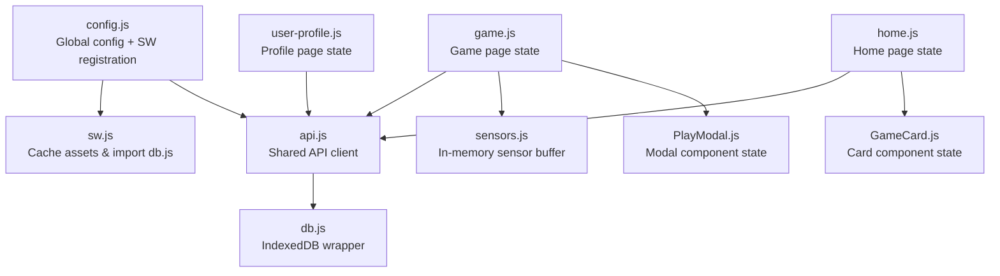
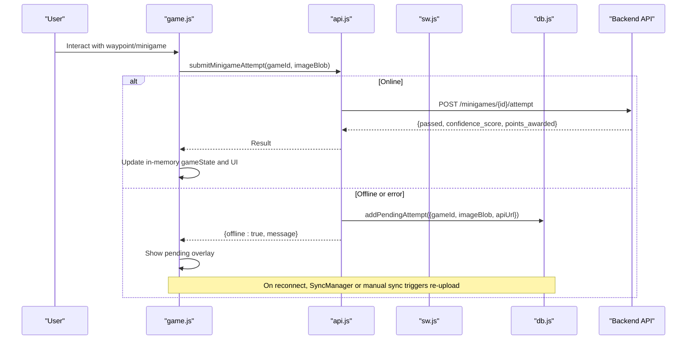
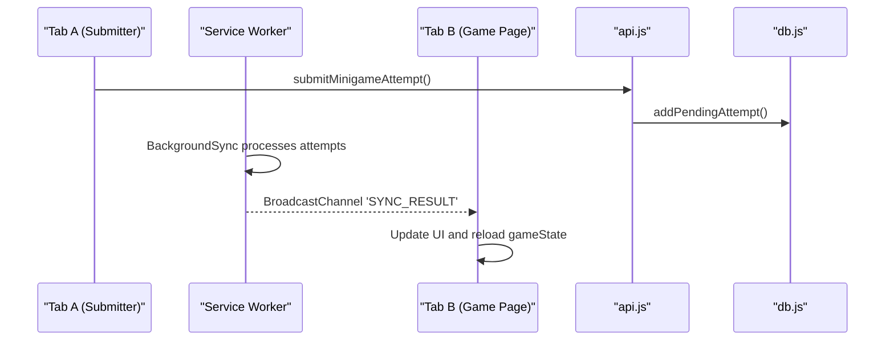
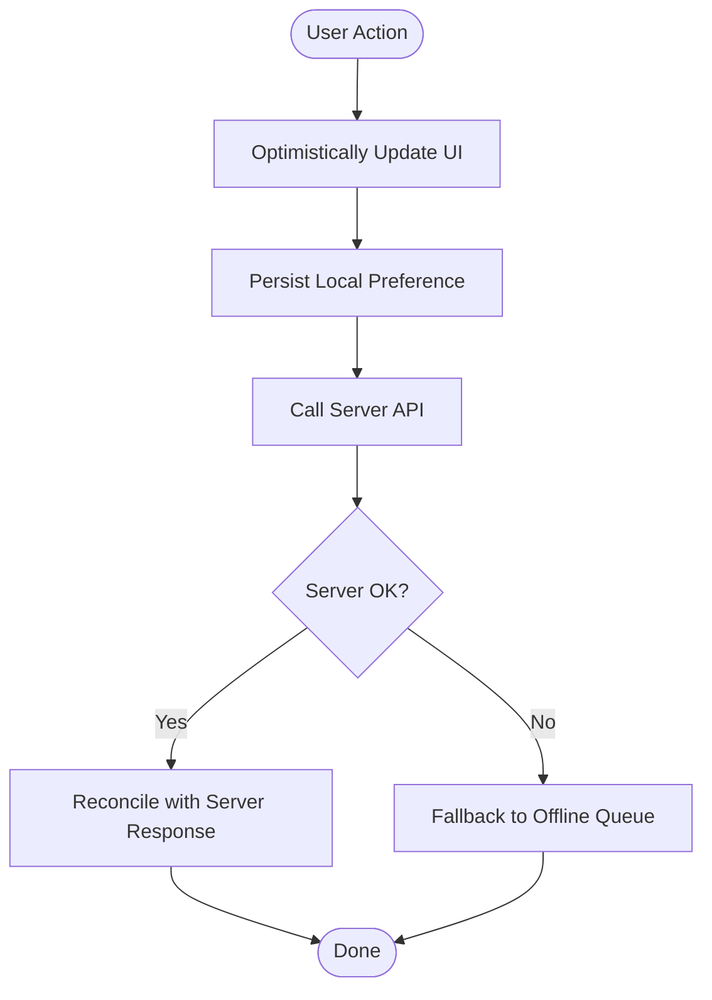
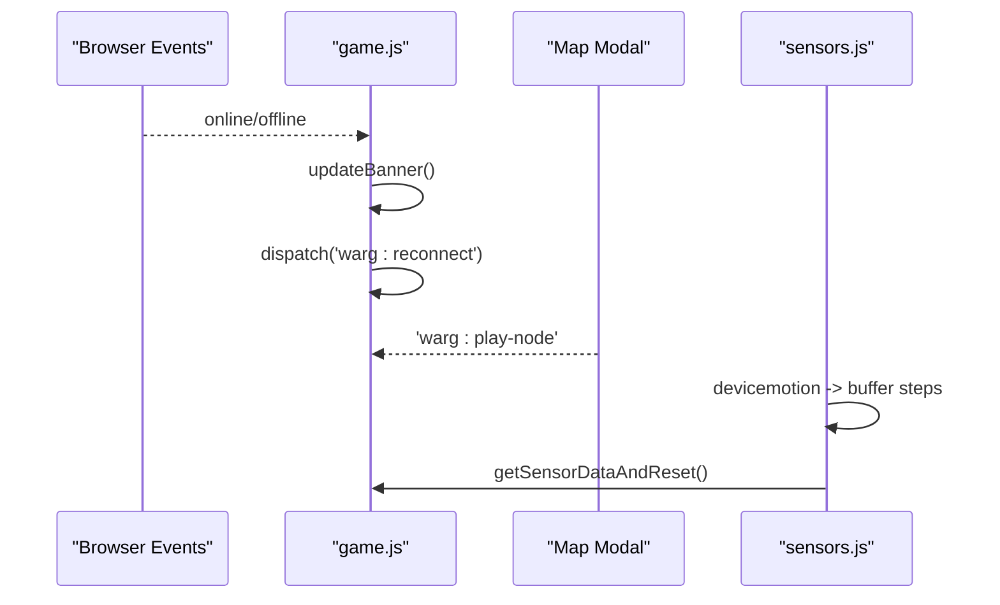
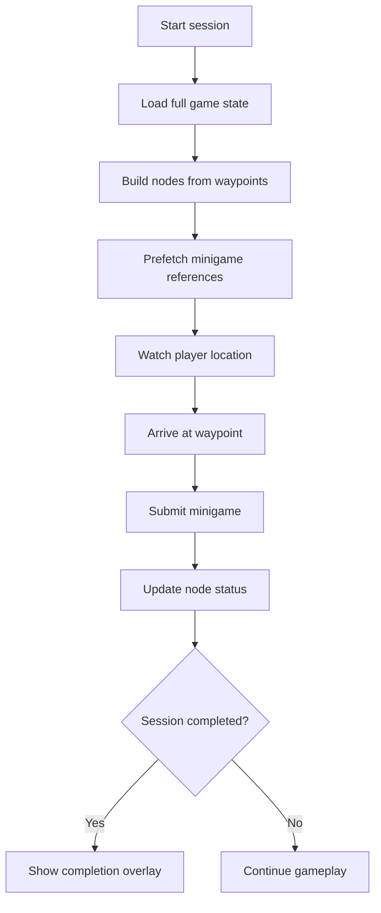
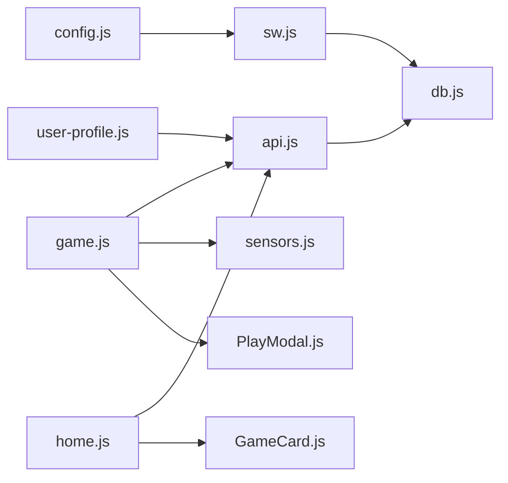

# State Management Patterns

<cite>
**Referenced Files in This Document**
- [config.js](file://client/scripts/config.js)
- [db.js](file://client/scripts/db.js)
- [api.js](file://client/scripts/api.js)
- [sw.js](file://client/sw.js)
- [game.js](file://client/scripts/game.js)
- [home.js](file://client/scripts/home.js)
- [user-profile.js](file://client/scripts/user-profile.js)
- [sensors.js](file://client/scripts/sensors.js)
- [PlayModal.js](file://client/scripts/components/PlayModal.js)
- [GameCard.js](file://client/scripts/components/GameCard.js)
</cite>

## Table of Contents
1. [Introduction](#introduction)
2. [Project Structure](#project-structure)
3. [Core Components](#core-components)
4. [Architecture Overview](#architecture-overview)
5. [Detailed Component Analysis](#detailed-component-analysis)
6. [Dependency Analysis](#dependency-analysis)
7. [Performance Considerations](#performance-considerations)
8. [Troubleshooting Guide](#troubleshooting-guide)
9. [Conclusion](#conclusion)

## Introduction
This document explains how the vanilla JavaScript client manages application state across pages and sessions. It covers:
- Persistent storage using `localStorage` for user preferences and small UI state
- IndexedDB-backed offline persistence for game attempts and cached puzzles
- In-memory runtime state objects for active game sessions, sensor data, and UI components
- Synchronization patterns between tabs and pages via events and BroadcastChannel
- Event-driven state changes, optimistic UI updates, and server reconciliation
- Data validation approaches for forms and inputs
- Examples for game state management, user profile state, and form state handling
- Persistence strategies, serialization, and migration considerations for version updates

## Project Structure
The client is organized by feature scripts that share a global API layer and configuration:
- Configuration and service worker registration live in a small bootstrap script
- A shared API client normalizes responses and encapsulates network calls
- Offline caching uses an IndexedDB wrapper and Service Worker cache
- Page-specific scripts manage local DOM state, event listeners, and interactions with the API
- Reusable UI components encapsulate modal and card state

**Diagram sources**
- [config.js:1-30](file://client/scripts/config.js#L1-L30)
- [sw.js:1-48](file://client/sw.js#L1-L48)
- [api.js:1-401](file://client/scripts/api.js#L1-L401)
- [db.js:1-94](file://client/scripts/db.js#L1-L94)
- [game.js:1-838](file://client/scripts/game.js#L1-L838)
- [home.js:1-755](file://client/scripts/home.js#L1-L755)
- [user-profile.js:1-126](file://client/scripts/user-profile.js#L1-L126)
- [sensors.js:1-58](file://client/scripts/sensors.js#L1-L58)
- [PlayModal.js:1-163](file://client/scripts/components/PlayModal.js#L1-L163)
- [GameCard.js:382-412](file://client/scripts/components/GameCard.js#L382-L412)

**Section sources**
- [config.js:1-30](file://client/scripts/config.js#L1-L30)
- [sw.js:1-48](file://client/sw.js#L1-L48)
- [api.js:1-401](file://client/scripts/api.js#L1-L401)
- [db.js:1-94](file://client/scripts/db.js#L1-L94)

## Core Components
- Global configuration and environment detection: sets API base URL and registers the service worker
- Shared API client: wraps fetch calls, normalizes data, handles offline fallbacks, and exposes typed helpers
- Offline persistence: IndexedDB wrapper for puzzles and pending attempts; Service Worker caches static assets and dynamic minigame references
- Page controllers: manage in-memory state, render UI, handle events, and reconcile with server state
- Sensor subsystem: collects accelerometer and geolocation data into an in-memory buffer for anti-spoofing payloads
- UI components: encapsulate modal and card states, exposing APIs to update UI without direct DOM manipulation from page scripts

Key responsibilities:
- `config.js`: Environment setup and SW registration
- `api.js`: Network abstraction, normalization, offline attempt queuing, cache busting
- `db.js`: IndexedDB operations for offline data
- `sw.js`: Cache strategy and asset pre-caching
- `game.js`: Game session lifecycle, map state, voting, comments, reconnect sync
- `home.js`: User/guest flows, friends, recent games, feedback form state
- `user-profile.js`: Profile rendering and library display
- `sensors.js`: Motion and location buffer management
- `PlayModal.js`: Modal open/close, controls injection, feedback overlay
- `GameCard.js`: Local vote state and optimistic UI

**Section sources**
- [config.js:1-30](file://client/scripts/config.js#L1-L30)
- [api.js:1-401](file://client/scripts/api.js#L1-L401)
- [db.js:1-94](file://client/scripts/db.js#L1-L94)
- [sw.js:1-48](file://client/sw.js#L1-L48)
- [game.js:1-838](file://client/scripts/game.js#L1-L838)
- [home.js:1-755](file://client/scripts/home.js#L1-L755)
- [user-profile.js:1-126](file://client/scripts/user-profile.js#L1-L126)
- [sensors.js:1-58](file://client/scripts/sensors.js#L1-L58)
- [PlayModal.js:1-163](file://client/scripts/components/PlayModal.js#L1-L163)
- [GameCard.js:382-412](file://client/scripts/components/GameCard.js#L382-L412)

## Architecture Overview
State flows through several layers:
- Runtime in-memory state (e.g., `gameState`, sensor buffers, modal state)
- Browser storage (`localStorage` for small preferences, IndexedDB for larger offline payloads)
- Network layer (API client with normalized responses)
- Service Worker cache (static assets and dynamic minigame reference images)
- Cross-tab/page communication (BroadcastChannel and custom events)

**Diagram sources**
- [api.js:255-294](file://client/scripts/api.js#L255-L294)
- [db.js:48-79](file://client/scripts/db.js#L48-L79)
- [game.js:398-440](file://client/scripts/game.js#L398-L440)

**Section sources**
- [api.js:255-294](file://client/scripts/api.js#L255-L294)
- [db.js:48-79](file://client/scripts/db.js#L48-L79)
- [game.js:398-440](file://client/scripts/game.js#L398-L440)

## Detailed Component Analysis

### Local Storage Usage for Persistent Data
- Voting preference persistence: The game page and GameCard component read/write a JSON object under the key `warg_votes`. This stores per-ARG votes locally to reflect user choices even before server confirmation.
- Dismissed recent games: The home page persists an array of dismissed ARG IDs under `warg_dismissed_recent` to hide recently played cards after removal.

Patterns:
- Read with safe parsing and default values
- Write only after successful user interaction
- Update UI optimistically, then reconcile with server response

Validation:
- JSON parse wrapped in try/catch to tolerate malformed entries
- Defensive checks for missing keys and null values

**Section sources**
- [game.js:234-241](file://client/scripts/game.js#L234-L241)
- [game.js:308-316](file://client/scripts/game.js#L308-L316)
- [GameCard.js:169-169](file://client/scripts/components/GameCard.js#L169-L169)
- [GameCard.js:426-436](file://client/scripts/components/GameCard.js#L426-L436)
- [home.js:288-289](file://client/scripts/home.js#L288-L289)
- [home.js:316-317](file://client/scripts/home.js#L316-L317)
- [home.js:597-601](file://client/scripts/home.js#L597-L601)

### IndexedDB for Offline Caching and Pending Attempts
- Puzzles store: keyed by URL, includes timestamp for freshness
- Pending attempts store: auto-increment ID, used to queue image submissions when offline
- Operations exposed via a wrapper module attached to global scope for both window and service worker contexts

Migration:
- Database version is defined and schema created on upgrade; new stores are added conditionally

Error handling:
- All operations wrap IndexedDB requests in promises with explicit success/error handlers

**Section sources**
- [db.js:4-24](file://client/scripts/db.js#L4-L24)
- [db.js:26-46](file://client/scripts/db.js#L26-L46)
- [db.js:48-79](file://client/scripts/db.js#L48-L79)
- [db.js:81-94](file://client/scripts/db.js#L81-L94)

### In-Memory State Objects for Runtime Data
- Game state: loaded once per session, holds waypoints, progress, edges, and session status; updated during gameplay to reflect unlocked/completed nodes
- Sensor buffer: coordinate buffer and step count maintained in memory, reset after submission to prevent stale data
- Modal state: PlayModal encapsulates open/close state, control injection, and feedback overlays

Complexity:
- Game state transformation maps server data to UI-friendly structures
- Sensor buffer bounded to last N entries to limit memory growth

**Section sources**
- [game.js:141-165](file://client/scripts/game.js#L141-L165)
- [game.js:166-191](file://client/scripts/game.js#L166-L191)
- [game.js:517-604](file://client/scripts/game.js#L517-L604)
- [sensors.js:4-58](file://client/scripts/sensors.js#L4-L58)
- [PlayModal.js:7-21](file://client/scripts/components/PlayModal.js#L7-L21)
- [PlayModal.js:47-81](file://client/scripts/components/PlayModal.js#L47-L81)
- [PlayModal.js:94-157](file://client/scripts/components/PlayModal.js#L94-L157)

### Synchronization Patterns Between Pages
- BroadcastChannel: Used to communicate sync results between tabs/pages when offline attempts are processed
- Custom events: Dispatched for reconnect and node play actions to trigger UI updates and state reconciliation
- Service Worker sync: Registers background sync tasks for pending attempts; manual postMessage fallback if SyncManager is unavailable

**Diagram sources**
- [game.js:68-113](file://client/scripts/game.js#L68-L113)
- [api.js:255-294](file://client/scripts/api.js#L255-L294)
- [db.js:48-79](file://client/scripts/db.js#L48-L79)

**Section sources**
- [game.js:68-113](file://client/scripts/game.js#L68-L113)
- [api.js:255-294](file://client/scripts/api.js#L255-L294)
- [db.js:48-79](file://client/scripts/db.js#L48-L79)

### State Update Patterns and Optimistic UI
- Voting: Toggles UI immediately, persists local vote, then reconciles with server counts and action flags
- Recent games removal: Emits a custom event to persist dismissal and remove the card from the DOM
- Minigame submission: Shows immediate feedback; if offline, marks as pending and updates overlay accordingly

**Diagram sources**
- [game.js:277-344](file://client/scripts/game.js#L277-L344)
- [home.js:592-612](file://client/scripts/home.js#L592-L612)
- [api.js:255-294](file://client/scripts/api.js#L255-L294)

**Section sources**
- [game.js:277-344](file://client/scripts/game.js#L277-L344)
- [home.js:592-612](file://client/scripts/home.js#L592-L612)
- [api.js:255-294](file://client/scripts/api.js#L255-L294)

### Event-Driven State Changes
- Connection banner listens to online/offline events and dispatches a custom reconnect event
- Map modal emits a play event consumed by the game page to launch minigames
- Sensor events feed into the in-memory buffer and are sent with waypoint arrival payloads

**Diagram sources**
- [game.js:14-48](file://client/scripts/game.js#L14-L48)
- [game.js:354-357](file://client/scripts/game.js#L354-L357)
- [sensors.js:9-23](file://client/scripts/sensors.js#L9-L23)
- [sensors.js:40-58](file://client/scripts/sensors.js#L40-L58)

**Section sources**
- [game.js:14-48](file://client/scripts/game.js#L14-L48)
- [game.js:354-357](file://client/scripts/game.js#L354-L357)
- [sensors.js:9-23](file://client/scripts/sensors.js#L9-L23)
- [sensors.js:40-58](file://client/scripts/sensors.js#L40-L58)

### Data Validation Approaches
- Form submission: Prevents default behavior, disables submit button, shows loading state, and restores state on error
- Field-level errors: Backend messages mapped to specific fields with visual indicators
- Input sanitization: Trimmed values before submission; basic presence checks before sending requests

Examples:
- Feedback form in home page validates presence and submits via API
- Signup flow displays field-specific errors returned by the backend

**Section sources**
- [home.js:654-677](file://client/scripts/home.js#L654-L677)
- [signup.js:109-144](file://client/scripts/signup.js#L109-L144)

### Game State Management
- Session start and state retrieval: Initializes sensors, loads waypoints and progress, and builds UI nodes
- Waypoint progression: Updates node statuses to unlocked/completed based on server responses
- Geofencing and sensor payload: Collects coordinates and motion data, sends with arrive request, and handles override prompts

**Diagram sources**
- [game.js:143-165](file://client/scripts/game.js#L143-L165)
- [game.js:193-218](file://client/scripts/game.js#L193-L218)
- [game.js:486-510](file://client/scripts/game.js#L486-L510)
- [game.js:554-604](file://client/scripts/game.js#L554-L604)

**Section sources**
- [game.js:143-165](file://client/scripts/game.js#L143-L165)
- [game.js:193-218](file://client/scripts/game.js#L193-L218)
- [game.js:486-510](file://client/scripts/game.js#L486-L510)
- [game.js:554-604](file://client/scripts/game.js#L554-L604)

### User Profile State
- Guest vs authenticated flows: Renders placeholder content for guests and populates stats/badges/library for logged-in users
- Avatar generation: Uses deterministic avatar URLs seeded by username
- Library rendering: Delegates to GameCard for consistent presentation

**Section sources**
- [user-profile.js:7-29](file://client/scripts/user-profile.js#L7-L29)
- [user-profile.js:31-63](file://client/scripts/user-profile.js#L31-L63)
- [user-profile.js:67-106](file://client/scripts/user-profile.js#L67-L106)
- [user-profile.js:108-123](file://client/scripts/user-profile.js#L108-L123)

### Form State Handling
- Feedback modal: Opens/closes, resets form on close, disables submit during processing, and shows toast notifications
- Friend request and removal: Disables buttons during async operations, restores state on failure, and refreshes lists on success

**Section sources**
- [home.js:614-677](file://client/scripts/home.js#L614-L677)
- [home.js:735-754](file://client/scripts/home.js#L735-L754)

### Service Worker and Cache Strategy
- Static asset caching: Pre-caches HTML, CSS, JS, and component files
- Dynamic cache: Stores minigame reference images for offline use
- Cache busting: Provides utility to clear ARG and catalogue caches for development

**Section sources**
- [sw.js:1-48](file://client/sw.js#L1-L48)
- [api.js:224-253](file://client/scripts/api.js#L224-L253)
- [api.js:320-344](file://client/scripts/api.js#L320-L344)

## Dependency Analysis

**Diagram sources**
- [config.js:1-30](file://client/scripts/config.js#L1-L30)
- [sw.js:1-48](file://client/sw.js#L1-L48)
- [db.js:1-94](file://client/scripts/db.js#L1-L94)
- [api.js:1-401](file://client/scripts/api.js#L1-L401)
- [game.js:1-838](file://client/scripts/game.js#L1-L838)
- [home.js:1-755](file://client/scripts/home.js#L1-L755)
- [user-profile.js:1-126](file://client/scripts/user-profile.js#L1-L126)
- [sensors.js:1-58](file://client/scripts/sensors.js#L1-L58)
- [PlayModal.js:1-163](file://client/scripts/components/PlayModal.js#L1-L163)
- [GameCard.js:382-412](file://client/scripts/components/GameCard.js#L382-L412)

**Section sources**
- [config.js:1-30](file://client/scripts/config.js#L1-L30)
- [sw.js:1-48](file://client/sw.js#L1-L48)
- [db.js:1-94](file://client/scripts/db.js#L1-L94)
- [api.js:1-401](file://client/scripts/api.js#L1-L401)
- [game.js:1-838](file://client/scripts/game.js#L1-L838)
- [home.js:1-755](file://client/scripts/home.js#L1-L755)
- [user-profile.js:1-126](file://client/scripts/user-profile.js#L1-L126)
- [sensors.js:1-58](file://client/scripts/sensors.js#L1-L58)
- [PlayModal.js:1-163](file://client/scripts/components/PlayModal.js#L1-L163)
- [GameCard.js:382-412](file://client/scripts/components/GameCard.js#L382-L412)

## Performance Considerations
- Prefer in-memory state for transient UI to avoid unnecessary disk I/O
- Bound sensor buffers to limit memory usage and reduce payload size
- Use optimistic UI updates to improve perceived responsiveness
- Batch DOM updates where possible (e.g., building node arrays before rendering)
- Leverage Service Worker caching for static assets and frequently accessed images
- Clear caches selectively to avoid bloating storage during development

[No sources needed since this section provides general guidance]

## Troubleshooting Guide
Common issues and resolutions:
- Offline submission failures: Check pending attempts in IndexedDB and ensure SyncManager is available; otherwise rely on manual sync via postMessage
- Stale cache causing outdated ARG data: Use the provided cache-clearing utility to bust stale entries
- Sensor data not included: Verify device motion permissions and confirm buffer population before submitting waypoint arrival
- Vote state mismatch: Inspect localStorage for corrupted entries and re-sync with server response

**Section sources**
- [api.js:255-294](file://client/scripts/api.js#L255-L294)
- [api.js:320-344](file://client/scripts/api.js#L320-L344)
- [sensors.js:25-38](file://client/scripts/sensors.js#L25-L38)
- [sensors.js:40-58](file://client/scripts/sensors.js#L40-L58)

## Conclusion
The application employs a pragmatic state management approach tailored for vanilla JavaScript:
- Small persistent preferences in `localStorage`
- Robust offline persistence via IndexedDB and Service Worker caching
- Rich in-memory runtime state for gameplay, sensors, and UI components
- Event-driven synchronization across tabs and pages
- Optimistic UI updates with server reconciliation
- Clear separation of concerns between page controllers, API client, and reusable components

This pattern balances simplicity, performance, and resilience, enabling smooth user experiences even under intermittent connectivity.

[No sources needed since this section summarizes without analyzing specific files]