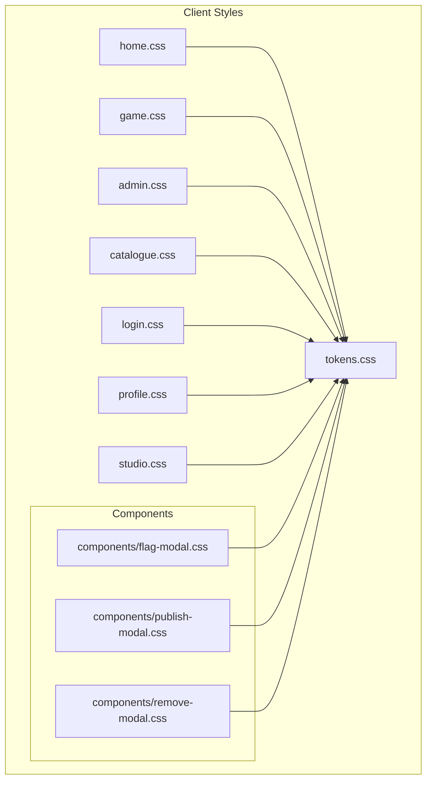
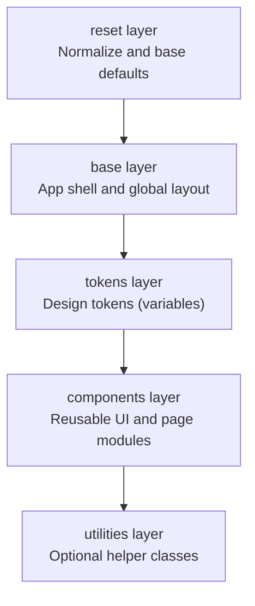
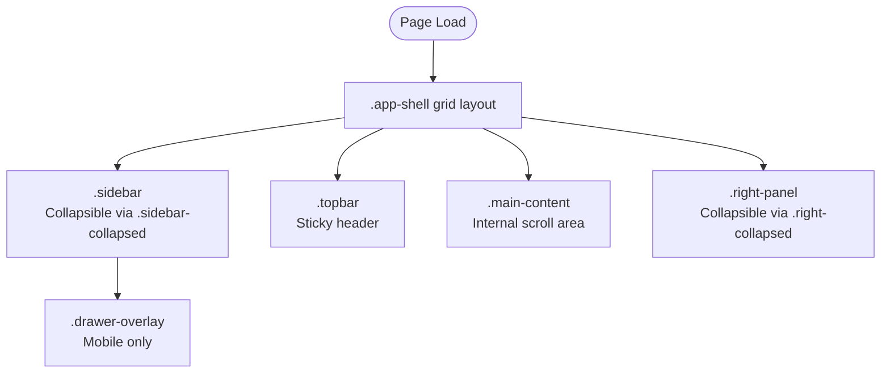
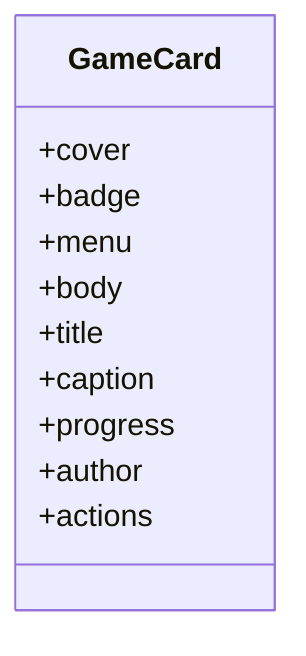
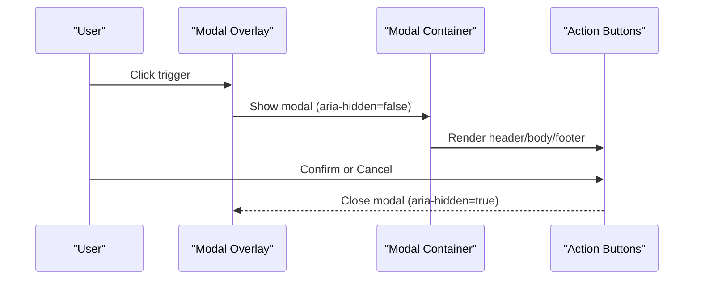
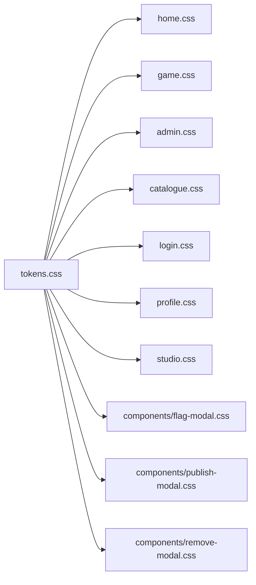

# Styling System & Design Tokens

<cite>
**Referenced Files in This Document**
- [tokens.css](file://client/styles/tokens.css)
- [home.css](file://client/styles/home.css)
- [game.css](file://client/styles/game.css)
- [admin.css](file://client/styles/admin.css)
- [catalogue.css](file://client/styles/catalogue.css)
- [login.css](file://client/styles/login.css)
- [profile.css](file://client/styles/profile.css)
- [studio.css](file://client/styles/studio.css)
- [flag-modal.css](file://client/styles/components/flag-modal.css)
- [publish-modal.css](file://client/styles/components/publish-modal.css)
- [remove-modal.css](file://client/styles/components/remove-modal.css)
</cite>

## Table of Contents
1. [Introduction](#introduction)
2. [Project Structure](#project-structure)
3. [Core Components](#core-components)
4. [Architecture Overview](#architecture-overview)
5. [Detailed Component Analysis](#detailed-component-analysis)
6. [Dependency Analysis](#dependency-analysis)
7. [Performance Considerations](#performance-considerations)
8. [Troubleshooting Guide](#troubleshooting-guide)
9. [Conclusion](#conclusion)

## Introduction
This document explains the WARG Platform’s CSS design system built on custom properties (CSS variables). It covers the design tokens approach for colors, typography, spacing, and responsive breakpoints; the modular CSS organization with component-specific stylesheets and global styles; responsive patterns including a mobile-first layout strategy; cross-browser compatibility techniques; examples of using design tokens to build reusable components; and guidance for naming conventions, architecture principles, and performance optimization such as minification and caching.

The styling system is centered around a single token file that defines the visual vocabulary used across page-specific stylesheets and shared component styles.

## Project Structure
The client-side styling lives under `client/styles`. The most important structure is:

- Global tokens and layer declarations: `tokens.css`
- Page-level stylesheets: `home.css`, `game.css`, `admin.css`, `catalogue.css`, `login.css`, `profile.css`, `studio.css`
- Shared UI components: `components/flag-modal.css`, `components/publish-modal.css`, `components/remove-modal.css`

**Diagram sources**
- [tokens.css:6-112](file://client/styles/tokens.css#L6-L112)
- [home.css:1-10](file://client/styles/home.css#L1-L10)
- [game.css:1-12](file://client/styles/game.css#L1-L12)
- [admin.css:1-12](file://client/styles/admin.css#L1-L12)
- [catalogue.css:1-10](file://client/styles/catalogue.css#L1-L10)
- [login.css:1-10](file://client/styles/login.css#L1-L10)
- [profile.css:1-12](file://client/styles/profile.css#L1-L12)
- [studio.css:1-12](file://client/styles/studio.css#L1-L12)
- [flag-modal.css:1-15](file://client/styles/components/flag-modal.css#L1-L15)
- [publish-modal.css:1-15](file://client/styles/components/publish-modal.css#L1-L15)
- [remove-modal.css:1-15](file://client/styles/components/remove-modal.css#L1-L15)

**Section sources**
- [tokens.css:6-112](file://client/styles/tokens.css#L6-L112)
- [home.css:1-10](file://client/styles/home.css#L1-L10)
- [game.css:1-12](file://client/styles/game.css#L1-L12)
- [admin.css:1-12](file://client/styles/admin.css#L1-L12)
- [catalogue.css:1-10](file://client/styles/catalogue.css#L1-L10)
- [login.css:1-10](file://client/styles/login.css#L1-L10)
- [profile.css:1-12](file://client/styles/profile.css#L1-L12)
- [studio.css:1-12](file://client/styles/studio.css#L1-L12)
- [flag-modal.css:1-15](file://client/styles/components/flag-modal.css#L1-L15)
- [publish-modal.css:1-15](file://client/styles/components/publish-modal.css#L1-L15)
- [remove-modal.css:1-15](file://client/styles/components/remove-modal.css#L1-L15)

## Core Components
The core of the design system is the token set defined in `tokens.css`. It establishes:

- Color palette: background, surface, card, overlay, brand, accent, secondary, text variants, borders, status colors, and scrollbar theming.
- Typography: font family and a scale of sizes and line heights for display, headings, body, and captions.
- Spacing: an 8pt-based spacing scale.
- Border radius: small, button/input, card/image, and full-radius values.
- Elevation/shadows: small, medium, large, and glow effects.
- Transitions: easing curves and durations.
- Layout tokens: sidebar widths, right panel width, topbar height, and touch target size.

These tokens are consumed by all page styles and component styles, ensuring consistent visuals across the platform.

Key token categories:
- Colors: semantic roles like primary brand, accent, secondary, success/warning/danger, and text/border variants.
- Typography: Inter font family, type scale, weights, and line-heights.
- Spacing: consistent 4px/8px grid steps.
- Radius: consistent corner radii for controls and cards.
- Shadows: layered elevation and glow for interactive elements.
- Motion: standardized easing and duration tokens.
- Layout: structural dimensions for shell layouts and touch targets.

**Section sources**
- [tokens.css:10-112](file://client/styles/tokens.css#L10-L112)

## Architecture Overview
The styling architecture follows a layered approach using CSS Cascade Layers:

- reset: browser normalization and base defaults.
- base: foundational element styles and app shell.
- tokens: design tokens (custom properties).
- components: reusable UI components and page-specific modules.
- utilities: utility classes (not present in this repository snapshot).

**Diagram sources**
- [home.css:7-19](file://client/styles/home.css#L7-L19)
- [tokens.css:6-11](file://client/styles/tokens.css#L6-L11)

**Section sources**
- [home.css:7-19](file://client/styles/home.css#L7-L19)
- [tokens.css:6-11](file://client/styles/tokens.css#L6-L11)

## Detailed Component Analysis

### Design Tokens: Colors, Typography, Spacing, and Layout
The token file centralizes the design language:

- Colors:
  - Backgrounds: console black, elevated surfaces, cards, overlays.
  - Brand and accents: computational beige brand color, phosphor-tint accent, secondary phosphor green.
  - Text: primary, secondary, muted, and on-accent contrast.
  - Borders: subtle borders, hover states, and accent borders.
  - Status: success, warning, danger, online/away/offline indicators.
  - Scrollbars: themed thumb and track.

- Typography:
  - Font family: Inter with system fallbacks.
  - Type scale: display through caption sizes.
  - Weights: regular, medium, semibold, bold.
  - Line heights: matched to each type level for readability.

- Spacing:
  - 8pt grid: from 4px to 64px increments.

- Radius:
  - Small, button/input, card/image, and full-radius for pills.

- Elevation:
  - Shadow scale for depth and glow effects.

- Motion:
  - Easing curves and durations for smooth transitions.

- Layout:
  - Sidebar widths (expanded and collapsed), right panel width, topbar height, and touch target sizing.

Usage examples:
- Body and text use tokenized font family, size, line height, and color.
- Buttons and inputs use tokenized radius, spacing, and focus states.
- Cards and modals use tokenized shadows, borders, and backgrounds.

**Section sources**
- [tokens.css:10-112](file://client/styles/tokens.css#L10-L112)
- [home.css:21-34](file://client/styles/home.css#L21-L34)

### App Shell and Layout Patterns
The home stylesheet defines the main application shell:

- Grid-based three-column layout: left sidebar, main content, right panel.
- Topbar positioned at the top with sticky behavior.
- Collapsible sidebars via class toggles and CSS custom property overrides.
- Overlay backdrops for mobile drawers.

Responsive behavior:
- Mobile-first approach with drawer overlays on small screens.
- Desktop uses fixed-height grid with internal scrolling for main content.

Accessibility and UX:
- Touch targets sized consistently.
- Focus-visible outlines for keyboard navigation.
- Smooth transitions for collapsible panels.

**Diagram sources**
- [home.css:46-77](file://client/styles/home.css#L46-L77)
- [home.css:83-99](file://client/styles/home.css#L83-L99)
- [home.css:105-268](file://client/styles/home.css#L105-L268)
- [home.css:274-416](file://client/styles/home.css#L274-L416)
- [home.css:422-450](file://client/styles/home.css#L422-L450)

**Section sources**
- [home.css:46-77](file://client/styles/home.css#L46-L77)
- [home.css:83-99](file://client/styles/home.css#L83-L99)
- [home.css:105-268](file://client/styles/home.css#L105-L268)
- [home.css:274-416](file://client/styles/home.css#L274-L416)
- [home.css:422-450](file://client/styles/home.css#L422-L450)

### Game Card Component
The game card is a reusable component styled within the home stylesheet:

- Card structure: cover, badge, menu, body, title, caption, progress, author, actions.
- Hover and active states with transform and shadow effects.
- Progress bar using gradient fill and tokenized colors.
- Action buttons with consistent icon sizing and interaction feedback.

Naming convention:
- Component-scoped prefix `gc-*` to avoid collisions and clarify ownership.

**Diagram sources**
- [home.css:522-800](file://client/styles/home.css#L522-L800)

**Section sources**
- [home.css:522-800](file://client/styles/home.css#L522-L800)

### Modals and Overlays
Shared modal patterns are implemented per feature but follow consistent structure:

- Overlay backdrop with blur and z-index management.
- Modal container with header, body, footer, and close button.
- Animation states controlled by attribute selectors (`aria-hidden="false"`).
- Tokenized spacing, radius, shadows, and colors.

Examples:
- Flag modal: form fields, spinner animation, success button style.
- Publish modal: confirmation dialog with action buttons.
- Remove modal: destructive action confirmation.

**Diagram sources**
- [flag-modal.css:5-42](file://client/styles/components/flag-modal.css#L5-L42)
- [publish-modal.css:5-42](file://client/styles/components/publish-modal.css#L5-L42)
- [remove-modal.css:5-42](file://client/styles/components/remove-modal.css#L5-L42)

**Section sources**
- [flag-modal.css:5-160](file://client/styles/components/flag-modal.css#L5-L160)
- [publish-modal.css:5-105](file://client/styles/components/publish-modal.css#L5-L105)
- [remove-modal.css:5-101](file://client/styles/components/remove-modal.css#L5-L101)

### Login Form and Inputs
The login stylesheet demonstrates consistent input and button patterns:

- Form groups with labels, inputs, and error messages.
- Primary button with tokenized colors, radius, and hover/active/disabled states.
- Avatar selection grid with selection state and hover effects.
- Social login button styling.

Token usage:
- Spacing, radius, colors, and typography tokens ensure consistency with other pages.

**Section sources**
- [login.css:24-342](file://client/styles/login.css#L24-L342)

### Profile Page
Profile styles showcase structured sections:

- Banner and profile picture with edit controls.
- Stats grid with hover interactions.
- Badges grid with icons and labels.
- Friend action buttons with primary and secondary styles.

Responsive adjustments:
- Stacked layout on smaller screens.

**Section sources**
- [profile.css:5-315](file://client/styles/profile.css#L5-L315)

### Catalogue Page
Catalogue styles include:

- Header and control bar with filter chips and sort controls.
- Responsive grid layout for game cards.
- Pagination controls with active state styling.

Token usage:
- Spacing, radius, colors, and typography tokens applied consistently.

**Section sources**
- [catalogue.css:5-148](file://client/styles/catalogue.css#L5-L148)

### Admin Dashboard
Admin styles provide:

- Header and description.
- Controls grid with search card.
- Section headers and titles.

Responsive considerations:
- Single-column layout on smaller screens.

**Section sources**
- [admin.css:5-109](file://client/styles/admin.css#L5-L109)

### Studio Hero
Studio hero section includes:

- Gradient background with glow effect.
- Title, subtitle, and call-to-action button.
- Hover animations and responsive typography.

**Section sources**
- [studio.css:1-96](file://client/styles/studio.css#L1-L96)

### Game Page Timeline and Play Modal
Game page styles define:

- Map placeholder and timeline progress tracker.
- Timeline nodes and edges with state styles.
- Popover for node details.
- Current node brief with play button and actions.
- Play modal with canvas wrapper and controls.

Responsive behavior:
- Bottom sheet modal on mobile devices.

**Section sources**
- [game.css:6-808](file://client/styles/game.css#L6-L808)

## Dependency Analysis
The dependency graph shows how page and component styles depend on the token layer:

**Diagram sources**
- [tokens.css:10-112](file://client/styles/tokens.css#L10-L112)
- [home.css:1-10](file://client/styles/home.css#L1-L10)
- [game.css:1-12](file://client/styles/game.css#L1-L12)
- [admin.css:1-12](file://client/styles/admin.css#L1-L12)
- [catalogue.css:1-10](file://client/styles/catalogue.css#L1-L10)
- [login.css:1-10](file://client/styles/login.css#L1-L10)
- [profile.css:1-12](file://client/styles/profile.css#L1-L12)
- [studio.css:1-12](file://client/styles/studio.css#L1-L12)
- [flag-modal.css:1-15](file://client/styles/components/flag-modal.css#L1-L15)
- [publish-modal.css:1-15](file://client/styles/components/publish-modal.css#L1-L15)
- [remove-modal.css:1-15](file://client/styles/components/remove-modal.css#L1-L15)

**Section sources**
- [tokens.css:10-112](file://client/styles/tokens.css#L10-L112)
- [home.css:1-10](file://client/styles/home.css#L1-L10)
- [game.css:1-12](file://client/styles/game.css#L1-L12)
- [admin.css:1-12](file://client/styles/admin.css#L1-L12)
- [catalogue.css:1-10](file://client/styles/catalogue.css#L1-L10)
- [login.css:1-10](file://client/styles/login.css#L1-L10)
- [profile.css:1-12](file://client/styles/profile.css#L1-L12)
- [studio.css:1-12](file://client/styles/studio.css#L1-L12)
- [flag-modal.css:1-15](file://client/styles/components/flag-modal.css#L1-L15)
- [publish-modal.css:1-15](file://client/styles/components/publish-modal.css#L1-L15)
- [remove-modal.css:1-15](file://client/styles/components/remove-modal.css#L1-L15)

## Performance Considerations
To optimize CSS performance and maintainability:

- Minification:
  - Use a CSS minifier during build to reduce payload size.
  - Ensure comments and whitespace are stripped in production builds.

- Caching:
  - Serve CSS files with long-lived cache headers.
  - Use content hashing in filenames for cache busting when tokens change.

- Layer ordering:
  - Keep cascade layers ordered correctly to avoid specificity wars and unnecessary reflows.

- Avoid heavy effects:
  - Limit backdrop-filter and complex gradients where possible, especially on mobile.

- Reduce repaints:
  - Prefer transform and opacity for animations.
  - Use will-change sparingly for elements that animate frequently.

- Asset loading:
  - Use aspect-ratio for media to prevent layout shift.
  - Lazy-load non-critical styles if appropriate.

[No sources needed since this section provides general guidance]

## Troubleshooting Guide
Common issues and resolutions:

- Variables not resolving:
  - Ensure `tokens.css` is loaded before page styles.
  - Verify variable names match exactly and are scoped to `:root`.

- Z-index conflicts:
  - Check overlay and modal z-index values; ensure they are higher than page content.

- Mobile drawer visibility:
  - Confirm `.drawer-overlay.is-visible` is applied when toggling.

- Focus states missing:
  - Add `:focus-visible` rules for keyboard accessibility.

- Scrollbar theming inconsistencies:
  - Provide fallbacks for browsers without `scrollbar-color` support.

- Responsive breakpoints:
  - Align breakpoints across pages (e.g., 768px) for consistent behavior.

**Section sources**
- [home.css:83-99](file://client/styles/home.css#L83-L99)
- [flag-modal.css:5-42](file://client/styles/components/flag-modal.css#L5-L42)
- [publish-modal.css:5-42](file://client/styles/components/publish-modal.css#L5-L42)
- [remove-modal.css:5-42](file://client/styles/components/remove-modal.css#L5-L42)

## Conclusion
The WARG Platform’s CSS design system is built on a robust token layer that standardizes colors, typography, spacing, radius, shadows, motion, and layout dimensions. Page and component styles consume these tokens to maintain visual consistency while enabling flexible, responsive layouts. The modular organization separates global tokens from page-specific and component-specific styles, improving maintainability and scalability. By following the documented naming conventions, responsive patterns, and performance practices, teams can extend the system confidently and keep the interface cohesive across devices and browsers.

[No sources needed since this section summarizes without analyzing specific files]